# IOE-DREAM智慧园区一卡通管理平台业务架构

## 业务架构概述

IOE-DREAM智慧园区一卡通管理平台是一套基于多模态生物识别技术的智慧园区综合管理解决方案。平台以"一卡通"为核心，整合身份认证、门禁控制、考勤管理、消费服务、视频监控、访客管理等业务功能，通过AI智能分析和数据融合技术，为园区提供安全、便捷、智能的全方位管理服务。

### 业务价值定位

#### 核心业务价值
- **身份统一管理**：建立统一的数字身份体系，支持多模态生物识别
- **无感通行体验**：实现刷脸、刷卡、NFC等多种方式的便捷通行
- **智能安全保障**：通过AI分析和多系统联动，提供全方位安全保障
- **数据驱动决策**：基于大数据分析，为园区管理提供决策支持
- **运营效率提升**：自动化处理流程，降低运营成本，提升管理效率

#### 目标用户群体
- **园区管理方**：提供统一的管理平台和数据分析能力
- **企业员工**：享受便捷的一卡通服务和智能化体验
- **访客人员**：提供预约、导航、指引等便捷服务
- **安保人员**：获得智能化的安防监控和预警能力
- **系统管理员**：拥有完整的系统配置和维护能力

## 业务功能架构

### 整体业务功能地图

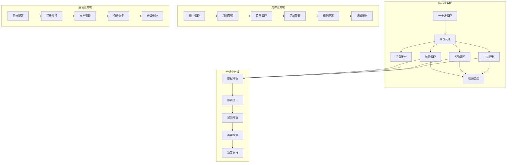

### 业务流程架构

```mermaid
graph TD
    subgraph "用户生命周期"
        A[用户注册] --> B[身份采集]
        B --> C[权限分配]
        C --> D[服务开通]
        D --> E[日常使用]
        E --> F[权限变更]
        F --> G[服务终止]
    end

    subgraph "访客管理流程"
        H[访客预约] --> I[预约审批]
        I --> J[身份验证]
        J --> K[权限发放]
        K --> L[访问过程]
        L --> M[权限回收]
    end

    subgraph "门禁控制流程"
        N[身份识别] --> O[权限验证]
        O --> P[门禁开启]
        P --> Q[通行记录]
        Q --> R[轨迹追踪]
    end

    subgraph "消费服务流程"
        S[消费发起] --> T[身份验证]
        T --> U[余额检查]
        U --> V[支付处理]
        V --> W[交易记录]
    end

    subgraph "考勤管理流程"
        X[打卡触发] --> Y[身份验证]
        Y --> Z[考勤记录]
        Z --> AA[规则校验]
        AA --> BB[结果处理]
    end
```

## 核心业务域设计

### 1. 一卡通管理域

#### 业务能力模型

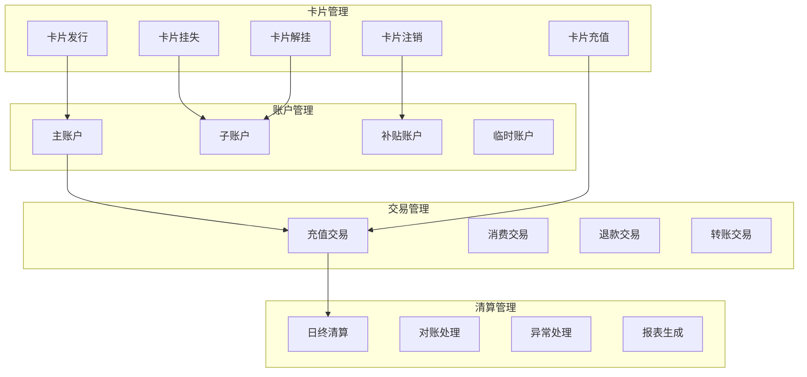

#### 业务规则设计

```yaml
# 卡片业务规则
card_business_rules:
  # 发卡规则
  issuance:
    - rule_id: "CARD_ISSUANCE_001"
      description: "员工卡发行规则"
      conditions:
        - employee_status: "在职"
        - identity_verified: true
        - no_pending_cards: true
      actions:
        - generate_card_number
        - create_physical_card
        - activate_account
      restrictions:
        - max_cards_per_employee: 3
        - card_validity_years: 5

  # 充值规则
  recharge:
    - rule_id: "CARD_RECHARGE_001"
      description: "卡片充值规则"
      conditions:
        - card_status: "正常"
        - account_status: "活跃"
      actions:
        - validate_amount
        - process_payment
        - update_balance
      limits:
        - min_recharge_amount: 10
        - max_recharge_amount: 10000
        - daily_recharge_limit: 50000

  # 消费规则
  consumption:
    - rule_id: "CARD_CONSUMPTION_001"
      description: "卡片消费规则"
      conditions:
        - sufficient_balance: true
        - valid_merchant: true
      actions:
        - validate_transaction
        - deduct_balance
        - record_transaction
      security:
        - daily_consumption_limit: 2000
        - single_transaction_limit: 500
        - risk_score_threshold: 80
```

### 2. 智能门禁域

#### 业务能力架构

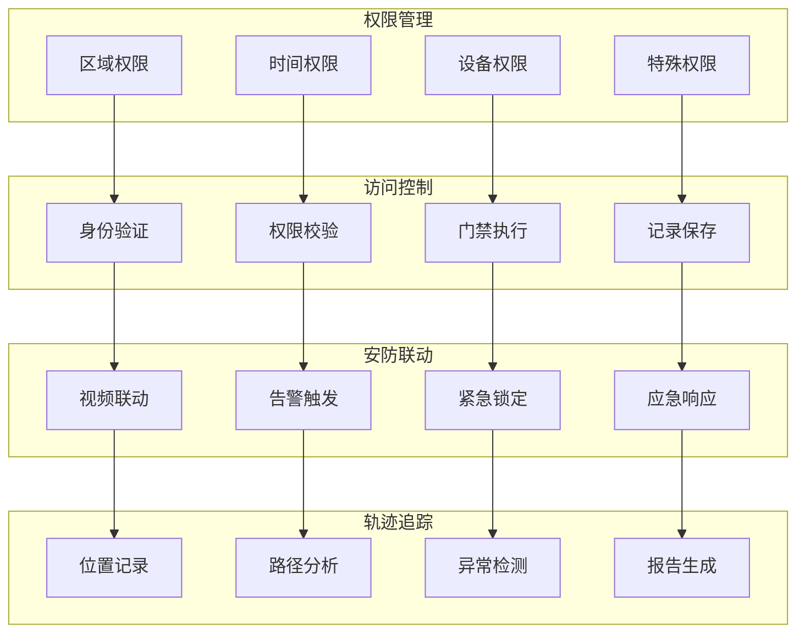

#### 访问控制业务流程

```java
@Service
public class AccessControlBusinessService {

    /**
     * 访问控制业务处理
     */
    public AccessControlResult processAccessControl(AccessControlRequest request) {
        // 1. 身份验证
        IdentityVerificationResult identityResult = verifyIdentity(request);
        if (!identityResult.isSuccess()) {
            return AccessControlResult.denied("身份验证失败");
        }

        // 2. 权限校验
        PermissionCheckResult permissionResult = checkPermission(
            identityResult.getUserId(), request.getAccessPoint());

        if (!permissionResult.isGranted()) {
            // 3. 记录拒绝访问
            recordAccessDenied(identityResult, request, permissionResult.getReason());
            return AccessControlResult.denied(permissionResult.getReason());
        }

        // 4. 执行门禁操作
        DoorOperationResult doorResult = executeDoorOperation(request.getDeviceId());
        if (!doorResult.isSuccess()) {
            return AccessControlResult.error("门禁操作失败");
        }

        // 5. 记录成功访问
        recordAccessGranted(identityResult, request);

        // 6. 触发联动服务
        triggerAccessControlEvents(identityResult, request);

        return AccessControlResult.granted();
    }

    /**
     * 权限校验业务规则
     */
    private PermissionCheckResult checkPermission(Long userId, AccessPoint accessPoint) {
        // 1. 基础权限检查
        UserPermissions permissions = getUserPermissions(userId);
        if (!permissions.hasAccessToArea(accessPoint.getAreaId())) {
            return PermissionCheckResult.denied("无区域访问权限");
        }

        // 2. 时间权限检查
        if (!permissions.isWithinTimeWindow(accessPoint.getAccessTime())) {
            return PermissionCheckResult.denied("不在有效时间范围内");
        }

        // 3. 设备权限检查
        if (!permissions.hasDeviceAccess(accessPoint.getDeviceId())) {
            return PermissionCheckResult.denied("无设备访问权限");
        }

        // 4. 特殊规则检查
        SpecialRuleResult specialRuleResult = checkSpecialRules(userId, accessPoint);
        if (!specialRuleResult.isAllowed()) {
            return PermissionCheckResult.denied(specialRuleResult.getReason());
        }

        // 5. 风险评估
        RiskAssessmentResult riskResult = assessAccessRisk(userId, accessPoint);
        if (riskResult.getRiskLevel() > RISK_THRESHOLD) {
            return PermissionCheckResult.denied("风险评估未通过");
        }

        return PermissionCheckResult.granted();
    }
}
```

### 3. 考勤管理域

#### 考勤业务模型

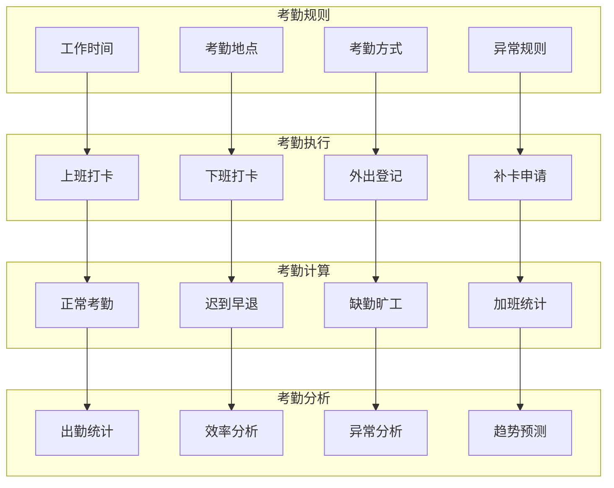

#### 智能考勤业务规则

```java
@Service
public class AttendanceBusinessService {

    /**
     * 智能考勤处理
     */
    public AttendanceResult processAttendance(AttendanceEvent event) {
        // 1. 验证考勤事件
        AttendanceValidationResult validation = validateAttendanceEvent(event);
        if (!validation.isValid()) {
            return AttendanceResult.rejected(validation.getErrorMessage());
        }

        // 2. 获取适用的考勤规则
        List<AttendanceRule> rules = getApplicableRules(event.getEmployeeId(), event.getAttendanceDate());

        // 3. 执行考勤规则引擎
        RuleExecutionResult ruleResult = executeAttendanceRules(event, rules);
        if (!ruleResult.isSuccess()) {
            return AttendanceResult.failed(ruleResult.getErrorMessage());
        }

        // 4. 记录考勤结果
        AttendanceRecord record = createAttendanceRecord(event, ruleResult);
        saveAttendanceRecord(record);

        // 5. 触发后续业务
        triggerAttendanceEvents(record);

        return AttendanceResult.success(record);
    }

    /**
     * 考勤规则引擎
     */
    private RuleExecutionResult executeAttendanceRules(AttendanceEvent event,
                                                       List<AttendanceRule> rules) {
        RuleExecutionContext context = RuleExecutionContext.builder()
            .event(event)
            .rules(rules)
            .build();

        for (AttendanceRule rule : rules) {
            RuleResult result = rule.execute(context);
            if (!result.isSuccess()) {
                return RuleExecutionResult.failed(result.getErrorMessage());
            }

            context.addRuleResult(rule.getRuleId(), result);
        }

        return RuleExecutionResult.success(context.getAllResults());
    }
}
```

### 4. 消费服务域

#### 消费业务架构

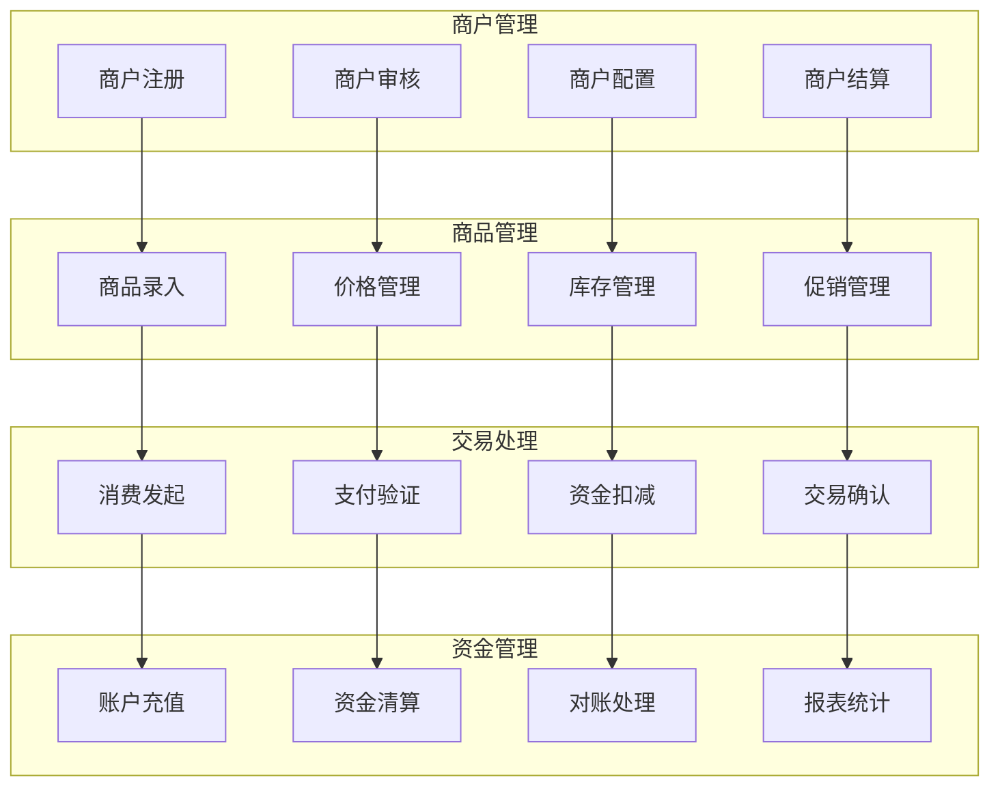

#### 智能消费业务逻辑

```java
@Service
public class ConsumptionBusinessService {

    /**
     * 消费业务处理
     */
    public ConsumptionResult processConsumption(ConsumptionRequest request) {
        // 1. 业务规则验证
        BusinessRuleValidationResult ruleValidation = validateBusinessRules(request);
        if (!ruleValidation.isValid()) {
            return ConsumptionResult.rejected(ruleValidation.getErrorMessage());
        }

        // 2. 账户余额检查
        AccountBalanceResult balanceResult = checkAccountBalance(
            request.getUserId(), request.getAmount());

        if (!balanceResult.hasSufficientBalance()) {
            return ConsumptionResult.insufficientBalance();
        }

        // 3. 执行资金扣减
        FundDeductionResult deductionResult = deductFunds(request);
        if (!deductionResult.isSuccess()) {
            return ConsumptionResult.failed("资金扣减失败");
        }

        // 4. 记录交易
        TransactionRecord transaction = createTransactionRecord(request, deductionResult);
        saveTransaction(transaction);

        // 5. 更新商户数据
        updateMerchantData(request);

        // 6. 触发后续业务
        triggerConsumptionEvents(transaction);

        return ConsumptionResult.success(transaction);
    }

    /**
     * 业务规则验证
     */
    private BusinessRuleValidationResult validateBusinessRules(ConsumptionRequest request) {
        List<BusinessRule> rules = getBusinessRules(request.getMerchantId());

        for (BusinessRule rule : rules) {
            RuleValidationResult result = rule.validate(request);
            if (!result.isValid()) {
                return BusinessRuleValidationResult.invalid(result.getErrorMessage());
            }
        }

        return BusinessRuleValidationResult.valid();
    }
}
```

### 5. 访客管理域

#### 访客业务流程

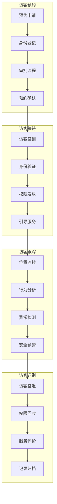

### 6. 视频监控域

#### 视频监控业务架构

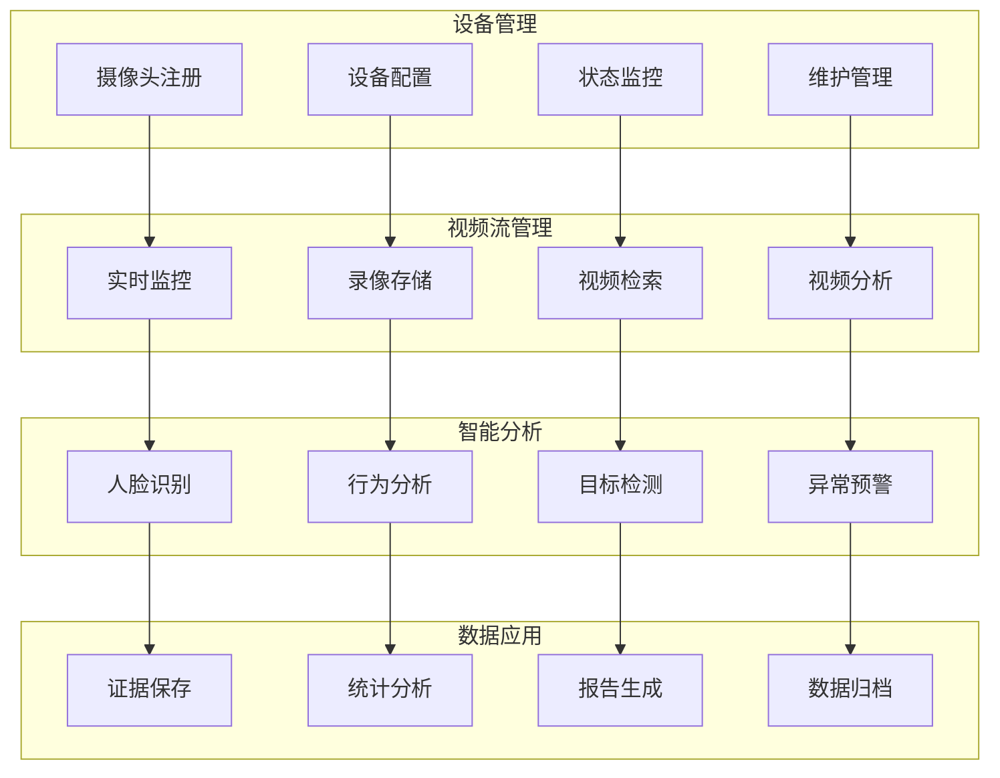

## 跨域业务集成

### 业务事件驱动架构

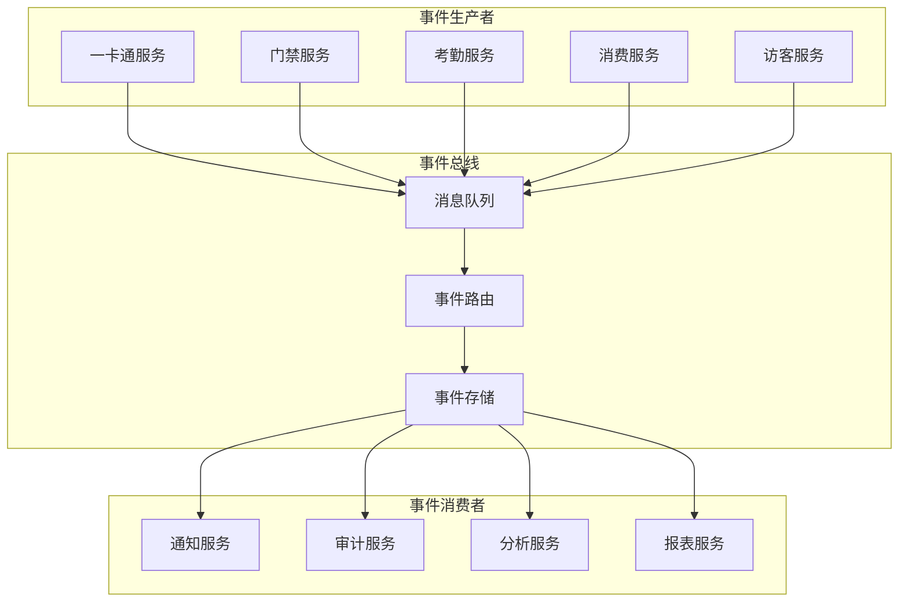

### 业务集成场景

#### 1. 门禁与考勤联动

```java
@Service
public class AccessAttendanceIntegrationService {

    /**
     * 门禁考勤联动处理
     */
    @EventListener
    public void handleAccessEvent(AccessEvent event) {
        if (isAttendanceAccessPoint(event.getAccessPointId())) {
            // 创建考勤记录
            AttendanceEvent attendanceEvent = AttendanceEvent.builder()
                .userId(event.getUserId())
                .accessPointId(event.getAccessPointId())
                .timestamp(event.getTimestamp())
                .accessType(event.getAccessType())
                .build();

            // 发布考勤事件
            eventPublisher.publishEvent(attendanceEvent);
        }
    }
}
```

#### 2. 视频监控与安全预警

```java
@Service
public class VideoSecurityIntegrationService {

    /**
     * 视频分析安全预警
     */
    @Scheduled(fixedRate = 30000) // 每30秒检查一次
    public void checkVideoSecurityEvents() {
        // 1. 获取未处理的视频分析结果
        List<VideoAnalysisResult> results = videoAnalysisService.getUnprocessedResults();

        for (VideoAnalysisResult result : results) {
            if (result.hasSecurityThreat()) {
                // 2. 创建安全预警事件
                SecurityAlertEvent alertEvent = SecurityAlertEvent.builder()
                    .alertType(result.getThreatType())
                    .location(result.getLocation())
                    .timestamp(result.getTimestamp())
                    .confidence(result.getConfidence())
                    .build();

                // 3. 发布安全预警
                securityAlertService.publishAlert(alertEvent);

                // 4. 通知相关人员
                notifySecurityPersonnel(alertEvent);
            }
        }
    }
}
```

## 业务数据分析

### 数据分析业务架构

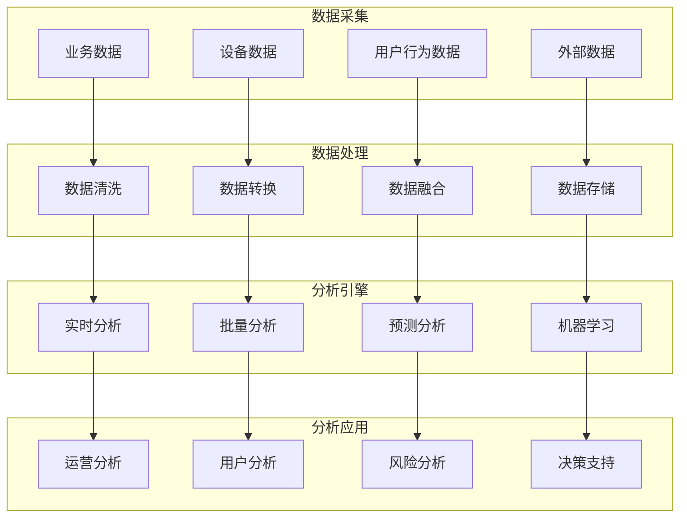

### 核心KPI指标体系

```yaml
# 业务KPI指标体系
business_kpis:
  # 一卡通管理
  card_management:
    - kpi_id: "CARD_ISSUANCE_RATE"
      name: "卡片发放率"
      description: "员工卡片发放完成率"
      target: 0.95
      calculation: "已发卡员工数 / 应发卡员工总数"

    - kpi_id: "CARD_RECHARGE_AMOUNT"
      name: "卡片充值金额"
      description: "月度卡片充值总金额"
      target: 1000000
      calculation: "SUM(月度充值金额)"

    - kpi_id: "TRANSACTION_SUCCESS_RATE"
      name: "交易成功率"
      description: "消费交易成功完成率"
      target: 0.99
      calculation: "成功交易数 / 总交易数"

  # 门禁管理
  access_control:
    - kpi_id: "ACCESS_RESPONSE_TIME"
      name: "门禁响应时间"
      description: "平均门禁验证响应时间"
      target: 500
      unit: "毫秒"

    - kpi_id: "UNAUTHORIZED_ACCESS_RATE"
      name: "未授权访问率"
      description: "未授权访问尝试占总访问的比例"
      target: 0.01
      calculation: "未授权访问次数 / 总访问次数"

  # 考勤管理
  attendance:
    - kpi_id: "ATTENDANCE_RATE"
      name: "考勤率"
      description: "员工正常出勤率"
      target: 0.98
      calculation: "正常出勤天数 / 应出勤天数"

    - kpi_id: "LATE_RATE"
      name: "迟到率"
      description: "员工迟到比例"
      target: 0.05
      calculation: "迟到次数 / 总出勤次数"

  # 访客管理
  visitor_management:
    - kpi_id: "VISITOR_SATISFACTION"
      name: "访客满意度"
      description: "访客服务满意度评分"
      target: 4.5
      unit: "分"

    - kpi_id: "VISITOR_PROCESSING_TIME"
      name: "访客办理时间"
      description: "访客登记到入场的平均时间"
      target: 300
      unit: "秒"
```

## 业务流程优化

### 流程优化方法论

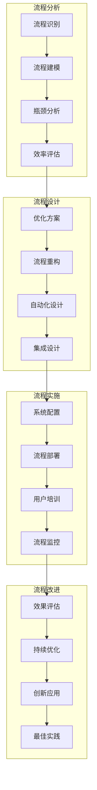

### 智能化流程优化

```java
@Service
public class BusinessProcessOptimizationService {

    /**
     * 基于AI的流程优化
     */
    public ProcessOptimizationResult optimizeProcess(ProcessDefinition process) {
        // 1. 流程数据分析
        ProcessAnalytics analytics = analyzeProcessData(process);

        // 2. 瓶颈识别
        List<ProcessBottleneck> bottlenecks = identifyBottlenecks(analytics);

        // 3. 优化建议生成
        List<OptimizationSuggestion> suggestions = generateOptimizationSuggestions(
            process, bottlenecks);

        // 4. 效果预测
        OptimizationPrediction prediction = predictOptimizationEffects(
            process, suggestions);

        // 5. 优化方案评估
        OptimizationEvaluation evaluation = evaluateOptimizationPlan(suggestions);

        return ProcessOptimizationResult.builder()
            .analytics(analytics)
            .bottlenecks(bottlenecks)
            .suggestions(suggestions)
            .prediction(prediction)
            .evaluation(evaluation)
            .build();
    }

    /**
     * 自动化流程优化
     */
    public void automateProcessOptimization() {
        // 1. 定期分析业务流程
        List<ProcessDefinition> processes = getAllActiveProcesses();

        for (ProcessDefinition process : processes) {
            // 2. 检测优化机会
            List<OptimizationOpportunity> opportunities = detectOptimizationOpportunities(process);

            // 3. 自动应用优化
            for (OptimizationOpportunity opportunity : opportunities) {
                if (opportunity.getConfidence() > OPTIMIZATION_THRESHOLD) {
                    applyAutomaticOptimization(process, opportunity);
                }
            }
        }
    }
}
```

## 业务创新与发展

### 创新业务模式

#### 1. 智能化服务

```yaml
# 智能化业务创新
intelligent_services:
  # 智能导航服务
  intelligent_navigation:
    - service_id: "SMART_NAVIGATION"
      name: "智能园区导航"
      description: "基于AI的园区内智能导航服务"
      features:
        - "路径规划优化"
        - "实时交通状况"
        - "个性化推荐"
        - "AR导航支持"

  # 智能推荐服务
  intelligent_recommendation:
    - service_id: "SMART_RECOMMENDATION"
      name: "智能服务推荐"
      description: "基于用户行为分析的个性化推荐"
      features:
        - "消费习惯分析"
        - "服务偏好推荐"
        - "时间预测建议"
        - "优惠活动推荐"

  # 智能预警服务
  intelligent_alert:
    - service_id: "SMART_ALERT"
      name: "智能风险预警"
      description: "基于大数据分析的风险预警服务"
      features:
        - "异常行为检测"
        - "安全风险评估"
        - "设备故障预测"
        - "业务异常预警"
```

#### 2. 生态化扩展

```java
@Service
public class BusinessEcosystemService {

    /**
     * 生态合作伙伴集成
     */
    public EcosystemIntegrationResult integrateEcosystemPartner(
            EcosystemPartner partner) {

        // 1. 合作伙伴资质验证
        PartnerValidationResult validation = validatePartner(partner);
        if (!validation.isValid()) {
            return EcosystemIntegrationResult.failed("合作伙伴验证失败");
        }

        // 2. 接口协议制定
        InterfaceProtocol protocol = createInterfaceProtocol(partner);

        // 3. 数据集成配置
        DataIntegrationConfig integrationConfig = configureDataIntegration(partner);

        // 4. 服务对接测试
        IntegrationTestResult testResult = performIntegrationTest(partner, protocol);
        if (!testResult.isSuccess()) {
            return EcosystemIntegrationResult.failed("服务对接测试失败");
        }

        // 5. 正式启用集成
        enableEcosystemIntegration(partner, protocol, integrationConfig);

        return EcosystemIntegrationResult.success(partner);
    }

    /**
     * 开放平台API管理
     */
    public OpenAPIResult manageOpenAPI(OpenAPIRequest request) {
        switch (request.getOperation()) {
            case CREATE_API:
                return createOpenAPI(request);
            case UPDATE_API:
                return updateOpenAPI(request);
            case DELETE_API:
                return deleteOpenAPI(request.getApiId());
            case QUERY_API:
                return queryOpenAPI(request.getQueryConditions());
            default:
                return OpenAPIResult.failed("不支持的操作类型");
        }
    }
}
```

### 业务扩展策略

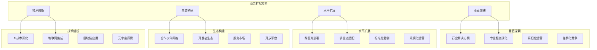

通过以上全面的业务架构设计，IOE-DREAM智慧园区一卡通管理平台具备了完整的业务能力，能够满足现代化智慧园区的各种业务需求，通过智能化、数字化的手段，为园区用户提供安全、便捷、高效的服务体验，同时为园区管理者提供强大的业务支撑和决策分析能力。