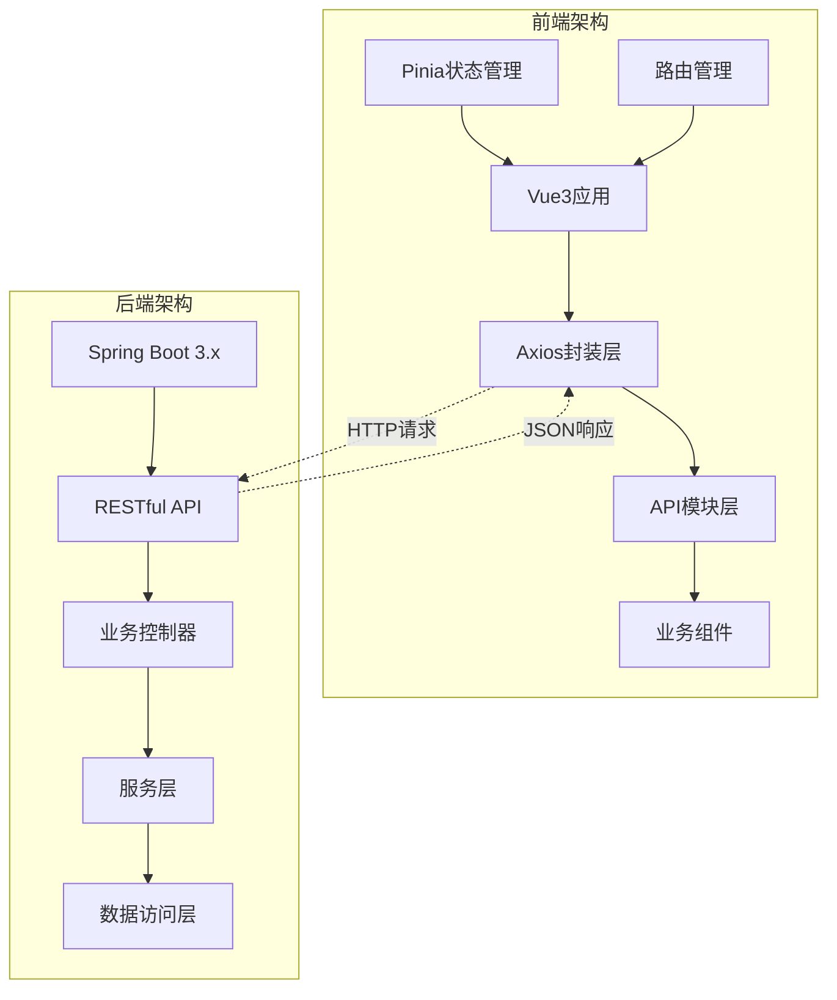
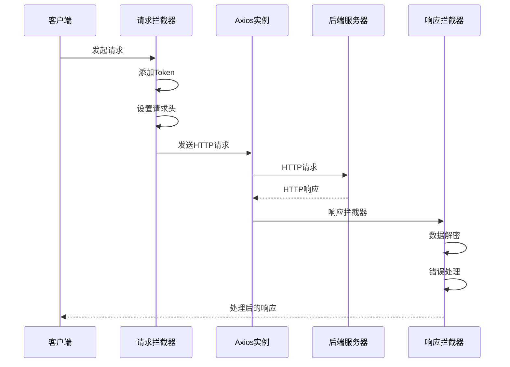
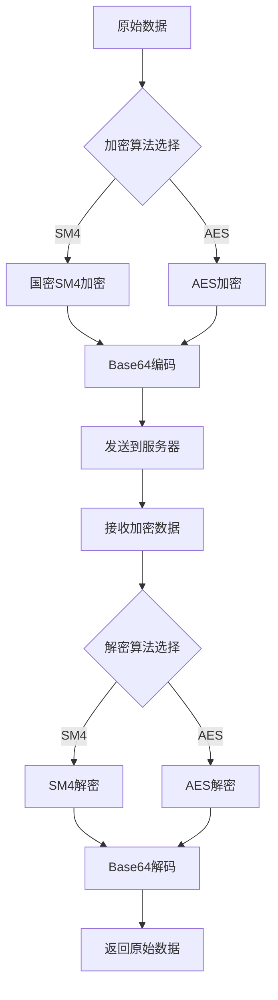
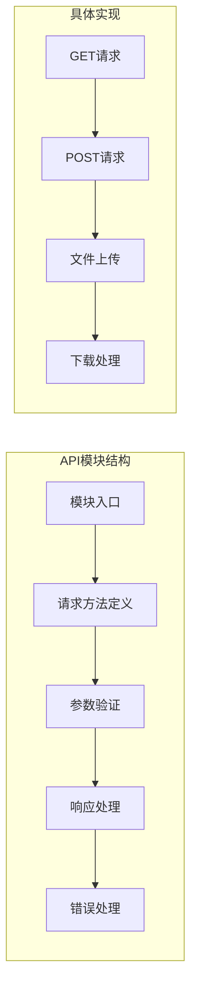
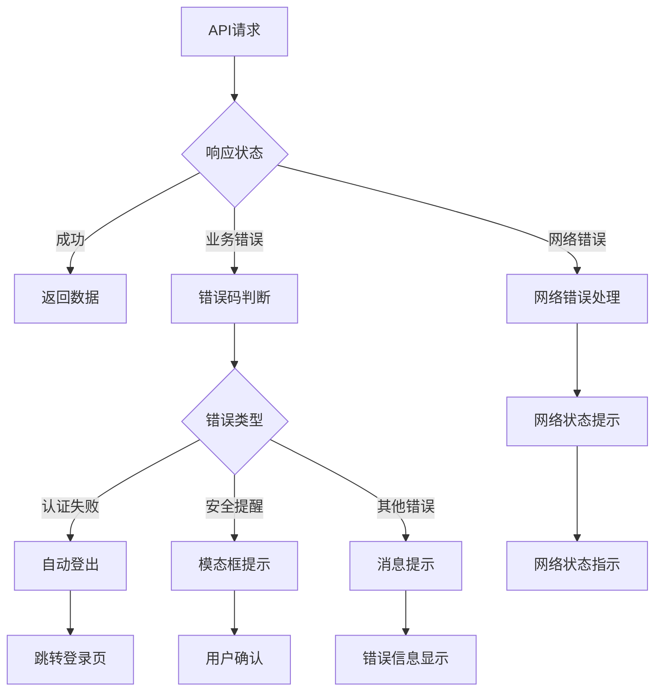
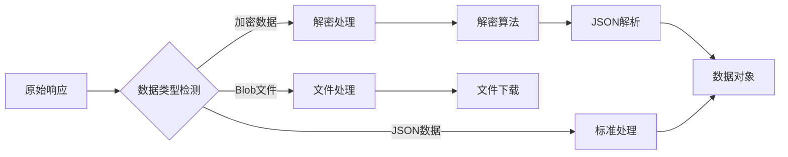
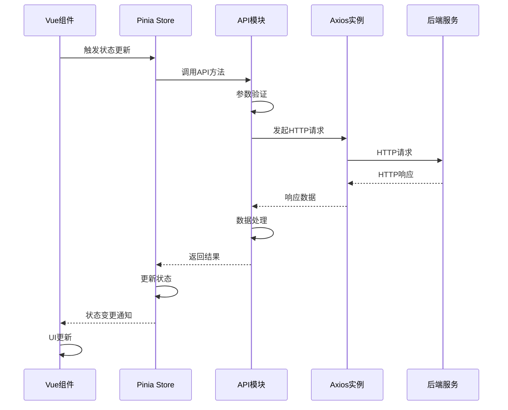
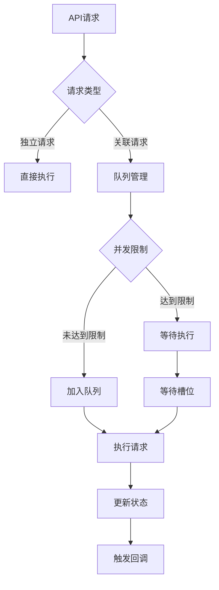
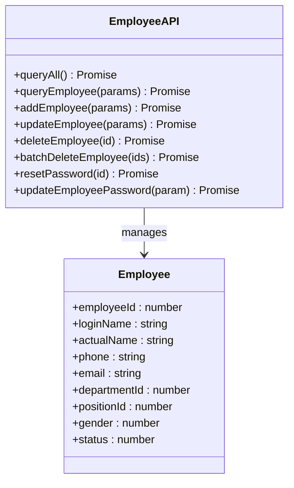

# API集成文档

<cite>
**本文档引用的文件**
- [axios.js](file://smart-admin-web-javascript/src/lib/axios.js)
- [employee-api.js](file://smart-admin-web-javascript/src/api/system/employee-api.js)
- [login-api.js](file://smart-admin-web-javascript/src/api/system/login-api.js)
- [consumption-api.js](file://smart-admin-web-javascript/src/api/business/consumption/consumption-api.js)
- [file-api.js](file://smart-admin-web-javascript/src/api/support/file-api.js)
- [operate-log-api.js](file://smart-admin-web-javascript/src/api/support/operate-log-api.js)
- [encrypt.js](file://smart-admin-web-javascript/src/lib/encrypt.js)
- [common-const.js](file://smart-admin-web-javascript/src/constants/common-const.js)
- [user.js](file://smart-admin-web-javascript/src/store/modules/system/user.js)
- [index.vue](file://smart-admin-web-javascript/src/views/business/consumption/dashboard/index.vue)
</cite>

## 目录
1. [简介](#简介)
2. [项目架构概述](#项目架构概述)
3. [Axios封装实现](#axios封装实现)
4. [API模块化组织](#api模块化组织)
5. [统一错误处理机制](#统一错误处理机制)
6. [请求参数序列化与响应数据反序列化](#请求参数序列化与响应数据反序列化)
7. [API调用流程](#api调用流程)
8. [性能优化策略](#性能优化策略)
9. [核心业务API示例](#核心业务api示例)
10. [最佳实践与规范](#最佳实践与规范)

## 简介

SmartAdmin是一个基于Vue3和Spring Boot的前后端分离企业级管理系统，提供了完整的API集成解决方案。本文档详细介绍了前端与后端API的交互模式，包括axios的封装实现、API模块化组织、错误处理机制以及性能优化策略。

## 项目架构概述

SmartAdmin采用现代化的前后端分离架构，前端使用Vue3 + Vite构建，后端基于Spring Boot 3.x，通过RESTful API进行通信。

**图表来源**
- [axios.js](file://smart-admin-web-javascript/src/lib/axios.js#L23-L251)
- [user.js](file://smart-admin-web-javascript/src/store/modules/system/user.js#L1-L50)

## Axios封装实现

### 核心配置

SmartAdmin对axios进行了深度封装，提供了统一的请求配置和拦截器机制。

**图表来源**
- [axios.js](file://smart-admin-web-javascript/src/lib/axios.js#L35-L127)

### 请求拦截器配置

请求拦截器负责：
- 自动添加认证Token
- 设置请求头信息
- 参数预处理

**章节来源**
- [axios.js](file://smart-admin-web-javascript/src/lib/axios.js#L35-L49)

### 响应拦截器配置

响应拦截器处理：
- 数据解密（如果启用加密）
- 错误状态码处理
- 统一错误提示
- Token过期处理

**章节来源**
- [axios.js](file://smart-admin-web-javascript/src/lib/axios.js#L55-L127)

### 加密机制

系统支持AES和国密SM4双重加密算法：

**图表来源**
- [encrypt.js](file://smart-admin-web-javascript/src/lib/encrypt.js#L43-L120)

**章节来源**
- [encrypt.js](file://smart-admin-web-javascript/src/lib/encrypt.js#L1-L121)

## API模块化组织

### 按业务领域划分

API采用三层模块化组织结构：

| 模块类别 | 路径 | 功能描述 | 示例API |
|---------|------|----------|---------|
| system | `/api/system/` | 系统基础功能 | 员工管理、角色管理、菜单管理 |
| business | `/api/business/` | 业务核心功能 | 消费管理、设备管理、视频监控 |
| support | `/api/support/` | 支撑功能 | 文件上传、操作日志、缓存管理 |

### API模块结构

每个API模块都遵循统一的命名规范和组织方式：

**图表来源**
- [employee-api.js](file://smart-admin-web-javascript/src/api/system/employee-api.js#L13-L99)
- [consumption-api.js](file://smart-admin-web-javascript/src/api/business/consumption/consumption-api.js#L10-L33)

**章节来源**
- [employee-api.js](file://smart-admin-web-javascript/src/api/system/employee-api.js#L1-L99)
- [login-api.js](file://smart-admin-web-javascript/src/api/system/login-api.js#L1-L55)
- [consumption-api.js](file://smart-admin-web-javascript/src/api/business/consumption/consumption-api.js#L1-L33)
- [file-api.js](file://smart-admin-web-javascript/src/api/support/file-api.js#L1-L39)

## 统一错误处理机制

### 错误分类处理

系统实现了完善的错误分类处理机制：

| 错误类型 | 状态码 | 处理策略 | 用户体验 |
|---------|--------|----------|----------|
| 认证失败 | 30007/30008 | 自动跳转登录页 | 显示重新登录提示 |
| 安全提醒 | 30010/30011 | 模态框警告 | 重要安全提示 |
| 会话超时 | 30012 | 强制登出 | 确认对话框 |
| 网络错误 | - | 友好提示 | 网络状态指示 |
| 业务异常 | 其他 | 消息提示 | 具体错误信息 |

### 错误处理流程

**图表来源**
- [axios.js](file://smart-admin-web-javascript/src/lib/axios.js#L78-L127)

**章节来源**
- [axios.js](file://smart-admin-web-javascript/src/lib/axios.js#L78-L127)

## 请求参数序列化与响应数据反序列化

### 参数序列化策略

系统采用多种参数序列化方式：

1. **GET请求参数**：自动序列化为URL查询字符串
2. **POST请求参数**：JSON格式序列化
3. **文件上传**：FormData格式处理
4. **批量操作**：数组或对象序列化

### 响应数据处理

**图表来源**
- [axios.js](file://smart-admin-web-javascript/src/lib/axios.js#L62-L76)

**章节来源**
- [axios.js](file://smart-admin-web-javascript/src/lib/axios.js#L62-L76)

## API调用流程

### 完整调用链路

**图表来源**
- [index.vue](file://smart-admin-web-javascript/src/views/business/consumption/dashboard/index.vue#L133-L200)
- [user.js](file://smart-admin-web-javascript/src/store/modules/system/user.js#L118-L140)

### 数据流管理

系统采用Pinia进行状态管理，实现数据的集中式管理：

**章节来源**
- [index.vue](file://smart-admin-web-javascript/src/views/business/consumption/dashboard/index.vue#L1-L200)
- [user.js](file://smart-admin-web-javascript/src/store/modules/system/user.js#L1-L800)

## 性能优化策略

### 请求缓存机制

虽然当前实现中没有显式的缓存机制，但可以通过以下方式实现：

1. **内存缓存**：在API模块中实现简单的内存缓存
2. **浏览器缓存**：利用HTTP缓存头控制
3. **状态缓存**：在Pinia store中缓存常用数据

### 并发控制

### 取消重复请求

系统通过以下机制避免重复请求：

1. **请求去重**：基于请求URL和参数的唯一标识
2. **加载状态管理**：防止同一操作多次触发
3. **防抖节流**：对频繁操作进行优化

**章节来源**
- [user.js](file://smart-admin-web-javascript/src/store/modules/system/user.js#L275-L308)

## 核心业务API示例

### 员工管理API

员工管理是系统的核心功能之一，提供了完整的CRUD操作：

**图表来源**
- [employee-api.js](file://smart-admin-web-javascript/src/api/system/employee-api.js#L13-L99)

### 消费管理API

消费管理系统提供了Dashboard统计和业务查询功能：

**章节来源**
- [employee-api.js](file://smart-admin-web-javascript/src/api/system/employee-api.js#L1-L99)
- [consumption-api.js](file://smart-admin-web-javascript/src/api/business/consumption/consumption-api.js#L1-L33)

### 文件上传API

文件管理功能支持多种文件类型的上传和管理：

**章节来源**
- [file-api.js](file://smart-admin-web-javascript/src/api/support/file-api.js#L1-L39)

### 操作日志API

系统提供了完整的历史操作追踪功能：

**章节来源**
- [operate-log-api.js](file://smart-admin-web-javascript/src/api/support/operate-log-api.js#L1-L26)

## 最佳实践与规范

### API命名规范

1. **模块命名**：使用小写字母和连字符
2. **方法命名**：采用camelCase格式
3. **参数命名**：使用有意义的英文单词
4. **响应格式**：统一的返回结构

### 错误处理规范

1. **错误码定义**：标准化的错误码体系
2. **错误信息**：用户友好的错误提示
3. **日志记录**：详细的错误日志追踪
4. **用户体验**：优雅的错误处理界面

### 性能优化建议

1. **请求合并**：将多个小请求合并为一个
2. **数据预加载**：提前加载可能需要的数据
3. **懒加载**：按需加载非关键资源
4. **缓存策略**：合理使用各种缓存机制

### 安全考虑

1. **数据加密**：敏感数据传输加密
2. **参数验证**：严格的输入参数验证
3. **权限控制**：细粒度的权限管理
4. **审计日志**：完整的操作审计记录

通过以上完整的API集成方案，SmartAdmin为开发者提供了强大而灵活的前后端交互能力，支持企业级应用的各种复杂需求。