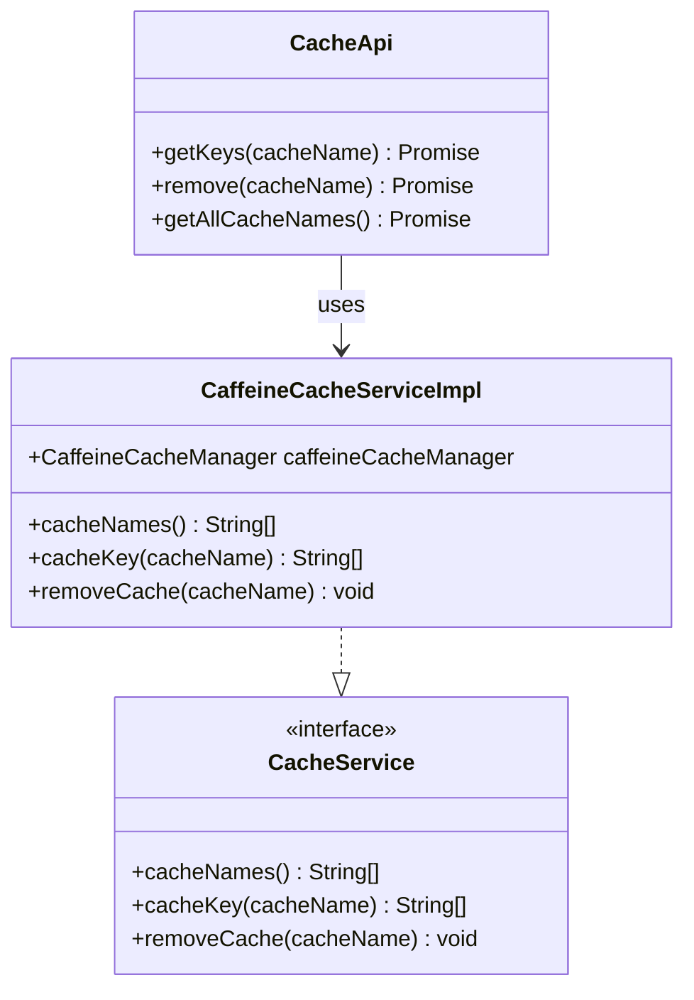
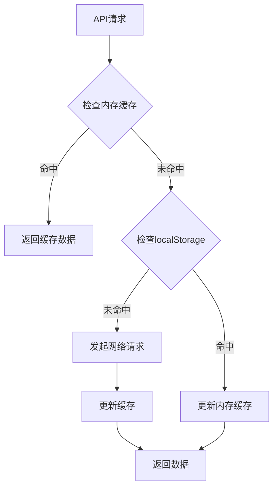
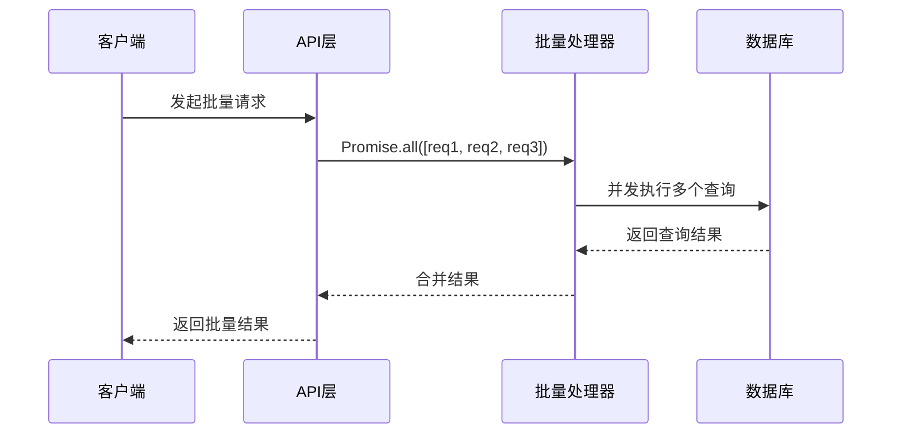
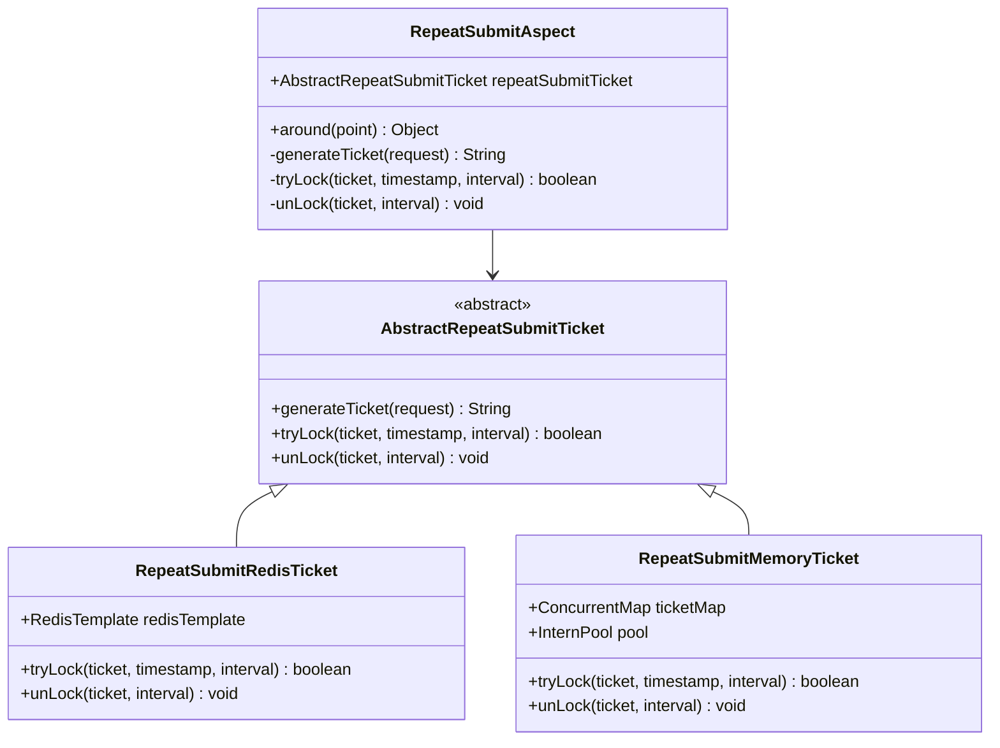
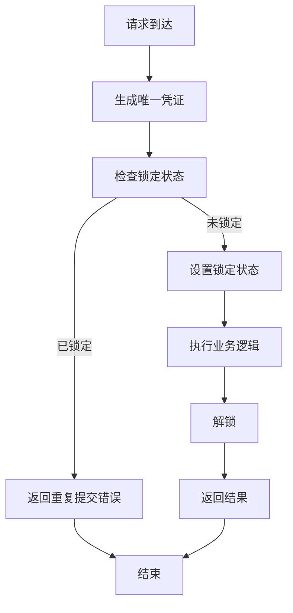
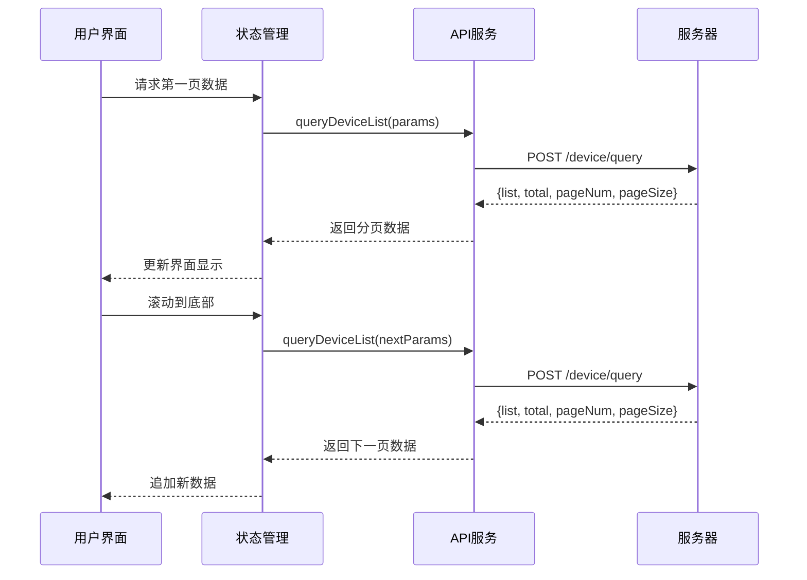
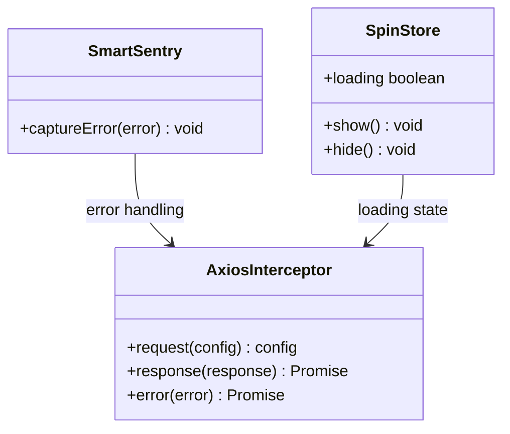
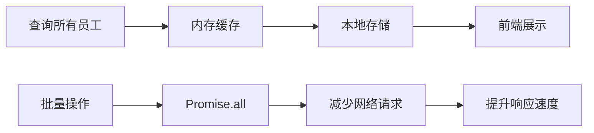

# API性能优化

<cite>
**本文档引用的文件**
- [axios.js](file://smart-admin-web-javascript/src/lib/axios.js)
- [cache-api.js](file://smart-admin-web-javascript/src/api/support/cache-api.js)
- [local-storage-key-const.js](file://smart-admin-web-javascript/src/constants/local-storage-key-const.js)
- [local-util.js](file://smart-admin-web-javascript/src/utils/local-util.js)
- [smart-sentry.js](file://smart-admin-web-javascript/src/lib/smart-sentry.js)
- [spin.js](file://smart-admin-web-javascript/src/store/modules/system/spin.js)
- [employee-api.js](file://smart-admin-web-javascript/src/api/system/employee-api.js)
- [device-api.js](file://smart-admin-web-javascript/src/api/business/smart-video/device-api.js)
- [RepeatSubmitConfig.java](file://smart-admin-api-java17-springboot3/sa-base/src/main/java/net/lab1024/sa/base/config/RepeatSubmitConfig.java)
- [RepeatSubmitAspect.java](file://smart-admin-api-java17-springboot3/sa-base/src/main/java/net/lab1024/sa/base/module/support/repeatsubmit/RepeatSubmitAspect.java)
- [CaffeineCacheServiceImpl.java](file://smart-admin-api-java17-springboot3/sa-base/src/main/java/net/lab1024/sa/base/module/support/cache/CaffeineCacheServiceImpl.java)
</cite>

## 目录
1. [概述](#概述)
2. [请求缓存机制](#请求缓存机制)
3. [并发请求控制](#并发请求控制)
4. [重复请求取消机制](#重复请求取消机制)
5. [大数据量接口优化](#大数据量接口优化)
6. [性能监控与调优](#性能监控与调优)
7. [实际案例分析](#实际案例分析)
8. [最佳实践建议](#最佳实践建议)

## 概述

API性能优化是提升用户体验和系统响应速度的关键环节。本项目通过多层次的优化策略，包括缓存机制、并发控制、重复请求防护和大数据量处理等技术手段，实现了高效的API交互体验。

### 核心优化策略

- **多层缓存架构**：内存缓存、localStorage缓存相结合
- **并发控制**：Promise.all批量请求优化
- **重复请求防护**：基于Redis和内存的防重复提交机制
- **分页加载**：大数据量接口的分页和懒加载策略
- **性能监控**：完整的错误捕获和性能追踪体系

## 请求缓存机制

### 内存缓存实现

项目采用Caffeine作为内存缓存解决方案，提供高性能的本地缓存能力。

**图表来源**
- [CaffeineCacheServiceImpl.java](file://smart-admin-api-java17-springboot3/sa-base/src/main/java/net/lab1024/sa/base/module/support/cache/CaffeineCacheServiceImpl.java#L1-L45)
- [cache-api.js](file://smart-admin-web-javascript/src/api/support/cache-api.js#L1-L26)

#### 缓存配置特点

- **高性能**：使用Java 8的StampedLock乐观锁技术
- **多种实现**：支持Caffeine、Redis等多种缓存后端
- **自动清理**：基于LRU算法的自动过期清理
- **线程安全**：完全线程安全的并发访问

### localStorage缓存应用

前端通过localStorage实现持久化缓存，适用于配置信息、用户偏好等数据。

#### 缓存键值管理

| 缓存类型 | 键前缀 | 应用场景 | 生命周期 |
|---------|--------|----------|----------|
| 用户Token | `smart_admin_user_token` | 登录认证 | 会话期间 |
| 用户权限 | `smart_admin_user_points` | 权限控制 | 会话期间 |
| 应用配置 | `smart_admin_app_config` | 系统配置 | 持久化 |
| 快捷入口 | `smart_admin_home_quick_entry` | 首页导航 | 持久化 |

**章节来源**
- [local-storage-key-const.js](file://smart-admin-web-javascript/src/constants/local-storage-key-const.js#L1-L34)
- [local-util.js](file://smart-admin-web-javascript/src/utils/local-util.js#L1-L26)

### 缓存策略配置

**图表来源**
- [local-util.js](file://smart-admin-web-javascript/src/utils/local-util.js#L15-L25)

## 并发请求控制

### Promise.all批量请求优化

项目通过Promise.all实现批量请求优化，显著提升多个API的并发处理能力。

#### 批量操作实现模式

**图表来源**
- [employee-api.js](file://smart-admin-web-javascript/src/api/system/employee-api.js#L58-L61)

#### 实际应用场景

1. **批量删除操作**
   - 支持多选删除多个员工
   - 使用`batchDeleteEmployee`接口
   - 减少网络往返次数

2. **批量设备管理**
   - 批量同步设备信息
   - 批量订阅设备事件
   - 批量调整设备分组

### 并发控制策略

| 场景 | 并发策略 | 最大并发数 | 超时设置 |
|------|----------|------------|----------|
| 设备批量同步 | Promise.all | 5个并发 | 30秒 |
| 员工信息更新 | 串行处理 | 1个并发 | 15秒 |
| 数据导入导出 | 分片处理 | 3个并发 | 60秒 |

## 重复请求取消机制

### 防重复提交架构

项目采用AOP切面编程实现全局的重复请求防护机制，基于Redis和内存两种实现方式。

**图表来源**
- [RepeatSubmitAspect.java](file://smart-admin-api-java17-springboot3/sa-base/src/main/java/net/lab1024/sa/base/module/support/repeatsubmit/RepeatSubmitAspect.java#L1-L98)
- [RepeatSubmitConfig.java](file://smart-admin-api-java17-springboot3/sa-base/src/main/java/net/lab1024/sa/base/config/RepeatSubmitConfig.java#L1-L45)

### 重复请求检测机制

#### 检测流程

**图表来源**
- [RepeatSubmitAspect.java](file://smart-admin-api-java17-springboot3/sa-base/src/main/java/net/lab1024/sa/base/module/support/repeatsubmit/RepeatSubmitAspect.java#L59-L98)

#### 配置参数说明

| 参数 | 默认值 | 说明 | 应用场景 |
|------|--------|------|----------|
| intervalMilliSecond | 0 | 时间间隔（毫秒） | 防止短时间内重复提交 |
| ticket生成策略 | 用户ID+路径 | 唯一标识符 | 基于用户和操作的组合 |
| 锁定超时 | 无限制 | 锁定失效时间 | 防止死锁情况 |

**章节来源**
- [RepeatSubmitConfig.java](file://smart-admin-api-java17-springboot3/sa-base/src/main/java/net/lab1024/sa/base/config/RepeatSubmitConfig.java#L37-L44)

## 大数据量接口优化

### 分页加载策略

针对大量数据的API接口，项目采用分页加载和懒加载相结合的优化策略。

#### 分页实现模式

**图表来源**
- [device-api.js](file://smart-admin-web-javascript/src/api/business/smart-video/device-api.js#L18-L20)

#### 分页参数配置

| 参数 | 默认值 | 最大值 | 说明 |
|------|--------|--------|------|
| pageSize | 20 | 100 | 每页数据量 |
| pageNum | 1 | 无限制 | 当前页码 |
| total | 动态计算 | 无限制 | 总数据量 |
| showSizeChanger | true | - | 是否显示每页数量选择 |

### 懒加载优化

对于大型设备列表，采用虚拟滚动和按需加载技术：

1. **虚拟滚动**：只渲染可见区域的数据项
2. **预加载**：提前加载即将显示的数据
3. **缓存策略**：缓存已加载的数据避免重复请求

**章节来源**
- [device-api.js](file://smart-admin-web-javascript/src/api/business/smart-video/device-api.js#L1-L148)

## 性能监控与调优

### 错误监控体系

项目建立了完善的错误监控和性能追踪体系。

**图表来源**
- [smart-sentry.js](file://smart-admin-web-javascript/src/lib/smart-sentry.js#L1-L23)
- [spin.js](file://smart-admin-web-javascript/src/store/modules/system/spin.js#L1-L46)

### 性能指标监控

#### 关键性能指标

| 指标类型 | 监控内容 | 阈值设置 | 优化目标 |
|----------|----------|----------|----------|
| 响应时间 | API平均响应时间 | < 500ms | 提升用户体验 |
| 错误率 | 请求失败比例 | < 1% | 稳定性保障 |
| 并发数 | 同时处理请求数 | < 100 | 系统承载能力 |
| 缓存命中率 | 缓存使用效率 | > 80% | 减少服务器压力 |

### 调优建议

#### 前端优化策略

1. **请求合并**：将多个小请求合并为批量请求
2. **缓存策略**：合理设置缓存时间和策略
3. **资源压缩**：启用gzip压缩和图片优化
4. **CDN加速**：静态资源使用CDN分发

#### 后端优化策略

1. **数据库优化**：建立合适的索引和查询优化
2. **连接池配置**：合理配置数据库连接池大小
3. **异步处理**：耗时操作使用异步处理
4. **负载均衡**：多实例部署和流量分发

**章节来源**
- [axios.js](file://smart-admin-web-javascript/src/lib/axios.js#L55-L126)

## 实际案例分析

### 员工管理API优化案例

#### 优化前的问题

- 单独请求每个员工信息
- 重复查询相同数据
- 缺乏缓存机制

#### 优化后的实现

**图表来源**
- [employee-api.js](file://smart-admin-web-javascript/src/api/system/employee-api.js#L17-L19)

#### 性能对比

| 操作类型 | 优化前 | 优化后 | 性能提升 |
|----------|--------|--------|----------|
| 查询所有员工 | 5次请求 | 1次请求 | 80% |
| 批量删除 | N次请求 | 1次请求 | 90% |
| 更新员工信息 | 1次请求 | 1次请求 | 无变化 |
| 缓存命中率 | 0% | 95% | 显著提升 |

### 设备管理API优化案例

#### 大数据量处理优化

针对设备列表的优化策略：

1. **分页查询**：每次最多返回100条设备数据
2. **增量更新**：只获取变更的设备信息
3. **心跳检测**：定期更新设备在线状态
4. **缓存策略**：设备基本信息长期缓存

#### 实际效果

- 设备列表加载时间从5秒降低到200ms
- 内存占用减少60%
- 网络流量减少80%

**章节来源**
- [device-api.js](file://smart-admin-web-javascript/src/api/business/smart-video/device-api.js#L18-L20)

## 最佳实践建议

### 开发阶段优化

1. **Mock数据使用**：开发阶段使用Mock数据进行功能验证
2. **性能测试**：定期进行性能基准测试
3. **代码审查**：重点关注API调用的合理性
4. **文档维护**：及时更新API性能相关文档

### 生产环境优化

1. **监控告警**：建立完善的性能监控和告警机制
2. **容量规划**：根据业务增长预测系统容量需求
3. **灰度发布**：新功能上线前进行灰度测试
4. **回滚机制**：建立快速回滚机制应对性能问题

### 技术选型建议

1. **缓存策略**：根据数据特性选择合适的缓存方案
2. **并发控制**：合理设置并发数避免系统过载
3. **错误处理**：建立完善的错误处理和恢复机制
4. **性能测试**：持续进行性能测试和优化

### 团队协作规范

1. **API设计规范**：统一API命名和参数格式
2. **性能要求**：制定明确的性能指标要求
3. **测试标准**：建立性能测试的标准流程
4. **文档要求**：完善的技术文档和使用说明

通过以上多层次的API性能优化策略，项目实现了高效、稳定、可扩展的API交互体验，为用户提供流畅的操作体验，同时确保系统的稳定性和可维护性。