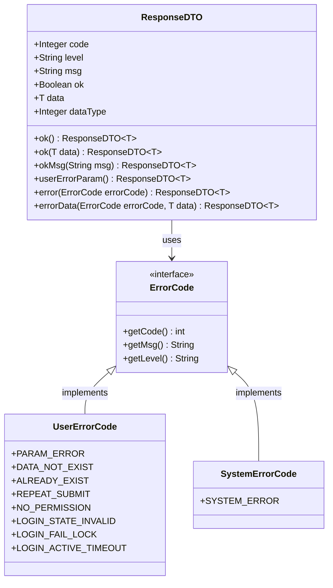
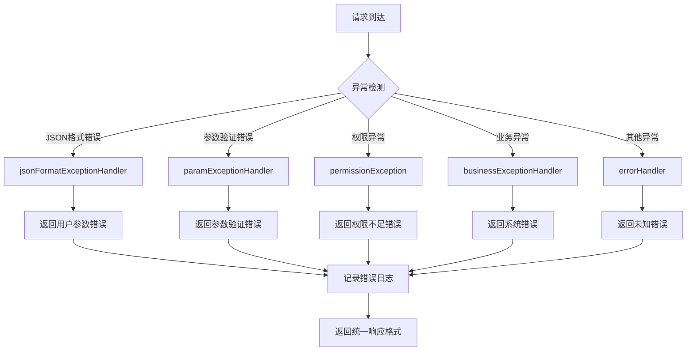
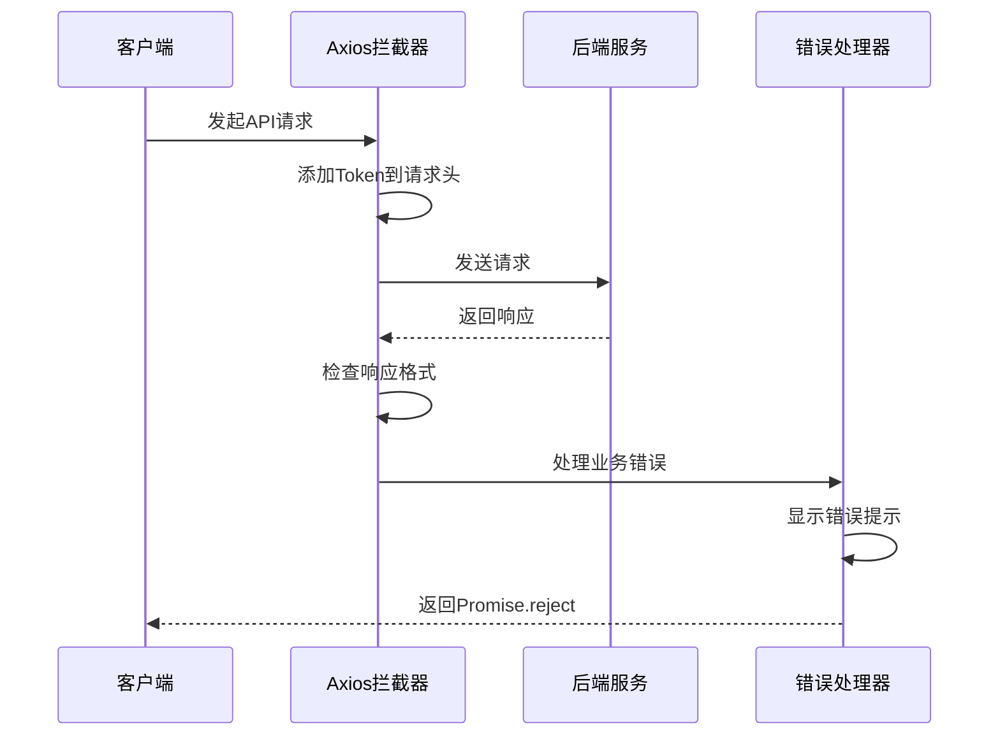
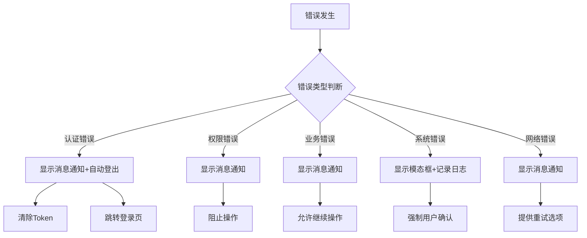
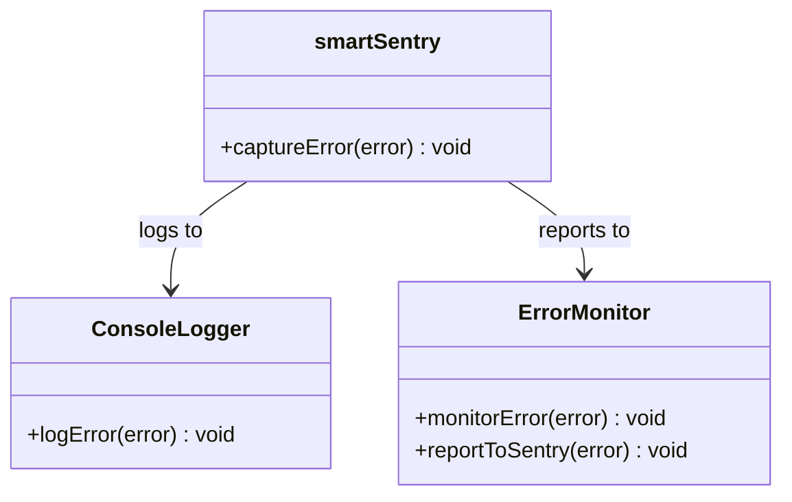
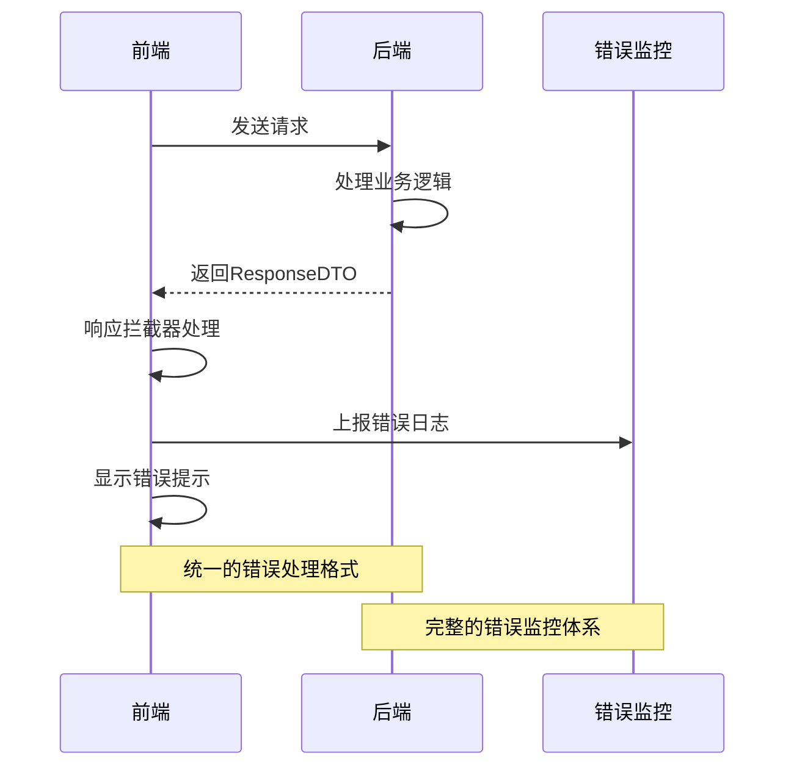

# 错误处理

<cite>
**本文档引用的文件**
- [GlobalExceptionHandler.java](file://smart-admin-api-java17-springboot3/sa-base/src/main/java/net/lab1024/sa/base/handler/GlobalExceptionHandler.java)
- [ResponseDTO.java](file://smart-admin-api-java17-springboot3/sa-base/src/main/java/net/lab1024/sa/base/common/domain/ResponseDTO.java)
- [axios.js](file://smart-admin-web-javascript/src/lib/axios.js)
- [smart-sentry.js](file://smart-admin-web-javascript/src/lib/smart-sentry.js)
- [UserErrorCode.java](file://smart-admin-api-java17-springboot3/sa-base/src/main/java/net/lab1024/sa/base/common/code/UserErrorCode.java)
- [SystemErrorCode.java](file://smart-admin-api-java17-springboot3/sa-base/src/main/java/net/lab1024/sa/base/common/code/SystemErrorCode.java)
- [login-api.js](file://smart-admin-web-javascript/src/api/system/login-api.js)
- [login.vue](file://smart-admin-web-javascript/src/views/system/login/login.vue)
</cite>

## 目录
1. [概述](#概述)
2. [统一响应格式](#统一响应格式)
3. [后端错误处理机制](#后端错误处理机制)
4. [前端错误处理机制](#前端错误处理机制)
5. [HTTP状态码处理策略](#http状态码处理策略)
6. [错误提示展示方式](#错误提示展示方式)
7. [错误日志上报机制](#错误日志上报机制)
8. [API调用中的错误处理](#api调用中的错误处理)
9. [协同工作机制](#协同工作机制)
10. [最佳实践](#最佳实践)

## 概述

SmartAdmin系统采用前后端分离架构，建立了完善的错误处理机制，确保系统在各种异常情况下的稳定性和用户体验。该机制包含统一的响应格式、多层次的错误分类、智能的错误提示和完善的日志上报体系。

### 核心特性

- **统一响应格式**：所有API接口返回标准化的ResponseDTO格式
- **多层级错误分类**：系统错误、意外错误、用户错误等分类处理
- **智能错误提示**：根据错误类型自动选择合适的提示方式
- **完整日志体系**：前后端协同的日志记录和上报机制
- **优雅降级**：在网络异常等情况下提供友好的用户体验

## 统一响应格式

### ResponseDTO结构设计

系统采用统一的ResponseDTO作为所有API接口的响应格式，确保前后端交互的一致性。



**图表来源**
- [ResponseDTO.java](file://smart-admin-api-java17-springboot3/sa-base/src/main/java/net/lab1024/sa/base/common/domain/ResponseDTO.java#L23-L122)
- [UserErrorCode.java](file://smart-admin-api-java17-springboot3/sa-base/src/main/java/net/lab1024/sa/base/common/code/UserErrorCode.java#L17-L53)
- [SystemErrorCode.java](file://smart-admin-api-java17-springboot3/sa-base/src/main/java/net/lab1024/sa/base/common/code/SystemErrorCode.java#L17-L40)

### 响应字段说明

| 字段名 | 类型 | 说明 | 示例值 |
|--------|------|------|--------|
| code | Integer | 返回码，0表示成功，非0表示失败 | 0 或 30001 |
| level | String | 错误级别，区分系统、意外、用户错误 | "USER" |
| msg | String | 错误消息，用户可见的提示信息 | "参数错误" |
| ok | Boolean | 操作成功标志 | true/false |
| data | T | 返回的数据对象 | 具体业务数据 |
| dataType | Integer | 数据类型标识 | 0:普通数据, 1:加密数据 |

**章节来源**
- [ResponseDTO.java](file://smart-admin-api-java17-springboot3/sa-base/src/main/java/net/lab1024/sa/base/common/domain/ResponseDTO.java#L29-L43)

## 后端错误处理机制

### GlobalExceptionHandler全局异常处理器

系统通过GlobalExceptionHandler实现全局异常拦截和统一处理，覆盖各种异常场景。



**图表来源**
- [GlobalExceptionHandler.java](file://smart-admin-api-java17-springboot3/sa-base/src/main/java/net/lab1024/sa/base/handler/GlobalExceptionHandler.java#L38-L131)

### 异常处理策略

#### 1. JSON格式错误处理
- **触发条件**：请求体格式不正确或缺少必要参数
- **处理方式**：返回用户参数错误，提示"参数JSON格式错误"
- **日志记录**：仅在非生产环境记录详细错误信息

#### 2. 参数验证错误处理
- **触发条件**：参数绑定失败或验证规则不满足
- **处理方式**：提取具体的验证错误信息，返回给用户
- **特殊处理**：MethodArgumentNotValidException会提取所有字段错误

#### 3. 权限异常处理
- **触发条件**：Sa-Token权限验证失败
- **处理方式**：返回无权限错误，开发环境显示具体原因
- **安全考虑**：生产环境不暴露具体权限信息

#### 4. 业务异常处理
- **触发条件**：业务逻辑抛出BusinessException
- **处理方式**：记录错误日志，返回系统错误
- **信息保护**：生产环境不暴露业务异常详情

#### 5. 其他异常处理
- **触发条件**：未被捕获的其他异常
- **处理方式**：记录完整堆栈信息，返回系统错误
- **监控预警**：所有异常都会被记录用于监控

**章节来源**
- [GlobalExceptionHandler.java](file://smart-admin-api-java17-springboot3/sa-base/src/main/java/net/lab1024/sa/base/handler/GlobalExceptionHandler.java#L48-L116)

### 错误码体系

系统定义了完整的错误码体系，按级别和业务领域进行分类：

#### 用户级别错误码（30000系列）
- **30001**：参数错误
- **30002**：数据不存在
- **30003**：数据已存在
- **30004**：重复提交
- **30005**：无权限访问
- **30007**：登录状态无效
- **30010**：登录失败锁定
- **30012**：长时间未操作

#### 系统级别错误码（10000系列）
- **10001**：系统错误

**章节来源**
- [UserErrorCode.java](file://smart-admin-api-java17-springboot3/sa-base/src/main/java/net/lab1024/sa/base/common/code/UserErrorCode.java#L19-L40)
- [SystemErrorCode.java](file://smart-admin-api-java17-springboot3/sa-base/src/main/java/net/lab1024/sa/base/common/code/SystemErrorCode.java#L22-L22)

## 前端错误处理机制

### Axios拦截器配置

前端通过Axios拦截器实现统一的错误处理，包括请求拦截和响应拦截。



**图表来源**
- [axios.js](file://smart-admin-web-javascript/src/lib/axios.js#L35-L126)

### 请求拦截器处理

请求拦截器主要负责：
- 自动添加认证Token到请求头
- 移除无效的Token
- 统一的请求配置处理

### 响应拦截器处理

响应拦截器实现了多层次的错误处理：

#### 1. 数据解密处理
- **加密数据检测**：识别并解密加密数据
- **Blob数据处理**：处理文件下载等二进制数据
- **内容类型检查**：确保只处理JSON格式数据

#### 2. 业务错误处理
- **Token过期处理**：30007、30008错误码触发重新登录
- **登录锁定处理**：30010、30011错误码显示模态框提示
- **超时处理**：30012错误码显示重要提醒并自动登出
- **一般错误处理**：显示错误消息但不中断流程

#### 3. 网络错误处理
- **超时检测**：识别网络超时错误
- **连接错误**：处理网络连接失败
- **请求错误**：处理其他网络请求错误

**章节来源**
- [axios.js](file://smart-admin-web-javascript/src/lib/axios.js#L56-L126)

## HTTP状态码处理策略

### 前后端协同处理

虽然系统主要依赖ResponseDTO中的code字段进行错误处理，但在某些特殊情况下也会参考HTTP状态码：

#### 401 Unauthorized - 认证失败
- **前端处理**：自动清除Token，跳转登录页面
- **用户体验**：显示"您没有登录，请重新登录"提示
- **技术实现**：setTimeout延迟300ms执行登出

#### 403 Forbidden - 权限不足
- **前端处理**：显示"对不起，您没有权限访问此内容"提示
- **用户体验**：提供友好的权限不足说明
- **导航处理**：阻止进入无权限的页面

#### 404 Not Found - 资源未找到
- **前端处理**：显示"资源未找到"提示
- **用户体验**：提供返回首页或其他建议操作
- **路由处理**：可能触发404页面显示

#### 500 Internal Server Error - 服务器内部错误
- **前端处理**：显示"系统似乎出现了点小问题"提示
- **用户体验**：提供重试或联系管理员的选项
- **日志记录**：记录详细错误信息用于排查

### 特殊错误码处理

系统定义了一些特殊的错误码，具有特定的处理逻辑：

| 错误码 | 名称 | 处理方式 | 用户体验 |
|--------|------|----------|----------|
| 30007 | 登录状态无效 | 显示提示，300ms后自动登出 | "您没有登录，请重新登录" |
| 30010 | 登录失败锁定 | 显示模态框，禁止继续操作 | 锁定时间和剩余尝试次数 |
| 30011 | 登录失败即将锁定 | 显示警告模态框 | 即将锁定的提醒 |
| 30012 | 长时间未操作 | 显示重要提醒，3秒后自动登出 | "长时间未操作系统，需要重新登录" |

**章节来源**
- [axios.js](file://smart-admin-web-javascript/src/lib/axios.js#L80-L104)

## 错误提示展示方式

### 消息通知系统

系统提供了多种错误提示方式，根据错误的重要性和紧急程度选择合适的展示方式：

#### 1. 消息通知（message）
- **适用场景**：一般性的错误提示、操作反馈
- **特点**：轻量级，自动消失，不影响用户操作
- **使用时机**：参数错误、业务操作失败等

#### 2. 模态框提示（Modal）
- **适用场景**：重要提醒、需要用户确认的操作
- **特点**：强制用户注意，必须关闭才能继续
- **使用时机**：登录锁定、系统维护等

#### 3. 静默处理
- **适用场景**：后台错误、不影响用户体验的异常
- **特点**：不向用户显示任何提示
- **使用时机**：日志上报、性能监控等

### 错误提示策略



**图表来源**
- [axios.js](file://smart-admin-web-javascript/src/lib/axios.js#L80-L104)

## 错误日志上报机制

### smartSentry错误监控

系统集成了smartSentry错误监控工具，实现错误的主动上报和记录。



**图表来源**
- [smart-sentry.js](file://smart-admin-web-javascript/src/lib/smart-sentry.js#L11-L22)

### 日志上报策略

#### 1. 自动上报
- **触发条件**：所有捕获的异常都会自动上报
- **上报内容**：错误堆栈、上下文信息、用户行为轨迹
- **过滤机制**：排除网络请求相关的错误对象

#### 2. 手动上报
- **触发条件**：特定业务场景下的错误
- **上报时机**：业务逻辑失败、关键操作异常
- **上报内容**：详细的业务上下文信息

#### 3. 日志级别
- **ERROR**：严重错误，影响系统功能
- **WARN**：警告信息，需要关注但不影响运行
- **INFO**：一般信息，用于调试和监控

**章节来源**
- [smart-sentry.js](file://smart-admin-web-javascript/src/lib/smart-sentry.js#L15-L20)

## API调用中的错误处理

### 统一错误处理模式

在API调用中，系统推荐使用统一的错误处理模式：

```javascript
// 推荐的错误处理模式
async function fetchData() {
  try {
    const response = await api.getData(params);
    // 处理成功响应
    return response.data;
  } catch (error) {
    // 错误日志上报
    smartSentry.captureError(error);
    // 不需要手动显示错误信息
    // axios拦截器已经处理了大部分错误提示
    throw error;
  }
}
```

### 具体API调用示例

#### 登录API错误处理
登录API是系统中最关键的API之一，需要特别注意错误处理：

```javascript
// 登录流程中的错误处理
async function handleLogin() {
  try {
    // 表单验证
    await formRef.value.validate();
    
    // 显示加载状态
    SmartLoading.show();
    
    // 发送登录请求
    const response = await loginApi.login(loginForm);
    
    // 处理成功响应
    handleLoginSuccess(response);
    
  } catch (error) {
    // 错误日志上报
    smartSentry.captureError(error);
    
    // axios拦截器会自动处理大部分错误
    // 只需要在这里进行额外的业务处理
  } finally {
    // 无论成功还是失败都要隐藏加载状态
    SmartLoading.hide();
  }
}
```

### 错误处理最佳实践

#### 1. 适当的错误捕获
- **全局捕获**：使用try-catch捕获异步操作中的错误
- **局部捕获**：在关键业务逻辑中进行精确的错误处理
- **避免过度捕获**：不要捕获不应该处理的错误

#### 2. 错误信息传递
- **向上抛出**：捕获错误后适当向上抛出
- **错误包装**：在捕获层添加上下文信息
- **错误链**：保持错误的原始堆栈信息

#### 3. 用户体验优化
- **加载状态**：在异步操作中显示加载指示器
- **错误提示**：使用合适的错误提示方式
- **重试机制**：提供合理的重试机会

**章节来源**
- [login.vue](file://smart-admin-web-javascript/src/views/system/login/login.vue#L189-L200)

## 协同工作机制

### 前后端协同处理流程

前后端通过统一的错误处理机制实现无缝协作：



**图表来源**
- [GlobalExceptionHandler.java](file://smart-admin-api-java17-springboot3/sa-base/src/main/java/net/lab1024/sa/base/handler/GlobalExceptionHandler.java#L38-L131)
- [axios.js](file://smart-admin-web-javascript/src/lib/axios.js#L56-L126)

### 错误处理协同要点

#### 1. 统一的响应格式
- **前后一致**：前后端都使用ResponseDTO格式
- **字段标准**：严格遵循code、msg、data等字段定义
- **类型安全**：强类型语言确保字段类型正确

#### 2. 错误码映射
- **后端定义**：系统定义完整的错误码体系
- **前端映射**：前端根据错误码执行相应处理
- **国际化支持**：错误消息支持多语言

#### 3. 日志协同
- **错误收集**：前端收集并上报错误信息
- **后端记录**：后端记录详细的错误日志
- **关联查询**：通过请求ID关联前后端日志

#### 4. 监控告警
- **实时监控**：实时监控系统错误率
- **异常告警**：异常情况及时通知开发团队
- **趋势分析**：分析错误趋势，预防潜在问题

**章节来源**
- [ResponseDTO.java](file://smart-admin-api-java17-springboot3/sa-base/src/main/java/net/lab1024/sa/base/common/domain/ResponseDTO.java#L29-L43)

## 最佳实践

### 开发阶段最佳实践

#### 1. 错误分类
- **业务错误**：用户输入错误、权限不足等
- **系统错误**：数据库连接、服务不可用等
- **网络错误**：请求超时、连接失败等

#### 2. 错误处理层次
- **全局处理**：使用全局异常处理器处理未捕获的错误
- **控制器处理**：在控制器中处理特定的业务错误
- **方法处理**：在业务方法中处理具体的逻辑错误

#### 3. 用户体验
- **友好提示**：使用用户可理解的语言描述错误
- **操作指导**：提供解决问题的建议或步骤
- **情感关怀**：使用积极正面的语言

### 生产环境最佳实践

#### 1. 安全考虑
- **信息脱敏**：不在错误信息中暴露敏感数据
- **错误分级**：根据错误级别决定是否记录详细信息
- **攻击防护**：防止通过错误信息进行攻击分析

#### 2. 性能优化
- **错误缓存**：对常见错误进行缓存处理
- **异步上报**：错误日志上报使用异步方式
- **采样机制**：对高频错误进行采样上报

#### 3. 监控运维
- **实时告警**：设置合理的错误阈值和告警机制
- **趋势分析**：定期分析错误趋势，发现潜在问题
- **根因分析**：建立完善的错误根因分析流程

### 测试阶段最佳实践

#### 1. 单元测试
- **异常测试**：编写针对异常情况的单元测试
- **边界测试**：测试各种边界条件下的错误处理
- **集成测试**：测试前后端协同的错误处理

#### 2. 性能测试
- **压力测试**：测试高并发下的错误处理能力
- **稳定性测试**：长时间运行下的错误处理稳定性
- **资源测试**：错误处理对系统资源的影响

#### 3. 用户体验测试
- **错误场景**：模拟各种错误场景的用户体验
- **响应速度**：测试错误提示的响应速度
- **可访问性**：确保错误信息对残障用户友好

通过以上详细的错误处理机制，SmartAdmin系统能够提供稳定可靠的用户体验，同时为开发和运维团队提供完善的错误监控和问题排查能力。