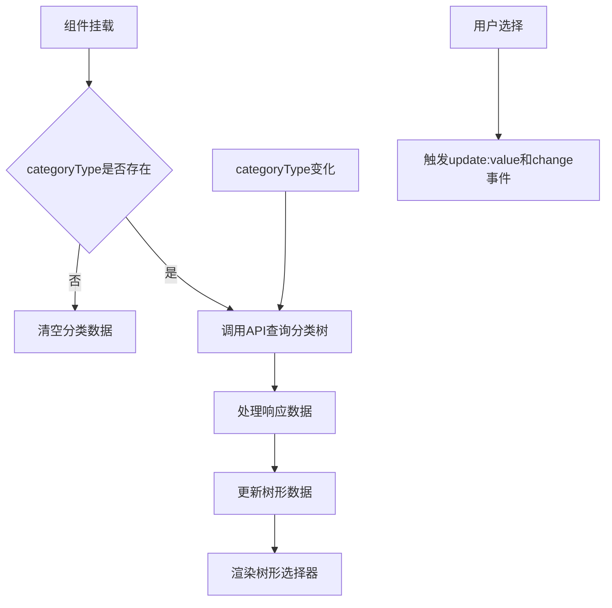
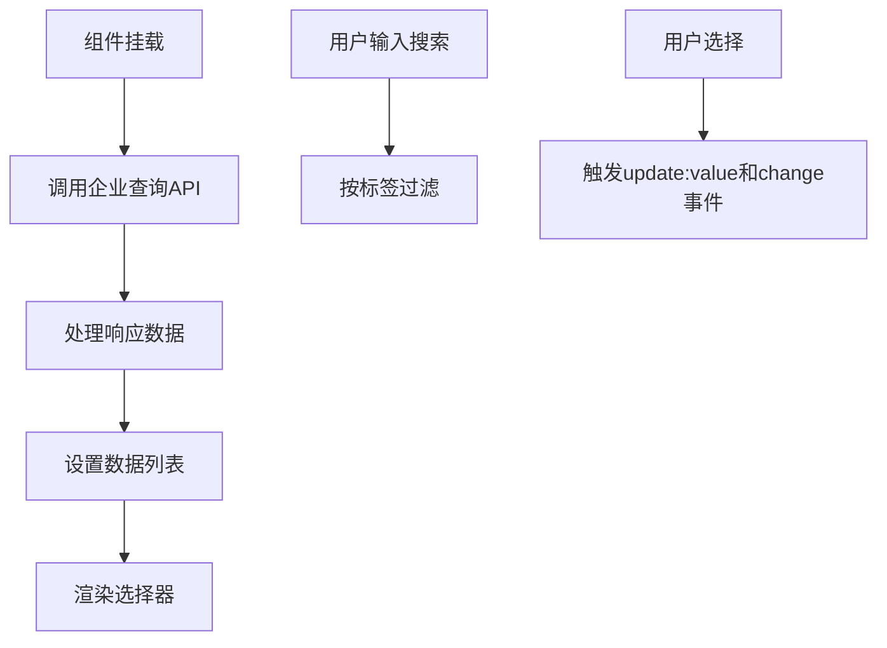
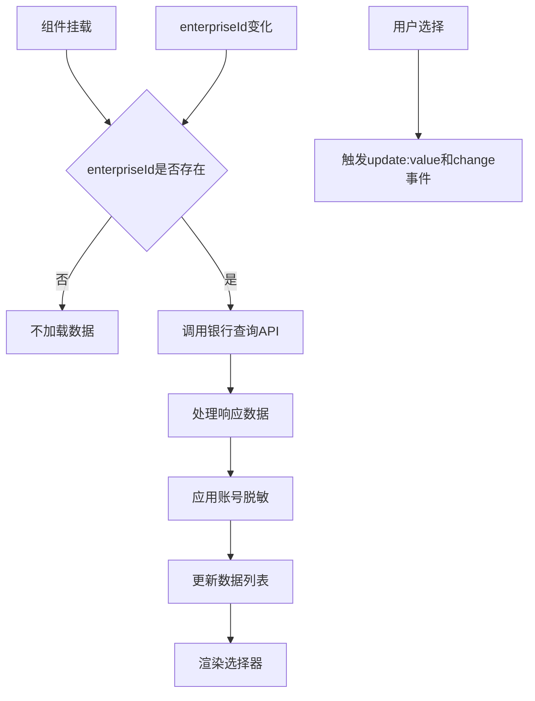
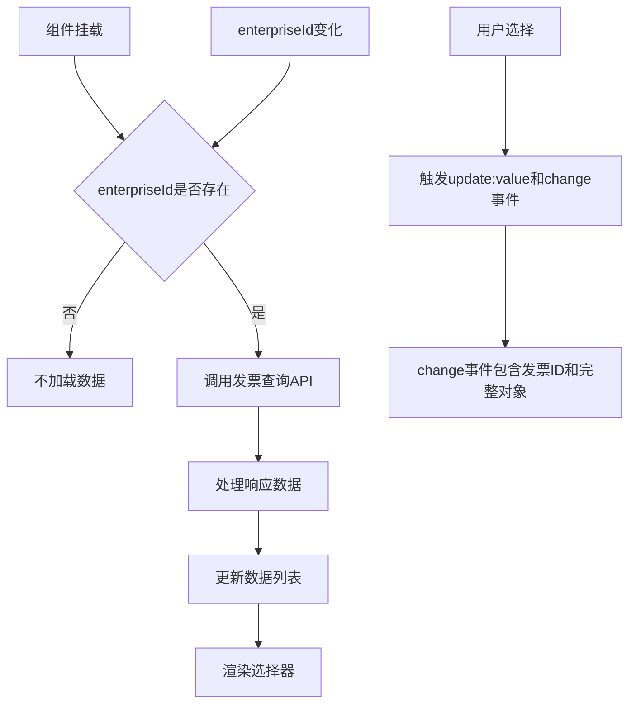

# 业务组件

<cite>
**本文档引用的文件**
- [category-tree-select/index.vue](file://smart-admin-web-javascript/src/components/business/category-tree-select/index.vue)
- [enterprise-select/index.vue](file://smart-admin-web-javascript/src/components/business/oa/enterprise-select/index.vue)
- [enterprise-bank-select/index.vue](file://smart-admin-web-javascript/src/components/business/oa/enterprise-bank-select/index.vue)
- [enterprise-invoice-select/index.vue](file://smart-admin-web-javascript/src/components/business/oa/enterprise-invoice-select/index.vue)
- [category-api.js](file://smart-admin-web-javascript/src/api/business/category/category-api.js)
- [enterprise-api.js](file://smart-admin-web-javascript/src/api/business/oa/enterprise-api.js)
- [bank-api.js](file://smart-admin-web-javascript/src/api/business/oa/bank-api.js)
- [invoice-api.js](file://smart-admin-web-javascript/src/api/business/oa/invoice-api.js)
- [category-const.js](file://smart-admin-web-javascript/src/constants/business/erp/category-const.js)
- [enterprise-const.js](file://smart-admin-web-javascript/src/constants/business/oa/enterprise-const.js)
- [goods-catalog.vue](file://smart-admin-web-javascript/src/views/business/erp/catalog/goods-catalog.vue)
- [custom-catalog.vue](file://smart-admin-web-javascript/src/views/business/erp/catalog/custom-catalog.vue)
</cite>

## 目录

1. [业务组件概述](#业务组件概述)
2. [分类树选择器](#分类树选择器)
3. [企业相关选择器系列](#企业相关选择器系列)
4. [实际使用案例](#实际使用案例)
5. [错误处理与边界情况](#错误处理与边界情况)

## 业务组件概述

本文档详细阐述了系统中的核心业务组件，包括分类树选择器（category-tree-select）和企业相关选择器系列（enterprise-select系列）。这些组件封装了特定的业务规则和数据处理逻辑，为ERP、OA等业务模块提供统一的用户界面和交互体验。组件设计遵循可复用、可扩展的原则，通过参数配置和事件机制支持业务定制。

**业务组件概述**
- [category-tree-select/index.vue](file://smart-admin-web-javascript/src/components/business/category-tree-select/index.vue)
- [enterprise-select/index.vue](file://smart-admin-web-javascript/src/components/business/oa/enterprise-select/index.vue)

## 分类树选择器

分类树选择器（category-tree-select）是一个专门用于选择分类目录的业务组件，它封装了分类数据的异步加载、树形结构展示和选择逻辑。该组件基于Ant Design Vue的TreeSelect组件构建，通过业务逻辑封装提供更便捷的使用方式。

### 设计与实现逻辑

分类树选择器的核心设计目标是提供一个可复用的分类选择界面，支持不同业务场景下的分类管理。组件通过`categoryType`属性区分不同类型的分类（如商品分类、演示分类等），并根据类型动态加载相应的分类树数据。

组件实现中包含了以下关键逻辑：
- **异步数据加载**：组件在挂载时自动调用API获取分类树数据，支持按分类类型过滤
- **数据缓存**：每次加载的数据会被组件内部缓存，避免重复请求
- **父子组件通信**：通过`v-model`实现双向绑定，同时触发`update:value`和`change`事件
- **动态更新**：当`categoryType`属性变化时，自动重新加载对应类型的分类数据



**Diagram sources**
- [category-tree-select/index.vue](file://smart-admin-web-javascript/src/components/business/category-tree-select/index.vue)
- [category-api.js](file://smart-admin-web-javascript/src/api/business/category/category-api.js)

### 业务规则与数据处理

分类树选择器封装了以下业务规则和数据处理逻辑：
- **分类类型约束**：必须指定`categoryType`才能加载数据，否则清空现有数据
- **权限控制集成**：虽然组件本身不直接处理权限，但其使用的API会受后端权限控制
- **错误处理**：在数据加载失败时捕获错误并上报，但不影响组件的正常显示
- **默认配置**：提供合理的默认值，如默认宽度为100%，默认占位符为"请选择"

组件通过`queryCategoryTree`方法实现数据查询逻辑，该方法根据`categoryType`参数调用后端API获取分类树数据。后端返回的数据结构已经预处理为TreeSelect组件所需的格式，减少了前端的数据转换工作。

**Section sources**
- [category-tree-select/index.vue](file://smart-admin-web-javascript/src/components/business/category-tree-select/index.vue)
- [category-api.js](file://smart-admin-web-javascript/src/api/business/category/category-api.js)

### 扩展点与定制支持

分类树选择器通过以下方式提供扩展点以支持业务定制：
- **插槽**：虽然当前版本未使用插槽，但可以通过Ant Design Vue的TreeSelect插槽功能进行扩展
- **事件**：暴露`update:value`和`change`事件，允许父组件监听选择变化
- **属性配置**：提供`width`、`placeholder`等属性供外部定制外观
- **类型参数**：通过`categoryType`属性支持不同业务场景的分类选择

组件的设计允许在不修改组件源码的情况下，通过参数配置适应不同的使用场景，体现了良好的封装性和可扩展性。

**Section sources**
- [category-tree-select/index.vue](file://smart-admin-web-javascript/src/components/business/category-tree-select/index.vue)

## 企业相关选择器系列

企业相关选择器系列包括企业选择器（enterprise-select）、企业银行选择器（enterprise-bank-select）和企业发票选择器（enterprise-invoice-select）。这些组件共同构成了企业信息选择的完整解决方案，每个组件都针对特定的业务场景进行了优化。

### 企业选择器

企业选择器（enterprise-select）用于在系统中选择企业实体，支持单选和多选模式。该组件封装了企业列表的加载和展示逻辑，是企业相关业务的基础组件。

#### 实现逻辑

企业选择器的主要实现逻辑包括：
- **异步加载**：组件挂载时自动加载企业列表数据
- **类型过滤**：支持通过`type`参数过滤特定类型的企业（如有限企业、外资企业）
- **搜索功能**：内置搜索功能，支持按企业名称进行筛选
- **多选支持**：通过`multiple`属性控制是否支持多选



**Diagram sources**
- [enterprise-select/index.vue](file://smart-admin-web-javascript/src/components/business/oa/enterprise-select/index.vue)
- [enterprise-api.js](file://smart-admin-web-javascript/src/api/business/oa/enterprise-api.js)

#### 业务规则

企业选择器封装了以下业务规则：
- **类型枚举**：支持通过`ENTERPRISE_TYPE_ENUM`枚举值过滤企业类型
- **数据范围**：加载的企业列表受当前用户的数据权限范围限制
- **默认值处理**：提供合理的默认宽度（200px）和占位符
- **禁用状态**：支持通过`disabled`属性控制组件是否可用

**Section sources**
- [enterprise-select/index.vue](file://smart-admin-web-javascript/src/components/business/oa/enterprise-select/index.vue)
- [enterprise-const.js](file://smart-admin-web-javascript/src/constants/business/oa/enterprise-const.js)

### 企业银行选择器

企业银行选择器（enterprise-bank-select）用于选择企业的银行账户信息，它依赖于企业选择器，必须指定`enterpriseId`才能加载数据。

#### 实现逻辑

企业银行选择器的关键实现逻辑包括：
- **依赖加载**：只有当`enterpriseId`存在时才加载银行列表
- **动态更新**：当`enterpriseId`变化时，自动重新加载对应企业的银行列表
- **数据格式化**：对银行账号进行脱敏处理，中间位数用星号代替
- **默认选择**：如果未指定值且有银行数据，自动选择第一个银行账户



**Diagram sources**
- [enterprise-bank-select/index.vue](file://smart-admin-web-javascript/src/components/business/oa/enterprise-bank-select/index.vue)
- [bank-api.js](file://smart-admin-web-javascript/src/api/business/oa/bank-api.js)

#### 业务规则与数据处理

企业银行选择器封装了以下业务规则：
- **依赖关系**：必须先选择企业才能选择银行账户
- **数据脱敏**：银行账号中间位数用星号代替，保护敏感信息
- **自动填充**：在首次加载时，如果未指定值且有数据，自动选择第一个银行账户
- **权限控制**：用户只能看到自己有权限访问的企业银行账户

**Section sources**
- [enterprise-bank-select/index.vue](file://smart-admin-web-javascript/src/components/business/oa/enterprise-bank-select/index.vue)

### 企业发票选择器

企业发票选择器（enterprise-invoice-select）用于选择企业的发票信息，其设计与企业银行选择器类似，但提供了更丰富的事件参数。

#### 实现逻辑

企业发票选择器的主要特点包括：
- **依赖加载**：与银行选择器一样，依赖`enterpriseId`加载数据
- **事件增强**：`change`事件不仅传递选中的发票ID，还传递完整的发票对象
- **自动选择**：与银行选择器相同，支持首次加载时自动选择第一个发票



**Diagram sources**
- [enterprise-invoice-select/index.vue](file://smart-admin-web-javascript/src/components/business/oa/enterprise-invoice-select/index.vue)
- [invoice-api.js](file://smart-admin-web-javascript/src/api/business/oa/invoice-api.js)

#### 业务规则

企业发票选择器的关键业务规则：
- **数据关联**：发票信息与企业强关联，不能跨企业选择
- **事件丰富性**：`change`事件提供完整的发票对象，方便父组件使用
- **自动填充**：支持首次加载时自动选择第一个发票信息
- **权限控制**：受用户数据权限限制，只能看到有权限的发票信息

**Section sources**
- [enterprise-invoice-select/index.vue](file://smart-admin-web-javascript/src/components/business/oa/enterprise-invoice-select/index.vue)

## 实际使用案例

### ERP系统中的分类选择

在ERP系统中，分类树选择器被广泛应用于商品分类管理。以下是在商品目录模块中的使用示例：

```vue
<template>
  <div>
    <CategoryTreeTable :category-type="CATEGORY_TYPE_ENUM.GOODS.value" />
  </div>
</template>
<script setup>
  import CategoryTreeTable from './components/category-tree-table.vue';
  import { CATEGORY_TYPE_ENUM } from '/@/constants/business/erp/category-const';
</script>
```

在此案例中，通过`CATEGORY_TYPE_ENUM.GOODS.value`指定选择商品分类，组件会自动加载商品分类树并提供选择界面。这种使用方式简化了商品分类管理的开发工作，确保了不同模块间的一致性。

**Section sources**
- [goods-catalog.vue](file://smart-admin-web-javascript/src/views/business/erp/catalog/goods-catalog.vue)
- [category-const.js](file://smart-admin-web-javascript/src/constants/business/erp/category-const.js)

### 演示系统中的分类选择

在系统演示模块中，使用分类树选择器选择演示分类：

```vue
<template>
  <div>
    <CategoryTreeTable :category-type="CATEGORY_TYPE_ENUM.DEMO.value" :privilegePrefix="'custom:'"/>
  </div>
</template>
<script setup>
  import CategoryTreeTable from './components/category-tree-table.vue';
  import { CATEGORY_TYPE_ENUM } from '/@/constants/business/erp/category-const';
</script>
```

此案例展示了如何通过`privilegePrefix`参数定制权限前缀，适应不同的权限控制需求。这种灵活性使得同一个组件可以在不同业务场景下使用。

**Section sources**
- [custom-catalog.vue](file://smart-admin-web-javascript/src/views/business/erp/catalog/custom-catalog.vue)
- [category-const.js](file://smart-admin-web-javascript/src/constants/business/erp/category-const.js)

### OA系统中的企业信息选择

在OA系统的企业管理模块中，企业相关选择器系列被组合使用，构建完整的企业信息选择界面。例如，在企业详情页面中，可以同时使用企业银行选择器和企业发票选择器：

```vue
<!-- 企业详情页面 -->
<template>
  <div>
    <!-- 企业基本信息 -->
    <EnterpriseSelect v-model:value="enterpriseId" />
    
    <!-- 企业银行信息 -->
    <EnterpriseBankSelect 
      v-model:value="bankId" 
      :enterpriseId="enterpriseId" 
    />
    
    <!-- 企业发票信息 -->
    <EnterpriseInvoiceSelect 
      v-model:value="invoiceId" 
      :enterpriseId="enterpriseId" 
    />
  </div>
</template>
```

这种组合使用方式体现了组件设计的协同性，通过`enterpriseId`作为关联字段，实现了企业、银行和发票信息的选择联动。

**Section sources**
- [enterprise-detail.vue](file://smart-admin-web-javascript/src/views/business/oa/enterprise/enterprise-detail.vue)

## 错误处理与边界情况

### 分类树选择器的错误处理

分类树选择器在实现中考虑了多种边界情况和错误处理策略：
- **空类型处理**：当`categoryType`为空时，清空现有数据，避免显示错误信息
- **API错误捕获**：使用`smartSentry`捕获并上报API调用错误，但不影响组件的正常显示
- **异步加载保护**：在API调用前后有适当的错误处理，确保组件状态的一致性

### 企业相关选择器的边界情况

企业相关选择器系列在设计时考虑了以下边界情况：
- **依赖缺失**：当`enterpriseId`为空时，不执行数据加载，避免无效请求
- **空数据处理**：当查询结果为空时，正确处理UI显示，不抛出异常
- **自动选择逻辑**：在首次加载且有数据时自动选择第一个项目，提升用户体验
- **多选模式兼容**：通过`mode`属性动态切换单选和多选模式，适应不同业务需求

这些错误处理和边界情况的应对策略确保了组件在各种使用场景下的稳定性和可靠性，减少了因异常情况导致的系统错误。

**Section sources**
- [category-tree-select/index.vue](file://smart-admin-web-javascript/src/components/business/category-tree-select/index.vue)
- [enterprise-bank-select/index.vue](file://smart-admin-web-javascript/src/components/business/oa/enterprise-bank-select/index.vue)
- [enterprise-invoice-select/index.vue](file://smart-admin-web-javascript/src/components/business/oa/enterprise-invoice-select/index.vue)