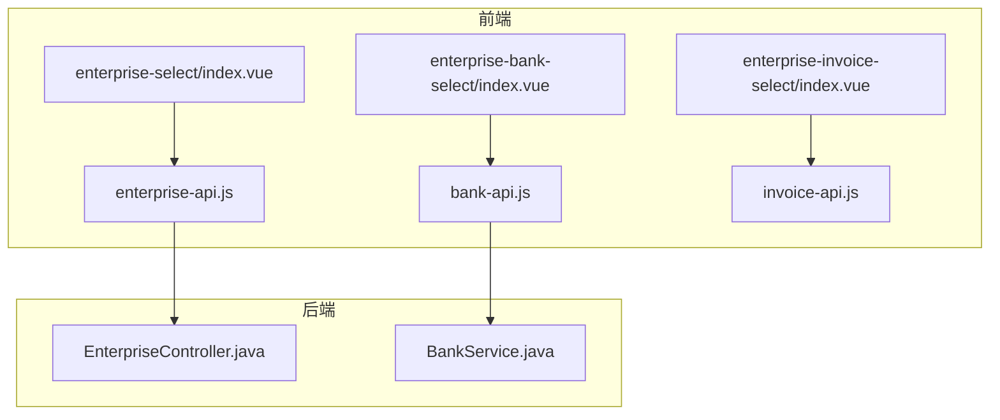
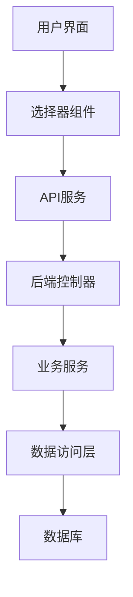
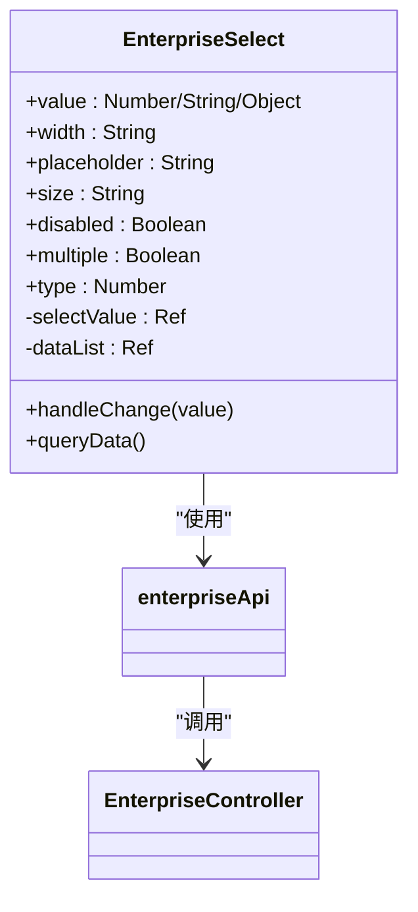
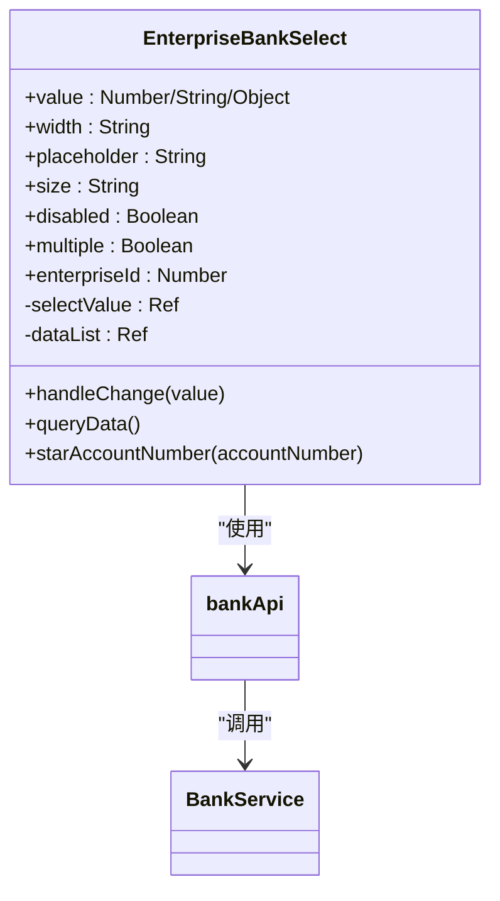
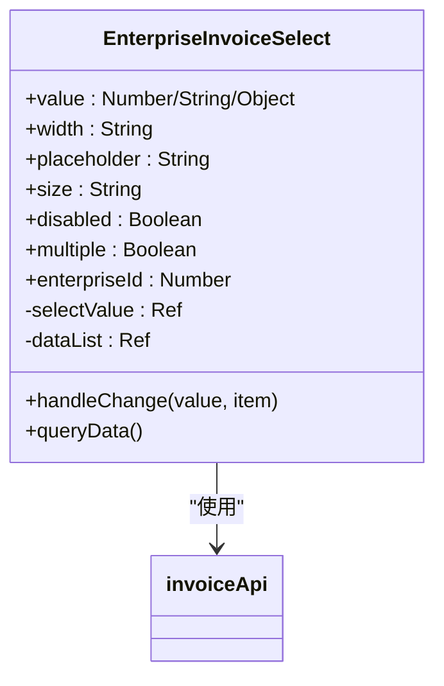
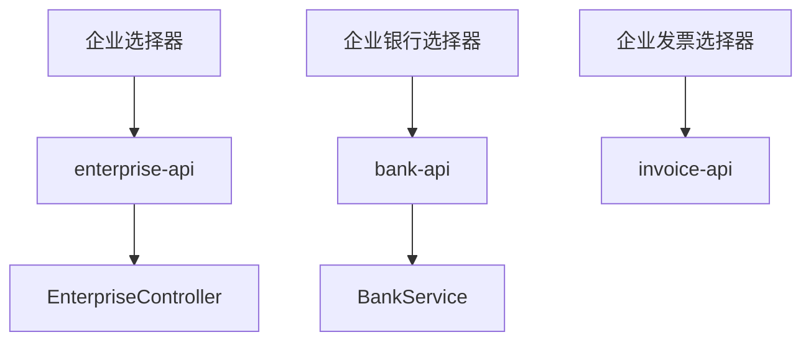

# 企业相关选择器

<cite>
**本文档引用的文件**  
- [enterprise-select/index.vue](file://smart-admin-web-javascript/src/components/business/oa/enterprise-select/index.vue)
- [enterprise-bank-select/index.vue](file://smart-admin-web-javascript/src/components/business/oa/enterprise-bank-select/index.vue)
- [enterprise-invoice-select/index.vue](file://smart-admin-web-javascript/src/components/business/oa/enterprise-invoice-select/index.vue)
- [enterprise-api.js](file://smart-admin-web-javascript/src/api/business/oa/enterprise-api.js)
- [bank-api.js](file://smart-admin-web-javascript/src/api/business/oa/bank-api.js)
- [invoice-api.js](file://smart-admin-web-javascript/src/api/business/oa/invoice-api.js)
- [EnterpriseController.java](file://smart-admin-api-java17-springboot3/sa-admin/src/main/java/net/lab1024/sa/admin/module/business/oa/enterprise/controller/EnterpriseController.java)
- [BankService.java](file://smart-admin-api-java17-springboot3/sa-admin/src/main/java/net/lab1024/sa/admin/module/business/oa/bank/service/BankService.java)
</cite>

## 目录
1. [简介](#简介)
2. [项目结构](#项目结构)
3. [核心组件](#核心组件)
4. [架构概述](#架构概述)
5. [详细组件分析](#详细组件分析)
6. [依赖分析](#依赖分析)
7. [性能考虑](#性能考虑)
8. [故障排除指南](#故障排除指南)
9. [结论](#结论)

## 简介
本文档详细介绍了企业相关选择器的实现，包括企业选择器、企业银行选择器和企业发票选择器。这些组件在OA模块中广泛使用，为表单提供企业相关数据的选择功能。文档将阐述这些组件如何复用基础选择器逻辑，同时针对不同业务场景定制数据加载API和显示字段。

## 项目结构
企业相关选择器位于前端项目的组件目录中，每个选择器都有独立的Vue组件文件。API调用逻辑封装在独立的API服务文件中，后端服务由Spring Boot应用提供。

**图示来源**
- [enterprise-select/index.vue](file://smart-admin-web-javascript/src/components/business/oa/enterprise-select/index.vue)
- [enterprise-bank-select/index.vue](file://smart-admin-web-javascript/src/components/business/oa/enterprise-bank-select/index.vue)
- [enterprise-invoice-select/index.vue](file://smart-admin-web-javascript/src/components/business/oa/enterprise-invoice-select/index.vue)
- [enterprise-api.js](file://smart-admin-web-javascript/src/api/business/oa/enterprise-api.js)
- [bank-api.js](file://smart-admin-web-javascript/src/api/business/oa/bank-api.js)
- [invoice-api.js](file://smart-admin-web-javascript/src/api/business/oa/invoice-api.js)
- [EnterpriseController.java](file://smart-admin-api-java17-springboot3/sa-admin/src/main/java/net/lab1024/sa/admin/module/business/oa/enterprise/controller/EnterpriseController.java)
- [BankService.java](file://smart-admin-api-java17-springboot3/sa-admin/src/main/java/net/lab1024/sa/admin/module/business/oa/bank/service/BankService.java)

**章节来源**
- [enterprise-select/index.vue](file://smart-admin-web-javascript/src/components/business/oa/enterprise-select/index.vue)
- [enterprise-bank-select/index.vue](file://smart-admin-web-javascript/src/components/business/oa/enterprise-bank-select/index.vue)
- [enterprise-invoice-select/index.vue](file://smart-admin-web-javascript/src/components/business/oa/enterprise-invoice-select/index.vue)

## 核心组件
企业相关选择器包含三个核心组件：企业选择器、企业银行选择器和企业发票选择器。这些组件都基于Ant Design Vue的a-select组件构建，实现了统一的UI风格和交互模式。

**章节来源**
- [enterprise-select/index.vue](file://smart-admin-web-javascript/src/components/business/oa/enterprise-select/index.vue)
- [enterprise-bank-select/index.vue](file://smart-admin-web-javascript/src/components/business/oa/enterprise-bank-select/index.vue)
- [enterprise-invoice-select/index.vue](file://smart-admin-web-javascript/src/components/business/oa/enterprise-invoice-select/index.vue)

## 架构概述
企业相关选择器采用分层架构设计，前端组件负责UI展示和用户交互，API服务层负责与后端通信，后端服务层负责业务逻辑处理和数据访问。

**图示来源**
- [enterprise-select/index.vue](file://smart-admin-web-javascript/src/components/business/oa/enterprise-select/index.vue)
- [enterprise-bank-select/index.vue](file://smart-admin-web-javascript/src/components/business/oa/enterprise-bank-select/index.vue)
- [enterprise-invoice-select/index.vue](file://smart-admin-web-javascript/src/components/business/oa/enterprise-invoice-select/index.vue)
- [enterprise-api.js](file://smart-admin-web-javascript/src/api/business/oa/enterprise-api.js)
- [bank-api.js](file://smart-admin-web-javascript/src/api/business/oa/bank-api.js)
- [invoice-api.js](file://smart-admin-web-javascript/src/api/business/oa/invoice-api.js)
- [EnterpriseController.java](file://smart-admin-api-java17-springboot3/sa-admin/src/main/java/net/lab1024/sa/admin/module/business/oa/enterprise/controller/EnterpriseController.java)
- [BankService.java](file://smart-admin-api-java17-springboot3/sa-admin/src/main/java/net/lab1024/sa/admin/module/business/oa/bank/service/BankService.java)

## 详细组件分析

### 企业选择器分析
企业选择器是基础选择器，提供企业列表的选择功能。它支持多选和权限过滤，可以根据企业类型进行筛选。

**图示来源**
- [enterprise-select/index.vue](file://smart-admin-web-javascript/src/components/business/oa/enterprise-select/index.vue)
- [enterprise-api.js](file://smart-admin-web-javascript/src/api/business/oa/enterprise-api.js)
- [EnterpriseController.java](file://smart-admin-api-java17-springboot3/sa-admin/src/main/java/net/lab1024/sa/admin/module/business/oa/enterprise/controller/EnterpriseController.java)

**章节来源**
- [enterprise-select/index.vue](file://smart-admin-web-javascript/src/components/business/oa/enterprise-select/index.vue)

### 企业银行选择器分析
企业银行选择器关联企业ID动态加载银行列表，显示银行名称和加星处理的账号。

**图示来源**
- [enterprise-bank-select/index.vue](file://smart-admin-web-javascript/src/components/business/oa/enterprise-bank-select/index.vue)
- [bank-api.js](file://smart-admin-web-javascript/src/api/business/oa/bank-api.js)
- [BankService.java](file://smart-admin-api-java17-springboot3/sa-admin/src/main/java/net/lab1024/sa/admin/module/business/oa/bank/service/BankService.java)

**章节来源**
- [enterprise-bank-select/index.vue](file://smart-admin-web-javascript/src/components/business/oa/enterprise-bank-select/index.vue)

### 企业发票选择器分析
企业发票选择器集成发票状态筛选，显示开票抬头信息。

**图示来源**
- [enterprise-invoice-select/index.vue](file://smart-admin-web-javascript/src/components/business/oa/enterprise-invoice-select/index.vue)
- [invoice-api.js](file://smart-admin-web-javascript/src/api/business/oa/invoice-api.js)

**章节来源**
- [enterprise-invoice-select/index.vue](file://smart-admin-web-javascript/src/components/business/oa/enterprise-invoice-select/index.vue)

## 依赖分析
企业相关选择器组件之间存在清晰的依赖关系，每个选择器依赖对应的API服务，API服务又依赖后端控制器。

**图示来源**
- [enterprise-select/index.vue](file://smart-admin-web-javascript/src/components/business/oa/enterprise-select/index.vue)
- [enterprise-bank-select/index.vue](file://smart-admin-web-javascript/src/components/business/oa/enterprise-bank-select/index.vue)
- [enterprise-invoice-select/index.vue](file://smart-admin-web-javascript/src/components/business/oa/enterprise-invoice-select/index.vue)
- [enterprise-api.js](file://smart-admin-web-javascript/src/api/business/oa/enterprise-api.js)
- [bank-api.js](file://smart-admin-web-javascript/src/api/business/oa/bank-api.js)
- [invoice-api.js](file://smart-admin-web-javascript/src/api/business/oa/invoice-api.js)
- [EnterpriseController.java](file://smart-admin-api-java17-springboot3/sa-admin/src/main/java/net/lab1024/sa/admin/module/business/oa/enterprise/controller/EnterpriseController.java)
- [BankService.java](file://smart-admin-api-java17-springboot3/sa-admin/src/main/java/net/lab1024/sa/admin/module/business/oa/bank/service/BankService.java)

**章节来源**
- [enterprise-select/index.vue](file://smart-admin-web-javascript/src/components/business/oa/enterprise-select/index.vue)
- [enterprise-bank-select/index.vue](file://smart-admin-web-javascript/src/components/business/oa/enterprise-bank-select/index.vue)
- [enterprise-invoice-select/index.vue](file://smart-admin-web-javascript/src/components/business/oa/enterprise-invoice-select/index.vue)

## 性能考虑
企业相关选择器在性能方面做了优化，包括：
- 使用ref响应式数据，确保UI更新效率
- 在组件挂载时才查询数据，避免不必要的网络请求
- 对银行卡号进行加星处理，保护敏感信息

## 故障排除指南
常见问题及解决方案：
- **问题**：选择器无法加载数据
  **解决方案**：检查企业ID是否正确传递，确保后端服务正常运行
- **问题**：多选功能失效
  **解决方案**：确认multiple属性是否正确设置为true
- **问题**：银行卡号显示不正确
  **解决方案**：检查starAccountNumber函数的逻辑，确保账号长度符合要求

**章节来源**
- [enterprise-select/index.vue](file://smart-admin-web-javascript/src/components/business/oa/enterprise-select/index.vue)
- [enterprise-bank-select/index.vue](file://smart-admin-web-javascript/src/components/business/oa/enterprise-bank-select/index.vue)
- [enterprise-invoice-select/index.vue](file://smart-admin-web-javascript/src/components/business/oa/enterprise-invoice-select/index.vue)

## 结论
企业相关选择器通过复用基础选择器逻辑，实现了代码的高效复用。同时，通过定制数据加载API和显示字段，满足了不同业务场景的需求。这些组件在OA模块的表单中集成良好，支持通过ref调用组件方法触发数据刷新，具有良好的可维护性和扩展性。