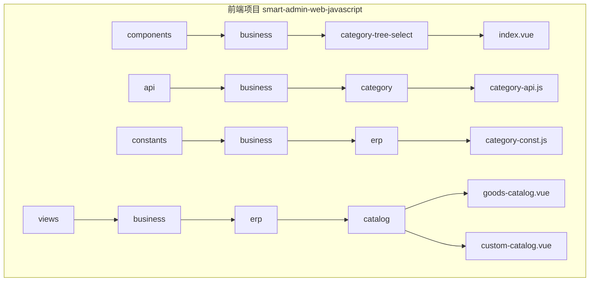
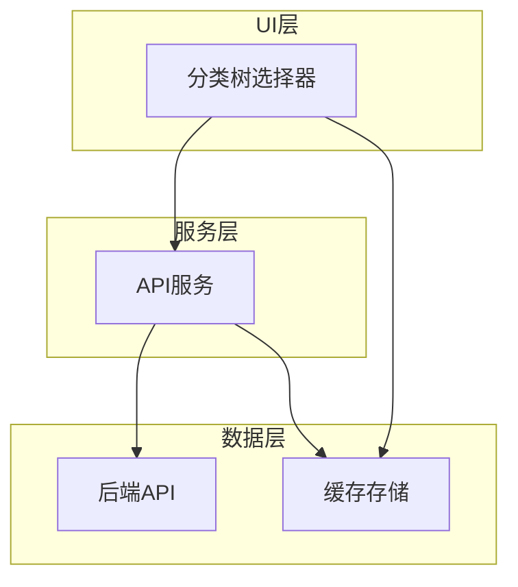
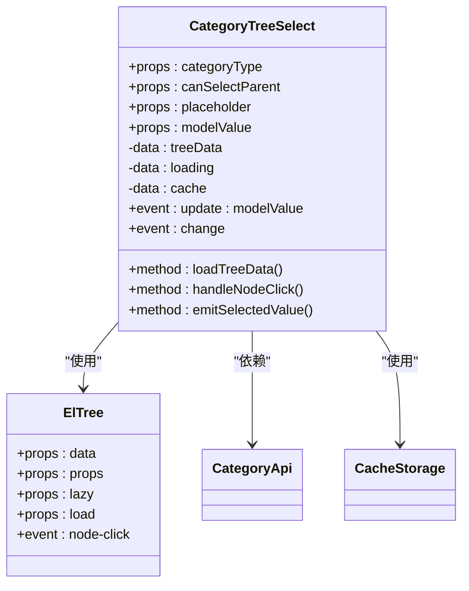
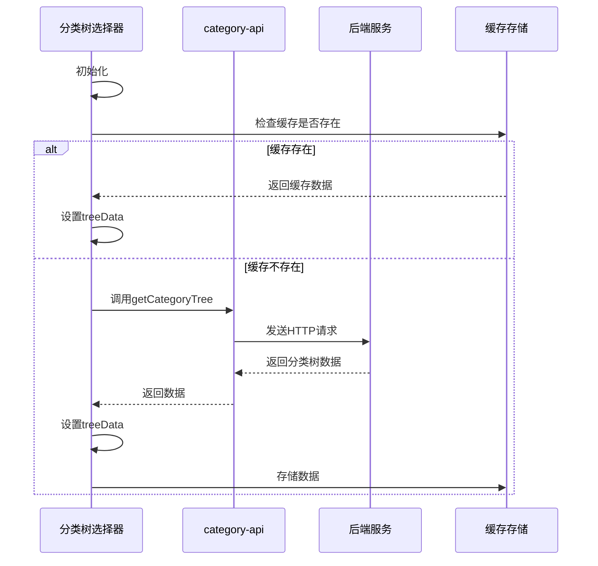
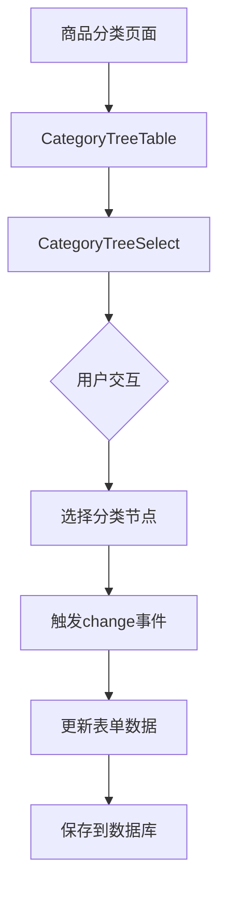
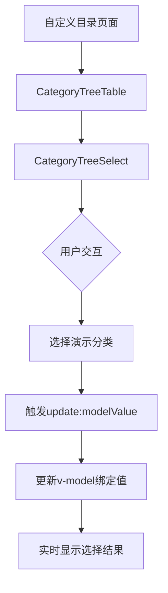
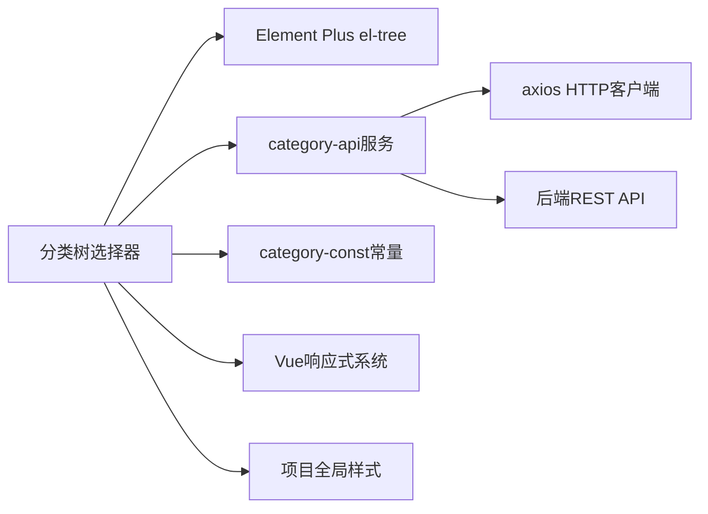

# 分类树选择器

<cite>
**本文档中引用的文件**  
- [index.vue](file://smart-admin-web-javascript/src/components/business/category-tree-select/index.vue)
- [category-api.js](file://smart-admin-web-javascript/src/api/business/category/category-api.js)
- [category-const.js](file://smart-admin-web-javascript/src/constants/business/erp/category-const.js)
- [goods-catalog.vue](file://smart-admin-web-javascript/src/views/business/erp/catalog/goods-catalog.vue)
- [custom-catalog.vue](file://smart-admin-web-javascript/src/views/business/erp/catalog/custom-catalog.vue)
- [category-tree-table.vue](file://smart-admin-web-javascript/src/views/business/erp/catalog/components/category-tree-table.vue)
</cite>

## 目录
1. [简介](#简介)
2. [项目结构](#项目结构)
3. [核心组件](#核心组件)
4. [架构概述](#架构概述)
5. [详细组件分析](#详细组件分析)
6. [依赖分析](#依赖分析)
7. [性能考虑](#性能考虑)
8. [故障排除指南](#故障排除指南)
9. [结论](#结论)

## 简介
本文档详细介绍了智能管理系统中的分类树选择器组件，该组件专为ERP等业务场景设计。组件基于Element Plus的el-tree组件进行封装，实现了分类数据的异步加载、缓存机制和双向绑定功能，广泛应用于商品分类管理、自定义目录等页面。

## 项目结构
分类树选择器组件位于前端项目的业务组件目录中，与其他业务选择器组件并列组织。该组件通过API层与后端服务通信，从常量模块获取分类类型定义，并在ERP业务模块的目录管理页面中被实际使用。



**Diagram sources**
- [index.vue](file://smart-admin-web-javascript/src/components/business/category-tree-select/index.vue)
- [category-api.js](file://smart-admin-web-javascript/src/api/business/category/category-api.js)
- [category-const.js](file://smart-admin-web-javascript/src/constants/business/erp/category-const.js)

**Section sources**
- [index.vue](file://smart-admin-web-javascript/src/components/business/category-tree-select/index.vue)
- [category-api.js](file://smart-admin-web-javascript/src/api/business/category/category-api.js)
- [category-const.js](file://smart-admin-web-javascript/src/constants/business/erp/category-const.js)

## 核心组件
分类树选择器组件是一个可复用的Vue组件，通过props接收分类类型、是否可选父节点等业务参数，并通过emit事件向父组件传递选中值。组件集成了API异步加载分类数据的功能，并实现了缓存机制以提升重复访问性能。

**Section sources**
- [index.vue](file://smart-admin-web-javascript/src/components/business/category-tree-select/index.vue)
- [category-api.js](file://smart-admin-web-javascript/src/api/business/category/category-api.js)

## 架构概述
分类树选择器组件采用分层架构设计，将UI展示、数据获取和业务逻辑分离。组件通过API服务层与后端通信，获取分类数据，并在本地进行缓存管理，减少重复请求，提高系统性能。



**Diagram sources**
- [index.vue](file://smart-admin-web-javascript/src/components/business/category-tree-select/index.vue)
- [category-api.js](file://smart-admin-web-javascript/src/api/business/category/category-api.js)

## 详细组件分析

### 分类树选择器分析
分类树选择器组件基于Element Plus的el-tree组件进行封装，提供了针对ERP业务场景的定制化功能。组件通过props接收外部参数，包括分类类型、是否可选父节点、占位符文本等，并通过v-model实现双向数据绑定。

#### 组件实现


**Diagram sources**
- [index.vue](file://smart-admin-web-javascript/src/components/business/category-tree-select/index.vue)
- [category-api.js](file://smart-admin-web-javascript/src/api/business/category/category-api.js)

#### 数据加载流程


**Diagram sources**
- [index.vue](file://smart-admin-web-javascript/src/components/business/category-tree-select/index.vue)
- [category-api.js](file://smart-admin-web-javascript/src/api/business/category/category-api.js)

#### 异常处理流程
```mermaid
flowchart TD
A[开始加载分类数据] --> B{网络请求}
B --> |成功| C[解析返回数据]
C --> D{数据为空?}
D --> |是| E[显示"暂无数据"提示]
D --> |否| F[构建树形结构]
F --> G[更新组件状态]
G --> H[结束]
B --> |失败| I[捕获异常]
I --> J[显示错误提示]
J --> K[记录错误日志]
K --> H
```

**Diagram sources**
- [index.vue](file://smart-admin-web-javascript/src/components/business/category-tree-select/index.vue)
- [category-api.js](file://smart-admin-web-javascript/src/api/business/category/category-api.js)

**Section sources**
- [index.vue](file://smart-admin-web-javascript/src/components/business/category-tree-select/index.vue)
- [category-api.js](file://smart-admin-web-javascript/src/api/business/category/category-api.js)

### 使用示例分析
分类树选择器在商品分类管理和自定义目录等页面中被广泛应用，展示了v-model双向绑定和事件监听的代码模式。

#### 商品分类管理


**Diagram sources**
- [goods-catalog.vue](file://smart-admin-web-javascript/src/views/business/erp/catalog/goods-catalog.vue)
- [category-tree-table.vue](file://smart-admin-web-javascript/src/views/business/erp/catalog/components/category-tree-table.vue)

#### 自定义目录


**Diagram sources**
- [custom-catalog.vue](file://smart-admin-web-javascript/src/views/business/erp/catalog/custom-catalog.vue)
- [category-tree-table.vue](file://smart-admin-web-javascript/src/views/business/erp/catalog/components/category-tree-table.vue)

**Section sources**
- [goods-catalog.vue](file://smart-admin-web-javascript/src/views/business/erp/catalog/goods-catalog.vue)
- [custom-catalog.vue](file://smart-admin-web-javascript/src/views/business/erp/catalog/custom-catalog.vue)
- [category-tree-table.vue](file://smart-admin-web-javascript/src/views/business/erp/catalog/components/category-tree-table.vue)

## 依赖分析
分类树选择器组件依赖于多个外部模块和内部服务，形成了清晰的依赖关系网络。



**Diagram sources**
- [index.vue](file://smart-admin-web-javascript/src/components/business/category-tree-select/index.vue)
- [category-api.js](file://smart-admin-web-javascript/src/api/business/category/category-api.js)
- [category-const.js](file://smart-admin-web-javascript/src/constants/business/erp/category-const.js)

**Section sources**
- [index.vue](file://smart-admin-web-javascript/src/components/business/category-tree-select/index.vue)
- [category-api.js](file://smart-admin-web-javascript/src/api/business/category/category-api.js)
- [category-const.js](file://smart-admin-web-javascript/src/constants/business/erp/category-const.js)

## 性能考虑
分类树选择器组件通过多种机制优化性能，确保在大数据量场景下的流畅用户体验。

1. **缓存机制**：组件对已加载的分类树数据进行缓存，避免重复请求后端API，减少网络开销和服务器负载。
2. **懒加载**：对于大型分类树，采用懒加载策略，仅在用户展开节点时加载子节点数据，减少初始加载时间。
3. **防抖处理**：在用户频繁交互时，对某些操作进行防抖处理，避免不必要的重复计算和渲染。
4. **虚拟滚动**：在树节点数量庞大时，考虑使用虚拟滚动技术，只渲染可视区域的节点，提高渲染性能。

## 故障排除指南
当分类树选择器组件出现问题时，可参考以下常见问题及解决方案：

**Section sources**
- [index.vue](file://smart-admin-web-javascript/src/components/business/category-tree-select/index.vue)
- [category-api.js](file://smart-admin-web-javascript/src/api/business/category/category-api.js)

## 结论
分类树选择器组件是智能管理系统中一个关键的可复用UI组件，它通过封装Element Plus的el-tree组件，提供了针对ERP业务场景的定制化功能。组件设计考虑了性能优化、异常处理和易用性，支持v-model双向绑定和事件监听，可广泛应用于商品分类管理、自定义目录等业务场景。通过合理的缓存机制和异步加载策略，组件在保证功能完整性的同时，也确保了良好的用户体验。