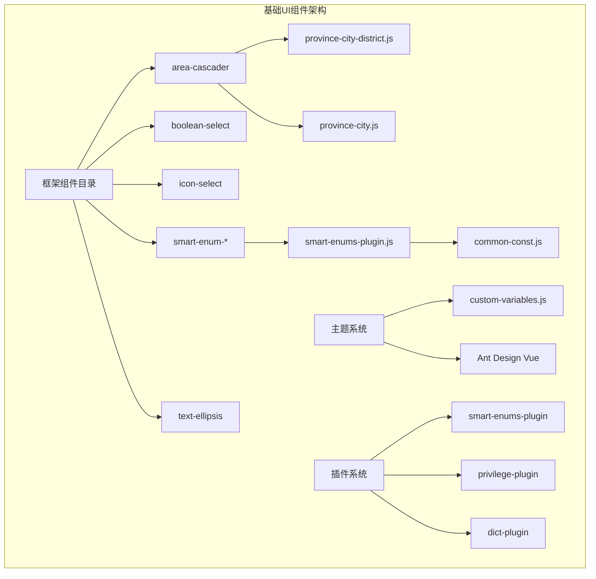
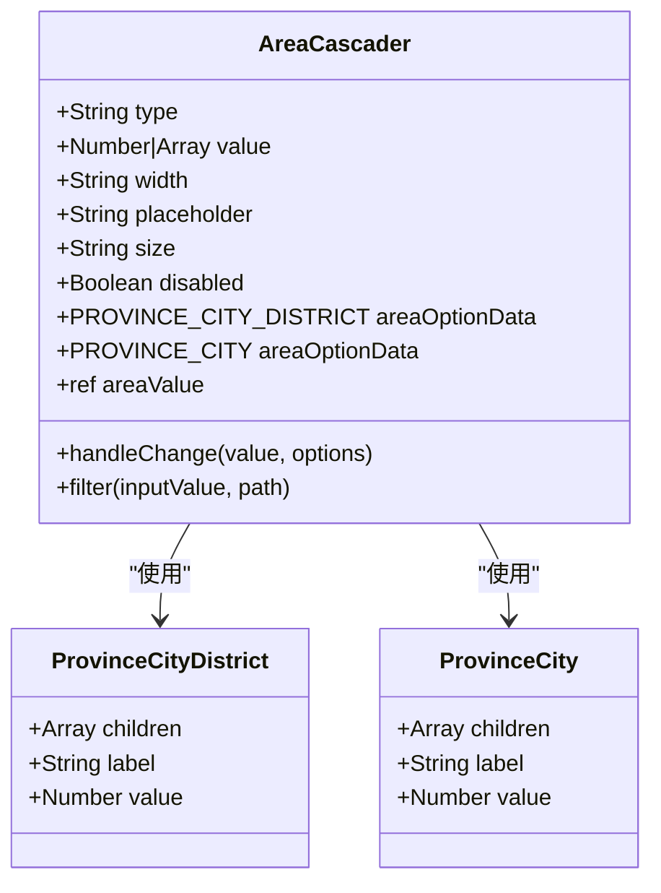
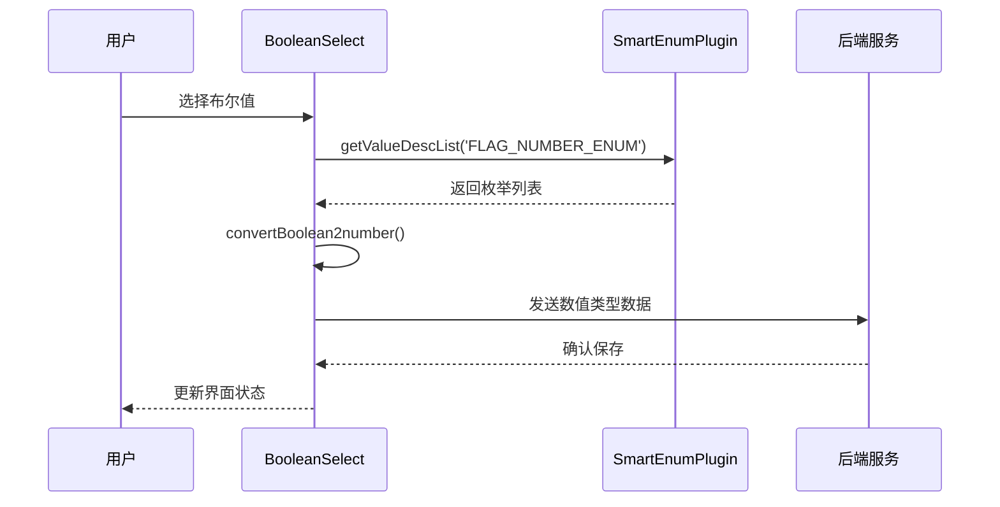
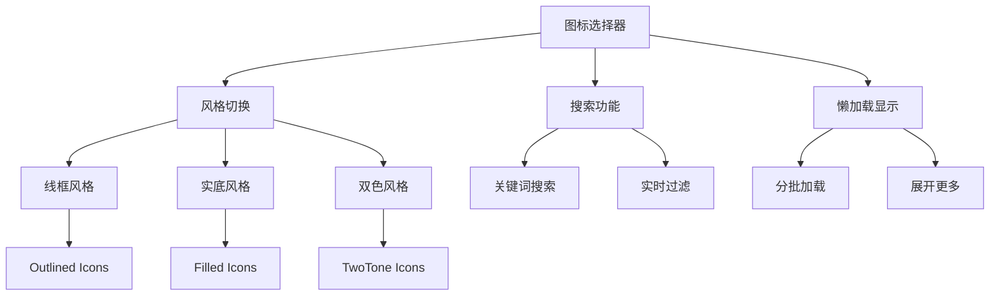
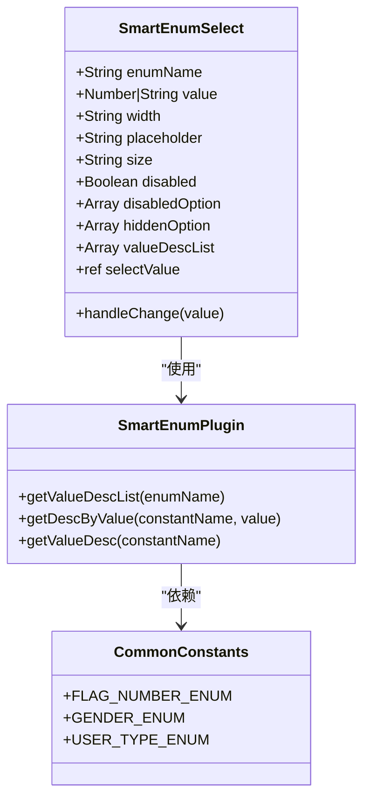
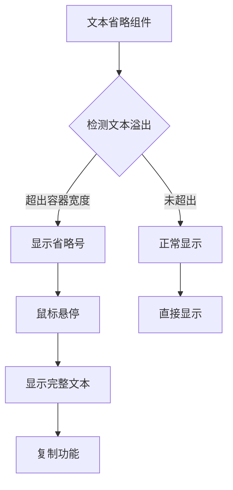
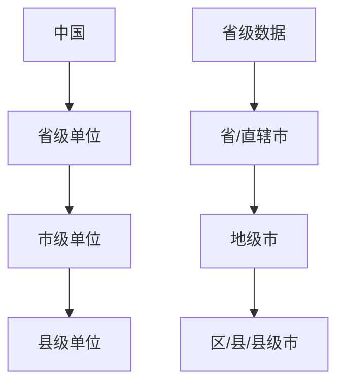
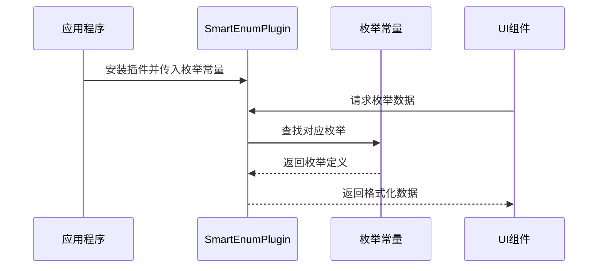
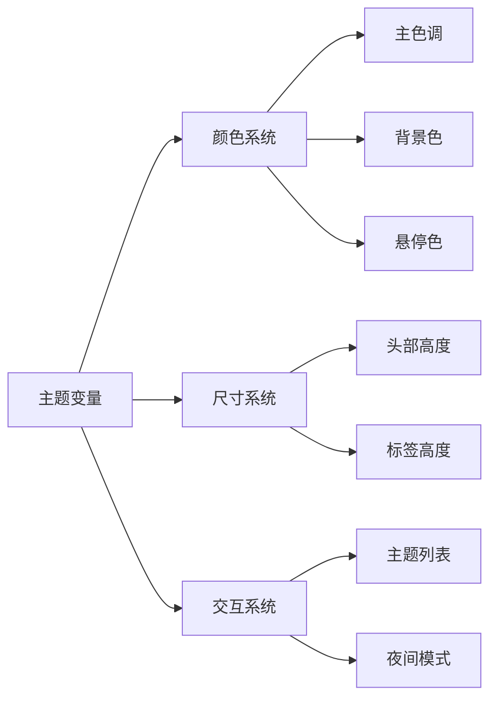
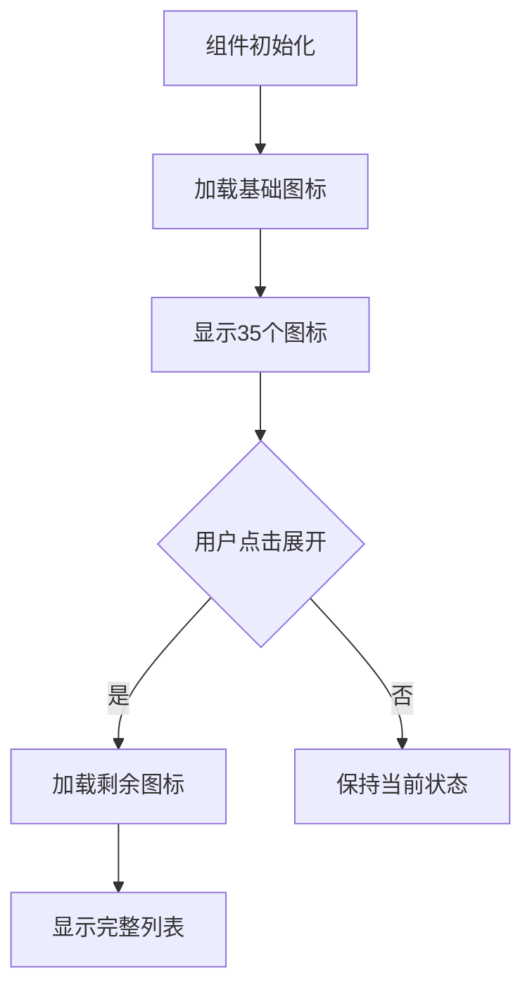

# 基础UI组件

<cite>
**本文档引用的文件**
- [area-cascader/index.vue](file://smart-admin-web-javascript/src/components/framework/area-cascader/index.vue)
- [boolean-select/index.vue](file://smart-admin-web-javascript/src/components/framework/boolean-select/index.vue)
- [icon-select/index.vue](file://smart-admin-web-javascript/src/components/framework/icon-select/index.vue)
- [province-city-district.js](file://smart-admin-web-javascript/src/components/framework/area-cascader/province-city-district.js)
- [province-city.js](file://smart-admin-web-javascript/src/components/framework/area-cascader/province-city.js)
- [smart-enum-select/index.vue](file://smart-admin-web-javascript/src/components/framework/smart-enum-select/index.vue)
- [smart-enum-radio/index.vue](file://smart-admin-web-javascript/src/components/framework/smart-enum-radio/index.vue)
- [smart-enum-checkbox/index.vue](file://smart-admin-web-javascript/src/components/framework/smart-enum-checkbox/index.vue)
- [text-ellipsis/index.vue](file://smart-admin-web-javascript/src/components/framework/text-ellipsis/index.vue)
- [smart-enums-plugin.js](file://smart-admin-web-javascript/src/plugins/smart-enums-plugin.js)
- [common-const.js](file://smart-admin-web-javascript/src/constants/common-const.js)
- [custom-variables.js](file://smart-admin-web-javascript/src/theme/custom-variables.js)
- [main.js](file://smart-admin-web-javascript/src/main.js)
</cite>

## 目录
1. [简介](#简介)
2. [项目架构](#项目架构)
3. [核心组件分析](#核心组件分析)
4. [数据源与集成](#数据源与集成)
5. [样式系统与主题定制](#样式系统与主题定制)
6. [性能优化策略](#性能优化策略)
7. [使用示例](#使用示例)
8. [最佳实践](#最佳实践)
9. [总结](#总结)

## 简介

本文档详细介绍Smart Admin框架中的基础UI组件系统，重点分析框架组件（framework）的设计与实现。该系统包含级联选择器（area-cascader）、布尔选择器（boolean-select）、图标选择器（icon-select）等通用组件，以及基于枚举的智能选择组件系列。

这些组件采用Vue 3 Composition API设计，具有良好的可扩展性和复用性，支持多种数据源集成和主题定制。组件系统遵循Ant Design Vue的设计理念，同时提供了更丰富的交互体验和性能优化特性。

## 项目架构



**图表来源**
- [area-cascader/index.vue](file://smart-admin-web-javascript/src/components/framework/area-cascader/index.vue#L1-L88)
- [boolean-select/index.vue](file://smart-admin-web-javascript/src/components/framework/boolean-select/index.vue#L1-L81)
- [icon-select/index.vue](file://smart-admin-web-javascript/src/components/framework/icon-select/index.vue#L1-L134)

**章节来源**
- [main.js](file://smart-admin-web-javascript/src/main.js#L73-L98)

## 核心组件分析

### 级联选择器（Area Cascader）

级联选择器是地区选择的核心组件，支持省市区三级联动和省市两级选择两种模式。

#### 组件架构



**图表来源**
- [area-cascader/index.vue](file://smart-admin-web-javascript/src/components/framework/area-cascader/index.vue#L33-L52)
- [province-city-district.js](file://smart-admin-web-javascript/src/components/framework/area-cascader/province-city-district.js#L1-L800)

#### Props接口定义

| 属性名 | 类型 | 默认值 | 描述 |
|--------|------|--------|------|
| type | String | - | 选择器类型，'province_city_district'表示三级联动 |
| value | Number/Array | - | 组件绑定的值，可以是数字或数组 |
| width | String | '200px' | 组件宽度样式 |
| placeholder | String | '请选择地区' | 占位符文本 |
| size | String | 'default' | 尺寸大小：default/small/large |
| disabled | Boolean | false | 是否禁用组件 |

#### 事件机制

- `update:value`: 当选择值发生变化时触发，传递原始选项对象
- `change`: 当选择值发生变化时触发，传递扁平化的值数组

#### 搜索功能

组件内置了智能搜索功能，支持按标签名称模糊匹配：
- 不区分大小写
- 支持部分匹配
- 实时过滤显示结果

**章节来源**
- [area-cascader/index.vue](file://smart-admin-web-javascript/src/components/framework/area-cascader/index.vue#L33-L87)

### 布尔选择器（Boolean Select）

布尔选择器专门用于处理二进制状态的选择，如"是"/"否"、"启用"/"禁用"等场景。

#### 组件设计



**图表来源**
- [boolean-select/index.vue](file://smart-admin-web-javascript/src/components/framework/boolean-select/index.vue#L11-L81)
- [smart-enums-plugin.js](file://smart-admin-web-javascript/src/plugins/smart-enums-plugin.js#L46-L56)

#### 数据转换机制

组件实现了布尔值与数值之间的智能转换：
- 布尔值`true`转换为数值`1`
- 布尔值`false`转换为数值`0`
- 支持`null`、`undefined`等特殊情况处理
- 自动同步父组件传递的初始值

#### 枚举集成

通过智能枚举插件获取标准的布尔枚举：
- `FLAG_NUMBER_ENUM.TRUE`：值为1，描述为"是"
- `FLAG_NUMBER_ENUM.FALSE`：值为0，描述为"否"

**章节来源**
- [boolean-select/index.vue](file://smart-admin-web-javascript/src/components/framework/boolean-select/index.vue#L53-L80)
- [common-const.js](file://smart-admin-web-javascript/src/constants/common-const.js#L27-L36)

### 图标选择器（Icon Select）

图标选择器提供了丰富的图标库浏览和选择功能，支持多种图标风格和搜索。

#### 功能特性



**图表来源**
- [icon-select/index.vue](file://smart-admin-web-javascript/src/components/framework/icon-select/index.vue#L42-L61)

#### 图标分类系统

组件自动识别并分类Ant Design Vue图标：
- **线框风格**：以"Outlined"结尾的图标
- **实底风格**：以"Filled"结尾的图标  
- **双色风格**：以"TwoTone"结尾的图标

#### 性能优化

- **分页加载**：默认显示35个图标，点击"展开更多"加载剩余图标
- **搜索过滤**：实时搜索，减少DOM渲染压力
- **懒加载**：图标内容按需渲染

#### 插槽系统

组件提供了灵活的插槽机制：
- `iconSelect`插槽：自定义图标选择按钮的显示内容
- 支持完全自定义的触发元素

**章节来源**
- [icon-select/index.vue](file://smart-admin-web-javascript/src/components/framework/icon-select/index.vue#L1-L134)

### 枚举智能组件系列

#### 智能枚举选择器（Smart Enum Select）

智能枚举选择器基于统一的枚举系统，提供标准化的枚举值选择功能。



**图表来源**
- [smart-enum-select/index.vue](file://smart-admin-web-javascript/src/components/framework/smart-enum-select/index.vue#L31-L60)
- [smart-enums-plugin.js](file://smart-admin-web-javascript/src/plugins/smart-enums-plugin.js#L14-L82)

#### 可复用组件类型

| 组件名称 | 用途 | 特点 |
|----------|------|------|
| smart-enum-select | 下拉选择 | 支持搜索、清除、禁用选项 |
| smart-enum-radio | 单选按钮组 | 支持按钮样式和普通样式 |
| smart-enum-checkbox | 多选框组 | 支持全选、禁用选项 |

#### 通用配置参数

所有枚举组件共享以下配置：
- `enumName`: 枚举常量名称
- `value`: 当前选中的值
- `disabled`: 是否禁用整个组件
- `disabledOption`: 禁用的选项值数组
- `hiddenOption`: 隐藏的选项值数组

**章节来源**
- [smart-enum-select/index.vue](file://smart-admin-web-javascript/src/components/framework/smart-enum-select/index.vue#L1-L89)
- [smart-enum-radio/index.vue](file://smart-admin-web-javascript/src/components/framework/smart-enum-radio/index.vue#L1-L89)
- [smart-enum-checkbox/index.vue](file://smart-admin-web-javascript/src/components/framework/smart-enum-checkbox/index.vue#L1-L76)

### 文本省略组件（Text Ellipsis）

文本省略组件提供了智能的文本截断和溢出显示功能。

#### 工作原理



**图表来源**
- [text-ellipsis/index.vue](file://smart-admin-web-javascript/src/components/framework/text-ellipsis/index.vue#L24-L55)

#### 检测机制

组件通过DOM测量实现精确的溢出检测：
- 计算文本的实际渲染宽度
- 比较与容器的可用宽度
- 动态决定是否显示省略号

#### 交互功能

- **悬停提示**：鼠标悬停时显示完整文本
- **一键复制**：内置复制功能，方便用户复制完整内容
- **响应式设计**：自动适应容器尺寸变化

**章节来源**
- [text-ellipsis/index.vue](file://smart-admin-web-javascript/src/components/framework/text-ellipsis/index.vue#L1-L78)

## 数据源与集成

### 地区数据源

#### 数据结构设计

地区数据采用树形结构，支持两种粒度级别：



**图表来源**
- [province-city-district.js](file://smart-admin-web-javascript/src/components/framework/area-cascader/province-city-district.js#L1-L800)
- [province-city.js](file://smart-admin-web-javascript/src/components/framework/area-cascader/province-city.js#L1-L800)

#### 数据格式规范

每个地区节点包含：
- `label`: 地区名称
- `value`: 唯一标识符（行政区划代码）
- `children`: 子节点数组（仅非末端节点有）

#### 集成方式

组件通过ES6模块导入数据：
```javascript
import { PROVINCE_CITY_DISTRICT } from './province-city-district';
import { PROVINCE_CITY } from './province-city';
```

### 枚举数据集成

#### 枚举插件架构



**图表来源**
- [smart-enums-plugin.js](file://smart-admin-web-javascript/src/plugins/smart-enums-plugin.js#L14-L82)
- [main.js](file://smart-admin-web-javascript/src/main.js#L80-L81)

#### 枚举访问方法

插件提供了三种主要的枚举访问方法：
- `getValueDescList()`: 获取完整的键值对数组
- `getDescByValue()`: 根据值获取描述
- `getValueDesc()`: 获取值到描述的映射对象

**章节来源**
- [smart-enums-plugin.js](file://smart-admin-web-javascript/src/plugins/smart-enums-plugin.js#L23-L76)
- [common-const.js](file://smart-admin-web-javascript/src/constants/common-const.js#L27-L73)

## 样式系统与主题定制

### 主题变量系统

#### 变量定义结构



**图表来源**
- [custom-variables.js](file://smart-admin-web-javascript/src/theme/custom-variables.js#L9-L19)

#### 核心主题变量

| 变量名 | 默认值 | 用途 |
|--------|--------|------|
| `@primary-color` | `#1890ff` | 全局主色调 |
| `@base-bg-color` | `#ffffff` | 基础背景色 |
| `@hover-bg-color` | `rgba(0,0,0,0.025)` | 悬停背景色 |
| `@header-height` | `80px` | 顶部导航高度 |
| `@page-tag-height` | `40px` | 页面标签高度 |

### 样式隔离策略

#### Scoped CSS

所有组件都采用Scoped CSS确保样式隔离：
- 组件级别的样式作用域
- 避免全局样式污染
- 支持深度选择器

#### Less变量系统

组件使用Less预处理器，支持：
- 变量替换
- 混合函数
- 嵌套规则
- 响应式设计

**章节来源**
- [custom-variables.js](file://smart-admin-web-javascript/src/theme/custom-variables.js#L1-L20)

## 性能优化策略

### 懒加载机制

#### 图标选择器的懒加载



**图表来源**
- [icon-select/index.vue](file://smart-admin-web-javascript/src/components/framework/icon-select/index.vue#L57-L61)

#### 实现细节

- **分批加载**：首次加载35个图标，后续按需加载
- **计算优化**：使用`_.slice()`避免不必要的数组复制
- **用户体验**：加载过程中保持界面响应

### 虚拟滚动应用

虽然当前版本没有实现完整的虚拟滚动，但组件设计考虑了大数据集的处理：

#### 性能优化原则

1. **按需渲染**：只渲染可见区域的内容
2. **缓存机制**：缓存已渲染的DOM节点
3. **防抖处理**：搜索输入采用防抖机制
4. **内存管理**：及时清理不需要的DOM引用

#### 扩展建议

未来可以考虑：
- 引入虚拟滚动库（如vue-virtual-scroller）
- 实现无限滚动加载
- 添加骨架屏加载状态

**章节来源**
- [icon-select/index.vue](file://smart-admin-web-javascript/src/components/framework/icon-select/index.vue#L62-L95)

## 使用示例

### 基础使用场景

#### 地区选择器使用

```vue
<template>
  <!-- 省市区三级联动 -->
  <AreaCascader 
    type="province_city_district"
    v-model:value="selectedArea"
    @change="handleAreaChange"
  />
  
  <!-- 省市两级选择 -->
  <AreaCascader 
    type="province_city"
    v-model:value="selectedProvince"
    @change="handleProvinceChange"
  />
</template>

<script setup>
import { ref } from 'vue';

const selectedArea = ref([]);
const selectedProvince = ref([]);

const handleAreaChange = (value, options) => {
  console.log('选择的地区:', value, options);
};
</script>
```

#### 布尔选择器使用

```vue
<template>
  <BooleanSelect 
    v-model:value="isActive"
    width="150"
    placeholder="请选择状态"
    @change="handleStatusChange"
  />
</template>

<script setup>
import { ref } from 'vue';

const isActive = ref(true);

const handleStatusChange = (value) => {
  console.log('状态变更:', value);
};
</script>
```

#### 图标选择器使用

```vue
<template>
  <IconSelect @updateIcon="handleIconSelect">
    <a-button type="primary">
      <template #icon><component :is="selectedIcon" /></template>
      选择图标
    </a-button>
  </IconSelect>
</template>

<script setup>
import { ref } from 'vue';

const selectedIcon = ref('SmileOutlined');

const handleIconSelect = (iconName) => {
  selectedIcon.value = iconName;
};
</script>
```

### 高级使用场景

#### 枚举组件组合使用

```vue
<template>
  <a-form :model="form" :label-col="{ span: 6 }" :wrapper-col="{ span: 18 }">
    <a-form-item label="性别">
      <SmartEnumRadio 
        enumName="GENDER_ENUM"
        v-model:value="form.gender"
        isButton
      />
    </a-form-form-item>
    
    <a-form-item label="是否启用">
      <SmartEnumSelect 
        enumName="FLAG_NUMBER_ENUM"
        v-model:value="form.enabled"
        placeholder="请选择"
      />
    </a-form-item>
    
    <a-form-item label="角色类型">
      <SmartEnumCheckbox 
        enumName="USER_TYPE_ENUM"
        v-model:value="form.roles"
        :disabledOption="[1]"
      />
    </a-form-item>
  </a-form>
</template>

<script setup>
import { reactive } from 'vue';

const form = reactive({
  gender: 1,
  enabled: 1,
  roles: [2]
});
</script>
```

#### 表单验证集成

```vue
<template>
  <a-form :model="form" :rules="rules" ref="formRef">
    <a-form-item label="地区选择" name="area">
      <AreaCascader 
        v-model:value="form.area"
        placeholder="请选择地区"
      />
    </a-form-item>
    
    <a-form-item label="状态" name="status">
      <BooleanSelect 
        v-model:value="form.status"
        width="150"
      />
    </a-form-item>
    
    <a-form-item>
      <a-button type="primary" @click="handleSubmit">提交</a-button>
    </a-form-item>
  </a-form>
</template>

<script setup>
import { ref } from 'vue';

const formRef = ref(null);
const form = ref({ area: [], status: true });

const rules = {
  area: [{ required: true, message: '请选择地区' }],
  status: [{ required: true, message: '请选择状态' }]
};

const handleSubmit = async () => {
  try {
    await formRef.value.validate();
    // 提交表单
  } catch (error) {
    console.log('表单验证失败:', error);
  }
};
</script>
```

## 最佳实践

### 组件选择指南

#### 根据使用场景选择合适的组件

| 使用场景 | 推荐组件 | 说明 |
|----------|----------|------|
| 地区选择 | AreaCascader | 支持省市区三级联动 |
| 布尔值选择 | BooleanSelect | 标准的"是/否"选择 |
| 图标选择 | IconSelect | 丰富的图标库浏览 |
| 枚举值选择 | SmartEnum* | 基于枚举的标准化选择 |
| 长文本显示 | TextEllipsis | 智能省略和溢出处理 |

### 性能优化建议

#### 数据加载优化

1. **按需加载**：只在需要时加载地区数据
2. **缓存策略**：合理缓存枚举数据
3. **分页处理**：大量选项时使用分页或虚拟滚动

#### 渲染优化

1. **避免频繁更新**：合理设置v-model的更新时机
2. **使用防抖**：搜索功能添加防抖处理
3. **懒加载**：图标等资源采用懒加载

### 主题定制指南

#### 自定义主题变量

```javascript
// 在custom-variables.js中添加自定义变量
export default {
  // 继承原有变量
  ...originalVariables,
  
  // 新增自定义变量
  '@custom-primary': '#52c41a',
  '@custom-border-radius': '8px',
  '@custom-shadow': '0 2px 8px rgba(0,0,0,0.15)'
};
```

#### 组件样式覆盖

```css
/* 在组件的scoped样式中覆盖默认样式 */
.custom-area-cascader {
  .ant-cascader-picker {
    border-radius: var(--custom-border-radius);
    box-shadow: var(--custom-shadow);
  }
}
```

### 错误处理策略

#### 输入验证

```vue
<template>
  <a-form :model="form">
    <a-form-item 
      label="地区" 
      :validate-status="areaError ? 'error' : ''"
      :help="areaError"
    >
      <AreaCascader 
        v-model:value="form.area"
        @change="validateArea"
      />
    </a-form-item>
  </a-form>
</template>

<script setup>
import { ref } from 'vue';

const form = ref({ area: [] });
const areaError = ref('');

const validateArea = (value) => {
  if (!value || value.length < 3) {
    areaError.value = '请选择完整的省市区';
  } else {
    areaError.value = '';
  }
};
</script>
```

## 总结

Smart Admin的基础UI组件系统展现了现代前端框架的最佳实践：

### 核心优势

1. **统一的设计语言**：基于Ant Design Vue，保持一致的用户体验
2. **强大的扩展性**：插件化架构支持灵活的功能扩展
3. **优秀的性能表现**：懒加载、防抖等优化策略确保流畅体验
4. **完善的类型系统**：TypeScript友好的Props定义和事件机制
5. **灵活的主题定制**：支持深度定制和多主题切换

### 技术特色

- **Composition API**：充分利用Vue 3的新特性
- **插件系统**：智能枚举插件提供统一的数据访问
- **数据驱动**：基于枚举和常量的标准化数据源
- **响应式设计**：适配不同屏幕尺寸和设备
- **无障碍支持**：符合Web无障碍访问标准

### 发展方向

1. **性能优化**：引入虚拟滚动和更高效的渲染策略
2. **功能增强**：添加更多交互特性和动画效果
3. **国际化支持**：完善多语言和本地化功能
4. **移动端优化**：针对移动设备的特殊优化
5. **可访问性提升**：加强键盘导航和屏幕阅读器支持

这套基础UI组件系统不仅满足了当前的业务需求，更为未来的功能扩展和技术演进奠定了坚实的基础。通过持续的优化和完善，它将成为构建高质量企业级应用的重要基石。