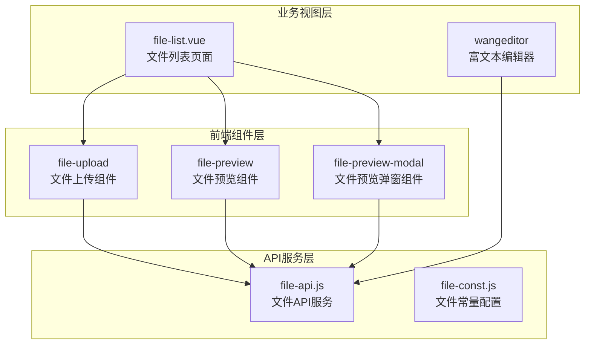
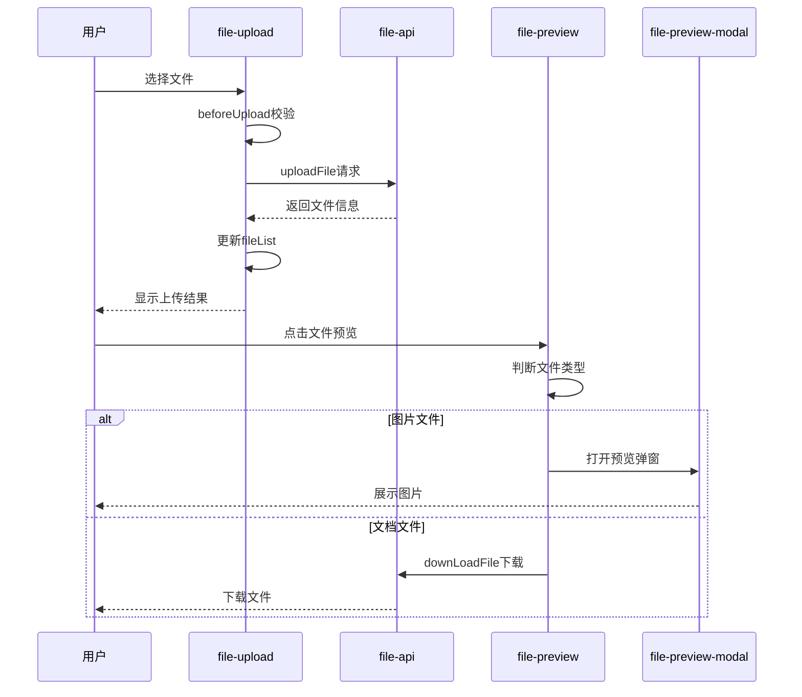
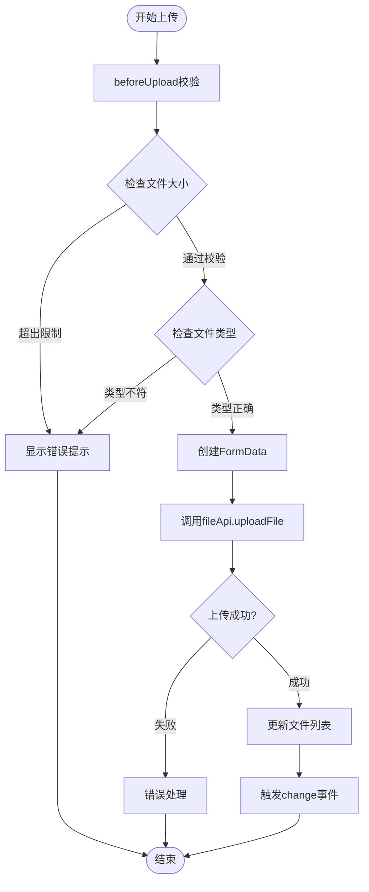
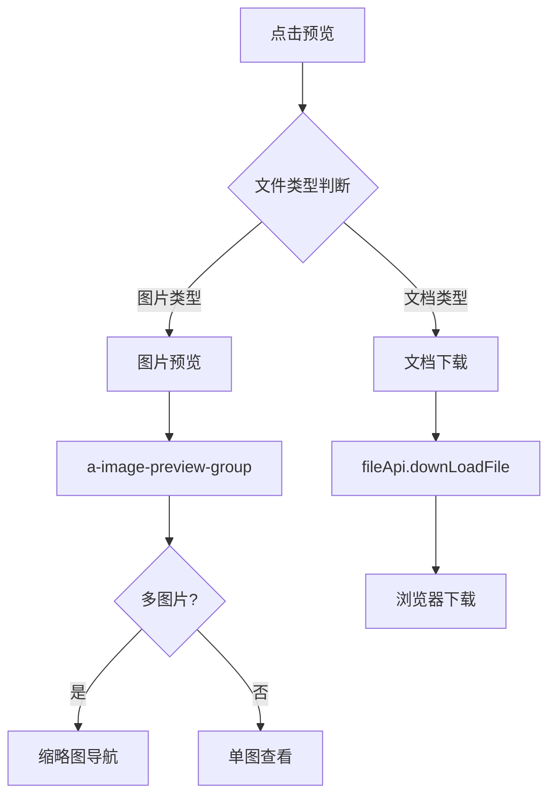
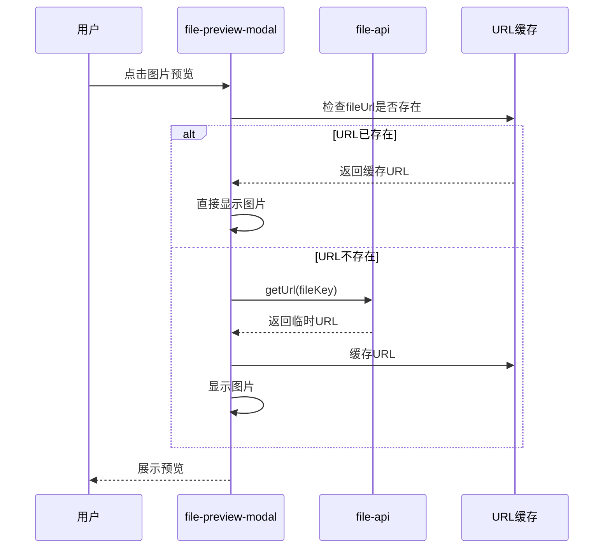
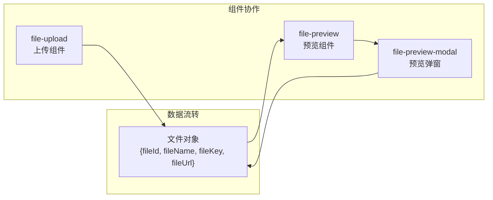
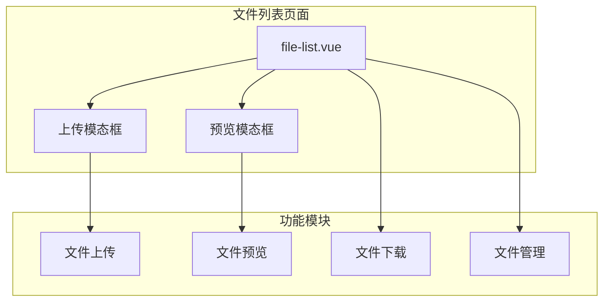

# 上传类组件

<cite>
**本文档中引用的文件**
- [file-upload/index.vue](file://smart-admin-web-javascript/src/components/support/file-upload/index.vue)
- [file-preview/index.vue](file://smart-admin-web-javascript/src/components/support/file-preview/index.vue)
- [file-preview-modal/index.vue](file://smart-admin-web-javascript/src/components/support/file-preview-modal/index.vue)
- [file-api.js](file://smart-admin-web-javascript/src/api/support/file-api.js)
- [file-const.js](file://smart-admin-web-javascript/src/constants/support/file-const.js)
- [file-list.vue](file://smart-admin-web-javascript/src/views/support/file/file-list.vue)
- [wangeditor/index.vue](file://smart-admin-web-javascript/src/components/framework/wangeditor/index.vue)
</cite>

## 目录
1. [简介](#简介)
2. [项目结构](#项目结构)
3. [核心组件](#核心组件)
4. [架构概览](#架构概览)
5. [详细组件分析](#详细组件分析)
6. [集成关系](#集成关系)
7. [配置选项](#配置选项)
8. [业务场景应用](#业务场景应用)
9. [性能考虑](#性能考虑)
10. [故障排除指南](#故障排除指南)
11. [总结](#总结)

## 简介

SmartAdmin框架提供了一套完整的文件上传复合组件体系，包括`file-upload`、`file-preview`和`file-preview-modal`三个核心组件。这套组件体系实现了从文件上传到预览管理的完整流程，支持多种上传模式和丰富的配置选项，为开发者提供了统一、易用的文件处理解决方案。

## 项目结构

文件上传组件体系采用模块化设计，各组件职责明确，相互协作：



**图表来源**
- [file-upload/index.vue](file://smart-admin-web-javascript/src/components/support/file-upload/index.vue#L1-L50)
- [file-preview/index.vue](file://smart-admin-web-javascript/src/components/support/file-preview/index.vue#L1-L30)
- [file-preview-modal/index.vue](file://smart-admin-web-javascript/src/components/support/file-preview-modal/index.vue#L1-L30)

**章节来源**
- [file-upload/index.vue](file://smart-admin-web-javascript/src/components/support/file-upload/index.vue#L1-L230)
- [file-preview/index.vue](file://smart-admin-web-javascript/src/components/support/file-preview/index.vue#L1-L80)
- [file-preview-modal/index.vue](file://smart-admin-web-javascript/src/components/support/file-preview-modal/index.vue#L1-L84)

## 核心组件

### file-upload 组件

`file-upload`是整个文件上传体系的核心组件，负责封装上传逻辑并提供统一接口。它基于Ant Design Vue的`a-upload`组件进行二次封装，提供了完整的文件上传功能。

#### 主要特性：
- **多种上传模式**：支持单文件、多文件上传
- **拖拽上传**：内置拖拽区域，提升用户体验
- **文件校验**：支持文件类型、大小限制
- **进度反馈**：提供上传状态和进度显示
- **错误处理**：完善的异常捕获和用户提示

#### 核心配置参数：

| 参数名 | 类型 | 默认值 | 描述 |
|--------|------|--------|------|
| value | String | - | 组件绑定值 |
| buttonText | String | '点击上传附件' | 上传按钮显示文字 |
| showUploadBtn | Boolean | true | 是否显示上传按钮 |
| defaultFileList | Array | [] | 默认文件列表 |
| multiple | Boolean | false | 是否支持多文件上传 |
| maxUploadSize | Number | 10 | 最大上传文件数量 |
| maxSize | Number | 10 | 单个文件最大大小(MB) |
| accept | String | '' | 允许的文件类型 |
| folder | Number | 1 | 文件上传分类 |
| listType | String | 'picture-card' | 上传列表样式 |

### file-preview 组件

`file-preview`组件专注于文件预览功能，支持文本和图片两种预览模式，为用户提供便捷的文件查看体验。

#### 主要特性：
- **双模式预览**：支持文本链接和图片预览
- **批量预览**：可同时预览多个文件
- **自动识别**：根据文件类型自动选择预览方式
- **自定义样式**：支持宽度和分隔符配置

### file-preview-modal 组件

`file-preview-modal`是一个独立的预览弹窗组件，专门用于图片文件的大图预览，提供更好的视觉体验。

#### 主要特性：
- **全屏预览**：支持图片全屏查看
- **缩略图导航**：多图片间的快速切换
- **异步加载**：按需获取文件URL
- **响应式设计**：适配不同屏幕尺寸

**章节来源**
- [file-upload/index.vue](file://smart-admin-web-javascript/src/components/support/file-upload/index.vue#L42-L96)
- [file-preview/index.vue](file://smart-admin-web-javascript/src/components/support/file-preview/index.vue#L37-L80)
- [file-preview-modal/index.vue](file://smart-admin-web-javascript/src/components/support/file-preview-modal/index.vue#L25-L84)

## 架构概览

文件上传复合组件体系采用分层架构设计，确保了组件的高内聚低耦合：



**图表来源**
- [file-upload/index.vue](file://smart-admin-web-javascript/src/components/support/file-upload/index.vue#L130-L146)
- [file-preview/index.vue](file://smart-admin-web-javascript/src/components/support/file-preview/index.vue#L62-L70)
- [file-preview-modal/index.vue](file://smart-admin-web-javascript/src/components/support/file-preview-modal/index.vue#L34-L50)

## 详细组件分析

### file-upload 组件深度解析

#### 上传流程控制



**图表来源**
- [file-upload/index.vue](file://smart-admin-web-javascript/src/components/support/file-upload/index.vue#L165-L184)

#### 文件类型校验机制

组件实现了多层次的文件校验机制：

1. **数量限制校验**：防止用户上传过多文件
2. **大小限制校验**：确保单个文件不超过设定大小
3. **类型限制校验**：根据accept属性过滤不支持的文件类型

#### 进度反馈机制

通过`SmartLoading`组件实现全局加载状态管理，配合`Modal.error`提供错误提示，确保用户能够及时了解上传状态。

**章节来源**
- [file-upload/index.vue](file://smart-admin-web-javascript/src/components/support/file-upload/index.vue#L130-L184)

### file-preview 组件深度解析

#### 预览模式选择



**图表来源**
- [file-preview/index.vue](file://smart-admin-web-javascript/src/components/support/file-preview/index.vue#L62-L70)

#### 图片类型识别

组件维护了一个图片文件类型白名单，包含常见的图片格式：
- jpg, jpeg
- png  
- gif

**章节来源**
- [file-preview/index.vue](file://smart-admin-web-javascript/src/components/support/file-preview/index.vue#L62-L70)

### file-preview-modal 组件深度解析

#### 异步加载策略



**图表来源**
- [file-preview-modal/index.vue](file://smart-admin-web-javascript/src/components/support/file-preview-modal/index.vue#L34-L50)

**章节来源**
- [file-preview-modal/index.vue](file://smart-admin-web-javascript/src/components/support/file-preview-modal/index.vue#L34-L65)

## 集成关系

### 组件间协作关系

三个组件通过统一的文件对象结构进行数据传递，形成了完整的文件处理链：



**图表来源**
- [file-upload/index.vue](file://smart-admin-web-javascript/src/components/support/file-upload/index.vue#L101-L112)
- [file-preview/index.vue](file://smart-admin-web-javascript/src/components/support/file-preview/index.vue#L37-L60)

### 与文件API服务的交互

所有组件都通过统一的`file-api`服务与后端进行通信：

| API方法 | 功能描述 | 参数 | 返回值 |
|---------|----------|------|--------|
| uploadFile | 文件上传 | formData, folder | 文件信息对象 |
| getUrl | 获取文件URL | fileKey | 临时访问URL |
| downLoadFile | 文件下载 | fileKey | 文件流 |
| queryPage | 分页查询 | 分页参数 | 文件列表 |

**章节来源**
- [file-api.js](file://smart-admin-web-javascript/src/api/support/file-api.js#L12-L38)

## 配置选项

### 文件上传配置

#### 基础配置

```javascript
// 基础上传配置示例
<FileUpload
  :defaultFileList="fileList"
  :folder="FILE_FOLDER_TYPE_ENUM.COMMON.value"
  buttonText="上传头像"
  listType="picture-card"
  @change="handleFileChange"
/>
```

#### 高级配置选项

```javascript
// 高级配置示例
<FileUpload
  :maxUploadSize="5"
  :maxSize="5"
  accept=".jpg,.png,.pdf"
  :multiple="true"
  :showUploadBtn="true"
  listType="text"
  buttonText="添加附件"
/>
```

### 文件类型枚举

系统提供了标准化的文件分类体系：

| 分类名称 | 数值 | 描述 |
|----------|------|------|
| COMMON | 1 | 通用文件 |
| NOTICE | 2 | 公告文件 |
| HELP_DOC | 3 | 帮助中心文件 |
| FEEDBACK | 4 | 意见反馈文件 |

**章节来源**
- [file-const.js](file://smart-admin-web-javascript/src/constants/support/file-const.js#L11-L28)

## 业务场景应用

### 附件管理系统

在文件列表页面中，三个组件协同工作，提供完整的文件管理功能：



**图表来源**
- [file-list.vue](file://smart-admin-web-javascript/src/views/support/file/file-list.vue#L264-L291)

### 富文本编辑器集成

在富文本编辑器中，文件上传组件被集成作为图片上传功能：

```javascript
// 富文本编辑器图片上传配置
const customUpload = {
  onSuccess: (res, file) => {
    // 处理上传成功
    insertFn(res.data.fileUrl);
  },
  onError: (error) => {
    // 处理上传失败
    smartSentry.captureError(error);
  }
};
```

**章节来源**
- [wangeditor/index.vue](file://smart-admin-web-javascript/src/components/framework/wangeditor/index.vue#L41-L92)

### 头像上传场景

针对头像上传的特殊需求，可以进行专门的配置：

```javascript
// 头像上传配置
<FileUpload
  :maxUploadSize="1"
  :maxSize="2"
  accept=".jpg,.jpeg,.png"
  listType="picture-card"
  buttonText="更换头像"
/>
```

## 性能考虑

### 文件上传优化

1. **分片上传**：对于大文件，建议实现分片上传机制
2. **压缩处理**：对图片文件进行预压缩，减少传输时间
3. **并发控制**：限制同时上传的文件数量
4. **断点续传**：在网络不稳定时提供断点续传功能

### 内存管理

1. **懒加载**：图片预览采用懒加载策略
2. **缓存清理**：及时清理不再需要的文件URL缓存
3. **虚拟滚动**：对于大量文件列表，使用虚拟滚动技术

### 网络优化

1. **CDN加速**：文件访问路径支持CDN加速
2. **压缩传输**：启用gzip压缩减少传输体积
3. **连接复用**：利用HTTP/2的多路复用特性

## 故障排除指南

### 常见问题及解决方案

#### 上传失败问题

**问题现象**：文件上传过程中出现错误提示

**排查步骤**：
1. 检查网络连接状态
2. 验证文件大小是否超出限制
3. 确认文件类型是否符合要求
4. 检查服务器存储空间

**解决方案**：
```javascript
// 添加详细的错误处理
const customRequest = async (options) => {
  try {
    // 上传逻辑
  } catch (error) {
    console.error('上传失败:', error);
    // 显示友好的错误提示
    Modal.error({
      title: '上传失败',
      content: error.message || '请检查网络连接或稍后重试'
    });
  }
};
```

#### 预览功能异常

**问题现象**：图片无法正常预览或下载

**排查步骤**：
1. 检查文件URL是否有效
2. 验证文件权限设置
3. 确认跨域配置

**解决方案**：
```javascript
// 添加预览失败的降级处理
const showFile = (fileItem) => {
  if (!fileItem.fileUrl) {
    // 尝试重新获取URL
    fileApi.getUrl(fileItem.fileKey)
      .then(res => {
        fileItem.fileUrl = res.data;
        // 继续预览流程
      })
      .catch(() => {
        // 提示用户下载
        Modal.info({
          title: '提示',
          content: '文件预览失败，请尝试下载查看'
        });
      });
  }
};
```

### 调试技巧

1. **浏览器开发者工具**：监控网络请求和响应
2. **Vue DevTools**：调试组件状态变化
3. **控制台日志**：添加详细的日志输出
4. **错误边界**：使用React Error Boundary捕获异常

**章节来源**
- [file-upload/index.vue](file://smart-admin-web-javascript/src/components/support/file-upload/index.vue#L187-L201)
- [file-preview-modal/index.vue](file://smart-admin-web-javascript/src/components/support/file-preview-modal/index.vue#L34-L50)

## 总结

SmartAdmin的文件上传复合组件体系提供了一套完整、灵活且易于使用的文件处理解决方案。通过`file-upload`、`file-preview`和`file-preview-modal`三个核心组件的协同工作，实现了从文件上传到预览管理的完整流程。

### 主要优势

1. **组件化设计**：每个组件职责明确，便于维护和扩展
2. **配置灵活**：丰富的配置选项满足不同业务场景需求
3. **用户体验**：提供直观的操作界面和流畅的交互体验
4. **错误处理**：完善的异常捕获和用户提示机制
5. **性能优化**：采用懒加载、缓存等技术提升性能

### 最佳实践

1. **合理配置参数**：根据业务需求调整上传限制和样式
2. **错误处理**：实现完善的错误处理和用户提示
3. **性能监控**：关注上传速度和资源消耗
4. **安全考虑**：加强文件类型和大小校验
5. **用户体验**：提供清晰的状态反馈和操作指引

这套组件体系不仅适用于简单的文件上传场景，也可以通过适当的配置和扩展，满足复杂的业务需求，是现代Web应用中文件处理的理想选择。