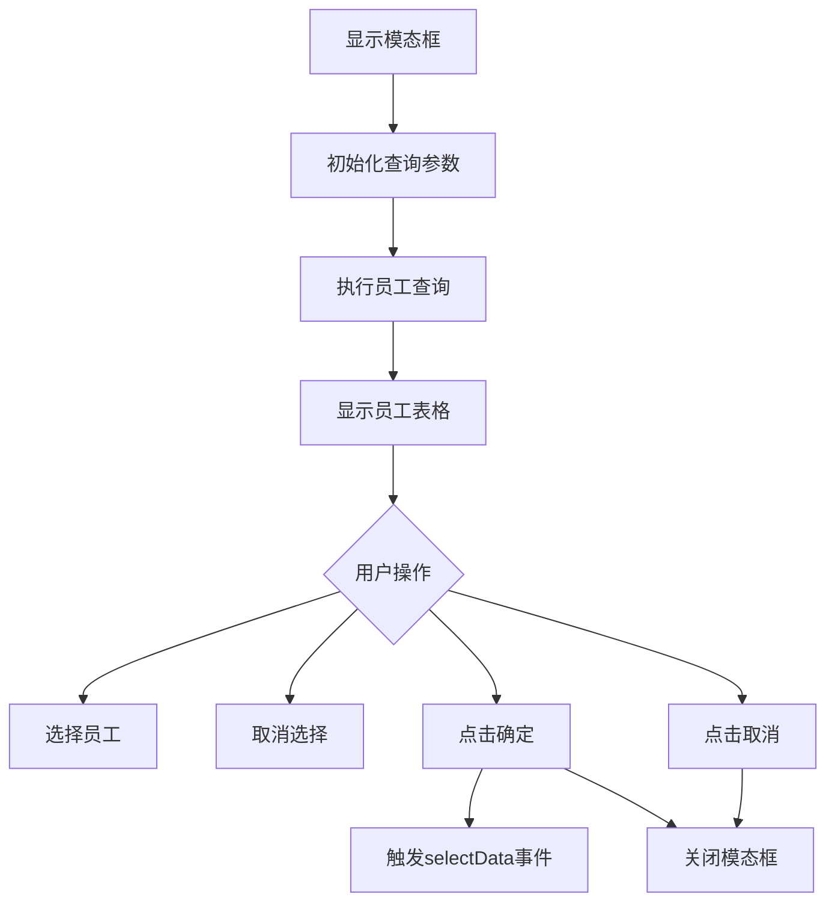
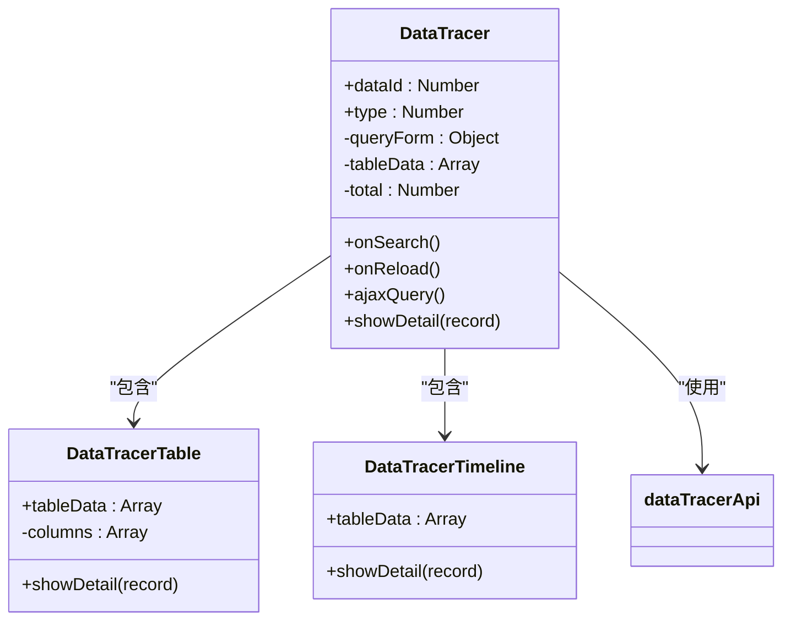
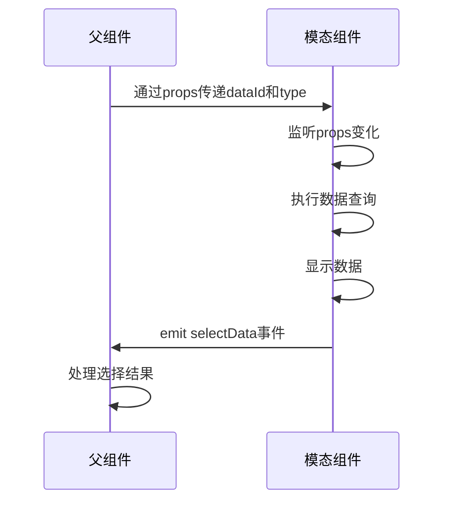
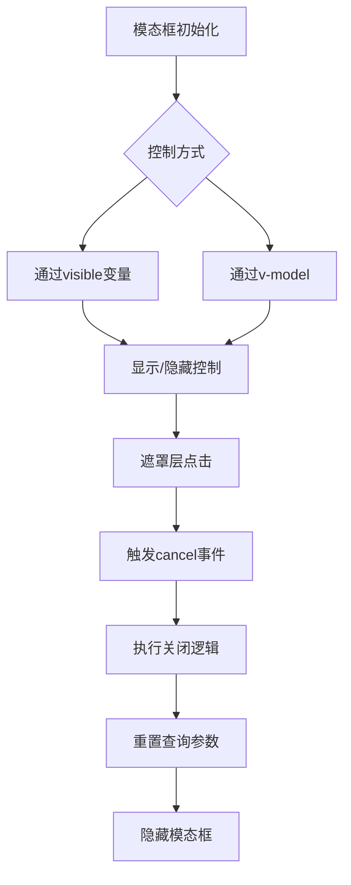
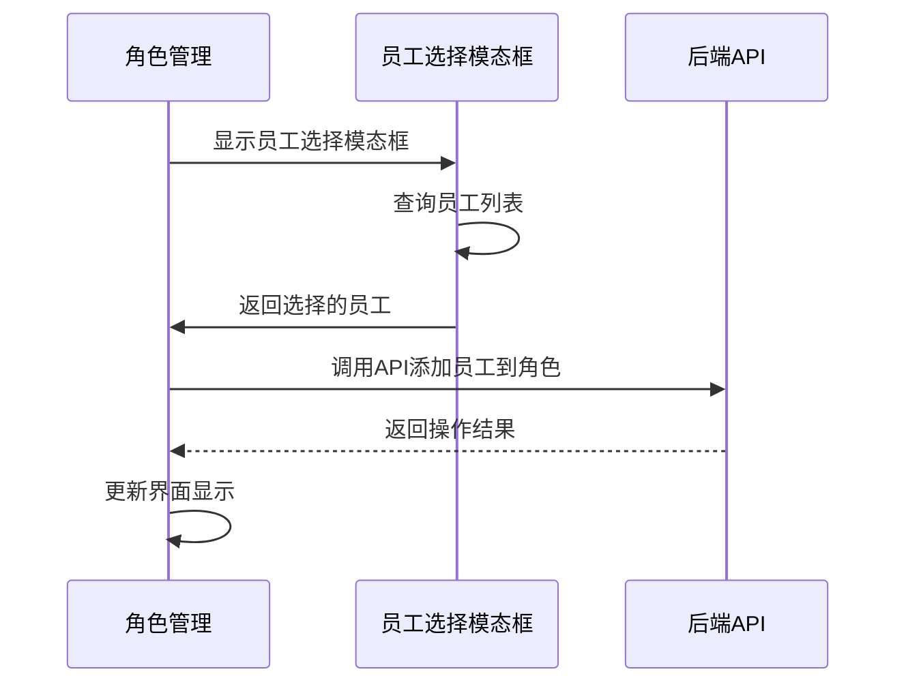

# 模态类组件

<cite>
**本文档引用的文件**   
- [employee-table-select-modal/index.vue](file://smart-admin-web-javascript\src\components\system\employee-table-select-modal\index.vue)
- [data-tracer/index.vue](file://smart-admin-web-javascript\src\components\support\data-tracer\index.vue)
- [data-tracer-table.vue](file://smart-admin-web-javascript\src\components\support\data-tracer\data-tracer-table.vue)
- [data-tracer-timeline.vue](file://smart-admin-web-javascript\src\components\support\data-tracer\data-tracer-timeline.vue)
- [data-tracer-api.js](file://smart-admin-web-javascript\src\api\support\data-tracer-api.js)
- [data-tracer-const.js](file://smart-admin-web-javascript\src\constants\support\data-tracer-const.js)
- [common-const.js](file://smart-admin-web-javascript\src\constants\common-const.js)
</cite>

## 目录
1. [简介](#简介)
2. [员工选择模态框实现机制](#员工选择模态框实现机制)
3. [数据追踪组件架构](#数据追踪组件架构)
4. [数据绑定与事件通信](#数据绑定与事件通信)
5. [模态框通用行为封装](#模态框通用行为封装)
6. [复杂交互场景应用实例](#复杂交互场景应用实例)
7. [结论](#结论)

## 简介
本文档系统化地文档化了模态类复合组件，重点分析了`employee-table-select-modal`在员工选择场景中的实现机制。深入解析了`data-tracer`组件如何通过`data-tracer-table`和`data-tracer-timeline`子组件构建数据变更追踪的可视化界面。说明了这些模态组件如何通过emit事件和props实现与父组件的数据双向绑定。阐述了模态框的打开关闭控制、遮罩层交互、响应式布局等通用行为的封装策略。提供了在权限分配、审计日志查看等复杂交互场景的使用范例。

## 员工选择模态框实现机制
`employee-table-select-modal`组件实现了员工选择功能，提供了一个完整的模态对话框界面，包含查询表单、员工表格和分页功能。该组件主要用于需要从员工列表中选择一个或多个员工的场景。

组件通过`showModal`方法暴露给父组件，允许父组件控制模态框的显示。当调用`showModal`时，可以传入已选择的员工ID列表，这些员工在表格中将被禁用选择，防止重复选择。查询功能支持按关键字、部门和状态进行筛选，提供了重置功能以恢复默认查询条件。

表格使用了Ant Design Vue的`a-table`组件，实现了行选择功能，用户可以选择一个或多个员工。表格列包括姓名、手机号、性别、登录账号和状态，其中状态和性别字段通过枚举插件进行值到描述的转换显示。

**组件源码**
- [employee-table-select-modal/index.vue](file://smart-admin-web-javascript\src\components\system\employee-table-select-modal\index.vue#L1-L199)

**Section sources**
- [employee-table-select-modal/index.vue](file://smart-admin-web-javascript\src\components\system\employee-table-select-modal\index.vue#L1-L199)

## 数据追踪组件架构
`data-tracer`组件通过`data-tracer-table`和`data-tracer-timeline`两个子组件构建了数据变更追踪的可视化界面。该组件用于展示系统中数据变更的历史记录，支持表格和时间轴两种展示模式。

`data-tracer`主组件负责查询表单的管理、数据获取和分页功能。它接收`dataId`和`type`两个props参数，分别表示要追踪的数据ID和数据类型。组件通过`data-tracer-api`调用后端接口获取数据变更记录，并在界面中展示。

`data-tracer-table`组件以表格形式展示数据变更记录，包含序号、操作时间、操作人、IP、IP地区、客户端、操作内容和操作等列。`data-tracer-timeline`组件则以时间轴形式展示数据变更记录，更适合查看变更的时间顺序。

**组件源码**
- [data-tracer/index.vue](file://smart-admin-web-javascript\src\components\support\data-tracer\index.vue#L1-L180)
- [data-tracer-table.vue](file://smart-admin-web-javascript\src\components\support\data-tracer\data-tracer-table.vue#L1-L98)
- [data-tracer-timeline.vue](file://smart-admin-web-javascript\src\components\support\data-tracer\data-tracer-timeline.vue#L1-L51)

**Diagram sources**
- [data-tracer/index.vue](file://smart-admin-web-javascript\src\components\support\data-tracer\index.vue#L1-L180)
- [data-tracer-table.vue](file://smart-admin-web-javascript\src\components\support\data-tracer\data-tracer-table.vue#L1-L98)
- [data-tracer-timeline.vue](file://smart-admin-web-javascript\src\components\support\data-tracer\data-tracer-timeline.vue#L1-L51)

**Section sources**
- [data-tracer/index.vue](file://smart-admin-web-javascript\src\components\support\data-tracer\index.vue#L1-L180)
- [data-tracer-table.vue](file://smart-admin-web-javascript\src\components\support\data-tracer\data-tracer-table.vue#L1-L98)
- [data-tracer-timeline.vue](file://smart-admin-web-javascript\src\components\support\data-tracer\data-tracer-timeline.vue#L1-L51)

## 数据绑定与事件通信
模态组件通过emit事件和props实现与父组件的数据双向绑定。`employee-table-select-modal`组件通过`defineEmits(['selectData'])`定义了`selectData`事件，当用户选择员工并点击确定时，组件会触发此事件，将新选择的员工ID列表传递给父组件。

`data-tracer`组件通过props接收`dataId`和`type`参数，这些参数决定了要查询的数据变更记录。组件内部使用`watch`监听这些props的变化，当它们发生变化时，自动重新查询数据。

**API接口**
- [data-tracer-api.js](file://smart-admin-web-javascript\src\api\support\data-tracer-api.js#L1-L19)

**常量定义**
- [data-tracer-const.js](file://smart-admin-web-javascript\src\constants\support\data-tracer-const.js#L1-L30)
- [common-const.js](file://smart-admin-web-javascript\src\constants\common-const.js#L1-L73)

**Section sources**
- [data-tracer/index.vue](file://smart-admin-web-javascript\src\components\support\data-tracer\index.vue#L72-L82)
- [employee-table-select-modal/index.vue](file://smart-admin-web-javascript\src\components\system\employee-table-select-modal\index.vue#L88-L89)
- [data-tracer-api.js](file://smart-admin-web-javascript\src\api\support\data-tracer-api.js#L1-L19)

## 模态框通用行为封装
模态框的通用行为通过Ant Design Vue的`a-modal`组件进行封装，包括打开关闭控制、遮罩层交互、响应式布局等。`employee-table-select-modal`组件使用`v-model:open`绑定`visible`变量来控制模态框的显示和隐藏。

遮罩层交互通过`@cancel`事件处理，当用户点击遮罩层或取消按钮时，会触发`closeModal`方法。响应式布局通过设置`width`属性和`scroll`属性实现，确保在不同屏幕尺寸下都能良好显示。

**Section sources**
- [employee-table-select-modal/index.vue](file://smart-admin-web-javascript\src\components\system\employee-table-select-modal\index.vue#L11-L77)
- [regular-change-password-modal.vue](file://smart-admin-web-javascript\src\layout\components\change-password\regular-change-password-modal.vue#L11-L14)

## 复杂交互场景应用实例
在权限分配场景中，`employee-table-select-modal`组件被用于为角色分配员工。父组件通过`inject`获取当前角色ID，并在选择员工后调用API将员工添加到角色中。

在审计日志查看场景中，`data-tracer`组件被用于查看特定数据的变更历史。通过传入数据ID和类型，组件会显示该数据的所有变更记录，包括变更内容、操作人、操作时间等信息。

**实际使用示例**
- [role-employee-list/index.vue](file://smart-admin-web-javascript\src\views\system\role\components\role-employee-list\index.vue#L69-L109)

**Section sources**
- [role-employee-list/index.vue](file://smart-admin-web-javascript\src\views\system\role\components\role-employee-list\index.vue#L69-L109)
- [employee-table-select-modal/index.vue](file://smart-admin-web-javascript\src\components\system\employee-table-select-modal\index.vue#L146-L164)

## 结论
通过对`employee-table-select-modal`和`data-tracer`等模态类组件的分析，可以看出这些组件在设计上具有高度的复用性和灵活性。它们通过标准的Vue 3组合式API和Ant Design Vue组件库，实现了复杂的功能，同时保持了良好的可维护性。

这些模态组件的实现遵循了清晰的职责分离原则，将UI展示、数据获取和业务逻辑分离，使得组件易于理解和维护。通过emit事件和props的通信机制，实现了父子组件之间的松耦合，提高了组件的复用性。

在实际应用中，这些模态组件被广泛用于各种需要用户交互的场景，如员工选择、权限分配、审计日志查看等，为系统提供了统一的用户体验。