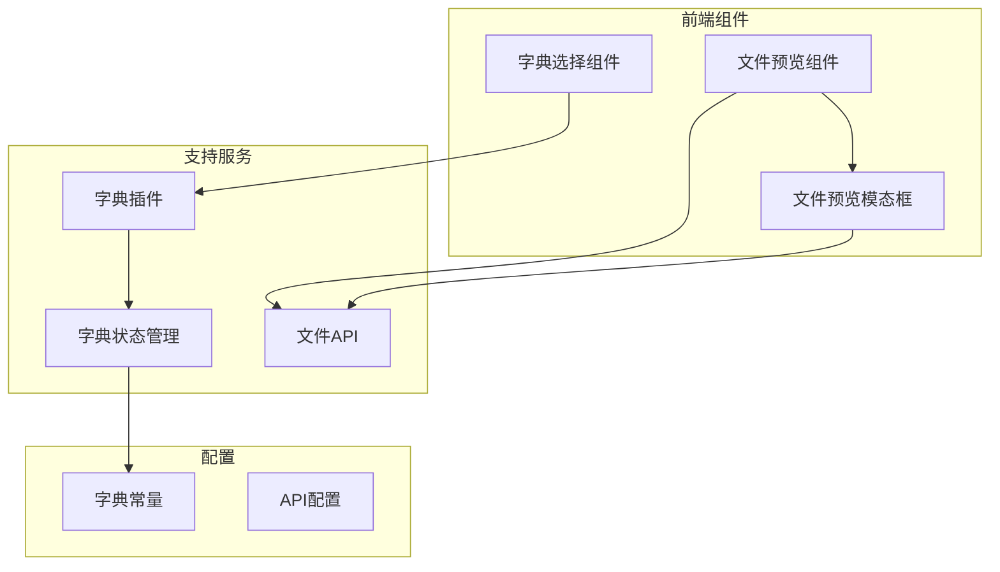
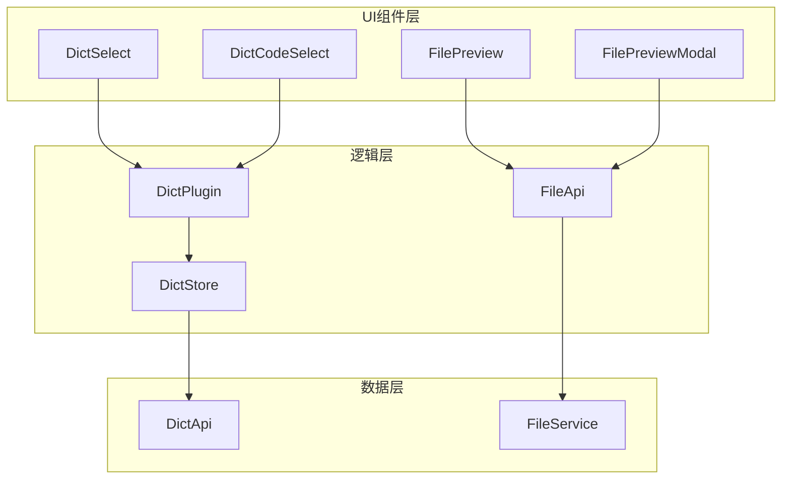
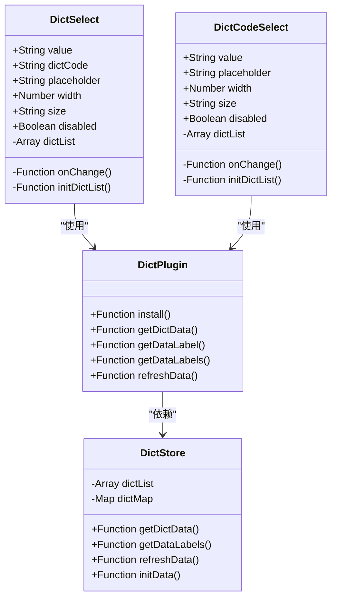
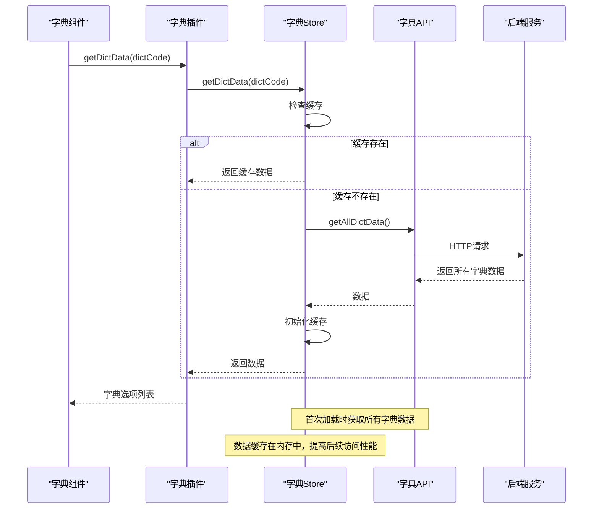
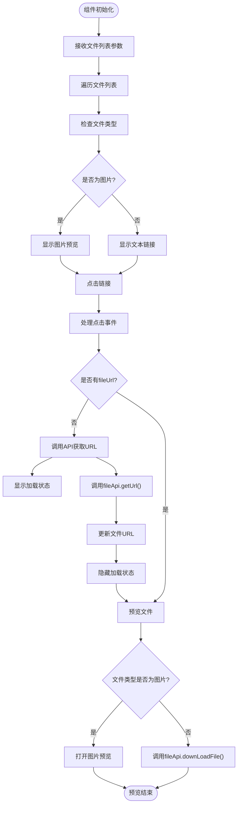
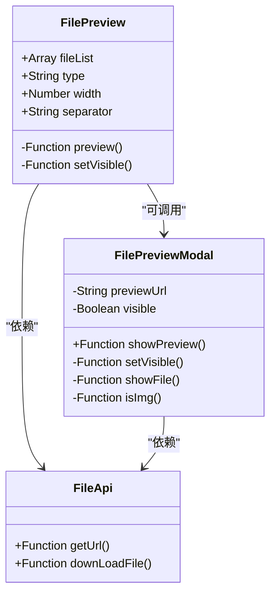
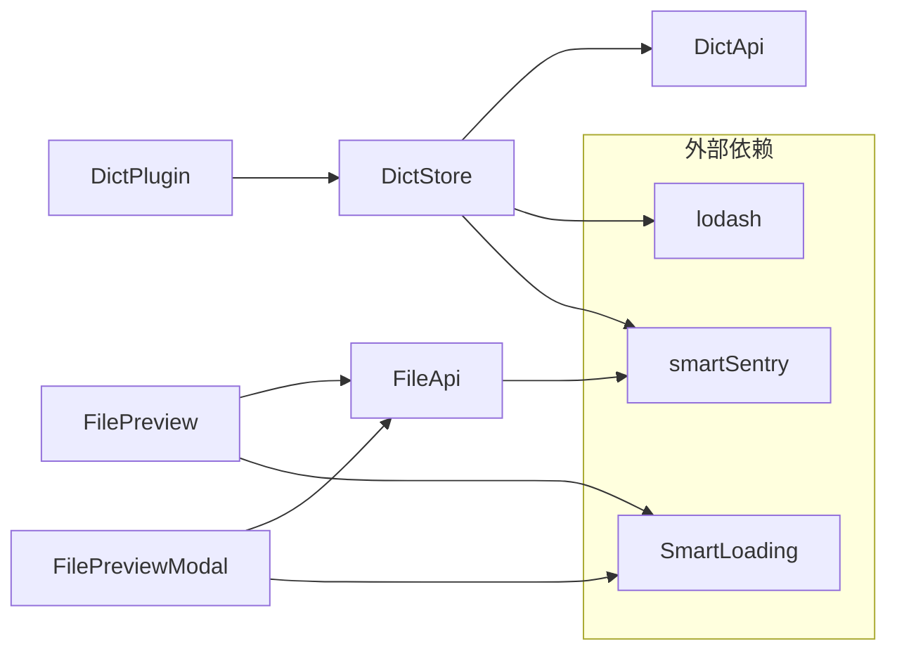

# 支持组件

<cite>
**本文档引用的文件**
- [dict-plugin.js](file://smart-admin-web-javascript/src/plugins/dict-plugin.js)
- [dict.js](file://smart-admin-web-javascript/src/store/modules/system/dict.js)
- [dict-const.js](file://smart-admin-web-javascript/src/constants/support/dict-const.js)
- [dict-select/index.vue](file://smart-admin-web-javascript/src/components/support/dict-select/index.vue)
- [dict-code-select/index.vue](file://smart-admin-web-javascript/src/components/support/dict-code-select/index.vue)
- [file-preview/index.vue](file://smart-admin-web-javascript/src/components/support/file-preview/index.vue)
- [file-preview-modal/index.vue](file://smart-admin-web-javascript/src/components/support/file-preview-modal/index.vue)
- [file-api.js](file://smart-admin-web-javascript/src/api/support/file-api.js)
</cite>

## 目录
1. [引言](#引言)
2. [项目结构](#项目结构)
3. [核心组件](#核心组件)
4. [架构概述](#架构概述)
5. [详细组件分析](#详细组件分析)
6. [依赖分析](#依赖分析)
7. [性能考虑](#性能考虑)
8. [故障排除指南](#故障排除指南)
9. [结论](#结论)

## 引言
本文档重点介绍智能管理系统中的支持组件，特别是字典组件和文件预览组件的设计与实现。深入分析字典选择器（dict-select）系列组件如何实现数据字典的统一管理和展示，包括缓存机制和动态更新策略。详细说明文件预览（file-preview）和预览模态框（file-preview-modal）的实现方式，支持多种文件格式的预览集成。阐述这些组件如何通过插件系统（dict-plugin.js）实现全局可用性，并提供在表单、列表等场景下的使用模式和最佳实践。

## 项目结构
支持组件主要位于前端项目的`src/components/support`目录下，通过插件机制在全局范围内可用。这些组件与API服务、状态管理(store)和常量配置紧密协作，形成完整的功能体系。

**Diagram sources**
- [dict-select/index.vue](file://smart-admin-web-javascript/src/components/support/dict-select/index.vue)
- [file-preview/index.vue](file://smart-admin-web-javascript/src/components/support/file-preview/index.vue)
- [file-preview-modal/index.vue](file://smart-admin-web-javascript/src/components/support/file-preview-modal/index.vue)

**Section sources**
- [smart-admin-web-javascript/src/components/support](file://smart-admin-web-javascript/src/components/support)

## 核心组件
本系统的核心支持组件包括字典系列组件和文件预览系列组件。字典组件提供统一的数据字典管理，支持动态加载和缓存；文件预览组件支持多种文件格式的预览功能，通过智能判断文件类型提供相应的预览方式。

**Section sources**
- [dict-select/index.vue](file://smart-admin-web-javascript/src/components/support/dict-select/index.vue)
- [file-preview/index.vue](file://smart-admin-web-javascript/src/components/support/file-preview/index.vue)

## 架构概述
系统采用分层架构设计，将组件、状态管理、API服务和插件机制分离，确保各组件的独立性和可维护性。字典组件通过全局插件注入，实现跨组件的数据字典访问；文件预览组件通过API服务获取文件信息，并根据文件类型决定预览方式。

**Diagram sources**
- [dict-plugin.js](file://smart-admin-web-javascript/src/plugins/dict-plugin.js)
- [dict.js](file://smart-admin-web-javascript/src/store/modules/system/dict.js)
- [file-api.js](file://smart-admin-web-javascript/src/api/support/file-api.js)

## 详细组件分析

### 字典组件分析
字典组件系列提供统一的数据字典管理功能，包括字典选择器和字典代码选择器，支持动态数据加载和高效缓存机制。

#### 字典选择器实现
字典选择器组件通过依赖注入的方式获取字典数据，利用Pinia状态管理实现数据的全局共享和响应式更新。

**Diagram sources**
- [dict-select/index.vue](file://smart-admin-web-javascript/src/components/support/dict-select/index.vue)
- [dict-code-select/index.vue](file://smart-admin-web-javascript/src/components/support/dict-code-select/index.vue)
- [dict-plugin.js](file://smart-admin-web-javascript/src/plugins/dict-plugin.js)
- [dict.js](file://smart-admin-web-javascript/src/store/modules/system/dict.js)

#### 字典数据流
字典组件的数据流从API请求开始，经过状态管理存储，最终在组件中使用，形成完整的数据闭环。

**Diagram sources**
- [dict.js](file://smart-admin-web-javascript/src/store/modules/system/dict.js)
- [dict-api.js](file://smart-admin-web-javascript/src/api/support/dict-api.js)
- [dict-plugin.js](file://smart-admin-web-javascript/src/plugins/dict-plugin.js)

### 文件预览组件分析
文件预览组件提供统一的文件预览功能，支持图片预览和文件下载两种模式，根据文件类型智能选择预览方式。

#### 文件预览实现
文件预览组件通过文件API获取文件信息，并根据文件类型决定预览行为，图片文件直接预览，其他文件触发下载。

**Diagram sources**
- [file-preview/index.vue](file://smart-admin-web-javascript/src/components/support/file-preview/index.vue)
- [file-api.js](file://smart-admin-web-javascript/src/api/support/file-api.js)

#### 文件预览模态框
文件预览模态框组件提供弹窗式的文件预览功能，支持图片的全屏预览体验。

**Diagram sources**
- [file-preview/index.vue](file://smart-admin-web-javascript/src/components/support/file-preview/index.vue)
- [file-preview-modal/index.vue](file://smart-admin-web-javascript/src/components/support/file-preview-modal/index.vue)
- [file-api.js](file://smart-admin-web-javascript/src/api/support/file-api.js)

## 依赖分析
支持组件依赖于多个核心模块，包括状态管理、API服务和工具库，形成完整的功能依赖链。

**Diagram sources**
- [dict-plugin.js](file://smart-admin-web-javascript/src/plugins/dict-plugin.js)
- [dict.js](file://smart-admin-web-javascript/src/store/modules/system/dict.js)
- [file-api.js](file://smart-admin-web-javascript/src/api/support/file-api.js)
- [smart-sentry.js](file://smart-admin-web-javascript/lib/smart-sentry.js)
- [smart-loading.js](file://smart-admin-web-javascript/components/framework/smart-loading/index.js)

**Section sources**
- [dict-plugin.js](file://smart-admin-web-javascript/src/plugins/dict-plugin.js)
- [dict.js](file://smart-admin-web-javascript/src/store/modules/system/dict.js)
- [file-api.js](file://smart-admin-web-javascript/src/api/support/file-api.js)

## 性能考虑
字典组件采用全量加载和内存缓存策略，避免了频繁的API调用，提高了响应速度。文件预览组件采用按需加载策略，只有在用户触发预览时才获取文件URL，减少了不必要的网络请求。

字典数据在应用初始化时一次性加载到内存中，后续所有字典相关的操作都直接从内存读取，确保了极快的访问速度。同时，提供了刷新机制，当字典数据发生变化时，可以通过调用refreshData方法更新缓存。

文件预览方面，对于图片文件直接在浏览器中预览，对于其他类型的文件则触发下载，避免了在前端处理复杂文件格式的性能开销。

## 故障排除指南
当字典组件无法正常显示数据时，首先检查网络请求是否成功获取字典数据。如果API请求失败，需要检查后端服务状态和网络连接。

如果文件预览功能无法正常工作，检查文件的fileKey是否正确，以及文件服务是否可用。对于图片预览，还需要确认图片URL是否可访问。

在开发环境中，可以通过浏览器的开发者工具查看网络请求和控制台输出，定位具体的问题原因。生产环境中，系统集成了错误监控，所有异常都会被smartSentry捕获并上报。

**Section sources**
- [dict.js](file://smart-admin-web-javascript/src/store/modules/system/dict.js)
- [file-preview/index.vue](file://smart-admin-web-javascript/src/components/support/file-preview/index.vue)
- [smart-sentry.js](file://smart-admin-web-javascript/lib/smart-sentry.js)

## 结论
本文档详细分析了智能管理系统中的支持组件设计，重点介绍了字典组件和文件预览组件的实现机制。字典组件通过全局插件和状态管理实现了数据字典的统一管理和高效访问，文件预览组件则提供了灵活的文件预览解决方案。

这些组件的设计充分考虑了性能、可维护性和用户体验，通过合理的架构设计和依赖管理，确保了系统的稳定性和扩展性。在实际使用中，开发者可以基于这些组件快速构建功能丰富的界面，提高开发效率。