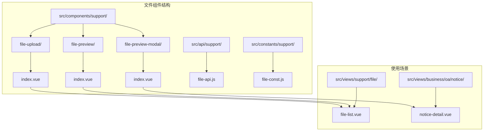
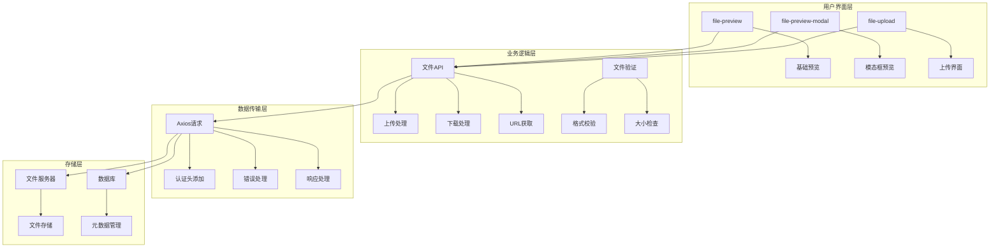
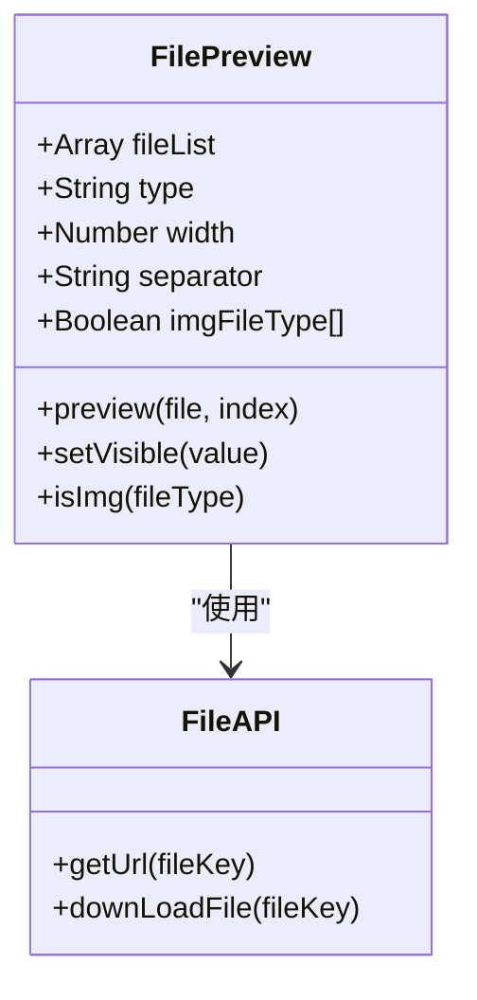
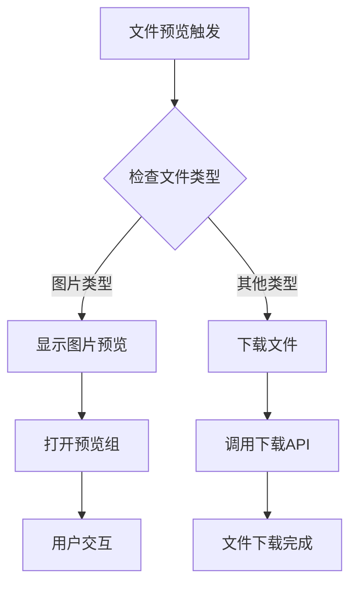
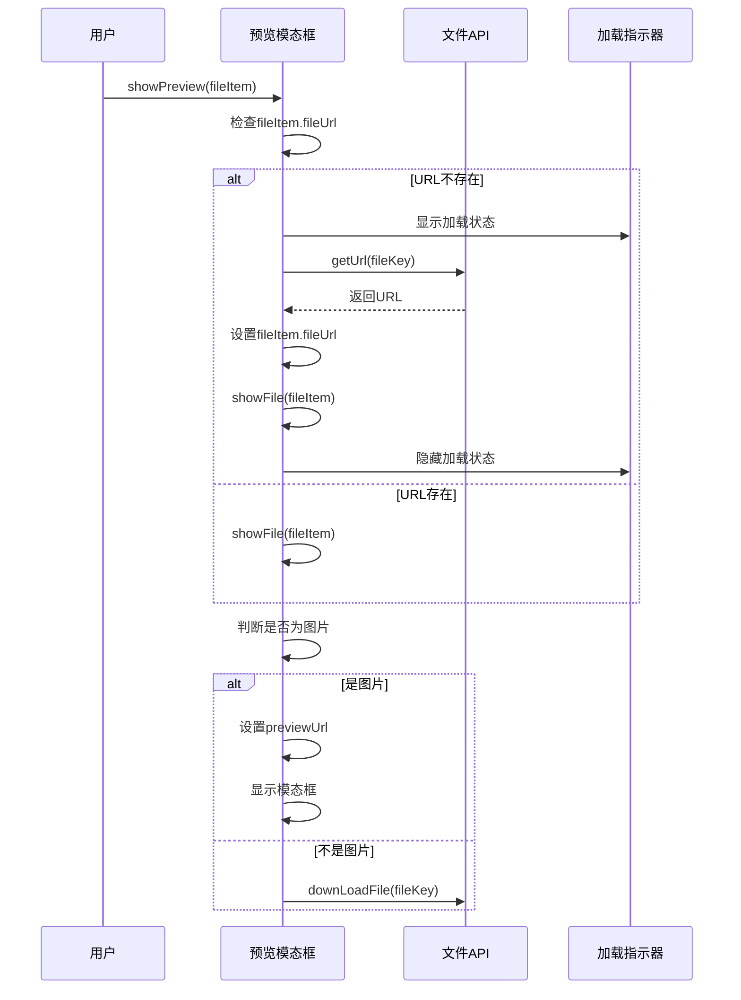
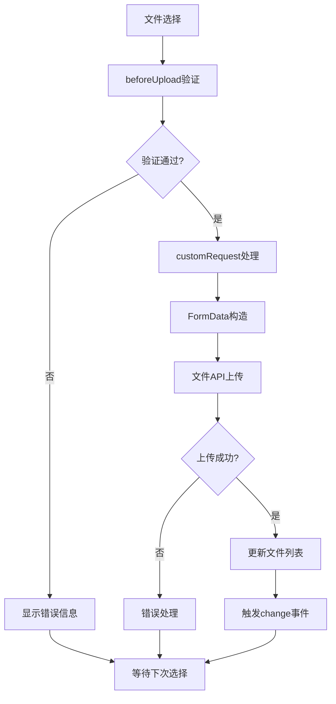
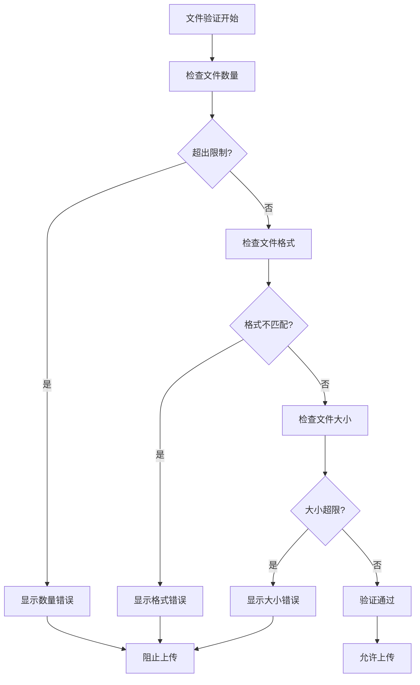
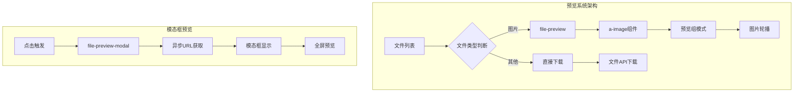
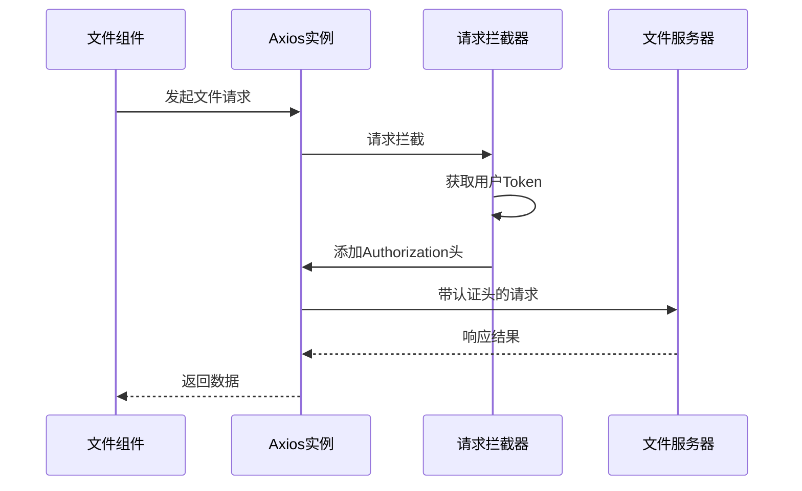

# 文件组件

<cite>
**本文档中引用的文件**
- [index.vue](file://smart-admin-web-javascript/src/components/support/file-preview/index.vue)
- [index.vue](file://smart-admin-web-javascript/src/components/support/file-preview-modal/index.vue)
- [index.vue](file://smart-admin-web-javascript/src/components/support/file-upload/index.vue)
- [file-api.js](file://smart-admin-web-javascript/src/api/support/file-api.js)
- [file-const.js](file://smart-admin-web-javascript/src/constants/support/file-const.js)
- [axios.js](file://smart-admin-web-javascript/src/lib/axios.js)
- [file-list.vue](file://smart-admin-web-javascript/src/views/support/file/file-list.vue)
- [notice-detail.vue](file://smart-admin-web-javascript/src/views/business/oa/notice/notice-detail.vue)
</cite>

## 目录
1. [简介](#简介)
2. [项目结构](#项目结构)
3. [核心组件](#核心组件)
4. [架构概览](#架构概览)
5. [详细组件分析](#详细组件分析)
6. [文件上传流程](#文件上传流程)
7. [文件预览机制](#文件预览机制)
8. [认证与安全](#认证与安全)
9. [性能优化](#性能优化)
10. [故障排除指南](#故障排除指南)
11. [总结](#总结)

## 简介

文件组件是智能管理系统中的核心功能模块，提供了完整的文件管理解决方案。该系统包含三个主要组件：`file-preview`（文件预览）、`file-preview-modal`（文件预览模态框）和`file-upload`（文件上传），它们协同工作，支持多种文件类型的处理、预览、上传和下载功能。

系统设计遵循现代化的前端架构原则，采用Vue 3 Composition API构建，集成了Ant Design Vue组件库，提供了良好的用户体验和强大的功能特性。

## 项目结构

文件组件位于系统的支持模块中，具有清晰的组织结构：

**图表来源**
- [index.vue](file://smart-admin-web-javascript/src/components/support/file-preview/index.vue#L1-L80)
- [index.vue](file://smart-admin-web-javascript/src/components/support/file-preview-modal/index.vue#L1-L84)
- [index.vue](file://smart-admin-web-javascript/src/components/support/file-upload/index.vue#L1-L230)

**章节来源**
- [index.vue](file://smart-admin-web-javascript/src/components/support/file-preview/index.vue#L1-L80)
- [index.vue](file://smart-admin-web-javascript/src/components/support/file-preview-modal/index.vue#L1-L84)
- [index.vue](file://smart-admin-web-javascript/src/components/support/file-upload/index.vue#L1-L230)

## 核心组件

系统包含三个核心文件处理组件，每个组件都有特定的功能和用途：

### 组件功能对比表

| 组件 | 主要功能 | 支持文件类型 | 预览方式 | 特殊功能 |
|------|----------|--------------|----------|----------|
| file-preview | 基础文件预览 | 图片、PDF、文本 | 内联显示 | 自动识别文件类型，支持外部URL |
| file-preview-modal | 全屏预览模态框 | 图片、PDF、文本 | 弹窗全屏 | 支持异步加载，错误处理 |
| file-upload | 文件上传组件 | 所有类型 | 上传列表 | 分片上传，进度显示，格式校验 |

**章节来源**
- [index.vue](file://smart-admin-web-javascript/src/components/support/file-preview/index.vue#L37-L80)
- [index.vue](file://smart-admin-web-javascript/src/components/support/file-preview-modal/index.vue#L34-L84)
- [index.vue](file://smart-admin-web-javascript/src/components/support/file-upload/index.vue#L53-L230)

## 架构概览

文件组件系统采用分层架构设计，确保功能的模块化和可维护性：

**图表来源**
- [file-api.js](file://smart-admin-web-javascript/src/api/support/file-api.js#L10-L39)
- [axios.js](file://smart-admin-web-javascript/src/lib/axios.js#L23-L127)

## 详细组件分析

### file-preview 组件分析

file-preview组件负责基础的文件预览功能，支持多种文件类型的自动识别和处理。

#### 核心特性

1. **文件类型自动识别**：根据文件扩展名自动判断是否为图片类型
2. **双模式显示**：支持文本链接和图片预览两种显示模式
3. **外部URL支持**：直接处理外部文件URL和内部服务路径
4. **分隔符自定义**：支持自定义文本模式下的分隔符

#### 技术实现

**图表来源**
- [index.vue](file://smart-admin-web-javascript/src/components/support/file-preview/index.vue#L37-L80)

#### 关键算法流程

**图表来源**
- [index.vue](file://smart-admin-web-javascript/src/components/support/file-preview/index.vue#L62-L78)

**章节来源**
- [index.vue](file://smart-admin-web-javascript/src/components/support/file-preview/index.vue#L1-L80)

### file-preview-modal 组件分析

file-preview-modal是一个封装的模态框组件，专门用于全屏文件预览，提供更好的用户体验。

#### 核心特性

1. **异步URL获取**：支持通过fileKey动态获取文件URL
2. **错误处理机制**：完善的异常捕获和错误提示
3. **模态框生命周期管理**：精确控制显示状态
4. **图片类型检测**：自动识别图片格式进行预览

#### 组件交互流程

**图表来源**
- [index.vue](file://smart-admin-web-javascript/src/components/support/file-preview-modal/index.vue#L34-L74)

**章节来源**
- [index.vue](file://smart-admin-web-javascript/src/components/support/file-preview-modal/index.vue#L1-L84)

### file-upload 组件分析

file-upload组件是最复杂的组件，提供了完整的文件上传解决方案，包括进度跟踪、格式验证和错误处理。

#### 核心功能模块

1. **文件选择与验证**
   - 多文件上传支持
   - 文件大小限制
   - 格式白名单验证
   - 数量限制控制

2. **上传流程管理**
   - 自定义上传请求
   - 进度显示
   - 错误重试机制

3. **UI交互体验**
   - 图片卡片视图
   - 文本列表视图
   - 预览功能集成

#### 上传流程架构

**图表来源**
- [index.vue](file://smart-admin-web-javascript/src/components/support/file-upload/index.vue#L130-L146)

**章节来源**
- [index.vue](file://smart-admin-web-javascript/src/components/support/file-upload/index.vue#L1-L230)

## 文件上传流程

文件上传组件实现了完整的上传生命周期管理，包括文件选择、验证、上传和结果处理。

### 上传配置参数

| 参数名 | 类型 | 默认值 | 描述 |
|--------|------|--------|------|
| buttonText | String | "点击上传附件" | 上传按钮显示文字 |
| showUploadBtn | Boolean | true | 是否显示上传按钮 |
| multiple | Boolean | false | 是否支持多文件上传 |
| maxUploadSize | Number | 10 | 最大上传文件数量 |
| maxSize | Number | 10 | 单个文件最大大小(MB) |
| accept | String | "" | 接受的文件类型 |
| folder | Number | 1 | 文件夹类型 |
| listType | String | "picture-card" | 列表显示类型 |

### 上传验证机制

**图表来源**
- [index.vue](file://smart-admin-web-javascript/src/components/support/file-upload/index.vue#L165-L184)

**章节来源**
- [index.vue](file://smart-admin-web-javascript/src/components/support/file-upload/index.vue#L53-L230)

## 文件预览机制

文件预览系统采用策略模式，根据不同文件类型采用不同的预览策略。

### 预览策略表

| 文件类型 | 预览方式 | 组件 | 特殊处理 |
|----------|----------|------|----------|
| 图片(jpg,jpeg,png,gif) | 图片预览 | a-image | 缩略图显示，支持预览组 |
| PDF | 在线预览 | PDF阅读器 | 浏览器原生支持 |
| 文本文件 | 文本预览 | 文本显示 | 支持换行和滚动 |
| 其他类型 | 下载预览 | 文件下载 | 直接下载到本地 |

### 预览组件集成

**图表来源**
- [index.vue](file://smart-admin-web-javascript/src/components/support/file-preview/index.vue#L62-L78)
- [index.vue](file://smart-admin-web-javascript/src/components/support/file-preview-modal/index.vue#L34-L74)

**章节来源**
- [index.vue](file://smart-admin-web-javascript/src/components/support/file-preview/index.vue#L1-L80)
- [index.vue](file://smart-admin-web-javascript/src/components/support/file-preview-modal/index.vue#L1-L84)

## 认证与安全

系统在文件处理过程中实现了完整的认证和安全机制。

### 认证头管理

文件API请求自动添加认证头，确保只有授权用户可以访问文件资源：

**图表来源**
- [axios.js](file://smart-admin-web-javascript/src/lib/axios.js#L35-L45)

### 安全特性

1. **Token认证**：所有文件操作都需要有效的认证令牌
2. **权限控制**：基于用户角色的文件访问权限
3. **文件类型限制**：防止恶意文件上传
4. **大小限制**：防止资源滥用
5. **错误处理**：安全的错误信息传递

**章节来源**
- [axios.js](file://smart-admin-web-javascript/src/lib/axios.js#L1-L251)
- [file-api.js](file://smart-admin-web-javascript/src/api/support/file-api.js#L1-L39)

## 性能优化

文件组件系统采用了多种性能优化策略：

### 优化策略

1. **懒加载机制**：文件URL按需获取，减少初始加载时间
2. **缓存策略**：合理利用浏览器缓存和应用缓存
3. **错误边界**：完善的错误处理，防止组件崩溃
4. **异步处理**：非阻塞的文件操作和UI更新
5. **资源清理**：及时释放不再需要的资源

### 性能监控点

| 监控指标 | 优化目标 | 实现方式 |
|----------|----------|----------|
| 文件加载时间 | < 2秒 | 异步URL获取 |
| 上传进度显示 | 实时反馈 | 进度条组件 |
| 错误恢复 | 自动重试 | 重试机制 |
| 内存使用 | 最小化 | 及时清理 |

## 故障排除指南

### 常见问题及解决方案

#### 上传问题

1. **文件上传失败**
   - 检查文件大小是否超过限制
   - 验证文件格式是否在允许范围内
   - 确认网络连接状态

2. **预览无法显示**
   - 检查文件URL是否正确获取
   - 验证文件类型是否支持预览
   - 确认浏览器兼容性

#### 下载问题

1. **文件下载中断**
   - 检查网络稳定性
   - 验证文件服务器状态
   - 确认文件权限设置

2. **下载速度慢**
   - 优化网络连接
   - 检查服务器负载
   - 考虑分片下载策略

**章节来源**
- [index.vue](file://smart-admin-web-javascript/src/components/support/file-upload/index.vue#L185-L201)

## 总结

文件组件系统提供了完整而强大的文件管理解决方案，具有以下核心优势：

### 主要特性

1. **完整的功能覆盖**：从上传到预览再到下载，涵盖文件管理的全流程
2. **灵活的配置选项**：支持多种文件类型和自定义参数配置
3. **优秀的用户体验**：直观的界面设计和流畅的操作体验
4. **强大的安全机制**：完善的认证、授权和错误处理
5. **良好的扩展性**：模块化设计便于功能扩展和维护

### 技术亮点

- 采用Vue 3 Composition API，提供更好的代码组织和复用
- 集成Ant Design Vue组件库，保证界面的一致性和专业性
- 实现异步加载和错误处理，提升系统的稳定性和可靠性
- 支持多种文件类型和预览策略，满足不同场景需求

该文件组件系统为智能管理系统提供了坚实的文件处理基础，能够有效支撑各种业务场景的文件管理需求，是现代Web应用中文件处理的最佳实践之一。