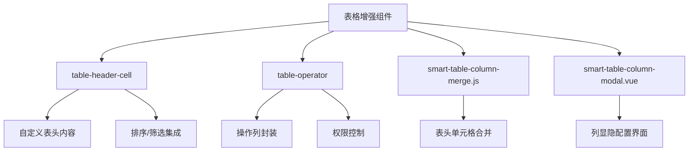
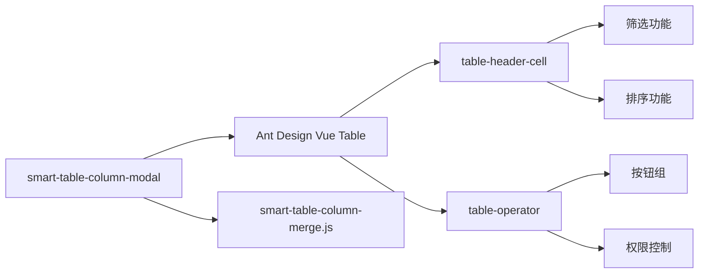
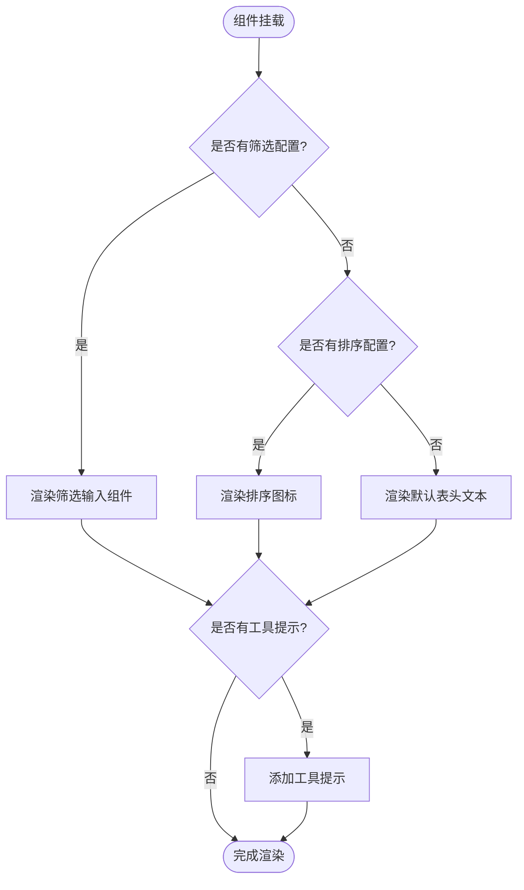
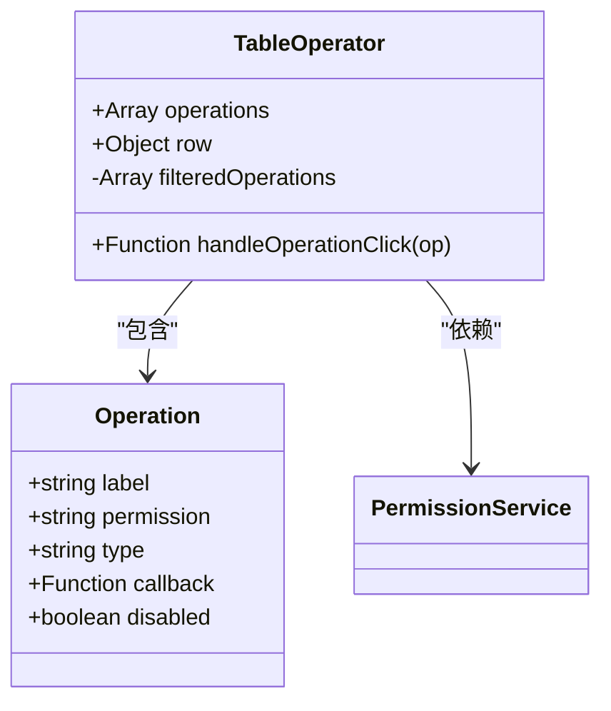
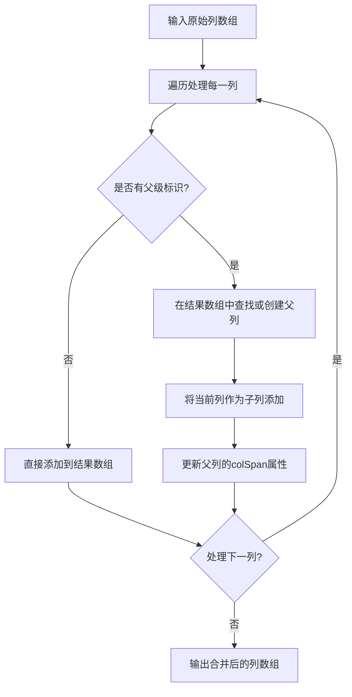
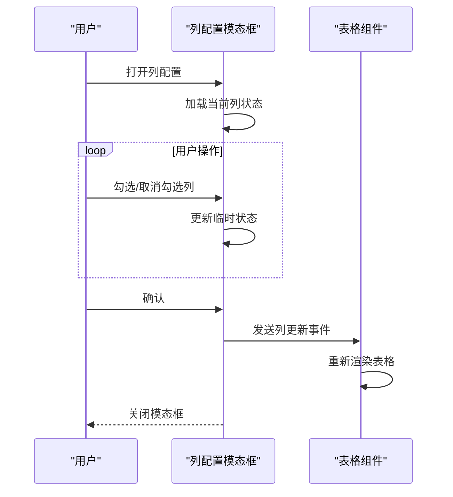
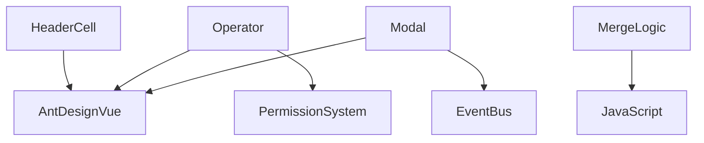

# 表格增强组件

<cite>
**本文档中引用的文件**
- [table-header-cell/index.vue](file://smart-admin-web-javascript/src/components/support/table-header-cell/index.vue)
- [table-operator/index.vue](file://smart-admin-web-javascript/src/components/support/table-operator/index.vue)
- [smart-table-column-merge.js](file://smart-admin-web-javascript/src/components/support/table-operator/smart-table-column-merge.js)
- [smart-table-column-modal.vue](file://smart-admin-web-javascript/src/components/support/table-operator/smart-table-column-modal.vue)
- [goods-list.vue](file://smart-admin-web-javascript/src/views/business/erp/goods/goods-list.vue)
</cite>

## 目录
1. [简介](#简介)
2. [项目结构](#项目结构)
3. [核心组件](#核心组件)
4. [架构概述](#架构概述)
5. [详细组件分析](#详细组件分析)
6. [依赖分析](#依赖分析)
7. [性能考虑](#性能考虑)
8. [故障排除指南](#故障排除指南)
9. [结论](#结论)

## 简介
本文档详细介绍了一套用于增强 Ant Design Vue 表格交互能力的组件，包括 `table-header-cell`、`table-operator`、`smart-table-column-merge.js` 和 `smart-table-column-modal`。这些组件共同提升了表格的用户体验，提供了更丰富的表头交互、操作列封装、表头合并逻辑以及列显隐配置功能。

## 项目结构
该表格增强组件集位于前端项目的组件目录中，采用模块化设计，各组件职责分明，易于在不同业务场景中复用。

**Diagram sources**
- [table-header-cell/index.vue](file://smart-admin-web-javascript/src/components/support/table-header-cell/index.vue)
- [table-operator/index.vue](file://smart-admin-web-javascript/src/components/support/table-operator/index.vue)

**Section sources**
- [table-header-cell/index.vue](file://smart-admin-web-javascript/src/components/support/table-header-cell/index.vue)
- [table-operator/index.vue](file://smart-admin-web-javascript/src/components/support/table-operator/index.vue)

## 核心组件
本节介绍表格增强组件的核心功能和设计目标。`table-header-cell` 组件旨在提供灵活的表头自定义能力，支持集成排序、筛选和工具提示。`table-operator` 组件则专注于操作列的封装，提供按钮组布局、权限控制和回调处理机制。`smart-table-column-merge.js` 负责实现复杂的表头单元格合并逻辑，而 `smart-table-column-modal` 则提供了一个可视化界面，用于配置表格列的显示和隐藏。

**Section sources**
- [table-header-cell/index.vue](file://smart-admin-web-javascript/src/components/support/table-header-cell/index.vue)
- [table-operator/index.vue](file://smart-admin-web-javascript/src/components/support/table-operator/index.vue)
- [smart-table-column-merge.js](file://smart-admin-web-javascript/src/components/support/table-operator/smart-table-column-merge.js)
- [smart-table-column-modal.vue](file://smart-admin-web-javascript/src/components/support/table-operator/smart-table-column-modal.vue)

## 架构概述
整个表格增强组件的设计遵循了高内聚、低耦合的原则。`table-header-cell` 和 `table-operator` 作为独立的 Vue 组件，可以直接在表格的列定义中使用。`smart-table-column-merge.js` 是一个纯 JavaScript 工具函数，负责处理表头数据的合并逻辑。`smart-table-column-modal.vue` 是一个独立的模态框组件，通过事件与主表格进行通信，实现列配置的持久化。

**Diagram sources**
- [table-header-cell/index.vue](file://smart-admin-web-javascript/src/components/support/table-header-cell/index.vue)
- [table-operator/index.vue](file://smart-admin-web-javascript/src/components/support/table-operator/index.vue)
- [smart-table-column-merge.js](file://smart-admin-web-javascript/src/components/support/table-operator/smart-table-column-merge.js)
- [smart-table-column-modal.vue](file://smart-admin-web-javascript/src/components/support/table-operator/smart-table-column-modal.vue)

## 详细组件分析

### table-header-cell 组件分析
`table-header-cell` 组件通过插槽和属性绑定，实现了对表头内容的深度自定义。它接收列定义（column）和绑定值（value），并根据配置自动渲染筛选器、排序图标和工具提示。

**Diagram sources**
- [table-header-cell/index.vue](file://smart-admin-web-javascript/src/components/support/table-header-cell/index.vue)

**Section sources**
- [table-header-cell/index.vue](file://smart-admin-web-javascript/src/components/support/table-header-cell/index.vue)
- [goods-list.vue](file://smart-admin-web-javascript/src/views/business/erp/goods/goods-list.vue#L113)

### table-operator 组件分析
`table-operator` 组件提供了一个标准化的操作列封装。它接收一个操作按钮的配置数组，根据用户的权限动态渲染按钮组，并处理按钮的点击回调。

**Diagram sources**
- [table-operator/index.vue](file://smart-admin-web-javascript/src/components/support/table-operator/index.vue)

**Section sources**
- [table-operator/index.vue](file://smart-admin-web-javascript/src/components/support/table-operator/index.vue)
- [goods-list.vue](file://smart-admin-web-javascript/src/views/business/erp/goods/goods-list.vue#L196)

### smart-table-column-merge.js 分析
`smart-table-column-merge.js` 文件导出一个函数，该函数接收原始的列定义数组，根据特定规则（如相同的父级标识）对列进行合并处理，生成适用于 Ant Design Vue 表格的合并后列结构。

**Diagram sources**
- [smart-table-column-merge.js](file://smart-admin-web-javascript/src/components/support/table-operator/smart-table-column-merge.js)

**Section sources**
- [smart-table-column-merge.js](file://smart-admin-web-javascript/src/components/support/table-operator/smart-table-column-merge.js)

### smart-table-column-modal 组件分析
`smart-table-column-modal` 是一个独立的模态框组件，它提供了一个用户友好的界面，允许用户通过勾选来控制表格中各列的显示和隐藏状态。

**Diagram sources**
- [smart-table-column-modal.vue](file://smart-admin-web-javascript/src/components/support/table-operator/smart-table-column-modal.vue)

**Section sources**
- [smart-table-column-modal.vue](file://smart-admin-web-javascript/src/components/support/table-operator/smart-table-column-modal.vue)

## 依赖分析
这些表格增强组件主要依赖于 Ant Design Vue 框架的核心组件，并与项目的权限系统、事件总线等基础设施紧密集成。

**Diagram sources**
- [table-header-cell/index.vue](file://smart-admin-web-javascript/src/components/support/table-header-cell/index.vue)
- [table-operator/index.vue](file://smart-admin-web-javascript/src/components/support/table-operator/index.vue)
- [smart-table-column-merge.js](file://smart-admin-web-javascript/src/components/support/table-operator/smart-table-column-merge.js)
- [smart-table-column-modal.vue](file://smart-admin-web-javascript/src/components/support/table-operator/smart-table-column-modal.vue)

**Section sources**
- [table-header-cell/index.vue](file://smart-admin-web-javascript/src/components/support/table-header-cell/index.vue)
- [table-operator/index.vue](file://smart-admin-web-javascript/src/components/support/table-operator/index.vue)

## 性能考虑
这些组件在设计时考虑了性能因素。`table-header-cell` 和 `table-operator` 作为轻量级组件，避免了不必要的复杂逻辑。`smart-table-column-merge.js` 的合并算法时间复杂度为 O(n)，适用于大多数业务场景。建议在列数极多的表格中，对列配置操作进行防抖处理，以避免频繁的重新渲染。

## 故障排除指南
- **问题：表头筛选器不生效**
  - 检查 `table-header-cell` 的 `v-model` 是否正确绑定到查询表单。
  - 确认列定义中的 `filterOptions` 配置是否正确。
- **问题：操作按钮未根据权限隐藏**
  - 检查 `table-operator` 的 `operations` 配置中 `permission` 字段是否与系统权限标识匹配。
  - 确认权限服务是否正确初始化。
- **问题：列合并后显示错乱**
  - 检查 `smart-table-column-merge.js` 的输入数据，确保父级标识（如 `parentId`）正确设置。
  - 验证合并后的列结构是否符合 Ant Design Vue 的要求。

**Section sources**
- [table-header-cell/index.vue](file://smart-admin-web-javascript/src/components/support/table-header-cell/index.vue)
- [table-operator/index.vue](file://smart-admin-web-javascript/src/components/support/table-operator/index.vue)
- [smart-table-column-merge.js](file://smart-admin-web-javascript/src/components/support/table-operator/smart-table-column-merge.js)

## 结论
这套表格增强组件显著提升了 Ant Design Vue 表格的交互能力和可配置性。通过 `table-header-cell` 和 `table-operator`，开发者可以快速构建功能丰富的表头和操作列。`smart-table-column-merge.js` 和 `smart-table-column-modal` 则解决了复杂表头和列管理的痛点。这些组件的组合使用，为构建企业级后台管理系统提供了强大的表格解决方案。