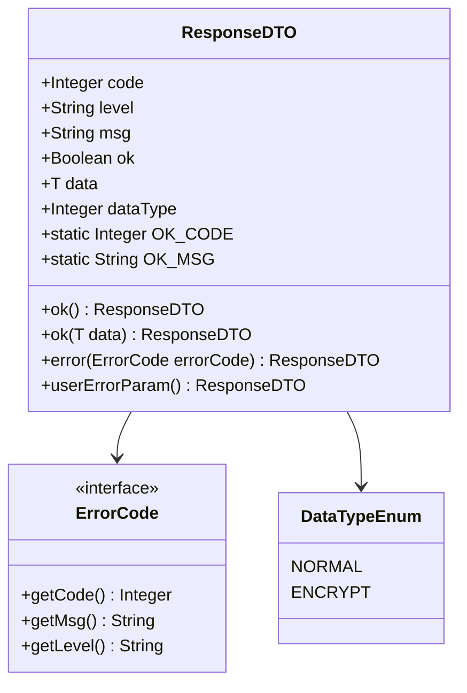
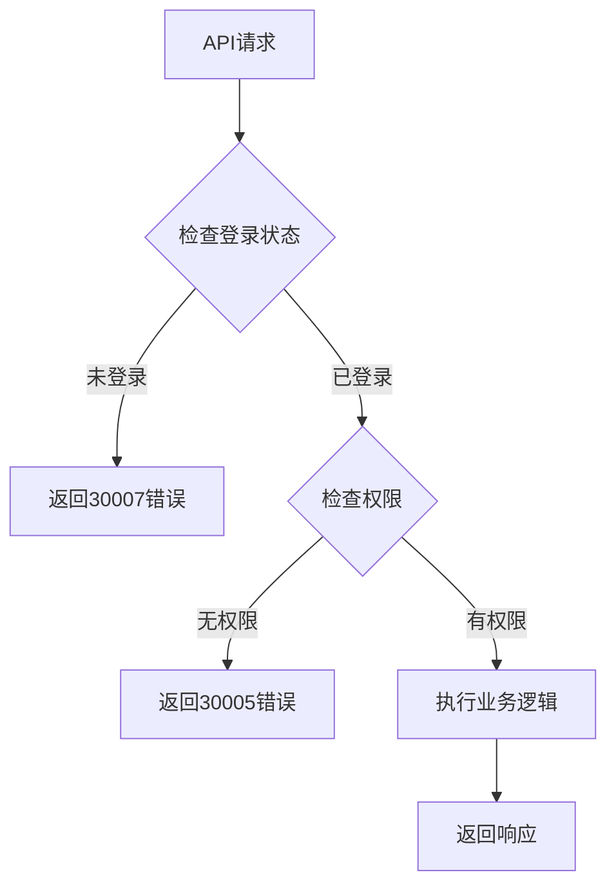
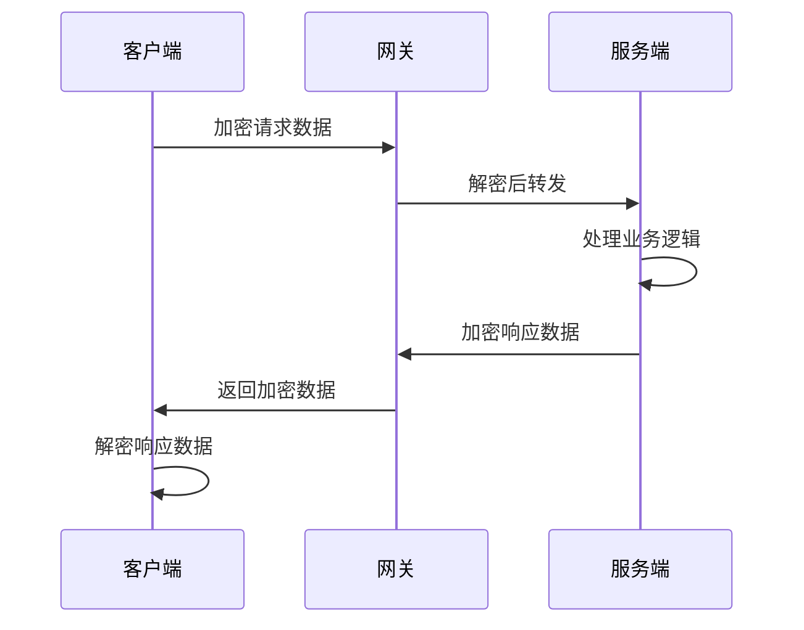
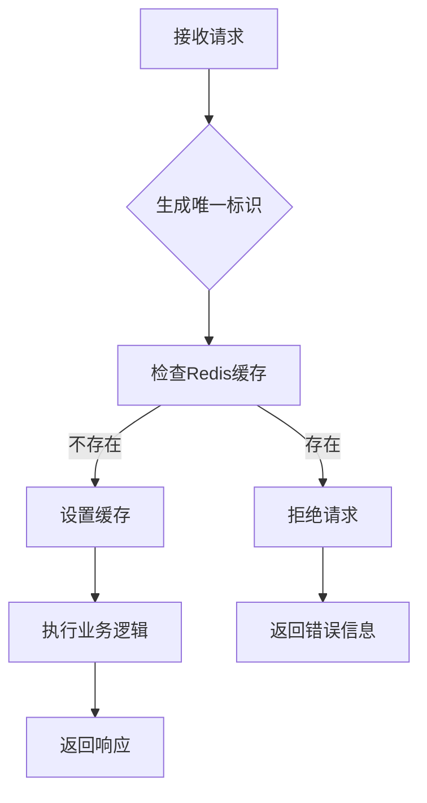
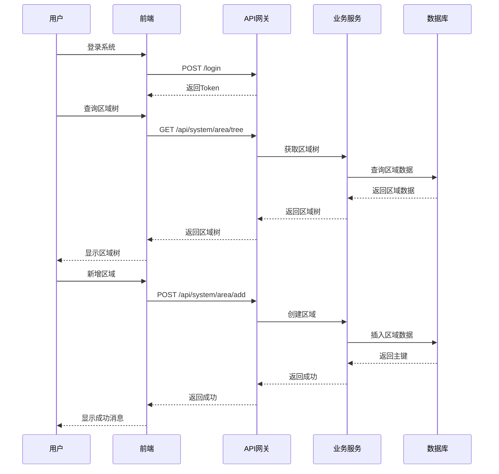
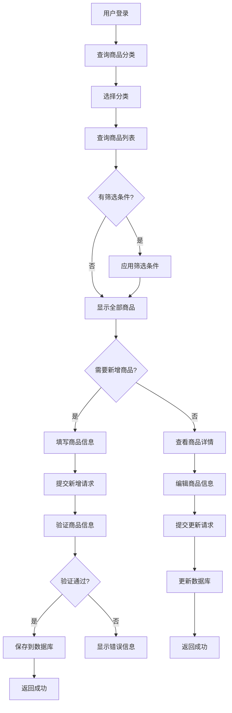

# API端点参考

<cite>
**本文档中引用的文件**
- [ResponseDTO.java](file://smart-admin-api-java17-springboot3/sa-base/src/main/java/net/lab1024.sa/base/common/domain/ResponseDTO.java)
- [AreaController.java](file://smart-admin-api-java17-springboot3/sa-admin/src/main/java/net/lab1024.sa/admin/module/system/area/controller/AreaController.java)
- [GoodsController.java](file://smart-admin-api-java17-springboot3/sa-admin/src/main/java/net/lab1024.sa/admin/module/business/goods/controller/GoodsController.java)
- [AdminApiEncryptController.java](file://smart-admin-api-java17-springboot3/sa-admin/src/main/java/net/lab1024.sa/admin/module/system/support/AdminApiEncryptController.java)
- [SystemErrorCode.java](file://smart-admin-api-java17-springboot3/sa-base/src/main/java/net/lab1024.sa/base/common/code/SystemErrorCode.java)
- [UserErrorCode.java](file://smart-admin-api-java17-springboot3/sa-base/src/main/java/net/lab1024.sa/base/common/code/UserErrorCode.java)
- [area-api.js](file://smart-admin-web-javascript/src/api/system/area-api.js)
- [login-api.js](file://smart-admin-web-javascript/src/api/system/login-api.js)
- [goods-api.js](file://smart-app/src/api/business/goods/goods-api.js)
- [SupportBaseController.java](file://smart-admin-api-java17-springboot3/sa-base/src/main/java/net/lab1024.sa/base/common/controller/SupportBaseController.java)
</cite>

## 目录
1. [简介](#简介)
2. [统一响应格式](#统一响应格式)
3. [错误码体系](#错误码体系)
4. [认证与安全](#认证与安全)
5. [区域管理API](#区域管理api)
6. [商品管理API](#商品管理api)
7. [系统基础API](#系统基础api)
8. [API加密机制](#api加密机制)
9. [请求频率限制](#请求频率限制)
10. [常见使用场景](#常见使用场景)
11. [最佳实践](#最佳实践)

## 简介

本文档提供了智能管理系统的所有公开RESTful API接口的完整参考。该系统采用统一的响应格式、完善的错误处理机制和多层次的安全保护措施，确保API的稳定性和安全性。

### 系统特点
- **统一响应格式**：所有API返回标准化的ResponseDTO格式
- **完善的错误处理**：区分系统级和用户级错误码
- **安全保护**：支持API加密、防重复提交等安全机制
- **版本控制**：通过URL路径进行API版本管理
- **权限控制**：基于角色的访问控制（RBAC）

## 统一响应格式

### ResponseDTO结构

系统所有API都使用统一的响应格式ResponseDTO，确保前后端交互的一致性。



**图表来源**
- [ResponseDTO.java](file://smart-admin-api-java17-springboot3/sa-base/src/main/java/net/lab1024.sa/base/common/domain/ResponseDTO.java#L23-L122)

### 字段说明

| 字段名 | 类型 | 描述 | 示例值 |
|--------|------|------|--------|
| code | Integer | 返回码，0表示成功 | 0 |
| level | String | 错误级别（系统/用户） | "SYSTEM" |
| msg | String | 提示消息 | "操作成功" |
| ok | Boolean | 操作是否成功 | true |
| data | T | 返回的数据对象 | {} |
| dataType | Integer | 数据类型（普通/加密） | 0 |

### 响应示例

**成功响应：**
```json
{
  "code": 0,
  "level": null,
  "msg": "操作成功",
  "ok": true,
  "data": {
    "areaId": 1,
    "areaName": "总部园区",
    "parentId": 0,
    "areaType": "CAMPUS"
  },
  "dataType": 0
}
```

**错误响应：**
```json
{
  "code": 30001,
  "level": "USER",
  "msg": "参数错误",
  "ok": false,
  "data": null,
  "dataType": 0
}
```

**节来源**
- [ResponseDTO.java](file://smart-admin-api-java17-springboot3/sa-base/src/main/java/net/lab1024.sa/base/common/domain/ResponseDTO.java#L25-L122)

## 错误码体系

### 系统错误码（SystemErrorCode）

系统级错误，通常表示服务器内部问题。

| 错误码 | 错误消息 | 使用场景 |
|--------|----------|----------|
| 10001 | 系统似乎出现了点小问题 | 服务器内部异常、数据库连接失败等 |

### 用户错误码（UserErrorCode）

用户级错误，由用户操作不当引起。

| 错误码 | 错误消息 | 使用场景 |
|--------|----------|----------|
| 30001 | 参数错误 | 请求参数格式不正确 |
| 30002 | 左翻右翻，数据竟然找不到了~ | 请求的数据不存在 |
| 30003 | 数据已存在了呀~ | 创建重复数据 |
| 30004 | 亲~您操作的太快了，请稍等下再操作~ | 频率限制触发 |
| 30005 | 对不起，您没有权限访问此内容哦~ | 权限不足 |
| 30007 | 您还未登录或登录失效，请重新登录！ | 未登录或会话过期 |
| 30012 | 长时间未操作系统，需要重新登录 | 会话超时 |

**节来源**
- [SystemErrorCode.java](file://smart-admin-api-java17-springboot3/sa-base/src/main/java/net/lab1024.sa/base/common/code/SystemErrorCode.java#L17-L40)
- [UserErrorCode.java](file://smart-admin-api-java17-springboot3/sa-base/src/main/java/net/lab1024.sa/base/common/code/UserErrorCode.java#L17-L54)

## 认证与安全

### 认证方式

系统支持多种认证方式：
- **用户名密码登录**：标准的表单认证
- **邮箱验证码登录**：基于邮件发送的验证码认证
- **双因子认证**：增强的安全认证方式

### 权限控制

使用Sa-Token框架实现基于角色的访问控制（RBAC）：



### 安全机制

1. **防重复提交**：防止用户重复操作
2. **API加密**：敏感数据传输加密
3. **请求频率限制**：防止恶意请求
4. **CSRF防护**：跨站请求伪造防护

## 区域管理API

区域管理模块提供了完整的CRUD操作，支持无限层级的树形结构管理。

### API端点概览

| 方法 | URL路径 | 功能描述 | 权限要求 |
|------|---------|----------|----------|
| POST | `/api/system/area/page` | 分页查询区域列表 | area:page |
| GET | `/api/system/area/tree` | 获取区域树形结构 | area:tree |
| GET | `/api/system/area/detail/{id}` | 获取区域详细信息 | area:detail |
| POST | `/api/system/area/add` | 新增区域 | area:add |
| POST | `/api/system/area/update` | 更新区域信息 | area:update |
| POST | `/api/system/area/delete/{id}` | 删除区域 | area:delete |
| POST | `/api/system/area/batchDelete` | 批量删除区域 | area:delete |

### 分页查询

**请求示例：**
```bash
curl -X POST http://localhost:1024/api/system/area/page \
  -H "Content-Type: application/json" \
  -H "Authorization: Bearer YOUR_TOKEN" \
  -d '{
    "pageNum": 1,
    "pageSize": 10,
    "areaName": "园区",
    "areaType": "CAMPUS"
  }'
```

**请求参数：**
```typescript
interface AreaQueryForm {
  pageNum: number;
  pageSize: number;
  areaName?: string;
  areaType?: string;
  parentId?: number;
}
```

**响应示例：**
```json
{
  "code": 0,
  "msg": "操作成功",
  "ok": true,
  "data": {
    "records": [
      {
        "areaId": 1,
        "areaName": "总部园区",
        "areaType": "CAMPUS",
        "parentId": 0,
        "sort": 1
      }
    ],
    "total": 1,
    "size": 10,
    "current": 1
  }
}
```

### 区域树形结构

**请求示例：**
```bash
curl -X GET http://localhost:1024/api/system/area/tree \
  -H "Authorization: Bearer YOUR_TOKEN"
```

**响应示例：**
```json
{
  "code": 0,
  "msg": "操作成功",
  "ok": true,
  "data": [
    {
      "areaId": 1,
      "areaName": "总部园区",
      "parentId": 0,
      "children": [
        {
          "areaId": 2,
          "areaName": "办公楼",
          "parentId": 1,
          "children": []
        }
      ]
    }
  ]
}
```

### 新增区域

**请求示例：**
```bash
curl -X POST http://localhost:1024/api/system/area/add \
  -H "Content-Type: application/json" \
  -H "Authorization: Bearer YOUR_TOKEN" \
  -d '{
    "areaName": "新园区",
    "areaType": "CAMPUS",
    "parentId": 0,
    "sort": 1
  }'
```

**请求参数：**
```typescript
interface AreaAddForm {
  areaName: string;
  areaType: string;
  parentId?: number;
  sort?: number;
  remark?: string;
}
```

**节来源**
- [AreaController.java](file://smart-admin-api-java17-springboot3/sa-admin/src/main/java/net/lab1024.sa/admin/module/system/area/controller/AreaController.java#L36-L92)
- [area-api.js](file://smart-admin-web-javascript/src/api/system/area-api.js#L10-L60)

## 商品管理API

商品管理模块提供了完整的商品生命周期管理功能。

### API端点概览

| 方法 | URL路径 | 功能描述 | 权限要求 |
|------|---------|----------|----------|
| POST | `/goods/query` | 分页查询商品 | goods:query |
| POST | `/goods/add` | 新增商品 | goods:add |
| POST | `/goods/update` | 更新商品 | goods:update |
| GET | `/goods/delete/{goodsId}` | 删除商品 | goods:delete |
| POST | `/goods/batchDelete` | 批量删除商品 | goods:delete |

### 分页查询商品

**请求示例：**
```bash
curl -X POST http://localhost:1024/goods/query \
  -H "Content-Type: application/json" \
  -H "Authorization: Bearer YOUR_TOKEN" \
  -d '{
    "pageNum": 1,
    "pageSize": 10,
    "goodsName": "手机",
    "categoryId": 1
  }'
```

**请求参数：**
```typescript
interface GoodsQueryForm {
  pageNum: number;
  pageSize: number;
  goodsName?: string;
  categoryId?: number;
  goodsStatus?: number;
}
```

**响应示例：**
```json
{
  "code": 0,
  "msg": "操作成功",
  "ok": true,
  "data": {
    "records": [
      {
        "goodsId": 1,
        "goodsName": "智能手机",
        "price": 2999.00,
        "shelvesFlag": true,
        "categoryName": "电子产品",
        "goodsStatus": 1,
        "place": "中国",
        "remark": "最新款旗舰手机"
      }
    ],
    "total": 1,
    "size": 10,
    "current": 1
  }
}
```

### 新增商品

**请求示例：**
```bash
curl -X POST http://localhost:1024/goods/add \
  -H "Content-Type: application/json" \
  -H "Authorization: Bearer YOUR_TOKEN" \
  -d '{
    "goodsName": "笔记本电脑",
    "categoryId": 1,
    "price": 5999.00,
    "place": "美国",
    "remark": "高性能商务本"
  }'
```

**请求参数：**
```typescript
interface GoodsAddForm {
  goodsName: string;
  categoryId: number;
  price: number;
  place?: string;
  remark?: string;
}
```

### 更新商品

**请求示例：**
```bash
curl -X POST http://localhost:1024/goods/update \
  -H "Content-Type: application/json" \
  -H "Authorization: Bearer YOUR_TOKEN" \
  -d '{
    "goodsId": 1,
    "goodsName": "智能手机Pro",
    "price": 3999.00,
    "remark": "升级版旗舰手机"
  }'
```

**请求参数：**
```typescript
interface GoodsUpdateForm {
  goodsId: number;
  goodsName?: string;
  categoryId?: number;
  price?: number;
  place?: string;
  remark?: string;
}
```

**节来源**
- [GoodsController.java](file://smart-admin-api-java17-springboot3/sa-admin/src/main/java/net/lab1024.sa/admin/module/business/goods/controller/GoodsController.java#L27-L92)
- [goods-api.js](file://smart-app/src/api/business/goods/goods-api.js#L1-L31)

## 系统基础API

### 登录相关API

#### 用户名密码登录

**请求示例：**
```bash
curl -X POST http://localhost:1024/login \
  -H "Content-Type: application/json" \
  -d '{
    "loginName": "admin",
    "password": "password123",
    "captchaCode": "ABCD"
  }'
```

**请求参数：**
```typescript
interface LoginParams {
  loginName: string;
  password: string;
  captchaCode: string;
}
```

#### 获取验证码

**请求示例：**
```bash
curl -X GET http://localhost:1024/login/getCaptcha \
  -H "Authorization: Bearer YOUR_TOKEN"
```

#### 获取登录信息

**请求示例：**
```bash
curl -X GET http://localhost:1024/login/getLoginInfo \
  -H "Authorization: Bearer YOUR_TOKEN"
```

#### 退出登录

**请求示例：**
```bash
curl -X GET http://localhost:1024/login/logout \
  -H "Authorization: Bearer YOUR_TOKEN"
```

### 文件上传API

系统支持多种文件上传方式：

| 功能 | URL路径 | 说明 |
|------|---------|------|
| 图片上传 | `/file/upload/image` | 上传图片文件 |
| 文件上传 | `/file/upload/file` | 上传普通文件 |
| Excel导入 | `/file/import/excel` | 导入Excel数据 |

**节来源**
- [login-api.js](file://smart-admin-web-javascript/src/api/system/login-api.js#L12-L55)

## API加密机制

系统提供强大的API加密功能，保护敏感数据传输安全。

### 加密类型

1. **请求参数加密**：客户端到服务端的数据加密
2. **响应数据加密**：服务端到客户端的数据加密
3. **双向加密**：请求和响应同时加密

### 加密流程



### 加密API示例

**测试请求加密：**
```bash
curl -X POST http://localhost:1024/apiEncrypt/testRequestEncrypt \
  -H "Content-Type: application/json" \
  -d '{"name":"张三","age":25}'
```

**测试响应加密：**
```bash
curl -X POST http://localhost:1024/apiEncrypt/testResponseEncrypt \
  -H "Content-Type: application/json" \
  -d '{"name":"李四","age":30}'
```

**测试双向加密：**
```bash
curl -X POST http://localhost:1024/apiEncrypt/testDecryptAndEncrypt \
  -H "Content-Type: application/json" \
  -d '{"name":"王五","age":35}'
```

**节来源**
- [AdminApiEncryptController.java](file://smart-admin-api-java17-springboot3/sa-admin/src/main/java/net/lab1024.sa/admin/module/system/support/AdminApiEncryptController.java#L36-L82)

## 请求频率限制

### 防重复提交机制

系统实现了智能的防重复提交机制：



### 限制规则

1. **时间间隔限制**：默认5秒内不允许重复提交
2. **缓存存储**：使用Redis存储提交记录
3. **内存备份**：Redis不可用时使用内存存储
4. **自动清理**：定期清理过期的提交记录

### 配置参数

| 参数 | 默认值 | 说明 |
|------|--------|------|
| 时间间隔 | 5000ms | 防重复提交的时间间隔 |
| 缓存过期时间 | 300000ms | 缓存数据过期时间 |
| 存储方式 | Redis优先 | 优先使用Redis，降级到内存 |

## 常见使用场景

### 场景1：区域管理操作流程



### 场景2：商品管理操作流程



### 场景3：批量操作处理

**批量删除商品示例：**
```bash
curl -X POST http://localhost:1024/goods/batchDelete \
  -H "Content-Type: application/json" \
  -H "Authorization: Bearer YOUR_TOKEN" \
  -d '[1, 2, 3, 4, 5]'
```

**批量操作注意事项：**
1. **数据验证**：确保所有ID都存在且有效
2. **事务处理**：保证批量操作的原子性
3. **性能优化**：使用批量SQL语句提高效率
4. **错误处理**：部分失败时的处理策略

## 最佳实践

### 1. 错误处理最佳实践

```javascript
// 前端错误处理示例
async function fetchAreaData() {
  try {
    const response = await areaApi.queryPage(queryForm);
    
    if (response.ok) {
      // 成功处理
      setAreaList(response.data.records);
      setTotal(response.data.total);
    } else {
      // 错误处理
      switch(response.code) {
        case 30001:
          showMessage('参数错误，请检查输入');
          break;
        case 30005:
          showMessage('权限不足，无法访问');
          break;
        case 30007:
          redirectToLogin();
          break;
        default:
          showMessage(`系统错误：${response.msg}`);
      }
    }
  } catch (error) {
    showMessage('网络错误，请稍后重试');
  }
}
```

### 2. 请求优化建议

1. **合理使用分页**：避免一次性查询大量数据
2. **缓存机制**：对不经常变化的数据实施缓存
3. **批量操作**：对于多个相似操作，使用批量接口
4. **条件过滤**：在查询时添加适当的过滤条件

### 3. 安全最佳实践

1. **Token管理**：妥善保管访问令牌，定期刷新
2. **输入验证**：对所有用户输入进行严格验证
3. **权限检查**：在服务端进行权限验证
4. **日志记录**：记录重要操作的日志信息

### 4. 性能优化建议

1. **接口设计**：单一职责，避免过度复杂的接口
2. **数据压缩**：对大数据量响应进行压缩
3. **并发控制**：合理控制并发请求数量
4. **资源复用**：复用数据库连接和缓存资源

### 5. 开发调试技巧

1. **Swagger文档**：利用自动生成的API文档进行调试
2. **请求追踪**：使用请求ID追踪API调用链
3. **日志分析**：通过日志快速定位问题
4. **单元测试**：编写充分的API测试用例

## 结论

本文档详细介绍了智能管理系统的API端点参考，涵盖了从基础的统一响应格式到高级的加密机制等各个方面。通过遵循本文档中的规范和最佳实践，开发者可以高效地集成和使用系统提供的各种API服务。

系统的设计充分考虑了安全性、可维护性和扩展性，为构建稳定可靠的业务系统提供了坚实的基础。随着系统的不断发展，API文档也会持续更新和完善，以满足不断变化的业务需求。