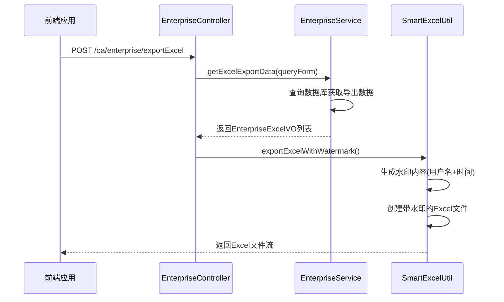

# 企业OA管理API

<cite>
**本文档引用文件**  
- [EnterpriseController.java](file://smart-admin-api-java17-springboot3\sa-admin\src\main\java\net\lab1024\sa\admin\module\business\oa\enterprise\controller\EnterpriseController.java)
- [EnterpriseService.java](file://smart-admin-api-java17-springboot3\sa-admin\src\main\java\net\lab1024\sa\admin\module\business\oa\enterprise\service\EnterpriseService.java)
- [EnterpriseCreateForm.java](file://smart-admin-api-java17-springboot3\sa-admin\src\main\java\net\lab1024\sa\admin\module\business\oa\enterprise\domain\form\EnterpriseCreateForm.java)
- [EnterpriseUpdateForm.java](file://smart-admin-api-java17-springboot3\sa-admin\src\main\java\net\lab1024\sa\admin\module\business\oa\enterprise\domain\form\EnterpriseUpdateForm.java)
- [EnterpriseQueryForm.java](file://smart-admin-api-java17-springboot3\sa-admin\src\main\java\net\lab1024\sa\admin\module\business\oa\enterprise\domain\form\EnterpriseQueryForm.java)
- [EnterpriseEmployeeForm.java](file://smart-admin-api-java17-springboot3\sa-admin\src\main\java\net\lab1024\sa\admin\module\business\oa\enterprise\domain\form\EnterpriseEmployeeForm.java)
- [EnterpriseEmployeeQueryForm.java](file://smart-admin-api-java17-springboot3\sa-admin\src\main\java\net\lab1024\sa\admin\module\business\oa\enterprise\domain\form\EnterpriseEmployeeQueryForm.java)
- [EnterpriseVO.java](file://smart-admin-api-java17-springboot3\sa-admin\src\main\java\net\lab1024\sa\admin\module\business\oa\enterprise\domain\vo\EnterpriseVO.java)
- [EnterpriseExcelVO.java](file://smart-admin-api-java17-springboot3\sa-admin\src\main\java\net\lab1024\sa\admin\module\business\oa\enterprise\domain\vo\EnterpriseExcelVO.java)
- [EnterpriseEmployeeVO.java](file://smart-admin-api-java17-springboot3\sa-admin\src\main\java\net\lab1024\sa\admin\module\business\oa\enterprise\domain\vo\EnterpriseEmployeeVO.java)
- [EnterpriseTypeEnum.java](file://smart-admin-api-java17-springboot3\sa-admin\src\main\java\net\lab1024\sa\admin\module\business\oa\enterprise\constant\EnterpriseTypeEnum.java)
- [SmartExcelUtil.java](file://smart-admin-api-java17-springboot3\sa-base\src\main\java\net\lab1024\sa\base\common\util\SmartExcelUtil.java)
</cite>

## 目录
1. [企业API概述](#企业api概述)
2. [分页查询企业](#分页查询企业)
3. [查询企业详情](#查询企业详情)
4. [新建企业](#新建企业)
5. [编辑企业](#编辑企业)
6. [删除企业](#删除企业)
7. [企业员工管理](#企业员工管理)
8. [数据导出功能](#数据导出功能)
9. [权限控制](#权限控制)

## 企业API概述

企业OA管理模块提供了完整的企业生命周期管理功能，包括企业的增删改查、员工关联管理和数据导出等核心功能。所有API接口均以`EnterpriseController`为核心控制器，通过RESTful风格的HTTP接口提供服务。

系统采用分层架构设计，Controller层负责接收和响应HTTP请求，Service层处理业务逻辑，DAO层负责数据访问。企业信息与员工信息通过中间表进行关联，实现了企业与员工的多对多关系管理。

**本节来源**
- [EnterpriseController.java](file://smart-admin-api-java17-springboot3\sa-admin\src\main\java\net\lab1024\sa\admin\module\business\oa\enterprise\controller\EnterpriseController.java#L39-L43)

## 分页查询企业

### 接口信息
- **URL**: `/oa/enterprise/page/query`
- **HTTP方法**: POST
- **权限要求**: `oa:enterprise:query`
- **功能描述**: 根据查询条件分页获取企业列表

### 请求参数
请求体为JSON格式，包含以下字段：

| 参数名 | 类型 | 必填 | 描述 | 示例值 |
|-------|------|------|------|-------|
| keywords | String | 否 | 关键字搜索（企业名称、联系人等） | "科技" |
| startTime | LocalDate | 否 | 创建时间范围-开始时间 | "2023-01-01" |
| endTime | LocalDate | 否 | 创建时间范围-结束时间 | "2023-12-31" |
| disabledFlag | Boolean | 否 | 禁用状态过滤 | true |
| current | Long | 是 | 当前页码 | 1 |
| pageSize | Long | 是 | 每页大小 | 10 |

### 响应格式
```json
{
  "code": 0,
  "data": {
    "list": [
      {
        "enterpriseId": 1,
        "enterpriseName": "1024创新实验室",
        "unifiedSocialCreditCode": "91310115MA1K3YJ123",
        "type": 1,
        "contact": "开云",
        "contactPhone": "13800138000",
        "email": "lab1024@163.com",
        "province": 31,
        "provinceName": "上海市",
        "city": 3101,
        "cityName": "上海市",
        "district": 310115,
        "districtName": "浦东新区",
        "address": "张江高科技园区",
        "disabledFlag": false,
        "createUserId": 1001,
        "createUserName": "admin",
        "createTime": "2023-06-01T10:00:00",
        "updateTime": "2023-06-01T10:00:00"
      }
    ],
    "total": 1,
    "current": 1,
    "size": 10,
    "pages": 1
  },
  "msg": "OK"
}
```

### 响应字段说明
| 字段 | 类型 | 描述 |
|------|------|------|
| code | Integer | 响应码，0表示成功 |
| data | Object | 分页结果对象 |
| data.list | Array | 企业信息列表 |
| data.total | Long | 总记录数 |
| data.current | Long | 当前页码 |
| data.size | Long | 每页大小 |
| data.pages | Integer | 总页数 |
| msg | String | 响应消息 |

**本节来源**
- [EnterpriseController.java](file://smart-admin-api-java17-springboot3\sa-admin\src\main\java\net\lab1024\sa\admin\module\business\oa\enterprise\controller\EnterpriseController.java#L48-L53)
- [EnterpriseQueryForm.java](file://smart-admin-api-java17-springboot3\sa-admin\src\main\java\net\lab1024\sa\admin\module\business\oa\enterprise\domain\form\EnterpriseQueryForm.java)
- [EnterpriseVO.java](file://smart-admin-api-java17-springboot3\sa-admin\src\main\java\net\lab1024\sa\admin\module\business\oa\enterprise\domain\vo\EnterpriseVO.java)

## 查询企业详情

### 接口信息
- **URL**: `/oa/enterprise/get/{enterpriseId}`
- **HTTP方法**: GET
- **权限要求**: `oa:enterprise:detail`
- **功能描述**: 根据企业ID获取企业详细信息

### 路径参数
| 参数名 | 类型 | 必填 | 描述 |
|-------|------|------|------|
| enterpriseId | Long | 是 | 企业ID |

### 响应格式
```json
{
  "code": 0,
  "data": {
    "enterpriseId": 1,
    "enterpriseName": "1024创新实验室",
    "enterpriseLogo": "file-key-123",
    "unifiedSocialCreditCode": "91310115MA1K3YJ123",
    "type": 1,
    "contact": "开云",
    "contactPhone": "13800138000",
    "email": "lab1024@163.com",
    "province": 31,
    "provinceName": "上海市",
    "city": 3101,
    "cityName": "上海市",
    "district": 310115,
    "districtName": "浦东新区",
    "address": "张江高科技园区",
    "businessLicense": "file-key-456",
    "disabledFlag": false,
    "createUserId": 1001,
    "createUserName": "admin",
    "createTime": "2023-06-01T10:00:00",
    "updateTime": "2023-06-01T10:00:00"
  },
  "msg": "OK"
}
```

**本节来源**
- [EnterpriseController.java](file://smart-admin-api-java17-springboot3\sa-admin\src\main\java\net\lab1024\sa\admin\module\business\oa\enterprise\controller\EnterpriseController.java#L71-L76)
- [EnterpriseVO.java](file://smart-admin-api-java17-springboot3\sa-admin\src\main\java\net\lab1024\sa\admin\module\business\oa\enterprise\domain\vo\EnterpriseVO.java)

## 新建企业

### 接口信息
- **URL**: `/oa/enterprise/create`
- **HTTP方法**: POST
- **权限要求**: `oa:enterprise:add`
- **功能描述**: 创建新的企业信息

### 请求参数
请求体为JSON格式，包含以下字段：

| 参数名 | 类型 | 必填 | 描述 | 示例值 |
|-------|------|------|------|-------|
| enterpriseName | String | 是 | 企业名称 | "1024创新实验室" |
| enterpriseLogo | String | 否 | 企业logo文件key | "file-key-123" |
| unifiedSocialCreditCode | String | 是 | 统一社会信用代码 | "91310115MA1K3YJ123" |
| contact | String | 是 | 联系人 | "开云" |
| contactPhone | String | 是 | 联系人电话 | "13800138000" |
| email | String | 否 | 邮箱 | "lab1024@163.com" |
| province | Integer | 否 | 省份编码 | 31 |
| provinceName | String | 否 | 省份名称 | "上海市" |
| city | Integer | 否 | 城市编码 | 3101 |
| cityName | String | 否 | 城市名称 | "上海市" |
| district | Integer | 否 | 区县编码 | 310115 |
| districtName | String | 否 | 区县名称 | "浦东新区" |
| address | String | 否 | 详细地址 | "张江高科技园区" |
| businessLicense | String | 否 | 营业执照文件key | "file-key-456" |
| disabledFlag | Boolean | 是 | 禁用状态 | false |
| type | Integer | 是 | 企业类型 | 1 |

### 响应格式
```json
{
  "code": 0,
  "data": null,
  "msg": "OK"
}
```

### 企业类型说明
| 值 | 描述 |
|----|------|
| 1 | 有限企业 |
| 2 | 外资企业 |

**本节来源**
- [EnterpriseController.java](file://smart-admin-api-java17-springboot3\sa-admin\src\main\java\net\lab1024\sa\admin\module\business\oa\enterprise\controller\EnterpriseController.java#L78-L86)
- [EnterpriseCreateForm.java](file://smart-admin-api-java17-springboot3\sa-admin\src\main\java\net\lab1024\sa\admin\module\business\oa\enterprise\domain\form\EnterpriseCreateForm.java)
- [EnterpriseTypeEnum.java](file://smart-admin-api-java17-springboot3\sa-admin\src\main\java\net\lab1024\sa\admin\module\business\oa\enterprise\constant\EnterpriseTypeEnum.java)

## 编辑企业

### 接口信息
- **URL**: `/oa/enterprise/update`
- **HTTP方法**: POST
- **权限要求**: `oa:enterprise:update`
- **功能描述**: 更新企业信息

### 请求参数
请求体为JSON格式，包含以下字段：

| 参数名 | 类型 | 必填 | 描述 | 示例值 |
|-------|------|------|------|-------|
| enterpriseId | Long | 是 | 企业ID | 1 |
| enterpriseName | String | 是 | 企业名称 | "1024创新实验室" |
| enterpriseLogo | String | 否 | 企业logo文件key | "file-key-123" |
| unifiedSocialCreditCode | String | 是 | 统一社会信用代码 | "91310115MA1K3YJ123" |
| contact | String | 是 | 联系人 | "开云" |
| contactPhone | String | 是 | 联系人电话 | "13800138000" |
| email | String | 否 | 邮箱 | "lab1024@163.com" |
| province | Integer | 否 | 省份编码 | 31 |
| provinceName | String | 否 | 省份名称 | "上海市" |
| city | Integer | 否 | 城市编码 | 3101 |
| cityName | String | 否 | 城市名称 | "上海市" |
| district | Integer | 否 | 区县编码 | 310115 |
| districtName | String | 否 | 区县名称 | "浦东新区" |
| address | String | 否 | 详细地址 | "张江高科技园区" |
| businessLicense | String | 否 | 营业执照文件key | "file-key-456" |
| disabledFlag | Boolean | 是 | 禁用状态 | false |
| type | Integer | 是 | 企业类型 | 1 |

### 响应格式
```json
{
  "code": 0,
  "data": null,
  "msg": "OK"
}
```

**本节来源**
- [EnterpriseController.java](file://smart-admin-api-java17-springboot3\sa-admin\src\main\java\net\lab1024\sa\admin\module\business\oa\enterprise\controller\EnterpriseController.java#L88-L93)
- [EnterpriseUpdateForm.java](file://smart-admin-api-java17-springboot3\sa-admin\src\main\java\net\lab1024\sa\admin\module\business\oa\enterprise\domain\form\EnterpriseUpdateForm.java)

## 删除企业

### 接口信息
- **URL**: `/oa/enterprise/delete/{enterpriseId}`
- **HTTP方法**: GET
- **权限要求**: `oa:enterprise:delete`
- **功能描述**: 根据企业ID删除企业（软删除）

### 路径参数
| 参数名 | 类型 | 必填 | 描述 |
|-------|------|------|------|
| enterpriseId | Long | 是 | 企业ID |

### 响应格式
```json
{
  "code": 0,
  "data": null,
  "msg": "OK"
}
```

**本节来源**
- [EnterpriseController.java](file://smart-admin-api-java17-springboot3\sa-admin\src\main\java\net\lab1024\sa\admin\module\business\oa\enterprise\controller\EnterpriseController.java#L95-L99)

## 企业员工管理

### 添加员工

#### 接口信息
- **URL**: `/oa/enterprise/employee/add`
- **HTTP方法**: POST
- **权限要求**: `oa:enterprise:addEmployee`
- **功能描述**: 为企业添加员工

#### 请求参数
请求体为JSON格式，包含以下字段：

| 参数名 | 类型 | 必填 | 描述 | 示例值 |
|-------|------|------|------|-------|
| enterpriseId | Long | 是 | 企业ID | 1 |
| employeeIdList | Array | 是 | 员工ID列表 | [1001, 1002] |

#### 响应格式
```json
{
  "code": 0,
  "data": null,
  "msg": "OK"
}
```

### 删除员工

#### 接口信息
- **URL**: `/oa/enterprise/employee/delete`
- **HTTP方法**: POST
- **权限要求**: `oa:enterprise:deleteEmployee`
- **功能描述**: 从企业中移除员工

#### 请求参数
请求体为JSON格式，包含以下字段：

| 参数名 | 类型 | 必填 | 描述 | 示例值 |
|-------|------|------|------|-------|
| enterpriseId | Long | 是 | 企业ID | 1 |
| employeeIdList | Array | 是 | 员工ID列表 | [1001, 1002] |

#### 响应格式
```json
{
  "code": 0,
  "data": null,
  "msg": "OK"
}
```

### 查询员工

#### 分页查询企业员工
- **URL**: `/oa/enterprise/employee/queryPage`
- **HTTP方法**: POST
- **权限要求**: `oa:enterprise:queryEmployee`
- **功能描述**: 分页查询指定企业的员工列表

##### 请求参数
| 参数名 | 类型 | 必填 | 描述 | 示例值 |
|-------|------|------|------|-------|
| enterpriseId | Long | 是 | 企业ID | 1 |
| keyword | String | 否 | 搜索关键词（员工姓名、登录账号等） | "张三" |
| current | Long | 是 | 当前页码 | 1 |
| pageSize | Long | 是 | 每页大小 | 10 |

##### 响应格式
```json
{
  "code": 0,
  "data": {
    "list": [
      {
        "enterpriseEmployeeId": 1,
        "enterpriseId": 1,
        "enterpriseName": "1024创新实验室",
        "employeeId": 1001,
        "loginName": "zhangsan",
        "actualName": "张三",
        "phone": "13800138001",
        "departmentId": 2001,
        "disabledFlag": false,
        "departmentName": "技术部/前端组"
      }
    ],
    "total": 1,
    "current": 1,
    "size": 10,
    "pages": 1
  },
  "msg": "OK"
}
```

#### 查询企业全部员工
- **URL**: `/oa/enterprise/employee/list`
- **HTTP方法**: POST
- **权限要求**: `oa:enterprise:queryEmployee`
- **功能描述**: 查询多个企业的所有员工

##### 请求参数
请求体为JSON数组，包含企业ID列表：
```json
[1, 2, 3]
```

##### 响应格式
```json
{
  "code": 0,
  "data": [
    {
      "enterpriseEmployeeId": 1,
      "enterpriseId": 1,
      "enterpriseName": "1024创新实验室",
      "employeeId": 1001,
      "loginName": "zhangsan",
      "actualName": "张三",
      "phone": "13800138001",
      "departmentId": 2001,
      "disabledFlag": false,
      "departmentName": "技术部/前端组"
    }
  ],
  "msg": "OK"
}
```

**本节来源**
- [EnterpriseController.java](file://smart-admin-api-java17-springboot3\sa-admin\src\main\java\net\lab1024\sa\admin\module\business\oa\enterprise\controller\EnterpriseController.java#L110-L137)
- [EnterpriseEmployeeForm.java](file://smart-admin-api-java17-springboot3\sa-admin\src\main\java\net\lab1024\sa\admin\module\business\oa\enterprise\domain\form\EnterpriseEmployeeForm.java)
- [EnterpriseEmployeeQueryForm.java](file://smart-admin-api-java17-springboot3\sa-admin\src\main\java\net\lab1024\sa\admin\module\business\oa\enterprise\domain\form\EnterpriseEmployeeQueryForm.java)
- [EnterpriseEmployeeVO.java](file://smart-admin-api-java17-springboot3\sa-admin\src\main\java\net\lab1024\sa\admin\module\business\oa\enterprise\domain\vo\EnterpriseEmployeeVO.java)

## 数据导出功能

### 接口信息
- **URL**: `/oa/enterprise/exportExcel`
- **HTTP方法**: POST
- **权限要求**: `oa:enterprise:query`
- **功能描述**: 导出企业信息到Excel文件

### 请求参数
请求参数与分页查询企业接口相同，使用`EnterpriseQueryForm`对象：

| 参数名 | 类型 | 必填 | 描述 |
|-------|------|------|------|
| keywords | String | 否 | 关键字搜索 |
| startTime | LocalDate | 否 | 开始时间 |
| endTime | LocalDate | 否 | 结束时间 |
| disabledFlag | Boolean | 否 | 禁用状态 |

### 响应格式
返回Excel文件流，文件名为"企业基本信息.xlsx"，包含一个名为"企业信息"的工作表。

### Excel文件结构
| 列名 | 对应字段 | 说明 |
|------|----------|------|
| 企业名称 | enterpriseName | 企业全称 |
| 统一社会信用代码 | unifiedSocialCreditCode | 企业统一社会信用代码 |
| 企业类型 | typeName | 企业类型名称（有限企业、外资企业） |
| 联系人 | contact | 企业联系人姓名 |
| 联系人电话 | contactPhone | 企业联系人电话 |
| 邮箱 | email | 企业联系邮箱 |
| 省份名称 | provinceName | 所在省份 |
| 城市名称 | cityName | 所在城市 |
| 区县名称 | districtName | 所在区县 |
| 详细地址 | address | 详细地址 |

### 水印功能
系统在导出的Excel文件中自动添加水印，水印内容包含：
- 当前操作用户的姓名
- 导出时间（精确到秒）

水印以半透明形式覆盖在整个Excel工作表上，防止数据被非法使用。



**图示来源**
- [EnterpriseController.java](file://smart-admin-api-java17-springboot3\sa-admin\src\main\java\net\lab1024\sa\admin\module\business\oa\enterprise\controller\EnterpriseController.java#L55-L69)
- [EnterpriseService.java](file://smart-admin-api-java17-springboot3\sa-admin\src\main\java\net\lab1024\sa\admin\module\business\oa\enterprise\service\EnterpriseService.java#L77-L80)
- [SmartExcelUtil.java](file://smart-admin-api-java17-springboot3\sa-base\src\main\java\net\lab1024\sa\base\common\util\SmartExcelUtil.java#L36-L72)

## 权限控制

系统采用基于角色的访问控制（RBAC）模型，对企业管理模块的各个功能进行了细粒度的权限控制。所有接口均通过`@SaCheckPermission`注解进行权限验证。

### 权限列表
| 权限标识 | 对应功能 | 说明 |
|---------|---------|------|
| oa:enterprise:query | 分页查询企业 | 允许查看企业列表 |
| oa:enterprise:detail | 查询企业详情 | 允许查看企业详细信息 |
| oa:enterprise:add | 新建企业 | 允许创建新企业 |
| oa:enterprise:update | 编辑企业 | 允许修改企业信息 |
| oa:enterprise:delete | 删除企业 | 允许删除企业 |
| oa:enterprise:addEmployee | 添加员工 | 允许为企业添加员工 |
| oa:enterprise:deleteEmployee | 删除员工 | 允许从企业移除员工 |
| oa:enterprise:queryEmployee | 查询员工 | 允许查询企业员工信息 |

### 权限验证流程
1. 用户发起API请求
2. 系统检查用户Token有效性
3. 根据`@SaCheckPermission`注解中的权限标识验证用户权限
4. 权限验证通过则执行业务逻辑，否则返回403错误

**本节来源**
- [EnterpriseController.java](file://smart-admin-api-java17-springboot3\sa-admin\src\main\java\net\lab1024\sa\admin\module\business\oa\enterprise\controller\EnterpriseController.java#L50-L97)