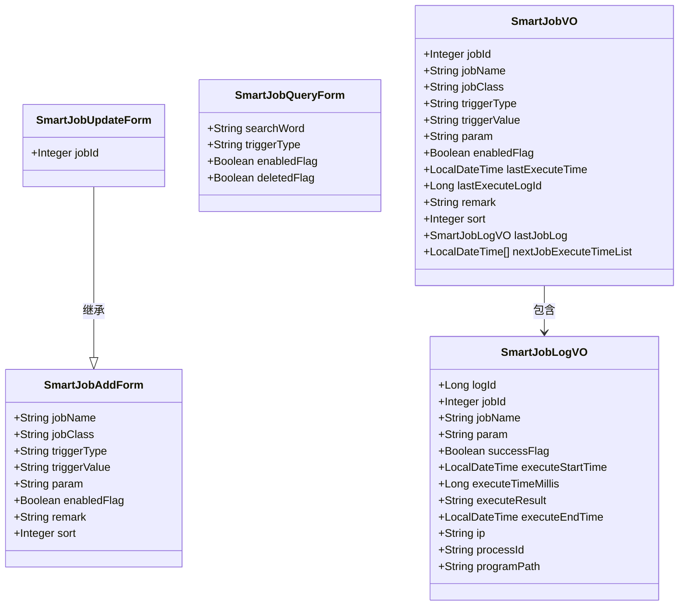
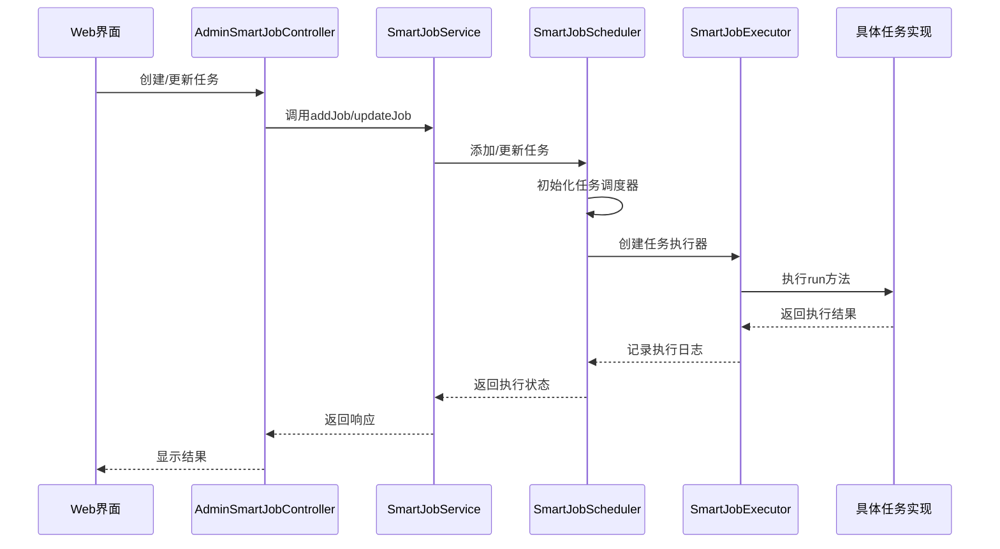
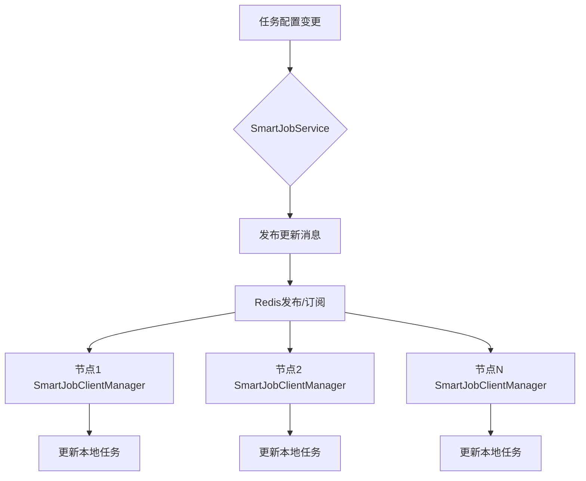
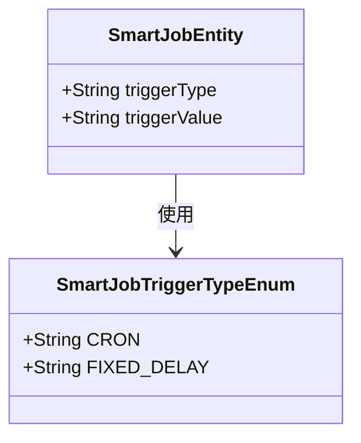
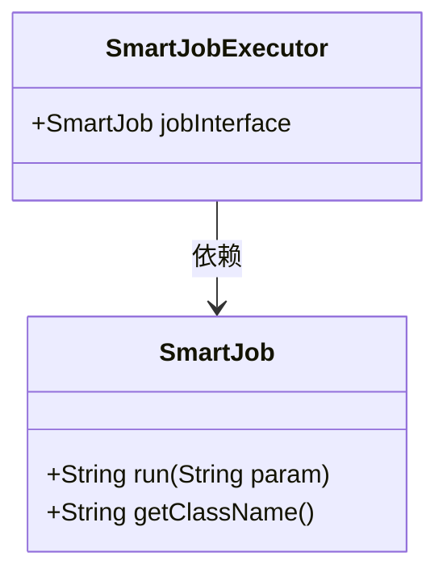
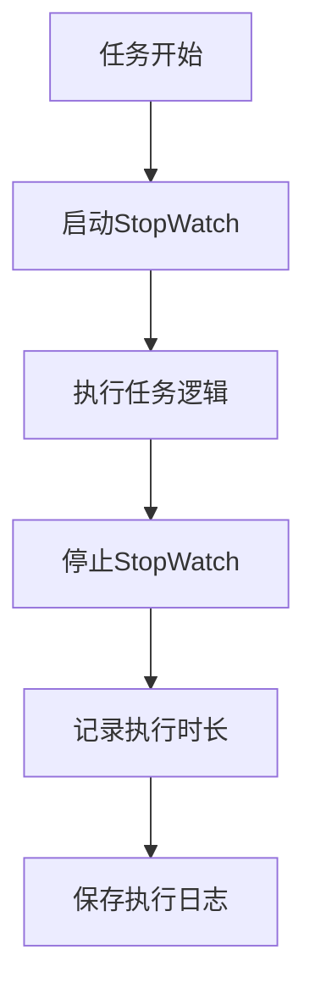
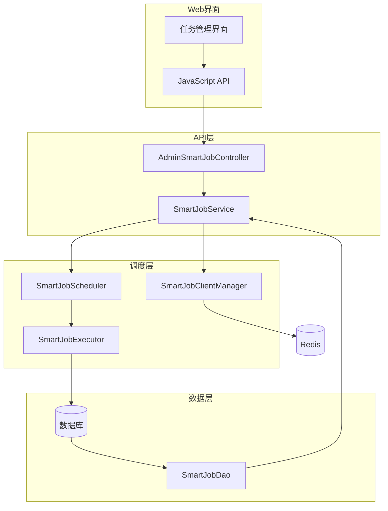

# 定时任务API

<cite>
**本文档引用的文件**  
- [SmartJobService.java](file://smart-admin-api-java17-springboot3/sa-base/src/main/java/net/lab1024/sa/base/module/support/job/api/SmartJobService.java)
- [SmartJobScheduler.java](file://smart-admin-api-java17-springboot3/sa-base/src/main/java/net/lab1024/sa/base/module/support/job/core/SmartJobScheduler.java)
- [SmartJobLauncher.java](file://smart-admin-api-java17-springboot3/sa-base/src/main/java/net/lab1024/sa/base/module/support/job/core/SmartJobLauncher.java)
- [SmartJobExecutor.java](file://smart-admin-api-java17-springboot3/sa-base/src/main/java/net/lab1024/sa/base/module/support/job/core/SmartJobExecutor.java)
- [SmartJobClientManager.java](file://smart-admin-api-java17-springboot3/sa-base/src/main/java/net/lab1024/sa/base/module/support/job/api/SmartJobClientManager.java)
- [SmartJobAddForm.java](file://smart-admin-api-java17-springboot3/sa-base/src/main/java/net/lab1024/sa/base/module/support/job/api/domain/SmartJobAddForm.java)
- [SmartJobUpdateForm.java](file://smart-admin-api-java17-springboot3/sa-base/src/main/java/net/lab1024/sa/base/module/support/job/api/domain/SmartJobUpdateForm.java)
- [SmartJobVO.java](file://smart-admin-api-java17-springboot3/sa-base/src/main/java/net/lab1024/sa/base/module/support/job/api/domain/SmartJobVO.java)
- [SmartJobLogVO.java](file://smart-admin-api-java17-springboot3/sa-base/src/main/java/net/lab1024/sa/base/module/support/job/api/domain/SmartJobLogVO.java)
- [SmartJobTriggerTypeEnum.java](file://smart-admin-api-java17-springboot3/sa-base/src/main/java/net/lab1024/sa/base/module/support/job/constant/SmartJobTriggerTypeEnum.java)
- [SmartJobConfig.java](file://smart-admin-api-java17-springboot3/sa-base/src/main/java/net/lab1024/sa/base/module/support/job/config/SmartJobConfig.java)
- [job-api.js](file://smart-admin-web-javascript/src/api/support/job-api.js)
</cite>

## 目录
1. [简介](#简介)
2. [核心组件](#核心组件)
3. [API接口设计](#api接口设计)
4. [调度器工作原理](#调度器工作原理)
5. [高级特性](#高级特性)
6. [执行监控与运维](#执行监控与运维)
7. [系统架构](#系统架构)

## 简介
本系统是一个分布式任务调度平台，提供完整的定时任务管理功能。系统基于Spring Boot框架构建，通过SmartJobService提供任务创建、启动、停止、删除和执行日志查询等核心功能。调度器采用分布式协调机制，支持Cron表达式配置、任务依赖管理和失败重试策略等高级特性，为系统运维提供全面的监控和报警支持。

## 核心组件

**本节来源**
- [SmartJobService.java](file://smart-admin-api-java17-springboot3/sa-base/src/main/java/net/lab1024/sa/base/module/support/job/api/SmartJobService.java)
- [SmartJobScheduler.java](file://smart-admin-api-java17-springboot3/sa-base/src/main/java/net/lab1024/sa/base/module/support/job/core/SmartJobScheduler.java)
- [SmartJobLauncher.java](file://smart-admin-api-java17-springboot3/sa-base/src/main/java/net/lab1024/sa/base/module/support/job/core/SmartJobLauncher.java)

## API接口设计

**本节来源**
- [SmartJobService.java](file://smart-admin-api-java17-springboot3/sa-base/src/main/java/net/lab1024/sa/base/module/support/job/api/SmartJobService.java)
- [job-api.js](file://smart-admin-web-javascript/src/api/support/job-api.js)

### 任务管理API
系统提供RESTful API接口用于管理定时任务，主要包含以下功能：

#### 任务创建
- **接口**: `POST /support/job/add`
- **参数**: SmartJobAddForm
- **功能**: 创建新的定时任务，需要提供任务名称、执行类、触发类型和配置等信息

#### 任务更新
- **接口**: `POST /support/job/update`
- **参数**: SmartJobUpdateForm
- **功能**: 更新现有任务的配置信息，包括任务名称、触发配置、参数等

#### 任务状态管理
- **接口**: `POST /support/job/update/enabled`
- **参数**: SmartJobEnabledUpdateForm
- **功能**: 启用或禁用指定任务

#### 任务删除
- **接口**: `GET /support/job/delete`
- **参数**: jobId
- **功能**: 从系统中删除指定任务

#### 任务执行
- **接口**: `POST /support/job/execute`
- **参数**: SmartJobExecuteForm
- **功能**: 立即执行指定任务，忽略任务的调度配置

### 查询API
#### 任务查询
- **接口**: `POST /support/job/query`
- **参数**: SmartJobQueryForm
- **功能**: 分页查询任务列表，支持按任务名称、触发类型和启用状态过滤

#### 任务详情查询
- **接口**: `GET /support/job/{jobId}`
- **参数**: jobId
- **功能**: 查询指定任务的详细信息

#### 执行日志查询
- **接口**: `POST /support/job/log/query`
- **参数**: SmartJobLogQueryForm
- **功能**: 分页查询任务执行日志，包含执行结果、执行时长等信息

**图示来源**
- [SmartJobAddForm.java](file://smart-admin-api-java17-springboot3/sa-base/src/main/java/net/lab1024/sa/base/module/support/job/api/domain/SmartJobAddForm.java)
- [SmartJobUpdateForm.java](file://smart-admin-api-java17-springboot3/sa-base/src/main/java/net/lab1024/sa/base/module/support/job/api/domain/SmartJobUpdateForm.java)
- [SmartJobVO.java](file://smart-admin-api-java17-springboot3/sa-base/src/main/java/net/lab1024/sa/base/module/support/job/api/domain/SmartJobVO.java)
- [SmartJobLogVO.java](file://smart-admin-api-java17-springboot3/sa-base/src/main/java/net/lab1024/sa/base/module/support/job/api/domain/SmartJobLogVO.java)

## 调度器工作原理

**本节来源**
- [SmartJobScheduler.java](file://smart-admin-api-java17-springboot3/sa-base/src/main/java/net/lab1024/sa/base/module/support/job/core/SmartJobScheduler.java)
- [SmartJobLauncher.java](file://smart-admin-api-java17-springboot3/sa-base/src/main/java/net/lab1024/sa/base/module/support/job/core/SmartJobLauncher.java)
- [SmartJobExecutor.java](file://smart-admin-api-java17-springboot3/sa-base/src/main/java/net/lab1024/sa/base/module/support/job/core/SmartJobExecutor.java)

### 调度器架构
SmartJobScheduler是系统的核心调度组件，负责管理所有定时任务的生命周期。调度器采用ThreadPoolTaskScheduler作为底层调度引擎，通过线程池管理任务执行。

**图示来源**
- [SmartJobScheduler.java](file://smart-admin-api-java17-springboot3/sa-base/src/main/java/net/lab1024/sa/base/module/support/job/core/SmartJobScheduler.java)
- [SmartJobExecutor.java](file://smart-admin-api-java17-springboot3/sa-base/src/main/java/net/lab1024/sa/base/module/support/job/core/SmartJobExecutor.java)

### 集群协调机制
在分布式环境下，系统通过SmartJobClientManager实现集群间的任务协调。采用发布/订阅模式，当任务配置发生变化时，通过Redis的发布/订阅功能通知所有节点更新任务状态。

**图示来源**
- [SmartJobClientManager.java](file://smart-admin-api-java17-springboot3/sa-base/src/main/java/net/lab1024/sa/base/module/support/job/api/SmartJobClientManager.java)
- [SmartJobService.java](file://smart-admin-api-java17-springboot3/sa-base/src/main/java/net/lab1024/sa/base/module/support/job/api/SmartJobService.java)

## 高级特性

**本节来源**
- [SmartJobTriggerTypeEnum.java](file://smart-admin-api-java17-springboot3/sa-base/src/main/java/net/lab1024/sa/base/module/support/job/constant/SmartJobTriggerTypeEnum.java)
- [SmartJobUtil.java](file://smart-admin-api-java17-springboot3/sa-base/src/main/java/net/lab1024/sa/base/module/support/job/constant/SmartJobUtil.java)
- [SmartJobConfig.java](file://smart-admin-api-java17-springboot3/sa-base/src/main/java/net/lab1024/sa/base/module/support/job/config/SmartJobConfig.java)

### 触发类型
系统支持多种任务触发方式：

**图示来源**
- [SmartJobTriggerTypeEnum.java](file://smart-admin-api-java17-springboot3/sa-base/src/main/java/net/lab1024/sa/base/module/support/job/constant/SmartJobTriggerTypeEnum.java)
- [SmartJobEntity.java](file://smart-admin-api-java17-springboot3/sa-base/src/main/java/net/lab1024/sa/base/module/support/job/repository/domain/SmartJobEntity.java)

#### Cron表达式
支持标准的Cron表达式配置，用于定义复杂的调度规则。系统提供Cron表达式验证功能，确保配置的正确性。

#### 固定间隔
支持固定时间间隔的重复执行，间隔时间以秒为单位配置。

### 任务执行类
所有定时任务必须实现SmartJob接口，提供run方法作为任务执行入口。

**图示来源**
- [SmartJob.java](file://smart-admin-api-java17-springboot3/sa-base/src/main/java/net/lab1024/sa/base/module/support/job/core/SmartJob.java)
- [SmartJobExecutor.java](file://smart-admin-api-java17-springboot3/sa-base/src/main/java/net/lab1024/sa/base/module/support/job/core/SmartJobExecutor.java)

## 执行监控与运维

**本节来源**
- [SmartJobLogEntity.java](file://smart-admin-api-java17-springboot3/sa-base/src/main/java/net/lab1024/sa/base/module/support/job/repository/domain/SmartJobLogEntity.java)
- [SmartJobExecutor.java](file://smart-admin-api-java17-springboot3/sa-base/src/main/java/net/lab1024/sa/base/module/support/job/core/SmartJobExecutor.java)

### 执行日志
系统详细记录每次任务执行的完整信息，包括：

- 执行开始时间和结束时间
- 执行时长（毫秒）
- 执行结果（成功/失败）
- 执行结果描述
- 执行节点的IP地址、进程ID和程序目录

### 性能监控
系统提供任务执行性能监控功能，通过StopWatch记录任务执行时间，帮助识别性能瓶颈。

**图示来源**
- [SmartJobExecutor.java](file://smart-admin-api-java17-springboot3/sa-base/src/main/java/net/lab1024/sa/base/module/support/job/core/SmartJobExecutor.java)

## 系统架构

**本节来源**
- [SmartJobConfig.java](file://smart-admin-api-java17-springboot3/sa-base/src/main/java/net/lab1024/sa/base/module/support/job/config/SmartJobConfig.java)
- [SmartJobLauncher.java](file://smart-admin-api-java17-springboot3/sa-base/src/main/java/net/lab1024/sa/base/module/support/job/core/SmartJobLauncher.java)

**图示来源**
- [SmartJobService.java](file://smart-admin-api-java17-springboot3/sa-base/src/main/java/net/lab1024/sa/base/module/support/job/api/SmartJobService.java)
- [SmartJobScheduler.java](file://smart-admin-api-java17-springboot3/sa-base/src/main/java/net/lab1024/sa/base/module/support/job/core/SmartJobScheduler.java)
- [SmartJobClientManager.java](file://smart-admin-api-java17-springboot3/sa-base/src/main/java/net/lab1024/sa/base/module/support/job/api/SmartJobClientManager.java)