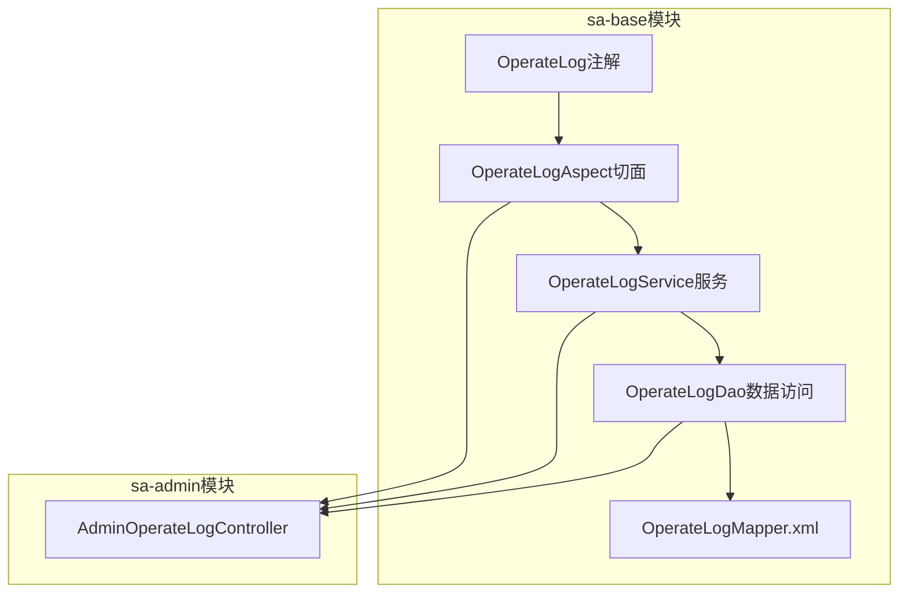
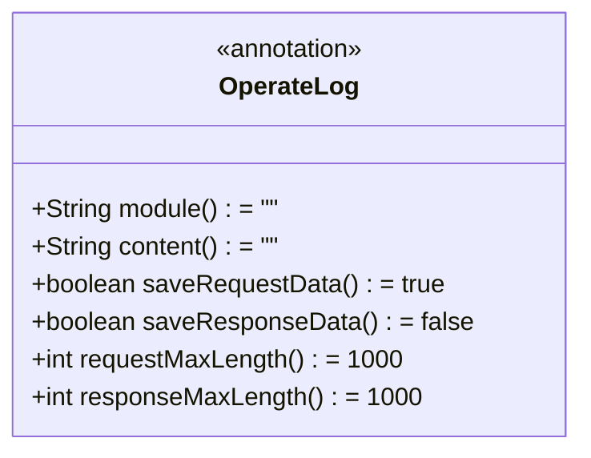
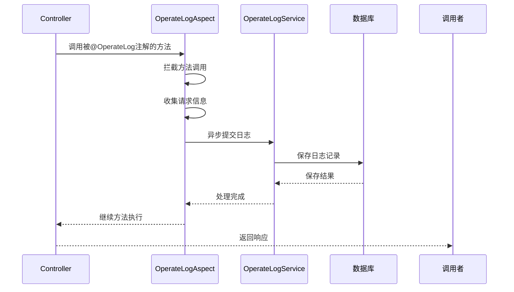
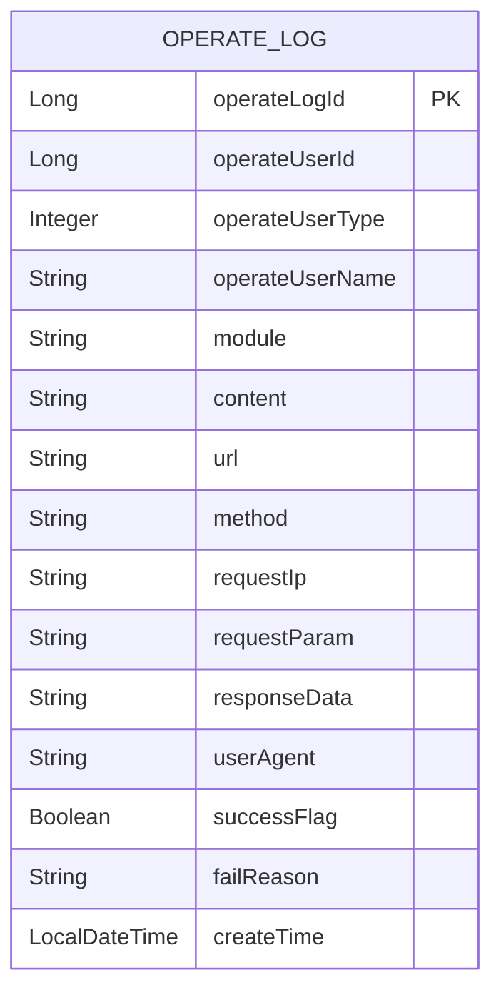
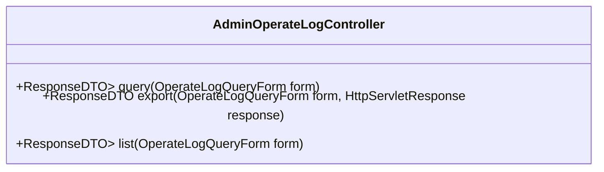
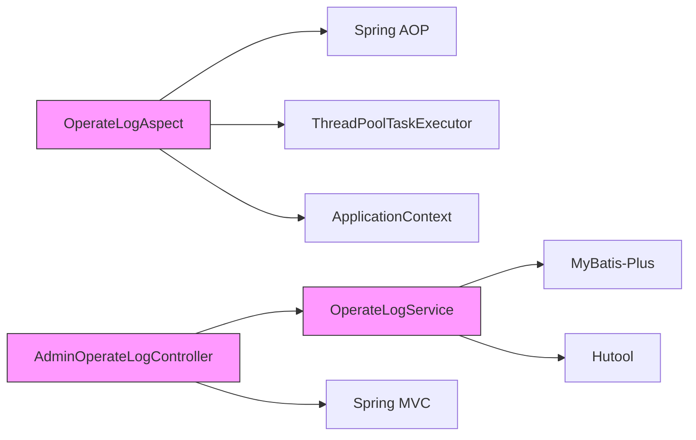

# 操作日志API

<cite>
**本文档中引用的文件**  
- [OperateLogAspect.java](file://smart-admin-api-java17-springboot3\sa-base\src\main\java\net\lab1024\sa\base\module\support\operatelog\core\OperateLogAspect.java)
- [OperateLog.java](file://smart-admin-api-java17-springboot3\sa-base\src\main\java\net\lab1024\sa\base\module\support\operatelog\annotation\OperateLog.java)
- [OperateLogEntity.java](file://smart-admin-api-java17-springboot3\sa-base\src\main\java\net\lab1024\sa\base\module\support\operatelog\domain\OperateLogEntity.java)
- [AdminOperateLogController.java](file://smart-admin-api-java17-springboot3\sa-admin\src\main\java\net\lab1024\sa\admin\module\system\support\AdminOperateLogController.java)
- [OperateLogService.java](file://smart-admin-api-java17-springboot3\sa-base\src\main\java\net\lab1024\sa\base\module\support\operatelog\OperateLogService.java)
- [OperateLogMapper.xml](file://smart-admin-api-java17-springboot3\sa-base\src\main\resources\mapper\support\OperateLogMapper.xml)
- [OperateLogConfig.java](file://smart-admin-api-java17-springboot3\sa-base\src\main\java\net\lab1024\sa\base\module\support\operatelog\core\OperateLogConfig.java)
- [OperateLogQueryForm.java](file://smart-admin-api-java17-springboot3\sa-base\src\main\java\net\lab1024\sa\base\module\support\operatelog\domain\OperateLogQueryForm.java)
- [OperateLogVO.java](file://smart-admin-api-java17-springboot3\sa-base\src\main\java\net\lab1024\sa\base\module\support\operatelog\domain\OperateLogVO.java)
- [OperateLogAspectConfig.java](file://smart-admin-api-java17-springboot3\sa-admin\src\main\java\net\lab1024\sa\admin\config\OperateLogAspectConfig.java)
</cite>

## 目录
1. [简介](#简介)
2. [项目结构](#项目结构)
3. [核心组件](#核心组件)
4. [架构概述](#架构概述)
5. [详细组件分析](#详细组件分析)
6. [依赖分析](#依赖分析)
7. [性能考虑](#性能考虑)
8. [故障排除指南](#故障排除指南)
9. [结论](#结论)

## 简介
本文档详细说明了基于AOP（面向切面编程）的自动操作日志记录机制。系统通过`@OperateLog`注解和`OperateLogAspect`切面实现了对关键操作的自动日志记录，同时提供了完整的REST API接口用于日志查询、导出和统计分析。操作日志模块采用异步处理机制，确保高性能日志写入，同时不影响主业务流程。

## 项目结构
操作日志模块主要位于`sa-base`模块的`support/operatelog`包中，包含注解定义、切面实现、数据模型、服务层和DAO层。API控制器位于`sa-admin`模块中，负责提供REST接口。



**图示来源**
- [OperateLogAspect.java](file://smart-admin-api-java17-springboot3\sa-base\src\main\java\net\lab1024\sa\base\module\support\operatelog\core\OperateLogAspect.java)
- [AdminOperateLogController.java](file://smart-admin-api-java17-springboot3\sa-admin\src\main\java\net\lab1024\sa\admin\module\system\support\AdminOperateLogController.java)
- [OperateLogService.java](file://smart-admin-api-java17-springboot3\sa-base\src\main\java\net\lab1024\sa\base\module\support\operatelog\OperateLogService.java)

**章节来源**
- [OperateLogAspect.java](file://smart-admin-api-java17-springboot3\sa-base\src\main\java\net\lab1024\sa\base\module\support\operatelog\core\OperateLogAspect.java)
- [AdminOperateLogController.java](file://smart-admin-api-java17-springboot3\sa-admin\src\main\java\net\lab1024\sa\admin\module\system\support\AdminOperateLogController.java)

## 核心组件
操作日志模块的核心组件包括`@OperateLog`注解、`OperateLogAspect`切面、`OperateLogEntity`数据模型和`AdminOperateLogController`控制器。这些组件协同工作，实现自动日志记录和日志数据管理。

**章节来源**
- [OperateLog.java](file://smart-admin-api-java17-springboot3\sa-base\src\main\java\net\lab1024\sa\base\module\support\operatelog\annotation\OperateLog.java)
- [OperateLogAspect.java](file://smart-admin-api-java17-springboot3\sa-base\src\main\java\net\lab1024\sa\base\module\support\operatelog\core\OperateLogAspect.java)
- [OperateLogEntity.java](file://smart-admin-api-java17-springboot3\sa-base\src\main\java\net\lab1024\sa\base\module\support\operatelog\domain\OperateLogEntity.java)
- [AdminOperateLogController.java](file://smart-admin-api-java17-springboot3\sa-admin\src\main\java\net\lab1024\sa\admin\module\system\support\AdminOperateLogController.java)

## 架构概述
操作日志模块采用典型的分层架构，包括表现层、服务层、数据访问层和持久层。通过AOP切面拦截标记了`@OperateLog`注解的方法，自动记录操作日志，并通过异步线程池处理日志写入，确保系统性能。

```mermaid
graph TD
A[前端请求] --> B[Controller]
B --> C{方法是否有@OperateLog注解?}
C --> |是| D[OperateLogAspect拦截]
C --> |否| E[正常执行]
D --> F[收集操作信息]
F --> G[异步提交日志]
G --> H[OperateLogService]
H --> I[OperateLogDao]
I --> J[数据库]
B --> K[返回响应]
style D fill:#f9f,stroke:#333
style G fill:#f9f,stroke:#333
```

**图示来源**
- [OperateLogAspect.java](file://smart-admin-api-java17-springboot3\sa-base\src\main\java\net\lab1024\sa\base\module\support\operatelog\core\OperateLogAspect.java)
- [OperateLogService.java](file://smart-admin-api-java17-springboot3\sa-base\src\main\java\net\lab1024\sa\base\module\support\operatelog\OperateLogService.java)
- [OperateLogDao.java](file://smart-admin-api-java17-springboot3\sa-base\src\main\java\net\lab1024\sa\base\module\support\operatelog\OperateLogDao.java)

## 详细组件分析

### @OperateLog注解分析
`@OperateLog`注解用于标记需要记录操作日志的类或方法。当被注解的方法执行时，AOP切面会自动拦截并记录相关操作信息。



**图示来源**
- [OperateLog.java](file://smart-admin-api-java17-springboot3\sa-base\src\main\java\net\lab1024\sa\base\module\support\operatelog\annotation\OperateLog.java)

**章节来源**
- [OperateLog.java](file://smart-admin-api-java17-springboot3\sa-base\src\main\java\net\lab1024\sa\base\module\support\operatelog\annotation\OperateLog.java)

### OperateLogAspect切面分析
`OperateLogAspect`是操作日志的核心切面，通过`@Pointcut`定义切点，拦截所有标记了`@OperateLog`注解的方法。切面在方法执行后或抛出异常时记录日志。



**图示来源**
- [OperateLogAspect.java](file://smart-admin-api-java17-springboot3\sa-base\src\main\java\net\lab1024\sa\base\module\support\operatelog\core\OperateLogAspect.java)
- [OperateLogService.java](file://smart-admin-api-java17-springboot3\sa-base\src\main\java\net\lab1024\sa\base\module\support\operatelog\OperateLogService.java)

**章节来源**
- [OperateLogAspect.java](file://smart-admin-api-java17-springboot3\sa-base\src\main\java\net\lab1024\sa\base\module\support\operatelog\core\OperateLogAspect.java)

### 操作日志数据模型分析
`OperateLogEntity`类定义了操作日志的数据结构，包含操作人、操作时间、操作模块、操作内容等关键字段。



**图示来源**
- [OperateLogEntity.java](file://smart-admin-api-java17-springboot3\sa-base\src\main\java\net\lab1024\sa\base\module\support\operatelog\domain\OperateLogEntity.java)

**章节来源**
- [OperateLogEntity.java](file://smart-admin-api-java17-springboot3\sa-base\src\main\java\net\lab1024\sa\base\module\support\operatelog\domain\OperateLogEntity.java)

### OperateLogController接口分析
`AdminOperateLogController`提供了操作日志的REST API接口，支持日志查询、导出和统计功能。



**图示来源**
- [AdminOperateLogController.java](file://smart-admin-api-java17-springboot3\sa-admin\src\main\java\net\lab1024\sa\admin\module\system\support\AdminOperateLogController.java)
- [OperateLogQueryForm.java](file://smart-admin-api-java17-springboot3\sa-base\src\main\java\net\lab1024\sa\base\module\support\operatelog\domain\OperateLogQueryForm.java)
- [OperateLogVO.java](file://smart-admin-api-java17-springboot3\sa-base\src\main\java\net\lab1024\sa\base\module\support\operatelog\domain\OperateLogVO.java)

**章节来源**
- [AdminOperateLogController.java](file://smart-admin-api-java17-springboot3\sa-admin\src\main\java\net\lab1024\sa\admin\module\system\support\AdminOperateLogController.java)

## 依赖分析
操作日志模块依赖于Spring AOP、MyBatis-Plus、Hutool工具库等核心组件。通过ApplicationContext获取Bean实例，使用ThreadPoolTaskExecutor实现异步处理。



**图示来源**
- [OperateLogAspect.java](file://smart-admin-api-java17-springboot3\sa-base\src\main\java\net\lab1024\sa\base\module\support\operatelog\core\OperateLogAspect.java)
- [OperateLogService.java](file://smart-admin-api-java17-springboot3\sa-base\src\main\java\net\lab1024\sa\base\module\support\operatelog\OperateLogService.java)
- [AdminOperateLogController.java](file://smart-admin-api-java17-springboot3\sa-admin\src\main\java\net\lab1024\sa\admin\module\system\support\AdminOperateLogController.java)

**章节来源**
- [OperateLogAspect.java](file://smart-admin-api-java17-springboot3\sa-base\src\main\java\net\lab1024\sa\base\module\support\operatelog\core\OperateLogAspect.java)
- [OperateLogService.java](file://smart-admin-api-java17-springboot3\sa-base\src\main\java\net\lab1024\sa\base\module\support\operatelog\OperateLogService.java)

## 性能考虑
操作日志模块采用异步处理机制，通过可配置的线程池实现高性能日志写入。默认配置为核心线程数1，队列容量10000，确保在高并发场景下日志记录不会阻塞主业务流程。

```mermaid
flowchart TD
A[方法调用] --> B{是否有@OperateLog注解?}
B --> |是| C[收集日志数据]
C --> D[提交到线程池]
D --> E[异步写入数据库]
B --> |否| F[直接执行方法]
E --> G[日志持久化]
F --> H[返回结果]
G --> I[完成]
style D fill:#f9f,stroke:#333
style E fill:#f9f,stroke:#333
```

**图示来源**
- [OperateLogAspect.java](file://smart-admin-api-java17-springboot3\sa-base\src\main\java\net\lab1024\sa\base\module\support\operatelog\core\OperateLogAspect.java)
- [OperateLogAspectConfig.java](file://smart-admin-api-java17-springboot3\sa-admin\src\main\java\net\lab1024\sa\admin\config\OperateLogAspectConfig.java)

**章节来源**
- [OperateLogAspect.java](file://smart-admin-api-java17-springboot3\sa-base\src\main\java\net\lab1024\sa\base\module\support\operatelog\core\OperateLogAspect.java)
- [OperateLogAspectConfig.java](file://smart-admin-api-java17-springboot3\sa-admin\src\main\java\net\lab1024\sa\admin\config\OperateLogAspectConfig.java)

## 故障排除指南
当操作日志功能出现问题时，可检查以下方面：确保`@OperateLog`注解正确应用，验证切面配置是否生效，检查线程池状态，确认数据库连接正常。

**章节来源**
- [OperateLogAspect.java](file://smart-admin-api-java17-springboot3\sa-base\src\main\java\net\lab1024\sa\base\module\support\operatelog\core\OperateLogAspect.java)
- [OperateLogAspectConfig.java](file://smart-admin-api-java17-springboot3\sa-admin\src\main\java\net\lab1024\sa\admin\config\OperateLogAspectConfig.java)

## 结论
操作日志模块通过AOP技术实现了非侵入式的日志记录功能，结合异步处理机制确保了高性能。API接口设计合理，支持灵活的日志查询和导出功能，为系统审计和问题排查提供了有力支持。