# 支持功能API

<cite>
**本文档引用的文件**  
- [AdminDictController.java](file://smart-admin-api-java17-springboot3/sa-admin/src/main/java/net/lab1024/sa/admin/module/system/support/AdminDictController.java)
- [FileController.java](file://smart-admin-api-java17-springboot3/sa-base/src/main/java/net/lab1024/sa/base/module/support/file/controller/FileController.java)
- [AdminOperateLogController.java](file://smart-admin-api-java17-springboot3/sa-admin/src/main/java/net/lab1024/sa/admin/module/system/support/AdminOperateLogController.java)
- [AdminHelpDocController.java](file://smart-admin-api-java17-springboot3/sa-admin/src/main/java/net/lab1024/sa/admin/module/system/support/AdminHelpDocController.java)
- [AdminSmartJobController.java](file://smart-admin-api-java17-springboot3/sa-admin/src/main/java/net/lab1024/sa/admin/module/system/support/AdminSmartJobController.java)
- [dict-api.js](file://smart-admin-web-javascript/src/api/support/dict-api.js)
- [file-api.js](file://smart-admin-web-javascript/src/api/support/file-api.js)
- [operate-log-api.js](file://smart-admin-web-javascript/src/api/support/operate-log-api.js)
- [help-doc-api.js](file://smart-admin-web-javascript/src/api/support/help-doc-api.js)
- [job-api.js](file://smart-admin-web-javascript/src/api/support/job-api.js)
</cite>

## 目录
1. [引言](#引言)
2. [数据字典API](#数据字典api)
3. [文件服务API](#文件服务api)
4. [操作日志API](#操作日志api)
5. [帮助文档API](#帮助文档api)
6. [定时任务API](#定时任务api)
7. [权限控制与安全考虑](#权限控制与安全考虑)
8. [结论](#结论)

## 引言
本文档旨在详细说明系统支持功能的API设计原则和使用模式，涵盖数据字典、文件服务、操作日志、帮助文档和定时任务等核心功能模块。通过分析系统架构和实现细节，为开发者提供全面的API使用指南。

## 数据字典API

数据字典功能提供了一套完整的CRUD（创建、读取、更新、删除）操作API，用于管理系统中的字典数据。系统采用分层设计，将字典分为字典项（Dict）和字典数据（DictData）两个层级。

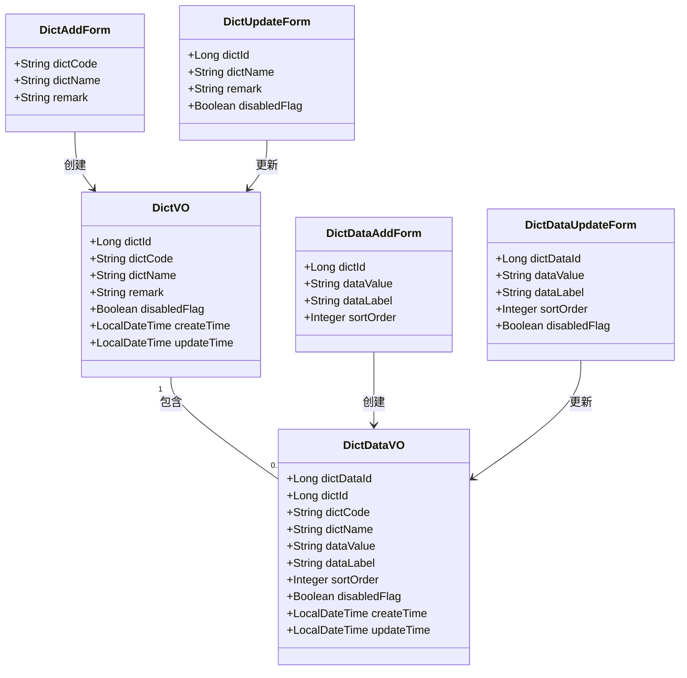

**图源**  
- [DictVO.java](file://smart-admin-api-java17-springboot3/sa-base/src/main/java/net/lab1024/sa/base/module/support/dict/domain/vo/DictVO.java)
- [DictDataVO.java](file://smart-admin-api-java17-springboot3/sa-base/src/main/java/net/lab1024/sa/base/module/support/dict/domain/vo/DictDataVO.java)

### 数据字典查询API
数据字典提供了多种查询方式，包括分页查询、获取全部字典数据和根据字典ID查询字典数据。

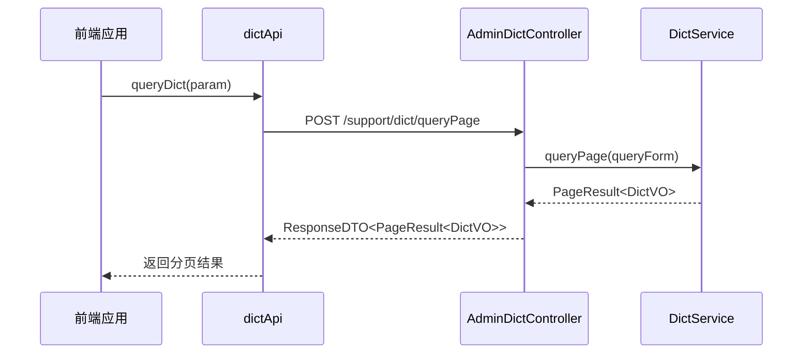

**图源**  
- [dict-api.js](file://smart-admin-web-javascript/src/api/support/dict-api.js#L24-L27)
- [AdminDictController.java](file://smart-admin-api-java17-springboot3/sa-admin/src/main/java/net/lab1024/sa/admin/module/system/support/AdminDictController.java#L53-L58)

### 数据字典增删改API
数据字典的增删改操作遵循统一的API设计模式，所有修改操作都需要相应的权限校验。

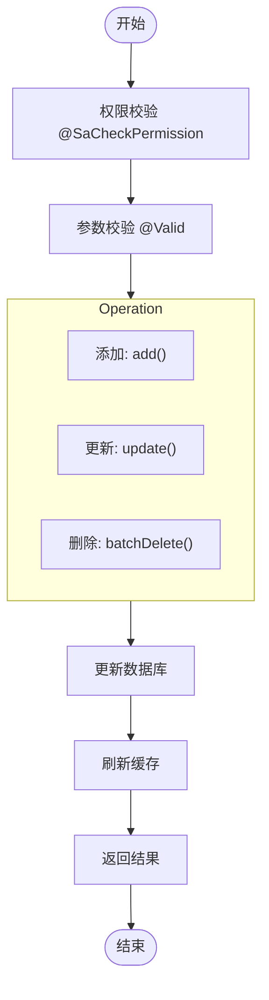

**图源**  
- [AdminDictController.java](file://smart-admin-api-java17-springboot3/sa-admin/src/main/java/net/lab1024/sa/admin/module/system/support/AdminDictController.java#L60-L96)

**本节源码**  
- [AdminDictController.java](file://smart-admin-api-java17-springboot3/sa-admin/src/main/java/net/lab1024/sa/admin/module/system/support/AdminDictController.java)
- [dict-api.js](file://smart-admin-web-javascript/src/api/support/dict-api.js)

## 文件服务API

文件服务API提供了完整的文件上传、下载、查询和管理功能，支持多种文件存储方式和安全控制。

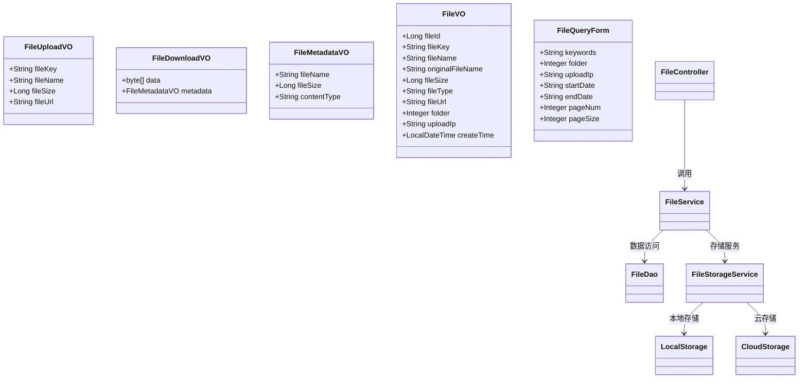

**图源**  
- [FileController.java](file://smart-admin-api-java17-springboot3/sa-base/src/main/java/net/lab1024/sa/base/module/support/file/controller/FileController.java)
- [FileService.java](file://smart-admin-api-java17-springboot3/sa-base/src/main/java/net/lab1024/sa/base/module/support/file/service/FileService.java)

### 文件上传下载实现
文件上传下载API采用流式处理方式，确保大文件处理的效率和稳定性。

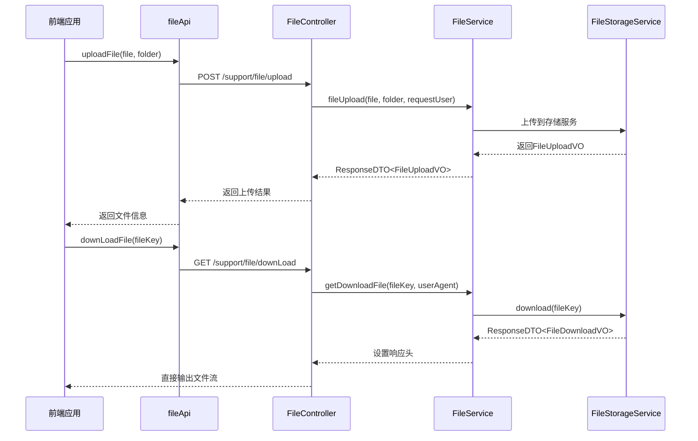

**图源**  
- [FileController.java](file://smart-admin-api-java17-springboot3/sa-base/src/main/java/net/lab1024/sa/base/module/support/file/controller/FileController.java#L44-L73)
- [file-api.js](file://smart-admin-web-javascript/src/api/support/file-api.js)

### 文件分片上传与预览
系统支持文件分片上传和预览功能，确保大文件上传的稳定性和用户体验。

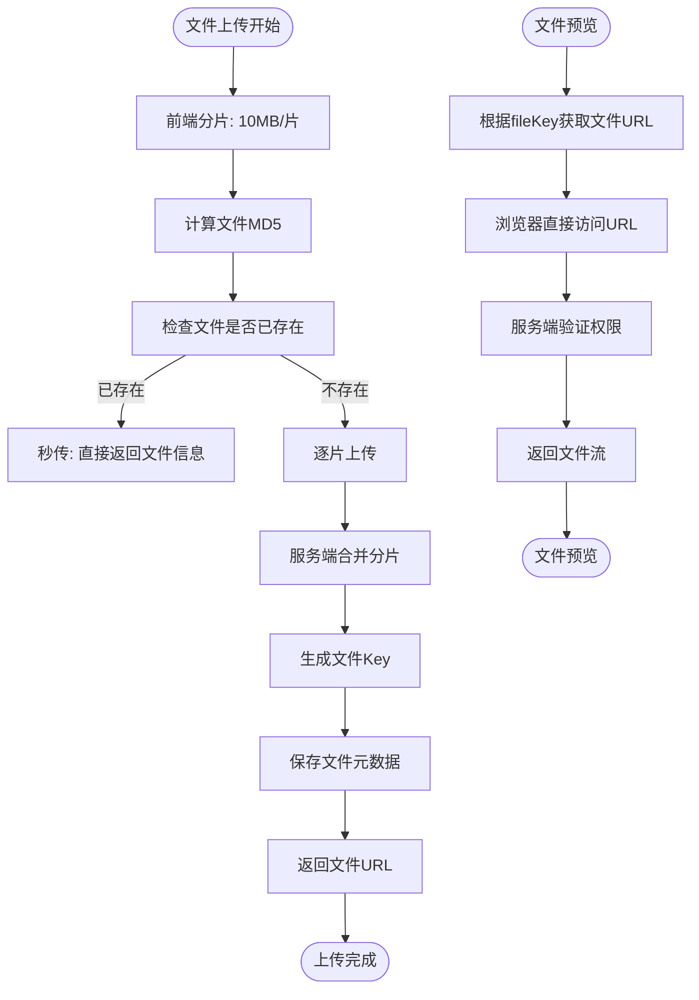

**图源**  
- [FileController.java](file://smart-admin-api-java17-springboot3/sa-base/src/main/java/net/lab1024/sa/base/module/support/file/controller/FileController.java)
- [file-api.js](file://smart-admin-web-javascript/src/api/support/file-api.js)

**本节源码**  
- [FileController.java](file://smart-admin-api-java17-springboot3/sa-base/src/main/java/net/lab1024/sa/base/module/support/file/controller/FileController.java)
- [file-api.js](file://smart-admin-web-javascript/src/api/support/file-api.js)

## 操作日志API

操作日志功能记录系统中所有重要操作，提供完整的审计追踪能力。

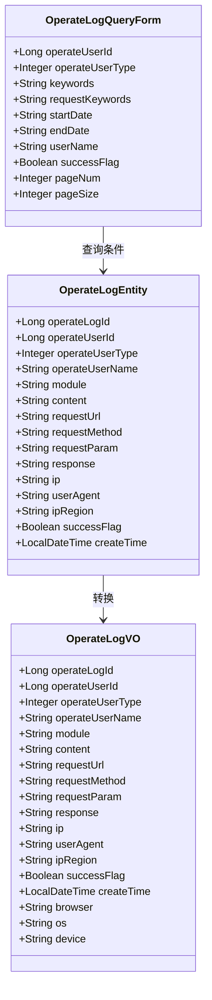

**图源**  
- [OperateLogEntity.java](file://smart-admin-api-java17-springboot3/sa-base/src/main/java/net/lab1024/sa/base/module/support/operatelog/domain/OperateLogEntity.java)
- [OperateLogVO.java](file://smart-admin-api-java17-springboot3/sa-base/src/main/java/net/lab1024/sa/base/module/support/operatelog/domain/OperateLogVO.java)

### 操作日志记录机制
操作日志通过AOP切面自动记录，确保所有重要操作都被完整记录。

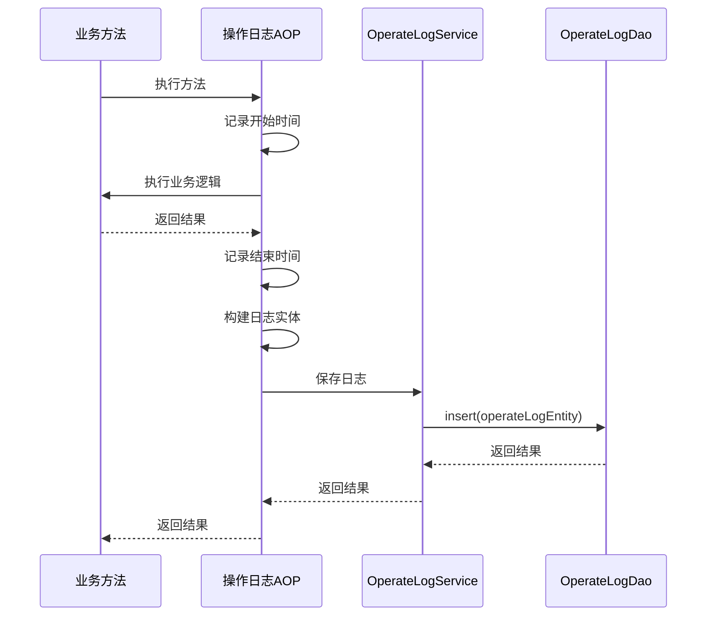

**图源**  
- [AdminOperateLogController.java](file://smart-admin-api-java17-springboot3/sa-admin/src/main/java/net/lab1024/sa/admin/module/system/support/AdminOperateLogController.java)

### 操作日志查询API
操作日志提供灵活的查询接口，支持按多种条件组合查询。

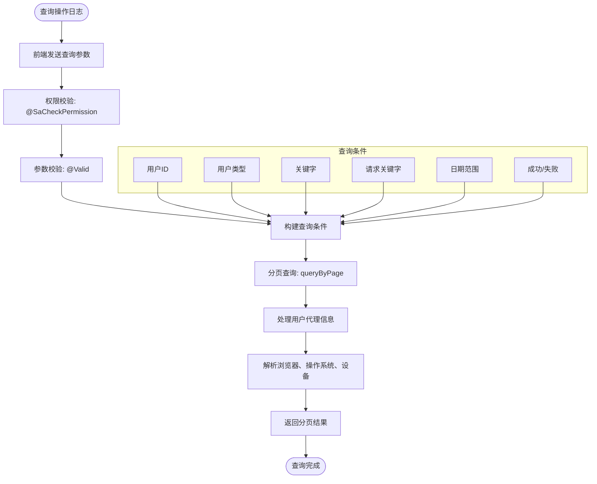

**图源**  
- [AdminOperateLogController.java](file://smart-admin-api-java17-springboot3/sa-admin/src/main/java/net/lab1024/sa/admin/module/system/support/AdminOperateLogController.java#L34-L39)
- [operate-log-api.js](file://smart-admin-web-javascript/src/api/support/operate-log-api.js)

**本节源码**  
- [AdminOperateLogController.java](file://smart-admin-api-java17-springboot3/sa-admin/src/main/java/net/lab1024/sa/admin/module/system/support/AdminOperateLogController.java)
- [operate-log-api.js](file://smart-admin-web-javascript/src/api/support/operate-log-api.js)

## 帮助文档API

帮助文档功能提供了一套完整的文档管理系统，支持文档的增删改查和目录管理。

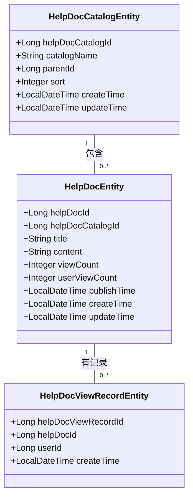

**图源**  
- [HelpDocCatalogEntity.java](file://smart-admin-api-java17-springboot3/sa-base/src/main/java/net/lab1024/sa/base/module/support/helpdoc/domain/entity/HelpDocCatalogEntity.java)
- [HelpDocEntity.java](file://smart-admin-api-java17-springboot3/sa-base/src/main/java/net/lab1024/sa/base/module/support/helpdoc/domain/entity/HelpDocEntity.java)

### 帮助文档管理API
帮助文档管理API提供了完整的CRUD操作和目录管理功能。

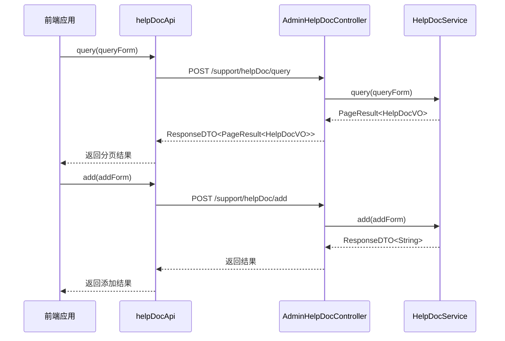

**图源**  
- [AdminHelpDocController.java](file://smart-admin-api-java17-springboot3/sa-admin/src/main/java/net/lab1024/sa/admin/module/system/support/AdminHelpDocController.java)
- [help-doc-api.js](file://smart-admin-web-javascript/src/api/support/help-doc-api.js)

**本节源码**  
- [AdminHelpDocController.java](file://smart-admin-api-java17-springboot3/sa-admin/src/main/java/net/lab1024/sa/admin/module/system/support/AdminHelpDocController.java)
- [help-doc-api.js](file://smart-admin-web-javascript/src/api/support/help-doc-api.js)

## 定时任务API

定时任务功能提供了一套完整的任务调度管理系统，支持任务的增删改查和执行记录查询。

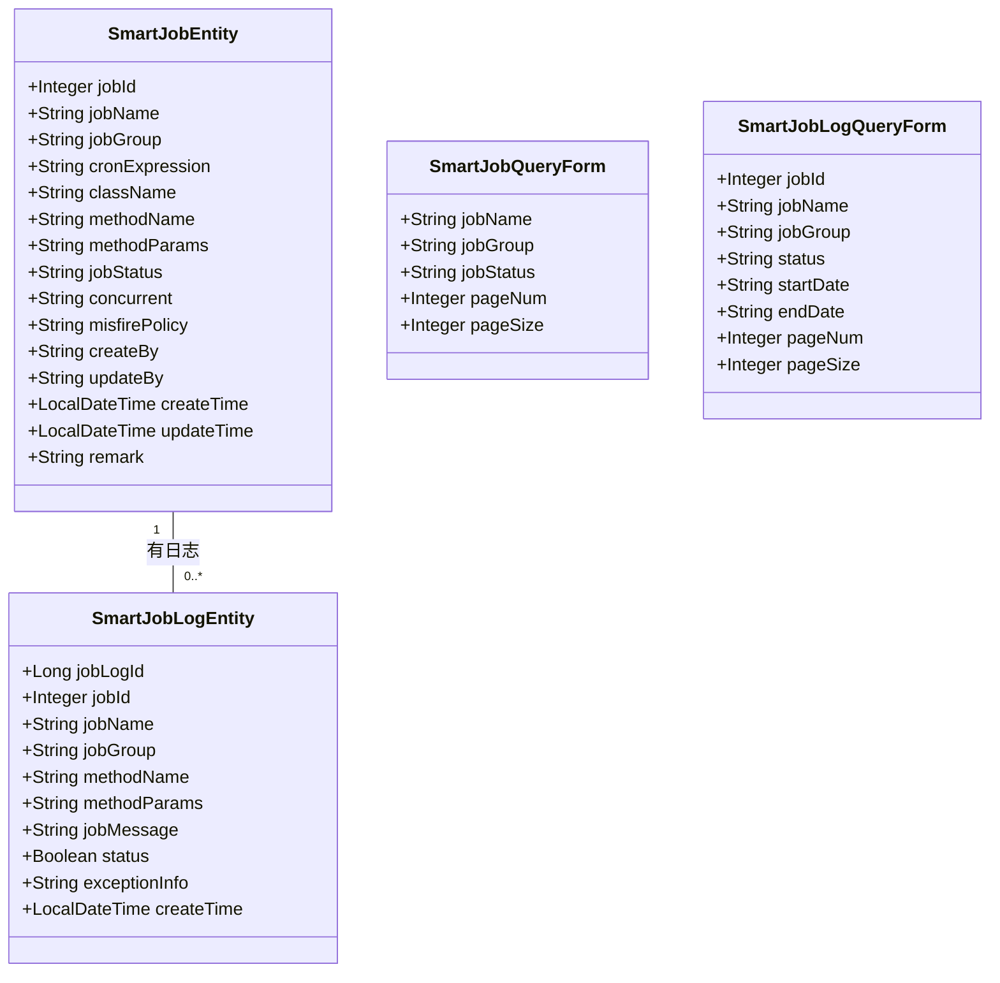

**图源**  
- [SmartJobEntity.java](file://smart-admin-api-java17-springboot3/sa-base/src/main/java/net/lab1024/sa/base/module/support/job/domain/entity/SmartJobEntity.java)
- [SmartJobLogEntity.java](file://smart-admin-api-java17-springboot3/sa-base/src/main/java/net/lab1024/sa/base/module/support/job/domain/entity/SmartJobLogEntity.java)

### 定时任务管理API
定时任务管理API提供了完整的任务调度功能，包括任务的增删改查和立即执行。

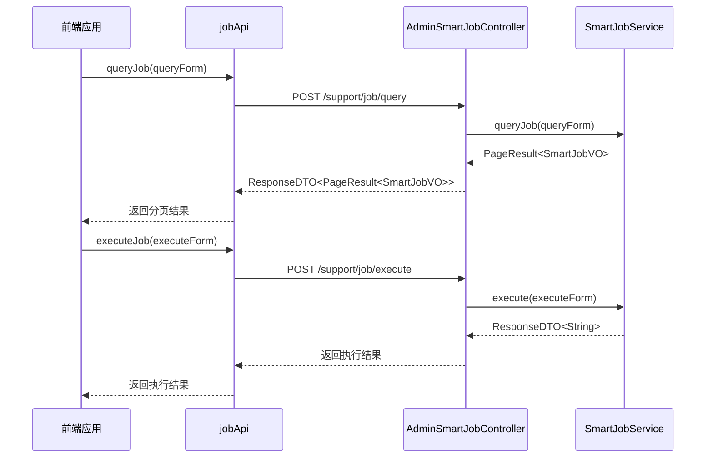

**图源**  
- [AdminSmartJobController.java](file://smart-admin-api-java17-springboot3/sa-admin/src/main/java/net/lab1024/sa/admin/module/system/support/AdminSmartJobController.java)
- [job-api.js](file://smart-admin-web-javascript/src/api/support/job-api.js)

**本节源码**  
- [AdminSmartJobController.java](file://smart-admin-api-java17-springboot3/sa-admin/src/main/java/net/lab1024/sa/admin/module/system/support/AdminSmartJobController.java)
- [job-api.js](file://smart-admin-web-javascript/src/api/support/job-api.js)

## 权限控制与安全考虑

系统采用多层次的安全控制机制，确保API的安全性和可靠性。

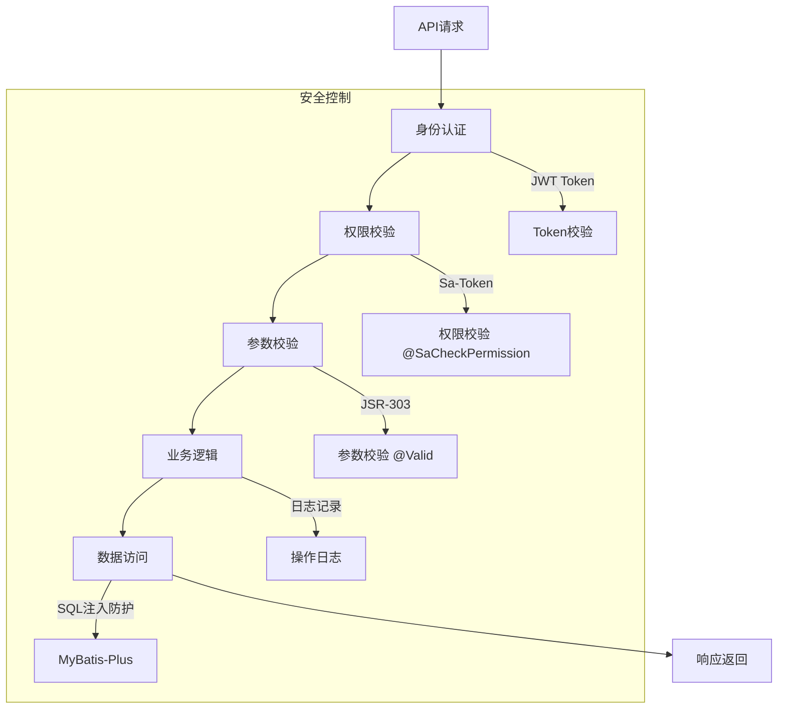

**图源**  
- [AdminDictController.java](file://smart-admin-api-java17-springboot3/sa-admin/src/main/java/net/lab1024/sa/admin/module/system/support/AdminDictController.java)
- [AdminOperateLogController.java](file://smart-admin-api-java17-springboot3/sa-admin/src/main/java/net/lab1024/sa/admin/module/system/support/AdminOperateLogController.java)

### 权限校验机制
系统使用Sa-Token框架实现细粒度的权限控制，每个API接口都有明确的权限要求。

```mermaid
flowchart TD
A([API请求]) --> B["解析JWT Token"]
B --> C["获取用户信息"]
C --> D["检查权限注解"]
D --> |有@SaCheckPermission| E["验证用户权限"]
D --> |无注解| F["允许访问"]
E --> |有权限| G["执行业务逻辑"]
E --> |无权限| H["返回403错误"]
G --> I["返回结果"]
H --> I
```

**图源**  
- [AdminDictController.java](file://smart-admin-api-java17-springboot3/sa-admin/src/main/java/net/lab1024/sa/admin/module/system/support/AdminDictController.java)
- [SmartOperationCustomizer.java](file://smart-admin-api-java17-springboot3/sa-base/src/main/java/net/lab1024/sa/base/common/swagger/SmartOperationCustomizer.java)

### 安全最佳实践
系统遵循多项安全最佳实践，确保API的安全性。

```mermaid
erDiagram
USER ||--o{ OPERATE_LOG : "记录"
USER ||--o{ FILE : "上传"
USER ||--o{ HELP_DOC : "查看"
USER ||--o{ JOB : "执行"
OPERATE_LOG }|--|| USER : "属于"
FILE }|--|| USER : "上传者"
HELP_DOC }|--|| USER : "创建者"
JOB }|--|| USER : "执行者"
class USER {
+userId
+userName
+userType
}
class OPERATE_LOG {
+operateLogId
+operateUserId
+module
+content
+successFlag
}
class FILE {
+fileId
+fileKey
+uploadUserId
+folder
}
class HELP_DOC {
+helpDocId
+createUserId
+viewCount
}
class JOB {
+jobId
+executeUserId
+status
}
```

**图源**  
- [UserPermission.java](file://smart-admin-api-java17-springboot3/sa-base/src/main/java/net/lab1024/sa/base/common/domain/UserPermission.java)
- [Level3ProtectConfigForm.java](file://smart-admin-api-java17-springboot3/sa-base/src/main/java/net/lab1024/sa/base/module/support/securityprotect/domain/Level3ProtectConfigForm.java)

**本节源码**  
- [AdminDictController.java](file://smart-admin-api-java17-springboot3/sa-admin/src/main/java/net/lab1024/sa/admin/module/system/support/AdminDictController.java)
- [SmartOperationCustomizer.java](file://smart-admin-api-java17-springboot3/sa-base/src/main/java/net/lab1024/sa/base/common/swagger/SmartOperationCustomizer.java)

## 结论
本文档详细介绍了系统支持功能的API设计原则和使用模式。通过分析数据字典、文件服务、操作日志、帮助文档和定时任务等核心功能模块，展示了系统的完整架构和实现细节。系统采用现代化的技术栈和安全机制，确保了API的稳定性、安全性和可维护性。开发者可以基于本文档快速理解和使用系统提供的各项支持功能API。