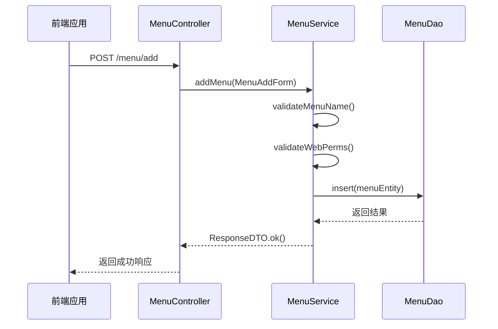
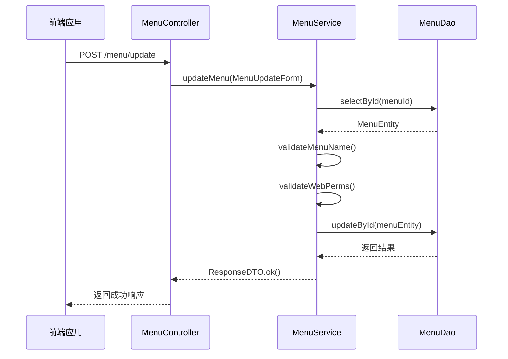
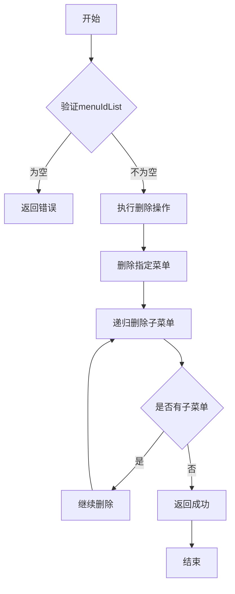
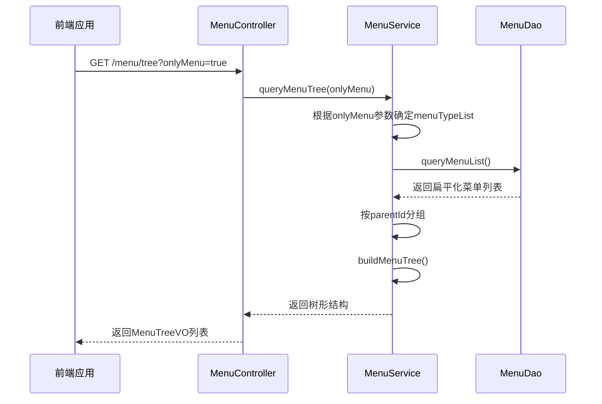
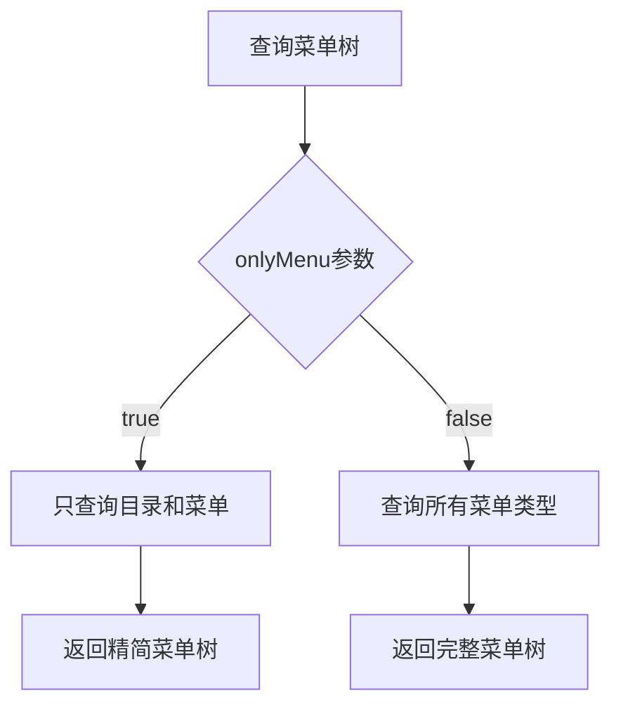
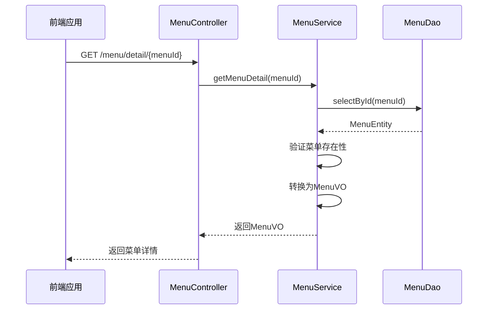
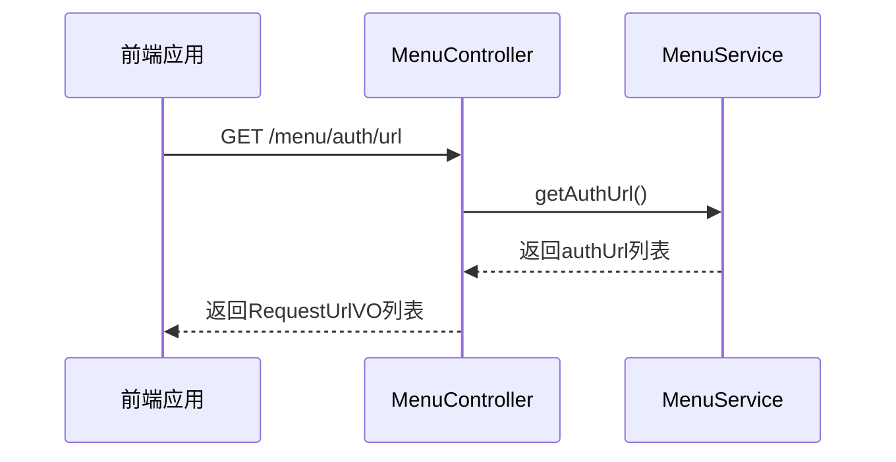
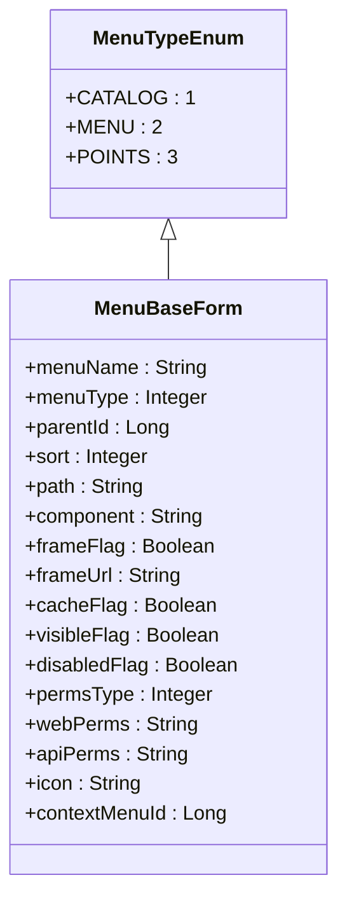

# 菜单管理API

<cite>
**本文档引用文件**  
- [MenuController.java](file://smart-admin-api-java17-springboot3/sa-admin/src/main/java/net/lab1024/sa/admin/module/system/menu/controller/MenuController.java)
- [MenuService.java](file://smart-admin-api-java17-springboot3/sa-admin/src/main/java/net/lab1024/sa/admin/module/system/menu/service/MenuService.java)
- [menu-api.js](file://smart-admin-web-javascript/src/api/system/menu-api.js)
- [menu-const.js](file://smart-admin-web-javascript/src/constants/system/menu-const.js)
- [MenuBaseForm.java](file://smart-admin-api-java17-springboot3/sa-admin/src/main/java/net/lab1024/sa/admin/module/system/menu/domain/form/MenuBaseForm.java)
- [RequestUrlVO.java](file://smart-admin-api-java17-springboot3/sa-base/src/main/java/net/lab1024/sa/base/common/domain/RequestUrlVO.java)
- [menu-data-handler.js](file://smart-admin-web-javascript/src/views/system/menu/menu-data-handler.js)
- [MenuTypeEnum.java](file://smart-admin-api-java17-springboot3/sa-admin/src/main/java/net/lab1024/sa/admin/module/system/menu/constant/MenuTypeEnum.java)
</cite>

## 目录
1. [简介](#简介)
2. [菜单管理接口](#菜单管理接口)
3. [菜单树查询机制](#菜单树查询机制)
4. [菜单详情获取](#菜单详情获取)
5. [权限路径获取](#权限路径获取)
6. [关键字段说明](#关键字段说明)
7. [前端动态渲染示例](#前端动态渲染示例)

## 简介
本技术文档详细描述了智能管理系统中的动态菜单系统实现机制。系统采用基于角色的访问控制（RBAC）模型，通过菜单管理API实现对系统功能的动态配置和权限控制。菜单系统支持多级嵌套结构，包含目录、菜单和功能点三种类型，为前端提供灵活的动态渲染能力。

**Section sources**
- [MenuController.java](file://smart-admin-api-java17-springboot3/sa-admin/src/main/java/net/lab1024/sa/admin/module/system/menu/controller/MenuController.java#L21-L29)

## 菜单管理接口
菜单管理API提供了完整的CRUD操作接口，支持对系统菜单的动态管理。

### 添加菜单 (/menu/add)
该接口用于创建新的菜单项。请求方法为POST，需要提供菜单的完整配置信息。



**Diagram sources**
- [MenuController.java](file://smart-admin-api-java17-springboot3/sa-admin/src/main/java/net/lab1024/sa/admin/module/system/menu/controller/MenuController.java#L37-L43)
- [MenuService.java](file://smart-admin-api-java17-springboot3/sa-admin/src/main/java/net/lab1024/sa/admin/module/system/menu/service/MenuService.java#L49-L61)

### 更新菜单 (/menu/update)
该接口用于修改现有菜单的配置信息。请求方法为POST，需要提供菜单ID和更新后的配置。



**Diagram sources**
- [MenuController.java](file://smart-admin-api-java17-springboot3/sa-admin/src/main/java/net/lab1024/sa/admin/module/system/menu/controller/MenuController.java#L45-L51)
- [MenuService.java](file://smart-admin-api-java17-springboot3/sa-admin/src/main/java/net/lab1024/sa/admin/module/system/menu/service/MenuService.java#L67-L89)

### 批量删除菜单 (/menu/batchDelete)
该接口用于批量删除菜单项及其子菜单。请求方法为GET，通过menuIdList参数传递要删除的菜单ID列表。



**Diagram sources**
- [MenuController.java](file://smart-admin-api-java17-springboot3/sa-admin/src/main/java/net/lab1024/sa/admin/module/system/menu/controller/MenuController.java#L53-L58)
- [MenuService.java](file://smart-admin-api-java17-springboot3/sa-admin/src/main/java/net/lab1024/sa/admin/module/system/menu/service/MenuService.java#L97-L114)

**Section sources**
- [menu-api.js](file://smart-admin-web-javascript/src/api/system/menu-api.js#L27-L32)

## 菜单树查询机制
查询菜单树接口(/menu/tree)是动态菜单系统的核心，用于获取菜单的层级结构。

### 接口实现


**Diagram sources**
- [MenuController.java](file://smart-admin-api-java17-springboot3/sa-admin/src/main/java/net/lab1024/sa/admin/module/system/menu/controller/MenuController.java#L72-L76)
- [MenuService.java](file://smart-admin-api-java17-springboot3/sa-admin/src/main/java/net/lab1024/sa/admin/module/system/menu/service/MenuService.java#L186-L196)

### onlyMenu参数的影响
onlyMenu参数在查询菜单树时起到关键的过滤作用：

- **onlyMenu=true**：只返回目录和菜单类型的节点，不包含功能点。这通常用于前端侧边栏菜单的渲染。
- **onlyMenu=false**：返回所有类型的菜单节点，包括目录、菜单和功能点。这用于需要完整权限信息的场景。



**Diagram sources**
- [MenuService.java](file://smart-admin-api-java17-springboot3/sa-admin/src/main/java/net/lab1024/sa/admin/module/system/menu/service/MenuService.java#L188-L190)

**Section sources**
- [MenuService.java](file://smart-admin-api-java17-springboot3/sa-admin/src/main/java/net/lab1024/sa/admin/module/system/menu/service/MenuService.java#L186-L196)

## 菜单详情获取
getMenuDetail()接口用于获取单个菜单的完整信息。

### 接口实现
该接口通过菜单ID查询数据库，返回包含所有配置信息的菜单详情。



**Diagram sources**
- [MenuController.java](file://smart-admin-api-java17-springboot3/sa-admin/src/main/java/net/lab1024/sa/admin/module/system/menu/controller/MenuController.java#L66-L70)
- [MenuService.java](file://smart-admin-api-java17-springboot3/sa-admin/src/main/java/net/lab1024/sa/admin/module/system/menu/service/MenuService.java#L217-L228)

**Section sources**
- [MenuController.java](file://smart-admin-api-java17-springboot3/sa-admin/src/main/java/net/lab1024/sa/admin/module/system/menu/controller/MenuController.java#L66-L70)

## 权限路径获取
getAuthUrl()接口在前端权限控制中扮演重要角色。

### 接口作用
该接口返回系统中所有可用的请求路径，用于前端权限校验和路由控制。



**Diagram sources**
- [MenuController.java](file://smart-admin-api-java17-springboot3/sa-admin/src/main/java/net/lab1024/sa/admin/module/system/menu/controller/MenuController.java#L78-L82)
- [MenuService.java](file://smart-admin-api-java17-springboot3/sa-admin/src/main/java/net/lab1024/sa/admin/module/system/menu/service/MenuService.java#L233-L235)

### RequestUrlVO对象结构
RequestUrlVO对象包含以下字段：

| 字段 | 类型 | 描述 |
|------|------|------|
| comment | String | 注释说明 |
| name | String | controller.method标识 |
| url | String | 请求URL路径 |

该对象在系统启动时通过扫描所有Controller方法自动生成，为前端提供完整的API路径信息。

**Section sources**
- [RequestUrlVO.java](file://smart-admin-api-java17-springboot3/sa-base/src/main/java/net/lab1024/sa/base/common/domain/RequestUrlVO.java#L1-L27)

## 关键字段说明
菜单系统包含多个关键配置字段，理解这些字段的用途对正确使用API至关重要。

### 菜单层级
菜单系统支持无限层级的嵌套结构，通过以下字段实现：

- **menuId**: 菜单项的唯一标识
- **parentId**: 父级菜单ID，顶级菜单的parentId为0
- **sort**: 显示顺序，数值越小越靠前

### 路由配置
与前端路由相关的配置字段：

- **path**: 路由地址，对应前端路由的path
- **component**: 组件路径，指定Vue组件的文件路径
- **frameFlag**: 是否为外链，true表示外部链接
- **frameUrl**: 外链地址，当frameFlag为true时有效

### 权限标识
权限控制相关的关键字段：

- **menuType**: 菜单类型，1=目录，2=菜单，3=功能点
- **webPerms**: 前端权限字符串，用于前端按钮级权限控制
- **apiPerms**: 后端权限字符串，用于后端接口权限校验
- **visibleFlag**: 显示状态，控制菜单是否在侧边栏显示
- **disabledFlag**: 禁用状态，控制菜单是否可点击



**Diagram sources**
- [MenuBaseForm.java](file://smart-admin-api-java17-springboot3/sa-admin/src/main/java/net/lab1024/sa/admin/module/system/menu/domain/form/MenuBaseForm.java#L23-L82)
- [MenuTypeEnum.java](file://smart-admin-api-java17-springboot3/sa-admin/src/main/java/net/lab1024/sa/admin/module/system/menu/constant/MenuTypeEnum.java#L1-L49)

**Section sources**
- [menu-const.js](file://smart-admin-web-javascript/src/constants/system/menu-const.js#L10-L23)

## 前端动态渲染示例
以下是前端动态渲染菜单的代码示例：

```javascript
// 获取菜单树数据
async function loadMenuTree() {
  try {
    // 只获取菜单和目录，不包含功能点
    const response = await menuApi.queryMenuTree(true);
    if (response.success) {
      // 构建树形结构
      const menuTree = buildMenuTree(response.data);
      // 渲染到侧边栏
      renderMenu(menuTree);
    }
  } catch (error) {
    console.error('加载菜单失败:', error);
  }
}

// 构建菜单树形结构
function buildMenuTree(menuList) {
  const menuMap = new Map();
  const rootMenus = [];
  
  // 创建菜单映射
  menuList.forEach(menu => {
    menuMap.set(menu.menuId, { ...menu, children: [] });
  });
  
  // 构建树形结构
  menuList.forEach(menu => {
    const currentMenu = menuMap.get(menu.menuId);
    if (menu.parentId === 0) {
      // 顶级菜单
      rootMenus.push(currentMenu);
    } else {
      // 子菜单
      const parentMenu = menuMap.get(menu.parentId);
      if (parentMenu) {
        parentMenu.children.push(currentMenu);
      }
    }
  });
  
  return rootMenus;
}

// 渲染菜单到DOM
function renderMenu(menuTree) {
  const menuContainer = document.getElementById('side-menu');
  menuContainer.innerHTML = generateMenuHTML(menuTree);
}

// 生成菜单HTML
function generateMenuHTML(menuItems) {
  return menuItems.map(item => {
    if (item.children && item.children.length > 0) {
      // 有子菜单的目录
      return `
        <div class="menu-item has-children">
          <div class="menu-title">${item.menuName}</div>
          <div class="sub-menu">
            ${generateMenuHTML(item.children)}
          </div>
        </div>
      `;
    } else {
      // 叶子节点菜单
      return `
        <a href="#${item.path}" class="menu-item">
          ${item.menuName}
        </a>
      `;
    }
  }).join('');
}
```

**Section sources**
- [menu-data-handler.js](file://smart-admin-web-javascript/src/views/system/menu/menu-data-handler.js#L37-L69)