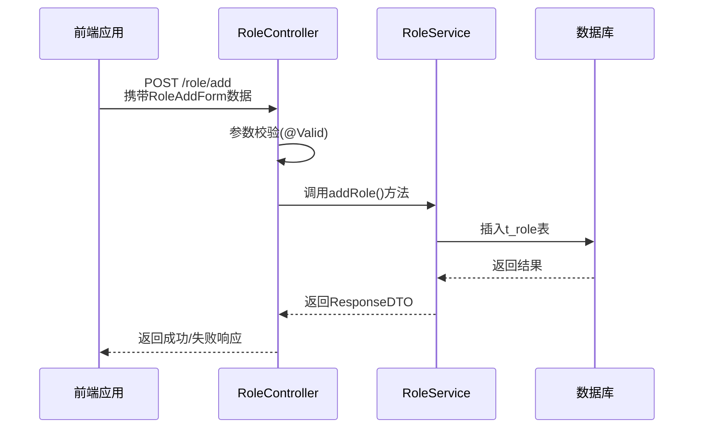

# 角色管理API

<cite>
**本文档引用文件**  
- [RoleController.java](file://smart-admin-api-java17-springboot3\sa-admin\src\main\java\net\lab1024\sa\admin\module\system\role\controller\RoleController.java)
- [RoleAddForm.java](file://smart-admin-api-java17-springboot3\sa-admin\src\main\java\net\lab1024\sa\admin\module\system\role\domain\form\RoleAddForm.java)
- [RoleUpdateForm.java](file://smart-admin-api-java17-springboot3\sa-admin\src\main\java\net\lab1024\sa\admin\module\system\role\domain\form\RoleUpdateForm.java)
- [RoleVO.java](file://smart-admin-api-java17-springboot3\sa-admin\src\main\java\net\lab1024\sa\admin\module\system\role\domain\vo\RoleVO.java)
- [RoleMenuController.java](file://smart-admin-api-java17-springboot3\sa-admin\src\main\java\net\lab1024\sa\admin\module\system\role\controller\RoleMenuController.java)
- [RoleEmployeeController.java](file://smart-admin-api-java17-springboot3\sa-admin\src\main\java\net\lab1024\sa\admin\module\system\role\controller\RoleEmployeeController.java)
- [RoleMenuUpdateForm.java](file://smart-admin-api-java17-springboot3\sa-admin\src\main\java\net\lab1024\sa\admin\module\system\role\domain\form\RoleMenuUpdateForm.java)
- [RoleEmployeeUpdateForm.java](file://smart-admin-api-java17-springboot3\sa-admin\src\main\java\net\lab1024\sa\admin\module\system\role\domain\form\RoleEmployeeUpdateForm.java)
- [RoleEntity.java](file://smart-admin-api-java17-springboot3\sa-admin\src\main\java\net\lab1024\sa\admin\module\system\role\domain\entity\RoleEntity.java)
- [role-api.js](file://smart-admin-web-javascript\src\api\system\role-api.js)
</cite>

## 目录
1. [简介](#简介)
2. [核心接口说明](#核心接口说明)
3. [数据模型设计](#数据模型设计)
4. [角色与菜单关联管理](#角色与菜单关联管理)
5. [角色与员工关联管理](#角色与员工关联管理)
6. [权限分配业务流程示例](#权限分配业务流程示例)
7. [角色使用状态约束](#角色使用状态约束)

## 简介
本技术文档详细阐述了基于RBAC（基于角色的访问控制）模型的权限管理系统中角色管理API的实现。系统通过角色作为权限分配的中间层，实现了用户与权限的解耦，支持灵活的权限配置和管理。文档重点介绍角色的增删改查基础操作、角色与菜单及员工的关联关系管理，以及完整的权限分配流程。

## 核心接口说明

### 基础操作接口
角色管理提供了完整的CRUD操作接口，支持对角色信息的全生命周期管理。

#### 添加角色 (/role/add)
该接口用于创建新的角色，需要提供角色名称、编码和描述等基本信息。接口通过`RoleAddForm`表单对象接收参数，确保输入数据的完整性和有效性。

**接口来源**  
- [RoleController.java](file://smart-admin-api-java17-springboot3\sa-admin\src\main\java\net\lab1024\sa\admin\module\system\role\controller\RoleController.java#L34-L39)

#### 更新角色 (/role/update)
该接口用于修改现有角色的信息。接口接收`RoleUpdateForm`对象，该对象继承自`RoleAddForm`并增加了`roleId`字段，确保更新操作的目标明确。

**接口来源**  
- [RoleController.java](file://smart-admin-api-java17-springboot3\sa-admin\src\main\java\net\lab1024\sa\admin\module\system\role\controller\RoleController.java#L48-L53)

#### 删除角色 (/role/delete/{roleId})
该接口用于删除指定ID的角色。删除操作会进行完整性检查，确保该角色未被其他实体引用，防止出现数据不一致。

**接口来源**  
- [RoleController.java](file://smart-admin-api-java17-springboot3\sa-admin\src\main\java\net\lab1024\sa\admin\module\system\role\controller\RoleController.java#L41-L46)

### 角色信息获取接口
系统提供了两种角色信息获取接口，适用于不同的应用场景。

#### getRole (/role/get/{roleId})
该接口用于获取单个角色的详细信息。当需要查看或编辑特定角色时使用，返回`RoleVO`对象，包含角色的完整信息。

**接口来源**  
- [RoleController.java](file://smart-admin-api-java17-springboot3\sa-admin\src\main\java\net\lab1024\sa\admin\module\system\role\controller\RoleController.java#L55-L59)

#### getAllRole (/role/getAll)
该接口用于获取系统中所有角色的列表。常用于下拉框选择、权限分配等需要展示全部角色的场景，返回`List<RoleVO>`集合。

**接口来源**  
- [RoleController.java](file://smart-admin-api-java17-springboot3\sa-admin\src\main\java\net\lab1024\sa\admin\module\system\role\controller\RoleController.java#L61-L64)

## 数据模型设计

### 角色表单与视图对象
系统通过表单对象（Form）和视图对象（VO）来分离数据的输入和输出。

#### RoleAddForm
`RoleAddForm`定义了添加角色时所需的数据结构，包含以下属性：

- **角色名称 (roleName)**：字符串类型，长度限制1-20个字符，不能为空
- **角色编码 (roleCode)**：字符串类型，长度限制1-20个字符，不能为空，用于系统内部标识
- **角色描述 (remark)**：字符串类型，最大长度255个字符，可选

**数据来源**  
- [RoleAddForm.java](file://smart-admin-api-java17-springboot3\sa-admin\src\main\java\net\lab1024\sa\admin\module\system\role\domain\form\RoleAddForm.java)

#### RoleUpdateForm
`RoleUpdateForm`继承自`RoleAddForm`，增加了`roleId`字段，用于标识要更新的角色。

**数据来源**  
- [RoleUpdateForm.java](file://smart-admin-api-java17-springboot3\sa-admin\src\main\java\net\lab1024\sa\admin\module\system\role\domain\form\RoleUpdateForm.java)

#### RoleVO
`RoleVO`是角色信息的视图对象，用于向前端展示角色数据，包含角色ID、名称、编码和描述等字段。

**数据来源**  
- [RoleVO.java](file://smart-admin-api-java17-springboot3\sa-admin\src\main\java\net\lab1024\sa\admin\module\system\role\domain\vo\RoleVO.java)

### 实体类映射
`RoleEntity`类映射到数据库中的`t_role`表，使用MyBatis-Plus进行ORM映射，包含主键ID、角色名称、编码、备注以及创建和更新时间等字段。

**数据来源**  
- [RoleEntity.java](file://smart-admin-api-java17-springboot3\sa-admin\src\main\java\net\lab1024\sa\admin\module\system\role\domain\entity\RoleEntity.java)

## 角色与菜单关联管理

### 接口说明
通过独立的`RoleMenuController`实现角色与菜单的关联管理，确保职责分离。

#### 更新角色菜单权限 (/role/menu/updateRoleMenu)
该接口用于为角色分配菜单权限。接收`RoleMenuUpdateForm`对象，包含角色ID和菜单ID集合，实现批量权限分配。

**接口来源**  
- [RoleMenuController.java](file://smart-admin-api-java17-springboot3\sa-admin\src\main\java\net\lab1024\sa\admin\module\system\role\controller\RoleMenuController.java#L31-L36)

#### 获取角色菜单权限 (/role/menu/getRoleSelectedMenu/{roleId})
该接口用于获取指定角色已分配的菜单权限，返回树形结构的菜单数据，便于前端展示和编辑。

**接口来源**  
- [RoleMenuController.java](file://smart-admin-api-java17-springboot3\sa-admin\src\main\java\net\lab1024\sa\admin\module\system\role\controller\RoleMenuController.java#L38-L42)

### 数据结构
`RoleMenuUpdateForm`包含`roleId`和`menuIdList`两个字段，支持为角色批量分配多个菜单权限。

**数据来源**  
- [RoleMenuUpdateForm.java](file://smart-admin-api-java17-springboot3\sa-admin\src\main\java\net\lab1024\sa\admin\module\system\role\domain\form\RoleMenuUpdateForm.java)

## 角色与员工关联管理

### 接口说明
通过`RoleEmployeeController`实现角色与员工的关联管理，支持灵活的成员管理。

#### 查询角色员工列表
支持分页查询（/role/employee/queryEmployee）和获取全部员工（/role/employee/getAllEmployeeByRoleId/{roleId}）两种方式。

**接口来源**  
- [RoleEmployeeController.java](file://smart-admin-api-java17-springboot3\sa-admin\src\main\java\net\lab1024\sa\admin\module\system\role\controller\RoleEmployeeController.java#L36-L45)

#### 批量操作接口
系统提供了批量添加（/role/employee/batchAddRoleEmployee）和批量移除（/role/employee/batchRemoveRoleEmployee）员工的接口，提高管理效率。

**接口来源**  
- [RoleEmployeeController.java](file://smart-admin-api-java17-springboot3\sa-admin\src\main\java\net\lab1024\sa\admin\module\system\role\controller\RoleEmployeeController.java#L62-L66)

### 数据结构
`RoleEmployeeUpdateForm`包含`roleId`和`employeeIdList`字段，用于批量操作员工与角色的关联关系。

**数据来源**  
- [RoleEmployeeUpdateForm.java](file://smart-admin-api-java17-springboot3\sa-admin\src\main\java\net\lab1024\sa\admin\module\system\role\domain\form\RoleEmployeeUpdateForm.java)

## 权限分配业务流程示例
完整的权限分配流程包括以下步骤：

1. **创建角色**：通过`/role/add`接口创建新角色，定义角色名称和编码
2. **分配菜单权限**：通过`/role/menu/updateRoleMenu`接口为角色分配相应的菜单访问权限
3. **分配数据权限**：通过数据范围接口配置角色的数据访问范围
4. **关联员工**：通过`/role/employee/batchAddRoleEmployee`接口将员工添加到角色中
5. **验证权限**：员工登录后，系统根据其角色自动加载相应的菜单和数据权限

该流程确保了权限分配的完整性和一致性，支持灵活的组织架构管理。

## 角色使用状态约束
系统对角色的使用状态有以下约束：

1. **唯一性约束**：角色编码在系统中必须唯一，防止重复定义
2. **删除约束**：被员工引用的角色不能直接删除，必须先解除所有关联关系
3. **权限控制**：所有角色管理操作都需要相应的权限认证（如`system:role:add`），确保操作安全
4. **数据校验**：所有输入数据都经过严格的长度和非空校验，保证数据质量

这些约束确保了角色管理系统的稳定性和数据一致性。