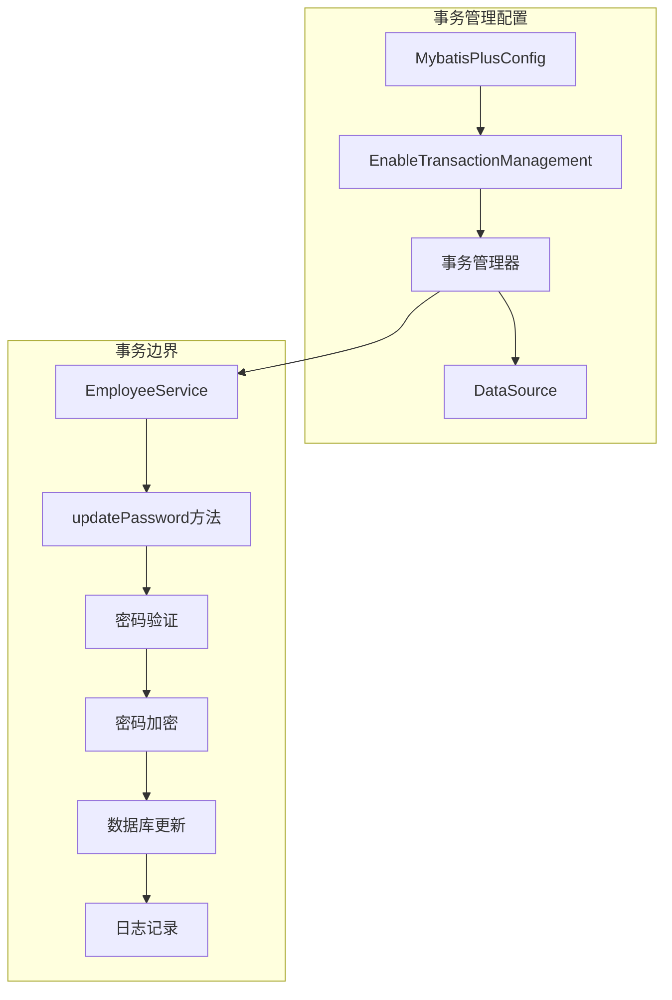
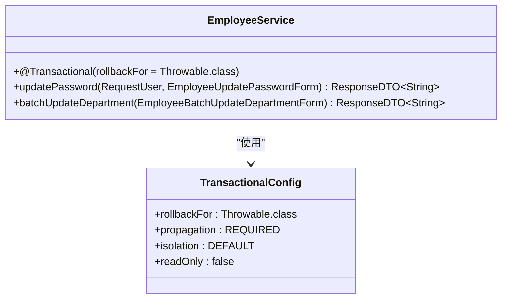
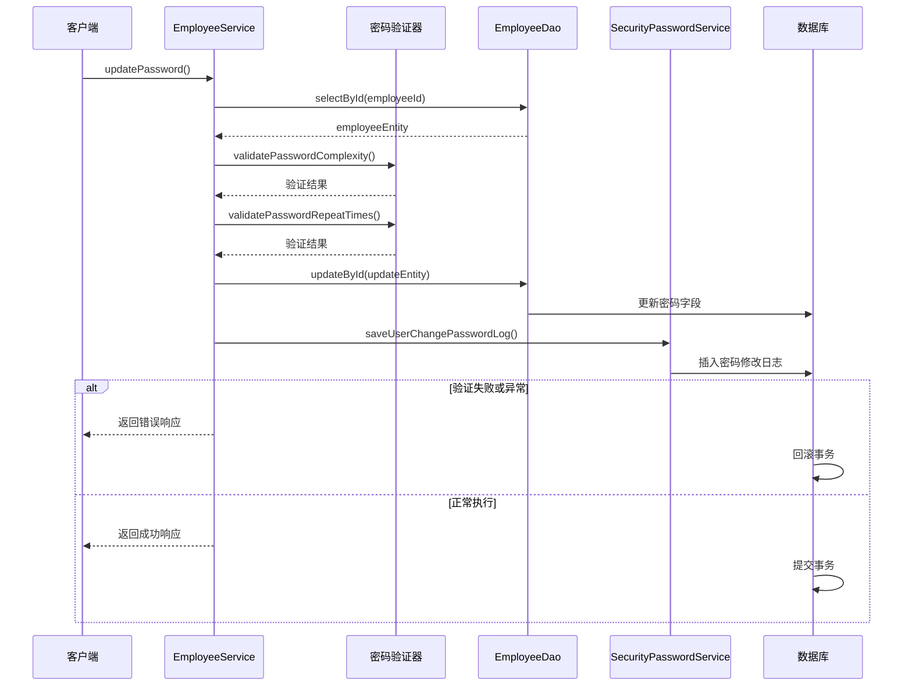
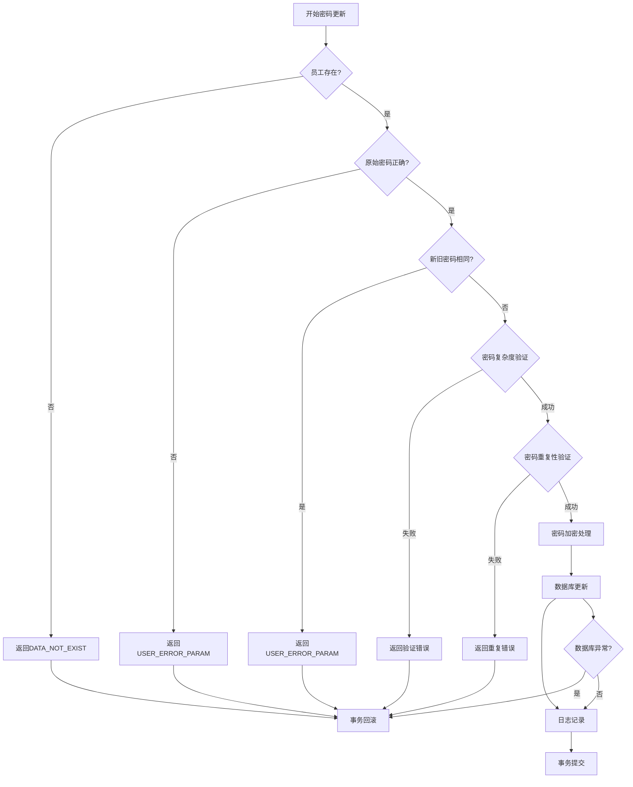
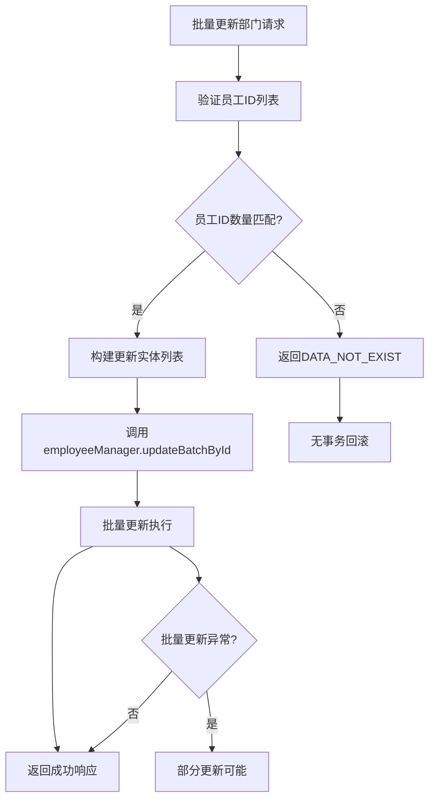

# 事务管理

<cite>
**本文档引用的文件**
- [EmployeeService.java](file://smart-admin-api-java17-springboot3/sa-admin/src/main/java/net/lab1024/sa/admin/module/system/employee/service/EmployeeService.java)
- [SecurityPasswordService.java](file://smart-admin-api-java17-springboot3/sa-base/src/main/java/net/lab1024/sa/base/module/support/securityprotect/service/SecurityPasswordService.java)
- [EmployeeDao.java](file://smart-admin-api-java17-springboot3/sa-admin/src/main/java/net/lab1024/sa/admin/module/system/employee/dao/EmployeeDao.java)
- [MybatisPlusConfig.java](file://smart-admin-api-java17-springboot3/sa-base/src/main/java/net/lab1024/sa/base/config/MybatisPlusConfig.java)
- [PasswordLogDao.java](file://smart-admin-api-java17-springboot3/sa-base/src/main/java/net/lab1024/sa/base/module/support/securityprotect/dao/PasswordLogDao.java)
- [Level3ProtectConfigService.java](file://smart-admin-api-java17-springboot3/sa-base/src/main/java/net/lab1024/sa/base/module/support/securityprotect/service/Level3ProtectConfigService.java)
</cite>

## 目录
1. [概述](#概述)
2. [事务管理架构](#事务管理架构)
3. [EmployeeService中的事务注解](#employeeservice中的事务注解)
4. [密码更新事务的详细分析](#密码更新事务的详细分析)
5. [事务传播行为和隔离级别](#事务传播行为和隔离级别)
6. [批量操作的事务策略](#批量操作的事务策略)
7. [事务边界设计原则](#事务边界设计原则)
8. [最佳实践和注意事项](#最佳实践和注意事项)

## 概述

Smart Admin系统采用基于Spring Framework的声明式事务管理机制，通过`@Transactional`注解实现对关键业务操作的事务控制。本文档重点分析EmployeeService中密码更新操作的事务管理实现，以及系统整体的事务设计策略。

## 事务管理架构

### Spring事务管理配置

系统通过以下配置启用事务管理：

**图表来源**
- [MybatisPlusConfig.java](file://smart-admin-api-java17-springboot3/sa-base/src/main/java/net/lab1024/sa/base/config/MybatisPlusConfig.java#L19-L21)

**章节来源**
- [MybatisPlusConfig.java](file://smart-admin-api-java17-springboot3/sa-base/src/main/java/net/lab1024/sa/base/config/MybatisPlusConfig.java#L1-L34)

## EmployeeService中的事务注解

### @Transactional注解的核心配置

在EmployeeService中，密码更新操作使用了精确的事务配置：

**图表来源**
- [EmployeeService.java](file://smart-admin-api-java17-springboot3/sa-admin/src/main/java/net/lab1024/sa/admin/module/system/employee/service/EmployeeService.java#L340-L341)

### 事务注解的关键特性

| 特性 | 配置值 | 说明 |
|------|--------|------|
| 回滚条件 | `Throwable.class` | 所有异常类型都触发回滚 |
| 传播行为 | 默认REQUIRED | 如果当前存在事务则加入，否则新建事务 |
| 隔离级别 | 默认ISOLATION_DEFAULT | 使用数据库默认隔离级别 |
| 只读属性 | false | 允许数据修改操作 |

**章节来源**
- [EmployeeService.java](file://smart-admin-api-java17-springboot3/sa-admin/src/main/java/net/lab1024/sa/admin/module/system/employee/service/EmployeeService.java#L340-L381)

## 密码更新事务的详细分析

### 事务边界覆盖的操作流程

密码更新操作包含了多个关键步骤，这些步骤被统一纳入同一个事务边界：

**图表来源**
- [EmployeeService.java](file://smart-admin-api-java17-springboot3/sa-admin/src/main/java/net/lab1024/sa/admin/module/system/employee/service/EmployeeService.java#L342-L380)

### 事务边界内的具体操作

密码更新事务包含以下关键操作：

| 操作步骤 | 数据库操作 | 日志记录 | 事务影响 |
|----------|------------|----------|----------|
| 原始密码验证 | 查询员工信息 | 无 | 只读查询 |
| 密码复杂度校验 | 无 | 无 | 业务逻辑验证 |
| 密码重复性校验 | 无 | 无 | 业务逻辑验证 |
| 密码加密处理 | 无 | 无 | 内存计算 |
| 数据库密码更新 | `updateById()` | 无 | 数据修改 |
| 密码修改日志记录 | `insert()` | `saveUserChangePasswordLog()` | 数据修改 |

**章节来源**
- [EmployeeService.java](file://smart-admin-api-java17-springboot3/sa-admin/src/main/java/net/lab1024/sa/admin/module/system/employee/service/EmployeeService.java#L342-L380)

### 错误处理和回滚机制

当密码更新过程中出现任何错误时，事务会自动回滚：

**图表来源**
- [EmployeeService.java](file://smart-admin-api-java17-springboot3/sa-admin/src/main/java/net/lab1024/sa/admin/module/system/employee/service/EmployeeService.java#L342-L380)

**章节来源**
- [EmployeeService.java](file://smart-admin-api-java17-springboot3/sa-admin/src/main/java/net/lab1024/sa/admin/module/system/employee/service/EmployeeService.java#L342-L380)

## 事务传播行为和隔离级别

### 默认配置说明

系统采用Spring事务管理的默认配置：

| 配置项 | 默认值 | 说明 |
|--------|--------|------|
| 传播行为 | REQUIRED | 当前存在事务则加入，否则新建 |
| 隔离级别 | ISOLATION_DEFAULT | 使用数据库默认隔离级别 |
| 只读属性 | false | 允许数据修改操作 |
| 回滚规则 | RuntimeException及其子类 | 默认回滚 |

### 为什么选择默认配置？

1. **传播行为**：REQUIRED是最常用的传播行为，适合大多数业务场景
2. **隔离级别**：使用数据库默认级别可以避免不必要的性能开销
3. **只读属性**：密码更新涉及数据修改，必须设置为false
4. **回滚规则**：使用Throwable.class确保所有异常都能触发回滚

**章节来源**
- [MybatisPlusConfig.java](file://smart-admin-api-java17-springboot3/sa-base/src/main/java/net/lab1024/sa/base/config/MybatisPlusConfig.java#L19-L21)

## 批量操作的事务策略

### batchUpdateDepartment的设计决策

与密码更新不同，批量更新部门操作没有使用事务注解：

**图表来源**
- [EmployeeService.java](file://smart-admin-api-java17-springboot3/sa-admin/src/main/java/net/lab1024/sa/admin/module/system/employee/service/EmployeeService.java#L318-L333)

### 设计决策的合理性分析

| 方面 | 批量操作 | 单事务操作 |
|------|----------|------------|
| 性能 | 更高效，减少事务开销 | 可能产生大量事务开销 |
| 数据一致性 | 部分成功，部分失败 | 要么全部成功，要么全部失败 |
| 错误处理 | 易于定位失败原因 | 需要逐个排查失败原因 |
| 并发控制 | 较弱的并发控制 | 强事务隔离 |
| 资源占用 | 较少的事务资源 | 较多的事务资源 |

### 适用场景对比

**批量操作适用场景：**
- 大量数据的简单更新
- 对性能要求较高的场景
- 可接受部分失败的情况

**单事务操作适用场景：**
- 关键业务操作
- 需要强一致性的场景
- 敏感数据修改

**章节来源**
- [EmployeeService.java](file://smart-admin-api-java17-springboot3/sa-admin/src/main/java/net/lab1024/sa/admin/module/system/employee/service/EmployeeService.java#L318-L333)

## 事务边界设计原则

### 原则一：敏感操作使用事务

密码更新作为敏感操作，必须使用事务保证：
- **原子性**：要么全部成功，要么全部失败
- **一致性**：保持数据的一致状态
- **隔离性**：防止并发修改冲突
- **持久性**：确保修改永久保存

### 原则二：批量操作谨慎使用事务

批量操作应根据具体场景权衡：
- **性能优先**：使用批量操作提高效率
- **一致性优先**：使用事务保证数据一致性
- **折中方案**：分批处理，平衡性能和一致性

### 原则三：事务边界清晰

每个事务应该有明确的边界和目的：
- **单一职责**：一个事务只处理一种业务逻辑
- **最小化范围**：只包含必要的操作
- **及时提交**：避免长时间持有事务

## 最佳实践和注意事项

### 密码更新的最佳实践

1. **严格验证顺序**
   - 先验证基础信息
   - 再进行业务逻辑验证
   - 最后执行数据修改

2. **异常处理策略**
   - 使用精确的异常类型
   - 提供有意义的错误信息
   - 确保事务回滚的可靠性

3. **安全性考虑**
   - 密码加密在内存中完成
   - 避免在日志中记录敏感信息
   - 使用安全的密码算法

### 事务性能优化建议

1. **合理控制事务范围**
   - 避免在事务中执行耗时操作
   - 将非关键操作移出事务边界
   - 使用异步处理非关键任务

2. **批量操作优化**
   - 合理设置批量大小
   - 考虑使用数据库批量插入
   - 监控批量操作的性能指标

3. **连接池配置**
   - 合理配置连接池大小
   - 设置合适的超时时间
   - 监控连接池使用情况

### 监控和调试

1. **事务监控**
   - 监控事务执行时间
   - 跟踪事务成功率
   - 分析事务冲突情况

2. **日志记录**
   - 记录事务开始和结束
   - 记录关键操作的执行状态
   - 提供足够的调试信息

3. **异常处理**
   - 记录完整的异常堆栈
   - 提供用户友好的错误信息
   - 支持异常的快速定位和解决

通过以上详细的事务管理分析，我们可以看到Smart Admin系统在事务控制方面采用了合理的策略，既保证了数据的安全性和一致性，又兼顾了系统的性能和可维护性。密码更新操作的事务设计体现了对敏感业务的重视，而批量操作的事务策略则展示了系统在性能和一致性之间的平衡考量。