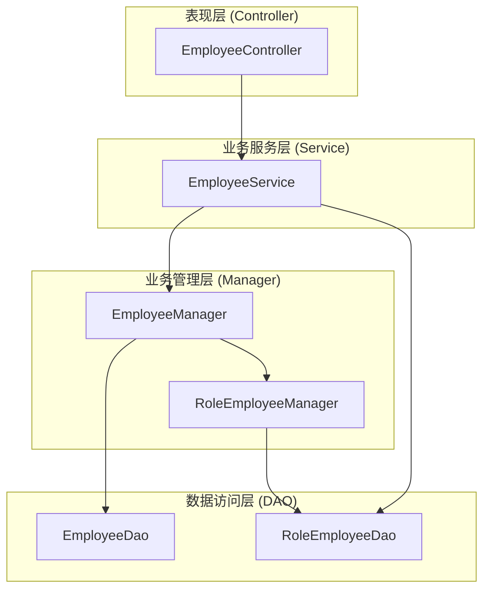
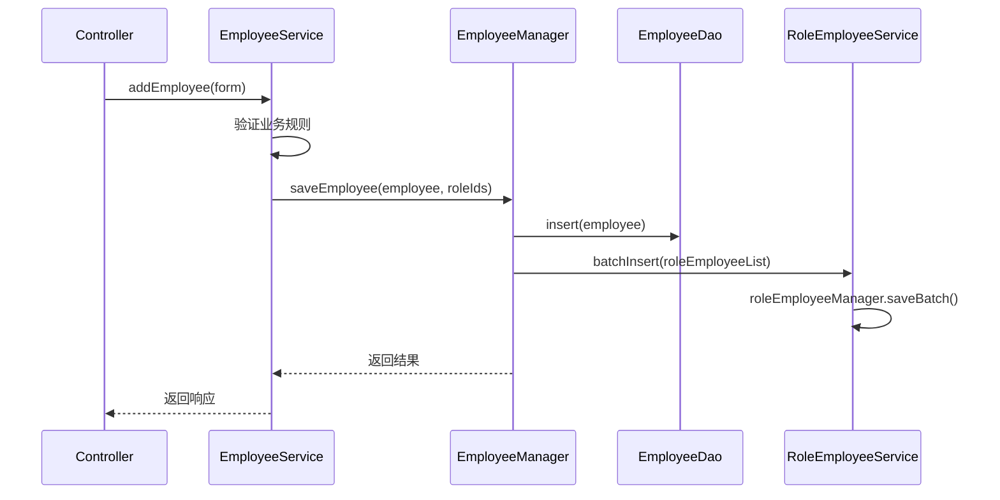
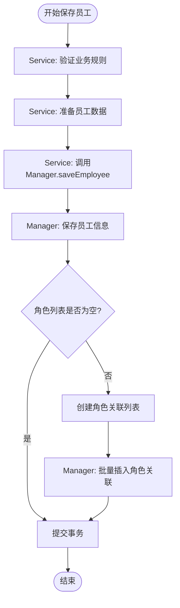
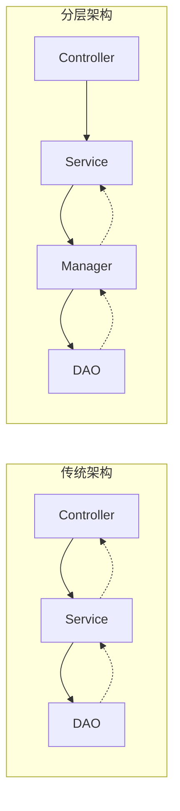
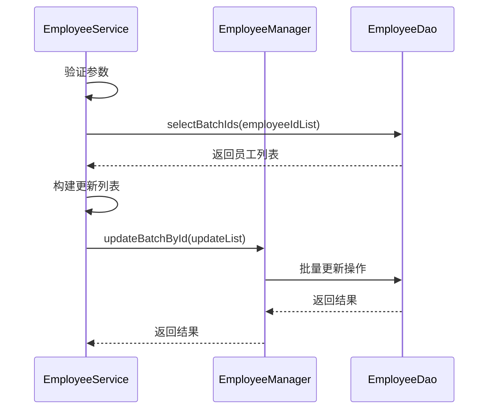

# 与Manager层协作

<cite>
**本文档引用的文件**
- [EmployeeService.java](file://smart-admin-api-java17-springboot3/sa-admin/src/main/java/net/lab1024/sa/admin/module/system/employee/service/EmployeeService.java)
- [EmployeeManager.java](file://smart-admin-api-java17-springboot3/sa-admin/src/main/java/net/lab1024/sa/admin/module/system/employee/manager/EmployeeManager.java)
- [EmployeeDao.java](file://smart-admin-api-java17-springboot3/sa-admin/src/main/java/net/lab1024/sa/admin/module/system/employee/dao/EmployeeDao.java)
- [EmployeeController.java](file://smart-admin-api-java17-springboot3/sa-admin/src/main/java/net/lab1024/sa/admin/module/system/employee/controller/EmployeeController.java)
- [RoleEmployeeService.java](file://smart-admin-api-java17-springboot3/sa-admin/src/main/java/net/lab1024/sa/admin/module/system/role/service/RoleEmployeeService.java)
- [RoleEmployeeManager.java](file://smart-admin-api-java17-springboot3/sa-admin/src/main/java/net/lab1024/sa/admin/module/system/role/manager/RoleEmployeeManager.java)
</cite>

## 目录
1. [引言](#引言)
2. [项目架构概述](#项目架构概述)
3. [核心组件分析](#核心组件分析)
4. [服务层与管理层协作机制](#服务层与管理层协作机制)
5. [详细业务流程分析](#详细业务流程分析)
6. [分层架构优势](#分层架构优势)
7. [批量操作处理](#批量操作处理)
8. [总结](#总结)

## 引言

本文档深入分析Smart Admin系统中EmployeeService与EmployeeManager的协作机制，重点阐述在复杂业务逻辑处理过程中，服务层如何通过Manager层实现业务逻辑封装、数据验证和持久化操作。通过详细分析saveEmployee和updateEmployee方法的调用关系，展示分层架构在提升代码可维护性、可测试性和业务逻辑复用方面的优势。

## 项目架构概述

Smart Admin采用经典的三层架构设计，包含Controller层、Service层和Manager层（以及DAO层）。这种分层架构确保了职责分离，提高了系统的可维护性和扩展性。

**图表来源**
- [EmployeeController.java](file://smart-admin-api-java17-springboot3/sa-admin/src/main/java/net/lab1024/sa/admin/module/system/employee/controller/EmployeeController.java#L30-L36)
- [EmployeeService.java](file://smart-admin-api-java17-springboot3/sa-admin/src/main/java/net/lab1024/sa/admin/module/system/employee/service/EmployeeService.java#L48-L74)
- [EmployeeManager.java](file://smart-admin-api-java17-springboot3/sa-admin/src/main/java/net/lab1024/sa/admin/module/system/employee/manager/EmployeeManager.java#L27-L38)

## 核心组件分析

### EmployeeService - 业务服务层

EmployeeService作为业务服务层的核心组件，负责：
- 接收Controller层的业务请求
- 执行业务逻辑验证和处理
- 协调Manager层完成数据操作
- 管理事务边界

主要职责包括：
- 员工信息的增删改查
- 密码管理和安全控制
- 部门和角色关联处理
- 批量操作协调

### EmployeeManager - 业务管理层

EmployeeManager作为业务管理层的核心组件，专注于：
- 封装具体的业务逻辑
- 管理数据持久化操作
- 处理复杂的业务规则
- 维护数据一致性

**章节来源**
- [EmployeeService.java](file://smart-admin-api-java17-springboot3/sa-admin/src/main/java/net/lab1024/sa/admin/module/system/employee/service/EmployeeService.java#L48-L74)
- [EmployeeManager.java](file://smart-admin-api-java17-springboot3/sa-admin/src/main/java/net/lab1024/sa/admin/module/system/employee/manager/EmployeeManager.java#L27-L38)

## 服务层与管理层协作机制

### 调用关系图

**图表来源**
- [EmployeeController.java](file://smart-admin-api-java17-springboot3/sa-admin/src/main/java/net/lab1024/sa/admin/module/system/employee/controller/EmployeeController.java#L47-L51)
- [EmployeeService.java](file://smart-admin-api-java17-springboot3/sa-admin/src/main/java/net/lab1024/sa/admin/module/system/employee/service/EmployeeService.java#L122-L152)
- [EmployeeManager.java](file://smart-admin-api-java17-springboot3/sa-admin/src/main/java/net/lab1024/sa/admin/module/system/employee/manager/EmployeeManager.java#L43-L51)

### 数据传递模式

服务层与管理层之间的数据传递遵循以下模式：

1. **参数封装**：Service层将表单数据封装为实体对象
2. **业务验证**：Service层执行业务规则验证
3. **委托处理**：Service层将验证后的数据委托给Manager层
4. **结果返回**：Manager层返回处理结果给Service层

**章节来源**
- [EmployeeService.java](file://smart-admin-api-java17-springboot3/sa-admin/src/main/java/net/lab1024/sa/admin/module/system/employee/service/EmployeeService.java#L122-L152)
- [EmployeeManager.java](file://smart-admin-api-java17-springboot3/sa-admin/src/main/java/net/lab1024/sa/admin/module/system/employee/manager/EmployeeManager.java#L43-L51)

## 详细业务流程分析

### saveEmployee 方法分析

saveEmployee方法展示了服务层与管理层协作的典型模式：

#### Service层处理流程

1. **业务验证**：检查登录名、手机号等唯一性约束
2. **数据准备**：生成员工UID、随机密码、设置默认值
3. **委托处理**：调用Manager层的saveEmployee方法
4. **结果处理**：返回随机密码给调用方

#### Manager层处理流程

1. **数据持久化**：先保存员工基本信息
2. **角色关联**：如果角色ID列表不为空，则建立角色关联
3. **事务管理**：使用@Transactional注解确保数据一致性

**图表来源**
- [EmployeeService.java](file://smart-admin-api-java17-springboot3/sa-admin/src/main/java/net/lab1024/sa/admin/module/system/employee/service/EmployeeService.java#L122-L152)
- [EmployeeManager.java](file://smart-admin-api-java17-springboot3/sa-admin/src/main/java/net/lab1024/sa/admin/module/system/employee/manager/EmployeeManager.java#L43-L51)

### updateEmployee 方法分析

updateEmployee方法展示了更复杂的业务逻辑处理：

#### Service层处理流程

1. **数据查询**：获取现有员工信息
2. **业务验证**：检查部门存在性、唯一性约束
3. **数据转换**：排除密码字段，避免意外更新
4. **委托处理**：调用Manager层的updateEmployee方法
5. **缓存清理**：清除相关缓存

#### Manager层处理流程

1. **数据更新**：更新员工基本信息
2. **角色处理**：根据角色列表决定删除或更新角色关联
3. **事务管理**：确保操作的原子性

**章节来源**
- [EmployeeService.java](file://smart-admin-api-java17-springboot3/sa-admin/src/main/java/net/lab1024/sa/admin/module/system/employee/service/EmployeeService.java#L159-L186)
- [EmployeeManager.java](file://smart-admin-api-java17-springboot3/sa-admin/src/main/java/net/lab1024/sa/admin/module/system/employee/manager/EmployeeManager.java#L58-L70)

## 分层架构优势

### 业务逻辑复用

通过将业务逻辑封装在Manager层，实现了以下优势：

1. **单一职责**：每个层次专注于特定职责
2. **代码复用**：Manager层的业务逻辑可在多个Service中复用
3. **易于测试**：各层可以独立进行单元测试
4. **便于维护**：业务逻辑集中管理，修改成本低

### 代码可维护性

### 测试便利性

分层架构使得测试更加便捷：

1. **隔离测试**：每层可以独立测试
2. **模拟依赖**：可以轻松模拟其他层的行为
3. **并行开发**：不同层次可以并行开发和测试

**章节来源**
- [EmployeeService.java](file://smart-admin-api-java17-springboot3/sa-admin/src/main/java/net/lab1024/sa/admin/module/system/employee/service/EmployeeService.java#L48-L74)
- [EmployeeManager.java](file://smart-admin-api-java17-springboot3/sa-admin/src/main/java/net/lab1024/sa/admin/module/system/employee/manager/EmployeeManager.java#L27-L38)

## 批量操作处理

### 批量更新部门信息

批量更新部门信息展示了Manager层在协调多个数据操作方面的能力：

#### Service层协调流程

1. **参数验证**：检查员工ID列表和部门ID的有效性
2. **数据查询**：获取现有员工信息
3. **数据转换**：构建更新列表
4. **委托处理**：调用Manager层的批量更新方法

#### Manager层处理流程

1. **批量查询**：一次性查询所有员工信息
2. **批量更新**：使用MyBatis Plus的批量更新功能
3. **事务管理**：确保整个批量操作的原子性

**图表来源**
- [EmployeeService.java](file://smart-admin-api-java17-springboot3/sa-admin/src/main/java/net/lab1024/sa/admin/module/system/employee/service/EmployeeService.java#L317-L331)
- [EmployeeManager.java](file://smart-admin-api-java17-springboot3/sa-admin/src/main/java/net/lab1024/sa/admin/module/system/employee/manager/EmployeeManager.java#L60-L70)

### 批量删除操作

批量删除操作展示了Manager层在处理复杂业务规则时的能力：

1. **数据验证**：检查员工ID列表和现有数据
2. **批量更新**：设置删除标志位
3. **强制登出**：对被删除用户强制退出登录

**章节来源**
- [EmployeeService.java](file://smart-admin-api-java17-springboot3/sa-admin/src/main/java/net/lab1024/sa/admin/module/system/employee/service/EmployeeService.java#L289-L311)

## 总结

Smart Admin系统中EmployeeService与EmployeeManager的协作体现了优秀的软件架构设计原则：

### 核心优势

1. **职责分离**：Service层负责业务逻辑协调，Manager层负责具体业务实现
2. **事务管理**：通过@Transactional注解确保数据一致性
3. **代码复用**：Manager层的业务逻辑可在多个场景中复用
4. **易于测试**：分层架构便于单元测试和集成测试
5. **可维护性**：业务逻辑集中管理，修改成本低

### 最佳实践

1. **单一职责原则**：每层专注于特定职责
2. **依赖注入**：通过Spring容器管理依赖关系
3. **事务边界**：在合适的层次定义事务边界
4. **异常处理**：统一的异常处理机制
5. **数据验证**：在Service层进行业务规则验证

这种分层架构不仅提高了代码质量，还为系统的长期发展奠定了坚实的基础。通过清晰的职责划分和良好的抽象层次，系统能够更好地应对业务需求的变化和技术演进的挑战。