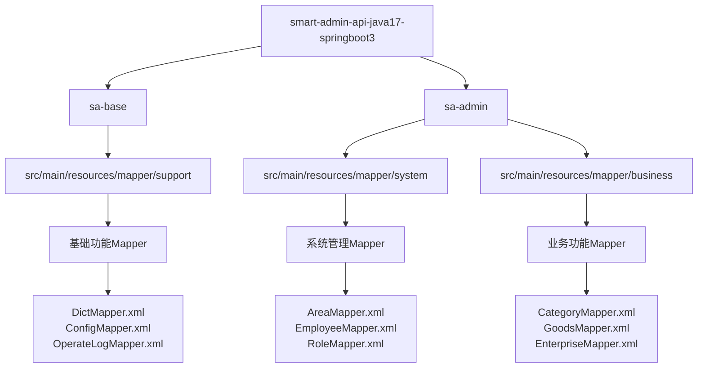
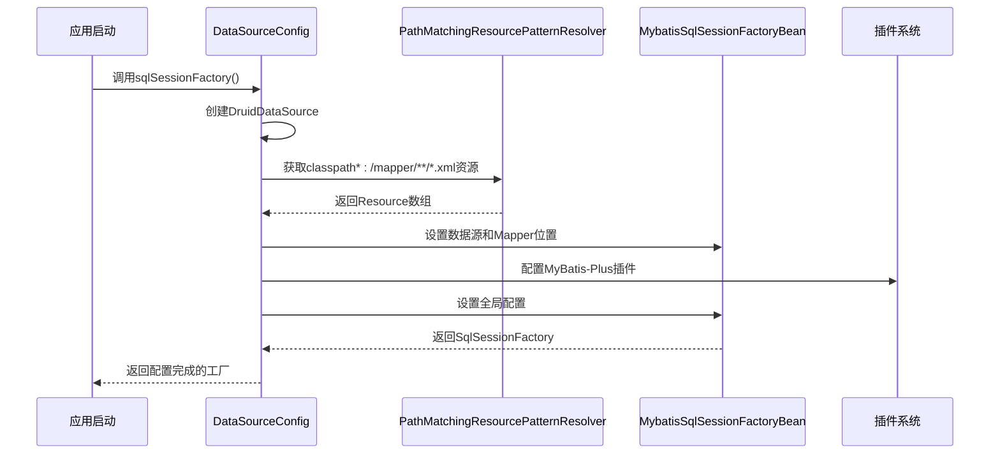
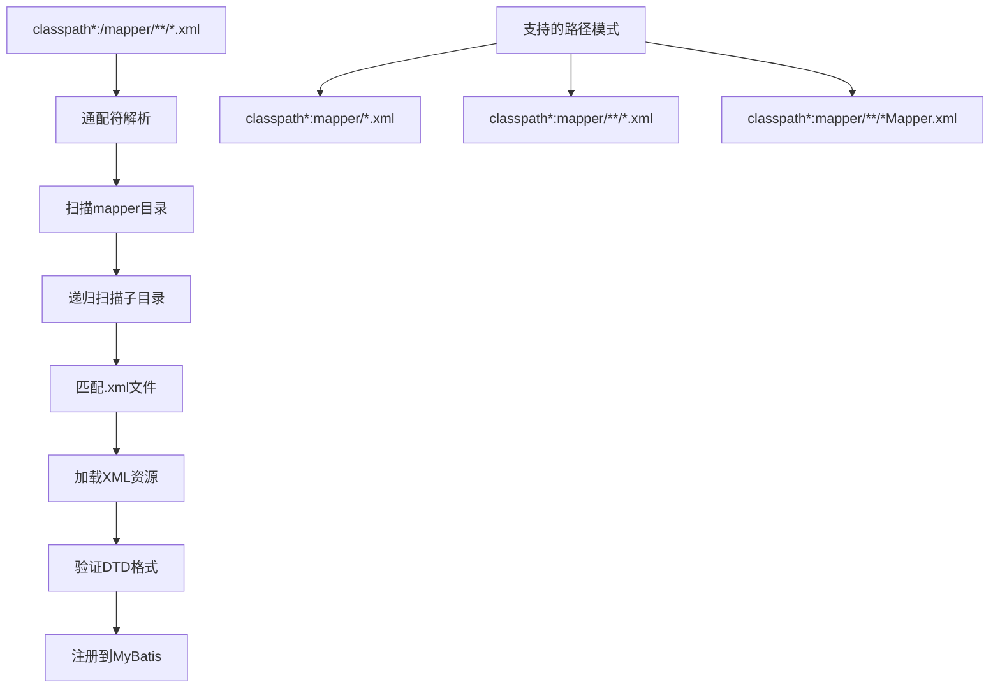
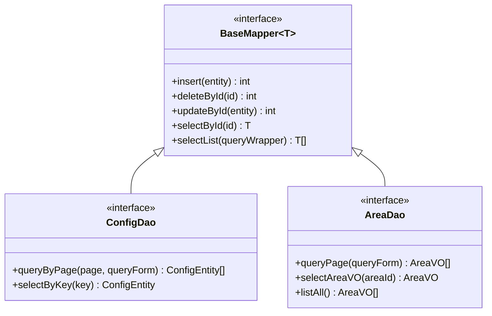
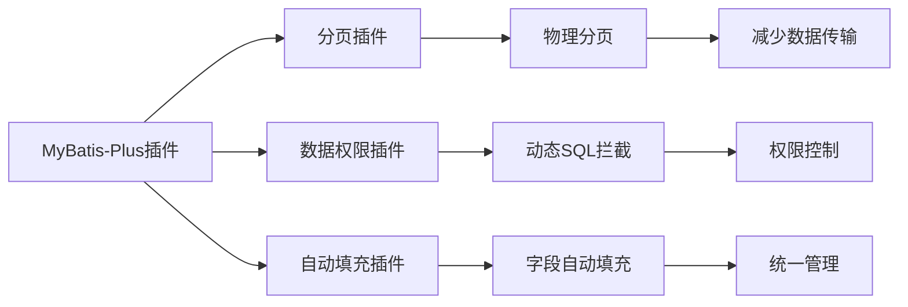

# Mapper映射配置

<cite>
**本文档引用的文件**
- [DataSourceConfig.java](file://smart-admin-api-java17-springboot3/sa-base/src/main/java/net/lab1024/sa/base/config/DataSourceConfig.java)
- [AreaMapper.xml](file://smart-admin-api-java17-springboot3/sa-admin/src/main/resources/mapper/system/area/AreaMapper.xml)
- [ConfigMapper.xml](file://smart-admin-api-java17-springboot3/sa-base/src/main/resources/mapper/support/ConfigMapper.xml)
- [DictMapper.xml](file://smart-admin-api-java17-springboot3/sa-base/src/main/resources/mapper/support/DictMapper.xml)
- [OperateLogMapper.xml](file://smart-admin-api-java17-springboot3/sa-base/src/main/resources/mapper/support/OperateLogMapper.xml)
- [EmployeeMapper.xml](file://smart-admin-api-java17-springboot3/sa-admin/src/main/resources/mapper/system/employee/EmployeeMapper.xml)
- [ConfigDao.java](file://smart-admin-api-java17-springboot3/sa-base/src/main/java/net/lab1024/sa/base/module/support/config/ConfigDao.java)
- [MyBatisPlugin.java](file://smart-admin-api-java17-springboot3/sa-admin/src/main/java/net/lab1024/sa/admin/module/system/datascope/MyBatisPlugin.java)
</cite>

## 目录
1. [概述](#概述)
2. [项目结构分析](#项目结构分析)
3. [DataSourceConfig类详解](#datasourceconfig类详解)
4. [Mapper XML文件扫描机制](#mapper-xml文件扫描机制)
5. [Mapper命名规范与目录结构](#mapper命名规范与目录结构)
6. [Mapper接口与XML文件对应关系](#mapper接口与xml文件对应关系)
7. [SQL语句优化最佳实践](#sql语句优化最佳实践)
8. [动态SQL使用模式](#动态sql使用模式)
9. [结果映射配置](#结果映射配置)
10. [性能优化策略](#性能优化策略)
11. [故障排除指南](#故障排除指南)
12. [总结](#总结)

## 概述

MyBatis Mapper映射配置是Smart Admin框架中的核心数据访问层组件，负责将Java接口方法映射到数据库操作的XML配置文件。本文档详细介绍了该框架中Mapper映射的扫描、加载、配置和优化机制。

## 项目结构分析

Smart Admin项目采用分层架构设计，Mapper相关文件分布在以下目录结构中：



**图表来源**
- [AreaMapper.xml](file://smart-admin-api-java17-springboot3/sa-admin/src/main/resources/mapper/system/area/AreaMapper.xml#L1-L23)
- [ConfigMapper.xml](file://smart-admin-api-java17-springboot3/sa-base/src/main/resources/mapper/support/ConfigMapper.xml#L1-L22)

**章节来源**
- [AreaMapper.xml](file://smart-admin-api-java17-springboot3/sa-admin/src/main/resources/mapper/system/area/AreaMapper.xml#L1-L160)
- [ConfigMapper.xml](file://smart-admin-api-java17-springboot3/sa-base/src/main/resources/mapper/support/ConfigMapper.xml#L1-L46)

## DataSourceConfig类详解

DataSourceConfig类是MyBatis配置的核心组件，负责数据源和SQL会话工厂的初始化。

### sqlSessionFactory()方法实现



**图表来源**
- [DataSourceConfig.java](file://smart-admin-api-java17-springboot3/sa-base/src/main/java/net/lab1024/sa/base/config/DataSourceConfig.java#L135-L152)

### 关键配置参数

| 配置项 | 类型 | 默认值 | 说明 |
|--------|------|--------|------|
| driver | String | - | JDBC驱动类名 |
| url | String | - | 数据库连接URL |
| username | String | - | 数据库用户名 |
| password | String | - | 数据库密码 |
| initialSize | int | 5 | 初始连接数 |
| maxActive | int | 20 | 最大活跃连接数 |
| filters | String | - | 过滤器配置 |

**章节来源**
- [DataSourceConfig.java](file://smart-admin-api-java17-springboot3/sa-base/src/main/java/net/lab1024/sa/base/config/DataSourceConfig.java#L50-L82)

## Mapper XML文件扫描机制

### classpath*:/mapper/**/*.xml路径匹配规则

系统使用Spring的PathMatchingResourcePatternResolver进行资源扫描，支持以下匹配规则：



**图表来源**
- [DataSourceConfig.java](file://smart-admin-api-java17-springboot3/sa-base/src/main/java/net/lab1024/sa/base/config/DataSourceConfig.java#L139)

### 资源加载过程

1. **路径解析阶段**：Spring解析classpath*前缀，支持多个类路径扫描
2. **目录遍历阶段**：递归遍历mapper目录及其子目录
3. **文件过滤阶段**：筛选以.xml结尾的文件
4. **XML验证阶段**：验证DTD格式和命名空间
5. **注册阶段**：将Mapper XML注册到MyBatis容器

**章节来源**
- [DataSourceConfig.java](file://smart-admin-api-java17-springboot3/sa-base/src/main/java/net/lab1024/sa/base/config/DataSourceConfig.java#L138-L140)

## Mapper命名规范与目录结构

### 目录结构规范

```
src/main/resources/mapper/
├── support/          # 支持功能模块
│   ├── DictMapper.xml      # 字典管理
│   ├── ConfigMapper.xml    # 系统配置
│   └── OperateLogMapper.xml # 操作日志
├── system/              # 系统管理模块
│   ├── area/           # 区域管理
│   │   └── AreaMapper.xml
│   ├── employee/       # 员工管理
│   │   └── EmployeeMapper.xml
│   ├── role/          # 角色管理
│   │   ├── RoleMapper.xml
│   │   └── RoleDataScopeMapper.xml
│   └── department/    # 部门管理
│       └── DepartmentMapper.xml
└── business/          # 业务功能模块
    ├── category/      # 商品分类
    │   └── CategoryMapper.xml
    ├── goods/         # 商品管理
    │   └── GoodsMapper.xml
    └── oa/           # 办公自动化
        ├── enterprise/ # 企业信息
        │   ├── EnterpriseMapper.xml
        │   └── EnterpriseEmployeeMapper.xml
        ├── bank/      # 银行账户
        │   └── BankMapper.xml
        ├── invoice/   # 发票管理
        │   └── InvoiceMapper.xml
        └── notice/    # 公告通知
            └── NoticeMapper.xml
```

### 文件命名规范

| 组件 | 命名规则 | 示例 |
|------|----------|------|
| Mapper文件 | {模块名}Mapper.xml | AreaMapper.xml |
| 接口文件 | {模块名}Dao.java | AreaDao.java |
| 命名空间 | 完整包路径+Dao | net.lab1024.sa.admin.module.system.area.dao.AreaDao |
| SQL ID | 方法名 | queryPage, selectById |

**章节来源**
- [AreaMapper.xml](file://smart-admin-api-java17-springboot3/sa-admin/src/main/resources/mapper/system/area/AreaMapper.xml#L2)
- [ConfigMapper.xml](file://smart-admin-api-java17-springboot3/sa-base/src/main/resources/mapper/support/ConfigMapper.xml#L2)

## Mapper接口与XML文件对应关系

### 命名空间配置

每个Mapper XML文件必须在根元素中定义正确的命名空间：

```xml
<mapper namespace="net.lab1024.sa.admin.module.system.area.dao.AreaDao">
```

### 接口继承关系



**图表来源**
- [ConfigDao.java](file://smart-admin-api-java17-springboot3/sa-base/src/main/java/net/lab1024/sa/base/module/support/config/ConfigDao.java#L22-L36)

### 注解配置

接口层面使用@Mapper注解标识：

```java
@Mapper
public interface ConfigDao extends BaseMapper<ConfigEntity> {
    // 方法定义
}
```

**章节来源**
- [ConfigDao.java](file://smart-admin-api-java17-springboot3/sa-base/src/main/java/net/lab1024/sa/base/module/support/config/ConfigDao.java#L22)
- [AreaMapper.xml](file://smart-admin-api-java17-springboot3/sa-admin/src/main/resources/mapper/system/area/AreaMapper.xml#L2)

## SQL语句优化最佳实践

### 查询优化策略

#### 1. 条件查询优化

```xml
<!-- 优化前：全表扫描 -->
<select id="queryOld" resultType="Entity">
    SELECT * FROM table_name
    <where>
        <if test="condition != null">
            AND column_name = #{condition}
        </if>
    </where>
</select>

<!-- 优化后：索引利用 -->
<select id="queryOptimized" resultType="Entity">
    SELECT id, column1, column2
    FROM table_name
    <where>
        <if test="condition != null">
            AND column_name = #{condition}
        </if>
    </where>
    ORDER BY create_time DESC
    LIMIT #{pageSize}
</select>
```

#### 2. 分页查询优化

```xml
<!-- 使用MyBatis-Plus分页插件 -->
<select id="queryByPage" resultType="Entity">
    SELECT *
    FROM table_name
    <where>
        <!-- 条件过滤 -->
    </where>
    ORDER BY create_time DESC
</select>
```

### 索引使用原则

| 场景 | 索引类型 | 实现方式 |
|------|----------|----------|
| 主键查询 | PRIMARY KEY | 自动创建 |
| 唯一约束 | UNIQUE | 显式定义 |
| 前缀匹配 | INDEX | LIKE '%value%' |
| 范围查询 | INDEX | BETWEEN, >, < |
| 多列组合 | COMPOSITE INDEX | 多字段联合索引 |

**章节来源**
- [AreaMapper.xml](file://smart-admin-api-java17-springboot3/sa-admin/src/main/resources/mapper/system/area/AreaMapper.xml#L95-L102)
- [EmployeeMapper.xml](file://smart-admin-api-java17-springboot3/sa-admin/src/main/resources/mapper/system/employee/EmployeeMapper.xml#L5-L34)

## 动态SQL使用模式

### 条件判断模式

```xml
<select id="queryWithConditions" resultType="Entity">
    SELECT *
    FROM table_name
    <where>
        <!-- 字符串模糊匹配 -->
        <if test="keywords != null and keywords != ''">
            AND (column1 LIKE CONCAT('%', #{keywords}, '%')
                 OR column2 LIKE CONCAT('%', #{keywords}, '%'))
        </if>
        
        <!-- 数值范围查询 -->
        <if test="minValue != null and maxValue != null">
            AND numeric_column BETWEEN #{minValue} AND #{maxValue}
        </if>
        
        <!-- 枚举类型匹配 -->
        <if test="status != null">
            AND status = #{status}
        </if>
        
        <!-- 集合类型查询 -->
        <if test="idList != null and idList.size > 0">
            AND id IN
            <foreach collection="idList" open="(" close=")" separator="," item="item">
                #{item}
            </foreach>
        </if>
    </where>
</select>
```

### foreach循环模式

```xml
<!-- 批量删除 -->
<delete id="batchDelete">
    DELETE FROM table_name
    WHERE id IN
    <foreach collection="idList" open="(" close=")" separator="," item="item">
        #{item}
    </foreach>
</delete>

<!-- 批量插入 -->
<insert id="batchInsert">
    INSERT INTO table_name (column1, column2)
    VALUES
    <foreach collection="entityList" separator="," item="item">
        (#{item.column1}, #{item.column2})
    </foreach>
</insert>
```

### choose分支模式

```xml
<select id="complexQuery" resultType="Entity">
    SELECT *
    FROM table_name
    <where>
        <choose>
            <when test="type == 'A'">
                AND type_a_column = #{value}
            </when>
            <when test="type == 'B'">
                AND type_b_column = #{value}
            </when>
            <otherwise>
                AND default_column = #{value}
            </otherwise>
        </choose>
    </where>
</select>
```

**章节来源**
- [AreaMapper.xml](file://smart-admin-api-java17-springboot3/sa-admin/src/main/resources/mapper/system/area/AreaMapper.xml#L66-L93)
- [EmployeeMapper.xml](file://smart-admin-api-java17-springboot3/sa-admin/src/main/resources/mapper/system/employee/EmployeeMapper.xml#L11-L33)

## 结果映射配置

### resultMap配置模式

```xml
<mapper namespace="net.lab1024.sa.admin.module.system.area.dao.AreaDao">
    <!-- 通用ResultMap -->
    <resultMap id="AreaVOMap" type="net.lab1024.sa.admin.module.system.area.domain.vo.AreaVO">
        <!-- 主键映射 -->
        <id property="areaId" column="area_id"/>
        
        <!-- 普通字段映射 -->
        <result property="areaCode" column="area_code"/>
        <result property="areaName" column="area_name"/>
        <result property="areaType" column="area_type"/>
        <result property="areaLevel" column="area_level"/>
        
        <!-- 关联字段映射 -->
        <result property="managerName" column="manager_name"/>
        <result property="createUserName" column="create_user_name"/>
        <result property="updateUserName" column="update_user_name"/>
        
        <!-- 类型处理器 -->
        <result property="areaConfig" column="area_config" 
               typeHandler="com.baomidou.mybatisplus.extension.handlers.JacksonTypeHandler"/>
    </resultMap>
</mapper>
```

### SQL片段复用

```xml
<!-- 定义可复用的SQL片段 -->
<sql id="BaseColumns">
    t_table.id,
    t_table.column1,
    t_table.column2,
    t_table.create_time,
    t_table.update_time
</sql>

<sql id="BaseWhere">
    <where>
        <if test="deletedFlag != null">
            AND deleted_flag = #{deletedFlag}
        </if>
        <if test="startDate != null">
            AND create_time >= #{startDate}
        </if>
        <if test="endDate != null">
            AND create_time <= #{endDate}
        </if>
    </where>
</sql>

<!-- 在查询中引用 -->
<select id="queryWithFragments" resultMap="EntityMap">
    SELECT
    <include refid="BaseColumns"/>
    FROM t_table
    <include refid="BaseWhere"/>
    ORDER BY create_time DESC
</select>
```

**章节来源**
- [AreaMapper.xml](file://smart-admin-api-java17-springboot3/sa-admin/src/main/resources/mapper/system/area/AreaMapper.xml#L6-L29)
- [DictMapper.xml](file://smart-admin-api-java17-springboot3/sa-base/src/main/resources/mapper/support/DictMapper.xml#L5-L16)

## 性能优化策略

### 插件配置优化



**图表来源**
- [DataSourceConfig.java](file://smart-admin-api-java17-springboot3/sa-base/src/main/java/net/lab1024/sa/base/config/DataSourceConfig.java#L142-L151)

### 缓存策略

| 缓存级别 | 实现方式 | 适用场景 |
|----------|----------|----------|
| 一级缓存 | SqlSession | 同一会话内查询 |
| 二级缓存 | Mapper级别 | 多会话共享查询结果 |
| 本地缓存 | Statement级别 | 防止重复解析SQL |

### 连接池优化

```java
// Druid连接池配置示例
@Bean
public DataSource druidDataSource() {
    DruidDataSource dataSource = new DruidDataSource();
    // 连接池配置
    dataSource.setInitialSize(5);
    dataSource.setMinIdle(5);
    dataSource.setMaxActive(20);
    dataSource.setMaxWait(60000);
    
    // 监控配置
    dataSource.setFilters("stat,wall");
    return dataSource;
}
```

**章节来源**
- [DataSourceConfig.java](file://smart-admin-api-java17-springboot3/sa-base/src/main/java/net/lab1024/sa/base/config/DataSourceConfig.java#L102-L131)

## 故障排除指南

### 常见问题及解决方案

#### 1. Mapper未被扫描到

**症状**：接口方法调用时出现"找不到Mapper"异常

**排查步骤**：
1. 检查Mapper XML文件是否位于classpath:/mapper/目录下
2. 验证命名空间是否与接口完全匹配
3. 确认XML文件格式是否正确

**解决方案**：
```xml
<!-- 确保命名空间正确 -->
<mapper namespace="net.lab1024.sa.admin.module.system.area.dao.AreaDao">
```

#### 2. SQL语法错误

**症状**：执行SQL时出现数据库语法错误

**排查步骤**：
1. 检查动态SQL标签是否正确闭合
2. 验证参数占位符是否匹配
3. 确认数据库兼容性

#### 3. 结果映射失败

**症状**：查询结果字段无法正确映射到Java对象

**排查步骤**：
1. 检查resultMap配置是否完整
2. 验证字段名称是否一致
3. 确认类型处理器是否正确

### 调试技巧

#### 启用SQL日志

```yaml
# application.yml配置
mybatis-plus:
  configuration:
    log-impl: org.apache.ibatis.logging.stdout.StdOutImpl
```

#### 监控工具

```java
// Druid监控配置
@Bean
public ServletRegistrationBean<StatViewServlet> druidServlet() {
    ServletRegistrationBean<StatViewServlet> bean = new ServletRegistrationBean<>();
    bean.setServlet(new StatViewServlet());
    bean.addUrlMappings("/druid/*");
    return bean;
}
```

**章节来源**
- [DataSourceConfig.java](file://smart-admin-api-java17-springboot3/sa-base/src/main/java/net/lab1024/sa/base/config/DataSourceConfig.java#L155-L175)

## 总结

Smart Admin框架的Mapper映射配置体系具有以下特点：

1. **自动化扫描**：通过classpath*:/mapper/**/*.xml路径自动扫描所有Mapper文件
2. **分层架构**：清晰的目录结构支持功能模块化组织
3. **灵活配置**：支持多种SQL优化和动态SQL模式
4. **性能优化**：集成MyBatis-Plus插件提升开发效率
5. **易于维护**：标准化的命名规范和配置模式

通过遵循本文档的配置规范和最佳实践，可以构建高性能、可维护的数据访问层，为整个应用系统提供稳定可靠的数据服务支撑。