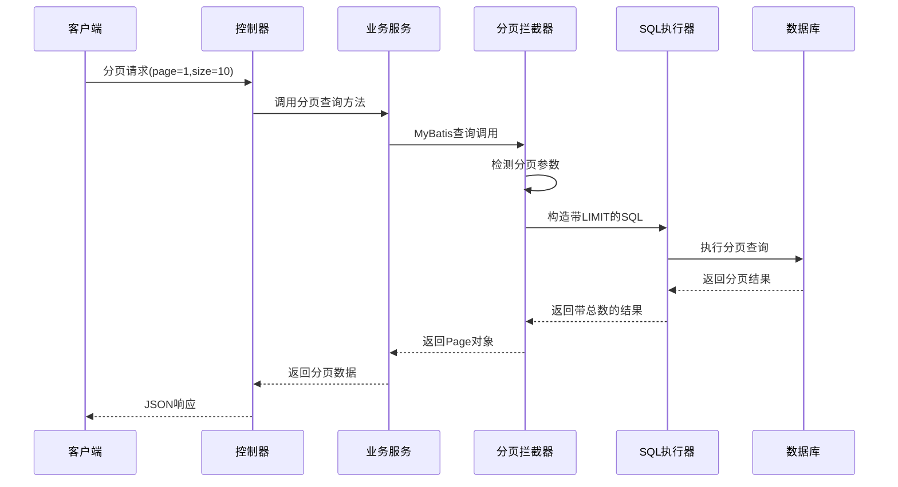
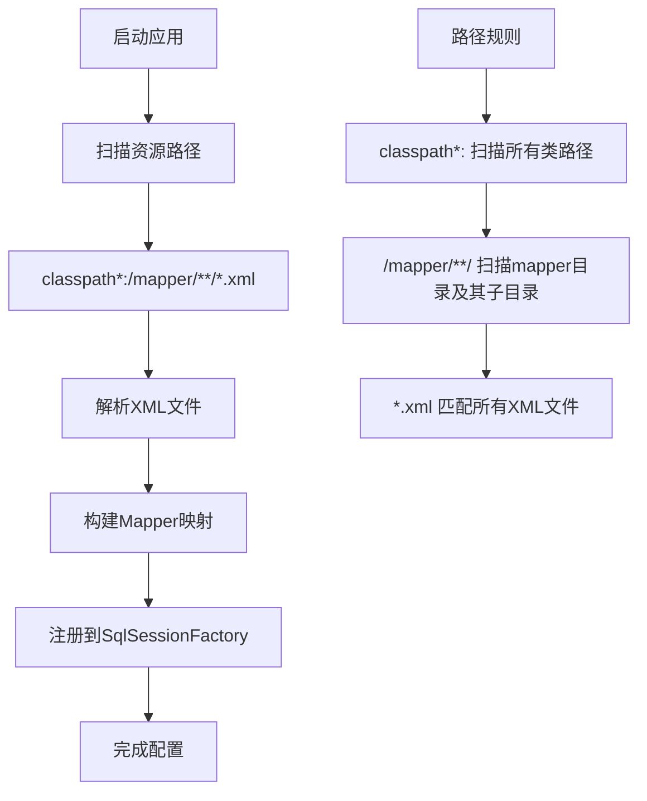
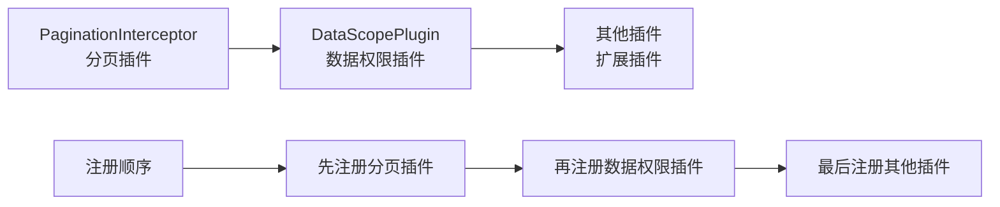
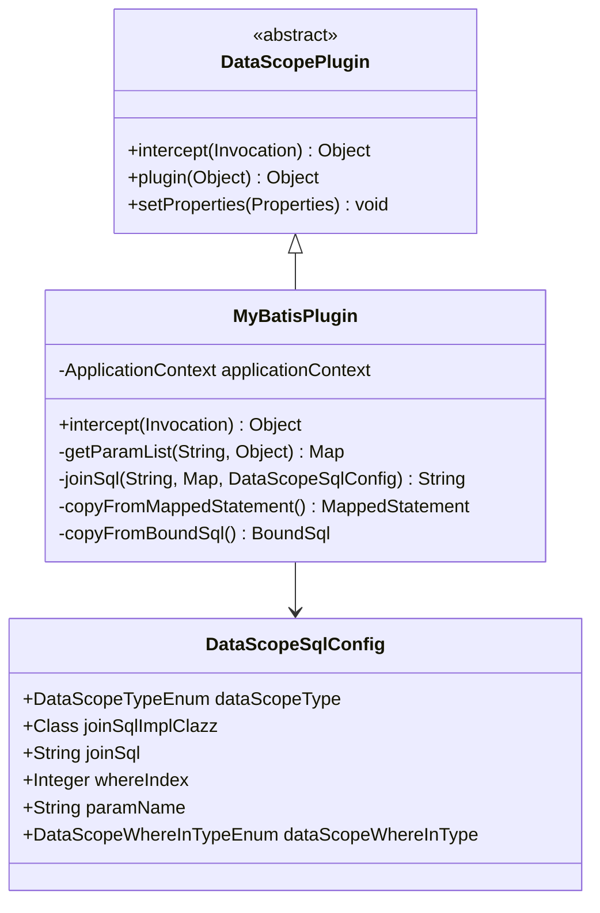
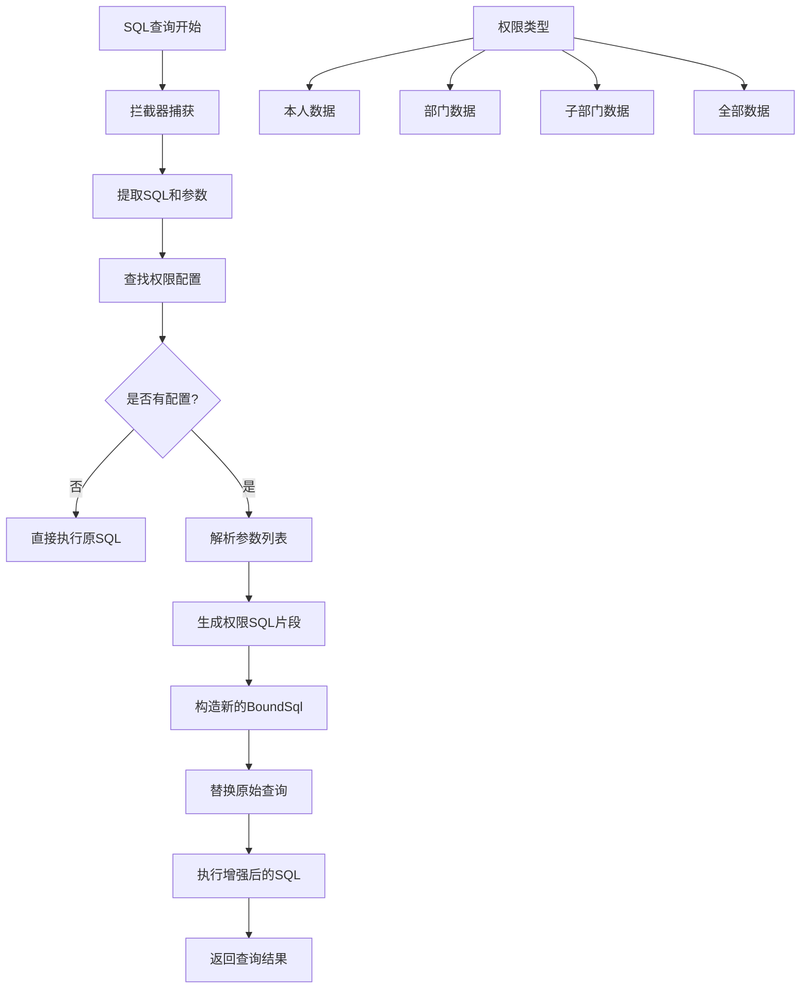
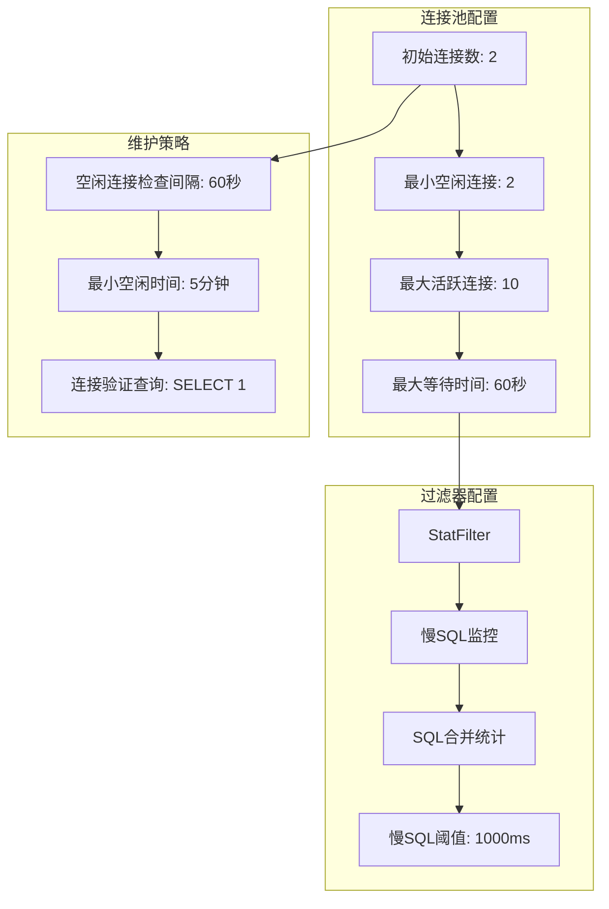
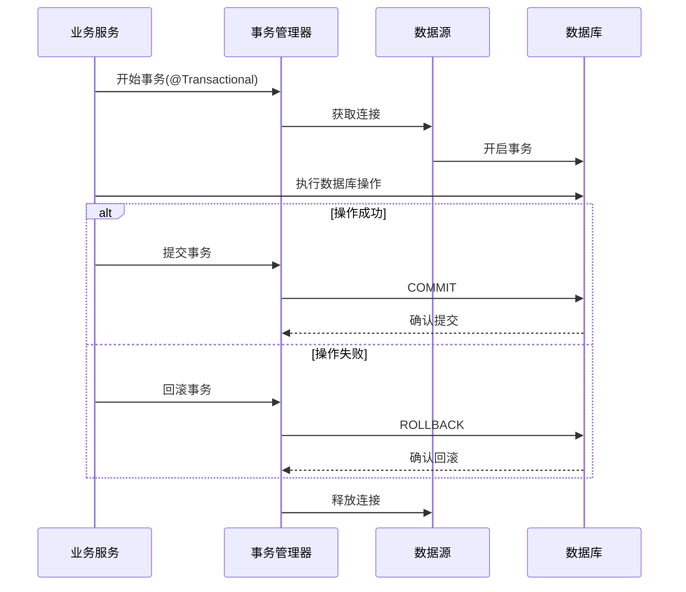

# ORM框架配置

<cite>
**本文档引用的文件**
- [MybatisPlusConfig.java](file://smart-admin-api-java17-springboot3/sa-base/src/main/java/net/lab1024/sa/base/config/MybatisPlusConfig.java)
- [DataSourceConfig.java](file://smart-admin-api-java17-springboot3/sa-base/src/main/java/net/lab1024/sa/base/config/DataSourceConfig.java)
- [DataScopePlugin.java](file://smart-admin-api-java17-springboot3/sa-base/src/main/java/net/lab1024/sa/base/common/domain/DataScopePlugin.java)
- [MyBatisPlugin.java](file://smart-admin-api-java17-springboot3/sa-admin/src/main/java/net/lab1024/sa/admin/module/system/datascope/MyBatisPlugin.java)
- [DataScopeTypeEnum.java](file://smart-admin-api-java17-springboot3/sa-admin/src/main/java/net/lab1024/sa/admin/module/system/datascope/constant/DataScopeTypeEnum.java)
- [DataScopeWhereInTypeEnum.java](file://smart-admin-api-java17-springboot3/sa-admin/src/main/java/net/lab1024/sa/admin/module/system/datascope/constant/DataScopeWhereInTypeEnum.java)
- [sa-base.yaml](file://smart-admin-api-java17-springboot3/sa-base/src/main/resources/dev/sa-base.yaml)
</cite>

## 目录
1. [概述](#概述)
2. [项目结构](#项目结构)
3. [MyBatis-Plus核心配置](#mybatis-plus核心配置)
4. [分页插件配置](#分页插件配置)
5. [数据源配置](#数据源配置)
6. [数据权限插件](#数据权限插件)
7. [连接池配置](#连接池配置)
8. [事务管理](#事务管理)
9. [性能监控](#性能监控)
10. [配置最佳实践](#配置最佳实践)

## 概述

本文档详细介绍Smart Admin项目中ORM框架的配置，重点围绕MyBatis-Plus的集成配置。该框架采用了Spring Boot + MyBatis-Plus + Druid的组合方案，提供了完整的数据库访问层解决方案，包括分页查询、数据权限控制、连接池管理和性能监控等功能。

## 项目结构

```mermaid
graph TB
subgraph "配置模块"
A[MybatisPlusConfig] --> B[分页插件配置]
C[DataSourceConfig] --> D[数据源配置]
E[连接池配置] --> F[Druid连接池]
G[事务管理] --> H[@EnableTransactionManagement]
end
subgraph "插件模块"
I[DataScopePlugin] --> J[数据权限插件]
K[MyBatisPlugin] --> L[SQL拦截器]
M[MybatisPlusInterceptor] --> N[拦截器链]
end
subgraph "监控模块"
O[DruidStatInterceptor] --> P[SQL监控]
Q[StatFilter] --> R[慢SQL日志]
S[性能监控] --> T[连接池监控]
end
A --> M
C --> M
I --> M
K --> I
C --> O
C --> Q
```

**图表来源**
- [MybatisPlusConfig.java](file://smart-admin-api-java17-springboot3/sa-base/src/main/java/net/lab1024/sa/base/config/MybatisPlusConfig.java#L19-L31)
- [DataSourceConfig.java](file://smart-admin-api-java17-springboot3/sa-base/src/main/java/net/lab1024/sa/base/config/DataSourceConfig.java#L47-L201)

## MyBatis-Plus核心配置

### 配置类架构

MyBatis-Plus的核心配置通过两个主要配置类实现：

1. **MybatisPlusConfig** - 提供基础的MyBatis-Plus插件配置
2. **DataSourceConfig** - 提供完整的数据源和MyBatis配置

### 核心特性

- **注解驱动**：使用`@EnableTransactionManagement`启用声明式事务管理
- **插件化设计**：支持多种内置插件和自定义插件
- **类型安全**：基于泛型的类型安全配置

**章节来源**
- [MybatisPlusConfig.java](file://smart-admin-api-java17-springboot3/sa-base/src/main/java/net/lab1024/sa/base/config/MybatisPlusConfig.java#L19-L31)
- [DataSourceConfig.java](file://smart-admin-api-java17-springboot3/sa-base/src/main/java/net/lab1024/sa/base/config/DataSourceConfig.java#L47-L201)

## 分页插件配置

### PaginationInnerInterceptor详解

分页插件是MyBatis-Plus最重要的功能之一，负责处理所有的分页查询请求。



**图表来源**
- [MybatisPlusConfig.java](file://smart-admin-api-java17-springboot3/sa-base/src/main/java/net/lab1024/sa/base/config/MybatisPlusConfig.java#L26-L30)

### 配置要点

1. **数据库类型指定**：明确指定`DbType.MYSQL`确保SQL语法正确
2. **拦截器注册**：通过`MybatisPlusInterceptor`统一管理
3. **自动适配**：支持多种数据库的分页语法转换

### 使用场景

- 列表查询分页
- 数据导出分批处理
- 大数据量查询优化
- 前端表格组件集成

**章节来源**
- [MybatisPlusConfig.java](file://smart-admin-api-java17-springboot3/sa-base/src/main/java/net/lab1024/sa/base/config/MybatisPlusConfig.java#L26-L30)

## 数据源配置

### Mapper扫描路径配置

数据源配置中的Mapper扫描路径采用通配符模式，确保所有XML映射文件都能被正确加载。



**图表来源**
- [DataSourceConfig.java](file://smart-admin-api-java17-springboot3/sa-base/src/main/java/net/lab1024/sa/base/config/DataSourceConfig.java#L138-L140)

### Mapper扫描规则

| 路径模式 | 说明 | 示例 |
|---------|------|------|
| `classpath*:` | 扫描所有类路径下的资源 |
| `/mapper/**/` | 递归扫描mapper目录及其子目录 |
| `*.xml` | 匹配所有XML格式的映射文件 |

### 插件注册顺序

数据源配置中对MyBatis插件的注册有严格的顺序要求：



**图表来源**
- [DataSourceConfig.java](file://smart-admin-api-java17-springboot3/sa-base/src/main/java/net/lab1024/sa/base/config/DataSourceConfig.java#L142-L148)

**章节来源**
- [DataSourceConfig.java](file://smart-admin-api-java17-springboot3/sa-base/src/main/java/net/lab1024/sa/base/config/DataSourceConfig.java#L138-L148)

## 数据权限插件

### DataScopePlugin架构

数据权限插件是Smart Admin的核心安全特性，通过拦截SQL查询实现动态的数据范围控制。



**图表来源**
- [DataScopePlugin.java](file://smart-admin-api-java17-springboot3/sa-base/src/main/java/net/lab1024/sa/base/common/domain/DataScopePlugin.java#L14-L15)
- [MyBatisPlugin.java](file://smart-admin-api-java17-springboot3/sa-admin/src/main/java/net/lab1024/sa/admin/module/system/datascope/MyBatisPlugin.java#L34-L59)

### 实现原理

数据权限插件的工作流程如下：



**图表来源**
- [MyBatisPlugin.java](file://smart-admin-api-java17-springboot3/sa-admin/src/main/java/net/lab1024/sa/admin/module/system/datascope/MyBatisPlugin.java#L40-L65)

### 数据范围类型

| 类型 | 值 | 说明 | 应用场景 |
|------|----|----- |----------|
| ME | 0 | 仅本人数据 | 员工个人资料查看 |
| DEPARTMENT | 1 | 本部门数据 | 部门内部数据查询 |
| DEPARTMENT_AND_SUB | 2 | 本部门及子部门数据 | 上级部门查看下级数据 |
| ALL | 10 | 全部数据 | 系统管理员权限 |

### WHERE条件插入位置

数据权限插件支持在SQL的不同位置插入WHERE条件：

- **ORDER BY之前**：优先级最高
- **GROUP BY之前**：次高优先级  
- **FROM之后**：作为WHERE条件
- **SQL末尾**：作为补充条件

**章节来源**
- [MyBatisPlugin.java](file://smart-admin-api-java17-springboot3/sa-admin/src/main/java/net/lab1024/sa/admin/module/system/datascope/MyBatisPlugin.java#L40-L121)
- [DataScopeTypeEnum.java](file://smart-admin-api-java17-springboot3/sa-admin/src/main/java/net/lab1024/sa/admin/module/system/datascope/constant/DataScopeTypeEnum.java#L14-L19)
- [DataScopeWhereInTypeEnum.java](file://smart-admin-api-java17-springboot3/sa-admin/src/main/java/net/lab1024/sa/admin/module/system/datascope/constant/DataScopeWhereInTypeEnum.java#L15-L30)

## 连接池配置

### Druid连接池特性

Smart Admin采用Druid作为连接池，提供高性能的数据库连接管理。



**图表来源**
- [DataSourceConfig.java](file://smart-admin-api-java17-springboot3/sa-base/src/main/java/net/lab1024/sa/base/config/DataSourceConfig.java#L103-L126)
- [sa-base.yaml](file://smart-admin-api-java17-springboot3/sa-base/src/main/resources/dev/sa-base.yaml#L4-L14)

### 关键配置参数

| 参数 | 默认值 | 说明 | 调优建议 |
|------|--------|------|----------|
| initial-size | 2 | 初始连接数 | 根据并发需求调整 |
| min-idle | 2 | 最小空闲连接 | 通常设为初始值 |
| max-active | 10 | 最大活跃连接 | 根据服务器性能设置 |
| max-wait | 60000ms | 最大等待时间 | 平衡响应时间和资源利用率 |
| time-between-eviction-runs-millis | 60000ms | 空闲检查间隔 | 保持合理频率 |
| min-evictable-idle-time-millis | 300000ms | 最小空闲时间 | 避免频繁创建销毁 |

### 性能优化策略

1. **连接复用**：通过连接池复用数据库连接
2. **健康检查**：定期验证连接有效性
3. **监控告警**：实时监控连接池状态
4. **动态调整**：根据负载动态调整参数

**章节来源**
- [DataSourceConfig.java](file://smart-admin-api-java17-springboot3/sa-base/src/main/java/net/lab1024/sa/base/config/DataSourceConfig.java#L103-L126)
- [sa-base.yaml](file://smart-admin-api-java17-springboot3/sa-base/src/main/resources/dev/sa-base.yaml#L4-L14)

## 事务管理

### @EnableTransactionManagement配置

事务管理通过Spring的声明式事务管理实现，无需手动管理事务边界。



**图表来源**
- [MybatisPlusConfig.java](file://smart-admin-api-java17-springboot3/sa-base/src/main/java/net/lab1024/sa/base/config/MybatisPlusConfig.java#L19)

### 事务传播行为

| 传播行为 | 说明 | 使用场景 |
|----------|------|----------|
| REQUIRED | 如果存在事务则加入，否则创建新事务 | 默认行为，适用于大多数业务方法 |
| REQUIRES_NEW | 总是创建新事务，暂停当前事务 | 需要独立事务的操作 |
| SUPPORTS | 如果存在事务则加入，否则非事务执行 | 查询操作 |
| NOT_SUPPORTED | 总是非事务执行，暂停当前事务 | 不需要事务的简单查询 |
| MANDATORY | 必须在事务中执行 | 强制事务依赖的场景 |
| NEVER | 必须非事务执行，否则抛异常 | 严格禁止事务的场景 |
| NESTED | 在嵌套事务中执行 | 子事务回滚不影响外层事务 |

### 事务隔离级别

| 隔离级别 | 说明 | 数据一致性保证 | 性能影响 |
|----------|------|----------------|----------|
| READ_UNCOMMITTED | 读未提交 | 最低，可能出现脏读 | 最高 |
| READ_COMMITTED | 读已提交 | 避免脏读 | 较高 |
| REPEATABLE_READ | 可重复读 | 避免脏读和不可重复读 | 中等 |
| SERIALIZABLE | 串行化 | 完全隔离 | 最低 |

**章节来源**
- [MybatisPlusConfig.java](file://smart-admin-api-java17-springboot3/sa-base/src/main/java/net/lab1024/sa/base/config/MybatisPlusConfig.java#L19)

## 性能监控

### Druid监控体系

Smart Admin集成了完整的Druid监控体系，提供全方位的性能监控和诊断能力。

```mermaid
graph TB
subgraph "监控入口"
A[Druid监控页面] --> B[/druid/*]
C[Web统计过滤器] --> D[/*]
end
subgraph "监控指标"
E[SQL执行统计] --> F[慢SQL监控]
F --> G[SQL执行时间]
G --> H[SQL执行次数]
H --> I[连接池状态]
end
subgraph "告警机制"
J[慢SQL阈值: 1000ms] --> K[日志记录]
K --> L[邮件通知]
L --> M[运维平台]
end
B --> E
D --> E
I --> J
```

**图表来源**
- [DataSourceConfig.java](file://smart-admin-api-java17-springboot3/sa-base/src/main/java/net/lab1024/sa/base/config/DataSourceConfig.java#L160-L174)
- [DataSourceConfig.java](file://smart-admin-api-java17-springboot3/sa-base/src/main/java/net/lab1024/sa/base/config/DataSourceConfig.java#L178-L183)

### 监控配置

| 监控项 | 配置参数 | 说明 | 默认值 |
|--------|----------|------|--------|
| 慢SQL阈值 | slowSqlMillis | 慢SQL判定时间(毫秒) | 1000ms |
| SQL合并 | mergeSql | 是否合并相似SQL | true |
| 慢SQL日志 | logSlowSql | 是否记录慢SQL日志 | true |
| 登录认证 | loginUsername/password | 监控页面访问凭证 | 可配置 |
| 重置功能 | resetEnable | 是否允许重置统计 | false |

### 性能分析

Druid提供了丰富的性能分析功能：

1. **SQL执行分析**：分析SQL执行时间和频率
2. **连接池监控**：实时监控连接池状态
3. **慢SQL识别**：自动识别和记录慢SQL
4. **资源使用统计**：统计各类资源使用情况

**章节来源**
- [DataSourceConfig.java](file://smart-admin-api-java17-springboot3/sa-base/src/main/java/net/lab1024/sa/base/config/DataSourceConfig.java#L118-L125)
- [DataSourceConfig.java](file://smart-admin-api-java17-springboot3/sa-base/src/main/java/net/lab1024/sa/base/config/DataSourceConfig.java#L160-L183)

## 配置最佳实践

### 开发环境配置

```yaml
# 开发环境推荐配置
spring:
  datasource:
    initial-size: 2          # 初始连接数
    min-idle: 2              # 最小空闲连接
    max-active: 10           # 最大活跃连接
    max-wait: 60000          # 最大等待时间
    time-between-eviction-runs-millis: 60000  # 空闲检查间隔
    min-evictable-idle-time-millis: 300000    # 最小空闲时间
    filters: stat            # 过滤器配置
    druid:
      username: druid        # 监控用户名
      password: 1024         # 监控密码
      login:
        enabled: true        # 启用监控登录
      method:
        pointcut: net.lab1024.sa..*Service.*  # AOP切点
```

### 生产环境配置

```yaml
# 生产环境推荐配置
spring:
  datasource:
    initial-size: 5          # 增加初始连接数
    min-idle: 5              # 增加最小空闲连接
    max-active: 20           # 增加最大连接数
    max-wait: 30000          # 减少等待时间
    time-between-eviction-runs-millis: 30000  # 增加检查频率
    min-evictable-idle-time-millis: 180000    # 减少空闲时间
    filters: stat,wall       # 启用防火墙过滤器
    druid:
      username: druid
      password: production_password
      login:
        enabled: false         # 生产环境禁用监控登录
      method:
        pointcut: net.lab1024.sa..*Service.*  # AOP切点
```

### 性能调优建议

1. **连接池参数调优**
   - 根据并发量调整初始连接数和最大连接数
   - 设置合理的超时时间和空闲检查间隔
   - 启用连接验证查询确保连接有效性

2. **SQL性能优化**
   - 合理使用索引避免全表扫描
   - 避免复杂的嵌套查询
   - 定期分析和优化慢SQL

3. **监控和告警**
   - 设置合理的慢SQL阈值
   - 启用连接池监控和告警
   - 定期分析监控数据进行优化

4. **安全考虑**
   - 生产环境禁用Druid监控登录
   - 设置强密码保护数据库连接
   - 启用SQL防火墙防止注入攻击

### 故障排查指南

当遇到ORM框架相关问题时，可以按照以下步骤进行排查：

1. **检查连接池状态**
   - 访问Druid监控页面查看连接池状态
   - 检查是否有连接泄漏
   - 监控慢SQL执行情况

2. **验证分页功能**
   - 确认PaginationInnerInterceptor正确配置
   - 检查分页参数传递是否正确
   - 验证SQL语句是否包含LIMIT关键字

3. **排查数据权限问题**
   - 检查DataScopePlugin是否正确注册
   - 验证权限配置是否正确
   - 查看SQL执行日志确认权限条件是否正确添加

4. **性能问题诊断**
   - 分析慢SQL日志找出性能瓶颈
   - 检查连接池配置是否合理
   - 监控数据库连接使用情况

通过以上配置和最佳实践，Smart Admin的ORM框架能够提供稳定、高效、安全的数据库访问能力，满足企业级应用的需求。