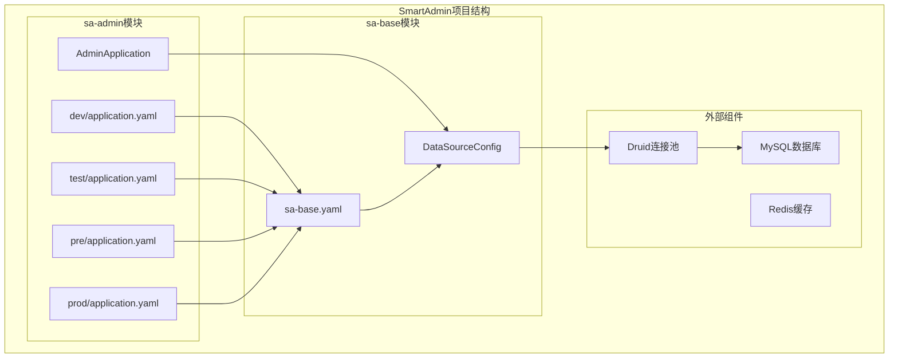
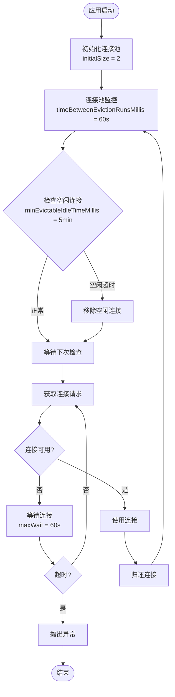
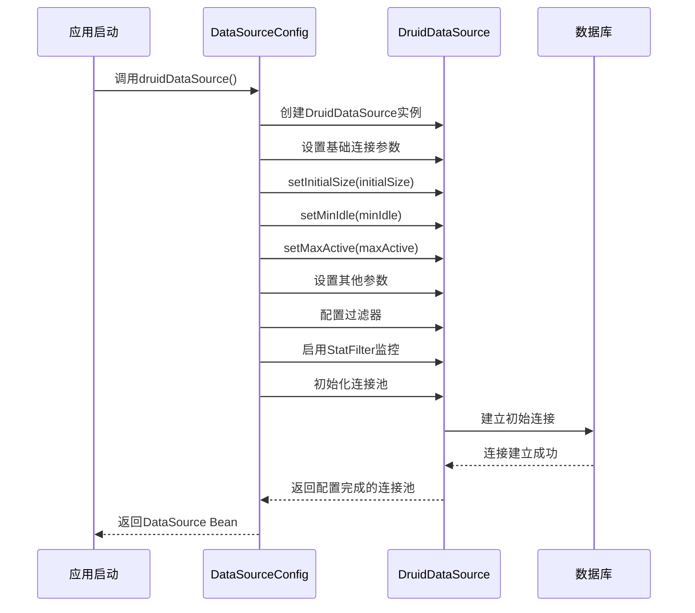
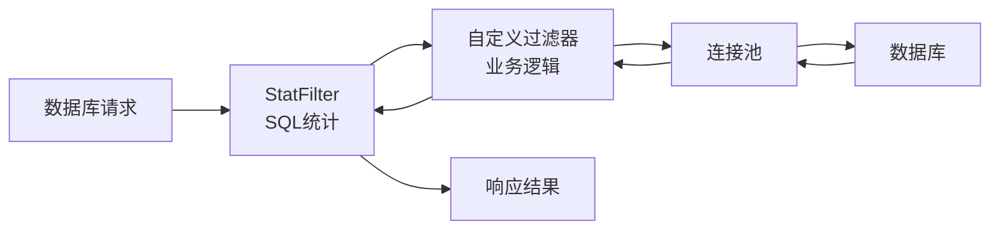
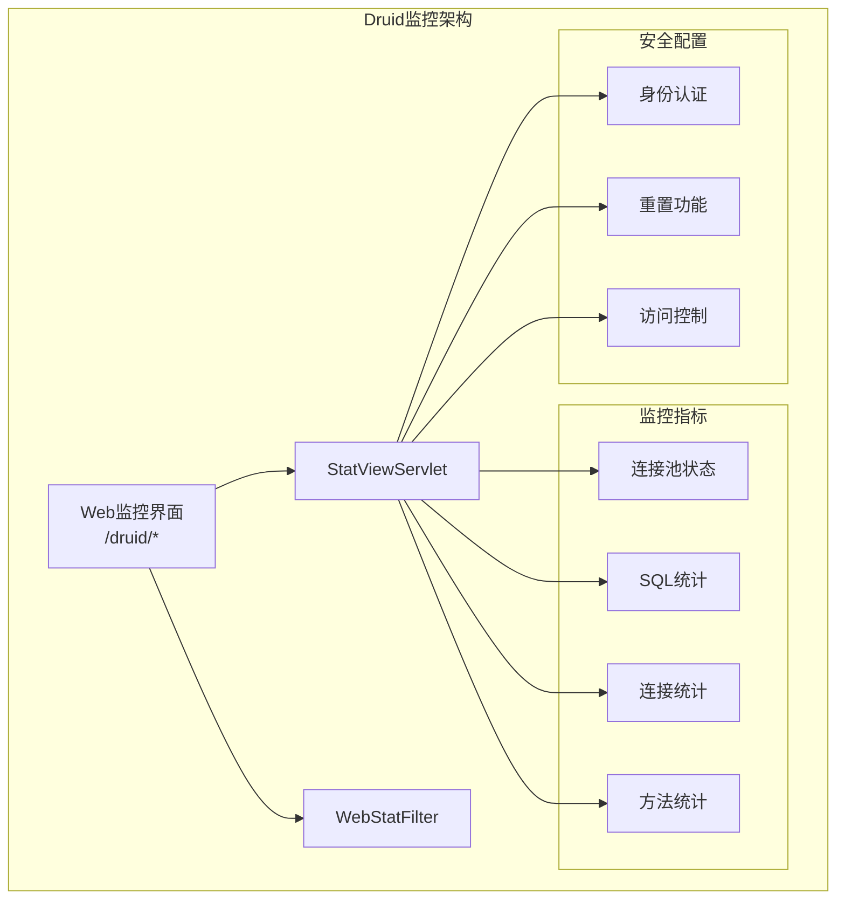
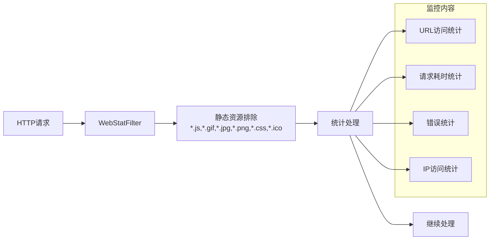
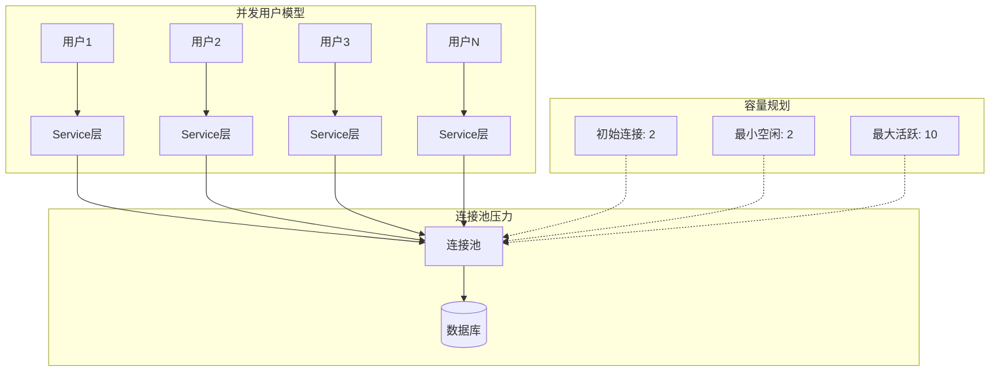

# 数据源与连接池配置

<cite>
**本文档引用的文件**
- [DataSourceConfig.java](file://smart-admin-api-java17-springboot3/sa-base/src/main/java/net/lab1024/sa/base/config/DataSourceConfig.java)
- [sa-base.yaml](file://smart-admin-api-java17-springboot3/sa-base/src/main/resources/dev/sa-base.yaml)
- [pom.xml](file://smart-admin-api-java17-springboot3/pom.xml)
- [sa-base/pom.xml](file://smart-admin-api-java17-springboot3/sa-base/pom.xml)
</cite>

## 目录
1. [概述](#概述)
2. [项目架构](#项目架构)
3. [Druid连接池核心配置](#druid连接池核心配置)
4. [DataSourceConfig类详解](#datasourceconfig类详解)
5. [应用配置文件解析](#应用配置文件解析)
6. [连接池监控配置](#连接池监控配置)
7. [性能调优策略](#性能调优策略)
8. [不同环境配置建议](#不同环境配置建议)
9. [故障排除指南](#故障排除指南)
10. [最佳实践](#最佳实践)

## 概述

SmartAdmin项目采用Spring Boot 3.5.4和Java 17构建，集成了阿里巴巴Druid连接池作为主要的数据源管理解决方案。该配置方案提供了高性能、可监控、可扩展的数据库连接管理能力，支持多种监控和调试功能。

### 技术栈概览

- **Spring Boot**: 3.5.4版本，提供现代化的Spring应用开发框架
- **Java**: 17版本，充分利用JDK 17的新特性
- **Druid**: 1.2.25版本，企业级数据库连接池
- **MySQL**: 支持MySQL数据库连接
- **MyBatis Plus**: ORM框架，提供强大的数据库操作能力

## 项目架构



**图表来源**
- [DataSourceConfig.java](file://smart-admin-api-java17-springboot3/sa-base/src/main/java/net/lab1024/sa/base/config/DataSourceConfig.java#L1-L202)
- [sa-base.yaml](file://smart-admin-api-java17-springboot3/sa-base/src/main/resources/dev/sa-base.yaml#L1-L187)

## Druid连接池核心配置

### 核心参数配置表

| 参数名称 | 类型 | 默认值 | 描述 | 优化建议 |
|---------|------|--------|------|----------|
| initialSize | int | 2 | 初始连接数 | 根据启动时并发需求设置 |
| minIdle | int | 2 | 最小空闲连接数 | 通常设置为initialSize的1-2倍 |
| maxActive | int | 10 | 最大活跃连接数 | 根据系统并发能力和数据库性能设置 |
| maxWait | long | 60000ms | 获取连接的最大等待时间 | 根据业务响应时间要求设置 |
| timeBetweenEvictionRunsMillis | long | 60000ms | 连接回收线程运行间隔 | 保持默认值即可 |
| minEvictableIdleTimeMillis | long | 300000ms | 连接空闲最小时间 | 根据连接复用需求调整 |

### 连接池生命周期管理



**节来源**
- [DataSourceConfig.java](file://smart-admin-api-java17-springboot3/sa-base/src/main/java/net/lab1024/sa/base/config/DataSourceConfig.java#L102-L131)

## DataSourceConfig类详解

### druidDataSource()方法深度解析

DataSourceConfig类中的druidDataSource()方法是整个连接池配置的核心，负责创建和初始化Druid连接池实例。

#### 方法执行流程



**图表来源**
- [DataSourceConfig.java](file://smart-admin-api-java17-springboot3/sa-base/src/main/java/net/lab1024/sa/base/config/DataSourceConfig.java#L102-L131)

#### 关键配置参数详解

1. **基础连接参数**
   - `setDbType(DbType.MYSQL.getDb())`: 设置数据库类型为MySQL
   - `setDriverClassName(driver)`: 设置MySQL驱动类名
   - `setUrl(url)`: 设置数据库连接URL
   - `setUsername(username)`: 设置数据库用户名
   - `setPassword(password)`: 设置数据库密码

2. **连接池容量控制**
   - `setInitialSize(initialSize)`: 初始化连接数，影响应用启动速度
   - `setMinIdle(minIdle)`: 最小空闲连接数，保证基本并发需求
   - `setMaxActive(maxActive)`: 最大活跃连接数，防止资源耗尽

3. **连接等待和回收策略**
   - `setMaxWait(maxWait)`: 获取连接的最大等待时间
   - `setTimeBetweenEvictionRunsMillis(timeBetweenEvictionRunsMillis)`: 连接回收检查间隔
   - `setMinEvictableIdleTimeMillis(minEvictableIdleTimeMillis)`: 连接最小空闲时间

4. **健康检查配置**
   - `setValidationQuery("SELECT 1")`: 设置连接有效性验证查询

**节来源**
- [DataSourceConfig.java](file://smart-admin-api-java17-springboot3/sa-base/src/main/java/net/lab1024/sa/base/config/DataSourceConfig.java#L102-L131)

### 过滤器配置机制

Druid连接池支持多种过滤器，用于增强连接池的功能：

#### StatFilter配置
- `setMergeSql(true)`: 合并相似SQL语句，减少监控数据量
- `setSlowSqlMillis(1000)`: 慢SQL阈值，1秒
- `setLogSlowSql(true)`: 启用慢SQL日志记录

#### 自定义过滤器链


**节来源**
- [DataSourceConfig.java](file://smart-admin-api-java17-springboot3/sa-base/src/main/java/net/lab1024/sa/base/config/DataSourceConfig.java#L116-L126)

## 应用配置文件解析

### sa-base.yaml配置详解

基于开发环境的配置，以下是关键的数据库连接池配置项：

#### 基础连接配置
```yaml
spring:
  datasource:
    url: jdbc:p6spy:mysql://192.168.10.110:33060/smart_admin_v3?...
    username: root
    password: 
    driver-class-name: com.p6spy.engine.spy.P6SpyDriver
```

#### 连接池参数配置
```yaml
    initial-size: 2
    min-idle: 2
    max-active: 10
    max-wait: 60000
    time-between-eviction-runs-millis: 60000
    min-evictable-idle-time-millis: 300000
```

#### Druid监控配置
```yaml
    filters: stat
    druid:
      username: druid
      password: 1024
      login:
        enabled: false
      method:
        pointcut: net.lab1024.sa..*Service.*
```

### 配置参数说明表

| 配置项 | 值 | 说明 | 性能影响 |
|--------|-----|------|----------|
| initial-size | 2 | 应用启动时创建的连接数 | 影响启动时间 |
| min-idle | 2 | 最小空闲连接数 | 影响并发启动能力 |
| max-active | 10 | 最大活跃连接数 | 影响系统承载能力 |
| max-wait | 60000ms | 获取连接超时时间 | 影响用户体验 |
| time-between-eviction-runs-millis | 60000ms | 连接检查间隔 | 影响资源回收效率 |
| min-evictable-idle-time-millis | 300000ms | 连接最小空闲时间 | 影响连接复用率 |

**节来源**
- [sa-base.yaml](file://smart-admin-api-java17-springboot3/sa-base/src/main/resources/dev/sa-base.yaml#L1-L187)

## 连接池监控配置

### StatViewServlet监控面板

Druid提供了强大的Web监控界面，通过StatViewServlet暴露管理功能。

#### 监控面板配置



**图表来源**
- [DataSourceConfig.java](file://smart-admin-api-java17-springboot3/sa-base/src/main/java/net/lab1024/sa/base/config/DataSourceConfig.java#L161-L175)

#### 监控配置详解

1. **Servlet注册配置**
   - URL映射: `/druid/*`
   - 初始化参数:
     - `loginUsername`: 监控用户名（可选）
     - `loginPassword`: 监控密码（可选）
     - `resetEnable`: 是否允许重置统计数据（默认false）

2. **访问控制策略**
   - 生产环境建议启用用户名密码认证
   - 开发环境可根据需要禁用认证
   - 限制访问IP范围提高安全性

**节来源**
- [DataSourceConfig.java](file://smart-admin-api-java17-springboot3/sa-base/src/main/java/net/lab1024/sa/base/config/DataSourceConfig.java#L161-L175)

### WebStatFilter请求监控

WebStatFilter提供HTTP请求级别的监控功能。

#### 过滤器配置特点



**图表来源**
- [DataSourceConfig.java](file://smart-admin-api-java17-springboot3/sa-base/src/main/java/net/lab1024/sa/base/config/DataSourceConfig.java#L177-L184)

#### 排除规则配置
- 静态资源: `*.js,*.gif,*.jpg,*.png,*.css,*.ico`
- 图片文件: `*.ico`
- 特殊路径: `/*`（排除根路径）

**节来源**
- [DataSourceConfig.java](file://smart-admin-api-java17-springboot3/sa-base/src/main/java/net/lab1024/sa/base/config/DataSourceConfig.java#L177-L184)

### 方法级别监控

通过DruidStatInterceptor实现方法级别的SQL执行监控。

#### 监控切点配置
- 切点表达式: `net.lab1024.sa..*Service.*`
- 监控范围: 所有Service层方法
- 监控粒度: 方法级别的SQL执行统计

**节来源**
- [DataSourceConfig.java](file://smart-admin-api-java17-springboot3/sa-base/src/main/java/net/lab1024/sa/base/config/DataSourceConfig.java#L186-L200)

## 性能调优策略

### 连接池容量优化

#### 并发模型分析



#### 容量配置建议

| 场景类型 | 初始连接 | 最小空闲 | 最大活跃 | 说明 |
|----------|----------|----------|----------|------|
| 小型应用 | 5 | 5 | 20 | 适合小型团队应用 |
| 中型应用 | 10 | 10 | 50 | 适合中等规模业务 |
| 大型应用 | 20 | 20 | 100+ | 适合高并发场景 |
| 测试环境 | 2 | 2 | 10 | 快速启动，节省资源 |

### 性能监控指标

#### 关键性能指标(KPI)

1. **连接池利用率**
   - 计算公式: `(活跃连接数 / 最大连接数) * 100%`
   - 目标值: 60-80%

2. **连接获取成功率**
   - 计算公式: `成功获取连接次数 / 总获取请求次数`
   - 目标值: >99%

3. **平均连接等待时间**
   - 目标值: <100ms

4. **连接泄漏检测**
   - 监控长时间未释放的连接
   - 建议设置连接超时时间

### 内存优化策略

#### JVM参数建议

```bash
-Xms2g -Xmx2g
-XX:+UseG1GC
-XX:MaxGCPauseMillis=200
-XX:G1HeapRegionSize=16m
```

#### 连接池内存计算

```
连接池内存 = (连接数 × 连接对象大小) + (过滤器内存占用)
典型值: 100连接 × 10KB ≈ 1MB/连接 = 1GB
```

## 不同环境配置建议

### 开发环境配置

开发环境注重调试便利性和快速启动：

```yaml
spring:
  datasource:
    initial-size: 2
    min-idle: 2
    max-active: 10
    max-wait: 30000
    druid:
      login:
        enabled: true
      filters: stat,wall,slf4j
```

### 测试环境配置

测试环境模拟生产环境，但可以适当放宽限制：

```yaml
spring:
  datasource:
    initial-size: 5
    min-idle: 5
    max-active: 20
    max-wait: 60000
    time-between-eviction-runs-millis: 30000
    min-evictable-idle-time-millis: 180000
```

### 生产环境配置

生产环境追求稳定性和性能：

```yaml
spring:
  datasource:
    initial-size: 10
    min-idle: 10
    max-active: 50
    max-wait: 30000
    time-between-eviction-runs-millis: 60000
    min-evictable-idle-time-millis: 300000
    filters: stat,wall
    druid:
      login:
        enabled: true
      username: admin
      password: secure_password
```

### 配置对比表

| 环境 | 初始连接 | 最小空闲 | 最大活跃 | 超时时间 | 监控级别 |
|------|----------|----------|----------|----------|----------|
| 开发 | 2 | 2 | 10 | 30s | 完整 |
| 测试 | 5 | 5 | 20 | 60s | 完整 |
| 预发 | 10 | 10 | 30 | 30s | 完整 |
| 生产 | 10 | 10 | 50 | 30s | 基础 |

## 故障排除指南

### 常见问题诊断

#### 连接池耗尽问题

**症状**: 应用启动缓慢，出现连接超时异常

**诊断步骤**:
1. 检查连接池监控面板
2. 查看活跃连接数是否接近maxActive
3. 分析慢SQL日志
4. 检查连接泄漏情况

**解决方案**:
```yaml
spring:
  datasource:
    max-active: 20  # 增加最大连接数
    max-wait: 10000  # 减少等待时间
    filters: stat,wall  # 启用防火墙过滤
```

#### 连接泄漏问题

**症状**: 连接池中的连接无法释放，最终耗尽

**诊断方法**:
1. 启用连接泄漏检测
2. 查看连接持有时间分布
3. 检查代码中是否正确关闭资源

**解决方案**:
```java
// 确保在finally块中关闭资源
try (Connection conn = dataSource.getConnection();
     PreparedStatement stmt = conn.prepareStatement(sql)) {
    // 执行SQL
} // 自动关闭资源
```

#### 性能瓶颈识别

**监控指标**:
- 连接获取平均时间 > 100ms
- 连接池利用率 > 80%
- 慢SQL数量过多

**优化策略**:
1. 优化SQL查询
2. 增加连接池容量
3. 调整连接回收策略

### 监控告警配置

#### 关键告警指标

```yaml
# 监控告警配置示例
management:
  endpoints:
    web:
      exposure:
        include: health,metrics,prometheus
  metrics:
    export:
      prometheus:
        enabled: true
```

#### 告警阈值建议

| 指标 | 警告阈值 | 严重阈值 | 处理建议 |
|------|----------|----------|----------|
| 连接池利用率 | >70% | >90% | 增加连接数或优化SQL |
| 平均响应时间 | >500ms | >1000ms | 检查慢SQL和网络 |
| 错误率 | >1% | >5% | 检查数据库连接和业务逻辑 |

## 最佳实践

### 配置管理最佳实践

#### 1. 环境隔离原则
- 开发环境: 快速启动，完整监控
- 测试环境: 模拟生产，适度限制
- 生产环境: 稳定可靠，性能优先

#### 2. 渐进式配置策略
```yaml
# 基础配置
spring:
  datasource:
    initial-size: 5
    min-idle: 5
    max-active: 20

# 性能调优
spring:
  datasource:
    max-wait: 30000
    time-between-eviction-runs-millis: 60000

# 监控增强
spring:
  datasource:
    filters: stat,wall,slf4j
```

#### 3. 安全配置要点
```yaml
spring:
  datasource:
    druid:
      login:
        enabled: true  # 生产环境必须启用
      username: ${DRUID_USERNAME:admin}
      password: ${DRUID_PASSWORD:}
```

### 运维监控最佳实践

#### 1. 监控面板访问控制
- 生产环境必须启用用户名密码
- 限制访问IP范围
- 定期更换监控密码

#### 2. 日志分析策略
```bash
# SQL执行日志分析
grep "slow sql" application.log | awk '{print $NF}' | sort | uniq -c | sort -nr

# 连接池状态监控
curl -s http://localhost:8080/druid/index.html | grep "Active"
```

#### 3. 性能基线建立
- 建立正常运行时的性能基线
- 定期对比当前性能指标
- 及时发现性能退化

### 代码集成最佳实践

#### 1. 事务管理
```java
@Service
public class UserService {
    
    @Autowired
    private DataSource dataSource;
    
    @Transactional
    public void createUser(User user) {
        // 业务逻辑
        // 连接自动管理
    }
}
```

#### 2. 资源管理
```java
@Repository
public class UserRepository {
    
    @Autowired
    private DataSource dataSource;
    
    public User findById(Long id) {
        String sql = "SELECT * FROM users WHERE id = ?";
        try (Connection conn = dataSource.getConnection();
             PreparedStatement stmt = conn.prepareStatement(sql)) {
            stmt.setLong(1, id);
            try (ResultSet rs = stmt.executeQuery()) {
                if (rs.next()) {
                    return extractUser(rs);
                }
            }
        } catch (SQLException e) {
            throw new RuntimeException(e);
        }
        return null;
    }
}
```

### 扩展性设计

#### 1. 多数据源支持
```java
@Configuration
public class MultiDataSourceConfig {
    
    @Bean
    public DataSource masterDataSource() {
        // 主数据源配置
    }
    
    @Bean
    public DataSource slaveDataSource() {
        // 从数据源配置
    }
}
```

#### 2. 动态配置更新
```java
@Component
public class DataSourceConfigUpdater {
    
    @EventListener
    public void handleConfigChanged(ConfigChangedEvent event) {
        if ("spring.datasource".equals(event.getPropertyName())) {
            updateDataSourceConfig();
        }
    }
}
```

通过遵循这些最佳实践，可以确保SmartAdmin项目的数据库连接池配置既高效又稳定，为应用提供可靠的数据库访问能力。