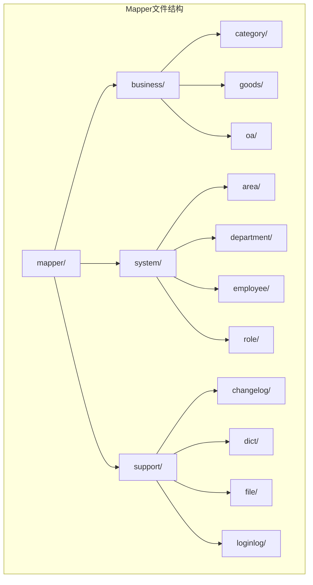
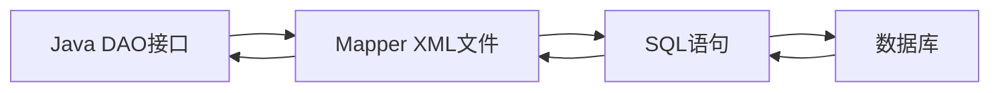
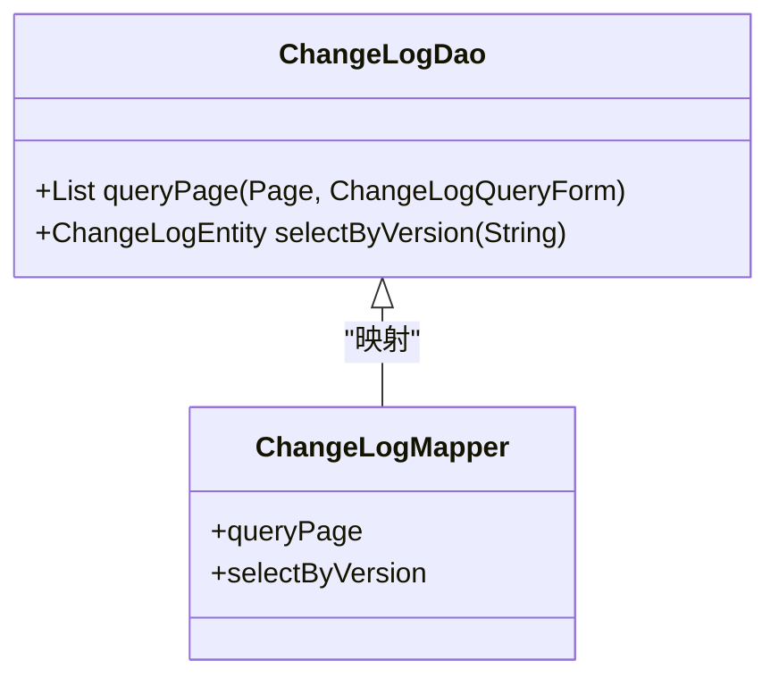
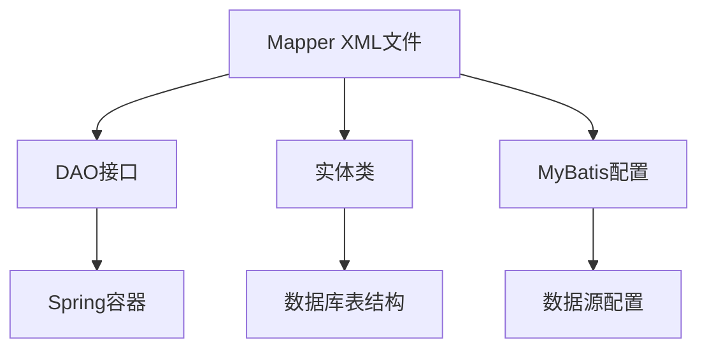

# XML映射文件结构

<cite>
**本文档引用的文件**
- [ChangeLogMapper.xml](file://smart-admin-api-java17-springboot3\sa-base\src\main\resources\mapper\support\ChangeLogMapper.xml)
- [DictMapper.xml](file://smart-admin-api-java17-springboot3\sa-base\src\main\resources\mapper\support\DictMapper.xml)
- [FileMapper.xml](file://smart-admin-api-java17-springboot3\sa-base\src\main\resources\mapper\support\FileMapper.xml)
- [LoginLogMapper.xml](file://smart-admin-api-java17-springboot3\sa-base\src\main\resources\mapper\support\LoginLogMapper.xml)
- [EnterpriseMapper.xml](file://smart-admin-api-java17-springboot3\sa-admin\src\main\resources\mapper\business\oa\enterprise\EnterpriseMapper.xml)
- [EmployeeMapper.xml](file://smart-admin-api-java17-springboot3\sa-admin\src\main\resources\mapper\system\employee\EmployeeMapper.xml)
- [RoleMapper.xml](file://smart-admin-api-java17-springboot3\sa-admin\src\main\resources\mapper\system\role\RoleMapper.xml)
- [ConfigMapper.xml](file://smart-admin-api-java17-springboot3\sa-base\src\main\resources\mapper\support\ConfigMapper.xml)
- [AreaMapper.xml](file://smart-admin-api-java17-springboot3\sa-admin\src\main\resources\mapper\system\area\AreaMapper.xml)
- [ChangeLogDao.java](file://smart-admin-api-java17-springboot3\sa-base\src\main\java\net\lab1024\sa\base\module\support\changelog\dao\ChangeLogDao.java)
- [ConfigDao.java](file://smart-admin-api-java17-springboot3\sa-base\src\main\java\net\lab1024\sa\base\module\support\config\ConfigDao.java)
- [DataSourceConfig.java](file://smart-admin-api-java17-springboot3\sa-base\src\main\java\net\lab1024\sa\base\config\DataSourceConfig.java)
- [MyBatisPlugin.java](file://smart-admin-api-java17-springboot3\sa-admin\src\main\java\net\lab1024\sa\admin\module\system\datascope\MyBatisPlugin.java)
- [DataScopeSqlConfigService.java](file://smart-admin-api-java17-springboot3\sa-admin\src\main\java\net\lab1024\sa\admin\module\system\datascope\service\DataScopeSqlConfigService.java)
- [application.yaml](file://smart-admin-api-java17-springboot3\sa-admin\src\main\resources\dev\application.yaml)
- [sa-base.yaml](file://smart-admin-api-java17-springboot3\sa-base\src\main\resources\dev\sa-base.yaml)
</cite>

## 目录
1. [简介](#简介)
2. [项目结构](#项目结构)
3. [核心组件](#核心组件)
4. [架构概述](#架构概述)
5. [详细组件分析](#详细组件分析)
6. [依赖分析](#依赖分析)
7. [性能考虑](#性能考虑)
8. [故障排除指南](#故障排除指南)
9. [结论](#结论)

## 简介

本文档详细介绍了MyBatis Mapper.xml文件的标准结构，重点说明了mapper根元素的namespace属性配置规则，以及不同SQL元素的使用场景和属性配置。文档还展示了SQL映射文件与Java DAO接口的方法对应关系，并提供了标准的XML文件模板和大型项目的Mapper文件目录结构组织方法。

## 项目结构

本项目采用模块化的目录结构，将Mapper XML文件按照业务模块进行组织。Mapper文件存储在`resources/mapper`目录下，根据功能划分为不同的子目录，如`business`、`system`和`support`等。



**图示来源**
- [ChangeLogMapper.xml](file://smart-admin-api-java17-springboot3\sa-base\src\main\resources\mapper\support\ChangeLogMapper.xml)
- [EnterpriseMapper.xml](file://smart-admin-api-java17-springboot3\sa-admin\src\main\resources\mapper\business\oa\enterprise\EnterpriseMapper.xml)
- [EmployeeMapper.xml](file://smart-admin-api-java17-springboot3\sa-admin\src\main\resources\mapper\system\employee\EmployeeMapper.xml)

**章节来源**
- [ChangeLogMapper.xml](file://smart-admin-api-java17-springboot3\sa-base\src\main\resources\mapper\support\ChangeLogMapper.xml)
- [EnterpriseMapper.xml](file://smart-admin-api-java17-springboot3\sa-admin\src\main\resources\mapper\business\oa\enterprise\EnterpriseMapper.xml)

## 核心组件

MyBatis Mapper.xml文件是Java应用程序与数据库之间的桥梁，它定义了SQL语句与Java方法之间的映射关系。核心组件包括mapper根元素、SQL元素（select、insert、update、delete）以及resultMap等。

**章节来源**
- [ChangeLogMapper.xml](file://smart-admin-api-java17-springboot3\sa-base\src\main\resources\mapper\support\ChangeLogMapper.xml)
- [DictMapper.xml](file://smart-admin-api-java17-springboot3\sa-base\src\main\resources\mapper\support\DictMapper.xml)

## 架构概述

MyBatis框架通过Mapper.xml文件将Java接口方法与SQL语句关联起来，实现了数据访问层的解耦。应用程序通过DAO接口调用数据库操作，MyBatis根据namespace和id找到对应的SQL语句并执行。



**图示来源**
- [ChangeLogDao.java](file://smart-admin-api-java17-springboot3\sa-base\src\main\java\net\lab1024\sa\base\module\support\changelog\dao\ChangeLogDao.java)
- [ChangeLogMapper.xml](file://smart-admin-api-java17-springboot3\sa-base\src\main\resources\mapper\support\ChangeLogMapper.xml)

## 详细组件分析

### Mapper根元素分析

Mapper.xml文件的根元素是`<mapper>`，其namespace属性必须与对应的DAO接口完全匹配。namespace的值通常是DAO接口的全限定名，这样MyBatis才能将接口方法与XML中的SQL语句正确关联。

```xml
<mapper namespace="net.lab1024.sa.base.module.support.changelog.dao.ChangeLogDao">
```

在Java代码中，对应的DAO接口使用@Mapper注解进行标记：

```java
@Mapper
public interface ChangeLogDao extends BaseMapper<ChangeLogEntity> {
    List<ChangeLogVO> queryPage(Page page, @Param("queryForm") ChangeLogQueryForm queryForm);
    ChangeLogEntity selectByVersion(@Param("version") String version);
}
```

**图示来源**
- [ChangeLogMapper.xml](file://smart-admin-api-java17-springboot3\sa-base\src\main\resources\mapper\support\ChangeLogMapper.xml)
- [ChangeLogDao.java](file://smart-admin-api-java17-springboot3\sa-base\src\main\java\net\lab1024\sa\base\module\support\changelog\dao\ChangeLogDao.java)

**章节来源**
- [ChangeLogMapper.xml](file://smart-admin-api-java17-springboot3\sa-base\src\main\resources\mapper\support\ChangeLogMapper.xml)
- [ChangeLogDao.java](file://smart-admin-api-java17-springboot3\sa-base\src\main\java\net\lab1024\sa\base\module\support\changelog\dao\ChangeLogDao.java)

### SQL元素分析

#### Select元素

`<select>`元素用于定义查询SQL语句，常用的属性包括id、resultType和parameterType。

```xml
<select id="queryPage" resultType="net.lab1024.sa.base.module.support.changelog.domain.vo.ChangeLogVO">
    SELECT * FROM t_change_log
    <where>
        <if test="queryForm.type != null">
            AND t_change_log.type = #{queryForm.type}
        </if>
    </where>
    order by t_change_log.update_version desc
</select>
```

- **id**: 必须与DAO接口中的方法名完全一致
- **resultType**: 指定查询结果的返回类型
- **parameterType**: 指定输入参数的类型（可选，MyBatis通常能自动推断）

#### Insert、Update、Delete元素

这些元素用于定义数据修改操作，语法结构与select类似：

```xml
<update id="deleteEnterprise">
    UPDATE t_oa_enterprise
    SET deleted_flag = #{deletedFlag}
    WHERE enterprise_id = #{enterpriseId}
</update>
```

**章节来源**
- [ChangeLogMapper.xml](file://smart-admin-api-java17-springboot3\sa-base\src\main\resources\mapper\support\ChangeLogMapper.xml)
- [EnterpriseMapper.xml](file://smart-admin-api-java17-springboot3\sa-admin\src\main\resources\mapper\business\oa\enterprise\EnterpriseMapper.xml)

### SQL与Java方法对应关系

Mapper XML文件中的SQL语句通过namespace和id与Java DAO接口的方法建立对应关系。这种映射关系要求命名必须完全一致。



**图示来源**
- [ChangeLogDao.java](file://smart-admin-api-java17-springboot3\sa-base\src\main\java\net\lab1024\sa\base\module\support\changelog\dao\ChangeLogDao.java)
- [ChangeLogMapper.xml](file://smart-admin-api-java17-springboot3\sa-base\src\main\resources\mapper\support\ChangeLogMapper.xml)

**章节来源**
- [ChangeLogDao.java](file://smart-admin-api-java17-springboot3\sa-base\src\main\java\net\lab1024\sa\base\module\support\changelog\dao\ChangeLogDao.java)

### 标准XML文件模板

一个标准的MyBatis Mapper.xml文件应包含以下基本结构：

```xml
<?xml version="1.0" encoding="UTF-8"?>
<!DOCTYPE mapper PUBLIC "-//mybatis.org//DTD Mapper 3.0//EN" "http://mybatis.org/dtd/mybatis-3-mapper.dtd">
<mapper namespace="com.example.dao.YourDaoInterface">
    
    <!-- 结果映射 -->
    <resultMap id="BaseResultMap" type="com.example.entity.YourEntity">
        <id property="id" column="id"/>
        <result property="name" column="name"/>
    </resultMap>
    
    <!-- 查询语句 -->
    <select id="findById" resultMap="BaseResultMap">
        SELECT * FROM your_table WHERE id = #{id}
    </select>
    
    <!-- 插入语句 -->
    <insert id="insert" parameterType="com.example.entity.YourEntity">
        INSERT INTO your_table (name) VALUES (#{name})
    </insert>
    
    <!-- 更新语句 -->
    <update id="update" parameterType="com.example.entity.YourEntity">
        UPDATE your_table SET name = #{name} WHERE id = #{id}
    </update>
    
    <!-- 删除语句 -->
    <delete id="deleteById">
        DELETE FROM your_table WHERE id = #{id}
    </delete>
    
</mapper>
```

**章节来源**
- [ChangeLogMapper.xml](file://smart-admin-api-java17-springboot3\sa-base\src\main\resources\mapper\support\ChangeLogMapper.xml)
- [DictMapper.xml](file://smart-admin-api-java17-springboot3\sa-base\src\main\resources\mapper\support\DictMapper.xml)

## 依赖分析

MyBatis Mapper文件依赖于DAO接口定义、实体类和MyBatis配置。这些组件共同构成了数据访问层的完整体系。



**图示来源**
- [DataSourceConfig.java](file://smart-admin-api-java17-springboot3\sa-base\src\main\java\net\lab1024\sa\base\config\DataSourceConfig.java)
- [ChangeLogMapper.xml](file://smart-admin-api-java17-springboot3\sa-base\src\main\resources\mapper\support\ChangeLogMapper.xml)

**章节来源**
- [DataSourceConfig.java](file://smart-admin-api-java17-springboot3\sa-base\src\main\java\net\lab1024\sa\base\config\DataSourceConfig.java)
- [ChangeLogMapper.xml](file://smart-admin-api-java17-springboot3\sa-base\src\main\resources\mapper\support\ChangeLogMapper.xml)

## 性能考虑

在大型项目中，Mapper文件的组织和配置对性能有重要影响。通过合理的配置可以优化MyBatis的性能表现。

### Mapper文件注册

在`DataSourceConfig.java`中，通过以下代码批量注册Mapper文件：

```java
Resource[] resources = resolver.getResources("classpath*:/mapper/**/*.xml");
factoryBean.setMapperLocations(resources);
```

这种通配符方式可以自动扫描所有mapper目录下的XML文件，无需手动逐个注册。

### 插件配置

MyBatis支持通过插件扩展功能，如分页插件和数据范围插件：

```java
List<Interceptor> pluginsList = new ArrayList<>();
pluginsList.add(paginationInterceptor);
if (dataScopePlugin != null) {
    pluginsList.add(dataScopePlugin);
}
factoryBean.setPlugins(pluginsList.toArray(new Interceptor[0]));
```

**章节来源**
- [DataSourceConfig.java](file://smart-admin-api-java17-springboot3\sa-base\src\main\java\net\lab1024\sa\base\config\DataSourceConfig.java)
- [MyBatisPlugin.java](file://smart-admin-api-java17-springboot3\sa-admin\src\main\java\net\lab1024\sa\admin\module\system\datascope\MyBatisPlugin.java)

## 故障排除指南

### 常见问题及解决方案

1. **Namespace不匹配**: 确保Mapper XML文件的namespace与DAO接口的全限定名完全一致
2. **ID不匹配**: 确保XML中的SQL元素id与DAO接口方法名完全一致
3. **参数类型错误**: 检查parameterType属性是否正确，或使用@Param注解明确指定参数名
4. **结果映射错误**: 确保resultType或resultMap指定的类存在且属性名与数据库字段匹配

### 调试技巧

- 启用MyBatis日志输出，查看实际执行的SQL语句
- 使用IDE的MyBatis插件进行语法检查和导航
- 通过单元测试验证Mapper方法的正确性

**章节来源**
- [ChangeLogMapper.xml](file://smart-admin-api-java17-springboot3\sa-base\src\main\resources\mapper\support\ChangeLogMapper.xml)
- [ChangeLogDao.java](file://smart-admin-api-java17-springboot3\sa-base\src\main\java\net\lab1024\sa\base\module\support\changelog\dao\ChangeLogDao.java)

## 结论

MyBatis Mapper.xml文件是Java持久层框架的核心组成部分，通过合理的结构设计和配置，可以实现数据库操作与业务逻辑的清晰分离。遵循标准的命名规范和组织结构，不仅提高了代码的可维护性，也为团队协作提供了便利。在大型项目中，合理的Mapper文件组织和配置策略对系统性能和可扩展性具有重要影响。