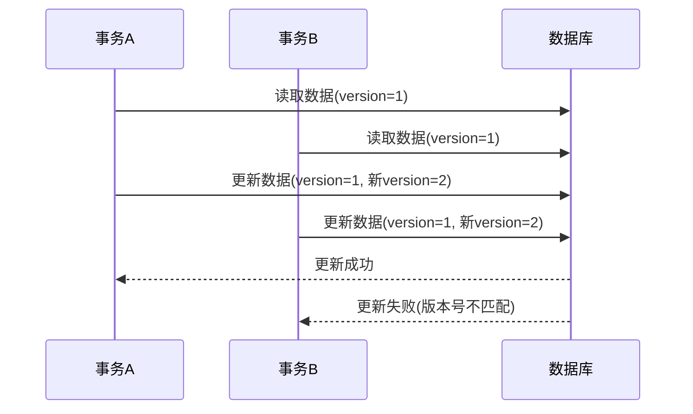
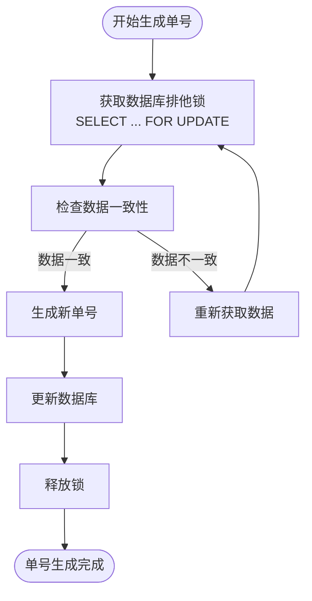

# 乐观锁机制

<cite>
**本文档引用的文件**   
- [MybatisPlusConfig.java](file://smart-admin-api-java17-springboot3\sa-base\src\main\java\net\lab1024\sa\base\config\MybatisPlusConfig.java)
- [SerialNumberEntity.java](file://smart-admin-api-java17-springboot3\sa-base\src\main\java\net\lab1024\sa\base\module\support\serialnumber\domain\SerialNumberEntity.java)
- [SerialNumberDao.java](file://smart-admin-api-java17-springboot3\sa-base\src\main\java\net\lab1024\sa\base\module\support\serialnumber\dao\SerialNumberDao.java)
- [SerialNumberMapper.xml](file://smart-admin-api-java17-springboot3\sa-base\src\main\resources\mapper\support\SerialNumberMapper.xml)
- [SerialNumberMysqlService.java](file://smart-admin-api-java17-springboot3\sa-base\src\main\java\net\lab1024\sa\base\module\support\serialnumber\service\impl\SerialNumberMysqlService.java)
</cite>

## 目录
1. [简介](#简介)
2. [乐观锁机制概述](#乐观锁机制概述)
3. [MyBatis-Plus乐观锁插件配置](#mybatis-plus乐观锁插件配置)
4. [版本号字段设计与实现](#版本号字段设计与实现)
5. [乐观锁工作原理](#乐观锁工作原理)
6. [并发冲突处理策略](#并发冲突处理策略)
7. [实际应用示例](#实际应用示例)
8. [最佳实践建议](#最佳实践建议)

## 简介
本文档详细介绍了在Smart Admin系统中实现的乐观锁机制，重点阐述了如何使用MyBatis-Plus框架的@Version注解来实现并发控制。文档涵盖了乐观锁的基本概念、配置方法、工作原理以及在实际业务场景中的应用。

## 乐观锁机制概述
乐观锁是一种并发控制机制，它假设多用户并发的事务在处理时不会彼此影响，各事务能够在不产生锁的情况下处理各自影响的那部分数据。在提交数据更新之前，每个事务会先检查在此期间有没有其他事务修改过这个数据。

当多个事务同时修改同一数据时，乐观锁通过版本号机制来检测冲突。每次数据更新时，系统会检查当前数据的版本号是否与读取时的版本号一致，如果一致则更新成功并递增版本号，如果不一致则说明数据已被其他事务修改，当前更新将失败。

**Section sources**
- [SerialNumberEntity.java](file://smart-admin-api-java17-springboot3\sa-base\src\main\java\net\lab1024\sa\base\module\support\serialnumber\domain\SerialNumberEntity.java#L1-L50)

## MyBatis-Plus乐观锁插件配置
在Smart Admin系统中，MyBatis-Plus的乐观锁插件需要在配置类中进行注册。虽然当前代码库中没有直接显示乐观锁插件的配置，但根据MyBatis-Plus的标准配置方式，乐观锁插件的配置方法如下：

```java
@Configuration
public class MybatisPlusConfig {
    
    @Bean
    public MybatisPlusInterceptor mybatisPlusInterceptor() {
        MybatisPlusInterceptor interceptor = new MybatisPlusInterceptor();
        // 添加分页插件
        interceptor.addInnerInterceptor(new PaginationInnerInterceptor(DbType.MYSQL));
        // 添加乐观锁插件
        interceptor.addInnerInterceptor(new OptimisticLockerInnerInterceptor());
        return interceptor;
    }
}
```

通过在MybatisPlusInterceptor中添加OptimisticLockerInnerInterceptor，即可启用乐观锁功能。该插件会在执行更新操作时自动处理版本号的校验和更新。

**Section sources**
- [MybatisPlusConfig.java](file://smart-admin-api-java17-springboot3\sa-base\src\main\java\net\lab1024\sa\base\config\MybatisPlusConfig.java#L1-L33)

## 版本号字段设计与实现
在实体类中，需要使用@Version注解标记版本号字段。版本号字段通常使用Integer或Long类型，初始值为0或1，每次更新时自动递增。

```java
@Data
@TableName("t_serial_number")
public class SerialNumberEntity {
    
    @TableId(type = IdType.AUTO)
    private Integer serialNumberId;
    
    // 其他字段...
    
    /**
     * 版本号字段，用于乐观锁控制
     */
    @Version
    private Integer version;
    
    private LocalDateTime updateTime;
    private LocalDateTime createTime;
}
```

版本号字段的数据类型选择：
- **Integer**: 适用于版本号增长不快的场景，占用空间小
- **Long**: 适用于高并发场景，避免整数溢出

**Section sources**
- [SerialNumberEntity.java](file://smart-admin-api-java17-springboot3\sa-base\src\main\java\net\lab1024\sa\base\module\support\serialnumber\domain\SerialNumberEntity.java#L1-L50)

## 乐观锁工作原理
乐观锁的工作流程如下：



1. 事务A和事务B同时读取同一条记录，版本号均为1
2. 事务A先提交更新，系统检查版本号匹配，更新数据并将版本号递增到2
3. 事务B随后提交更新，系统检查发现当前版本号为2，与读取时的版本号1不匹配，更新失败

在执行更新操作时，MyBatis-Plus会自动生成包含版本号校验的SQL语句：
```sql
UPDATE t_serial_number 
SET last_number = ?, 
    last_time = ?, 
    version = version + 1 
WHERE serial_number_id = ? 
  AND version = ?
```

**Diagram sources**
- [SerialNumberMapper.xml](file://smart-admin-api-java17-springboot3\sa-base\src\main\resources\mapper\support\SerialNumberMapper.xml#L1-L21)
- [SerialNumberDao.java](file://smart-admin-api-java17-springboot3\sa-base\src\main\java\net\lab1024\sa\base\module\support\serialnumber\dao\SerialNumberDao.java#L1-L40)

**Section sources**
- [SerialNumberMapper.xml](file://smart-admin-api-java17-springboot3\sa-base\src\main\resources\mapper\support\SerialNumberMapper.xml#L1-L21)

## 并发冲突处理策略
当乐观锁更新失败时，系统需要有相应的处理策略：

1. **直接抛出异常**: 通知用户数据已被其他用户修改，需要重新加载数据
2. **自动重试**: 在一定次数内自动重试更新操作
3. **合并更新**: 将当前修改与最新数据进行合并

在Smart Admin系统中，单号生成服务使用了基于数据库排他锁的实现方式来避免并发问题：



这种基于排他锁的实现方式确保了单号生成的原子性，避免了重复单号的问题。

**Diagram sources**
- [SerialNumberDao.java](file://smart-admin-api-java17-springboot3\sa-base\src\main\java\net\lab1024\sa\base\module\support\serialnumber\dao\SerialNumberDao.java#L1-L40)
- [SerialNumberMysqlService.java](file://smart-admin-api-java17-springboot3\sa-base\src\main\java\net\lab1024\sa\base\module\support\serialnumber\service\impl\SerialNumberMysqlService.java#L1-L31)

**Section sources**
- [SerialNumberMysqlService.java](file://smart-admin-api-java17-springboot3\sa-base\src\main\java\net\lab1024\sa\base\module\support\serialnumber\service\impl\SerialNumberMysqlService.java#L1-L31)

## 实际应用示例
在单号生成服务中，乐观锁机制的应用示例如下：

1. **实体类定义**:
   - 在SerialNumberEntity中添加@Version注解标记的version字段
   - 配置版本号的初始值和更新策略

2. **DAO层实现**:
   - 使用BaseMapper提供的updateById方法，该方法会自动处理乐观锁
   - 或者自定义更新方法，在SQL中包含版本号校验

3. **Service层处理**:
   - 捕获乐观锁更新失败的异常
   - 根据业务需求选择重试、合并或提示用户

4. **前端交互**:
   - 当更新失败时，提示用户"数据已被其他用户修改，请刷新后重试"
   - 提供刷新按钮，让用户重新加载最新数据

这种实现方式确保了在高并发环境下数据的一致性和完整性，同时避免了传统悲观锁带来的性能瓶颈。

**Section sources**
- [SerialNumberEntity.java](file://smart-admin-api-java17-springboot3\sa-base\src\main\java\net\lab1024\sa\base\module\support\serialnumber\domain\SerialNumberEntity.java#L1-L50)
- [SerialNumberDao.java](file://smart-admin-api-java17-springboot3\sa-base\src\main\java\net\lab1024\sa\base\module\support\serialnumber\dao\SerialNumberDao.java#L1-L40)

## 最佳实践建议
1. **合理选择锁机制**: 根据业务场景选择乐观锁或悲观锁。对于读多写少的场景，推荐使用乐观锁；对于写操作频繁的场景，可以考虑使用悲观锁。

2. **版本号字段命名**: 统一使用"version"作为版本号字段名，便于维护和理解。

3. **异常处理**: 在Service层捕获乐观锁异常，并提供友好的错误提示。

4. **重试机制**: 对于关键业务操作，可以实现有限次数的自动重试机制。

5. **监控告警**: 对频繁发生乐观锁冲突的业务进行监控，分析原因并优化。

6. **性能考虑**: 乐观锁减少了锁的开销，但在高并发更新场景下可能会导致大量更新失败，需要权衡利弊。

通过合理使用乐观锁机制，可以在保证数据一致性的同时，提高系统的并发处理能力。