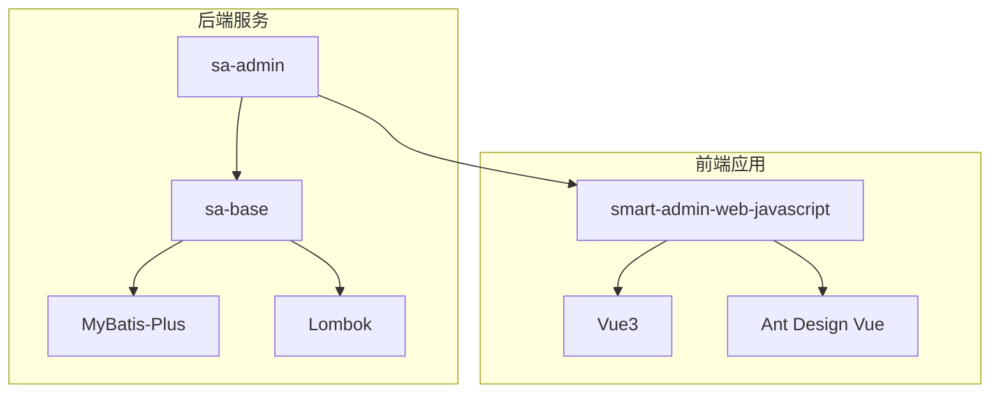
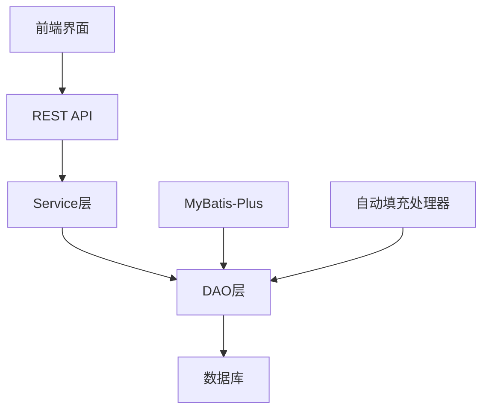

# 字段命名规范

<cite>
**本文档引用的文件**  
- [MybatisPlusConfig.java](file://smart-admin-api-java17-springboot3\sa-base\src\main\java\net\lab1024\sa\base\config\MybatisPlusConfig.java)
- [MybatisPlusFillHandler.java](file://smart-admin-api-java17-springboot3\sa-base\src\main\java\net\lab1024\sa\base\handler\MybatisPlusFillHandler.java)
- [EmployeeEntity.java](file://smart-admin-api-java17-springboot3\sa-admin\src\main\java\net\lab1024\sa\admin\module\system\employee\domain\entity\EmployeeEntity.java)
- [EnterpriseEntity.java](file://smart-admin-api-java17-springboot3\sa-admin\src\main\java\net\lab1024\sa\admin\module\business\oa\enterprise\domain\entity\EnterpriseEntity.java)
- [TableColumnEntity.java](file://smart-admin-api-java17-springboot3\sa-base\src\main\java\net\lab1024\sa\base\module\support\table\domain\TableColumnEntity.java)
- [Entity.java.vm](file://smart-admin-api-java17-springboot3\sa-base\src\main\resources\code-generator-template\java\domain\entity\Entity.java.vm)
</cite>

## 目录
1. [引言](#引言)
2. [项目结构](#项目结构)
3. [核心组件](#核心组件)
4. [架构概述](#架构概述)
5. [详细组件分析](#详细组件分析)
6. [依赖分析](#依赖分析)
7. [性能考虑](#性能考虑)
8. [故障排除指南](#故障排除指南)
9. [结论](#结论)

## 引言
本文档详细介绍了Java实体类字段的驼峰命名法与数据库下划线命名的映射规则。重点说明了MyBatis-Plus如何通过@TableField注解实现字段名与数据库列名的映射，包括value属性的使用方法。文档还解释了当字段名与数据库列名不一致时的处理策略，以及默认情况下驼峰转下划线的自动转换机制，并提供了实际代码示例，展示不同命名场景下的配置方式，包括普通字段、布尔类型字段的命名约定。

## 项目结构
本项目采用分层架构设计，主要包含API服务层、基础组件层和前端Web层。Java后端代码遵循Spring Boot 3和Java 17的技术栈，使用MyBatis-Plus作为ORM框架。实体类位于`sa-admin`模块的`domain/entity`包中，遵循统一的命名规范和注解使用规则。



**图表来源**
- [MybatisPlusConfig.java](file://smart-admin-api-java17-springboot3\sa-base\src\main\java\net\lab1024\sa\base\config\MybatisPlusConfig.java)
- [EmployeeEntity.java](file://smart-admin-api-java17-springboot3\sa-admin\src\main\java\net\lab1024\sa\admin\module\system\employee\domain\entity\EmployeeEntity.java)

**章节来源**
- [MybatisPlusConfig.java](file://smart-admin-api-java17-springboot3\sa-base\src\main\java\net\lab1024\sa\base\config\MybatisPlusConfig.java)
- [EmployeeEntity.java](file://smart-admin-api-java17-springboot3\sa-admin\src\main\java\net\lab1024\sa\admin\module\system\employee\domain\entity\EmployeeEntity.java)

## 核心组件
系统的核心组件包括实体类、数据访问对象(DAO)、服务层和控制器。实体类使用Lombok注解简化代码，通过MyBatis-Plus注解实现与数据库表的映射。字段命名遵循驼峰命名法，而数据库列名使用下划线命名法，通过注解实现两者之间的映射。

**章节来源**
- [EmployeeEntity.java](file://smart-admin-api-java17-springboot3\sa-admin\src\main\java\net\lab1024\sa\admin\module\system\employee\domain\entity\EmployeeEntity.java)
- [EnterpriseEntity.java](file://smart-admin-api-java17-springboot3\sa-admin\src\main\java\net\lab1024\sa\admin\module\business\oa\enterprise\domain\entity\EnterpriseEntity.java)

## 架构概述
系统采用典型的三层架构：表现层、业务逻辑层和数据访问层。MyBatis-Plus作为ORM框架，负责Java对象与数据库记录之间的映射。通过配置类启用分页插件和自动填充功能，提高了开发效率和代码质量。



**图表来源**
- [MybatisPlusConfig.java](file://smart-admin-api-java17-springboot3\sa-base\src\main\java\net\lab1024\sa\base\config\MybatisPlusConfig.java)
- [MybatisPlusFillHandler.java](file://smart-admin-api-java17-springboot3\sa-base\src\main\java\net\lab1024\sa\base\handler\MybatisPlusFillHandler.java)

## 详细组件分析

### 实体类字段命名规范分析
Java实体类字段采用驼峰命名法（camelCase），而数据库列名采用下划线命名法（snake_case）。MyBatis-Plus默认支持驼峰转下划线的自动转换，无需额外配置即可实现基本的映射。

#### 驼峰命名与下划线映射
```mermaid
classDiagram
class EmployeeEntity {
+Long employeeId
+String employeeUid
+String loginName
+String loginPwd
+String actualName
+String avatar
+Integer gender
+String phone
+String email
+Long departmentId
+Long positionId
+Boolean administratorFlag
+Boolean disabledFlag
+Boolean deletedFlag
+String remark
+LocalDateTime updateTime
+LocalDateTime createTime
}
note right of EmployeeEntity
字段命名示例：
- employeeId → employee_id
- loginName → login_name
- createTime → create_time
遵循驼峰转下划线自动转换规则
end note
```

**图表来源**
- [EmployeeEntity.java](file://smart-admin-api-java17-springboot3\sa-admin\src\main\java\net\lab1024\sa\admin\module\system\employee\domain\entity\EmployeeEntity.java)

#### @TableField注解使用
当字段名与数据库列名不一致或需要特殊处理时，使用@TableField注解进行显式映射。value属性指定对应的数据库列名。

```mermaid
classDiagram
class EnterpriseEntity {
+Long enterpriseId
+String enterpriseName
+String enterpriseLogo
+String unifiedSocialCreditCode
+Integer type
+String contact
+String contactPhone
+String email
+Integer province
+String provinceName
+Integer city
+String cityName
+Integer district
+String districtName
+String address
+String businessLicense
+Boolean disabledFlag
+Boolean deletedFlag
+Long createUserId
+String createUserName
+LocalDateTime createTime
+LocalDateTime updateTime
}
note right of EnterpriseEntity
@TableField注解使用示例：
- 未使用注解：自动驼峰转下划线
- 特殊字段：通过注解显式映射
- 自动填充：@TableField(fill = FieldFill.INSERT)
end note
```

**图表来源**
- [EnterpriseEntity.java](file://smart-admin-api-java17-springboot3\sa-admin\src\main\java\net\lab1024\sa\admin\module\business\oa\enterprise\domain\entity\EnterpriseEntity.java)
- [Entity.java.vm](file://smart-admin-api-java17-springboot3\sa-base\src\main\resources\code-generator-template\java\domain\entity\Entity.java.vm)

#### 布尔类型字段命名
布尔类型字段采用"Flag"后缀命名约定，如`administratorFlag`、`disabledFlag`、`deletedFlag`等。这种命名方式清晰地表明了字段的布尔性质，同时避免了JavaBean规范中对boolean类型getter方法的命名冲突。

```mermaid
classDiagram
class TableColumnEntity {
+Long tableColumnId
+Long userId
+Integer userType
+Integer tableId
+String columns
+LocalDateTime createTime
+LocalDateTime updateTime
}
note right of TableColumnEntity
布尔字段命名约定：
- administratorFlag : 是否为超级管理员
- disabledFlag : 是否被禁用
- deletedFlag : 是否已删除
采用"Flag"后缀明确表示布尔类型
end note
```

**图表来源**
- [TableColumnEntity.java](file://smart-admin-api-java17-springboot3\sa-base\src\main\java\net\lab1024\sa\base\module\support\table\domain\TableColumnEntity.java)
- [EmployeeEntity.java](file://smart-admin-api-java17-springboot3\sa-admin\src\main\java\net\lab1024\sa\admin\module\system\employee\domain\entity\EmployeeEntity.java)

**章节来源**
- [EmployeeEntity.java](file://smart-admin-api-java17-springboot3\sa-admin\src\main\java\net\lab1024\sa\admin\module\system\employee\domain\entity\EmployeeEntity.java)
- [EnterpriseEntity.java](file://smart-admin-api-java17-springboot3\sa-admin\src\main\java\net\lab1024\sa\admin\module\business\oa\enterprise\domain\entity\EnterpriseEntity.java)
- [TableColumnEntity.java](file://smart-admin-api-java17-springboot3\sa-base\src\main\java\net\lab1024\sa\base\module\support\table\domain\TableColumnEntity.java)

## 依赖分析
系统依赖MyBatis-Plus实现ORM功能，通过配置类启用分页插件和自动填充功能。实体类依赖Lombok注解生成getter、setter和toString方法，减少样板代码。

```mermaid
graph TD
A[MybatisPlusConfig] --> B[MybatisPlusInterceptor]
B --> C[分页插件]
D[MybatisPlusFillHandler] --> E[自动填充]
F[实体类] --> G[@TableName]
F --> H[@TableId]
F --> I[@TableField]
```

**图表来源**
- [MybatisPlusConfig.java](file://smart-admin-api-java17-springboot3\sa-base\src\main\java\net\lab1024\sa\base\config\MybatisPlusConfig.java)
- [MybatisPlusFillHandler.java](file://smart-admin-api-java17-springboot3\sa-base\src\main\java\net\lab1024\sa\base\handler\MybatisPlusFillHandler.java)

**章节来源**
- [MybatisPlusConfig.java](file://smart-admin-api-java17-springboot3\sa-base\src\main\java\net\lab1024\sa\base\config\MybatisPlusConfig.java)
- [MybatisPlusFillHandler.java](file://smart-admin-api-java17-springboot3\sa-base\src\main\java\net\lab1024\sa\base\handler\MybatisPlusFillHandler.java)

## 性能考虑
通过MyBatis-Plus的自动填充功能，避免了在业务代码中手动设置创建时间和更新时间，提高了代码的可维护性。分页插件的使用有效控制了查询结果集的大小，防止内存溢出。

## 故障排除指南
当遇到字段映射问题时，首先检查字段命名是否符合驼峰命名规范，然后确认是否需要使用@TableField注解进行显式映射。对于自动填充功能失效的情况，检查MybatisPlusFillHandler是否正确配置。

**章节来源**
- [MybatisPlusFillHandler.java](file://smart-admin-api-java17-springboot3\sa-base\src\main\java\net\lab1024\sa\base\handler\MybatisPlusFillHandler.java)
- [MybatisPlusConfig.java](file://smart-admin-api-java17-springboot3\sa-base\src\main\java\net\lab1024\sa\base\config\MybatisPlusConfig.java)

## 结论
本系统采用统一的字段命名规范，通过MyBatis-Plus的自动映射和注解配置，实现了Java实体类字段与数据库列名的高效映射。驼峰命名法与下划线命名法的转换规则清晰明确，配合@TableField注解的灵活使用，既保证了代码的可读性，又确保了数据库交互的准确性。