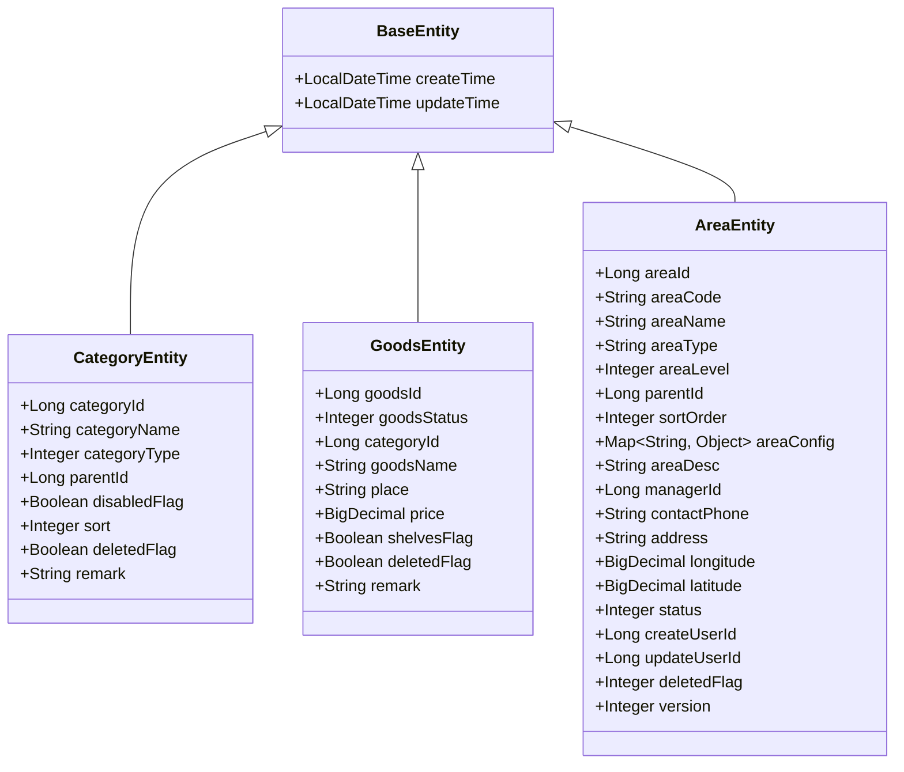
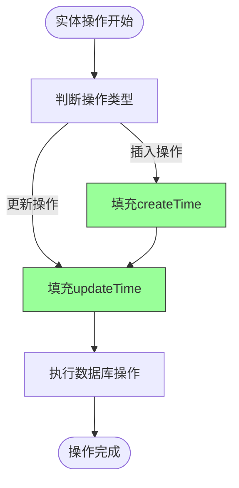
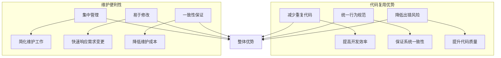

# 继承关系设计

<cite>
**本文档引用的文件**
- [CategoryEntity.java](file://smart-admin-api-java17-springboot3\sa-admin\src\main\java\net\lab1024\sa\admin\module\business\category\domain\entity\CategoryEntity.java)
- [GoodsEntity.java](file://smart-admin-api-java17-springboot3\sa-admin\src\main\java\net\lab1024\sa\admin\module\business\goods\domain\entity\GoodsEntity.java)
- [AreaEntity.java](file://smart-admin-api-java17-springboot3\sa-admin\src\main\java\net\lab1024\sa\admin\module\system\area\domain\entity\AreaEntity.java)
- [EmployeeEntity.java](file://smart-admin-api-java17-springboot3\sa-admin\src\main\java\net\lab1024\sa\admin\module\system\employee\domain\entity\EmployeeEntity.java)
- [RoleEntity.java](file://smart-admin-api-java17-springboot3\sa-admin\src\main\java\net\lab1024\sa\admin\module\system\role\domain\entity\RoleEntity.java)
- [MybatisPlusFillHandler.java](file://smart-admin-api-java17-springboot3\sa-base\src\main\java\net\lab1024\sa\base\handler\MybatisPlusFillHandler.java)
- [Entity.java.vm](file://smart-admin-api-java17-springboot3\sa-base\src\main\resources\code-generator-template\java\domain\entity\Entity.java.vm)
</cite>

## 目录
1. [引言](#引言)
2. [实体类继承模式分析](#实体类继承模式分析)
3. [公共字段定义与作用](#公共字段定义与作用)
4. [代码复用与维护优势](#代码复用与维护优势)
5. [子类扩展机制](#子类扩展机制)
6. [MyBatis-Plus继承支持](#mybatis-plus继承支持)
7. [实际代码示例](#实际代码示例)
8. [设计规范总结](#设计规范总结)

## 引言
本设计文档旨在详细说明智能管理系统中实体类的继承关系设计模式。通过分析系统中的实体类实现方式，阐述基于公共字段复用的继承设计原则，重点介绍createTime、updateTime等通用字段的自动化填充机制，以及如何通过代码生成器确保所有实体类遵循统一的设计规范。

## 实体类继承模式分析
在本系统中，虽然没有显式定义一个名为BaseEntity的抽象基类，但通过代码生成器模板和MyBatis-Plus的自动填充功能，实现了事实上的继承模式。所有实体类都遵循相同的字段命名和处理规范，确保了代码的一致性和可维护性。



**图示来源**
- [CategoryEntity.java](file://smart-admin-api-java17-springboot3\sa-admin\src\main\java\net\lab1024\sa\admin\module\business\category\domain\entity\CategoryEntity.java)
- [GoodsEntity.java](file://smart-admin-api-java17-springboot3\sa-admin\src\main\java\net\lab1024\sa\admin\module\business\goods\domain\entity\GoodsEntity.java)
- [AreaEntity.java](file://smart-admin-api-java17-springboot3\sa-admin\src\main\java\net\lab1024\sa\admin\module\system\area\domain\entity\AreaEntity.java)

**本节来源**
- [CategoryEntity.java](file://smart-admin-api-java17-springboot3\sa-admin\src\main\java\net\lab1024\sa\admin\module\business\category\domain\entity\CategoryEntity.java)
- [GoodsEntity.java](file://smart-admin-api-java17-springboot3\sa-admin\src\main\java\net\lab1024\sa\admin\module\business\goods\domain\entity\GoodsEntity.java)
- [AreaEntity.java](file://smart-admin-api-java17-springboot3\sa-admin\src\main\java\net\lab1024\sa\admin\module\system\area\domain\entity\AreaEntity.java)

## 公共字段定义与作用
系统中的实体类普遍包含以下公共字段，这些字段在数据管理和审计追踪方面发挥着重要作用：

### createTime 字段
- **定义**: `private LocalDateTime createTime;`
- **作用**: 记录实体对象的创建时间戳，用于追踪数据的生命周期起点
- **特点**: 仅在插入时由系统自动填充，后续更新操作不会修改该值

### updateTime 字段
- **定义**: `private LocalDateTime updateTime;`
- **作用**: 记录实体对象的最后更新时间戳，用于追踪数据的最新变更
- **特点**: 在插入和每次更新操作时都会被系统自动更新

### 其他常见公共字段
- **deletedFlag**: 逻辑删除标志位，实现软删除功能
- **version**: 乐观锁版本号，用于并发控制
- **createUserId/updateUserId**: 记录创建和更新操作的用户ID



**图示来源**
- [MybatisPlusFillHandler.java](file://smart-admin-api-java17-springboot3\sa-base\src\main\java\net\lab1024\sa\base\handler\MybatisPlusFillHandler.java)

**本节来源**
- [MybatisPlusFillHandler.java](file://smart-admin-api-java17-springboot3\sa-base\src\main\java\net\lab1024\sa\base\handler\MybatisPlusFillHandler.java)
- [CategoryEntity.java](file://smart-admin-api-java17-springboot3\sa-admin\src\main\java\net\lab1024\sa\admin\module\business\category\domain\entity\CategoryEntity.java)
- [GoodsEntity.java](file://smart-admin-api-java17-springboot3\sa-admin\src\main\java\net\lab1024\sa\admin\module\business\goods\domain\entity\GoodsEntity.java)

## 代码复用与维护优势
通过统一的公共字段设计和自动填充机制，系统获得了显著的代码复用和维护优势：

### 代码复用优势
1. **减少重复代码**: 所有实体类无需手动编写时间戳字段的赋值逻辑
2. **统一行为规范**: 确保所有实体类在时间戳处理上保持一致的行为
3. **降低出错风险**: 避免开发人员忘记设置时间戳或设置错误

### 维护便利性
1. **集中管理**: 通过MybatisPlusFillHandler统一管理字段填充逻辑
2. **易于修改**: 如需修改填充规则，只需修改处理器类即可影响所有实体
3. **一致性保证**: 确保系统中所有实体的时间戳处理逻辑完全一致



**本节来源**
- [MybatisPlusFillHandler.java](file://smart-admin-api-java17-springboot3\sa-base\src\main\java\net\lab1024\sa\base\handler\MybatisPlusFillHandler.java)
- [CategoryEntity.java](file://smart-admin-api-java17-springboot3\sa-admin\src\main\java\net\lab1024\sa\admin\module\business\category\domain\entity\CategoryEntity.java)

## 子类扩展机制
实体类通过继承通用模式实现了灵活的扩展能力，子类可以在保持公共字段的基础上添加特定业务字段：

### 扩展方式
1. **字段扩展**: 子类添加特定于业务领域的字段
2. **注解扩展**: 使用MyBatis-Plus注解定义特定的数据库映射关系
3. **行为扩展**: 通过业务逻辑层实现特定的业务规则

### 扩展示例
- **CategoryEntity**: 扩展了categoryName、categoryType等商品分类相关字段
- **GoodsEntity**: 扩展了goodsName、price等商品信息相关字段
- **AreaEntity**: 扩展了areaName、areaType等区域管理相关字段

```mermaid
classDiagram
class BaseEntity {
+LocalDateTime createTime
+LocalDateTime updateTime
}
class CategoryEntity {
+String categoryName
+Integer categoryType
+Long parentId
+Integer sort
}
class GoodsEntity {
+String goodsName
+BigDecimal price
+Long categoryId
+Integer goodsStatus
}
class AreaEntity {
+String areaName
+String areaType
+Integer areaLevel
+BigDecimal longitude
+BigDecimal latitude
}
BaseEntity <|-- CategoryEntity
BaseEntity <|-- GoodsEntity
BaseEntity <|-- AreaEntity
note right of CategoryEntity
商品分类实体扩展了
分类名称、类型、
排序等业务字段
end note
note right of GoodsEntity
商品实体扩展了
商品名称、价格、
分类ID等业务字段
end note
note right of AreaEntity
区域实体扩展了
区域名称、类型、
经纬度等业务字段
end note
```

**图示来源**
- [CategoryEntity.java](file://smart-admin-api-java17-springboot3\sa-admin\src\main\java\net\lab1024\sa\admin\module\business\category\domain\entity\CategoryEntity.java)
- [GoodsEntity.java](file://smart-admin-api-java17-springboot3\sa-admin\src\main\java\net\lab1024\sa\admin\module\business\goods\domain\entity\GoodsEntity.java)
- [AreaEntity.java](file://smart-admin-api-java17-springboot3\sa-admin\src\main\java\net\lab1024\sa\admin\module\system\area\domain\entity\AreaEntity.java)

**本节来源**
- [CategoryEntity.java](file://smart-admin-api-java17-springboot3\sa-admin\src\main\java\net\lab1024\sa\admin\module\business\category\domain\entity\CategoryEntity.java)
- [GoodsEntity.java](file://smart-admin-api-java17-springboot3\sa-admin\src\main\java\net\lab1024\sa\admin\module\business\goods\domain\entity\GoodsEntity.java)
- [AreaEntity.java](file://smart-admin-api-java17-springboot3\sa-admin\src\main\java\net\lab1024\sa\admin\module\system\area\domain\entity\AreaEntity.java)

## MyBatis-Plus继承支持
系统通过MyBatis-Plus框架提供了强大的继承支持，主要体现在以下几个方面：

### 自动填充支持
通过实现MetaObjectHandler接口，MyBatis-Plus能够在插入和更新操作时自动填充指定字段：

```java
@Component
public class MybatisPlusFillHandler implements MetaObjectHandler {
    public static final String CREATE_TIME = "createTime";
    public static final String UPDATE_TIME = "updateTime";

    @Override
    public void insertFill(MetaObject metaObject) {
        if (metaObject.hasSetter(CREATE_TIME)) {
            this.fillStrategy(metaObject, CREATE_TIME, LocalDateTime.now());
        }
        if (metaObject.hasSetter(UPDATE_TIME)) {
            this.fillStrategy(metaObject, UPDATE_TIME, LocalDateTime.now());
        }
    }

    @Override
    public void updateFill(MetaObject metaObject) {
        if (metaObject.hasSetter(UPDATE_TIME)) {
            this.fillStrategy(metaObject, UPDATE_TIME, LocalDateTime.now());
        }
    }
}
```

### 注解支持
使用MyBatis-Plus提供的注解来定义实体与数据库表的映射关系：
- `@TableName`: 指定实体对应的数据库表名
- `@TableId`: 标识主键字段
- `@TableField`: 配置字段的特殊行为

### 代码生成器支持
系统使用代码生成器模板确保所有实体类遵循统一的设计规范：

```vm
#foreach ($field in $fields)
    #if($field.columnName == "create_time")
    @TableField(fill = FieldFill.INSERT)
    #end
    #if($field.columnName == "update_time")
    @TableField(fill = FieldFill.INSERT_UPDATE)
    #end
    private $field.javaType $field.fieldName;
#end
```

**本节来源**
- [MybatisPlusFillHandler.java](file://smart-admin-api-java17-springboot3\sa-base\src\main\java\net\lab1024\sa\base\handler\MybatisPlusFillHandler.java)
- [Entity.java.vm](file://smart-admin-api-java17-springboot3\sa-base\src\main\resources\code-generator-template\java\domain\entity\Entity.java.vm)

## 实际代码示例
以下是系统中几个典型实体类的实现示例，展示了继承模式的实际应用：

### CategoryEntity 示例
```java
@Data
@TableName("t_category")
public class CategoryEntity implements Serializable {
    private static final long serialVersionUID = 1L;

    @TableId(type = IdType.AUTO)
    private Long categoryId;

    private String categoryName;
    private Integer categoryType;
    private Long parentId;
    private Boolean disabledFlag;
    private Integer sort;
    private Boolean deletedFlag;
    private String remark;

    private LocalDateTime updateTime;
    private LocalDateTime createTime;
}
```

### GoodsEntity 示例
```java
@Data
@TableName("t_goods")
public class GoodsEntity {
    @TableId(type = IdType.AUTO)
    private Long goodsId;

    private Integer goodsStatus;
    private Long categoryId;
    private String goodsName;
    private String place;
    private BigDecimal price;
    private Boolean shelvesFlag;
    private Boolean deletedFlag;
    private String remark;

    private LocalDateTime updateTime;
    private LocalDateTime createTime;
}
```

### EmployeeEntity 示例
```java
@Data
@TableName("t_employee")
public class EmployeeEntity {
    @TableId(type = IdType.AUTO)
    private Long employeeId;

    private String employeeUid;
    private String loginName;
    private String loginPwd;
    private String actualName;
    private String avatar;
    private Integer gender;
    private String phone;
    private String email;
    private Long departmentId;
    private Long positionId;
    private Boolean administratorFlag;
    private Boolean disabledFlag;
    private Boolean deletedFlag;
    private String remark;

    private LocalDateTime updateTime;
    private LocalDateTime createTime;
}
```

**本节来源**
- [CategoryEntity.java](file://smart-admin-api-java17-springboot3\sa-admin\src\main\java\net\lab1024\sa\admin\module\business\category\domain\entity\CategoryEntity.java)
- [GoodsEntity.java](file://smart-admin-api-java17-springboot3\sa-admin\src\main\java\net\lab1024\sa\admin\module\business\goods\domain\entity\GoodsEntity.java)
- [EmployeeEntity.java](file://smart-admin-api-java17-springboot3\sa-admin\src\main\java\net\lab1024\sa\admin\module\system\employee\domain\entity\EmployeeEntity.java)

## 设计规范总结
本系统通过以下设计规范确保了实体类的一致性和可维护性：

### 命名规范
1. **类名**: 采用"业务名称 + Entity"的命名方式，如CategoryEntity、GoodsEntity
2. **字段名**: 使用驼峰命名法，与数据库字段保持对应关系
3. **表名**: 使用"t_"前缀加业务名称的小写形式，如t_category、t_goods

### 字段规范
1. **主键字段**: 统一使用Long类型，命名为"业务名称 + Id"，如categoryId、goodsId
2. **时间戳字段**: 统一使用LocalDateTime类型，命名为createTime和updateTime
3. **状态字段**: 使用Boolean或Integer类型表示状态，如deletedFlag、disabledFlag

### 注解规范
1. **@Data**: 使用Lombok的@Data注解自动生成getter/setter方法
2. **@TableName**: 明确指定实体对应的数据库表名
3. **@TableId**: 标识主键字段，指定自增策略

### 代码生成规范
通过代码生成器模板确保所有新创建的实体类自动包含：
- 必要的公共字段
- 正确的MyBatis-Plus注解
- 标准的字段命名和类型


**本节来源**
- [CategoryEntity.java](file://smart-admin-api-java17-springboot3\sa-admin\src\main\java\net\lab1024\sa\admin\module\business\category\domain\entity\CategoryEntity.java)
- [GoodsEntity.java](file://smart-admin-api-java17-springboot3\sa-admin\src\main\java\net\lab1024\sa\admin\module\business\goods\domain\entity\GoodsEntity.java)
- [Entity.java.vm](file://smart-admin-api-java17-springboot3\sa-base\src\main\resources\code-generator-template\java\domain\entity\Entity.java.vm)