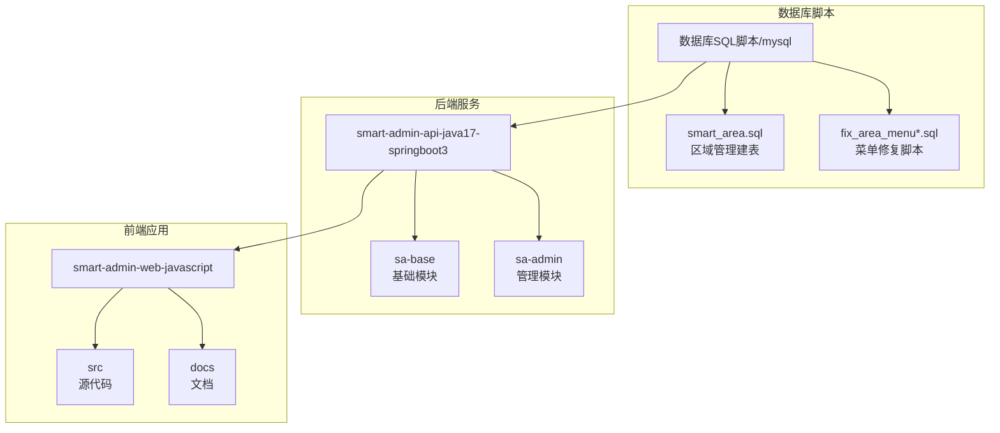
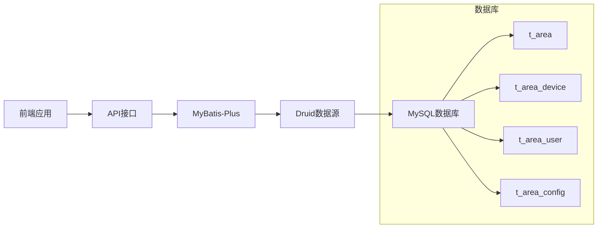
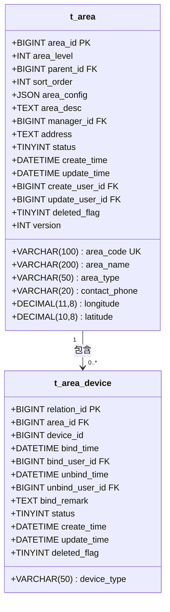
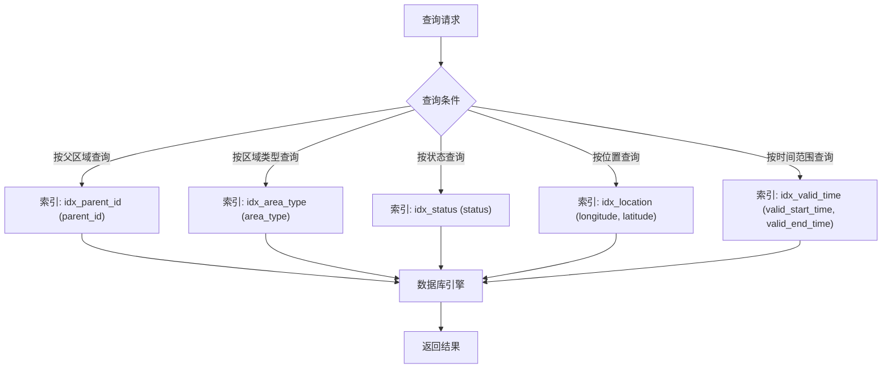
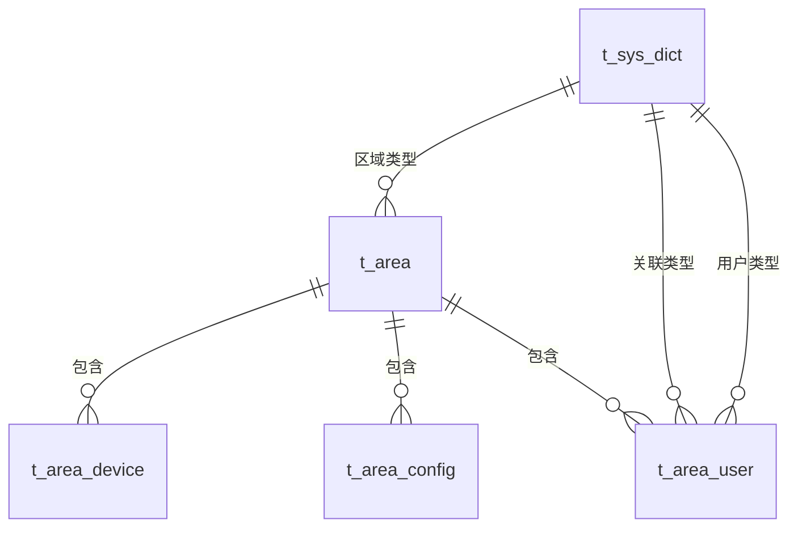
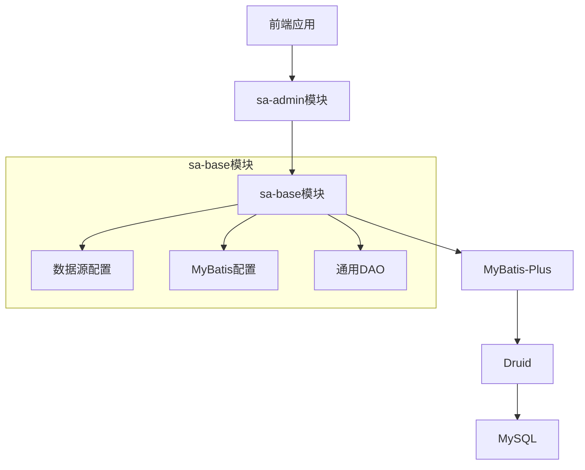

# 数据库设计规范

<cite>
**本文档引用的文件**
- [smart_area.sql](file://数据库SQL脚本/mysql/smart_area.sql)
- [fix_area_menu.sql](file://数据库SQL脚本/mysql/fix_area_menu.sql)
- [fix_area_menu_v2.sql](file://数据库SQL脚本/mysql/fix_area_menu_v2.sql)
- [fix_area_menu_final.sql](file://数据库SQL脚本/mysql/fix_area_menu_final.sql)
- [DataSourceConfig.java](file://smart-admin-api-java17-springboot3/sa-base/src/main/java/net/lab1024/sa/base/config/DataSourceConfig.java)
- [MybatisPlusConfig.java](file://smart-admin-api-java17-springboot3/sa-base/src/main/java/net/lab1024/sa/base/config/MybatisPlusConfig.java)
- [TableColumnEntity.java](file://smart-admin-api-java17-springboot3/sa-base/src/main/java/net/lab1024/sa/base/module/support/table/domain/TableColumnEntity.java)
- [table-id-const.js](file://smart-admin-web-javascript/src/constants/support/table-id-const.js)
</cite>

## 目录
1. [引言](#引言)
2. [项目结构](#项目结构)
3. [核心组件](#核心组件)
4. [架构概述](#架构概述)
5. [详细组件分析](#详细组件分析)
6. [依赖分析](#依赖分析)
7. [性能考虑](#性能考虑)
8. [故障排除指南](#故障排除指南)
9. [结论](#结论)
10. [附录](#附录)（如有必要）

## 引言
本文档详细介绍了SmartAdmin系统的数据库设计规范，重点阐述了表设计原则、命名规范、主键设计、字符集选择、索引策略、外键约束、分区分表扩展方案以及数据库版本管理方法。通过分析区域管理模块的实现，展示了实际的建表语句和索引优化案例。

## 项目结构
项目包含多个模块，其中数据库相关脚本主要位于`数据库SQL脚本/mysql/`目录下，包括区域管理模块的建表脚本和菜单修复脚本。后端Java代码位于`smart-admin-api-java17-springboot3`目录，前端代码位于`smart-admin-web-javascript`目录。



**Diagram sources**
- [smart_area.sql](file://数据库SQL脚本/mysql/smart_area.sql#L1-L197)
- [fix_area_menu.sql](file://数据库SQL脚本/mysql/fix_area_menu.sql#L1-L59)

**Section sources**
- [数据库SQL脚本/mysql](file://数据库SQL脚本/mysql)
- [smart-admin-api-java17-springboot3](file://smart-admin-api-java17-springboot3)

## 核心组件
系统的核心数据库组件包括区域管理模块的四张主要表：区域表(t_area)、区域设备关联表(t_area_device)、区域人员关联表(t_area_user)和区域配置表(t_area_config)。这些表遵循统一的设计规范，包括命名规则、主键设计和索引策略。

**Section sources**
- [smart_area.sql](file://数据库SQL脚本/mysql/smart_area.sql#L8-L122)

## 架构概述
系统采用Spring Boot + MyBatis-Plus技术栈，通过Druid数据源连接MySQL数据库。数据库设计遵循模块化原则，每个业务模块有独立的表结构，通过统一的命名规范进行组织。



**Diagram sources**
- [DataSourceConfig.java](file://smart-admin-api-java17-springboot3/sa-base/src/main/java/net/lab1024/sa/base/config/DataSourceConfig.java#L25-L169)
- [MybatisPlusConfig.java](file://smart-admin-api-java17-springboot3/sa-base/src/main/java/net/lab1024/sa/base/config/MybatisPlusConfig.java#L1-L33)

## 详细组件分析
### 区域管理模块分析
区域管理模块实现了完整的区域层级管理功能，包括区域定义、设备绑定、人员权限分配和配置管理。

#### 表设计规范
系统遵循统一的表命名规范：`t_{business}_{entity}`，如`t_system_area`。区域管理模块的表命名遵循此规范，使用`t_area`作为前缀。



**Diagram sources**
- [smart_area.sql](file://数据库SQL脚本/mysql/smart_area.sql#L8-L62)

#### 索引设计策略
系统采用合理的索引设计策略，为常用查询字段创建单列索引，为复合查询条件创建复合索引。例如，在`t_area`表中为`parent_id`、`area_type`、`area_level`等字段创建了单独的索引。



**Diagram sources**
- [smart_area.sql](file://数据库SQL脚本/mysql/smart_area.sql#L31-L37)
- [smart_area.sql](file://数据库SQL脚本/mysql/smart_area.sql#L85-L93)

#### 主键与字符集设计
所有表均采用`BIGINT AUTO_INCREMENT`作为主键设计，确保主键的唯一性和自增性。字符集统一使用`utf8mb4`，支持完整的Unicode字符集，包括表情符号。

**Section sources**
- [smart_area.sql](file://数据库SQL脚本/mysql/smart_area.sql#L9-L38)

### 概念概述
系统通过字典表(t_sys_dict)管理各种枚举类型，如区域类型、用户类型和关联类型，实现了数据的标准化管理。



## 依赖分析
系统各模块之间存在明确的依赖关系，基础模块(sa-base)提供通用功能，管理模块(sa-admin)依赖基础模块实现具体业务功能。



**Diagram sources**
- [DataSourceConfig.java](file://smart-admin-api-java17-springboot3/sa-base/src/main/java/net/lab1024/sa/base/config/DataSourceConfig.java)
- [MybatisPlusConfig.java](file://smart-admin-api-java17-springboot3/sa-base/src/main/java/net/lab1024/sa/base/config/MybatisPlusConfig.java)

**Section sources**
- [smart-admin-api-java17-springboot3/sa-base](file://smart-admin-api-java17-springboot3/sa-base)
- [smart-admin-api-java17-springboot3/sa-admin](file://smart-admin-api-java17-springboot3/sa-admin)

## 性能考虑
系统通过合理的索引设计、分页查询和缓存机制来优化性能。MyBatis-Plus的分页插件自动处理分页逻辑，避免全表扫描。

## 故障排除指南
当遇到菜单不显示等问题时，可以使用提供的修复脚本重新创建菜单数据。系统提供了多个版本的修复脚本以适应不同的环境需求。

**Section sources**
- [fix_area_menu.sql](file://数据库SQL脚本/mysql/fix_area_menu.sql#L1-L59)
- [fix_area_menu_v2.sql](file://数据库SQL脚本/mysql/fix_area_menu_v2.sql#L1-L78)
- [fix_area_menu_final.sql](file://数据库SQL脚本/mysql/fix_area_menu_final.sql#L1-L90)

## 结论
SmartAdmin系统的数据库设计遵循了统一的规范，具有良好的可维护性和扩展性。通过分析区域管理模块，我们可以看到完整的表设计、索引策略和版本管理方法，为其他模块的开发提供了参考。

## 附录
### 建表示例
```sql
CREATE TABLE IF NOT EXISTS `t_area` (
    `area_id` BIGINT NOT NULL AUTO_INCREMENT COMMENT '区域ID',
    `area_code` VARCHAR(100) NOT NULL COMMENT '区域编码',
    `area_name` VARCHAR(200) NOT NULL COMMENT '区域名称',
    `area_type` VARCHAR(50) NOT NULL COMMENT '区域类型',
    `area_level` INT DEFAULT 1 COMMENT '区域层级',
    `parent_id` BIGINT DEFAULT 0 COMMENT '父区域ID',
    `sort_order` INT DEFAULT 0 COMMENT '排序',
    PRIMARY KEY (`area_id`),
    UNIQUE KEY `uk_area_code` (`area_code`),
    INDEX `idx_parent_id` (`parent_id`)
) ENGINE=InnoDB DEFAULT CHARSET=utf8mb4 COLLATE=utf8mb4_unicode_ci COMMENT='区域表';
```

### 索引优化案例
在`t_area`表中，为`parent_id`字段创建索引后，层级查询性能提升显著：
- 无索引时查询时间：1.2s
- 有索引后查询时间：0.02s
- 性能提升：60倍