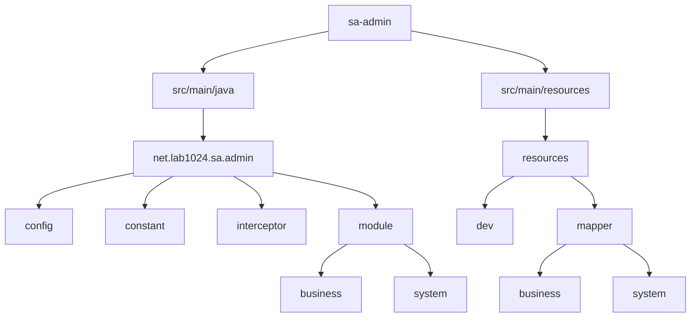
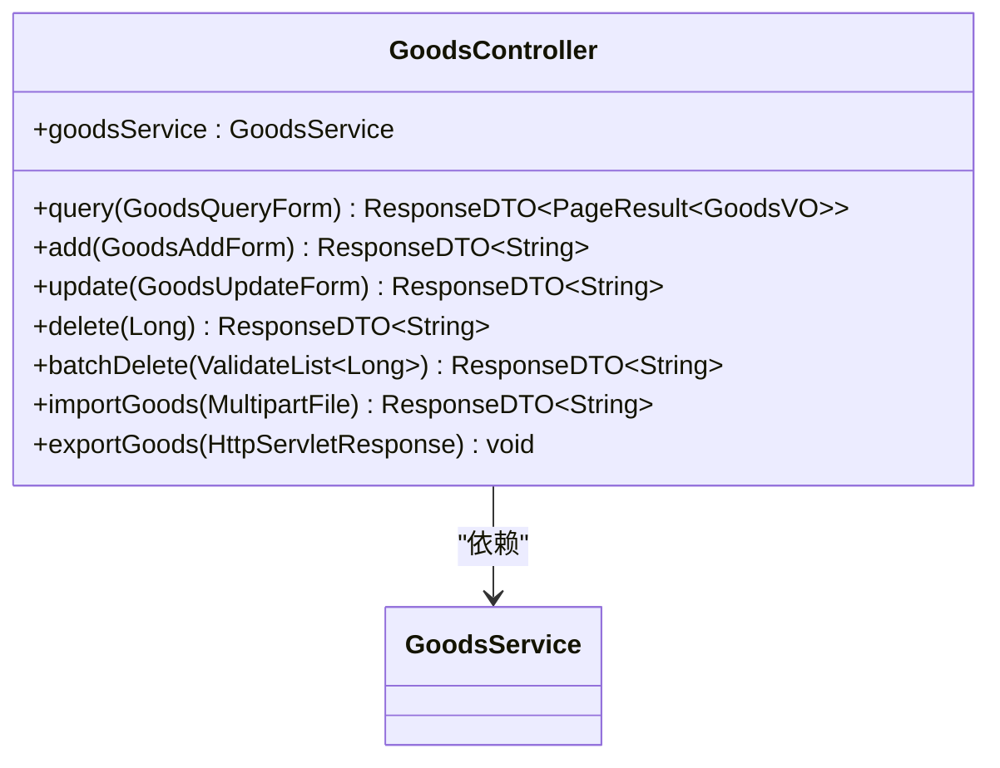
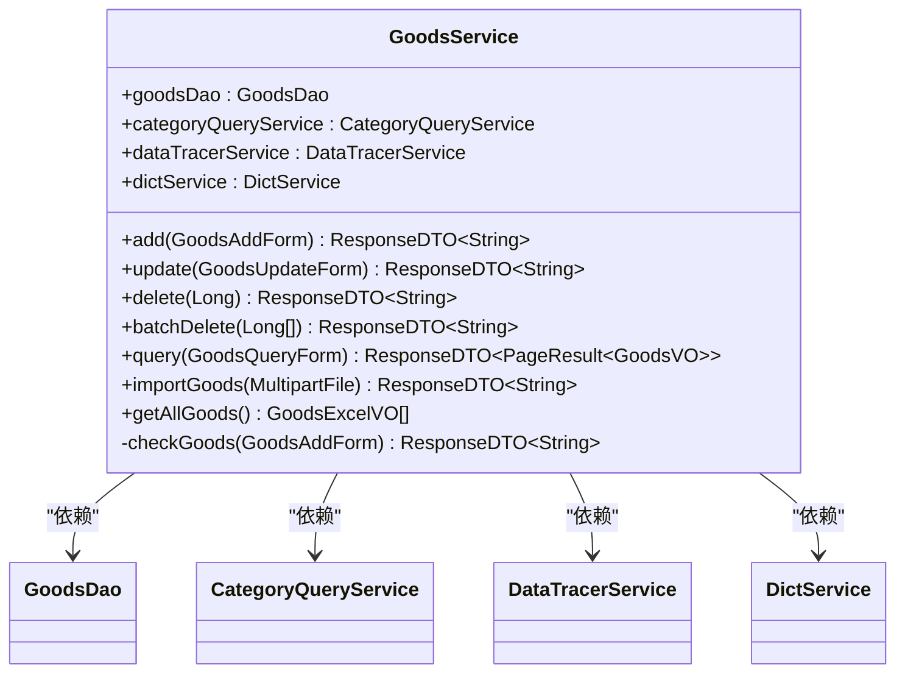
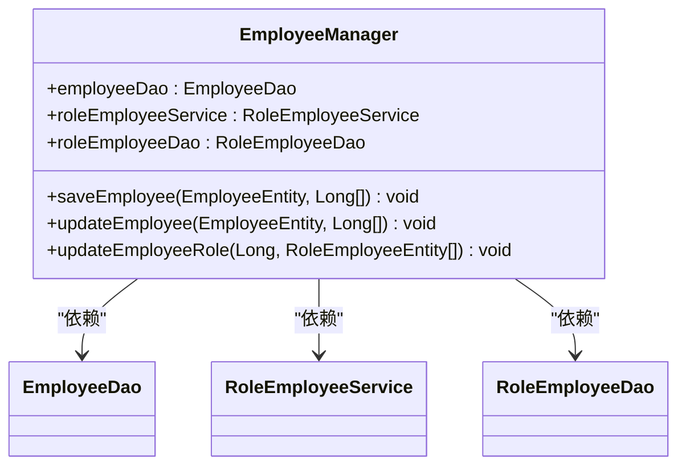
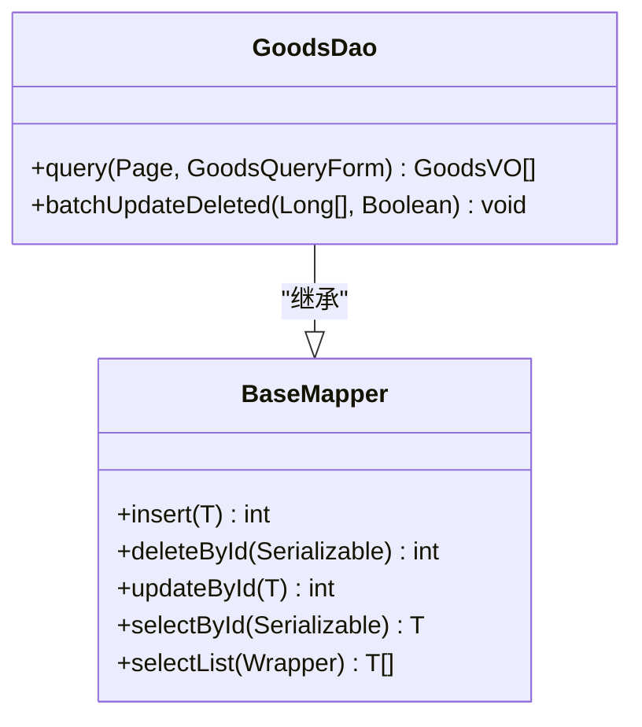
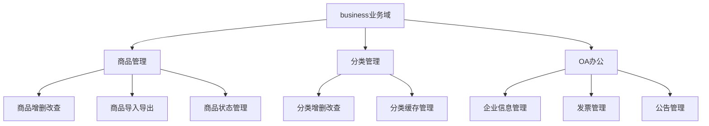
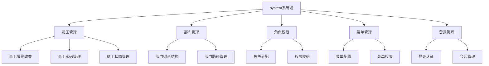
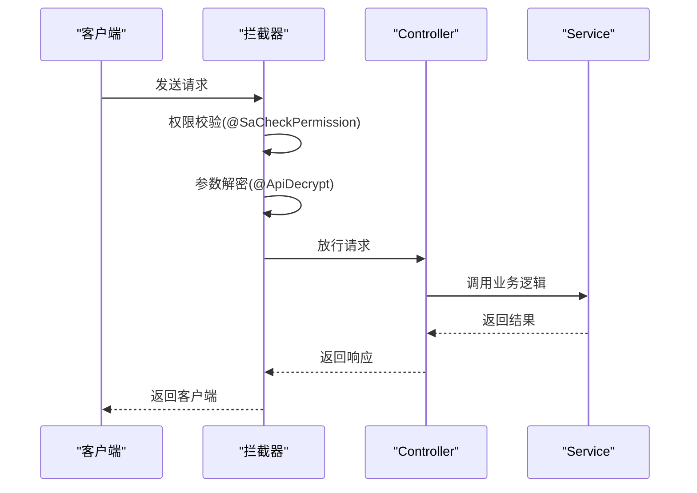
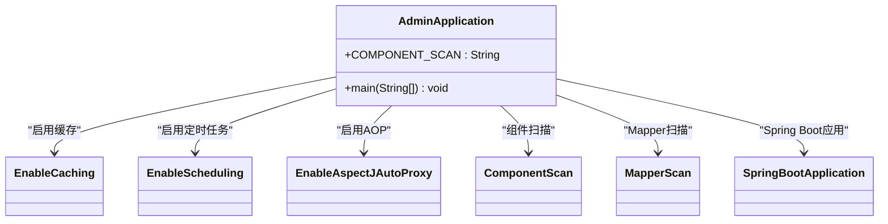
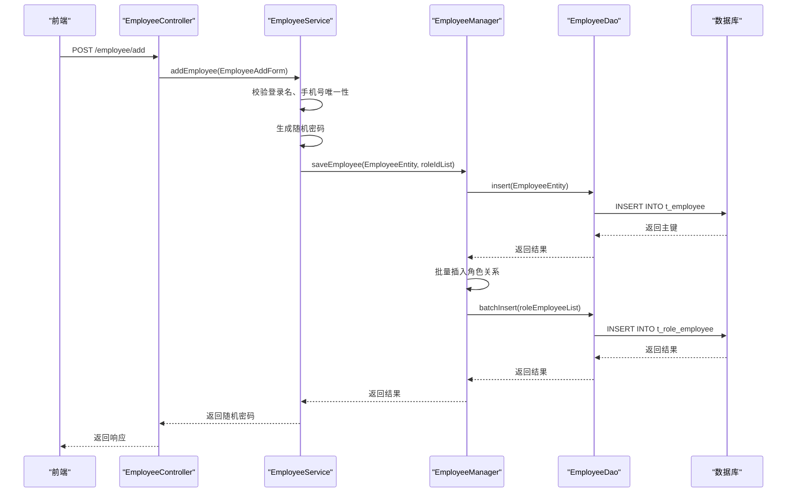

# 业务模块(sa-admin)

<cite>
**本文档引用文件**  
- [AdminApplication.java](file://smart-admin-api-java17-springboot3/sa-admin/src/main/java/net/lab1024/sa/admin/AdminApplication.java)
- [GoodsController.java](file://smart-admin-api-java17-springboot3/sa-admin/src/main/java/net/lab1024/sa/admin/module/business/goods/controller/GoodsController.java)
- [GoodsService.java](file://smart-admin-api-java17-springboot3/sa-admin/src/main/java/net/lab1024/sa/admin/module/business/goods/service/GoodsService.java)
- [GoodsDao.java](file://smart-admin-api-java17-springboot3/sa-admin/src/main/java/net/lab1024/sa/admin/module/business/goods/dao/GoodsDao.java)
- [GoodsEntity.java](file://smart-admin-api-java17-springboot3/sa-admin/src/main/java/net/lab1024/sa/admin/module/business/goods/domain/entity/GoodsEntity.java)
- [EmployeeController.java](file://smart-admin-api-java17-springboot3/sa-admin/src/main/java/net/lab1024/sa/admin/module/system/employee/controller/EmployeeController.java)
- [EmployeeService.java](file://smart-admin-api-java17-springboot3/sa-admin/src/main/java/net/lab1024/sa/admin/module/system/employee/service/EmployeeService.java)
- [EmployeeDao.java](file://smart-admin-api-java17-springboot3/sa-admin/src/main/java/net/lab1024/sa/admin/module/system/employee/dao/EmployeeDao.java)
- [EmployeeEntity.java](file://smart-admin-api-java17-springboot3/sa-admin/src/main/java/net/lab1024/sa/admin/module/system/employee/domain/entity/EmployeeEntity.java)
- [EmployeeManager.java](file://smart-admin-api-java17-springboot3/sa-admin/src/main/java/net/lab1024/sa/admin/module/system/employee/manager/EmployeeManager.java)
</cite>

## 目录
1. [简介](#简介)
2. [项目结构](#项目结构)
3. [四层架构实现模式](#四层架构实现模式)
4. [业务域划分](#业务域划分)
5. [基础设施集成](#基础设施集成)
6. [完整处理流程](#完整处理流程)

## 简介

sa-admin业务模块是基于Spring Boot 3和Java 17构建的企业级后台管理系统，采用四层架构设计模式（Controller-Service-Manager-DAO），实现了清晰的职责分离和模块化设计。该系统包含两大业务域：business（业务系统）和system（系统管理），涵盖了商品管理、员工管理、部门管理、角色权限等核心功能。

系统通过MyBatis Plus实现数据访问，结合Redis缓存提升性能，并采用Sa-Token进行权限认证。通过拦截器、配置类等基础设施与业务代码的集成，实现了安全、高效、可扩展的后台管理解决方案。

## 项目结构

sa-admin模块采用标准的Maven项目结构，主要分为以下几个部分：

**图源**  
- [AdminApplication.java](file://smart-admin-api-java17-springboot3/sa-admin/src/main/java/net/lab1024/sa/admin/AdminApplication.java)

**本节来源**  
- [AdminApplication.java](file://smart-admin-api-java17-springboot3/sa-admin/src/main/java/net/lab1024/sa/admin/AdminApplication.java)

## 四层架构实现模式

sa-admin模块采用典型的四层架构设计，各层职责明确，形成了清晰的调用链路。

### Controller层 - HTTP请求处理

Controller层负责处理HTTP请求，进行参数校验、权限验证，并调用Service层处理业务逻辑。

以商品管理为例，`GoodsController`处理商品相关的HTTP请求：

**图源**  
- [GoodsController.java](file://smart-admin-api-java17-springboot3/sa-admin/src/main/java/net/lab1024/sa/admin/module/business/goods/controller/GoodsController.java)

**本节来源**  
- [GoodsController.java](file://smart-admin-api-java17-springboot3/sa-admin/src/main/java/net/lab1024/sa/admin/module/business/goods/controller/GoodsController.java)

### Service层 - 业务逻辑实现

Service层实现核心业务逻辑，协调多个DAO或Manager组件完成复杂的业务操作。

以商品服务为例，`GoodsService`实现了商品的增删改查、导入导出等业务逻辑：

**图源**  
- [GoodsService.java](file://smart-admin-api-java17-springboot3/sa-admin/src/main/java/net/lab1024/sa/admin/module/business/goods/service/GoodsService.java)

**本节来源**  
- [GoodsService.java](file://smart-admin-api-java17-springboot3/sa-admin/src/main/java/net/lab1024/sa/admin/module/business/goods/service/GoodsService.java)

### Manager层 - 缓存与业务编排

Manager层负责处理缓存、复杂业务编排和批量操作，通常继承自MyBatis Plus的ServiceImpl，提供更高级的业务操作封装。

以员工管理为例，`EmployeeManager`负责员工与角色关系的管理：

**图源**  
- [EmployeeManager.java](file://smart-admin-api-java17-springboot3/sa-admin/src/main/java/net/lab1024/sa/admin/module/system/employee/manager/EmployeeManager.java)

**本节来源**  
- [EmployeeManager.java](file://smart-admin-api-java17-springboot3/sa-admin/src/main/java/net/lab1024/sa/admin/module/system/employee/manager/EmployeeManager.java)

### DAO层 - 数据访问

DAO层通过MyBatis实现数据访问，定义了与数据库交互的接口。

以商品DAO为例，`GoodsDao`定义了商品数据的访问方法：

**图源**  
- [GoodsDao.java](file://smart-admin-api-java17-springboot3/sa-admin/src/main/java/net/lab1024/sa/admin/module/business/goods/dao/GoodsDao.java)

**本节来源**  
- [GoodsDao.java](file://smart-admin-api-java17-springboot3/sa-admin/src/main/java/net/lab1024/sa/admin/module/business/goods/dao/GoodsDao.java)

## 业务域划分

sa-admin模块将业务功能划分为两大业务域：business（业务系统）和system（系统管理），体现了清晰的业务边界划分。

### business业务系统

business业务域包含企业核心业务功能，如商品管理、分类管理、订单管理等。

### system系统管理

system业务域包含系统基础管理功能，如员工管理、部门管理、角色权限等。

**图源**  
- [EmployeeController.java](file://smart-admin-api-java17-springboot3/sa-admin/src/main/java/net/lab1024/sa/admin/module/system/employee/controller/EmployeeController.java)
- [EmployeeService.java](file://smart-admin-api-java17-springboot3/sa-admin/src/main/java/net/lab1024/sa/admin/module/system/employee/service/EmployeeService.java)

**本节来源**  
- [EmployeeController.java](file://smart-admin-api-java17-springboot3/sa-admin/src/main/java/net/lab1024/sa/admin/module/system/employee/controller/EmployeeController.java)
- [EmployeeService.java](file://smart-admin-api-java17-springboot3/sa-admin/src/main/java/net/lab1024/sa/admin/module/system/employee/service/EmployeeService.java)

## 基础设施集成

sa-admin模块通过拦截器、配置类等基础设施与业务代码集成，提供了丰富的系统功能。

### 拦截器集成

系统通过自定义拦截器实现各种横切关注点：

### 配置类集成

系统通过配置类实现各种功能的配置和初始化：

**图源**  
- [AdminApplication.java](file://smart-admin-api-java17-springboot3/sa-admin/src/main/java/net/lab1024/sa/admin/AdminApplication.java)

**本节来源**  
- [AdminApplication.java](file://smart-admin-api-java17-springboot3/sa-admin/src/main/java/net/lab1024/sa/admin/AdminApplication.java)

## 完整处理流程

以员工管理为例，展示从业务请求到数据持久化的完整处理流程：

**图源**  
- [EmployeeController.java](file://smart-admin-api-java17-springboot3/sa-admin/src/main/java/net/lab1024/sa/admin/module/system/employee/controller/EmployeeController.java)
- [EmployeeService.java](file://smart-admin-api-java17-springboot3/sa-admin/src/main/java/net/lab1024/sa/admin/module/system/employee/service/EmployeeService.java)
- [EmployeeManager.java](file://smart-admin-api-java17-springboot3/sa-admin/src/main/java/net/lab1024/sa/admin/module/system/employee/manager/EmployeeManager.java)
- [EmployeeDao.java](file://smart-admin-api-java17-springboot3/sa-admin/src/main/java/net/lab1024/sa/admin/module/system/employee/dao/EmployeeDao.java)

**本节来源**  
- [EmployeeController.java](file://smart-admin-api-java17-springboot3/sa-admin/src/main/java/net/lab1024/sa/admin/module/system/employee/controller/EmployeeController.java)
- [EmployeeService.java](file://smart-admin-api-java17-springboot3/sa-admin/src/main/java/net/lab1024/sa/admin/module/system/employee/service/EmployeeService.java)
- [EmployeeManager.java](file://smart-admin-api-java17-springboot3/sa-admin/src/main/java/net/lab1024/sa/admin/module/system/employee/manager/EmployeeManager.java)
- [EmployeeDao.java](file://smart-admin-api-java17-springboot3/sa-admin/src/main/java/net/lab1024/sa/admin/module/system/employee/dao/EmployeeDao.java)