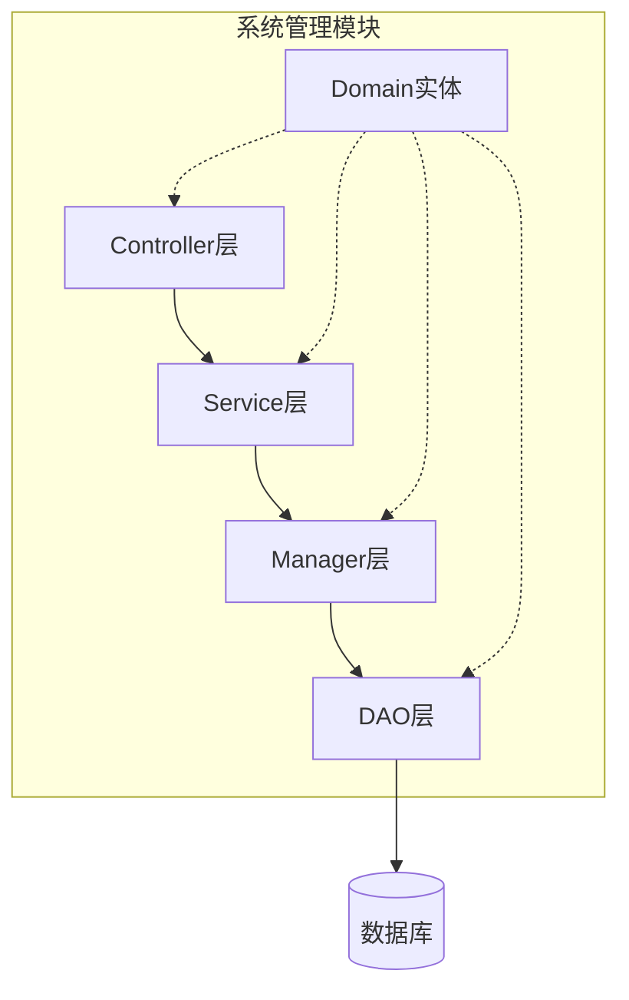
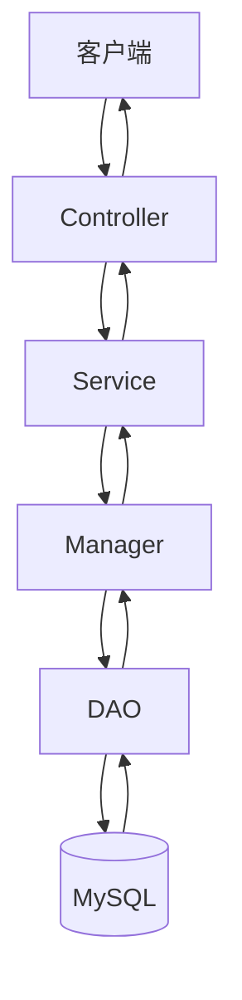
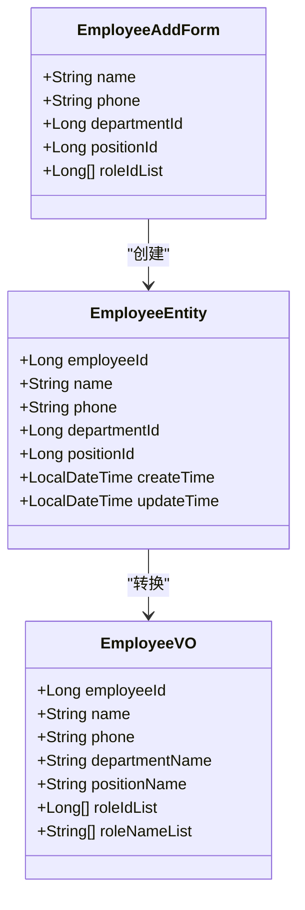
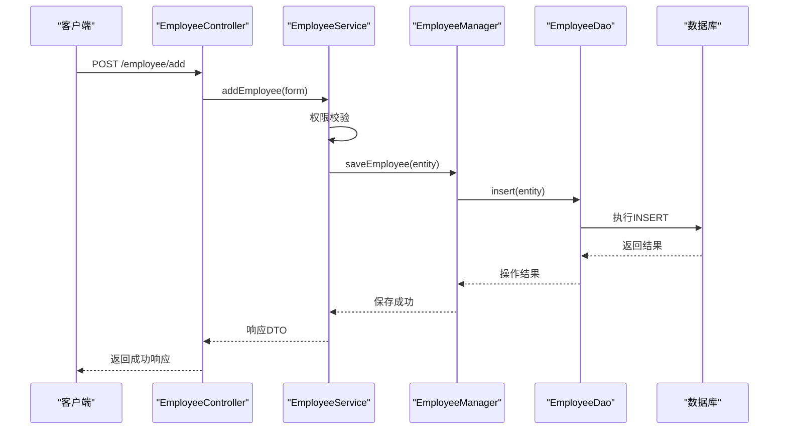
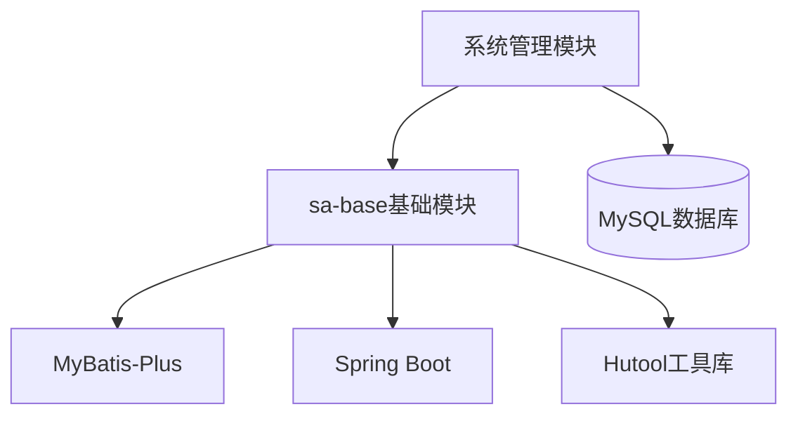

# 系统管理模块(system)

<cite>
**本文档引用文件**  
- [EmployeeService.java](file://smart-admin-api-java17-springboot3/sa-admin/src/main/java/net/lab1024/sa/admin/module/system/employee/service/EmployeeService.java)
- [DepartmentService.java](file://smart-admin-api-java17-springboot3/sa-admin/src/main/java/net/lab1024/sa/admin/module/system/department/service/DepartmentService.java)
- [PositionVO.java](file://smart-admin-api-java17-springboot3/sa-admin/src/main/java/net/lab1024/sa/admin/module/system/position/domain/vo/PositionVO.java)
- [PositionEntity.java](file://smart-admin-api-java17-springboot3/sa-admin/src/main/java/net/lab1024/sa/admin/module/system/position/domain/entity/PositionEntity.java)
- [MyBatisPlugin.java](file://smart-admin-api-java17-springboot3/sa-admin/src/main/java/net/lab1024/sa/admin/module/system/datascope/MyBatisPlugin.java)
- [DataScopeService.java](file://smart-admin-api-java17-springboot3/sa-admin/src/main/java/net/lab1024/sa/admin/module/system/datascope/service/DataScopeService.java)
- [DataScopeController.java](file://smart-admin-api-java17-springboot3/sa-admin/src/main/java/net/lab1024/sa/admin/module/system/datascope/DataScopeController.java)
- [AdminSwaggerTagConst.java](file://smart-admin-api-java17-springboot3/sa-admin/src/main/java/net/lab1024/sa/admin/constant/AdminSwaggerTagConst.java)
- [Service.java.vm](file://smart-admin-api-java17-springboot3/sa-base/src/main/resources/code-generator-template/java/service/Service.java.vm)
- [Manager.java.vm](file://smart-admin-api-java17-springboot3/sa-base/src/main/resources/code-generator-template/java/manager/Manager.java.vm)
- [Dao.java.vm](file://smart-admin-api-java17-springboot3/sa-base/src/main/resources/code-generator-template/java/dao/Dao.java.vm)
</cite>

## 目录
1. [简介](#简介)
2. [项目结构](#项目结构)
3. [核心组件](#核心组件)
4. [架构概述](#架构概述)
5. [详细组件分析](#详细组件分析)
6. [依赖分析](#依赖分析)
7. [性能考虑](#性能考虑)
8. [故障排除指南](#故障排除指南)
9. [结论](#结论)

## 简介
本系统管理模块实现了用户、部门、岗位、菜单、角色等核心管理功能，采用四层架构设计（Controller-Service-Manager-DAO），结合sa-base中的权限框架实现细粒度访问控制。模块通过MyBatis-Plus进行数据库操作，并集成数据权限（DataScope）机制来控制查询结果范围。

## 项目结构
系统管理模块遵循清晰的分层架构，每个功能模块包含controller、service、manager、dao四个层次，以及对应的domain实体类。这种结构实现了关注点分离，提高了代码的可维护性和可测试性。

**图示来源**  
- [EmployeeService.java](file://smart-admin-api-java17-springboot3/sa-admin/src/main/java/net/lab1024/sa/admin/module/system/employee/service/EmployeeService.java)
- [DepartmentService.java](file://smart-admin-api-java17-springboot3/sa-admin/src/main/java/net/lab1024/sa/admin/module/system/department/service/DepartmentService.java)

**章节来源**
- [EmployeeService.java](file://smart-admin-api-java17-springboot3/sa-admin/src/main/java/net/lab1024/sa/admin/module/system/employee/service/EmployeeService.java)
- [DepartmentService.java](file://smart-admin-api-java17-springboot3/sa-admin/src/main/java/net/lab1024/sa/admin/module/system/department/service/DepartmentService.java)

## 核心组件
系统管理模块的核心组件包括员工、部门、岗位、角色等实体的管理功能。这些组件通过四层架构协同工作，从HTTP请求处理到数据库持久化形成完整的调用链路。数据权限机制贯穿整个查询过程，确保用户只能访问其权限范围内的数据。

**章节来源**
- [PositionVO.java](file://smart-admin-api-java17-springboot3/sa-admin/src/main/java/net/lab1024/sa/admin/module/system/position/domain/vo/PositionVO.java)
- [PositionEntity.java](file://smart-admin-api-java17-springboot3/sa-admin/src/main/java/net/lab1024/sa/admin/module/system/position/domain/entity/PositionEntity.java)

## 架构概述
系统采用典型的四层架构模式，各层职责明确：
- **Controller层**：处理RESTful请求，进行参数验证和响应封装
- **Service层**：实现核心业务逻辑和权限校验
- **Manager层**：管理缓存和数据一致性，封装复杂业务规则
- **DAO层**：通过MyBatis-Plus进行数据库操作

这种分层架构确保了代码的高内聚低耦合，便于维护和扩展。

**图示来源**  
- [Service.java.vm](file://smart-admin-api-java17-springboot3/sa-base/src/main/resources/code-generator-template/java/service/Service.java.vm)
- [Manager.java.vm](file://smart-admin-api-java17-springboot3/sa-base/src/main/resources/code-generator-template/java/manager/Manager.java.vm)
- [Dao.java.vm](file://smart-admin-api-java17-springboot3/sa-base/src/main/resources/code-generator-template/java/dao/Dao.java.vm)

## 详细组件分析

### 员工管理分析
员工管理功能展示了从HTTP请求到数据库持久化的完整调用链路。当创建新员工时，请求首先由Controller层接收，经过参数验证后传递给Service层。Service层执行业务逻辑和权限校验，然后调用Manager层处理数据一致性，最后通过DAO层将数据持久化到数据库。

#### 对象导向组件

**图示来源**  
- [PositionEntity.java](file://smart-admin-api-java17-springboot3/sa-admin/src/main/java/net/lab1024/sa/admin/module/system/position/domain/entity/PositionEntity.java)
- [PositionVO.java](file://smart-admin-api-java17-springboot3/sa-admin/src/main/java/net/lab1024/sa/admin/module/system/position/domain/vo/PositionVO.java)

#### API/服务组件

**图示来源**  
- [EmployeeService.java](file://smart-admin-api-java17-springboot3/sa-admin/src/main/java/net/lab1024/sa/admin/module/system/employee/service/EmployeeService.java)
- [DepartmentService.java](file://smart-admin-api-java17-springboot3/sa-admin/src/main/java/net/lab1024/sa/admin/module/system/department/service/DepartmentService.java)

**章节来源**
- [EmployeeService.java](file://smart-admin-api-java17-springboot3/sa-admin/src/main/java/net/lab1024/sa/admin/module/system/employee/service/EmployeeService.java)

## 依赖分析
系统管理模块依赖于sa-base基础模块提供的公共组件，包括配置、工具类、异常处理等。通过合理的依赖管理，实现了代码复用和功能解耦。

**图示来源**  
- [MyBatisPlugin.java](file://smart-admin-api-java17-springboot3/sa-admin/src/main/java/net/lab1024/sa/admin/module/system/datascope/MyBatisPlugin.java)
- [DataScopeService.java](file://smart-admin-api-java17-springboot3/sa-admin/src/main/java/net/lab1024/sa/admin/module/system/datascope/service/DataScopeService.java)

**章节来源**
- [MyBatisPlugin.java](file://smart-admin-api-java17-springboot3/sa-admin/src/main/java/net/lab1024/sa/admin/module/system/datascope/MyBatisPlugin.java)
- [DataScopeService.java](file://smart-admin-api-java17-springboot3/sa-admin/src/main/java/net/lab1024/sa/admin/module/system/datascope/service/DataScopeService.java)

## 性能考虑
系统通过多级缓存机制和数据库连接池优化性能。Manager层负责缓存管理，减少数据库访问频率。MyBatis-Plus的分页插件支持高效的数据查询，避免全表扫描。数据权限机制在SQL层面进行过滤，确保查询效率。

## 故障排除指南
当遇到数据权限相关问题时，应检查MyBatisPlugin的拦截逻辑是否正确应用。对于员工管理功能异常，需要验证Service层的权限校验逻辑和Manager层的数据一致性处理。DAO层的问题通常与数据库连接或SQL映射有关。

**章节来源**
- [DataScopeController.java](file://smart-admin-api-java17-springboot3/sa-admin/src/main/java/net/lab1024/sa/admin/module/system/datascope/DataScopeController.java)
- [AdminSwaggerTagConst.java](file://smart-admin-api-java17-springboot3/sa-admin/src/main/java/net/lab1024/sa/admin/constant/AdminSwaggerTagConst.java)

## 结论
系统管理模块通过四层架构实现了清晰的职责分离，结合sa-base权限框架提供了强大的访问控制能力。数据权限机制确保了数据安全，而合理的分层设计保证了系统的可维护性和可扩展性。该模块为整个系统提供了稳定可靠的管理基础。