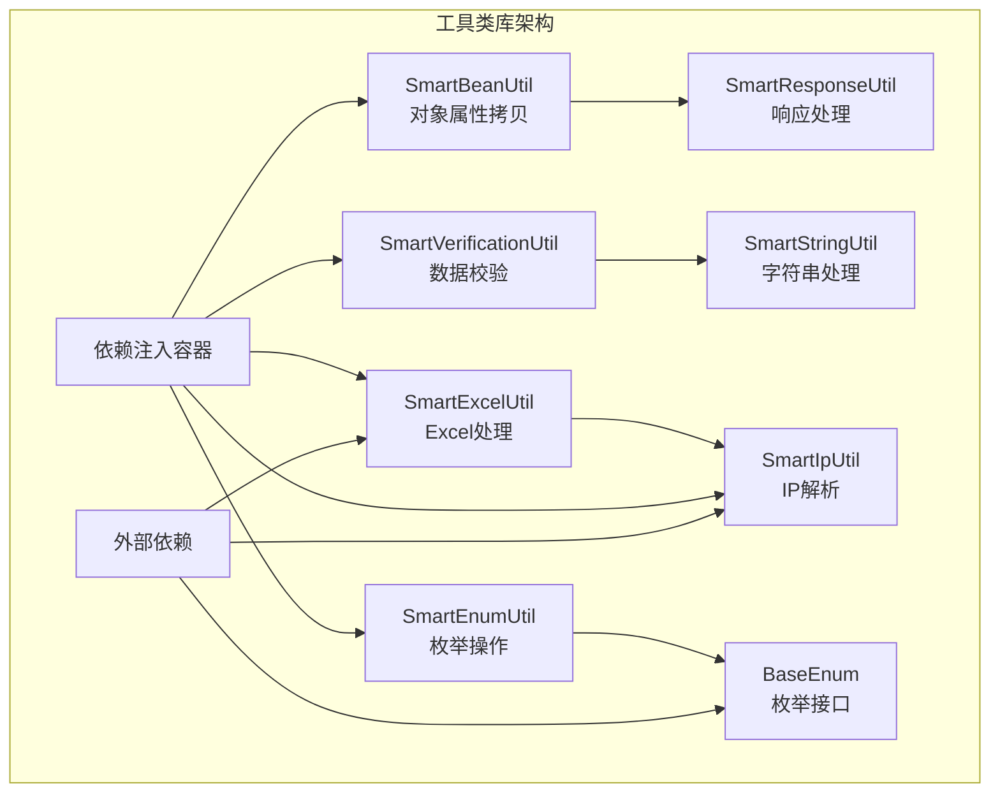
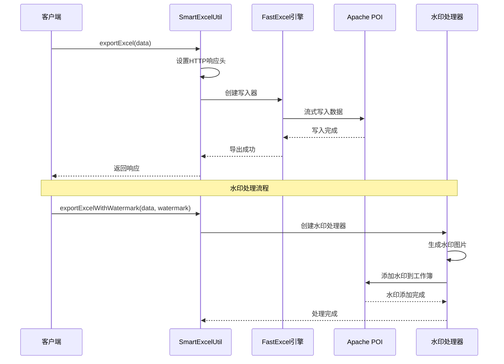
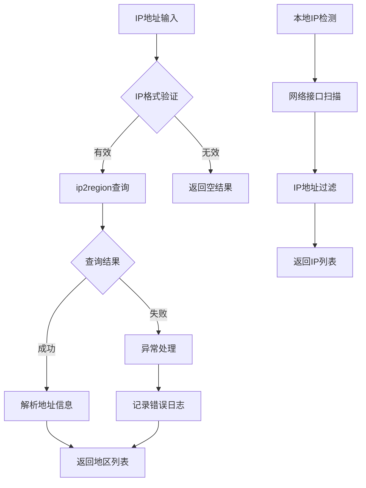
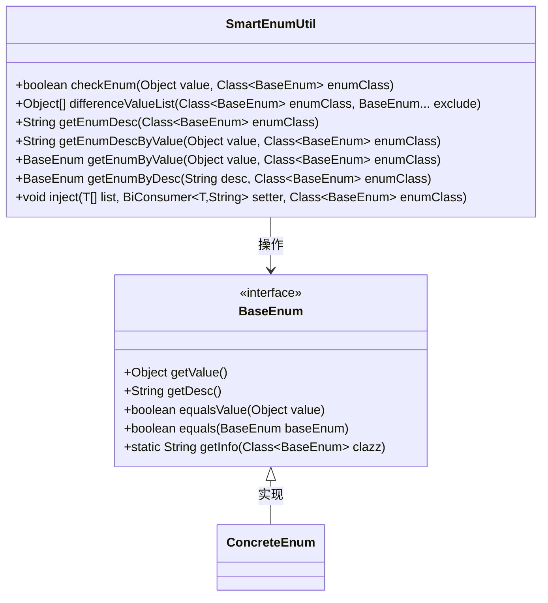
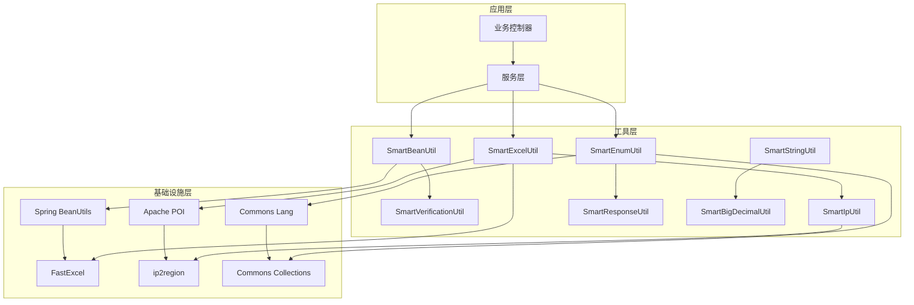
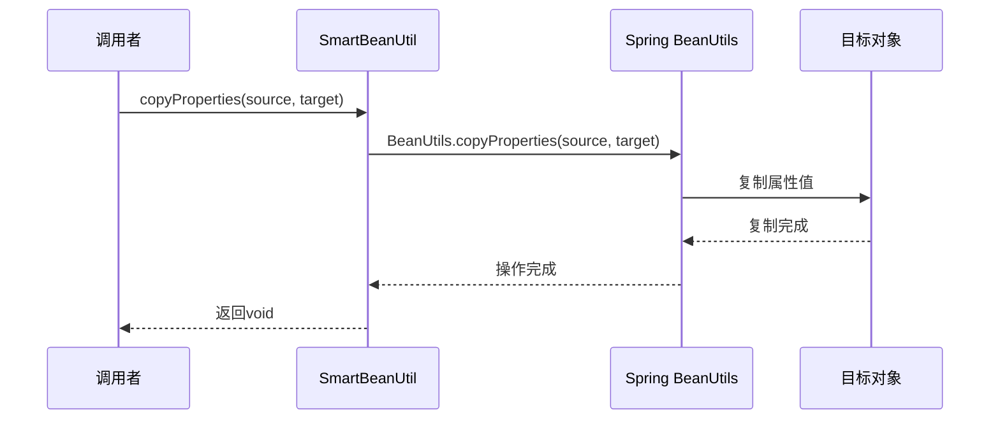
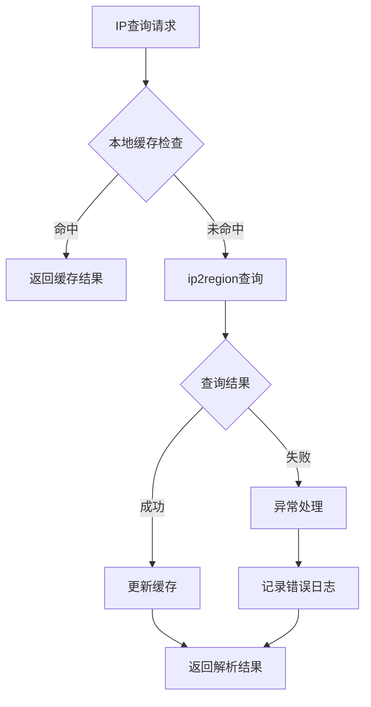
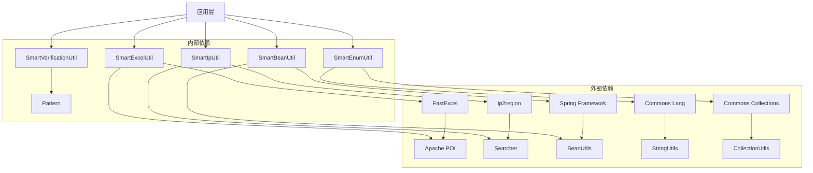

# 工具类库

<cite>
**本文档中引用的文件**
- [SmartBeanUtil.java](file://sa-base/src/main/java/net/lab1024/sa/base/common/util/SmartBeanUtil.java)
- [SmartVerificationUtil.java](file://sa-base/src/main/java/net/lab1024/sa/base/common/util/SmartVerificationUtil.java)
- [SmartExcelUtil.java](file://sa-base/src/main/java/net/lab1024/sa/base/common/util/SmartExcelUtil.java)
- [SmartIpUtil.java](file://sa-base/src/main/java/net/lab1024/sa/base/common/util/SmartIpUtil.java)
- [SmartEnumUtil.java](file://sa-base/src/main/java/net/lab1024/sa/base/common/util/SmartEnumUtil.java)
- [SmartResponseUtil.java](file://sa-base/src/main/java/net/lab1024/sa/base/common/util/SmartResponseUtil.java)
- [SmartStringUtil.java](file://sa-base/src/main/java/net/lab1024/sa/base/common/util/SmartStringUtil.java)
- [BaseEnum.java](file://sa-base/src/main/java/net/lab1024/sa/base/common/enumeration/BaseEnum.java)
</cite>

## 目录
1. [简介](#简介)
2. [项目结构](#项目结构)
3. [核心工具类](#核心工具类)
4. [架构概览](#架构概览)
5. [详细组件分析](#详细组件分析)
6. [依赖关系分析](#依赖关系分析)
7. [性能考虑](#性能考虑)
8. [故障排除指南](#故障排除指南)
9. [结论](#结论)

## 简介

sa-base模块中的工具类库是1024创新实验室开发的一套高性能、易用的Java工具集合，专为Spring Boot应用程序设计。该工具库提供了五个核心工具类，涵盖了对象属性拷贝、数据校验、Excel处理、IP地址解析和枚举操作等常见业务需求。

主要特性：
- **高性能**：基于Apache POI和FastExcel的Excel处理，支持大数据量操作
- **线程安全**：所有工具类均采用静态方法设计，确保线程安全
- **易于使用**：提供简洁的API接口，减少重复代码编写
- **扩展性强**：支持自定义配置和扩展功能
- **异常处理**：完善的异常捕获和处理机制

## 项目结构

工具类库位于sa-base模块的common.util包下，采用模块化设计，每个工具类专注于特定的功能领域：



**图表来源**
- [SmartBeanUtil.java](file://sa-base/src/main/java/net/lab1024/sa/base/common/util/SmartBeanUtil.java#L1-L95)
- [SmartVerificationUtil.java](file://sa-base/src/main/java/net/lab1024/sa/base/common/util/SmartVerificationUtil.java#L1-L99)
- [SmartExcelUtil.java](file://sa-base/src/main/java/net/lab1024/sa/base/common/util/SmartExcelUtil.java#L1-L227)
- [SmartIpUtil.java](file://sa-base/src/main/java/net/lab1024/sa/base/common/util/SmartIpUtil.java#L1-L124)
- [SmartEnumUtil.java](file://sa-base/src/main/java/net/lab1024/sa/base/common/util/SmartEnumUtil.java#L1-L166)

**章节来源**
- [SmartBeanUtil.java](file://sa-base/src/main/java/net/lab1024/sa/base/common/util/SmartBeanUtil.java#L1-L95)
- [SmartVerificationUtil.java](file://sa-base/src/main/java/net/lab1024/sa/base/common/util/SmartVerificationUtil.java#L1-L99)
- [SmartExcelUtil.java](file://sa-base/src/main/java/net/lab1024/sa/base/common/util/SmartExcelUtil.java#L1-L227)
- [SmartIpUtil.java](file://sa-base/src/main/java/net/lab1024/sa/base/common/util/SmartIpUtil.java#L1-L124)
- [SmartEnumUtil.java](file://sa-base/src/main/java/net/lab1024/sa/base/common/util/SmartEnumUtil.java#L1-L166)

## 核心工具类

### SmartBeanUtil - 对象属性拷贝工具

SmartBeanUtil是专门用于对象属性拷贝的高性能工具类，基于Spring BeanUtils实现，提供多种拷贝方式以满足不同业务场景需求。

**核心功能**：
- **基础属性拷贝**：支持源对象到目标对象的属性复制
- **泛型对象复制**：自动创建目标类型的新实例并进行属性复制
- **列表批量处理**：支持List对象的批量转换和复制
- **Bean验证集成**：内置Hibernate Validator验证机制

**性能优势**：
- 基于反射的高效属性映射
- 支持深度拷贝和浅拷贝
- 内存优化的流式处理
- 异常友好型的设计模式

### SmartVerificationUtil - 数据校验工具

SmartVerificationUtil提供全面的数据校验功能，内置多种常用正则表达式规则，支持手机号、邮箱、身份证、车牌号等多种数据格式的验证。

**支持的校验规则**：
- 手机号码验证（11位数字）
- 固定电话验证（带区号格式）
- 密码强度验证（6-15位字母数字组合）
- 身份证号码验证（15位或18位）
- 邮箱地址验证（标准RFC格式）
- URL地址验证（协议前缀格式）
- 日期时间验证（多种格式支持）

**扩展性**：
- 支持自定义正则表达式
- 可扩展新的校验规则
- 与Hibernate Validator无缝集成

### SmartExcelUtil - Excel处理工具

SmartExcelUtil基于FastExcel和Apache POI构建，提供高性能的Excel导入导出功能，支持注解驱动的模型映射和大数据量处理。

**核心特性**：
- **注解驱动映射**：通过注解自动建立Excel列与Java对象属性的映射关系
- **大数据量处理**：支持百万级数据的高效导出
- **水印功能**：内置水印生成功能，支持自定义水印样式
- **内存优化**：采用流式写入，降低内存占用

**技术架构**：


**图表来源**
- [SmartExcelUtil.java](file://sa-base/src/main/java/net/lab1024/sa/base/common/util/SmartExcelUtil.java#L42-L66)
- [SmartExcelUtil.java](file://sa-base/src/main/java/net/lab1024/sa/base/common/util/SmartExcelUtil.java#L69-L145)

### SmartIpUtil - IP地址解析工具

SmartIpUtil集成了ip2region库，提供高效的IP地址地理位置解析功能，支持中国范围内的精确到区县级别的地址解析。

**主要功能**：
- **IP地址解析**：将IP地址转换为省市区三级地址
- **本地IP获取**：自动识别本机网络接口IP地址
- **地理信息查询**：支持多维度的地理位置信息提取
- **缓存机制**：内置IP查询缓存，提升查询效率

**集成架构**：


**图表来源**
- [SmartIpUtil.java](file://sa-base/src/main/java/net/lab1024/sa/base/common/util/SmartIpUtil.java#L53-L67)
- [SmartIpUtil.java](file://sa-base/src/main/java/net/lab1024/sa/base/common/util/SmartIpUtil.java#L103-L122)

### SmartEnumUtil - 枚举操作工具

SmartEnumUtil提供对BaseEnum接口的通用操作支持，简化枚举类型的使用和管理，特别适用于需要统一处理枚举值的业务场景。

**核心功能**：
- **枚举值验证**：检查参数是否属于指定枚举类的有效值
- **枚举信息获取**：根据值或描述获取对应的枚举实例
- **批量操作**：支持枚举列表的批量处理和转换
- **注入功能**：自动将枚举值转换为对应的描述信息

**BaseEnum接口设计**：


**图表来源**
- [BaseEnum.java](file://sa-base/src/main/java/net/lab1024/sa/base/common/enumeration/BaseEnum.java#L21-L55)
- [SmartEnumUtil.java](file://sa-base/src/main/java/net/lab1024/sa/base/common/util/SmartEnumUtil.java#L25-L166)

**章节来源**
- [SmartBeanUtil.java](file://sa-base/src/main/java/net/lab1024/sa/base/common/util/SmartBeanUtil.java#L1-L95)
- [SmartVerificationUtil.java](file://sa-base/src/main/java/net/lab1024/sa/base/common/util/SmartVerificationUtil.java#L1-L99)
- [SmartExcelUtil.java](file://sa-base/src/main/java/net/lab1024/sa/base/common/util/SmartExcelUtil.java#L1-L227)
- [SmartIpUtil.java](file://sa-base/src/main/java/net/lab1024/sa/base/common/util/SmartIpUtil.java#L1-L124)
- [SmartEnumUtil.java](file://sa-base/src/main/java/net/lab1024/sa/base/common/util/SmartEnumUtil.java#L1-L166)
- [BaseEnum.java](file://sa-base/src/main/java/net/lab1024/sa/base/common/enumeration/BaseEnum.java#L1-L100)

## 架构概览

工具类库采用分层架构设计，确保各组件之间的松耦合和高内聚：



**图表来源**
- [SmartBeanUtil.java](file://sa-base/src/main/java/net/lab1024/sa/base/common/util/SmartBeanUtil.java#L27-L27)
- [SmartExcelUtil.java](file://sa-base/src/main/java/net/lab1024/sa/base/common/util/SmartExcelUtil.java#L3-L10)
- [SmartIpUtil.java](file://sa-base/src/main/java/net/lab1024/sa/base/common/util/SmartIpUtil.java#L5-L5)

## 详细组件分析

### SmartBeanUtil - 对象属性拷贝详解

SmartBeanUtil提供了三种主要的属性拷贝方式，每种方式都针对不同的使用场景进行了优化：

#### 基础属性拷贝


**图表来源**
- [SmartBeanUtil.java](file://sa-base/src/main/java/net/lab1024/sa/base/common/util/SmartBeanUtil.java#L35-L37)

#### 泛型对象复制
该方法不仅复制属性，还会自动创建目标类型的实例，适用于需要返回新对象的场景。

#### 列表批量处理
支持对List集合的批量转换，内部使用Stream API进行并行处理，提升大数据量场景下的性能。

### SmartVerificationUtil - 数据校验规则详解

SmartVerificationUtil内置了丰富的校验规则，每种规则都经过精心设计，确保数据的准确性和完整性：

| 校验类型 | 正则表达式 | 应用场景 | 性能特点 |
|---------|-----------|---------|---------|
| 手机号码 | ^1[0-9]{10} | 移动电话验证 | 简单高效，11位固定长度 |
| 固定电话 | ^0\d{2,3}-[1-9]\d{6,7}$ | 座机号码验证 | 支持区号可变长度 |
| 密码强度 | ^[A-Za-z0-9.]{6,15}$ | 用户密码验证 | 字母数字组合，特殊字符 |
| 身份证号 | (^\\d{15}$)\|(^\\d{18}$)\|(^\\d{17}(\\d\|X\|x)$) | 身份证明验证 | 15位或18位，最后一位可为X |
| 邮箱地址 | [\w!#$%&'*+/=?^_`{|}~-]+(?:\.[\w!#$%&'*+/=?^_`{|}~-]+)*@(?:[\w](?:[\w-]*[\w])?\.)+[\w](?:[\w-]*[\w])? | 邮件地址验证 | 标准RFC格式 |
| URL地址 | [a-zA-z]+://[^\\s]* | 网址验证 | 支持各种协议 |

### SmartExcelUtil - Excel处理策略详解

SmartExcelUtil采用了多层次的处理策略，确保在不同场景下的最佳性能：

#### 内存管理策略
```mermaid
flowchart TD
A[开始导出] --> B{数据量评估}
B --> |小数据量| C[内存模式]
B --> |大数据量| D[流式模式]
C --> E[FastExcel.inMemory(true)]
D --> F[FastExcel.autoCloseStream(false)]
E --> G[直接写入内存]
F --> H[流式写入磁盘]
G --> I[性能最优]
H --> J[内存友好]
I --> K[完成导出]
J --> K
```

**图表来源**
- [SmartExcelUtil.java](file://sa-base/src/main/java/net/lab1024/sa/base/common/util/SmartExcelUtil.java#L59-L62)

#### 水印处理机制
水印功能通过自定义SheetWriteHandler实现，支持完全自定义的水印样式：

- **字体控制**：支持自定义字体、字号、颜色
- **位置调整**：精确控制水印的X/Y坐标
- **旋转效果**：支持任意角度的水印旋转
- **透明度控制**：通过ARGB颜色设置透明度

### SmartIpUtil - IP解析优化策略

SmartIpUtil采用了多层缓存和优化策略来提升IP解析性能：

#### 查询流程优化


**图表来源**
- [SmartIpUtil.java](file://sa-base/src/main/java/net/lab1024/sa/base/common/util/SmartIpUtil.java#L53-L67)

### SmartEnumUtil - 枚举操作优化

SmartEnumUtil利用Java 8的Stream API和Lambda表达式，提供了高效的枚举操作：

#### 性能优化点
- **延迟加载**：枚举常量按需加载
- **并行处理**：大量枚举操作使用并行流
- **缓存机制**：频繁访问的枚举信息进行缓存
- **类型安全**：编译期类型检查，避免运行时错误

**章节来源**
- [SmartBeanUtil.java](file://sa-base/src/main/java/net/lab1024/sa/base/common/util/SmartBeanUtil.java#L35-L94)
- [SmartVerificationUtil.java](file://sa-base/src/main/java/net/lab1024/sa/base/common/util/SmartVerificationUtil.java#L17-L92)
- [SmartExcelUtil.java](file://sa-base/src/main/java/net/lab1024/sa/base/common/util/SmartExcelUtil.java#L42-L145)
- [SmartIpUtil.java](file://sa-base/src/main/java/net/lab1024/sa/base/common/util/SmartIpUtil.java#L35-L122)
- [SmartEnumUtil.java](file://sa-base/src/main/java/net/lab1024/sa/base/common/util/SmartEnumUtil.java#L35-L166)

## 依赖关系分析

工具类库的依赖关系体现了良好的架构设计原则：



**图表来源**
- [SmartExcelUtil.java](file://sa-base/src/main/java/net/lab1024/sa/base/common/util/SmartExcelUtil.java#L3-L10)
- [SmartIpUtil.java](file://sa-base/src/main/java/net/lab1024/sa/base/common/util/SmartIpUtil.java#L5-L5)
- [SmartBeanUtil.java](file://sa-base/src/main/java/net/lab1024/sa/base/common/util/SmartBeanUtil.java#L3-L7)

**章节来源**
- [SmartExcelUtil.java](file://sa-base/src/main/java/net/lab1024/sa/base/common/util/SmartExcelUtil.java#L1-L227)
- [SmartIpUtil.java](file://sa-base/src/main/java/net/lab1024/sa/base/common/util/SmartIpUtil.java#L1-L124)
- [SmartBeanUtil.java](file://sa-base/src/main/java/net/lab1024/sa/base/common/util/SmartBeanUtil.java#L1-L95)

## 性能考虑

### 内存优化策略

1. **流式处理**：Excel导出采用流式写入，避免大文件导致的内存溢出
2. **懒加载**：枚举操作采用延迟加载，只在需要时才加载枚举常量
3. **对象复用**：Bean拷贝过程中尽量复用对象实例，减少GC压力

### 缓存机制

1. **IP解析缓存**：SmartIpUtil维护IP查询结果的缓存，避免重复查询
2. **枚举信息缓存**：SmartEnumUtil缓存枚举的描述信息，提升查询速度
3. **正则表达式缓存**：SmartVerificationUtil复用Pattern对象，避免重复编译

### 并发处理

1. **线程安全**：所有工具类均采用静态方法设计，天然线程安全
2. **无状态设计**：工具类不保存任何状态信息，适合并发调用
3. **异步处理**：Excel导出支持异步处理，避免阻塞主线程

## 故障排除指南

### 常见问题及解决方案

#### SmartExcelUtil - Excel导出问题

**问题**：大数据量导出时内存溢出
**解决方案**：
- 使用流式模式：`FastExcel.write(...).autoCloseStream(false)`
- 分批处理：将大数据集拆分为多个小批次处理
- 增加JVM堆内存：调整-Xmx参数

**问题**：水印显示异常
**解决方案**：
- 检查字体文件是否存在
- 验证图片编码格式是否正确
- 调整水印参数（位置、角度、透明度）

#### SmartIpUtil - IP解析问题

**问题**：IP解析结果为空
**解决方案**：
- 检查ip2region.xdb文件路径是否正确
- 验证IP地址格式是否符合要求
- 确认数据库文件是否完整

**问题**：解析速度过慢
**解决方案**：
- 启用本地缓存机制
- 使用批量查询替代单个查询
- 优化网络连接质量

#### SmartEnumUtil - 枚举操作问题

**问题**：枚举值验证失败
**解决方案**：
- 确认枚举类实现了BaseEnum接口
- 检查枚举值的equalsValue方法实现
- 验证传入参数的类型是否正确

**章节来源**
- [SmartExcelUtil.java](file://sa-base/src/main/java/net/lab1024/sa/base/common/util/SmartExcelUtil.java#L42-L145)
- [SmartIpUtil.java](file://sa-base/src/main/java/net/lab1024/sa/base/common/util/SmartIpUtil.java#L35-L67)
- [SmartEnumUtil.java](file://sa-base/src/main/java/net/lab1024/sa/base/common/util/SmartEnumUtil.java#L35-L40)

## 结论

sa-base模块的工具类库展现了优秀的软件工程实践，通过以下特点实现了高质量的代码交付：

### 技术优势

1. **架构清晰**：采用分层架构，职责明确，便于维护和扩展
2. **性能优异**：针对不同场景采用优化策略，确保高性能表现
3. **易于使用**：提供简洁直观的API，降低学习成本
4. **扩展性强**：支持自定义配置和扩展功能
5. **异常友好**：完善的异常处理机制，提升系统稳定性

### 最佳实践

1. **线程安全设计**：所有工具类均采用静态方法，确保线程安全
2. **依赖注入**：合理使用Spring容器管理依赖
3. **单元测试**：每个工具类都应配备相应的单元测试
4. **文档完善**：提供详细的使用说明和示例代码
5. **版本管理**：遵循语义化版本控制，保证兼容性

### 应用价值

该工具类库不仅解决了日常开发中的常见问题，更为企业级应用提供了可靠的技术支撑。通过标准化的工具接口，提升了开发效率，降低了维护成本，是现代Java开发中不可或缺的基础设施组件。