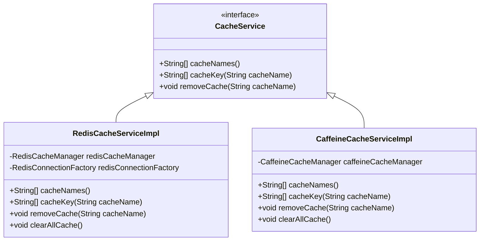
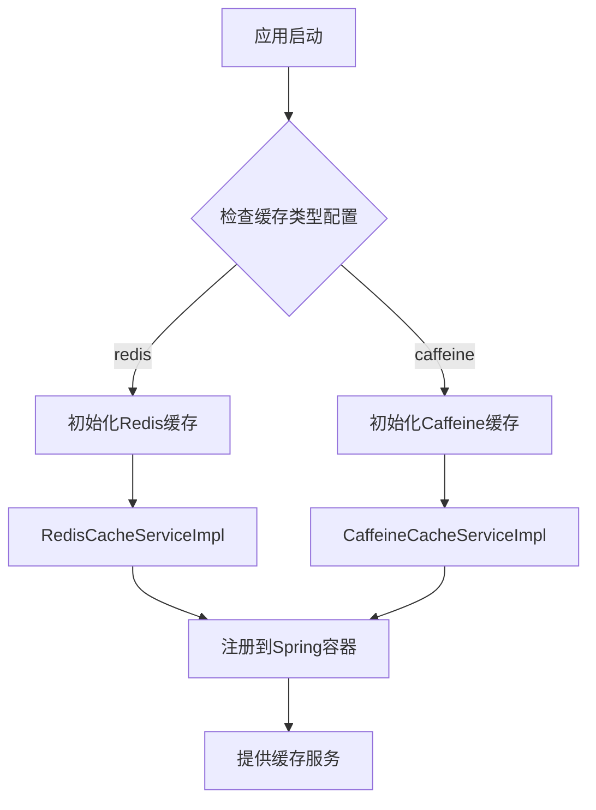
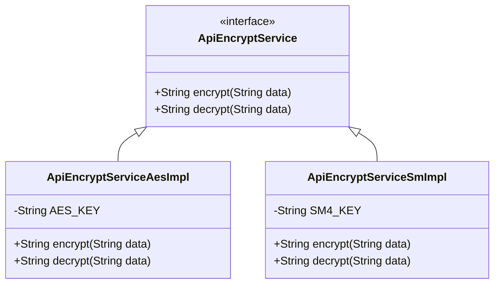
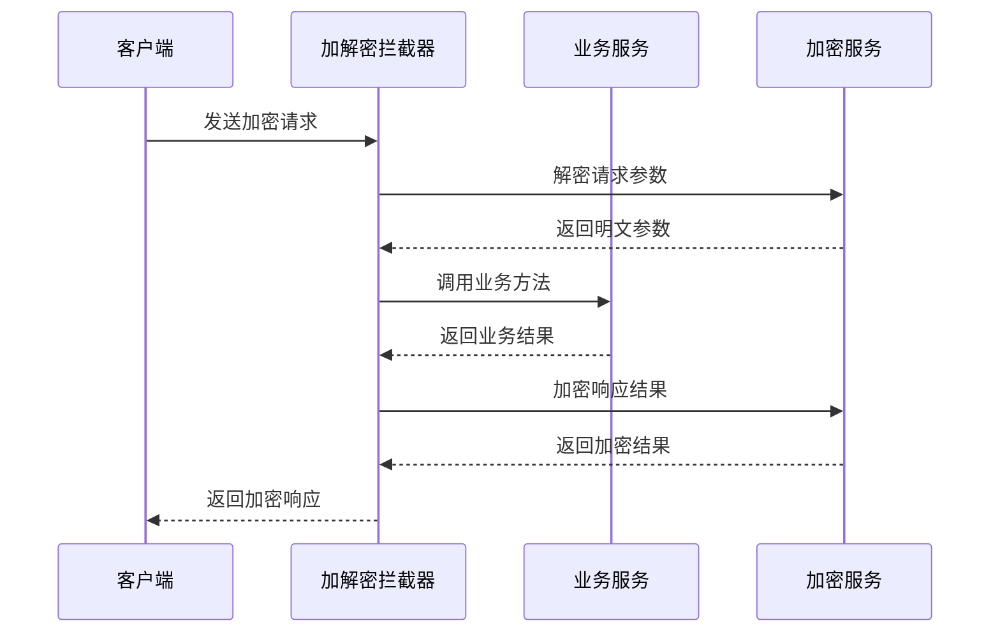
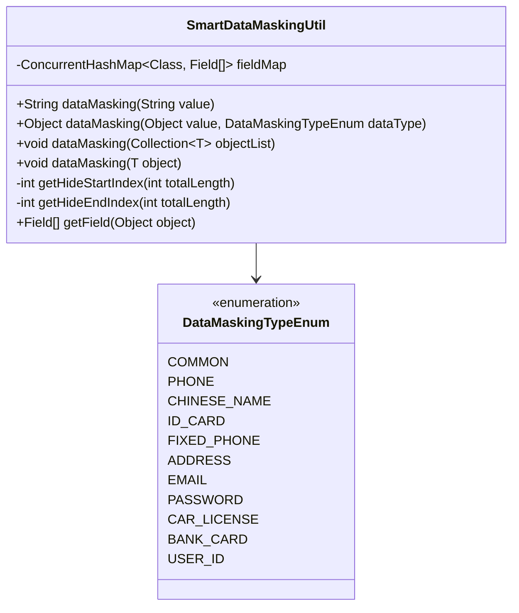
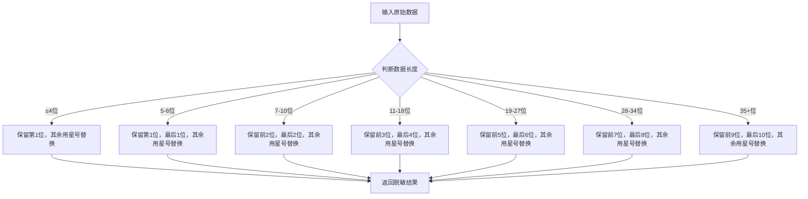
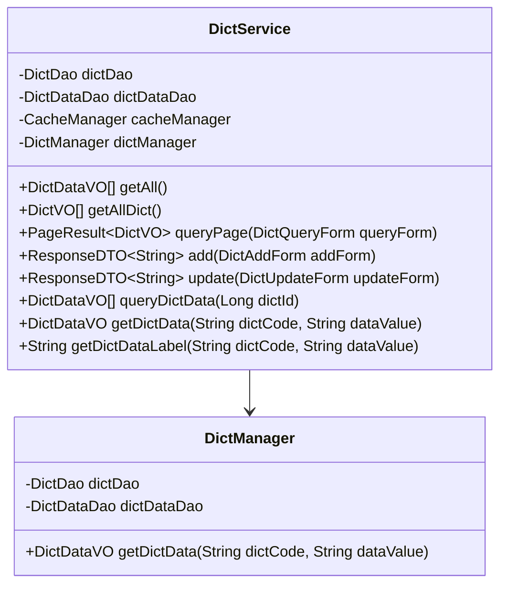
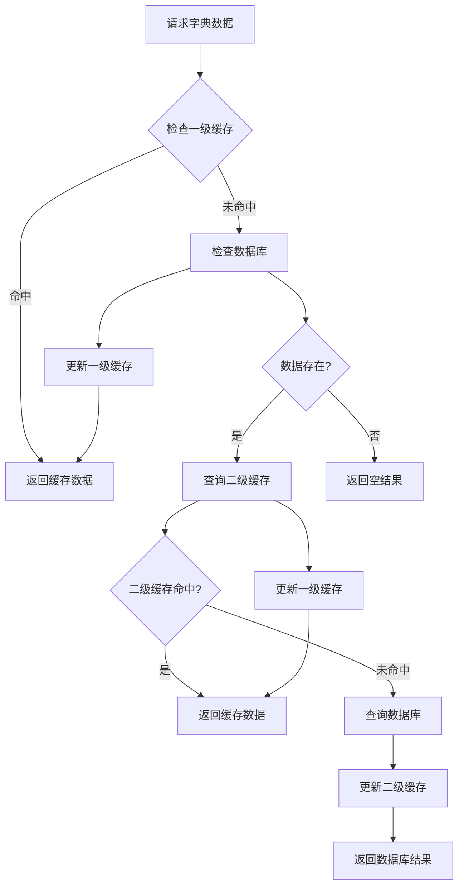
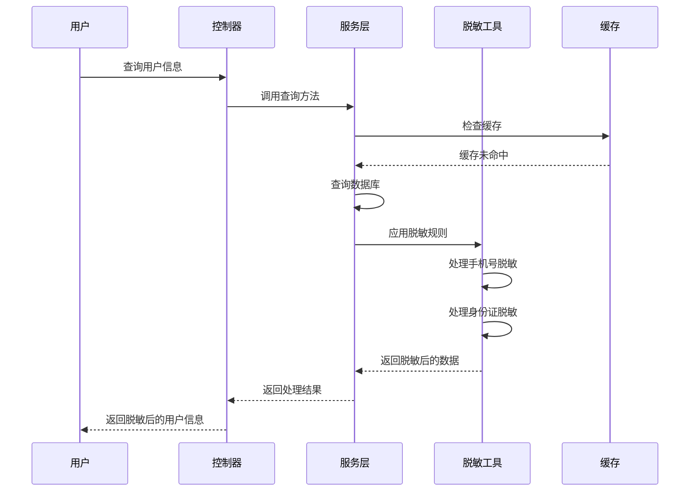
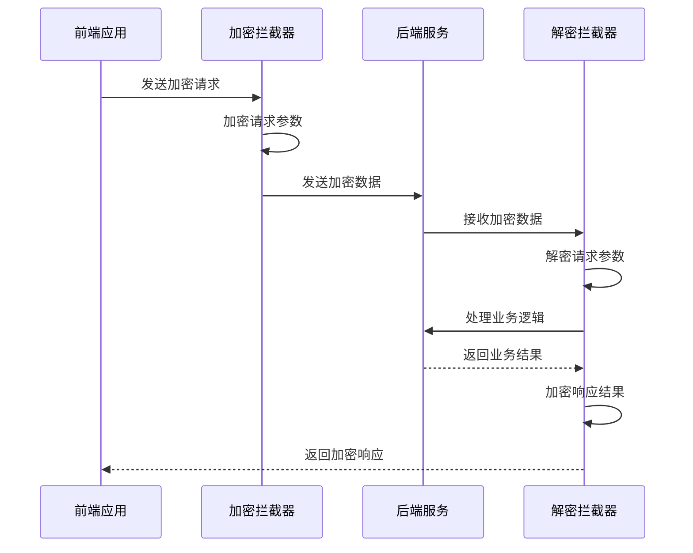

# 通用服务模块

<cite>
**本文档引用的文件**
- [CacheService.java](file://sa-base/src/main/java/net/lab1024.sa.base/module/support/cache/CacheService.java)
- [RedisCacheServiceImpl.java](file://sa-base/src/main/java/net/lab1024.sa.base/module/support/cache/RedisCacheServiceImpl.java)
- [CaffeineCacheServiceImpl.java](file://sa-base/src/main/java/net/lab1024.sa.base/module/support/cache/CaffeineCacheServiceImpl.java)
- [CacheConfig.java](file://sa-base/src/main/java/net/lab1024.sa.base/config/CacheConfig.java)
- [ApiEncryptService.java](file://sa-base/src/main/java/net/lab1024.sa.base/module/support/apiencrypt/service/ApiEncryptService.java)
- [ApiEncryptServiceAesImpl.java](file://sa-base/src/main/java/net/lab1024.sa.base/module/support/apiencrypt/service/ApiEncryptServiceAesImpl.java)
- [ApiEncryptServiceSmImpl.java](file://sa-base/src/main/java/net/lab1024.sa.base/module/support/apiencrypt/service/ApiEncryptServiceSmImpl.java)
- [ApiEncrypt.java](file://sa-base/src/main/java/net/lab1024.sa.base/module/support/apiencrypt/annotation/ApiEncrypt.java)
- [ApiDecrypt.java](file://sa-base/src/main/java/net/lab1024.sa.base/module/support/apiencrypt/annotation/ApiDecrypt.java)
- [SmartDataMaskingUtil.java](file://sa-base/src/main/java/net/lab1024.sa.base/module/support/datamasking/SmartDataMaskingUtil.java)
- [DataMaskingTypeEnum.java](file://sa-base/src/main/java/net/lab1024.sa.base/module/support/datamasking/DataMaskingTypeEnum.java)
- [DictService.java](file://sa-base/src/main/java/net/lab1024.sa.base/module/support/dict/service/DictService.java)
- [DictManager.java](file://sa-base/src/main/java/net/lab1024.sa.base/module/support/dict/manager/DictManager.java)
- [CacheKeyConst.java](file://sa-base/src/main/java/net/lab1024.sa.base/constant/CacheKeyConst.java)
- [AdminDataMaskingDemoController.java](file://sa-admin/src/main/java/net/lab1024.sa.admin/module/system/support/AdminDataMaskingDemoController.java)
- [AdminApiEncryptController.java](file://sa-admin/src/main/java/net/lab1024.sa.admin/module/system/support/AdminApiEncryptController.java)
</cite>

## 目录
1. [概述](#概述)
2. [缓存服务模块](#缓存服务模块)
3. [API加密服务模块](#api加密服务模块)
4. [数据脱敏服务模块](#数据脱敏服务模块)
5. [数据字典服务模块](#数据字典服务模块)
6. [业务应用场景](#业务应用场景)
7. [配置与使用指南](#配置与使用指南)
8. [总结](#总结)

## 概述

sa-base模块是Smart Admin框架的核心基础模块，提供了通用的服务组件，包括缓存服务、API加密、数据脱敏和数据字典等功能。这些服务为整个系统的稳定运行和安全性提供了重要保障。

## 缓存服务模块

### CacheService接口设计

CacheService是缓存服务的核心接口，定义了统一的缓存操作规范：



**图表来源**
- [CacheService.java](file://sa-base/src/main/java/net/lab1024.sa.base/module/support/cache/CacheService.java#L17-L34)
- [RedisCacheServiceImpl.java](file://sa-base/src/main/java/net/lab1024.sa.base/module/support/cache/RedisCacheServiceImpl.java#L24-L87)
- [CaffeineCacheServiceImpl.java](file://sa-base/src/main/java/net/lab1024.sa.base/module/support/cache/CaffeineCacheServiceImpl.java#L24-L71)

### RedisCacheServiceImpl实现

RedisCacheServiceImpl基于Spring Data Redis实现，提供分布式缓存功能：

**核心特性：**
- 支持Redis集群和单机模式
- 提供完整的缓存操作API
- 支持缓存键值的批量查询
- 提供缓存清空的批量操作

**适用场景：**
- 分布式系统中的会话管理
- 全局配置缓存
- 用户权限信息缓存
- 频繁访问的数据缓存

### CaffeineCacheServiceImpl实现

CaffeineCacheServiceImpl基于本地内存缓存，提供高性能的缓存服务：

**核心特性：**
- 基于本地内存，访问速度快
- 支持LRU等缓存淘汰策略
- 内存友好，适合小规模数据
- 无网络延迟，响应时间极短

**适用场景：**
- 小规模配置数据缓存
- 临时计算结果缓存
- 频繁读取的小型数据集
- 对性能要求极高的场景

### 缓存配置机制

系统支持多种缓存配置方式：



**图表来源**
- [CacheConfig.java](file://sa-base/src/main/java/net/lab1024.sa.base/config/CacheConfig.java#L33-L70)

**章节来源**
- [CacheService.java](file://sa-base/src/main/java/net/lab1024.sa.base/module/support/cache/CacheService.java#L1-L34)
- [RedisCacheServiceImpl.java](file://sa-base/src/main/java/net/lab1024.sa.base/module/support/cache/RedisCacheServiceImpl.java#L1-L87)
- [CaffeineCacheServiceImpl.java](file://sa-base/src/main/java/net/lab1024.sa.base/module/support/cache/CaffeineCacheServiceImpl.java#L1-L71)
- [CacheConfig.java](file://sa-base/src/main/java/net/lab1024.sa.base/config/CacheConfig.java#L1-L70)

## API加密服务模块

### ApiEncryptService接口设计

ApiEncryptService定义了API加解密的核心接口：



**图表来源**
- [ApiEncryptService.java](file://sa-base/src/main/java/net/lab1024.sa.base/module/support/apiencrypt/service/ApiEncryptService.java#L13-L30)
- [ApiEncryptServiceAesImpl.java](file://sa-base/src/main/java/net/lab1024.sa.base/module/support/apiencrypt/service/ApiEncryptServiceAesImpl.java#L30-L40)
- [ApiEncryptServiceSmImpl.java](file://sa-base/src/main/java/net/lab1024.sa.base/module/support/apiencrypt/service/ApiEncryptServiceSmImpl.java#L25-L42)

### AES加密算法实现

AES加密服务支持以下特性：
- 支持128位、192位和256位密钥长度
- 使用CBC模式和PKCS5Padding填充
- 密钥长度固定为16字节
- 前端和后端密钥兼容

### 国密SM2/SM4算法实现

国密算法支持：
- SM4对称加密算法
- 支持128位密钥
- 符合中国国家密码标准
- 前后端密钥兼容性

### @ApiEncrypt和@ApiDecrypt注解

这两个注解提供了声明式的API加解密功能：

**使用方式：**
- 在Controller类级别添加注解，影响整个类
- 在方法级别添加注解，仅影响特定方法
- 支持组合使用，同时实现请求加密和响应加密

### 加密流程



**图表来源**
- [ApiEncrypt.java](file://sa-base/src/main/java/net/lab1024.sa.base/module/support/apiencrypt/annotation/ApiEncrypt.java#L17-L20)
- [ApiDecrypt.java](file://sa-base/src/main/java/net/lab1024.sa.base/module/support/apiencrypt/annotation/ApiDecrypt.java#L17-L20)

**章节来源**
- [ApiEncryptService.java](file://sa-base/src/main/java/net/lab1024.sa.base/module/support/apiencrypt/service/ApiEncryptService.java#L1-L31)
- [ApiEncryptServiceAesImpl.java](file://sa-base/src/main/java/net/lab1024.sa.base/module/support/apiencrypt/service/ApiEncryptServiceAesImpl.java#L1-L40)
- [ApiEncryptServiceSmImpl.java](file://sa-base/src/main/java/net/lab1024.sa.base/module/support/apiencrypt/service/ApiEncryptServiceSmImpl.java#L1-L42)
- [ApiEncrypt.java](file://sa-base/src/main/java/net/lab1024.sa.base/module/support/apiencrypt/annotation/ApiEncrypt.java#L1-L20)
- [ApiDecrypt.java](file://sa-base/src/main/java/net/lab1024.sa.base/module/support/apiencrypt/annotation/ApiDecrypt.java#L1-L20)

## 数据脱敏服务模块

### SmartDataMaskingUtil工具类

SmartDataMaskingUtil提供了强大的数据脱敏功能：



**图表来源**
- [SmartDataMaskingUtil.java](file://sa-base/src/main/java/net/lab1024.sa.base/module/support/datamasking/SmartDataMaskingUtil.java#L28-L216)
- [DataMaskingTypeEnum.java](file://sa-base/src/main/java/net/lab1024.sa.base/module/support/datamasking/DataMaskingTypeEnum.java#L19-L41)

### 支持的脱敏类型

| 脱敏类型 | 描述 | 脱敏规则 |
|---------|------|----------|
| PHONE | 手机号 | 保留前3位和后4位，中间用星号替换 |
| ID_CARD | 身份证号 | 保留前6位和后4位，中间用星号替换 |
| EMAIL | 电子邮箱 | 保留用户名部分，域名部分用星号替换 |
| BANK_CARD | 银行卡号 | 保留前4位和后4位，中间用星号替换 |
| ADDRESS | 地址 | 保留前6位，后面部分用星号替换 |
| PASSWORD | 密码 | 全部用星号替换 |
| CAR_LICENSE | 车牌号 | 保留省份简称和第一位，其余用星号替换 |
| USER_ID | 用户ID | 使用专门的脱敏算法 |

### 脱敏算法实现

脱敏算法根据数据长度动态调整脱敏范围：



**图表来源**
- [SmartDataMaskingUtil.java](file://sa-base/src/main/java/net/lab1024.sa.base/module/support/datamasking/SmartDataMaskingUtil.java#L133-L171)

### 在VO对象中的应用

数据脱敏可以通过注解方式在VO对象中自动应用：

**使用示例：**
```java
@Data
public class UserInfoVO {
    @DataMasking(DataMaskingTypeEnum.USER_ID)
    private Long userId;
    
    @DataMasking(DataMaskingTypeEnum.PHONE)
    private String phone;
    
    @DataMasking(DataMaskingTypeEnum.ID_CARD)
    private String idCard;
    
    @DataMasking
    private String otherSensitiveInfo;
}
```

**章节来源**
- [SmartDataMaskingUtil.java](file://sa-base/src/main/java/net/lab1024.sa.base/module/support/datamasking/SmartDataMaskingUtil.java#L1-L216)
- [DataMaskingTypeEnum.java](file://sa-base/src/main/java/net/lab1024.sa.base/module/support/datamasking/DataMaskingTypeEnum.java#L1-L41)

## 数据字典服务模块

### DictService服务架构



**图表来源**
- [DictService.java](file://sa-base/src/main/java/net/lab1024.sa.base/module/support/dict/service/DictService.java#L37-L276)
- [DictManager.java](file://sa-base/src/main/java/net/lab1024.sa.base/module/support/dict/manager/DictManager.java#L24-L48)

### 缓存机制

数据字典采用多层缓存机制：



**图表来源**
- [DictManager.java](file://sa-base/src/main/java/net/lab1024.sa.base/module/support/dict/manager/DictManager.java#L36-L45)

### 前端dict-plugin集成

前端通过dict-plugin插件与后端字典服务集成：

**插件功能：**
- 提供全局字典数据访问
- 支持字典值到标签的转换
- 缓存机制优化性能
- 支持异步加载

**使用方式：**
```javascript
// 获取字典标签
const label = $dictPlugin.getDataLabels('user_status', '1');

// 在Vue组件中使用
setup() {
  const userStatus = ref('');
  userStatus.value = $dictPlugin.getDataLabels('user_status', userInfo.status);
  return { userStatus };
}
```

**章节来源**
- [DictService.java](file://sa-base/src/main/java/net/lab1024.sa.base/module/support/dict/service/DictService.java#L1-L276)
- [DictManager.java](file://sa-base/src/main/java/net/lab1024.sa.base/module/support/dict/manager/DictManager.java#L1-L48)
- [CacheKeyConst.java](file://sa-base/src/main/java/net/lab1024.sa.base/constant/CacheKeyConst.java#L1-L21)

## 业务应用场景

### 用户信息查询时的手机号脱敏

在用户信息查询场景中，系统自动对敏感信息进行脱敏处理：



**图表来源**
- [AdminDataMaskingDemoController.java](file://sa-admin/src/main/java/net/lab1024.sa.admin/module/system/support/AdminDataMaskingDemoController.java#L34-L59)

### API安全通信

在API安全通信场景中，系统自动对敏感数据进行加密传输：



**图表来源**
- [AdminApiEncryptController.java](file://sa-admin/src/main/java/net/lab1024.sa.admin/module/system/support/AdminApiEncryptController.java#L37-L80)

### 数据字典的动态配置

在系统配置场景中，数据字典提供灵活的配置管理：

| 功能特性 | 描述 | 优势 |
|---------|------|------|
| 实时更新 | 修改字典配置无需重启 | 提高系统灵活性 |
| 缓存优化 | 多级缓存机制 | 提升查询性能 |
| 权限控制 | 支持不同角色访问 | 确保数据安全 |
| 批量操作 | 支持批量导入导出 | 提高管理效率 |

**章节来源**
- [AdminDataMaskingDemoController.java](file://sa-admin/src/main/java/net/lab1024.sa.admin/module/system/support/AdminDataMaskingDemoController.java#L18-L87)
- [AdminApiEncryptController.java](file://sa-admin/src/main/java/net/lab1024.sa.admin/module/system/support/AdminApiEncryptController.java#L21-L80)

## 配置与使用指南

### 缓存服务配置

**Redis配置：**
```yaml
spring:
  cache:
    type: redis
  redis:
    host: localhost
    port: 6379
    password: 
    timeout: 10s
    lettuce:
      pool:
        max-active: 20
        max-idle: 10
        min-idle: 5
```

**Caffeine配置：**
```yaml
spring:
  cache:
    type: caffeine
  cache:
    caffeine:
      spec: maximumSize=500,expireAfterWrite=30m
```

### API加密配置

**AES加密配置：**
```java
@Configuration
public class ApiEncryptConfig {
    @Bean
    public ApiEncryptService apiEncryptService() {
        return new ApiEncryptServiceAesImpl();
    }
}
```

**SM4加密配置：**
```java
@Configuration
public class ApiEncryptConfig {
    @Bean
    public ApiEncryptService apiEncryptService() {
        return new ApiEncryptServiceSmImpl();
    }
}
```

### 数据脱敏配置

**全局脱敏配置：**
```java
@Configuration
public class DataMaskingConfig {
    @Bean
    public SmartDataMaskingUtil dataMaskingUtil() {
        return new SmartDataMaskingUtil();
    }
}
```

### 数据字典配置

**字典缓存配置：**
```yaml
sa:
  dict:
    cache:
      enabled: true
      expire-after-write: 30m
```

## 总结

sa-base模块的通用服务模块为Smart Admin框架提供了完整的基础服务支撑：

1. **缓存服务**：提供了Redis和Caffeine两种缓存实现，满足不同场景的性能需求
2. **API加密**：支持AES和国密SM2/SM4算法，确保数据传输安全
3. **数据脱敏**：提供全面的数据脱敏功能，符合信息安全要求
4. **数据字典**：支持动态配置和多级缓存，提高系统灵活性

这些服务模块通过统一的接口设计和灵活的配置机制，为开发者提供了强大而易用的功能组件，大大提高了开发效率和系统安全性。在实际应用中，可以根据具体需求选择合适的实现方案，并通过合理的配置优化系统性能。