# 三级等保安全

<cite>
**本文档引用文件**   
- [Level3ProtectConfigService.java](file://smart-admin-api-java17-springboot3\sa-base\src\main\java\net\lab1024\sa\base\module\support\securityprotect\service\Level3ProtectConfigService.java)
- [SecurityLoginService.java](file://smart-admin-api-java17-springboot3\sa-base\src\main\java\net\lab1024\sa\base\module\support\securityprotect\service\SecurityLoginService.java)
- [SecurityPasswordService.java](file://smart-admin-api-java17-springboot3\sa-base\src\main\java\net\lab1024\sa\base\module\support\securityprotect\service\SecurityPasswordService.java)
- [level3-protect-config-index.vue](file://smart-admin-web-javascript\src\views\support\level3protect\level3-protect-config-index.vue)
- [LoginFailDao.java](file://smart-admin-api-java17-springboot3\sa-base\src\main\java\net\lab1024\sa\base\module\support\securityprotect\dao\LoginFailDao.java)
- [PasswordLogDao.java](file://smart-admin-api-java17-springboot3\sa-base\src\main\java\net\lab1024\sa\base\module\support\securityprotect\dao\PasswordLogDao.java)
- [SecurityFileService.java](file://smart-admin-api-java17-springboot3\sa-base\src\main\java\net\lab1024\sa\base\module\support\securityprotect\service\SecurityFileService.java)
- [LoginController.java](file://smart-admin-api-java17-springboot3\sa-admin\src\main\java\net\lab1024\sa\admin\module\system\login\controller\LoginController.java)
</cite>

## 目录
1. [引言](#引言)
2. [安全配置管理服务](#安全配置管理服务)
3. [登录保护机制](#登录保护机制)
4. [密码安全服务](#密码安全服务)
5. [安全配置管理界面](#安全配置管理界面)
6. [文件安全检测](#文件安全检测)
7. [合规性依据与防护效果评估](#合规性依据与防护效果评估)
8. [结论](#结论)

## 引言
本文档详细阐述了系统中符合国家信息安全等级保护三级要求的安全配置。文档重点介绍了Level3ProtectConfigService管理的各项安全策略，包括双因子认证、登录失败锁定、密码复杂度要求和定期更换密码机制。同时，文档还解释了登录保护的实现方式，密码安全服务的功能，以及安全配置管理界面的使用方法。通过本文档，管理员可以全面了解系统的安全机制，并进行有效的安全配置管理。

## 安全配置管理服务

Level3ProtectConfigService是系统中负责管理三级等保安全配置的核心服务。该服务通过读取和更新数据库中的配置信息，实现了各项安全策略的动态管理。

该服务管理的主要安全策略包括：
- **双因子认证**：控制是否开启双因子登录模式
- **登录失败锁定**：设置连续登录失败次数和锁定时间
- **密码复杂度**：控制密码复杂度要求的开启状态
- **定期更换密码**：设置密码更换周期和历史密码重复限制
- **文件安全检测**：控制文件上传的安全检测功能

```mermaid
classDiagram
class Level3ProtectConfigService {
+boolean twoFactorLoginEnabled
+int loginFailMaxTimes
+int loginFailLockSeconds
+int loginActiveTimeoutSeconds
+boolean passwordComplexityEnabled
+int regularChangePasswordDays
+int regularChangePasswordNotAllowRepeatTimes
+long maxUploadFileSizeMb
+boolean fileDetectFlag
+ResponseDTO<String> updateLevel3Config(Level3ProtectConfigForm configForm)
}
class Level3ProtectConfigForm {
+Integer loginFailMaxTimes
+Integer loginFailLockMinutes
+Integer loginActiveTimeoutMinutes
+Boolean twoFactorLoginEnabled
+Boolean passwordComplexityEnabled
+Integer regularChangePasswordMonths
+Integer regularChangePasswordNotAllowRepeatTimes
+Boolean fileDetectFlag
+Long maxUploadFileSizeMb
}
Level3ProtectConfigService --> Level3ProtectConfigForm : "使用"
Level3ProtectConfigService --> ConfigService : "依赖"
```



**图示来源**
- [Level3ProtectConfigService.java](file://smart-admin-api-java17-springboot3\sa-base\src\main\java\net\lab1024\sa\base\module\support\securityprotect\service\Level3ProtectConfigService.java)
- [Level3ProtectConfigForm.java](file://smart-admin-api-java17-springboot3\sa-base\src\main\java\net\lab1024\sa\base\module\support\securityprotect\domain\Level3ProtectConfigForm.java)

**本节来源**
- [Level3ProtectConfigService.java](file://smart-admin-api-java17-springboot3\sa-base\src\main\java\net\lab1024\sa\base\module\support\securityprotect\service\Level3ProtectConfigService.java)

## 登录保护机制

登录保护机制通过SecurityLoginService和LoginFailDao协同工作，实现了对登录尝试的监控和管理。当用户登录失败时，系统会记录失败尝试，并根据配置的策略执行相应的操作。

登录保护的主要流程如下：
1. 用户尝试登录
2. 系统检查用户是否存在连续登录失败记录
3. 如果失败次数达到阈值，则锁定账户
4. 记录登录失败信息到数据库
5. 返回相应的错误信息给用户


**图示来源**
- [SecurityLoginService.java](file://smart-admin-api-java17-springboot3\sa-base\src\main\java\net\lab1024\sa\base\module\support\securityprotect\service\SecurityLoginService.java)
- [LoginFailDao.java](file://smart-admin-api-java17-springboot3\sa-base\src\main\java\net\lab1024\sa\base\module\support\securityprotect\dao\LoginFailDao.java)
- [LoginFailMapper.xml](file://smart-admin-api-java17-springboot3\sa-base\src\main\resources\mapper\support\LoginFailMapper.xml)

**本节来源**
- [SecurityLoginService.java](file://smart-admin-api-java17-springboot3\sa-base\src\main\java\net\lab1024\sa\base\module\support\securityprotect\service\SecurityLoginService.java)
- [LoginFailDao.java](file://smart-admin-api-java17-springboot3\sa-base\src\main\java\net\lab1024\sa\base\module\support\securityprotect\dao\LoginFailDao.java)

## 密码安全服务

密码安全服务由SecurityPasswordService提供，主要负责密码复杂度验证、历史密码重复检查和密码修改记录等功能。该服务确保了系统中用户密码的安全性，符合三级等保的要求。

密码安全服务的主要功能包括：
- **密码复杂度验证**：检查密码是否符合复杂度要求
- **历史密码重复检查**：防止用户重复使用近期使用过的密码
- **密码修改记录**：记录用户密码修改历史
- **定期更换密码检查**：检查用户是否需要定期更换密码


**图示来源**
- [SecurityPasswordService.java](file://smart-admin-api-java17-springboot3\sa-base\src\main\java\net\lab1024\sa\base\module\support\securityprotect\service\SecurityPasswordService.java)
- [PasswordLogDao.java](file://smart-admin-api-java17-springboot3\sa-base\src\main\java\net\lab1024\sa\base\module\support\securityprotect\dao\PasswordLogDao.java)
- [PasswordLogEntity.java](file://smart-admin-api-java17-springboot3\sa-base\src\main\java\net\lab1024\sa\base\module\support\securityprotect\domain\PasswordLogEntity.java)

**本节来源**
- [SecurityPasswordService.java](file://smart-admin-api-java17-springboot3\sa-base\src\main\java\net\lab1024\sa\base\module\support\securityprotect\service\SecurityPasswordService.java)
- [PasswordLogDao.java](file://smart-admin-api-java17-springboot3\sa-base\src\main\java\net\lab1024\sa\base\module\support\securityprotect\dao\PasswordLogDao.java)

## 安全配置管理界面

安全配置管理界面提供了直观的用户界面，用于查看和修改三级等保安全配置。该界面位于系统支持模块的"三级等保配置"页面，允许管理员动态调整各项安全策略。

界面主要功能包括：
- **配置表单**：显示所有可配置的安全策略
- **保存配置**：将修改后的配置保存到系统
- **恢复默认**：将配置恢复为默认值
- **清除配置**：清除所有安全配置


**图示来源**
- [level3-protect-config-index.vue](file://smart-admin-web-javascript\src\views\support\level3protect\level3-protect-config-index.vue)

**本节来源**
- [level3-protect-config-index.vue](file://smart-admin-web-javascript\src\views\support\level3protect\level3-protect-config-index.vue)

## 文件安全检测

文件安全检测功能由SecurityFileService提供，用于确保上传文件的安全性。该服务在文件上传过程中进行安全检查，防止恶意文件的上传。

文件安全检测的主要检查项包括：
- **文件大小限制**：检查文件大小是否超过配置的限制
- **文件类型检测**：使用Tika库检测文件的真实MIME类型
- **白名单验证**：检查文件类型是否在允许的白名单中

```mermaid
sequenceDiagram
participant 用户 as "用户"
participant FileService as "FileService"
participant SecurityFileService as "SecurityFileService"
participant Tika as "Tika库"
用户->>FileService : 上传文件
FileService->>SecurityFileService : 调用checkFile()
SecurityFileService->>SecurityFileService : 检查文件大小
alt 文件大小超过限制
SecurityFileService-->>FileService : 返回大小超限错误
FileService-->>用户 : 显示错误信息
stop
end
SecurityFileService->>SecurityFileService : 检查是否开启文件检测
alt 未开启文件检测
SecurityFileService-->>FileService : 返回检查通过
else 开启文件检测
SecurityFileService->>Tika : 调用getFileMimeType()
Tika->>Tika : 解析文件流获取MIME类型
Tika-->>SecurityFileService : 返回MIME类型
SecurityFileService->>SecurityFileService : 检查MIME类型是否在白名单中
alt MIME类型不在白名单中
SecurityFileService-->>FileService : 返回类型禁止错误
FileService-->>用户 : 显示错误信息
stop
else MIME类型在白名单中
SecurityFileService-->>FileService : 返回检查通过
end
end
FileService-->>用户 : 文件上传成功
```

**图示来源**
- [SecurityFileService.java](file://smart-admin-api-java17-springboot3\sa-base\src\main\java\net\lab1024\sa\base\module\support\securityprotect\service\SecurityFileService.java)
- [FileService.java](file://smart-admin-api-java17-springboot3\sa-base\src\main\java\net\lab1024\sa\base\module\support\file\service\FileService.java)

**本节来源**
- [SecurityFileService.java](file://smart-admin-api-java17-springboot3\sa-base\src\main\java\net\lab1024\sa\base\module\support\securityprotect\service\SecurityFileService.java)

## 合规性依据与防护效果评估

### 合规性依据

本系统的安全配置设计严格遵循国家信息安全等级保护三级要求，主要依据包括：

1. **身份鉴别要求**：通过双因子认证和登录失败锁定机制，确保用户身份的真实性
2. **访问控制要求**：通过密码复杂度和定期更换密码策略，防止弱密码和长期不更换密码带来的安全风险
3. **安全审计要求**：通过记录登录失败和密码修改历史，实现安全事件的可追溯性
4. **入侵防范要求**：通过文件安全检测机制，防止恶意文件上传和执行

### 防护效果评估方法

为评估各项安全措施的实际防护效果，建议采用以下评估方法：

1. **渗透测试**：定期进行渗透测试，验证安全措施的有效性
2. **日志分析**：分析登录失败日志，评估登录保护机制的实际效果
3. **密码强度审计**：定期审计用户密码强度，确保密码策略得到有效执行
4. **文件上传测试**：测试各种文件类型的上传，验证文件安全检测的准确性
5. **性能影响评估**：评估安全措施对系统性能的影响，确保安全与性能的平衡

**本节来源**
- [Level3ProtectConfigService.java](file://smart-admin-api-java17-springboot3\sa-base\src\main\java\net\lab1024\sa\base\module\support\securityprotect\service\Level3ProtectConfigService.java)
- [SecurityLoginService.java](file://smart-admin-api-java17-springboot3\sa-base\src\main\java\net\lab1024\sa\base\module\support\securityprotect\service\SecurityLoginService.java)
- [SecurityPasswordService.java](file://smart-admin-api-java17-springboot3\sa-base\src\main\java\net\lab1024\sa\base\module\support\securityprotect\service\SecurityPasswordService.java)
- [SecurityFileService.java](file://smart-admin-api-java17-springboot3\sa-base\src\main\java\net\lab1024\sa\base\module\support\securityprotect\service\SecurityFileService.java)

## 结论

本文档详细介绍了系统中符合国家信息安全等级保护三级要求的安全配置。通过Level3ProtectConfigService管理的各项安全策略，系统实现了双因子认证、登录失败锁定、密码复杂度要求和定期更换密码等关键安全功能。

登录保护机制通过记录和管理登录失败尝试，有效防止了暴力破解攻击。密码安全服务确保了用户密码的强度和唯一性，降低了密码被破解的风险。安全配置管理界面提供了直观的操作界面，使管理员能够方便地调整安全策略。

这些安全措施共同构成了系统的安全防线，不仅满足了三级等保的合规性要求，也为系统提供了实际的防护能力。建议定期评估和优化这些安全措施，以应对不断变化的安全威胁。