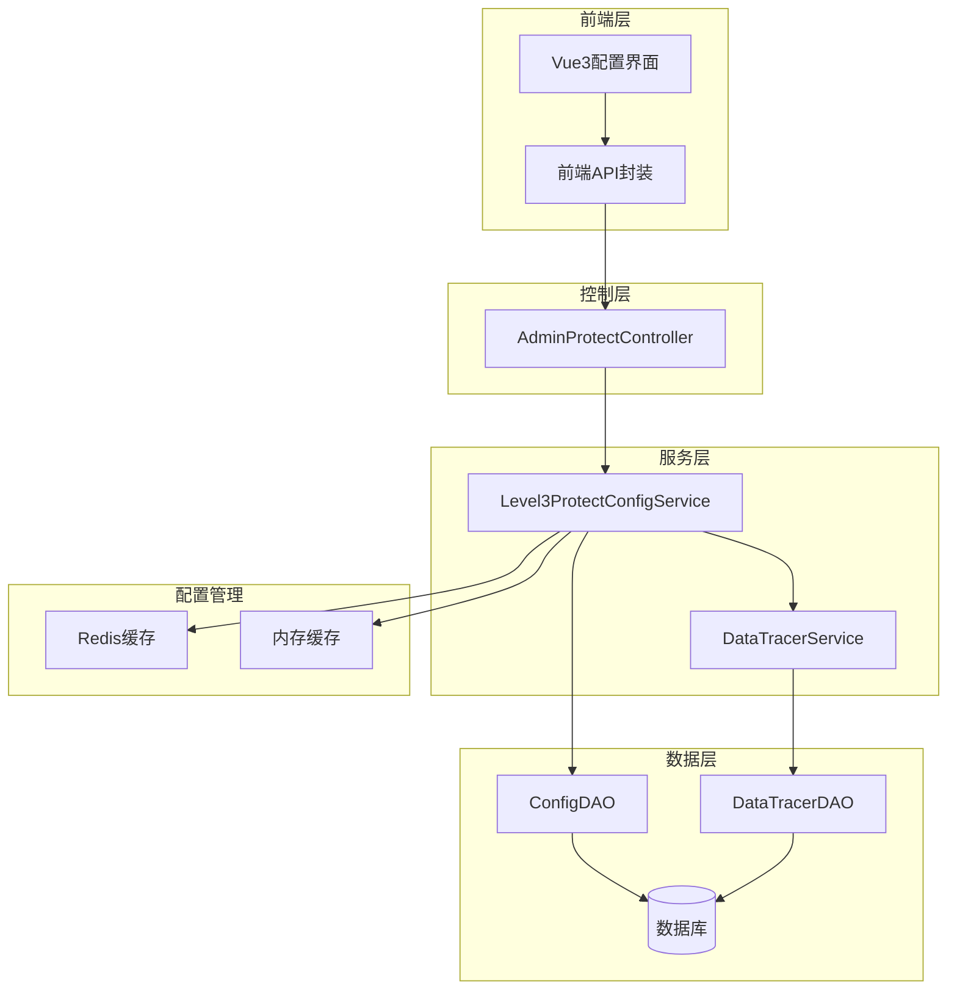
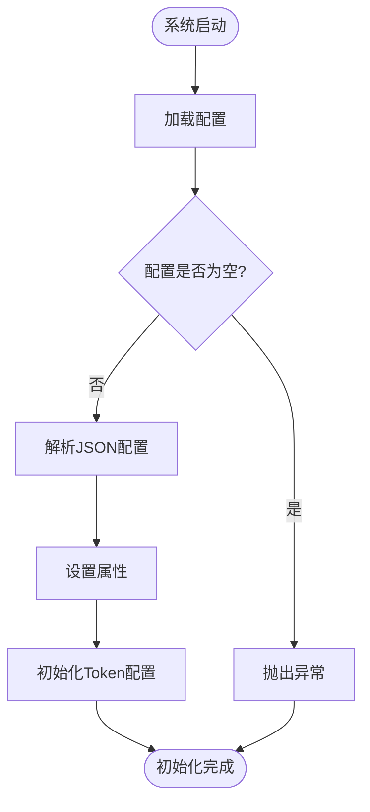
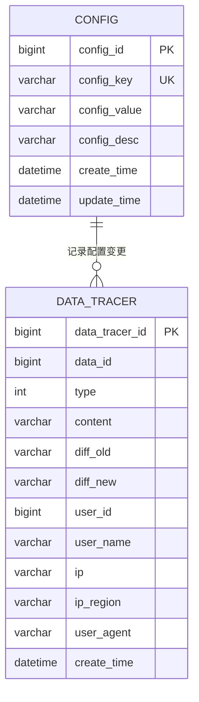
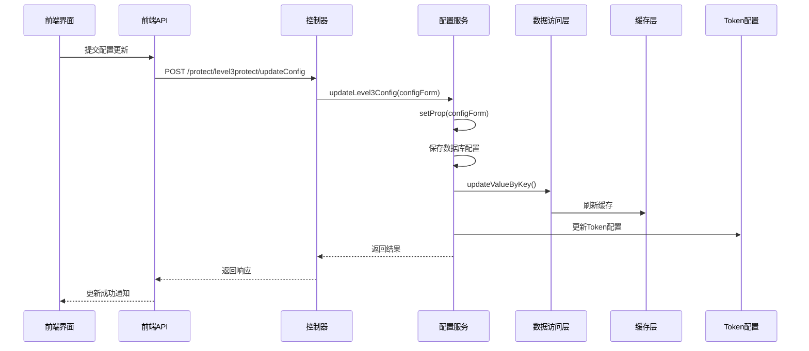
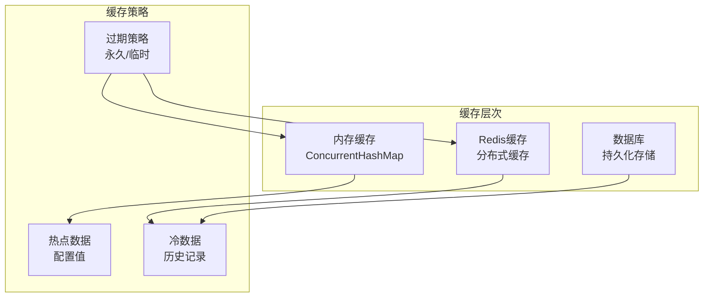
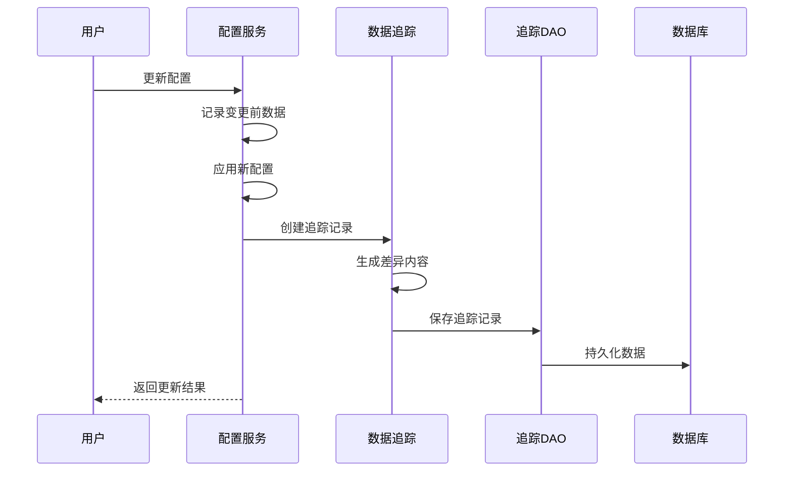
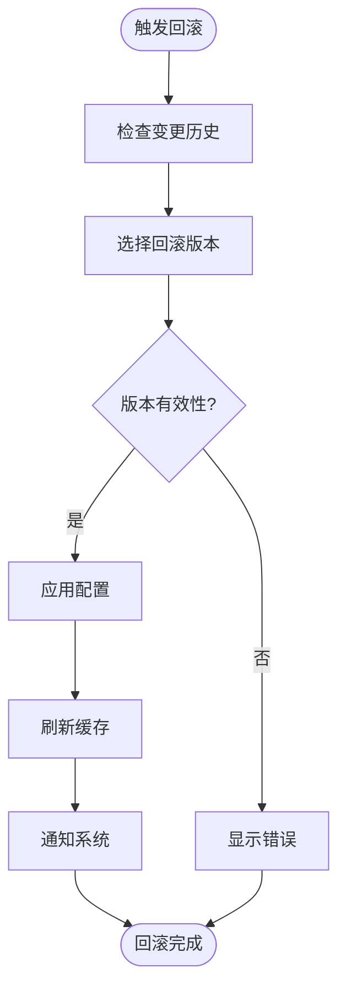

# 安全配置管理

<cite>
**本文档中引用的文件**
- [Level3ProtectConfigService.java](file://smart-admin-api-java17-springboot3/sa-base/src/main/java/net/lab1024/sa/base/module/support/securityprotect/service/Level3ProtectConfigService.java)
- [Level3ProtectConfigForm.java](file://smart-admin-api-java17-springboot3/sa-base/src/main/java/net/lab1024/sa/base/module/support/securityprotect/domain/Level3ProtectConfigForm.java)
- [AdminProtectController.java](file://smart-admin-api-java17-springboot3/sa-admin/src/main/java/net/lab1024/sa/admin/module/system/support/AdminProtectController.java)
- [level3-protect-api.js](file://smart-admin-web-javascript/src/api/support/level3-protect-api.js)
- [level3-protect-config-index.vue](file://smart-admin-web-javascript/src/views/support/level3protect/level3-protect-config-index.vue)
- [ConfigService.java](file://smart-admin-api-java17-springboot3/sa-base/src/main/java/net/lab1024/sa/base/module/support/config/ConfigService.java)
- [ConfigKeyEnum.java](file://smart-admin-api-java17-springboot3/sa-base/src/main/java/net/lab1024/sa/base/module/support/config/ConfigKeyEnum.java)
- [DataTracerService.java](file://smart-admin-api-java17-springboot3/sa-base/src/main/java/net/lab1024/sa/base/module/support/datatracer/service/DataTracerService.java)
- [DataTracerEntity.java](file://smart-admin-api-java17-springboot3/sa-base/src/main/java/net/lab1024/sa/base/module/support/datatracer/domain/entity/DataTracerEntity.java)
- [TokenConfig.java](file://smart-admin-api-java17-springboot3/sa-base/src/main/java/net/lab1024/sa/base/config/TokenConfig.java)
</cite>

## 目录
1. [概述](#概述)
2. [系统架构](#系统架构)
3. [核心组件分析](#核心组件分析)
4. [安全配置存储结构](#安全配置存储结构)
5. [配置更新机制](#配置更新机制)
6. [RESTful API接口](#restful-api接口)
7. [配置加载和缓存策略](#配置加载和缓存策略)
8. [审计跟踪机制](#审计跟踪机制)
9. [回滚方案](#回滚方案)
10. [最佳实践](#最佳实践)

## 概述

Level3ProtectConfigService是SmartAdmin系统中负责三级等保安全配置管理的核心服务组件。该服务提供了动态安全策略管理功能，确保系统能够根据三级等保标准要求进行安全配置的存储、更新和应用。

### 三级等保简介

三级等保是中国国家等级保护认证中的最高级别认证，包含五个等级保护安全技术要求和五个安全管理要求，共涉及测评分类73类，要求非常严格。该认证适用于地市级以上国家机关、重要企事业单位，在金融行业中可视为除了银行机构以外最高级别的信息安全等级保护。

## 系统架构



**图表来源**
- [AdminProtectController.java](file://smart-admin-api-java17-springboot3/sa-admin/src/main/java/net/lab1024/sa/admin/module/system/support/AdminProtectController.java#L34-L73)
- [Level3ProtectConfigService.java](file://smart-admin-api-java17-springboot3/sa-base/src/main/java/net/lab1024/sa/base/module/support/securityprotect/service/Level3ProtectConfigService.java#L26-L189)

## 核心组件分析

### Level3ProtectConfigService

Level3ProtectConfigService是三级等保配置管理的核心服务类，负责：

#### 主要属性配置

| 配置项 | 类型 | 默认值 | 描述 |
|--------|------|--------|------|
| twoFactorLoginEnabled | Boolean | false | 双因子登录开关 |
| loginFailMaxTimes | Integer | -1 | 最大连续登录失败次数 |
| loginFailLockSeconds | Integer | 1800 | 登录失败锁定时间（秒） |
| loginActiveTimeoutSeconds | Integer | -1 | 最低活跃时间（秒） |
| passwordComplexityEnabled | Boolean | true | 密码复杂度开关 |
| regularChangePasswordDays | Integer | 90 | 定期修改密码间隔（天） |
| maxUploadFileSizeMb | Long | 50 | 上传文件大小限制（MB） |
| fileDetectFlag | Boolean | false | 文件安全检测开关 |

#### 初始化流程



**图表来源**
- [Level3ProtectConfigService.java](file://smart-admin-api-java17-springboot3/sa-base/src/main/java/net/lab1024/sa/base/module/support/securityprotect/service/Level3ProtectConfigService.java#L118-L126)

**章节来源**
- [Level3ProtectConfigService.java](file://smart-admin-api-java17-springboot3/sa-base/src/main/java/net/lab1024/sa/base/module/support/securityprotect/service/Level3ProtectConfigService.java#L26-L189)

### Level3ProtectConfigForm

Level3ProtectConfigForm是配置参数的验证和持久化模型，包含以下核心字段：

#### 验证规则

| 字段名 | 验证规则 | 默认值 | 说明 |
|--------|----------|--------|------|
| loginFailMaxTimes | @NotNull | 5 | 最大连续登录失败次数 |
| loginFailLockMinutes | @NotNull | 30 | 登录失败锁定时间（分钟） |
| loginActiveTimeoutMinutes | @NotNull | 30 | 最低活跃时间（分钟） |
| twoFactorLoginEnabled | @NotNull | true | 双因子登录开关 |
| passwordComplexityEnabled | @NotNull | true | 密码复杂度开关 |
| regularChangePasswordMonths | @NotNull | 3 | 定期修改密码间隔（月） |
| fileDetectFlag | @NotNull | true | 文件检测开关 |
| maxUploadFileSizeMb | @NotNull | 50 | 上传文件大小限制（MB） |

**章节来源**
- [Level3ProtectConfigForm.java](file://smart-admin-api-java17-springboot3/sa-base/src/main/java/net/lab1024/sa/base/module/support/securityprotect/domain/Level3ProtectConfigForm.java#L18-L58)

## 安全配置存储结构

### 数据库存储设计

系统采用统一的配置表（t_config）存储所有配置信息，使用键值对结构：



**图表来源**
- [ConfigService.java](file://smart-admin-api-java17-springboot3/sa-base/src/main/java/net/lab1024/sa/base/module/support/config/ConfigService.java#L37-L188)
- [DataTracerEntity.java](file://smart-admin-api-java17-springboot3/sa-base/src/main/java/net/lab1024/sa/base/module/support/datatracer/domain/entity/DataTracerEntity.java#L18-L64)

### 配置键值映射

| 配置键 | 描述 | 存储格式 |
|--------|------|----------|
| level3_protect_config | 三级等保配置 | JSON字符串 |

**章节来源**
- [ConfigKeyEnum.java](file://smart-admin-api-java17-springboot3/sa-base/src/main/java/net/lab1024/sa/base/module/support/config/ConfigKeyEnum.java#L23-L26)

## 配置更新机制

### 更新流程



**图表来源**
- [AdminProtectController.java](file://smart-admin-api-java17-springboot3/sa-admin/src/main/java/net/lab1024/sa/admin/module/system/support/AdminProtectController.java#L62-L65)
- [Level3ProtectConfigService.java](file://smart-admin-api-java17-springboot3/sa-base/src/main/java/net/lab1024/sa/base/module/support/securityprotect/service/Level3ProtectConfigService.java#L178-L188)

### 属性设置逻辑

配置更新时，系统会逐个检查并设置各个配置项：

```mermaid
flowchart TD
Start([开始设置属性]) --> CheckFileDetect{"fileDetectFlag不为空?"}
CheckFileDetect --> |是| SetFileDetect["设置fileDetectFlag"]
CheckFileDetect --> |否| CheckMaxSize{"maxUploadFileSizeMb不为空?"}
SetFileDetect --> CheckMaxSize
CheckMaxSize --> |是| SetMaxSize["设置maxUploadFileSizeMb"]
CheckMaxSize --> |否| CheckFailTimes{"loginFailMaxTimes不为空?"}
SetMaxSize --> CheckFailTimes
CheckFailTimes --> |是| SetFailTimes["设置loginFailMaxTimes"]
CheckFailTimes --> |否| CheckLockMinutes{"loginFailLockMinutes不为空?"}
SetFailTimes --> CheckLockMinutes
CheckLockMinutes --> |是| ConvertLockSeconds["转换为秒数"]
CheckLockMinutes --> |否| CheckActiveTimeout{"loginActiveTimeoutMinutes不为空?"}
ConvertLockSeconds --> CheckActiveTimeout
CheckActiveTimeout --> |是| ConvertActiveSeconds["转换为秒数"]
CheckActiveTimeout --> |否| CheckPasswordComplexity{"passwordComplexityEnabled不为空?"}
ConvertActiveSeconds --> CheckPasswordComplexity
CheckPasswordComplexity --> |是| SetPasswordComplexity["设置密码复杂度"]
CheckPasswordComplexity --> |否| CheckRegularChange{"regularChangePasswordMonths不为空?"}
SetPasswordComplexity --> CheckRegularChange
CheckRegularChange --> |是| ConvertRegularDays["转换为天数"]
CheckRegularChange --> |否| CheckTwoFactor{"twoFactorLoginEnabled不为空?"}
ConvertRegularDays --> CheckTwoFactor
CheckTwoFactor --> |是| SetTwoFactor["设置双因子登录"]
CheckTwoFactor --> |否| CheckRepeatTimes{"regularChangePasswordNotAllowRepeatTimes不为空?"}
SetTwoFactor --> CheckRepeatTimes
CheckRepeatTimes --> |是| SetRepeatTimes["设置重复次数限制"]
CheckRepeatTimes --> |否| UpdateToken["更新Token配置"]
SetRepeatTimes --> UpdateToken
UpdateToken --> End([设置完成])
```



**图表来源**
- [Level3ProtectConfigService.java](file://smart-admin-api-java17-springboot3/sa-base/src/main/java/net/lab1024/sa/base/module/support/securityprotect/service/Level3ProtectConfigService.java#L131-L176)

**章节来源**
- [Level3ProtectConfigService.java](file://smart-admin-api-java17-springboot3/sa-base/src/main/java/net/lab1024/sa/base/module/support/securityprotect/service/Level3ProtectConfigService.java#L131-L189)

## RESTful API接口

### 接口规范

#### 获取当前安全配置

| 属性 | 值 |
|------|-----|
| URL | `/support/protect/level3protect/getConfig` |
| 方法 | `GET` |
| 认证 | 是 |
| 权限 | `support:level3protect:getConfig` |

**请求格式**
```json
{
  "success": true,
  "code": 200,
  "msg": "success",
  "data": "{\"loginFailMaxTimes\":5,\"loginFailLockMinutes\":30,\"loginActiveTimeoutMinutes\":30,\"twoFactorLoginEnabled\":true,\"passwordComplexityEnabled\":true,\"regularChangePasswordMonths\":3,\"regularChangePasswordNotAllowRepeatTimes\":3,\"fileDetectFlag\":true,\"maxUploadFileSizeMb\":50}"
}
```

**响应格式**
```json
{
  "success": true,
  "code": 200,
  "msg": "success",
  "data": "{配置JSON字符串}"
}
```

#### 更新安全策略

| 属性 | 值 |
|------|-----|
| URL | `/support/protect/level3protect/updateConfig` |
| 方法 | `POST` |
| 认证 | 是 |
| 权限 | `support:level3protect:updateConfig` |

**请求格式**
```json
{
  "loginFailMaxTimes": 5,
  "loginFailLockMinutes": 30,
  "loginActiveTimeoutMinutes": 30,
  "twoFactorLoginEnabled": true,
  "passwordComplexityEnabled": true,
  "regularChangePasswordMonths": 3,
  "regularChangePasswordNotAllowRepeatTimes": 3,
  "fileDetectFlag": true,
  "maxUploadFileSizeMb": 50
}
```

**响应格式**
```json
{
  "success": true,
  "code": 200,
  "msg": "success",
  "data": "配置更新成功"
}
```

### 前端API封装

前端提供了专门的API封装模块，简化了与后端的交互：

**章节来源**
- [AdminProtectController.java](file://smart-admin-api-java17-springboot3/sa-admin/src/main/java/net/lab1024/sa/admin/module/system/support/AdminProtectController.java#L62-L72)
- [level3-protect-api.js](file://smart-admin-web-javascript/src/api/support/level3-protect-api.js#L1-L25)

## 配置加载和缓存策略

### 缓存架构



**图表来源**
- [ConfigService.java](file://smart-admin-api-java17-springboot3/sa-base/src/main/java/net/lab1024/sa/base/module/support/config/ConfigService.java#L37-L62)

### 加载策略

系统采用懒加载和主动刷新相结合的策略：

1. **系统启动时加载**：通过`@PostConstruct`注解在服务初始化时加载配置
2. **缓存预热**：系统启动时预加载所有配置到内存缓存
3. **实时刷新**：配置更新时同步刷新缓存
4. **热重载支持**：支持配置的热重载功能

**章节来源**
- [ConfigService.java](file://smart-admin-api-java17-springboot3/sa-base/src/main/java/net/lab1024/sa/base/module/support/config/ConfigService.java#L53-L74)

## 审计跟踪机制

### 数据追踪服务

系统提供了完整的数据追踪功能，记录所有配置变更：

#### 追踪实体结构

| 字段 | 类型 | 描述 |
|------|------|------|
| dataTracerId | Long | 主键ID |
| dataId | Long | 数据ID |
| type | Integer | 业务类型 |
| content | String | 操作内容 |
| diffOld | String | 旧数据内容 |
| diffNew | String | 新数据内容 |
| userId | Long | 用户ID |
| userName | String | 用户名 |
| ip | String | IP地址 |
| userAgent | String | 用户代理 |
| createTime | DateTime | 创建时间 |

### 审计流程



**图表来源**
- [DataTracerService.java](file://smart-admin-api-java17-springboot3/sa-base/src/main/java/net/lab1024/sa/base/module/support/datatracer/service/DataTracerService.java#L72-L118)

### 追踪类型枚举

系统支持多种追踪类型：
- **INSERT**：新增操作
- **UPDATE**：修改操作  
- **DELETE**：删除操作

**章节来源**
- [DataTracerService.java](file://smart-admin-api-java17-springboot3/sa-base/src/main/java/net/lab1024/sa/base/module/support/datatracer/service/DataTracerService.java#L72-L118)
- [DataTracerEntity.java](file://smart-admin-api-java17-springboot3/sa-base/src/main/java/net/lab1024/sa/base/module/support/datatracer/domain/entity/DataTracerEntity.java#L18-L64)

## 回滚方案

### 配置回滚机制

虽然系统目前主要依赖数据库的事务特性来保证配置的一致性，但可以通过以下方式实现配置回滚：

#### 回滚策略

1. **版本控制**：每次配置变更都保留历史版本
2. **快照备份**：定期备份配置快照
3. **增量对比**：记录配置变更的增量差异
4. **原子操作**：确保配置变更的原子性

#### 回滚实现流程



### 系统级回滚

对于关键配置变更，系统还提供了Token配置的动态调整：

**章节来源**
- [TokenConfig.java](file://smart-admin-api-java17-springboot3/sa-base/src/main/java/net/lab1024/sa/base/config/TokenConfig.java#L25-L33)

## 最佳实践

### 配置管理最佳实践

1. **最小权限原则**：仅授权必要的人员进行配置管理
2. **变更审批流程**：对重要的安全配置变更实施审批流程
3. **定期审计**：定期审查配置变更记录
4. **备份策略**：建立配置备份和恢复机制
5. **监控告警**：对配置变更实施实时监控

### 性能优化建议

1. **缓存策略**：合理设置缓存过期时间
2. **批量操作**：对多个配置项进行批量更新
3. **异步处理**：对于耗时的配置变更采用异步处理
4. **资源池化**：合理配置数据库连接池

### 安全加固措施

1. **输入验证**：严格验证所有配置参数
2. **访问控制**：实施细粒度的访问控制
3. **日志记录**：完整记录所有配置变更操作
4. **加密存储**：对敏感配置进行加密存储

### 监控和告警

建议建立以下监控指标：
- 配置变更频率
- 配置错误率
- 缓存命中率
- 系统响应时间

通过完善的监控体系，可以及时发现和处理配置相关的问题，确保系统的安全稳定运行。