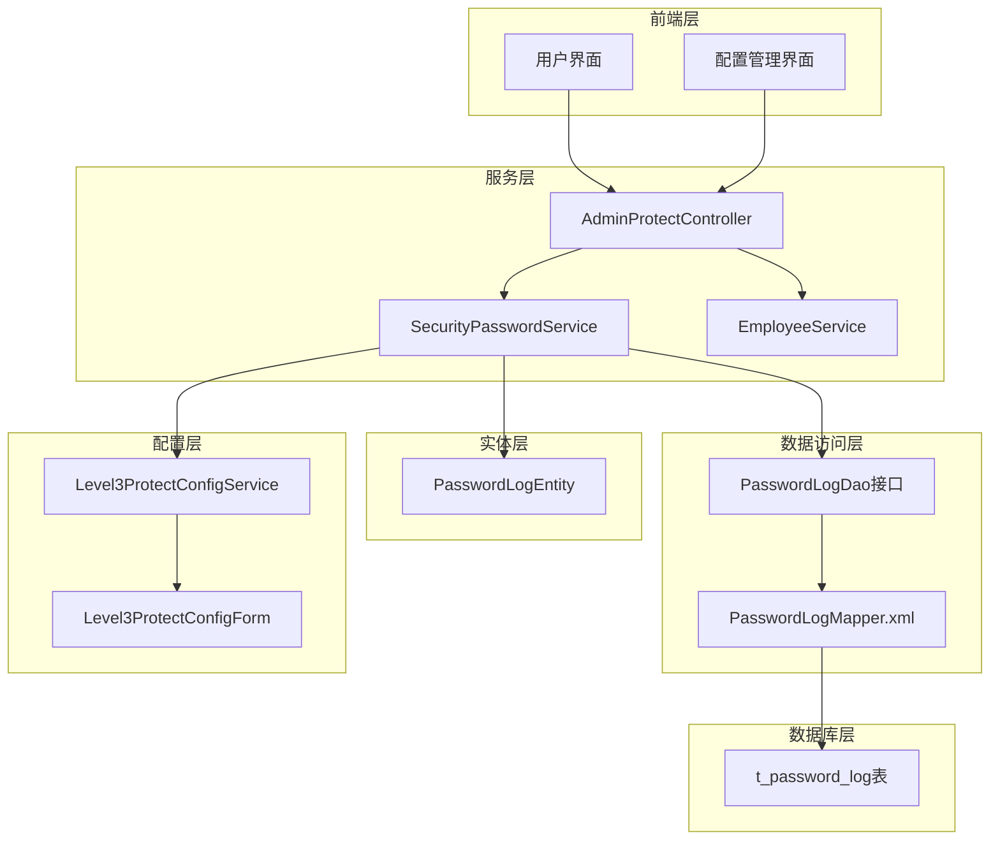
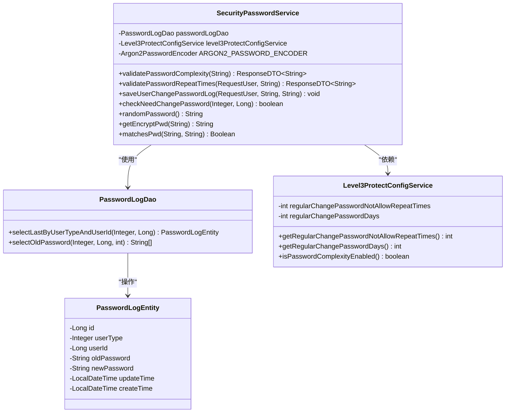
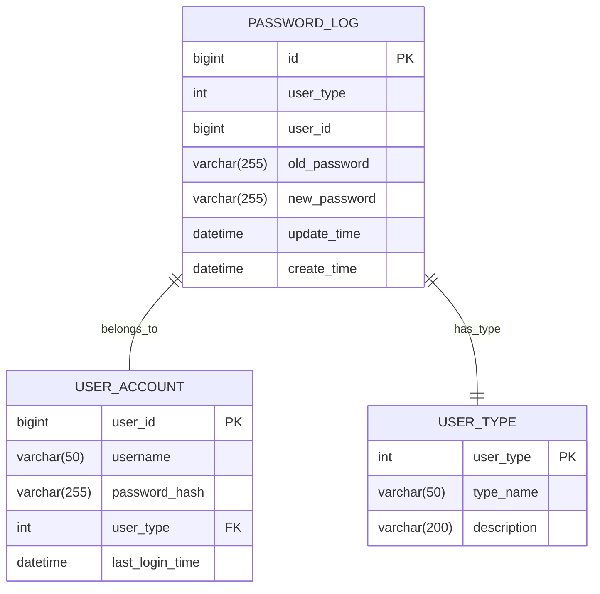
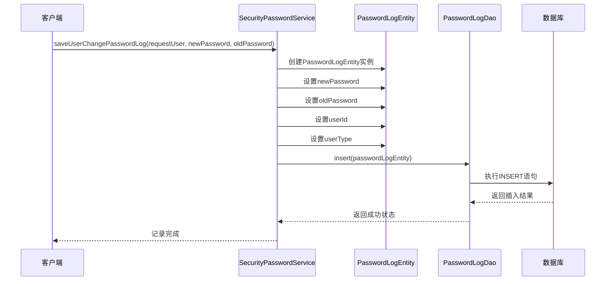
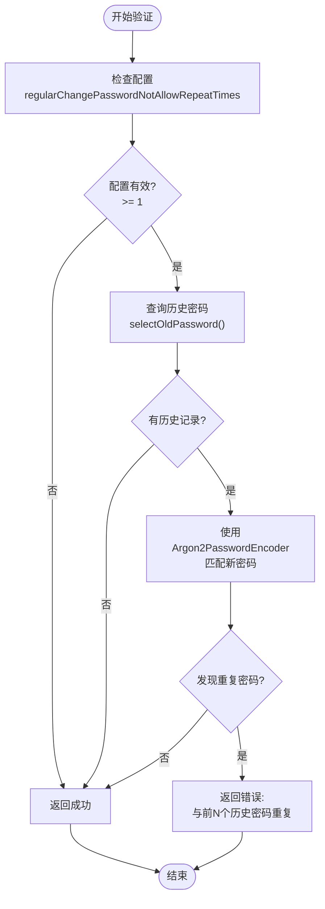
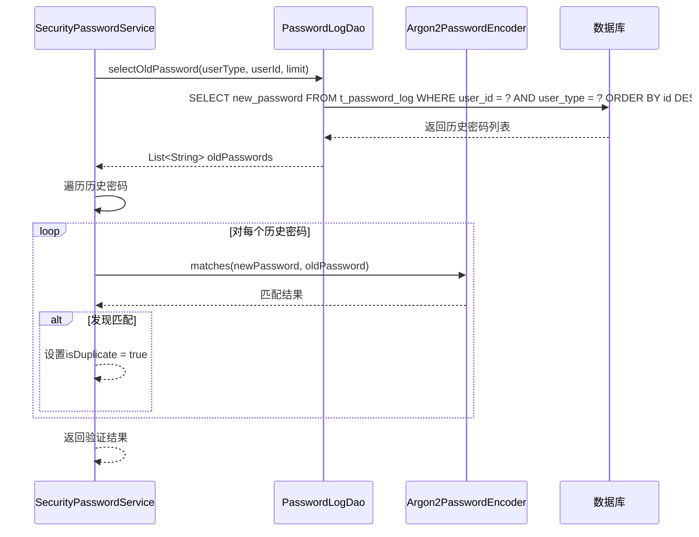
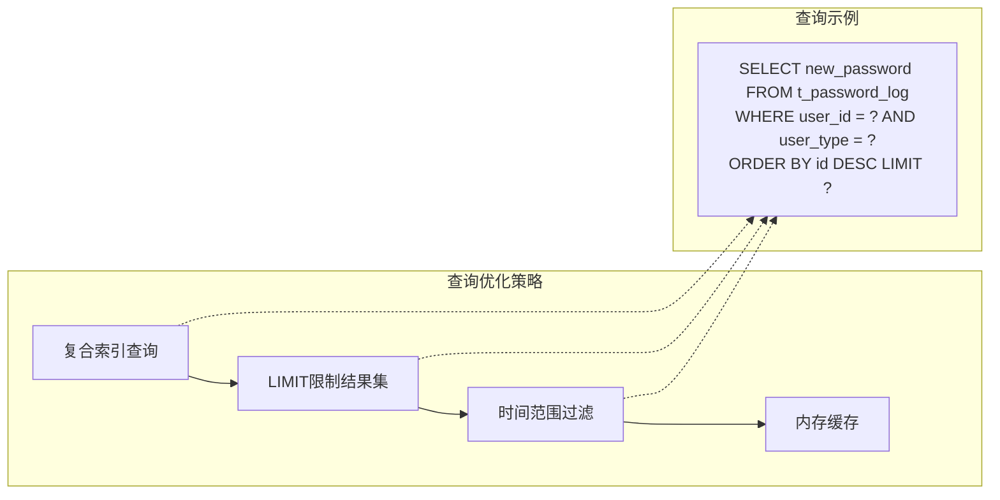
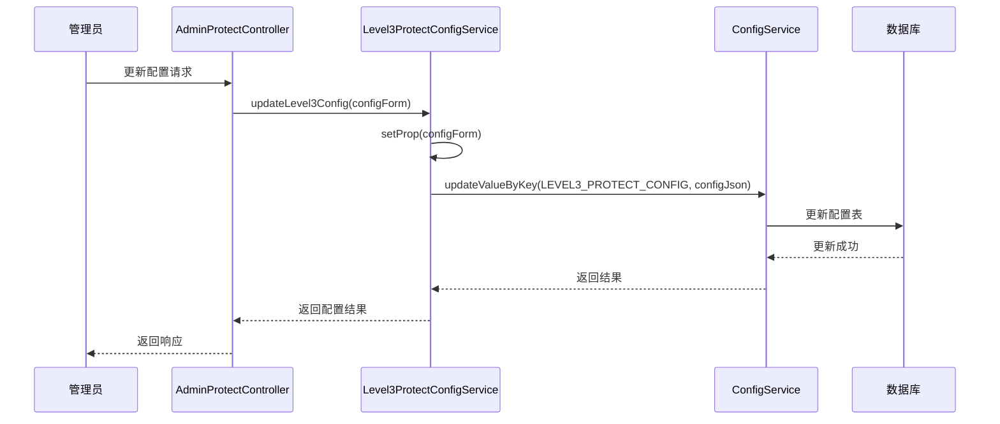
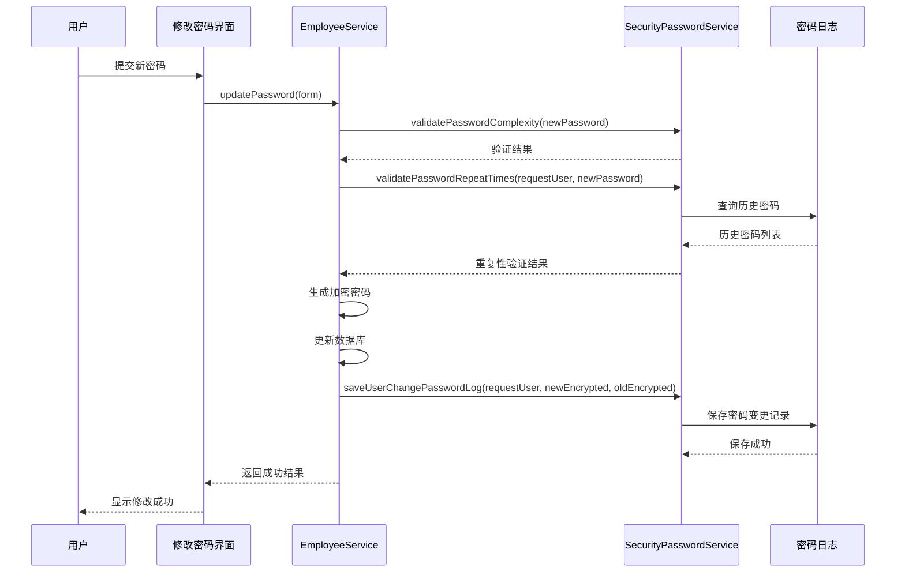
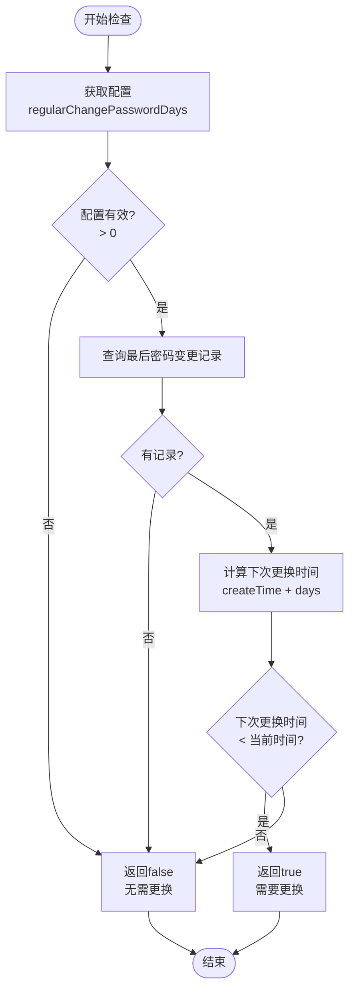

# 密码历史记录管理

<cite>
**本文档中引用的文件**
- [PasswordLogEntity.java](file://smart-admin-api-java17-springboot3/sa-base/src/main/java/net/lab1024/sa/base/module/support/securityprotect/domain/PasswordLogEntity.java)
- [SecurityPasswordService.java](file://smart-admin-api-java17-springboot3/sa-base/src/main/java/net/lab1024/sa/base/module/support/securityprotect/service/SecurityPasswordService.java)
- [PasswordLogDao.java](file://smart-admin-api-java17-springboot3/sa-base/src/main/java/net/lab1024/sa/base/module/support/securityprotect/dao/PasswordLogDao.java)
- [PasswordLogMapper.xml](file://smart-admin-api-java17-springboot3/sa-base/src/main/resources/mapper/support/PasswordLogMapper.xml)
- [Level3ProtectConfigService.java](file://smart-admin-api-java17-springboot3/sa-base/src/main/java/net/lab1024/sa/base/module/support/securityprotect/service/Level3ProtectConfigService.java)
- [EmployeeService.java](file://smart-admin-api-java17-springboot3/sa-admin/src/main/java/net/lab1024/sa/admin/module/system/employee/service/EmployeeService.java)
</cite>

## 目录
1. [简介](#简介)
2. [系统架构概述](#系统架构概述)
3. [核心组件分析](#核心组件分析)
4. [密码历史记录实体](#密码历史记录实体)
5. [密码变更审计功能](#密码变更审计功能)
6. [密码重复性验证机制](#密码重复性验证机制)
7. [数据库表结构设计](#数据库表结构设计)
8. [配置管理](#配置管理)
9. [使用场景示例](#使用场景示例)
10. [性能优化策略](#性能优化策略)
11. [故障排除指南](#故障排除指南)
12. [总结](#总结)

## 简介

密码历史记录管理系统是智能管理系统中的重要安全组件，基于三级等保要求设计，通过PasswordLogEntity实现密码变更审计功能。该系统提供了完整的密码历史记录存储、查询和验证机制，确保用户密码的安全性和合规性。

系统采用Argon2PasswordEncoder进行密码加密，支持密码复杂度验证、重复密码检测和定期密码更换提醒等功能，为企业级应用提供强大的密码安全管理能力。

## 系统架构概述

密码历史记录管理系统采用分层架构设计，包含数据访问层、业务逻辑层和服务控制层，确保系统的可维护性和扩展性。



**图表来源**
- [SecurityPasswordService.java](file://smart-admin-api-java17-springboot3/sa-base/src/main/java/net/lab1024/sa/base/module/support/securityprotect/service/SecurityPasswordService.java#L27-L46)
- [PasswordLogDao.java](file://smart-admin-api-java17-springboot3/sa-base/src/main/java/net/lab1024/sa/base/module/support/securityprotect/dao/PasswordLogDao.java#L11-L32)
- [Level3ProtectConfigService.java](file://smart-admin-api-java17-springboot3/sa-base/src/main/java/net/lab1024/sa/base/module/support/securityprotect/service/Level3ProtectConfigService.java#L30-L88)

## 核心组件分析

### 密码服务核心类

SecurityPasswordService是密码历史记录管理的核心服务类，负责处理密码相关的所有业务逻辑。



**图表来源**
- [SecurityPasswordService.java](file://smart-admin-api-java17-springboot3/sa-base/src/main/java/net/lab1024/sa/base/module/support/securityprotect/service/SecurityPasswordService.java#L27-L156)
- [PasswordLogDao.java](file://smart-admin-api-java17-springboot3/sa-base/src/main/java/net/lab1024/sa/base/module/support/securityprotect/dao/PasswordLogDao.java#L11-L32)
- [PasswordLogEntity.java](file://smart-admin-api-java17-springboot3/sa-base/src/main/java/net/lab1024/sa/base/module/support/securityprotect/domain/PasswordLogEntity.java#L16-L42)

**节来源**
- [SecurityPasswordService.java](file://smart-admin-api-java17-springboot3/sa-base/src/main/java/net/lab1024/sa/base/module/support/securityprotect/service/SecurityPasswordService.java#L1-L157)
- [PasswordLogDao.java](file://smart-admin-api-java17-springboot3/sa-base/src/main/java/net/lab1024/sa/base/module/support/securityprotect/dao/PasswordLogDao.java#L1-L34)

## 密码历史记录实体

PasswordLogEntity是密码历史记录的数据模型，定义了密码变更记录的完整结构。

### 实体属性说明

| 属性名 | 类型 | 描述 | 约束 |
|--------|------|------|------|
| id | Long | 主键ID | 自增 |
| userType | Integer | 用户类型 | 非空 |
| userId | Long | 用户ID | 非空 |
| oldPassword | String | 旧密码（加密存储） | 非空 |
| newPassword | String | 新密码（加密存储） | 非空 |
| updateTime | LocalDateTime | 更新时间 | 非空 |
| createTime | LocalDateTime | 创建时间 | 非空 |

### 实体关系图



**图表来源**
- [PasswordLogEntity.java](file://smart-admin-api-java17-springboot3/sa-base/src/main/java/net/lab1024/sa/base/module/support/securityprotect/domain/PasswordLogEntity.java#L16-L42)

**节来源**
- [PasswordLogEntity.java](file://smart-admin-api-java17-springboot3/sa-base/src/main/java/net/lab1024/sa/base/module/support/securityprotect/domain/PasswordLogEntity.java#L1-L43)

## 密码变更审计功能

### saveUserChangePasswordLog方法详解

saveUserChangePasswordLog方法是密码变更审计的核心功能，负责记录每次密码变更的详细信息。

#### 方法执行流程



**图表来源**
- [SecurityPasswordService.java](file://smart-admin-api-java17-springboot3/sa-base/src/main/java/net/lab1024/sa/base/module/support/securityprotect/service/SecurityPasswordService.java#L113-L121)

#### 关键实现细节

1. **密码加密处理**：新旧密码均经过Argon2PasswordEncoder加密后再存储
2. **用户标识**：通过RequestUser对象获取用户类型和用户ID
3. **时间戳记录**：自动记录创建时间和更新时间
4. **事务保证**：确保密码变更记录的原子性

**节来源**
- [SecurityPasswordService.java](file://smart-admin-api-java17-springboot3/sa-base/src/main/java/net/lab1024/sa/base/module/support/securityprotect/service/SecurityPasswordService.java#L113-L121)

## 密码重复性验证机制

### validatePasswordRepeatTimes方法分析

validatePasswordRepeatTimes方法实现了密码重复性验证，防止用户重复使用最近N个历史密码。

#### 验证算法流程



**图表来源**
- [SecurityPasswordService.java](file://smart-admin-api-java17-springboot3/sa-base/src/main/java/net/lab1024/sa/base/module/support/securityprotect/service/SecurityPasswordService.java#L76-L91)

#### 密码匹配验证过程



**图表来源**
- [SecurityPasswordService.java](file://smart-admin-api-java17-springboot3/sa-base/src/main/java/net/lab1024/sa/base/module/support/securityprotect/service/SecurityPasswordService.java#L84-L89)

#### 性能优化策略

1. **索引优化**：在user_id和user_type字段上建立复合索引
2. **LIMIT限制**：通过limit参数限制查询的历史密码数量
3. **内存缓存**：对频繁查询的用户密码历史进行缓存
4. **异步处理**：对于大量历史记录的用户，考虑异步验证

**节来源**
- [SecurityPasswordService.java](file://smart-admin-api-java17-springboot3/sa-base/src/main/java/net/lab1024/sa/base/module/support/securityprotect/service/SecurityPasswordService.java#L76-L91)

## 数据库表结构设计

### t_password_log表结构

| 字段名 | 数据类型 | 约束 | 描述 |
|--------|----------|------|------|
| id | bigint | PRIMARY KEY, AUTO_INCREMENT | 主键ID |
| user_type | int | NOT NULL | 用户类型标识 |
| user_id | bigint | NOT NULL | 用户唯一标识 |
| old_password | varchar(255) | NOT NULL | 旧密码加密存储 |
| new_password | varchar(255) | NOT NULL | 新密码加密存储 |
| update_time | datetime | NOT NULL | 记录更新时间 |
| create_time | datetime | NOT NULL | 记录创建时间 |

### 索引设计

```sql
-- 复合索引，支持按用户类型和用户ID查询
CREATE INDEX idx_user_type_user_id ON t_password_log(user_type, user_id);

-- 时间索引，支持按时间范围查询
CREATE INDEX idx_create_time ON t_password_log(create_time);
```

### 查询优化SQL



**图表来源**
- [PasswordLogMapper.xml](file://smart-admin-api-java17-springboot3/sa-base/src/main/resources/mapper/support/PasswordLogMapper.xml#L17-L26)

**节来源**
- [PasswordLogMapper.xml](file://smart-admin-api-java17-springboot3/sa-base/src/main/resources/mapper/support/PasswordLogMapper.xml#L1-L28)

## 配置管理

### Level3ProtectConfigService配置项

Level3ProtectConfigService提供了密码相关的配置管理功能，支持动态调整密码安全策略。

#### 关键配置参数

| 配置项 | 默认值 | 描述 | 取值范围 |
|--------|--------|------|----------|
| regularChangePasswordNotAllowRepeatTimes | 3 | 允许重复密码次数 | 0-10 |
| regularChangePasswordDays | 90 | 定期更换密码天数 | 30-365 |
| passwordComplexityEnabled | true | 密码复杂度检查 | true/false |
| loginFailMaxTimes | 5 | 登录失败最大次数 | 1-10 |
| loginFailLockMinutes | 30 | 登录失败锁定时间 | 5-120 |

#### 配置更新流程



**图表来源**
- [Level3ProtectConfigService.java](file://smart-admin-api-java17-springboot3/sa-base/src/main/java/net/lab1024/sa/base/module/support/securityprotect/service/Level3ProtectConfigService.java#L179-L188)

**节来源**
- [Level3ProtectConfigService.java](file://smart-admin-api-java17-springboot3/sa-base/src/main/java/net/lab1024/sa/base/module/support/securityprotect/service/Level3ProtectConfigService.java#L70-L189)

## 使用场景示例

### 场景一：用户密码修改

当用户通过系统界面修改密码时，系统会自动记录密码变更历史并进行重复性验证。

#### 实际调用流程



**图表来源**
- [EmployeeService.java](file://smart-admin-api-java17-springboot3/sa-admin/src/main/java/net/lab1024/sa/admin/module/system/employee/service/EmployeeService.java#L360-L378)

### 场景二：定期密码更换提醒

系统会根据配置的密码更换周期，自动检查用户是否需要更换密码。

#### 密码更换检查流程



**图表来源**
- [SecurityPasswordService.java](file://smart-admin-api-java17-springboot3/sa-base/src/main/java/net/lab1024/sa/base/module/support/securityprotect/service/SecurityPasswordService.java#L125-L140)

**节来源**
- [EmployeeService.java](file://smart-admin-api-java17-springboot3/sa-admin/src/main/java/net/lab1024/sa/admin/module/system/employee/service/EmployeeService.java#L360-L380)

## 性能优化策略

### 查询性能优化

1. **索引优化**
   - 在(user_type, user_id)字段上建立复合索引
   - 在create_time字段上建立单独索引
   - 使用覆盖索引减少回表查询

2. **查询限制**
   - 通过LIMIT参数限制历史密码查询数量
   - 使用时间范围过滤减少扫描数据量
   - 实施分页查询处理大量历史记录

3. **缓存策略**
   - 对频繁查询的用户密码历史进行Redis缓存
   - 设置合理的缓存过期时间
   - 实施缓存预热机制

### 存储优化

1. **数据压缩**
   - 对密码字段进行压缩存储
   - 使用高效的序列化格式
   - 定期清理过期的密码历史记录

2. **分区策略**
   - 按时间范围对表进行分区
   - 实施归档策略处理历史数据
   - 定期清理超出保留期限的数据

### 并发处理优化

1. **事务隔离**
   - 使用适当的事务隔离级别
   - 避免长时间持有锁
   - 实施乐观锁机制

2. **异步处理**
   - 异步记录密码变更日志
   - 异步验证密码重复性
   - 使用消息队列处理批量操作

## 故障排除指南

### 常见问题及解决方案

#### 1. 密码重复性验证失败

**问题现象**：用户无法设置新密码，提示"与前N个历史密码重复"

**排查步骤**：
1. 检查Level3ProtectConfigService的配置
2. 验证数据库中是否存在足够的历史密码记录
3. 确认Argon2PasswordEncoder的配置正确

**解决方案**：
- 调整regularChangePasswordNotAllowRepeatTimes配置
- 清理过期的历史密码记录
- 检查密码加密算法的一致性

#### 2. 密码变更记录丢失

**问题现象**：密码变更后，历史记录表中没有新增记录

**排查步骤**：
1. 检查saveUserChangePasswordLog方法的调用
2. 验证数据库连接和事务配置
3. 查看数据库触发器和约束设置

**解决方案**：
- 确保方法调用链完整
- 检查数据库权限设置
- 验证MyBatis配置正确性

#### 3. 查询性能问题

**问题现象**：密码历史查询响应缓慢

**排查步骤**：
1. 分析SQL执行计划
2. 检查索引使用情况
3. 监控数据库负载

**解决方案**：
- 添加合适的索引
- 优化查询条件
- 实施查询缓存

### 监控指标

1. **性能指标**
   - 密码验证平均响应时间
   - 历史查询QPS
   - 数据库连接池使用率

2. **业务指标**
   - 密码重复验证成功率
   - 密码变更成功率
   - 历史记录增长率

3. **安全指标**
   - 密码破解尝试次数
   - 异常密码变更频率
   - 异地登录检测

## 总结

密码历史记录管理系统通过PasswordLogEntity和相关服务组件，提供了完整的密码安全管理解决方案。系统具备以下核心优势：

1. **安全性**：采用Argon2PasswordEncoder进行密码加密，符合现代安全标准
2. **合规性**：满足三级等保要求，支持密码复杂度和重复性验证
3. **可扩展性**：模块化设计，便于功能扩展和定制
4. **高性能**：通过索引优化和缓存策略，确保系统响应性能
5. **易维护性**：清晰的代码结构和完善的配置管理

该系统为企业级应用提供了可靠的密码安全管理基础，能够有效防范密码安全风险，保障用户账户安全。通过合理的配置和优化策略，可以在保证安全性的前提下，提供良好的用户体验。