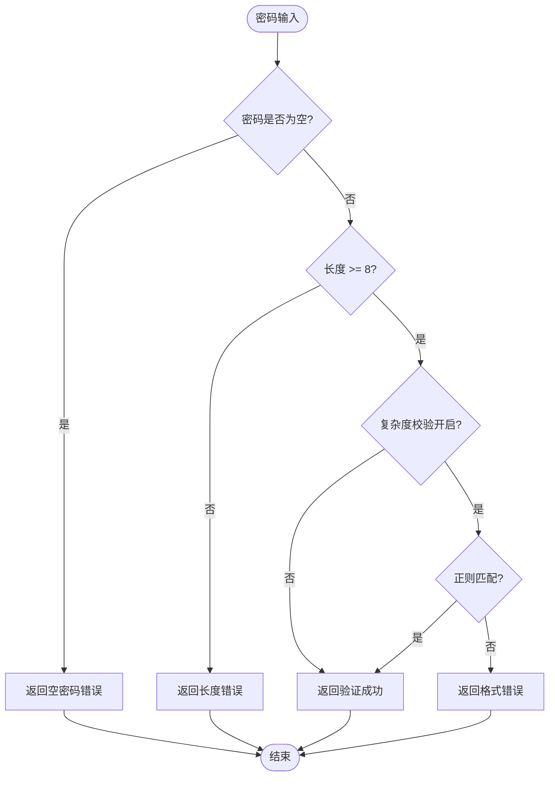
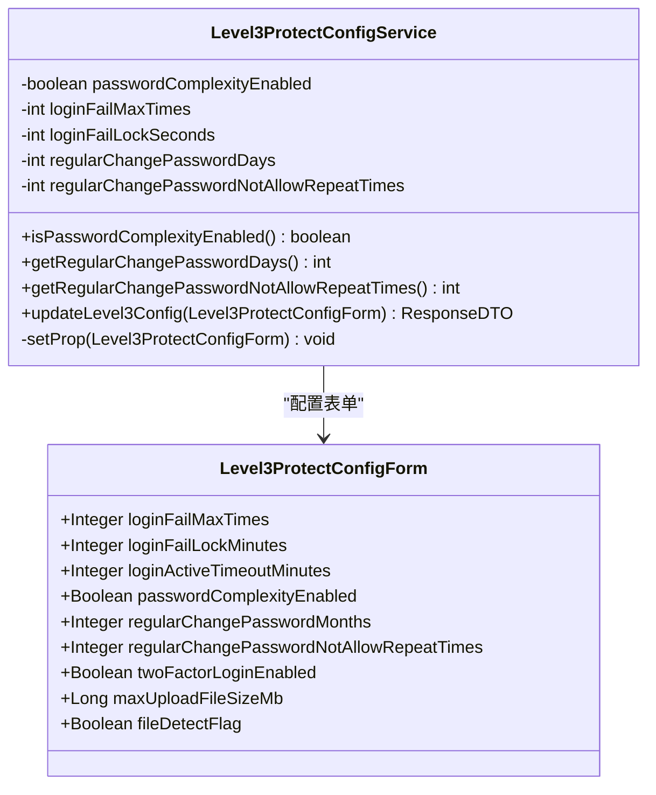
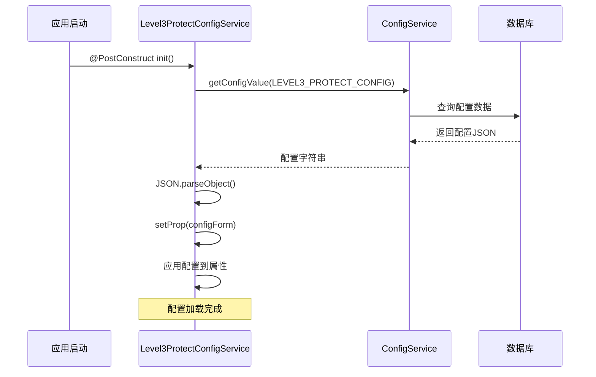
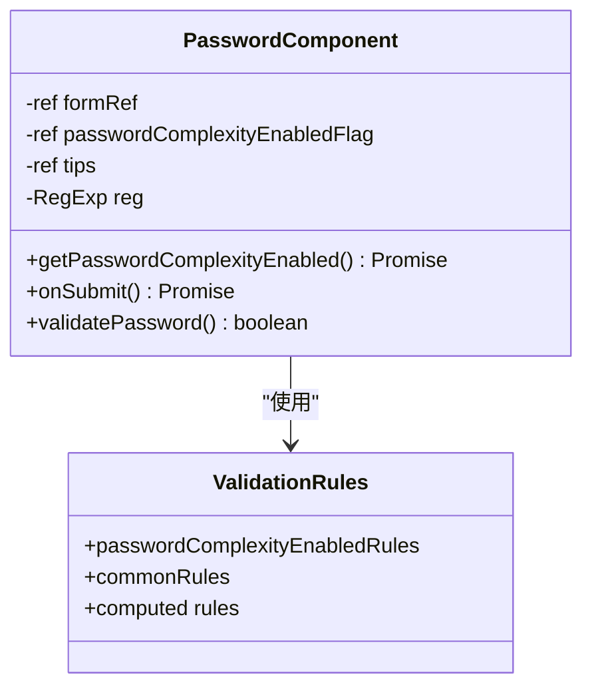
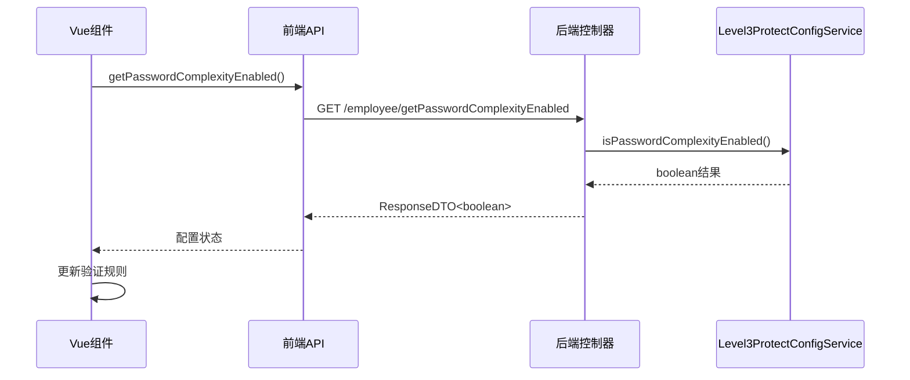
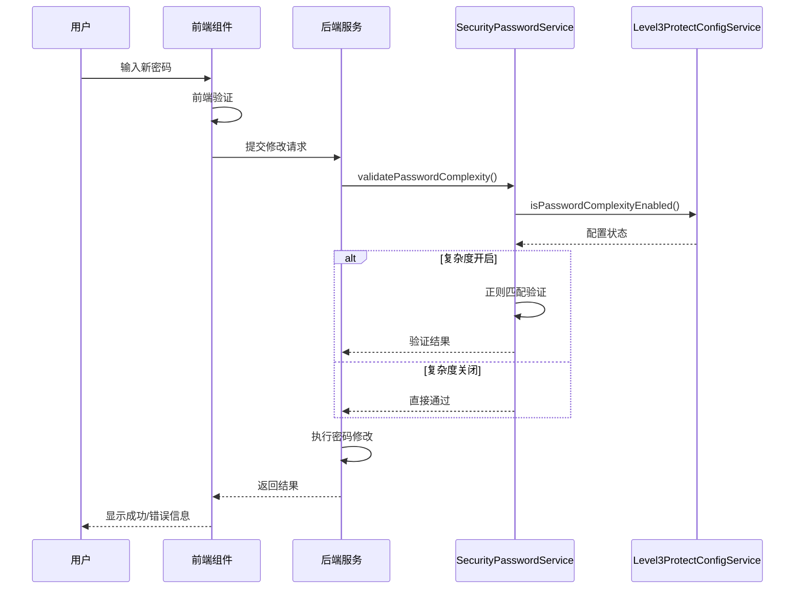
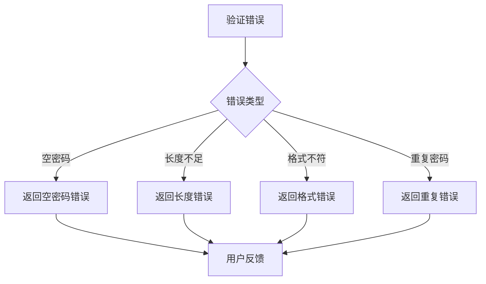

# 密码复杂度策略

<cite>
**本文档引用的文件**
- [SecurityPasswordService.java](file://smart-admin-api-java17-springboot3/sa-base/src/main/java/net/lab1024.sa.base/module/support/securityprotect/service/SecurityPasswordService.java)
- [Level3ProtectConfigService.java](file://smart-admin-api-java17-springboot3/sa-base/src/main/java/net/lab1024.sa.base/module/support/securityprotect/service/Level3ProtectConfigService.java)
- [Level3ProtectConfigForm.java](file://smart-admin-api-java17-springboot3/sa-base/src/main/java/net/lab1024.sa.base/module/support/securityprotect/domain/Level3ProtectConfigForm.java)
- [index.vue](file://smart-admin-web-javascript/src/views/system/account/components/password/index.vue)
- [level3-protect-config-index.vue](file://smart-admin-web-javascript/src/views/support/level3protect/level3-protect-config-index.vue)
- [EmployeeController.java](file://smart-admin-api-java17-springboot3/sa-admin/src/main/java/net/lab1024.sa.admin/module/system/employee/controller/EmployeeController.java)
</cite>

## 目录
1. [概述](#概述)
2. [密码复杂度验证机制](#密码复杂度验证机制)
3. [正则表达式解析](#正则表达式解析)
4. [配置管理](#配置管理)
5. [前端集成](#前端集成)
6. [实际应用示例](#实际应用示例)
7. [最佳实践](#最佳实践)
8. [故障排除](#故障排除)

## 概述

密码复杂度策略是三级等保安全要求的重要组成部分，旨在确保系统用户密码的安全性。该策略通过严格的密码验证规则和动态配置管理，为系统提供了强大的安全保障。

### 核心特性

- **长度要求**：密码必须在8-20位之间
- **字符组合**：必须包含大小写字母、数字、特殊符号中的至少三种
- **动态配置**：支持运行时启用或禁用复杂度校验
- **历史密码检查**：防止重复使用旧密码
- **实时验证**：前后端协同验证机制

## 密码复杂度验证机制

### 核心验证流程



**图表来源**
- [SecurityPasswordService.java](file://smart-admin-api-java17-springboot3/sa-base/src/main/java/net/lab1024.sa.base/module/support/securityprotect/service/SecurityPasswordService.java#L51-L71)

### 验证规则详解

密码复杂度验证遵循以下核心规则：

1. **基础长度验证**：密码长度必须大于等于8位
2. **字符类型要求**：必须包含三种及以上的字符类型组合
3. **特殊字符范围**：支持的特殊字符包括`@#$%^&*()_+-=`等
4. **动态开关控制**：可通过配置动态启用或禁用复杂度校验

**章节来源**
- [SecurityPasswordService.java](file://smart-admin-api-java17-springboot3/sa-base/src/main/java/net/lab1024.sa.base/module/support/securityprotect/service/SecurityPasswordService.java#L34-L71)

## 正则表达式解析

### 密码验证正则表达式

```javascript
^(?![a-zA-Z]+$)(?![A-Z0-9]+$)(?![A-Z\W_!@#$%^&*`~()-+=]+$)(?![a-z0-9]+$)(?![a-z\W_!@#$%^&*`~()-+=]+$)(?![0-9\W_!@#$%^&*`~()-+=]+$)[a-zA-Z0-9\W_!@#$%^&*`~()-+=]*$
```

### 正则表达式分解说明

该正则表达式采用负向前瞻断言（Negative Lookahead Assertions）来确保密码不只包含单一类型的字符：

| 断言模式 | 含义 | 示例 |
|---------|------|------|
| `(?![a-zA-Z]+$)` | 不允许只包含字母 | `abc`, `ABC` |
| `(?![A-Z0-9]+$)` | 不允许只包含大写字母和数字 | `A123`, `Z987` |
| `(?![A-Z\W_!@#$%^&*`~()-+=]+$)` | 不允许只包含大写字母和特殊符号 | `A@#`, `Z$%` |
| `(?![a-z0-9]+$)` | 不允许只包含小写字母和数字 | `a123`, `z987` |
| `(?![a-z\W_!@#$%^&*`~()-+=]+$)` | 不允许只包含小写字母和特殊符号 | `a@#`, `z$%` |
| `(?![0-9\W_!@#$%^&*`~()-+=]+$)` | 不允许只包含数字和特殊符号 | `1@#`, `9$%` |

### 字符范围说明

- `[a-zA-Z]`：大小写字母
- `[0-9]`：数字字符
- `[a-zA-Z0-9]`：字母和数字组合
- `\W_!@#$%^&*`~()-+=`：特殊符号集合

### 验证逻辑

密码必须同时满足以下条件：
1. 不能只包含一种字符类型
2. 可以包含多种字符类型的组合
3. 总长度在8-20位之间

**章节来源**
- [SecurityPasswordService.java](file://smart-admin-api-java17-springboot3/sa-base/src/main/java/net/lab1024.sa.base/module/support/securityprotect/service/SecurityPasswordService.java#L32-L33)

## 配置管理

### Level3ProtectConfigService服务

Level3ProtectConfigService负责管理三级等保相关配置，特别是密码复杂度的启用状态。



**图表来源**
- [Level3ProtectConfigService.java](file://smart-admin-api-java17-springboot3/sa-base/src/main/java/net/lab1024.sa.base/module/support/securityprotect/service/Level3ProtectConfigService.java#L28-L188)
- [Level3ProtectConfigForm.java](file://smart-admin-api-java17-springboot3/sa-base/src/main/java/net/lab1024.sa.base/module/support/securityprotect/domain/Level3ProtectConfigForm.java#L18-L57)

### 关键配置项

| 配置项 | 类型 | 默认值 | 说明 |
|--------|------|--------|------|
| `passwordComplexityEnabled` | Boolean | true | 密码复杂度是否启用 |
| `regularChangePasswordDays` | int | 90 | 定期修改密码间隔（天） |
| `regularChangePasswordNotAllowRepeatTimes` | int | 3 | 允许重复使用的次数 |
| `loginFailMaxTimes` | int | -1 | 登录失败最大次数 |
| `loginFailLockSeconds` | int | 1800 | 登录失败锁定时间（秒） |

### 配置初始化流程



**图表来源**
- [Level3ProtectConfigService.java](file://smart-admin-api-java17-springboot3/sa-base/src/main/java/net/lab1024.sa.base/module/support/securityprotect/service/Level3ProtectConfigService.java#L118-L125)

**章节来源**
- [Level3ProtectConfigService.java](file://smart-admin-api-java17-springboot3/sa-base/src/main/java/net/lab1024.sa.base/module/support/securityprotect/service/Level3ProtectConfigService.java#L68-L70)
- [Level3ProtectConfigForm.java](file://smart-admin-api-java17-springboot3/sa-base/src/main/java/net/lab1024.sa.base/module/support/securityprotect/domain/Level3ProtectConfigForm.java#L36-L38)

## 前端集成

### Vue组件架构

前端密码组件采用响应式设计，根据后端配置动态调整验证规则。



**图表来源**
- [index.vue](file://smart-admin-web-javascript/src/views/system/account/components/password/index.vue#L20-L127)

### 动态验证规则

前端根据密码复杂度配置动态切换验证规则：

| 配置状态 | 验证规则 | 错误提示 |
|----------|----------|----------|
| 复杂度开启 | 正则表达式验证 | "密码长度8-20位，必须包含字母、数字、特殊符号等三种字符" |
| 复杂度关闭 | 基础长度验证 | "密码长度至少8位" |

### 实时配置获取



**图表来源**
- [index.vue](file://smart-admin-web-javascript/src/views/system/account/components/password/index.vue#L39-L49)
- [EmployeeController.java](file://smart-admin-api-java17-springboot3/sa-admin/src/main/java/net/lab1024.sa.admin/module/system/employee/controller/EmployeeController.java#L103-L108)

**章节来源**
- [index.vue](file://smart-admin-web-javascript/src/views/system/account/components/password/index.vue#L30-L34)
- [EmployeeController.java](file://smart-admin-api-java17-springboot3/sa-admin/src/main/java/net/lab1024.sa.admin/module/system/employee/controller/EmployeeController.java#L103-L108)

## 实际应用示例

### 密码修改流程

以下是密码修改的完整流程示例：



**图表来源**
- [SecurityPasswordService.java](file://smart-admin-api-java17-springboot3/sa-base/src/main/java/net/lab1024.sa.base/module/support/securityprotect/service/SecurityPasswordService.java#L51-L71)
- [EmployeeController.java](file://smart-admin-api-java17-springboot3/sa-admin/src/main/java/net/lab1024.sa.admin/module/system/employee/controller/EmployeeController.java#L98-L101)

### 密码生成示例

当密码复杂度未启用时，系统会生成纯数字密码：

```javascript
// 未启用复杂度时的密码生成
return RandomStringUtils.randomNumeric(PASSWORD_LENGTH);
// 生成类似："12345678"
```

当复杂度启用时，系统会生成符合要求的随机密码：

```javascript
// 启用复杂度时的密码生成
return RandomStringUtils.randomAlphabetic(3).toUpperCase()
        + RandomStringUtils.randomNumeric(2)
        + RandomStringUtils.randomAlphabetic(2).toLowerCase()
        + (ThreadLocalRandom.current().nextBoolean() ? "#" : "@");
// 生成类似："ABC12ab@"
```

**章节来源**
- [SecurityPasswordService.java](file://smart-admin-api-java17-springboot3/sa-base/src/main/java/net/lab1024.sa.base/module/support/securityprotect/service/SecurityPasswordService.java#L97-L107)

## 最佳实践

### 密码策略配置建议

1. **生产环境推荐配置**
   ```json
   {
     "passwordComplexityEnabled": true,
     "regularChangePasswordMonths": 3,
     "regularChangePasswordNotAllowRepeatTimes": 3,
     "loginFailMaxTimes": 5,
     "loginFailLockMinutes": 30
   }
   ```

2. **开发环境配置**
   ```json
   {
     "passwordComplexityEnabled": false,
     "regularChangePasswordMonths": 0,
     "regularChangePasswordNotAllowRepeatTimes": 0,
     "loginFailMaxTimes": -1,
     "loginFailLockMinutes": 0
   }
   ```

3. **临时测试配置**
   ```json
   {
     "passwordComplexityEnabled": true,
     "regularChangePasswordMonths": 1,
     "regularChangePasswordNotAllowRepeatTimes": 1,
     "loginFailMaxTimes": 3,
     "loginFailLockMinutes": 10
   }
   ```

### 安全注意事项

1. **定期审查配置**：建议每季度审查一次密码策略配置
2. **监控异常行为**：关注密码修改频率异常的情况
3. **备份配置**：定期备份三级等保配置数据
4. **权限控制**：确保只有授权人员可以修改配置

### 性能优化建议

1. **缓存配置**：Level3ProtectConfigService会自动缓存配置，避免频繁数据库查询
2. **异步验证**：前端验证应与后端验证并行执行
3. **合理超时**：设置合理的API请求超时时间

## 故障排除

### 常见问题及解决方案

| 问题描述 | 可能原因 | 解决方案 |
|----------|----------|----------|
| 密码验证总是失败 | 正则表达式不匹配 | 检查特殊字符是否在允许范围内 |
| 配置更新无效 | 缓存未刷新 | 重启应用或手动刷新配置缓存 |
| 前端验证不同步 | 配置获取失败 | 检查API接口是否正常工作 |
| 密码生成异常 | 复杂度配置冲突 | 检查Level3ProtectConfigService配置 |

### 调试步骤

1. **检查配置状态**
   ```bash
   GET /admin/protect/level3protect/getConfig
   ```
   确认`passwordComplexityEnabled`字段值

2. **验证正则表达式**
   使用在线正则表达式工具测试密码是否符合要求

3. **检查日志输出**
   查看SecurityPasswordService相关日志，确认验证流程

4. **测试API接口**
   直接调用`/employee/getPasswordComplexityEnabled`接口验证配置

### 错误处理机制

系统提供了完善的错误处理机制：



**图表来源**
- [SecurityPasswordService.java](file://smart-admin-api-java17-springboot3/sa-base/src/main/java/net/lab1024.sa.base/module/support/securityprotect/service/SecurityPasswordService.java#L52-L71)

**章节来源**
- [SecurityPasswordService.java](file://smart-admin-api-java17-springboot3/sa-base/src/main/java/net/lab1024.sa.base/module/support/securityprotect/service/SecurityPasswordService.java#L34-L35)

## 结论

密码复杂度策略通过严格的验证规则和灵活的配置管理，为系统提供了强大的安全保障。该策略不仅符合三级等保的要求，还具备良好的可扩展性和维护性。通过合理的配置和使用，可以有效提升系统的整体安全性。

关键要点总结：
- 正则表达式确保密码包含多种字符类型组合
- 动态配置支持灵活的安全策略调整
- 前后端协同验证提供良好的用户体验
- 完善的错误处理机制保证系统稳定性