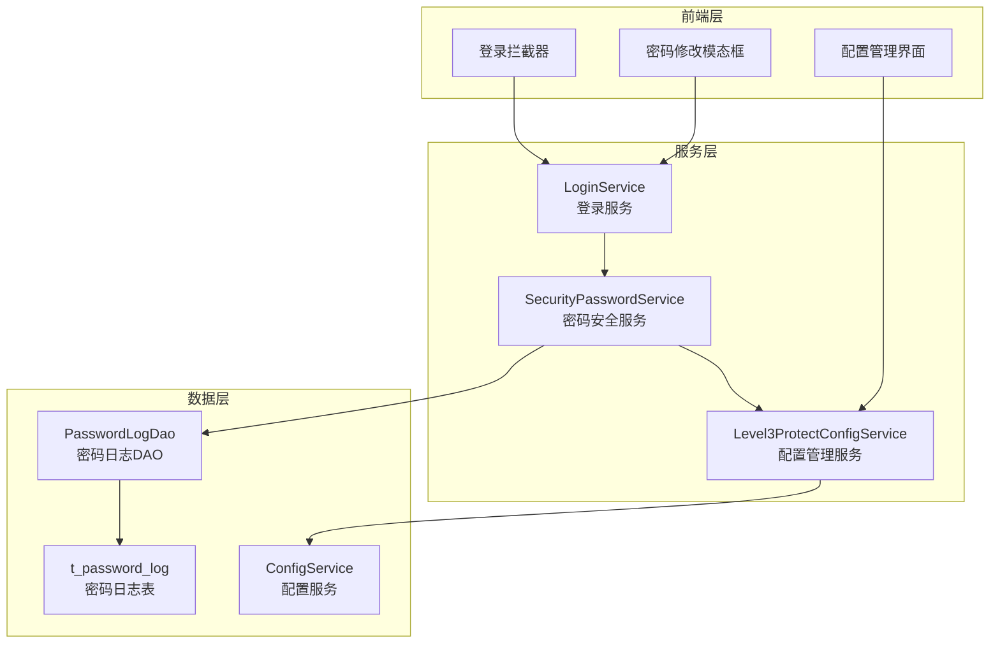
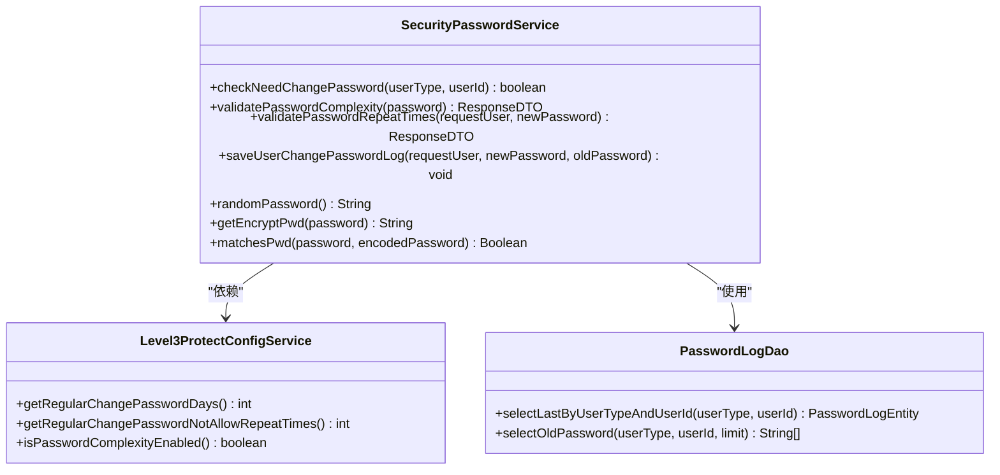
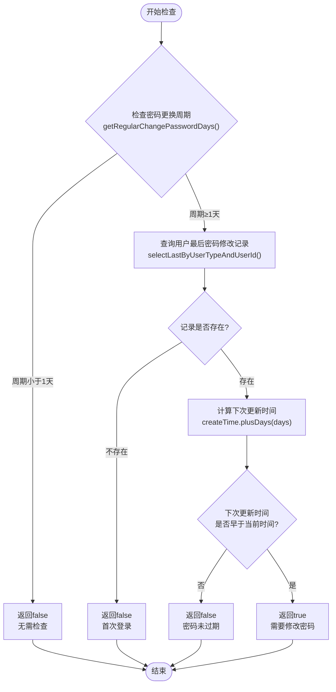
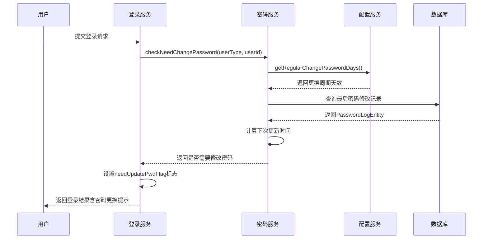
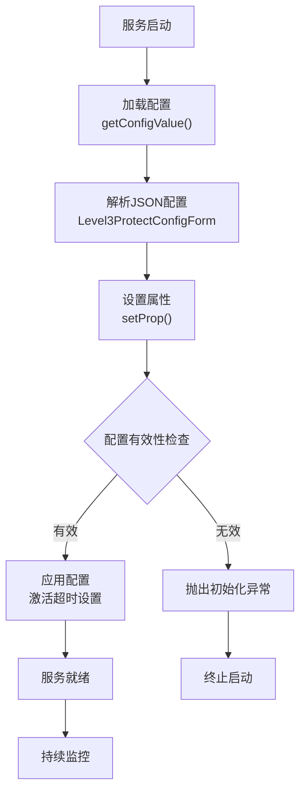
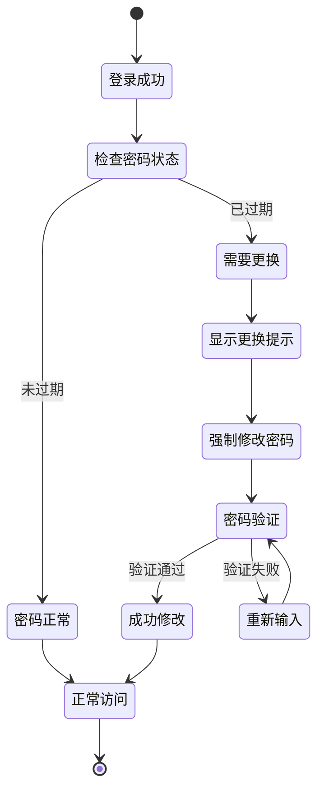
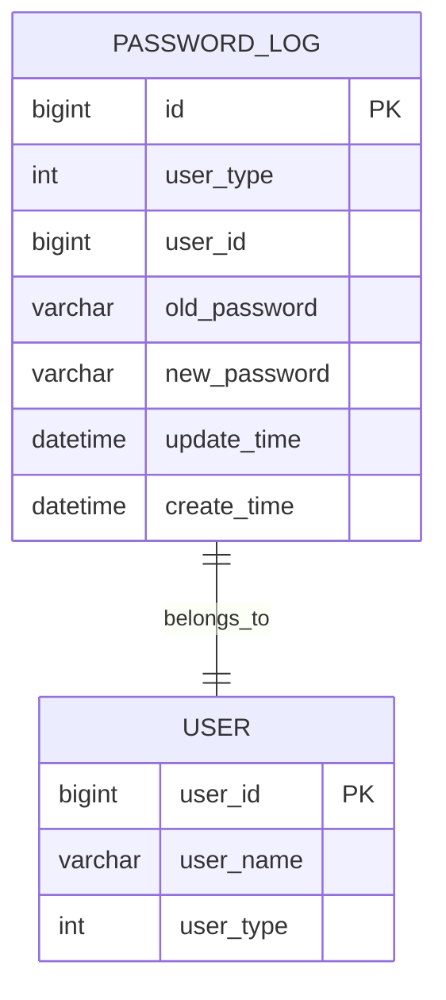
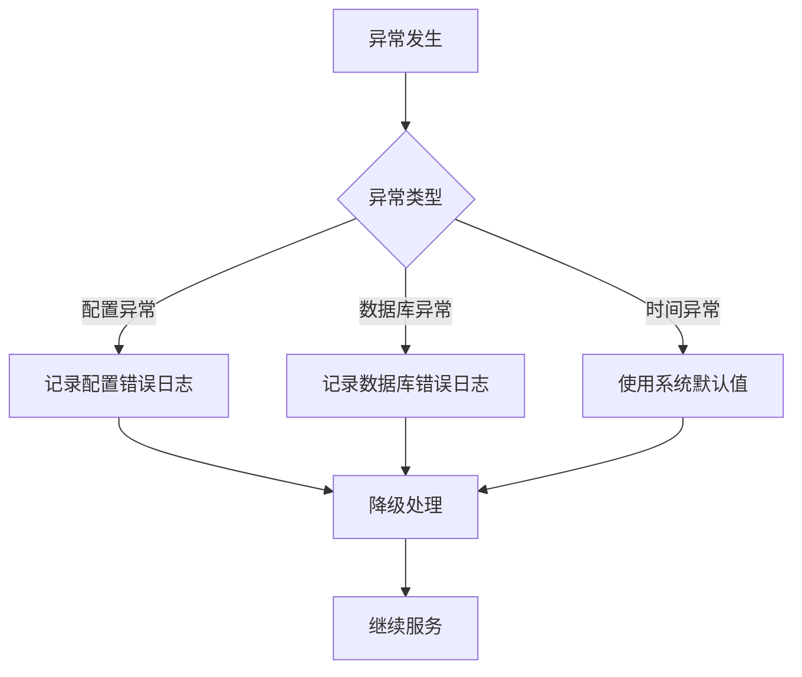

# 密码定期更换策略

<cite>
**本文档引用的文件**
- [SecurityPasswordService.java](file://smart-admin-api-java17-springboot3/sa-base/src/main/java/net/lab1024.sa.base/module/support/securityprotect/service/SecurityPasswordService.java)
- [Level3ProtectConfigService.java](file://smart-admin-api-java17-springboot3/sa-base/src/main/java/net/lab1024.sa.base/module/support/securityprotect/service/Level3ProtectConfigService.java)
- [PasswordLogDao.java](file://smart-admin-api-java17-springboot3/sa-base/src/main/java/net/lab1024.sa.base/module/support/securityprotect/dao/PasswordLogDao.java)
- [PasswordLogEntity.java](file://smart-admin-api-java17-springboot3/sa-base/src/main/java/net/lab1024.sa.base/module/support/securityprotect/domain/PasswordLogEntity.java)
- [LoginService.java](file://smart-admin-api-java17-springboot3/sa-admin/src/main/java/net/lab1024.sa/admin/module/system/login/service/LoginService.java)
- [regular-change-password-modal.vue](file://smart-admin-web-javascript/src/layout/components/change-password/regular-change-password-modal.vue)
- [level3-protect-config-index.vue](file://smart-admin-web-javascript/src/views/support/level3protect/level3-protect-config-index.vue)
- [PasswordLogMapper.xml](file://smart-admin-api-java17-springboot3/sa-base/src/main/resources/mapper/support/PasswordLogMapper.xml)
</cite>

## 目录
1. [概述](#概述)
2. [系统架构](#系统架构)
3. [核心组件分析](#核心组件分析)
4. [密码过期检查机制](#密码过期检查机制)
5. [配置管理系统](#配置管理系统)
6. [前端交互流程](#前端交互流程)
7. [数据库设计](#数据库设计)
8. [异常处理策略](#异常处理策略)
9. [业务场景应用](#业务场景应用)
10. [最佳实践建议](#最佳实践建议)

## 概述

密码定期更换策略是三级等保安全防护体系的核心组成部分，旨在通过定期强制用户更换密码来提升系统安全性。该策略基于密码修改时间周期进行判断，当用户密码超过设定的有效期时，系统会强制要求用户修改密码。

### 主要特性

- **周期性密码更换**：支持按天或按月设置密码更换周期
- **历史密码验证**：防止用户重复使用近期密码
- **灵活配置管理**：支持动态调整密码策略参数
- **多层级安全防护**：结合复杂度验证和重复使用限制
- **无缝用户体验**：提供友好的密码修改界面

## 系统架构



**架构图来源**
- [LoginService.java](file://smart-admin-api-java17-springboot3/sa-admin/src/main/java/net/lab1024.sa/admin/module/system/login/service/LoginService.java#L250-L260)
- [SecurityPasswordService.java](file://smart-admin-api-java17-springboot3/sa-base/src/main/java/net/lab1024.sa.base/module/support/securityprotect/service/SecurityPasswordService.java#L126-L139)

## 核心组件分析

### SecurityPasswordService - 密码安全服务

SecurityPasswordService是密码安全策略的核心服务，负责密码复杂度验证、重复使用检查和密码过期判断等功能。

#### 关键方法分析



**类图来源**
- [SecurityPasswordService.java](file://smart-admin-api-java17-springboot3/sa-base/src/main/java/net/lab1024.sa.base/module/support/securityprotect/service/SecurityPasswordService.java#L28-L157)
- [Level3ProtectConfigService.java](file://smart-admin-api-java17-springboot3/sa-base/src/main/java/net/lab1024.sa.base/module/support/securityprotect/service/Level3ProtectConfigService.java#L27-L189)

**节来源**
- [SecurityPasswordService.java](file://smart-admin-api-java17-springboot3/sa-base/src/main/java/net/lab1024.sa.base/module/support/securityprotect/service/SecurityPasswordService.java#L126-L139)
- [Level3ProtectConfigService.java](file://smart-admin-api-java17-springboot3/sa-base/src/main/java/net/lab1024.sa.base/module/support/securityprotect/service/Level3ProtectConfigService.java#L76-L78)

### Level3ProtectConfigService - 三级等保配置服务

Level3ProtectConfigService负责管理三级等保相关的安全配置，包括密码更换周期、复杂度要求等参数。

#### 配置参数说明

| 参数名称 | 类型 | 默认值 | 描述 |
|---------|------|--------|------|
| regularChangePasswordDays | int | 90 | 定期修改密码时间间隔（天） |
| regularChangePasswordNotAllowRepeatTimes | int | 3 | 不允许重复使用的密码次数 |
| passwordComplexityEnabled | boolean | true | 密码复杂度是否开启 |
| loginFailMaxTimes | int | -1 | 连续登录失败次数锁定阈值 |
| loginFailLockSeconds | int | 1800 | 登录失败锁定时间（秒） |

**节来源**
- [Level3ProtectConfigService.java](file://smart-admin-api-java17-springboot3/sa-base/src/main/java/net/lab1024.sa.base/module/support/securityprotect/service/Level3ProtectConfigService.java#L76-L87)

## 密码过期检查机制

### checkNeedChangePassword方法实现

checkNeedChangePassword方法是密码过期检查的核心逻辑，其执行流程如下：



**流程图来源**
- [SecurityPasswordService.java](file://smart-admin-api-java17-springboot3/sa-base/src/main/java/net/lab1024.sa.base/module/support/securityprotect/service/SecurityPasswordService.java#L126-L139)

### 密码更换周期计算逻辑

系统通过以下公式计算密码是否过期：

```
下次更新时间 = 最后修改时间 + 密码更换周期天数
当前时间 > 下次更新时间 → 密码已过期
```

### 前端登录拦截流程



**序列图来源**
- [LoginService.java](file://smart-admin-api-java17-springboot3/sa-admin/src/main/java/net/lab1024.sa/admin/module/system/login/service/LoginService.java#L250-L258)

**节来源**
- [SecurityPasswordService.java](file://smart-admin-api-java17-springboot3/sa-base/src/main/java/net/lab1024.sa.base/module/support/securityprotect/service/SecurityPasswordService.java#L126-L139)
- [LoginService.java](file://smart-admin-api-java17-springboot3/sa-admin/src/main/java/net/lab1024.sa/admin/module/system/login/service/LoginService.java#L250-L258)

## 配置管理系统

### 动态配置机制

系统支持运行时动态调整密码策略配置，无需重启服务即可生效。

#### 配置初始化流程



**流程图来源**
- [Level3ProtectConfigService.java](file://smart-admin-api-java17-springboot3/sa-base/src/main/java/net/lab1024.sa.base/module/support/securityprotect/service/Level3ProtectConfigService.java#L118-L126)

### 配置参数管理

#### 密码更换周期转换机制

系统采用月到天的转换机制：
- 输入：regularChangePasswordMonths（月）
- 转换：regularChangePasswordDays = months * 30
- 默认值：3个月（90天）

#### 前端配置界面

前端提供了直观的配置管理界面，支持以下参数设置：

| 配置项 | 默认值 | 取值范围 | 说明 |
|--------|--------|----------|------|
| 定期修改密码时间间隔 | 3个月 | 0-6个月 | 密码最长有效期 |
| 定期修改密码不允许重复次数 | 3次 | 0-6次 | 防止重复使用密码 |
| 密码复杂度 | 开启 | 开启/关闭 | 强制密码强度要求 |
| 连续登录失败次数 | 5次 | 0-10次 | 登录失败锁定阈值 |

**节来源**
- [Level3ProtectConfigService.java](file://smart-admin-api-java17-springboot3/sa-base/src/main/java/net/lab1024.sa.base/module/support/securityprotect/service/Level3ProtectConfigService.java#L157-L160)
- [level3-protect-config-index.vue](file://smart-admin-web-javascript/src/views/support/level3protect/level3-protect-config-index.vue#L175-L204)

## 前端交互流程

### 密码更换提醒机制

当系统检测到密码即将过期或已过期时，会通过以下方式提醒用户：



**状态图来源**
- [regular-change-password-modal.vue](file://smart-admin-web-javascript/src/layout/components/change-password/regular-change-password-modal.vue#L27-L47)

### 密码修改界面设计

前端密码修改界面提供了以下功能：

- **密码强度提示**：实时显示密码复杂度要求
- **重复使用检查**：防止用户输入历史密码
- **强制修改模式**：在密码过期时强制打开修改窗口
- **安全提示信息**：显示密码更换的重要性和必要性

**节来源**
- [regular-change-password-modal.vue](file://smart-admin-web-javascript/src/layout/components/change-password/regular-change-password-modal.vue#L10-L48)

## 数据库设计

### 密码日志表结构

系统通过t_password_log表记录用户的密码修改历史：



**实体关系图来源**
- [PasswordLogEntity.java](file://smart-admin-api-java17-springboot3/sa-base/src/main/java/net/lab1024.sa.base/module/support/securityprotect/domain/PasswordLogEntity.java#L15-L43)

### 数据库查询优化

#### 最后一次密码修改查询

```sql
SELECT * FROM t_password_log 
WHERE user_id = #{userId} AND user_type = #{userType}
ORDER BY id DESC LIMIT 1
```

#### 历史密码查询

```sql
SELECT new_password FROM t_password_log 
WHERE user_id = #{userId} AND user_type = #{userType}
ORDER BY id DESC LIMIT #{limit}
```

**节来源**
- [PasswordLogMapper.xml](file://smart-admin-api-java17-springboot3/sa-base/src/main/resources/mapper/support/PasswordLogMapper.xml#L6-L28)

## 异常处理策略

### 密码过期检查异常情况

系统针对不同异常情况提供了相应的处理策略：

#### 1. 配置缺失异常
- **场景**：t_config表中缺少三级等保配置
- **处理**：服务启动时抛出ExceptionInInitializerError异常
- **解决方案**：确保配置表中有正确的初始配置

#### 2. 密码日志缺失异常
- **场景**：新用户首次登录或密码日志表为空
- **处理**：checkNeedChangePassword方法返回false
- **影响**：系统不会强制要求新用户修改密码

#### 3. 时间计算异常
- **场景**：系统时间异常或数据库时间不同步
- **处理**：使用LocalDateTime.now()进行时间比较
- **预防**：建议配置NTP时间同步服务

### 错误处理最佳实践



## 业务场景应用

### 场景一：企业员工密码管理

**业务需求**：
- 每3个月强制员工更换密码
- 防止密码重复使用
- 确保密码复杂度符合要求

**实施步骤**：
1. 配置密码更换周期为90天
2. 设置不允许重复使用最近3次密码
3. 启用密码复杂度验证
4. 部署密码更换提醒机制

**效果评估**：
- 提升了账户安全性
- 减少了密码泄露风险
- 符合三级等保安全要求

### 场景二：系统管理员账户保护

**业务需求**：
- 管理员账户需要更严格的密码策略
- 支持临时密码和永久密码两种模式
- 提供密码生成工具

**实施策略**：
1. 配置较短的密码更换周期（如30天）
2. 增强密码复杂度要求
3. 提供随机密码生成功能
4. 实施双因子认证

### 场景三：外部用户访问控制

**业务需求**：
- 外部用户访问需要定期密码更换
- 支持密码到期通知
- 提供自助密码重置功能

**技术实现**：
1. 集成邮件通知服务
2. 实现密码到期预警机制
3. 提供移动端密码修改支持

## 最佳实践建议

### 配置优化建议

#### 1. 密码更换周期设置
- **一般用户**：建议设置为90天（3个月）
- **管理员用户**：建议设置为30天（1个月）
- **高危账户**：建议设置为7-14天

#### 2. 重复使用限制
- **普通账户**：建议限制为3次
- **管理员账户**：建议限制为5次
- **高危账户**：建议限制为7次

#### 3. 密码复杂度要求
- **启用复杂度验证**：确保密码包含大小写字母、数字和特殊符号
- **最小长度要求**：建议设置为8位
- **定期更新策略**：结合用户习惯和安全需求

### 性能优化建议

#### 1. 缓存策略
- 缓存用户密码状态信息
- 实施合理的缓存过期时间
- 避免频繁查询数据库

#### 2. 批量处理
- 对于大量用户的密码检查，考虑批量处理
- 实施异步处理机制
- 优化数据库查询性能

#### 3. 监控告警
- 监控密码更换成功率
- 跟踪密码策略执行效果
- 设置异常行为告警

### 安全加固建议

#### 1. 密码存储安全
- 使用Argon2算法进行密码哈希
- 实施盐值随机化
- 定期轮换密钥材料

#### 2. 传输安全
- 确保HTTPS传输
- 实施CSRF防护
- 验证用户身份认证

#### 3. 日志审计
- 记录密码修改操作
- 监控异常登录行为
- 定期安全审计

### 用户体验优化

#### 1. 提示信息设计
- 提供清晰的密码更换指引
- 显示剩余有效期
- 给出密码强度评分

#### 2. 流程简化
- 支持一键生成强密码
- 提供密码历史查看
- 实施智能提醒机制

#### 3. 移动端适配
- 优化移动端界面
- 支持手势操作
- 提供离线密码生成

通过以上密码定期更换策略的实施，可以有效提升系统的整体安全水平，满足三级等保的安全要求，同时为用户提供良好的使用体验。系统具备良好的可配置性和扩展性，能够适应不同业务场景的安全需求。