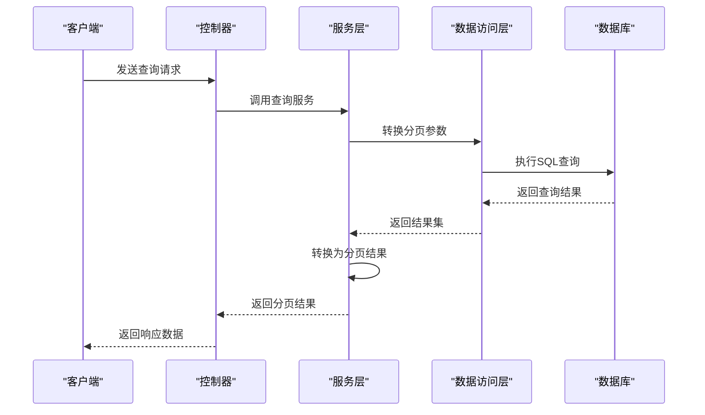
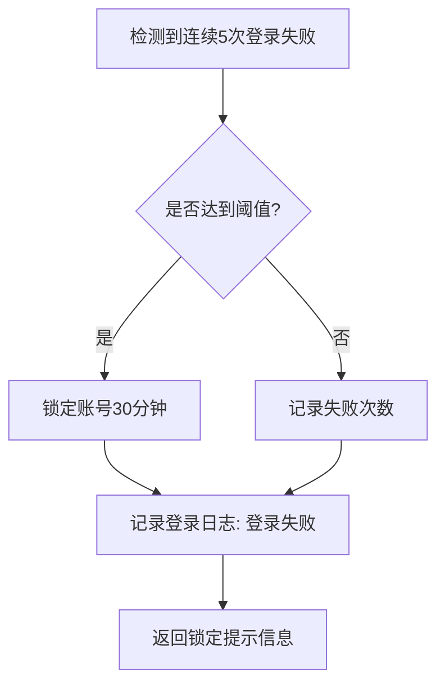

# 安全审计

<cite>
**本文档引用的文件**
- [OperateLog.java](file://smart-admin-api-java17-springboot3\sa-base\src\main\java\net\lab1024\sa\base\module\support\operatelog\annotation\OperateLog.java)
- [OperateLogAspect.java](file://smart-admin-api-java17-springboot3\sa-base\src\main\java\net\lab1024\sa\base\module\support\operatelog\core\OperateLogAspect.java)
- [OperateLogEntity.java](file://smart-admin-api-java17-springboot3\sa-base\src\main\java\net\lab1024\sa\base\module\support\operatelog\domain\OperateLogEntity.java)
- [OperateLogService.java](file://smart-admin-api-java17-springboot3\sa-base\src\main\java\net\lab1024\sa\base\module\support\operatelog\OperateLogService.java)
- [OperateLogMapper.xml](file://smart-admin-api-java17-springboot3\sa-base\src\main\resources\mapper\support\OperateLogMapper.xml)
- [AdminOperateLogController.java](file://smart-admin-api-java17-springboot3\sa-admin\src\main\java\net\lab1024\sa\admin\module\system\support\AdminOperateLogController.java)
- [OperateLogAspectConfig.java](file://smart-admin-api-java17-springboot3\sa-admin\src\main\java\net\lab1024\sa\admin\config\OperateLogAspectConfig.java)
- [LoginLogEntity.java](file://smart-admin-api-java17-springboot3\sa-base\src\main\java\net\lab1024\sa\base\module\support\loginlog\domain\LoginLogEntity.java)
- [LoginLogService.java](file://smart-admin-api-java17-springboot3\sa-base\src\main\java\net\lab1024\sa\base\module\support\loginlog\LoginLogService.java)
- [LoginLogMapper.xml](file://smart-admin-api-java17-springboot3\sa-base\src\main\resources\mapper\support\LoginLogMapper.xml)
- [AdminLoginLogController.java](file://smart-admin-api-java17-springboot3\sa-admin\src\main\java\net\lab1024\sa\admin\module\system\support\AdminLoginLogController.java)
- [LoginLogResultEnum.java](file://smart-admin-api-java17-springboot3\sa-base\src\main\java\net\lab1024\sa\base\module\support\loginlog\LoginLogResultEnum.java)
</cite>

## 目录
1. [操作日志功能](#操作日志功能)
2. [OperateLog注解使用方法](#operatelog注解使用方法)
3. [OperateLogAspect切面机制](#operatelogaspect切面机制)
4. [登录日志记录内容](#登录日志记录内容)
5. [日志数据存储结构](#日志数据存储结构)
6. [日志查询接口](#日志查询接口)
7. [审计日志分析示例](#审计日志分析示例)
8. [日志保留策略与合规性](#日志保留策略与合规性)
9. [日志级别与敏感信息过滤](#日志级别与敏感信息过滤)

## 操作日志功能

操作日志功能是系统安全审计的核心组件，用于记录用户在系统中的所有关键操作行为。该功能通过AOP（面向切面编程）技术实现，能够自动捕获被`@OperateLog`注解标记的方法执行情况，包括方法调用前后的状态变化、请求参数、响应结果等信息。

系统通过异步线程池处理日志记录，确保日志记录不会影响主业务流程的性能。操作日志不仅记录了成功执行的操作，还记录了失败的操作及其异常信息，为系统故障排查和安全审计提供了完整的数据支持。

操作日志的主要用途包括：
- 追踪用户操作行为，满足合规性要求
- 分析系统使用情况，优化用户体验
- 诊断和排查系统问题
- 检测异常操作行为，防范安全风险

**本节来源**
- [OperateLogAspect.java](file://smart-admin-api-java17-springboot3\sa-base\src\main\java\net\lab1024\sa\base\module\support\operatelog\core\OperateLogAspect.java#L43-L51)
- [OperateLogEntity.java](file://smart-admin-api-java17-springboot3\sa-base\src\main\java\net\lab1024\sa\base\module\support\operatelog\domain\OperateLogEntity.java#L13-L21)

## OperateLog注解使用方法

`@OperateLog`注解是操作日志功能的入口，用于标记需要记录操作日志的类或方法。该注解可以应用于类级别或方法级别，当应用于类级别时，该类中的所有公共方法都将被记录操作日志。

### 注解定义

`@OperateLog`注解的定义如下：

```java
@Retention(RetentionPolicy.RUNTIME)
@Target({ElementType.TYPE, ElementType.METHOD})
@Documented
public @interface OperateLog {
}
```

### 使用示例

在控制器类或方法上添加`@OperateLog`注解即可启用操作日志记录：

```java
@RestController
@OperateLog
public class UserController {
    
    @PostMapping("/user/create")
    public ResponseDTO<String> createUser(@RequestBody UserForm form) {
        // 创建用户逻辑
        return ResponseDTO.ok();
    }
    
    @PutMapping("/user/update")
    public ResponseDTO<String> updateUser(@RequestBody UserForm form) {
        // 更新用户逻辑
        return ResponseDTO.ok();
    }
}
```

或者仅对特定方法启用日志记录：

```java
@RestController
public class UserController {
    
    @PostMapping("/user/create")
    @OperateLog
    public ResponseDTO<String> createUser(@RequestBody UserForm form) {
        // 创建用户逻辑
        return ResponseDTO.ok();
    }
    
    @GetMapping("/user/list")
    public ResponseDTO<List<UserVO>> listUsers() {
        // 查询用户列表（不记录操作日志）
        return ResponseDTO.ok();
    }
}
```

当方法被调用时，系统会自动记录以下信息：
- 操作人ID和用户名
- 请求URL和方法签名
- 请求参数（过滤敏感类型）
- 响应结果（脱敏处理）
- IP地址和地理位置
- 用户代理信息
- 操作结果（成功/失败）和失败原因

**本节来源**
- [OperateLog.java](file://smart-admin-api-java17-springboot3\sa-base\src\main\java\net\lab1024\sa\base\module\support\operatelog\annotation\OperateLog.java#L1-L19)
- [OperateLogAspect.java](file://smart-admin-api-java17-springboot3\sa-base\src\main\java\net\lab1024\sa\base\module\support\operatelog\core\OperateLogAspect.java#L56-L57)

## OperateLogAspect切面机制

`OperateLogAspect`是操作日志功能的核心实现，采用AOP切面编程技术，通过环绕通知捕获被`@OperateLog`注解标记的方法执行过程。

### 切面配置

切面的切入点定义如下：

```java
private static final String POINT_CUT = "@within(net.lab1024.sa.base.module.support.operatelog.annotation.OperateLog) || @annotation(net.lab1024.sa.base.module.support.operatelog.annotation.OperateLog)";
```

此切入点配置表示：当类上或方法上存在`@OperateLog`注解时，该方法将被切面拦截。

### 执行流程

切面的执行流程如下：

```mermaid
flowchart TD
A[方法调用] --> B{是否存在@OperateLog注解?}
B --> |否| C[直接执行方法]
B --> |是| D[创建JoinPoint]
D --> E[获取用户信息]
E --> F[记录方法执行前状态]
F --> G[执行目标方法]
G --> H{方法执行成功?}
H --> |是| I[调用doAfterReturning]
H --> |否| J[调用doAfterThrowing]
I --> K[构建操作日志实体]
J --> K
K --> L[异步提交日志记录]
L --> M[返回方法结果]
```

### 通知方法

切面定义了两个通知方法：

1. **`doAfterReturning`**：在方法成功返回后执行
2. **`doAfterThrowing`**：在方法抛出异常后执行

这两个通知方法都会调用`handleLog`方法处理日志记录，确保无论方法执行成功还是失败，都会生成相应的操作日志。

### 异步处理

为了不影响主业务流程的性能，日志记录采用异步方式处理：

```java
taskExecutor.execute(() -> {
    this.saveLog(operateLogEntity);
});
```

系统初始化了一个专用的线程池用于处理日志记录任务，配置参数包括：
- 核心线程数：1
- 队列容量：10000
- 线程名称前缀：smart-operate-log

**本节来源**
- [OperateLogAspect.java](file://smart-admin-api-java17-springboot3\sa-base\src\main\java\net\lab1024\sa\base\module\support\operatelog\core\OperateLogAspect.java#L71-L83)
- [OperateLogAspectConfig.java](file://smart-admin-api-java17-springboot3\sa-admin\src\main\java\net\lab1024\sa\admin\config\OperateLogAspectConfig.java#L1-L28)
- [OperateLogAspect.java](file://smart-admin-api-java17-springboot3\sa-base\src\main\java\net\lab1024\sa\base\module\support\operatelog\core\OperateLogAspect.java#L88-L111)

## 登录日志记录内容

登录日志用于记录用户登录系统的所有相关信息，是安全审计的重要组成部分。系统详细记录了每次登录尝试的完整信息，包括成功和失败的登录尝试。

### 记录字段

登录日志包含以下关键信息：

| 字段 | 说明 |
|------|------|
| userId | 用户ID |
| userType | 用户类型 |
| userName | 用户名 |
| loginIp | 登录IP地址 |
| loginIpRegion | IP地理位置 |
| userAgent | 用户代理信息 |
| loginDevice | 登录设备类型 |
| loginResult | 登录结果 |
| createTime | 创建时间 |
| remark | 备注信息 |

### 登录结果类型

系统定义了三种登录结果类型，通过`LoginLogResultEnum`枚举类表示：

```java
public enum LoginLogResultEnum implements BaseEnum {
    LOGIN_SUCCESS(0, "登录成功"),
    LOGIN_FAIL(1, "登录失败"),
    LOGIN_OUT(2, "退出登录");
}
```

### 设备类型识别

系统能够自动识别用户的登录设备类型，包括：
- PC端
- 移动端（iOS/Android）
- 平板设备
- 其他设备

设备类型信息从用户代理（User-Agent）字符串中解析得出，有助于分析用户访问习惯和安全风险。

### IP地理位置

系统集成了IP地理位置解析功能，能够将IP地址转换为地理位置信息，包括：
- 国家
- 省份
- 城市
- 运营商

这有助于识别异常登录行为，如异地登录等安全风险。

**本节来源**
- [LoginLogEntity.java](file://smart-admin-api-java17-springboot3\sa-base\src\main\java\net\lab1024\sa\base\module\support\loginlog\domain\LoginLogEntity.java#L23-L77)
- [LoginLogResultEnum.java](file://smart-admin-api-java17-springboot3\sa-base\src\main\java\net\lab1024\sa\base\module\support\loginlog\LoginLogResultEnum.java#L1-L38)
- [LoginLogVO.java](file://smart-admin-api-java17-springboot3\sa-base\src\main\java\net\lab1024\sa\base\module\support\loginlog\domain\LoginLogVO.java#L1-L53)

## 日志数据存储结构

系统采用关系型数据库存储操作日志和登录日志，确保数据的持久化和可查询性。

### 操作日志表结构

操作日志存储在`t_operate_log`表中，其结构如下：

```sql
CREATE TABLE t_operate_log (
    operate_log_id BIGINT AUTO_INCREMENT PRIMARY KEY,
    operate_user_id BIGINT NOT NULL,
    operate_user_type INT NOT NULL,
    operate_user_name VARCHAR(50) NOT NULL,
    module VARCHAR(100),
    content VARCHAR(200),
    url VARCHAR(500) NOT NULL,
    method VARCHAR(500) NOT NULL,
    param TEXT,
    response TEXT,
    ip VARCHAR(50) NOT NULL,
    ip_region VARCHAR(100),
    user_agent TEXT,
    success_flag BOOLEAN NOT NULL,
    fail_reason TEXT,
    update_time DATETIME,
    create_time DATETIME DEFAULT CURRENT_TIMESTAMP
);
```

### 登录日志表结构

登录日志存储在`t_login_log`表中，其结构如下：

```sql
CREATE TABLE t_login_log (
    login_log_id BIGINT AUTO_INCREMENT PRIMARY KEY,
    user_id BIGINT NOT NULL,
    user_type INT NOT NULL,
    user_name VARCHAR(50) NOT NULL,
    login_ip VARCHAR(50) NOT NULL,
    login_ip_region VARCHAR(100),
    user_agent TEXT,
    remark VARCHAR(200),
    login_device VARCHAR(50),
    login_result INT NOT NULL,
    update_time DATETIME,
    create_time DATETIME DEFAULT CURRENT_TIMESTAMP
);
```

### 索引设计

为了提高查询性能，系统在关键字段上创建了索引：

- 操作日志表：
  - `idx_create_time`：按创建时间查询
  - `idx_user_id`：按用户ID查询
  - `idx_url`：按请求URL查询

- 登录日志表：
  - `idx_create_time`：按创建时间查询
  - `idx_user_id`：按用户ID查询
  - `idx_ip`：按IP地址查询

### 数据存储策略

系统采用以下数据存储策略：
- 所有日志记录都包含创建时间戳
- 敏感信息（如密码）在记录前已被过滤
- 响应结果中的敏感数据已被脱敏处理
- 日志记录采用异步方式，避免影响主业务性能

**本节来源**
- [OperateLogEntity.java](file://smart-admin-api-java17-springboot3\sa-base\src\main\java\net\lab1024\sa\base\module\support\operatelog\domain\OperateLogEntity.java#L26-L27)
- [LoginLogEntity.java](file://smart-admin-api-java17-springboot3\sa-base\src\main\java\net\lab1024\sa\base\module\support\loginlog\domain\LoginLogEntity.java#L20-L21)
- [OperateLogMapper.xml](file://smart-admin-api-java17-springboot3\sa-base\src\main\resources\mapper\support\OperateLogMapper.xml#L1-L45)
- [LoginLogMapper.xml](file://smart-admin-api-java17-springboot3\sa-base\src\main\resources\mapper\support\LoginLogMapper.xml#L1-L44)

## 日志查询接口

系统提供了完善的日志查询接口，支持按多种条件进行分页查询和详细信息查看。

### 操作日志查询接口

#### 分页查询

```java
@PostMapping("/operateLog/page/query")
@SaCheckPermission("support:operateLog:query")
public ResponseDTO<PageResult<OperateLogVO>> queryByPage(@RequestBody OperateLogQueryForm queryForm)
```

**请求参数：**
- `operateUserId`：操作人ID
- `operateUserType`：操作人类型
- `keywords`：关键字搜索（模块、操作内容）
- `requestKeywords`：请求关键字（URL、方法、参数）
- `startDate`：开始日期
- `endDate`：结束日期
- `userName`：用户名
- `successFlag`：请求结果（true成功，false失败）

#### 详情查询

```java
@GetMapping("/operateLog/detail/{operateLogId}")
@SaCheckPermission("support:operateLog:detail")
public ResponseDTO<OperateLogVO> detail(@PathVariable Long operateLogId)
```

#### 当前用户操作日志

```java
@PostMapping("/operateLog/page/query/login")
public ResponseDTO<PageResult<OperateLogVO>> queryByPageLogin(@RequestBody OperateLogQueryForm queryForm)
```

### 登录日志查询接口

#### 分页查询

```java
@PostMapping("/loginLog/page/query")
@SaCheckPermission("support:loginLog:query")
public ResponseDTO<PageResult<LoginLogVO>> queryByPage(@RequestBody LoginLogQueryForm queryForm)
```

**请求参数：**
- `userId`：用户ID
- `userType`：用户类型
- `startDate`：开始日期
- `endDate`：结束日期
- `userName`：用户名
- `ip`：IP地址

#### 当前用户登录日志

```java
@PostMapping("/loginLog/page/query/login")
public ResponseDTO<PageResult<LoginLogVO>> queryByPageLogin(@RequestBody LoginLogQueryForm queryForm)
```

### 查询流程



**本节来源**
- [AdminOperateLogController.java](file://smart-admin-api-java17-springboot3\sa-admin\src\main\java\net\lab1024\sa\admin\module\system\support\AdminOperateLogController.java#L34-L57)
- [OperateLogService.java](file://smart-admin-api-java17-springboot3\sa-base\src\main\java\net\lab1024\sa\base\module\support\operatelog\OperateLogService.java#L36-L41)
- [AdminLoginLogController.java](file://smart-admin-api-java17-springboot3\sa-admin\src\main\java\net\lab1024\sa\admin\module\system\support\AdminLoginLogController.java#L31-L53)
- [LoginLogService.java](file://smart-admin-api-java17-springboot3\sa-base\src\main\java\net\lab1024\sa\base\module\support\loginlog\LoginLogService.java#L37-L41)

## 审计日志分析示例

通过审计日志，可以追踪用户操作行为，分析系统使用情况，并检测潜在的安全风险。

### 用户操作行为追踪

假设需要追踪用户ID为123的管理员在2024年1月1日的操作行为，可以执行以下查询：

```json
{
  "operateUserId": 123,
  "startDate": "2024-01-01",
  "endDate": "2024-01-01"
}
```

查询结果可能显示：
1. 09:15：登录系统（成功）
2. 09:20：查看用户列表
3. 10:30：创建新用户（成功）
4. 11:15：修改用户权限（成功）
5. 14:20：导出报表数据（成功）
6. 18:00：退出登录

通过这些日志，可以完整还原该用户当天的操作轨迹。

### 异常行为检测

系统可以检测以下异常行为模式：

#### 频繁失败登录尝试



#### 大量数据导出

当检测到用户在短时间内导出大量数据时，系统可以：
- 记录详细操作日志
- 发送安全警告
- 需要二次验证

#### 非常规时间访问

系统可以识别非常规时间的访问行为，如：
- 凌晨2-5点的系统访问
- 节假日的系统访问
- 异地登录（IP地理位置变化）

### 安全事件分析

假设发生了一起数据泄露事件，可以通过以下步骤进行分析：

1. **确定时间范围**：根据发现时间确定可能的泄露时间窗口
2. **查询相关操作**：查找该时间范围内所有数据访问和导出操作
3. **识别可疑用户**：分析哪些用户的操作模式异常
4. **追踪操作链**：还原可疑用户的完整操作流程
5. **确定影响范围**：评估泄露的数据范围和影响程度

通过这种系统化的日志分析，可以快速定位安全事件的根源，并采取相应的应对措施。

**本节来源**
- [OperateLogAspect.java](file://smart-admin-api-java17-springboot3\sa-base\src\main\java\net\lab1024\sa\base\module\support\operatelog\core\OperateLogAspect.java#L177-L238)
- [LoginLogService.java](file://smart-admin-api-java17-springboot3\sa-base\src\main\java\net\lab1024\sa\base\module\support\loginlog\LoginLogService.java#L48-L54)
- [SecurityLoginService.java](file://smart-admin-api-java17-springboot3\sa-base\src\main\java\net\lab1024\sa\base\module\support\securityprotect\service\SecurityLoginService.java#L52-L83)

## 日志保留策略与合规性

系统实施了严格的日志保留策略，以满足合规性要求和安全审计需要。

### 日志保留周期

根据行业最佳实践和法规要求，系统设置了不同的日志保留周期：

| 日志类型 | 保留周期 | 说明 |
|---------|---------|------|
| 操作日志 | 180天 | 记录所有用户操作行为 |
| 登录日志 | 365天 | 记录所有登录尝试信息 |
| 安全事件日志 | 1095天 | 记录重大安全事件 |

超过保留周期的日志将被自动归档或删除，以节省存储空间。

### 合规性要求

系统日志管理符合以下合规性要求：

#### 完整性要求
- 所有关键操作必须记录日志
- 日志记录不可篡改
- 日志包含足够的信息用于审计

#### 可追溯性要求
- 每条日志必须关联到具体用户
- 日志包含精确的时间戳
- 操作前后状态可追溯

#### 保密性要求
- 日志访问受权限控制
- 敏感信息必须脱敏
- 日志传输加密

### 数据归档策略

为了平衡存储成本和审计需求，系统实施了分级存储策略：

1. **在线存储**（0-30天）：存储在主数据库，支持快速查询
2. **近线存储**（31-180天）：存储在归档数据库，查询速度较慢
3. **离线存储**（181天以上）：存储在备份介质，需要申请才能访问

### 审计准备

系统定期进行日志完整性检查，确保：
- 日志记录功能正常运行
- 无日志丢失情况
- 日志格式符合规范
- 存储空间充足

**本节来源**
- [Level3ProtectConfigForm.java](file://smart-admin-api-java17-springboot3\sa-base\src\main\java\net\lab1024\sa\base\module\support\securityprotect\domain\Level3ProtectConfigForm.java#L1-L37)
- [Level3ProtectConfigService.java](file://smart-admin-api-java17-springboot3\sa-base\src\main\java\net\lab1024\sa\base\module\support\securityprotect\service\Level3ProtectConfigService.java#L1-L188)
- [SecurityLoginService.java](file://smart-admin-api-java17-springboot3\sa-base\src\main\java\net\lab1024\sa\base\module\support\securityprotect\service\SecurityLoginService.java#L1-L175)

## 日志级别与敏感信息过滤

系统实施了精细的日志级别控制和敏感信息过滤机制，确保日志既满足审计需求，又保护用户隐私。

### 日志级别配置

系统支持多种日志级别，通过配置文件进行管理：

```yaml
logging:
  level:
    net.lab1024.sa.base.module.support.operatelog: INFO
    net.lab1024.sa.base.module.support.loginlog: DEBUG
```

不同级别的日志记录不同的详细程度：
- **ERROR**：仅记录失败的操作
- **WARN**：记录异常但不影响系统运行的操作
- **INFO**：记录所有操作的基本信息
- **DEBUG**：记录操作的详细参数和返回值

### 敏感信息过滤

系统自动过滤以下类型的敏感信息：

#### 过滤规则

```java
private String buildParamString(Object[] args) {
    List<Object> filterArgs = new ArrayList<>();
    for (Object arg : args) {
        if (arg instanceof HttpServletRequest
            || arg instanceof HttpServletResponse
            || arg instanceof ModelAndView
            || arg instanceof MultipartFile
            || arg instanceof BindResult) {
            continue;
        }
        filterArgs.add(arg);
    }
    return JSON.toJSONString(filterArgs);
}
```

#### 过滤类型

1. **HTTP相关对象**：
   - HttpServletRequest
   - HttpServletResponse
   - ModelAndView

2. **文件上传对象**：
   - MultipartFile

3. **表单验证对象**：
   - BindResult

4. **其他敏感对象**

### 响应数据脱敏

在记录响应结果时，系统对敏感数据进行脱敏处理：

```java
ResponseDTO logResponseDTO = new ResponseDTO(
    response.getCode(),
    response.getLevel(),
    response.getOk(),
    response.getMsg(),
    null // 数据字段置空
);
```

这种方法确保了响应数据中的敏感信息不会被记录到日志中。

### 配置管理

日志级别和过滤规则可以通过系统配置进行动态调整，无需重启服务。管理员可以通过管理界面修改日志配置，系统会实时应用新的配置。

**本节来源**
- [OperateLogAspect.java](file://smart-admin-api-java17-springboot3\sa-base\src\main\java\net\lab1024\sa\base\module\support\operatelog\core\OperateLogAspect.java#L241-L261)
- [OperateLogAspect.java](file://smart-admin-api-java17-springboot3\sa-base\src\main\java\net\lab1024\sa\base\module\support\operatelog\core\OperateLogAspect.java#L222-L233)
- [OperateLogConfig.java](file://smart-admin-api-java17-springboot3\sa-base\src\main\java\net\lab1024\sa\base\module\support\operatelog\core\OperateLogConfig.java#L1-L38)