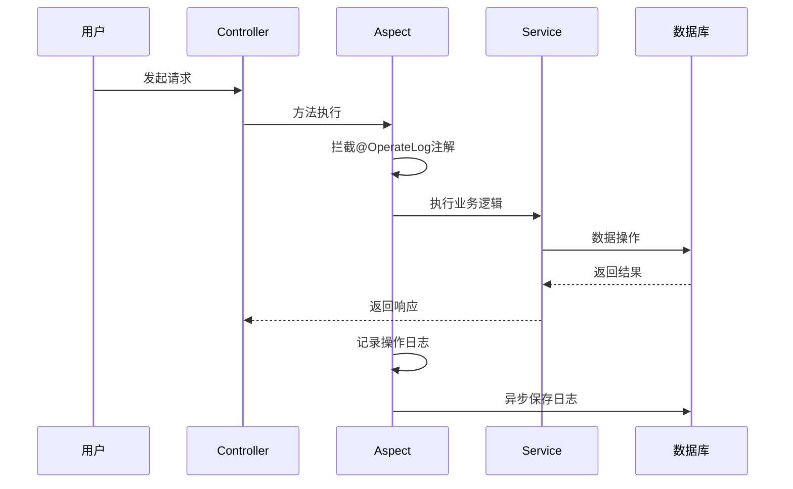
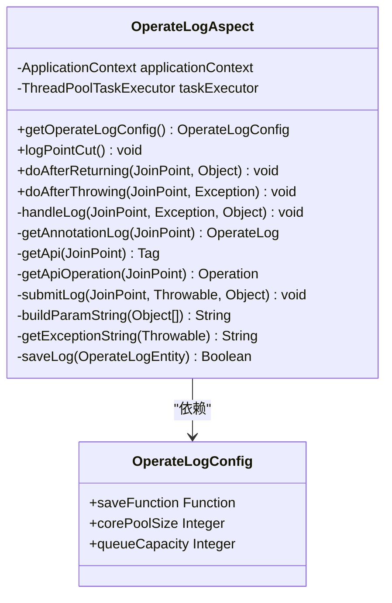
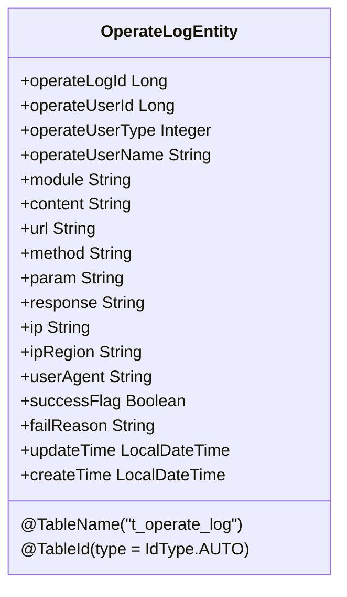
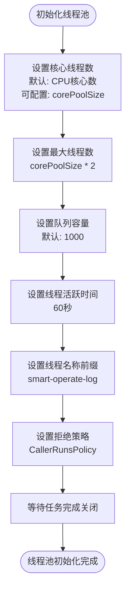
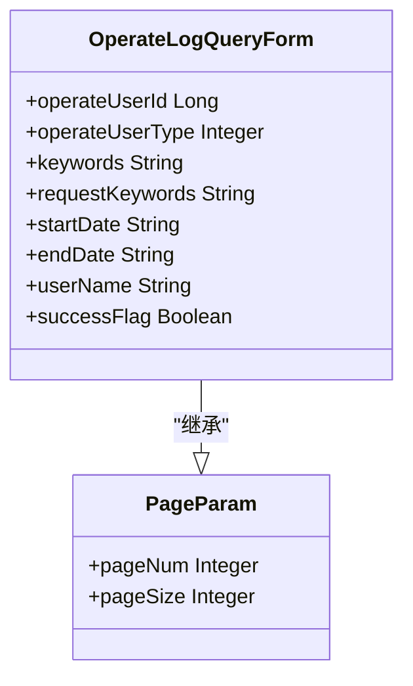
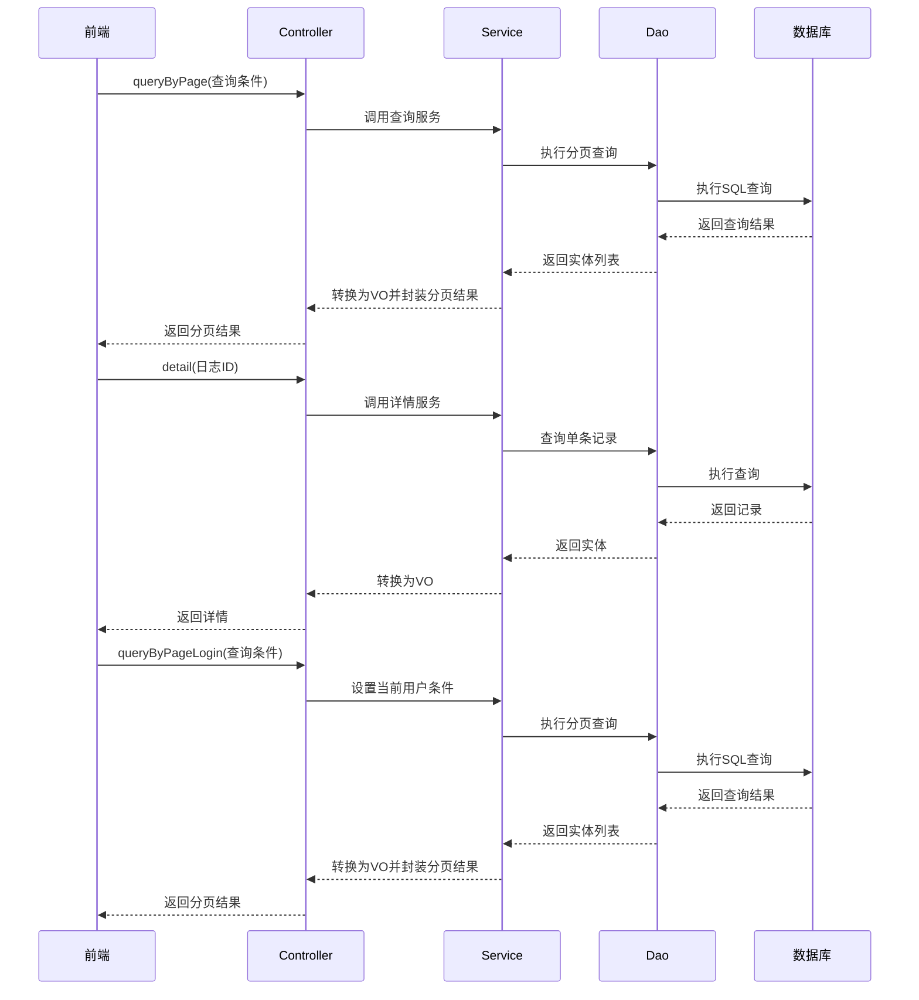
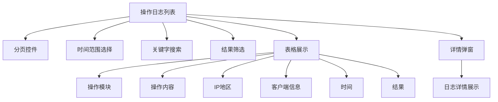

# 操作日志

<cite>
**本文档引用文件**  
- [OperateLog.java](file://smart-admin-api-java17-springboot3\sa-base\src\main\java\net\lab1024\sa\base\module\support\operatelog\annotation\OperateLog.java)
- [OperateLogAspect.java](file://smart-admin-api-java17-springboot3\sa-base\src\main\java\net\lab1024\sa\base\module\support\operatelog\core\OperateLogAspect.java)
- [OperateLogEntity.java](file://smart-admin-api-java17-springboot3\sa-base\src\main\java\net\lab1024\sa\base\module\support\operatelog\domain\OperateLogEntity.java)
- [OperateLogQueryForm.java](file://smart-admin-api-java17-springboot3\sa-base\src\main\java\net\lab1024\sa\base\module\support\operatelog\domain\OperateLogQueryForm.java)
- [OperateLogService.java](file://smart-admin-api-java17-springboot3\sa-base\src\main\java\net\lab1024\sa\base\module\support\operatelog\OperateLogService.java)
- [OperateLogDao.java](file://smart-admin-api-java17-springboot3\sa-base\src\main\java\net\lab1024\sa\base\module\support\operatelog\OperateLogDao.java)
- [OperateLogMapper.xml](file://smart-admin-api-java17-springboot3\sa-base\src\main\resources\mapper\support\OperateLogMapper.xml)
- [AdminOperateLogController.java](file://smart-admin-api-java17-springboot3\sa-admin\src\main\java\net\lab1024\sa\admin\module\system\support\AdminOperateLogController.java)
- [operate-log-api.js](file://smart-admin-web-javascript\src\api\support\operate-log-api.js)
</cite>

## 目录
1. [简介](#简介)
2. [核心组件](#核心组件)
3. [操作日志注解](#操作日志注解)
4. [切面处理机制](#切面处理机制)
5. [数据模型结构](#数据模型结构)
6. [异步处理与性能优化](#异步处理与性能优化)
7. [日志查询功能](#日志查询功能)
8. [前端集成与使用](#前端集成与使用)
9. [实际应用示例](#实际应用示例)
10. [总结](#总结)

## 简介
操作日志功能是系统审计和安全监控的重要组成部分，用于记录用户在系统中的关键操作行为。本系统通过Spring AOP技术实现了自动化的操作日志记录机制，能够捕获带有@OperateLog注解的方法执行过程，记录操作前后的状态变化。该功能支持异步处理，确保不影响主业务流程的性能，同时提供了完整的日志查询接口，支持分页和条件筛选。

## 核心组件

**本文档引用文件**  
- [OperateLog.java](file://smart-admin-api-java17-springboot3\sa-base\src\main\java\net\lab1024\sa\base\module\support\operatelog\annotation\OperateLog.java)
- [OperateLogAspect.java](file://smart-admin-api-java17-springboot3\sa-base\src\main\java\net\lab1024\sa\base\module\support\operatelog\core\OperateLogAspect.java)
- [OperateLogEntity.java](file://smart-admin-api-java17-springboot3\sa-base\src\main\java\net\lab1024\sa\base\module\support\operatelog\domain\OperateLogEntity.java)
- [OperateLogService.java](file://smart-admin-api-java17-springboot3\sa-base\src\main\java\net\lab1024\sa\base\module\support\operatelog\OperateLogService.java)
- [AdminOperateLogController.java](file://smart-admin-api-java17-springboot3\sa-admin\src\main\java\net\lab1024\sa\admin\module\system\support\AdminOperateLogController.java)

## 操作日志注解

### 注解定义
`@OperateLog`注解是操作日志功能的核心，用于标记需要记录操作日志的类或方法。该注解可以应用于类级别和方法级别，当应用于类级别时，该类中的所有公共方法都将被自动记录操作日志。

```mermaid
classDiagram
class OperateLog {
<<annotation>>
+Retention(RetentionPolicy.RUNTIME)
+Target({ElementType.TYPE, ElementType.METHOD})
+Documented
}
```

**图示来源**  
- [OperateLog.java](file://smart-admin-api-java17-springboot3\sa-base\src\main\java\net\lab1024\sa\base\module\support\operatelog\annotation\OperateLog.java#L1-L20)

### 使用方式
在Controller层使用@OperateLog注解可以轻松实现操作日志记录。注解可以应用于整个Controller类，也可以应用于特定的方法。



**图示来源**  
- [OperateLogAspect.java](file://smart-admin-api-java17-springboot3\sa-base\src\main\java\net\lab1024\sa\base\module\support\operatelog\core\OperateLogAspect.java#L75-L83)
- [OperateLog.java](file://smart-admin-api-java17-springboot3\sa-base\src\main\java\net\lab1024\sa\base\module\support\operatelog\annotation\OperateLog.java#L1-L20)

## 切面处理机制

### AOP切面实现
`OperateLogAspect`是基于Spring AOP实现的切面类，负责捕获带有@OperateLog注解的方法执行。该切面使用了@AfterReturning和@AfterThrowing两个通知，分别处理正常返回和异常抛出的情况。



**图示来源**  
- [OperateLogAspect.java](file://smart-admin-api-java17-springboot3\sa-base\src\main\java\net\lab1024\sa\base\module\support\operatelog\core\OperateLogAspect.java#L54-L292)
- [OperateLogConfig.java](file://smart-admin-api-java17-springboot3\sa-base\src\main\java\net\lab1024\sa\base\module\support\operatelog\core\OperateLogConfig.java#L1-L38)

### 切点定义
切点通过以下表达式定义，匹配所有带有@OperateLog注解的类或方法：
```
@within(net.lab1024.sa.base.module.support.operatelog.annotation.OperateLog) || @annotation(net.lab1024.sa.base.module.support.operatelog.annotation.OperateLog)
```

### 通知处理
切面实现了两种通知处理：
1. **正常返回通知**：当方法正常执行并返回结果时触发
2. **异常抛出通知**：当方法执行过程中抛出异常时触发

这两种通知共同确保了无论方法执行成功还是失败，都能记录相应的操作日志。

**本文档引用文件**  
- [OperateLogAspect.java](file://smart-admin-api-java17-springboot3\sa-base\src\main\java\net\lab1024\sa\base\module\support\operatelog\core\OperateLogAspect.java#L75-L83)

## 数据模型结构

### 操作日志实体
`OperateLogEntity`类定义了操作日志的数据模型，包含了操作记录的所有必要字段。



**图示来源**  
- [OperateLogEntity.java](file://smart-admin-api-java17-springboot3\sa-base\src\main\java\net\lab1024\sa\base\module\support\operatelog\domain\OperateLogEntity.java#L1-L117)

### 字段说明
操作日志实体包含以下主要字段：

| 字段名称 | 类型 | 说明 |
|---------|------|------|
| operateLogId | Long | 主键ID，自增 |
| operateUserId | Long | 操作人ID |
| operateUserType | Integer | 用户类型 |
| operateUserName | String | 操作人名称 |
| module | String | 操作模块 |
| content | String | 操作内容 |
| url | String | 请求路径 |
| method | String | 请求方法 |
| param | String | 请求参数 |
| response | String | 返回值 |
| ip | String | 客户端IP |
| ipRegion | String | IP地区 |
| userAgent | String | User-Agent信息 |
| successFlag | Boolean | 请求结果（true成功，false失败） |
| failReason | String | 失败原因 |
| updateTime | LocalDateTime | 更新时间 |
| createTime | LocalDateTime | 创建时间 |

**本文档引用文件**  
- [OperateLogEntity.java](file://smart-admin-api-java17-springboot3\sa-base\src\main\java\net\lab1024\sa\base\module\support\operatelog\domain\OperateLogEntity.java#L27-L117)

## 异步处理与性能优化

### 线程池配置
操作日志采用异步处理机制，通过线程池实现非阻塞的日志记录。系统在`OperateLogAspect`中初始化了一个专用的线程池，配置如下：



**图示来源**  
- [OperateLogAspect.java](file://smart-admin-api-java17-springboot3\sa-base\src\main\java\net\lab1024\sa\base\module\support\operatelog\core\OperateLogAspect.java#L88-L111)

### 配置自定义
系统提供了`OperateLogConfig`类用于自定义操作日志的配置，包括核心线程数、队列容量等参数。在`OperateLogAspectConfig`中可以进行具体配置：

```java
@Configuration
public class OperateLogAspectConfig extends OperateLogAspect{
    @Override
    public OperateLogConfig getOperateLogConfig() {
        return OperateLogConfig.builder()
            .corePoolSize(1)
            .queueCapacity(10000)
            .build();
    }
}
```

### 性能优势
异步处理机制带来了以下性能优势：
1. **非阻塞性**：日志记录不会阻塞主业务流程
2. **高吞吐量**：通过线程池处理大量日志记录请求
3. **资源隔离**：专用线程池避免影响其他业务的线程资源
4. **失败隔离**：即使日志记录失败，也不会影响主业务逻辑

**本文档引用文件**  
- [OperateLogAspect.java](file://smart-admin-api-java17-springboot3\sa-base\src\main\java\net\lab1024\sa\base\module\support\operatelog\core\OperateLogAspect.java#L88-L111)
- [OperateLogConfig.java](file://smart-admin-api-java17-springboot3\sa-base\src\main\java\net\lab1024\sa\base\module\support\operatelog\core\OperateLogConfig.java#L1-L38)
- [OperateLogAspectConfig.java](file://smart-admin-api-java17-springboot3\sa-admin\src\main\java\net\lab1024\sa\admin\config\OperateLogAspectConfig.java#L1-L28)

## 日志查询功能

### 查询表单
`OperateLogQueryForm`类定义了操作日志的查询条件，继承自分页参数基类，支持多种条件筛选。



**图示来源**  
- [OperateLogQueryForm.java](file://smart-admin-api-java17-springboot3\sa-base\src\main\java\net\lab1024\sa\base\module\support\operatelog\domain\OperateLogQueryForm.java#L1-L45)

### 查询接口
系统提供了三个主要的查询接口：



**图示来源**  
- [AdminOperateLogController.java](file://smart-admin-api-java17-springboot3\sa-admin\src\main\java\net\lab1024\sa\admin\module\system\support\AdminOperateLogController.java#L34-L57)
- [OperateLogService.java](file://smart-admin-api-java17-springboot3\sa-base\src\main\java\net\lab1024\sa\base\module\support\operatelog\OperateLogService.java#L36-L41)

### SQL查询
MyBatis映射文件中定义了分页查询的SQL语句，支持动态条件过滤：

```xml
<select id="queryByPage" resultType="OperateLogEntity">
    select * from t_operate_log
    <where>
        <if test="query.operateUserId != null">
            AND operate_user_id = #{query.operateUserId}
        </if>
        <if test="query.operateUserType != null">
            AND operate_user_type = #{query.operateUserType}
        </if>
        <if test="query.startDate != null and query.startDate != ''">
            AND DATE_FORMAT(create_time, '%Y-%m-%d') &gt;= #{query.startDate}
        </if>
        <if test="query.endDate != null and query.endDate != ''">
            AND DATE_FORMAT(create_time, '%Y-%m-%d') &lt;= #{query.endDate}
        </if>
        <if test="query.userName != null and query.userName != ''">
            AND INSTR(operate_user_name,#{query.userName})
        </if>
        <if test="query.keywords != null and query.keywords != ''">
            AND (INSTR(module,#{query.keywords}) OR INSTR(content,#{query.keywords}))
        </if>
        <if test="query.requestKeywords != null and query.requestKeywords != ''">
            AND (INSTR(url,#{query.requestKeywords}) OR INSTR(method,#{query.requestKeywords}) OR INSTR(param,#{query.requestKeywords}) OR INSTR(response,#{query.requestKeywords}))
        </if>
        <if test="query.successFlag != null">
            AND success_flag = #{query.successFlag}
        </if>
    </where>
    order by create_time desc
</select>
```

**本文档引用文件**  
- [OperateLogMapper.xml](file://smart-admin-api-java17-springboot3\sa-base\src\main\resources\mapper\support\OperateLogMapper.xml#L1-L45)
- [OperateLogDao.java](file://smart-admin-api-java17-springboot3\sa-base\src\main\java\net\lab1024\sa\base\module\support\operatelog\OperateLogDao.java#L31-L32)

## 前端集成与使用

### API接口封装
前端通过`operate-log-api.js`文件封装了操作日志的API接口：

```javascript
export const operateLogApi = {
  // 分页查询
  queryList: (param) => {
    return postRequest('/support/operateLog/page/query', param);
  },
  // 详情
  detail: (id) => {
    return getRequest(`/support/operateLog/detail/${id}`);
  },
  // 分页查询当前登录人信息
  queryListLogin: (param) => {
    return postRequest('/support/operateLog/page/query/login', param);
  },
};
```

### 前端组件实现
前端使用Vue组件实现操作日志的展示和查询功能，主要特性包括：



**本文档引用文件**  
- [operate-log-api.js](file://smart-admin-web-javascript\src\api\support\operate-log-api.js#L1-L25)
- [operate-log-list.vue](file://smart-admin-web-javascript\src\views\support\operate-log\operate-log-list.vue#L187-L245)

## 实际应用示例

### Controller层使用
在实际项目中，可以在Controller层使用@OperateLog注解来记录操作日志：

```java
@RestController
@Tag(name = SwaggerTagConst.Business.OA_ENTERPRISE)
@OperateLog // 标记整个Controller需要记录操作日志
public class EnterpriseController extends SupportBaseController {
    
    @Resource
    private EnterpriseService enterpriseService;
    
    @PostMapping("/enterprise/add")
    @Operation(summary = "添加企业 @author 罗伊")
    @SaCheckPermission("business:oa:enterprise:add")
    public ResponseDTO<String> add(@RequestBody @Validated EnterpriseAddForm addForm) {
        return enterpriseService.add(addForm);
    }
    
    @PostMapping("/enterprise/update")
    @Operation(summary = "更新企业 @author 罗伊")
    @SaCheckPermission("business:oa:enterprise:update")
    public ResponseDTO<String> update(@RequestBody @Validated EnterpriseUpdateForm updateForm) {
        return enterpriseService.update(updateForm);
    }
}
```

### 方法级别使用
也可以在特定方法上使用注解，实现更精细的控制：

```java
@RestController
@Tag(name = SwaggerTagConst.Business.OA_NOTICE)
public class NoticeController extends SupportBaseController {
    
    @Resource
    private NoticeService noticeService;
    
    @PostMapping("/notice/publish")
    @Operation(summary = "发布通知 @author 罗伊")
    @SaCheckPermission("business:oa:notice:publish")
    @OperateLog // 只对发布通知方法记录操作日志
    public ResponseDTO<String> publish(@RequestBody @Validated NoticePublishForm publishForm) {
        return noticeService.publish(publishForm);
    }
    
    @PostMapping("/notice/list")
    @Operation(summary = "通知列表 @author 罗伊")
    @SaCheckPermission("business:oa:notice:query")
    public ResponseDTO<PageResult<NoticeVO>> list(@RequestBody NoticeQueryForm queryForm) {
        return noticeService.queryByPage(queryForm);
    }
}
```

**本文档引用文件**  
- [EnterpriseController.java](file://smart-admin-api-java17-springboot3\sa-admin\src\main\java\net\lab1024\sa\admin\module\business\oa\enterprise\controller\EnterpriseController.java#L41)
- [NoticeController.java](file://smart-admin-api-java17-springboot3\sa-admin\src\main\java\net\lab1024\sa\admin\module\business\oa\notice\controller\NoticeController.java#L35)

## 总结
操作日志功能通过Spring AOP技术实现了自动化、非侵入式的日志记录机制。系统使用@OperateLog注解标记需要记录日志的方法或类，通过OperateLogAspect切面捕获方法执行过程，记录操作前后的状态变化。日志记录采用异步处理机制，通过专用线程池确保不影响主业务流程的性能。系统提供了完整的日志查询接口，支持分页和多种条件筛选，前端通过封装的API接口实现日志的展示和查询功能。整个操作日志体系设计合理，既保证了审计功能的完整性，又兼顾了系统性能和用户体验。