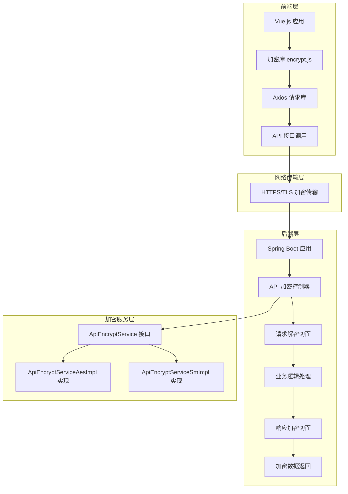
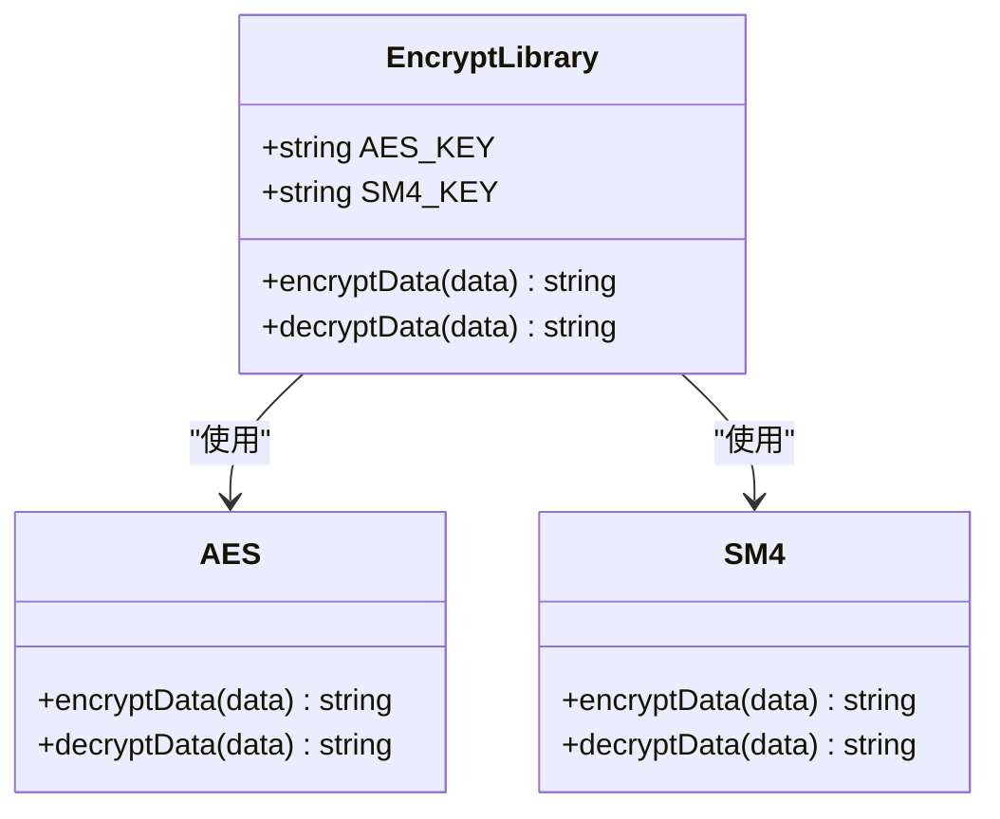
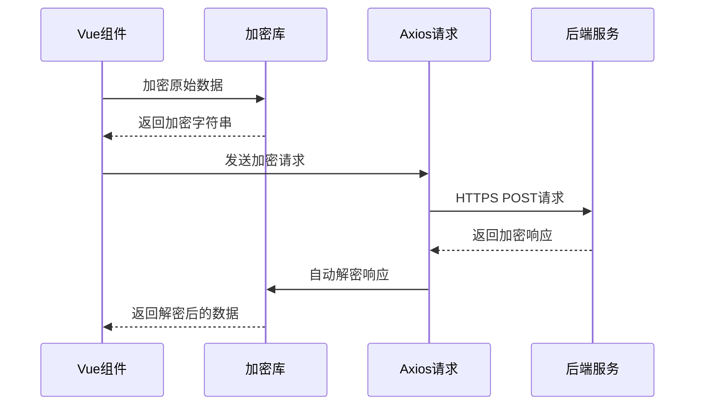
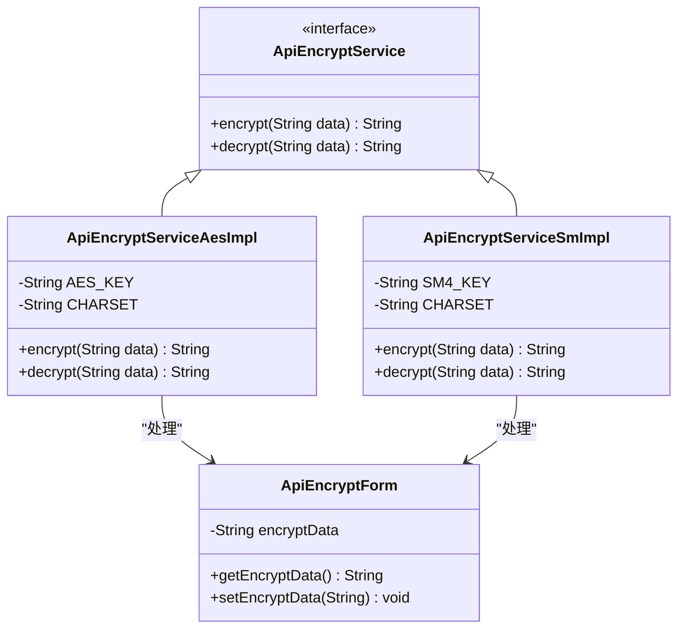
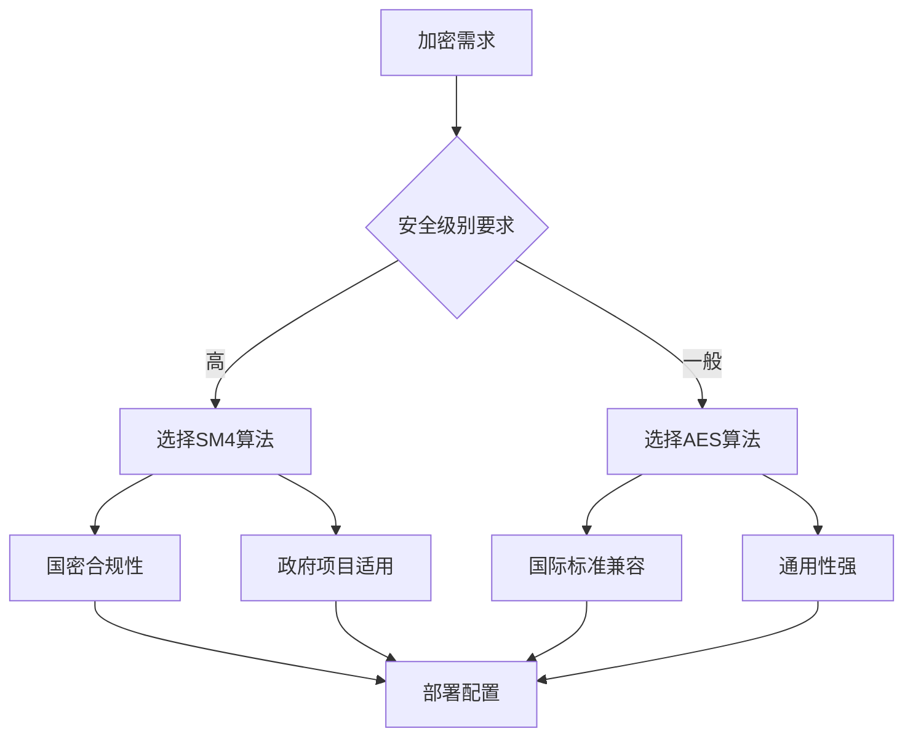
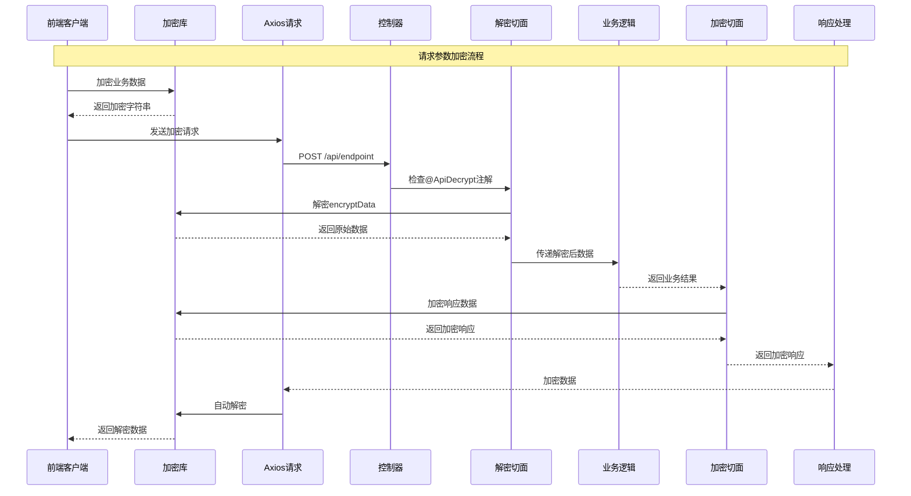
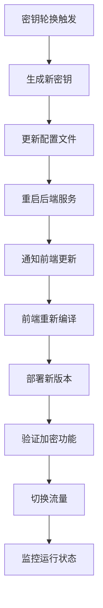
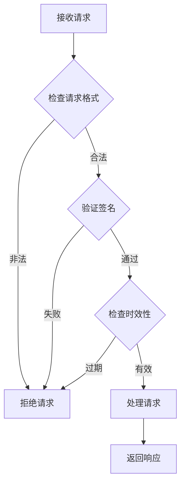
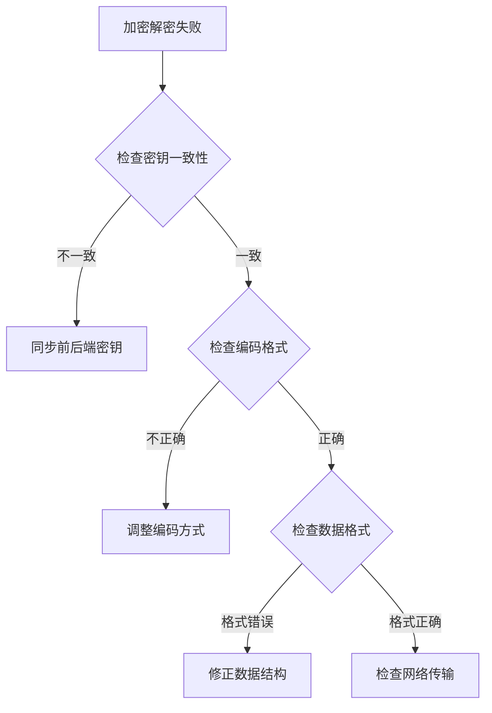

# 前后端协同集成

<cite>
**本文档引用的文件**
- [ApiEncryptForm.java](file://smart-admin-api-java17-springboot3/sa-base/src/main/java/net/lab1024/sa/base/module/support/apiencrypt/domain/ApiEncryptForm.java)
- [ApiEncryptService.java](file://smart-admin-api-java17-springboot3/sa-base/src/main/java/net/lab1024/sa/base/module/support/apiencrypt/service/ApiEncryptService.java)
- [ApiEncryptServiceAesImpl.java](file://smart-admin-api-java17-springboot3/sa-base/src/main/java/net/lab1024/sa/base/module/support/apiencrypt/service/ApiEncryptServiceAesImpl.java)
- [ApiEncryptServiceSmImpl.java](file://smart-admin-api-java17-springboot3/sa-base/src/main/java/net/lab1024/sa/base/module/support/apiencrypt/service/ApiEncryptServiceSmImpl.java)
- [DecryptRequestAdvice.java](file://smart-admin-api-java17-springboot3/sa-base/src/main/java/net/lab1024/sa/base/module/support/apiencrypt/advice/DecryptRequestAdvice.java)
- [EncryptResponseAdvice.java](file://smart-admin-api-java17-springboot3/sa-base/src/main/java/net/lab1024/sa/base/module/support/apiencrypt/advice/EncryptResponseAdvice.java)
- [AdminApiEncryptController.java](file://smart-admin-api-java17-springboot3/sa-admin/src/main/java/net/lab1024/sa/admin/module/system/support/AdminApiEncryptController.java)
- [encrypt.js](file://smart-admin-web-javascript/src/lib/encrypt.js)
- [axios.js](file://smart-admin-web-javascript/src/lib/axios.js)
- [api-encrypt-api.js](file://smart-admin-web-javascript/src/api/support/api-encrypt-api.js)
- [api-encrypt-index.vue](file://smart-admin-web-javascript/src/views/support/api-encrypt/api-encrypt-index.vue)
</cite>

## 目录
1. [概述](#概述)
2. [系统架构](#系统架构)
3. [核心组件分析](#核心组件分析)
4. [加密算法支持](#加密算法支持)
5. [端到端加解密流程](#端到端加解密流程)
6. [安全机制设计](#安全机制设计)
7. [集成示例](#集成示例)
8. [最佳实践](#最佳实践)
9. [故障排除](#故障排除)

## 概述

智能管理系统采用前后端分离架构，通过统一的加密框架实现数据传输的安全保护。该框架支持多种加密算法，包括国密SM4和AES，提供灵活的加密策略选择，确保敏感数据在传输过程中的安全性。

### 主要特性

- **多算法支持**：同时支持国密SM4和AES加密算法
- **透明化加密**：基于注解的自动加密解密机制
- **双向加密**：支持请求参数加密和响应数据加密
- **无缝集成**：与Spring Boot和Vue.js框架深度集成
- **高性能**：优化的加密算法实现，保证系统性能

## 系统架构



**架构图来源**
- [AdminApiEncryptController.java](file://smart-admin-api-java17-springboot3/sa-admin/src/main/java/net/lab1024/sa/admin/module/system/support/AdminApiEncryptController.java#L1-L82)
- [encrypt.js](file://smart-admin-web-javascript/src/lib/encrypt.js#L1-L121)
- [axios.js](file://smart-admin-web-javascript/src/lib/axios.js#L1-L251)

## 核心组件分析

### 前端加密组件

#### encrypt.js 加密库

前端加密库提供了统一的加密接口，支持两种加密算法：



**类图来源**
- [encrypt.js](file://smart-admin-web-javascript/src/lib/encrypt.js#L41-L98)

#### Axios 请求封装

前端通过Axios库实现了加密请求的自动处理：



**序列图来源**
- [axios.js](file://smart-admin-web-javascript/src/lib/axios.js#L162-L167)
- [encrypt.js](file://smart-admin-web-javascript/src/lib/encrypt.js#L111-L120)

### 后端加密组件

#### ApiEncryptForm 数据传输对象



**类图来源**
- [ApiEncryptForm.java](file://smart-admin-api-java17-springboot3/sa-base/src/main/java/net/lab1024/sa/base/module/support/apiencrypt/domain/ApiEncryptForm.java#L1-L21)
- [ApiEncryptService.java](file://smart-admin-api-java17-springboot3/sa-base/src/main/java/net/lab1024/sa/base/module/support/apiencrypt/service/ApiEncryptService.java#L1-L31)

#### 加密切面处理器

```mermaid
flowchart TD
A[HTTP请求] --> B{检查@ApiDecrypt注解}
B --> |有| C[请求解密切面]
B --> |无| D[直接处理]
C --> E[提取encryptData]
E --> F[调用ApiEncryptService.decrypt]
F --> G[替换请求体]
G --> H[继续业务处理]
I[业务处理完成] --> J{检查@ApiEncrypt注解}
J --> |有| K[响应加密切面]
J --> |无| L[直接返回]
K --> M[序列化响应数据]
M --> N[调用ApiEncryptService.encrypt]
N --> O[设置dataType=ENCRYPT]
O --> P[返回加密响应]
```

**流程图来源**
- [DecryptRequestAdvice.java](file://smart-admin-api-java17-springboot3/sa-base/src/main/java/net/lab1024/sa/base/module/support/apiencrypt/advice/DecryptRequestAdvice.java#L48-L61)
- [EncryptResponseAdvice.java](file://smart-admin-api-java17-springboot3/sa-base/src/main/java/net/lab1024/sa/base/module/support/apiencrypt/advice/EncryptResponseAdvice.java#L46-L59)

**章节来源**
- [ApiEncryptForm.java](file://smart-admin-api-java17-springboot3/sa-base/src/main/java/net/lab1024/sa/base/module/support/apiencrypt/domain/ApiEncryptForm.java#L1-L21)
- [ApiEncryptService.java](file://smart-admin-api-java17-springboot3/sa-base/src/main/java/net/lab1024/sa/base/module/support/apiencrypt/service/ApiEncryptService.java#L1-L31)
- [DecryptRequestAdvice.java](file://smart-admin-api-java17-springboot3/sa-base/src/main/java/net/lab1024/sa/base/module/support/apiencrypt/advice/DecryptRequestAdvice.java#L1-L96)
- [EncryptResponseAdvice.java](file://smart-admin-api-java17-springboot3/sa-base/src/main/java/net/lab1024/sa/base/module/support/apiencrypt/advice/EncryptResponseAdvice.java#L1-L64)

## 加密算法支持

### AES加密算法

AES（Advanced Encryption Standard）是一种对称加密算法，具有以下特点：

| 特性 | 描述 |
|------|------|
| 密钥长度 | 支持128位、192位、256位 |
| 工作模式 | ECB（电子密码本模式） |
| 填充方式 | PKCS7填充 |
| 编码格式 | Base64编码 |
| 密钥要求 | 16字节（128位） |

### SM4加密算法

SM4是中国国家密码标准，专为中国国情设计：

| 特性 | 描述 |
|------|------|
| 密钥长度 | 128位固定 |
| 工作模式 | ECB模式 |
| 填充方式 | PKCS7填充 |
| 编码格式 | Base64编码 |
| 密钥要求 | 16字节（128位） |
| 兼容性 | 与Java UTF-8编码兼容 |

### 算法选择策略



**章节来源**
- [ApiEncryptServiceAesImpl.java](file://smart-admin-api-java17-springboot3/sa-base/src/main/java/net/lab1024/sa/base/module/support/apiencrypt/service/ApiEncryptServiceAesImpl.java#L1-L115)
- [ApiEncryptServiceSmImpl.java](file://smart-admin-api-java17-springboot3/sa-base/src/main/java/net/lab1024/sa/base/module/support/apiencrypt/service/ApiEncryptServiceSmImpl.java#L1-L119)

## 端到端加解密流程

### 完整加密流程示例

以下是一个完整的端到端加密流程：



**序列图来源**
- [api-encrypt-index.vue](file://smart-admin-web-javascript/src/views/support/api-encrypt/api-encrypt-index.vue#L161-L168)
- [AdminApiEncryptController.java](file://smart-admin-api-java17-springboot3/sa-admin/src/main/java/net/lab1024/sa/admin/module/system/support/AdminApiEncryptController.java#L36-L42)

### 具体实现步骤

#### 1. 前端数据准备

前端需要将业务数据进行加密处理：

```javascript
// 前端数据准备示例
const businessData = {
    userId: 12345,
    userName: '张三',
    sensitiveInfo: '重要数据'
};

// 加密数据
const encryptedData = encryptData(businessData);
```

#### 2. 请求发送

通过专门的加密请求方法发送数据：

```javascript
// 发送加密请求
const result = await encryptApi.testRequestEncrypt(businessData);
```

#### 3. 后端解密处理

后端自动识别并解密请求数据：

```java
@PostMapping("/api/endpoint")
@ApiDecrypt
public ResponseDTO<?> processEncryptedData(@RequestBody @Valid JweForm form) {
    // form对象已自动解密，可以直接使用
    return ResponseDTO.ok(processBusinessLogic(form));
}
```

#### 4. 响应加密

根据注解自动加密响应数据：

```java
@PostMapping("/api/response")
@ApiEncrypt
public ResponseDTO<?> getEncryptedResponse() {
    // 响应数据会自动加密
    return ResponseDTO.ok(getSensitiveData());
}
```

**章节来源**
- [api-encrypt-index.vue](file://smart-admin-web-javascript/src/views/support/api-encrypt/api-encrypt-index.vue#L147-L188)
- [AdminApiEncryptController.java](file://smart-admin-api-java17-springboot3/sa-admin/src/main/java/net/lab1024/sa/admin/module/system/support/AdminApiEncryptController.java#L36-L81)

## 安全机制设计

### 密钥管理

#### 密钥存储策略

| 组件 | 存储位置 | 安全级别 | 更新频率 |
|------|----------|----------|----------|
| 前端加密库 | 源代码常量 | 中等 | 开发时更新 |
| 后端服务 | 配置文件 | 高 | 部署时更新 |
| 生产环境 | 环境变量 | 最高 | 定期轮换 |

#### 密钥轮换机制



### 传输安全保障

#### HTTPS/TLS配置

系统默认使用HTTPS协议进行数据传输，确保：

- **传输加密**：所有数据在传输过程中加密
- **身份认证**：服务器证书验证
- **完整性保护**：防止数据被篡改
- **重放攻击防护**：时间戳和随机数机制

#### 请求验证机制



### 异常处理机制

#### 错误分类处理

| 错误类型 | 处理策略 | 用户体验 |
|----------|----------|----------|
| 解密失败 | 记录日志，返回友好提示 | 显示"数据解密失败，请稍后重试" |
| 算法不匹配 | 自动尝试其他算法 | 无缝切换，用户无感知 |
| 密钥错误 | 清除缓存，重新初始化 | 提示重新登录 |
| 网络异常 | 自动重试机制 | 显示"网络连接异常" |

**章节来源**
- [ApiEncryptServiceAesImpl.java](file://smart-admin-api-java17-springboot3/sa-base/src/main/java/net/lab1024/sa/base/module/support/apiencrypt/service/ApiEncryptServiceAesImpl.java#L40-L51)
- [ApiEncryptServiceSmImpl.java](file://smart-admin-api-java17-springboot3/sa-base/src/main/java/net/lab1024/sa/base/module/support/apiencrypt/service/ApiEncryptServiceSmImpl.java#L38-L48)

## 集成示例

### 基础集成步骤

#### 1. 后端配置

##### 1.1 添加依赖

在后端项目的pom.xml中添加加密相关依赖：

```xml
<dependency>
    <groupId>cn.hutool</groupId>
    <artifactId>hutool-all</artifactId>
    <version>5.8.20</version>
</dependency>
```

##### 1.2 配置加密服务

选择合适的加密算法实现：

```java
// 使用AES加密
@Configuration
public class ApiEncryptConfig {
    @Bean
    public ApiEncryptService apiEncryptService() {
        return new ApiEncryptServiceAesImpl();
    }
}
```

#### 2. 前端配置

##### 2.1 修改加密算法

如果需要使用AES算法，修改前端加密库：

```javascript
// 修改encrypt.js文件
// const EncryptObject = SM4; // 当前使用SM4
const EncryptObject = AES; // 切换到AES
```

##### 2.2 配置API接口

创建专门的加密API接口：

```javascript
// api-encrypt-api.js
export const encryptApi = {
    // 请求参数加密接口
    testRequestEncrypt: (param) => {
        return postEncryptRequest('/support/apiEncrypt/testRequestEncrypt', param);
    },
    
    // 响应数据加密接口
    testResponseEncrypt: (param) => {
        return postRequest('/support/apiEncrypt/testResponseEncrypt', param);
    }
};
```

#### 3. 控制器实现

##### 3.1 请求参数加密

```java
@RestController
@RequestMapping("/api")
public class EncryptedApiController {
    
    @PostMapping("/process")
    @ApiDecrypt // 自动解密请求参数
    public ResponseDTO<?> processData(@RequestBody @Valid BusinessForm form) {
        // form对象已经解密，可以直接使用
        return ResponseDTO.ok(processData(form));
    }
}
```

##### 3.2 响应数据加密

```java
@RestController
@RequestMapping("/api")
public class EncryptedResponseController {
    
    @GetMapping("/sensitive-data")
    @ApiEncrypt // 自动加密响应数据
    public ResponseDTO<?> getSensitiveData() {
        // 响应数据会自动加密
        return ResponseDTO.ok(getSensitiveInformation());
    }
}
```

### 高级应用场景

#### 1. 批量数据处理

```java
@PostMapping("/batch-process")
@ApiDecrypt
@ApiEncrypt
public ResponseDTO<List<ProcessedResult>> batchProcess(
        @RequestBody @Valid ValidateList<BatchForm> batchForms) {
    
    List<ProcessedResult> results = batchForms.stream()
        .map(this::processSingleItem)
        .collect(Collectors.toList());
    
    return ResponseDTO.ok(results);
}
```

#### 2. 文件上传加密

```javascript
async function uploadEncryptedFile(file) {
    const reader = new FileReader();
    reader.onload = async (event) => {
        const fileContent = event.target.result;
        const encryptedContent = encryptData(fileContent);
        
        const formData = new FormData();
        formData.append('file', file);
        formData.append('encryptedContent', encryptedContent);
        
        return await encryptApi.uploadEncryptedFile(formData);
    };
    reader.readAsDataURL(file);
}
```

**章节来源**
- [AdminApiEncryptController.java](file://smart-admin-api-java17-springboot3/sa-admin/src/main/java/net/lab1024/sa/admin/module/system/support/AdminApiEncryptController.java#L36-L81)
- [api-encrypt-api.js](file://smart-admin-web-javascript/src/api/support/api-encrypt-api.js#L1-L40)
- [axios.js](file://smart-admin-web-javascript/src/lib/axios.js#L162-L167)

## 最佳实践

### 性能优化建议

#### 1. 加密算法选择

| 场景 | 推荐算法 | 性能评分 | 安全评分 |
|------|----------|----------|----------|
| 内网通信 | AES | ⭐⭐⭐⭐⭐ | ⭐⭐⭐⭐ |
| 外网传输 | SM4 | ⭐⭐⭐⭐ | ⭐⭐⭐⭐⭐ |
| 高并发场景 | AES | ⭐⭐⭐⭐⭐ | ⭐⭐⭐ |
| 政府项目 | SM4 | ⭐⭐⭐ | ⭐⭐⭐⭐⭐ |

#### 2. 缓存策略

```java
@Service
public class OptimizedApiEncryptService implements ApiEncryptService {
    
    @Cacheable(value = "encryptionCache", key = "#data")
    public String encrypt(String data) {
        // 缓存加密结果，避免重复计算
        return delegate.encrypt(data);
    }
    
    @CacheEvict(value = "encryptionCache", key = "#data")
    public String decrypt(String data) {
        // 清除对应缓存
        return delegate.decrypt(data);
    }
}
```

### 安全加固措施

#### 1. 请求限流

```java
@RestController
@RequestMapping("/api")
@RateLimiter(name = "apiEncryption", fallbackMethod = "rateLimitFallback")
public class RateLimitedController {
    
    public ResponseDTO<?> rateLimitFallback(Exception ex) {
        return ResponseDTO.error("请求过于频繁，请稍后再试");
    }
}
```

#### 2. 日志审计

```java
@Component
public class EncryptionAuditInterceptor {
    
    @EventListener
    public void handleEncryptionEvent(EncryptionEvent event) {
        auditLogger.info("加密操作: 类型={}, 用户={}, 时间={}",
            event.getType(), event.getUserId(), event.getTimestamp());
    }
}
```

### 监控和告警

#### 1. 关键指标监控

| 指标名称 | 监控阈值 | 告警级别 |
|----------|----------|----------|
| 加密成功率 | >99.5% | 警告 |
| 平均加密耗时 | >100ms | 严重 |
| 解密失败率 | >0.1% | 严重 |
| 密钥泄露检测 | 0 | 严重 |

#### 2. 异常监控

```javascript
// 前端异常监控
window.addEventListener('error', (event) => {
    if (event.filename.includes('encrypt.js')) {
        analytics.track('EncryptionError', {
            error: event.error.message,
            stack: event.error.stack
        });
    }
});
```

## 故障排除

### 常见问题及解决方案

#### 1. 加密解密失败

**问题现象**：
- 前端报错："加密数据格式错误"
- 后端报错："解密失败"

**排查步骤**：


**解决方案**：
1. 确认前后端使用相同的加密算法
2. 检查密钥是否正确配置
3. 验证数据编码格式一致性

#### 2. 性能问题

**问题现象**：
- 接口响应时间过长
- 系统CPU使用率过高

**优化方案**：
1. 启用加密结果缓存
2. 使用异步加密处理
3. 优化加密算法参数

#### 3. 兼容性问题

**问题现象**：
- 不同浏览器加密结果不一致
- 移动端解密失败

**解决方法**：
1. 统一编码格式（推荐UTF-8）
2. 检查浏览器兼容性
3. 验证移动端网络环境

### 调试工具

#### 1. 前端调试

```javascript
// 加密调试工具
function debugEncryption(data) {
    console.log('原始数据:', data);
    const encrypted = encryptData(data);
    console.log('加密结果:', encrypted);
    
    // 可选：验证解密
    const decrypted = decryptData(encrypted);
    console.log('解密结果:', decrypted);
    
    return { original: data, encrypted, decrypted };
}
```

#### 2. 后端调试

```java
@RestController
@RequestMapping("/debug")
public class EncryptionDebugController {
    
    @PostMapping("/test")
    public ResponseDTO<?> debugEncryption(@RequestBody ApiEncryptForm form) {
        try {
            String decrypted = apiEncryptService.decrypt(form.getEncryptData());
            return ResponseDTO.ok(Map.of(
                "original": decrypted,
                "success": true
            ));
        } catch (Exception e) {
            return ResponseDTO.error("解密失败: " + e.getMessage());
        }
    }
}
```

**章节来源**
- [ApiEncryptServiceAesImpl.java](file://smart-admin-api-java17-springboot3/sa-base/src/main/java/net/lab1024/sa/base/module/support/apiencrypt/service/ApiEncryptServiceAesImpl.java#L48-L51)
- [ApiEncryptServiceSmImpl.java](file://smart-admin-api-java17-springboot3/sa-base/src/main/java/net/lab1024/sa/base/module/support/apiencrypt/service/ApiEncryptServiceSmImpl.java#L56-L65)

## 总结

智能管理系统的前后端协同加密框架提供了完整、安全、高效的解决方案。通过统一的加密接口、灵活的算法选择和透明化的加密机制，系统能够在保证数据安全的同时维持良好的性能表现。

### 核心优势

1. **安全性**：支持国密和国际标准加密算法
2. **易用性**：基于注解的自动化加密解密
3. **性能**：优化的算法实现和缓存机制
4. **可维护性**：清晰的架构设计和完善的文档

### 发展方向

1. **算法升级**：支持更多现代加密算法
2. **性能优化**：引入硬件加速支持
3. **安全增强**：增加零知识证明等高级安全特性
4. **标准化**：遵循更多行业安全标准

通过持续的技术创新和安全加固，该加密框架将为智能管理系统提供更加可靠的数据安全保障。