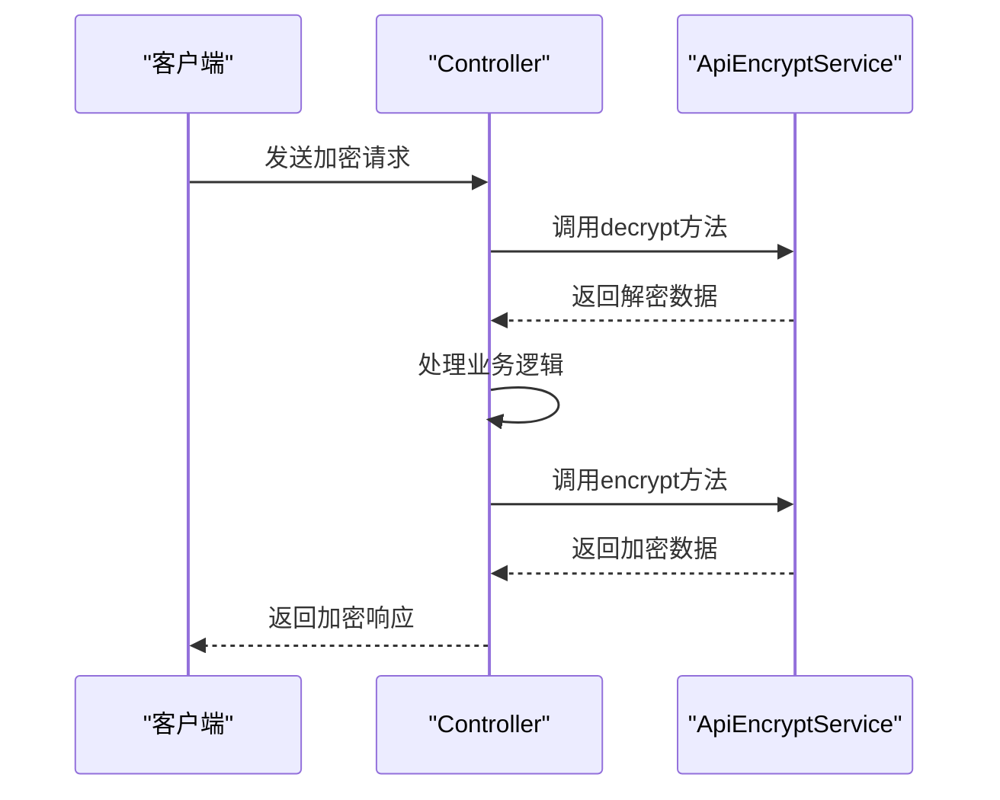
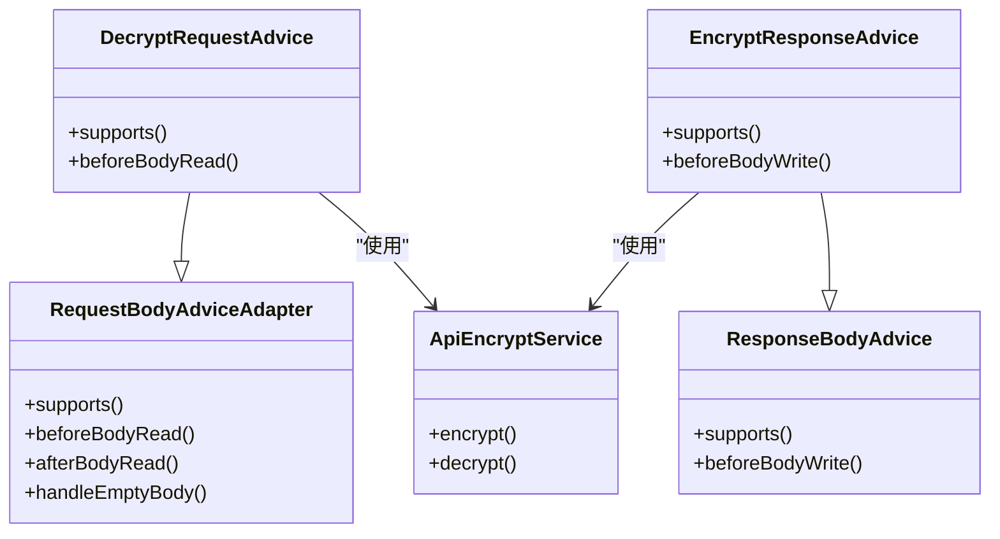

# 注解配置与使用

<cite>
**本文档引用的文件**   
- [ApiEncrypt.java](file://smart-admin-api-java17-springboot3\sa-base\src\main\java\net\lab1024\sa\base\module\support\apiencrypt\annotation\ApiEncrypt.java)
- [ApiDecrypt.java](file://smart-admin-api-java17-springboot3\sa-base\src\main\java\net\lab1024\sa\base\module\support\apiencrypt\annotation\ApiDecrypt.java)
- [EncryptResponseAdvice.java](file://smart-admin-api-java17-springboot3\sa-base\src\main\java\net\lab1024\sa\base\module\support\apiencrypt\advice\EncryptResponseAdvice.java)
- [DecryptRequestAdvice.java](file://smart-admin-api-java17-springboot3\sa-base\src\main\java\net\lab1024\sa\base\module\support\apiencrypt\advice\DecryptRequestAdvice.java)
- [AdminApiEncryptController.java](file://smart-admin-api-java17-springboot3\sa-admin\src\main\java\net\lab1024\sa\admin\module\system\support\AdminApiEncryptController.java)
- [ApiEncryptService.java](file://smart-admin-api-java17-springboot3\sa-base\src\main\java\net\lab1024\sa\base\module\support\apiencrypt\service\ApiEncryptService.java)
- [ApiEncryptForm.java](file://smart-admin-api-java17-springboot3\sa-base\src\main\java\net\lab1024\sa\base\module\support\apiencrypt\domain\ApiEncryptForm.java)
- [SmartOperationCustomizer.java](file://smart-admin-api-java17-springboot3\sa-base\src\main\java\net\lab1024\sa\base\common\swagger\SmartOperationCustomizer.java)
</cite>

## 目录
1. [简介](#简介)
2. [核心注解介绍](#核心注解介绍)
3. [加解密机制原理](#加解密机制原理)
4. [注解使用方法](#注解使用方法)
5. [实际应用示例](#实际应用示例)
6. [继承特性与应用场景](#继承特性与应用场景)
7. [与Spring AOP集成原理](#与spring-aop集成原理)
8. [细粒度控制策略](#细粒度控制策略)
9. [配置与管理](#配置与管理)

## 简介
本文档全面介绍系统中加解密注解的配置和使用方法，详细说明@ApiEncrypt和@ApiDecrypt注解的作用机制、适用范围以及配置参数。文档将解释如何通过注解实现请求数据自动解密和响应数据自动加密，并提供在Controller层使用注解的实际代码示例。

**注解继承特性说明**：当在类级别使用注解时，该类中的所有方法都会继承此注解的行为。方法级别的注解可以覆盖类级别的注解设置，实现更精细的控制。

## 核心注解介绍

### @ApiEncrypt 注解
@ApiEncrypt注解用于标记需要对响应数据进行加密的接口。该注解可以应用于类级别或方法级别，实现返回结果的自动加密。

```java
@Retention(RetentionPolicy.RUNTIME)
@Target({ElementType.TYPE, ElementType.METHOD})
public @interface ApiEncrypt {
}
```

### @ApiDecrypt 注解
@ApiDecrypt注解用于标记需要对接收到的请求数据进行解密的接口。与@ApiEncrypt类似，该注解也可以应用于类级别或方法级别。

```java
@Retention(RetentionPolicy.RUNTIME)
@Target({ElementType.TYPE, ElementType.METHOD})
public @interface ApiDecrypt {
}
```

**注解特性**：
- 两者都使用RUNTIME保留策略，确保在运行时可以通过反射获取
- 都支持TYPE和METHOD目标类型，实现类级别和方法级别的灵活应用
- 无参数配置，通过AOP切面实现自动处理

**Section sources**
- [ApiEncrypt.java](file://smart-admin-api-java17-springboot3\sa-base\src\main\java\net\lab1024\sa\base\module\support\apiencrypt\annotation\ApiEncrypt.java#L1-L20)
- [ApiDecrypt.java](file://smart-admin-api-java17-springboot3\sa-base\src\main\java\net\lab1024\sa\base\module\support\apiencrypt\annotation\ApiDecrypt.java#L1-L20)

## 加解密机制原理

### 请求解密流程
当客户端发送加密请求时，系统通过RequestBodyAdviceAdapter实现请求体的预处理。解密流程如下：

```mermaid
flowchart TD
A[客户端发送加密请求] --> B{请求到达服务器}
B --> C[RequestBodyAdviceAdapter拦截]
C --> D[检查@ApiDecrypt注解]
D --> E{存在注解?}
E --> |是| F[读取请求体]
F --> G[解析为ApiEncryptForm]
G --> H[提取encryptData字段]
H --> I[调用ApiEncryptService解密]
I --> J[创建新的HttpInputMessage]
J --> K[继续正常请求处理]
E --> |否| K
K --> L[Controller处理业务逻辑]
```

### 响应加密流程
当服务端返回响应数据时，系统通过ResponseBodyAdvice实现响应体的后处理。加密流程如下：

```mermaid
flowchart TD
A[Controller返回数据] --> B{ResponseBodyAdvice拦截}
B --> C[检查@ApiEncrypt注解]
C --> D{存在注解?}
D --> |是| E[获取响应数据]
E --> F[序列化为JSON字符串]
F --> G[调用ApiEncryptService加密]
G --> H[设置加密数据到ResponseDTO]
H --> I[设置数据类型为ENCRYPT]
I --> J[返回加密响应]
D --> |否| J
J --> K[客户端接收响应]
```

**Diagram sources**
- [DecryptRequestAdvice.java](file://smart-admin-api-java17-springboot3\sa-base\src\main\java\net\lab1024\sa\base\module\support\apiencrypt\advice\DecryptRequestAdvice.java#L43-L63)
- [EncryptResponseAdvice.java](file://smart-admin-api-java17-springboot3\sa-base\src\main\java\net\lab1024\sa\base\module\support\apiencrypt\advice\EncryptResponseAdvice.java#L41-L60)

**Section sources**
- [DecryptRequestAdvice.java](file://smart-admin-api-java17-springboot3\sa-base\src\main\java\net\lab1024\sa\base\module\support\apiencrypt\advice\DecryptRequestAdvice.java#L31-L96)
- [EncryptResponseAdvice.java](file://smart-admin-api-java17-springboot3\sa-base\src\main\java\net\lab1024\sa\base\module\support\apiencrypt\advice\EncryptResponseAdvice.java#L30-L64)

## 注解使用方法

### 适用范围
#### 类级别使用
当在Controller类上使用注解时，该类中的所有接口方法都将继承此注解的行为。

```java
@RestController
@ApiEncrypt
@ApiDecrypt
public class SecureController {
    // 所有方法自动启用加解密
}
```

#### 方法级别使用
当在具体方法上使用注解时，仅该方法启用相应的加解密功能。

```java
@RestController
public class MixedController {
    
    @ApiEncrypt
    @PostMapping("/secure")
    public ResponseDTO<String> secureMethod() {
        // 仅此方法返回数据加密
        return ResponseDTO.ok("data");
    }
    
    @PostMapping("/normal")
    public ResponseDTO<String> normalMethod() {
        // 此方法不加密
        return ResponseDTO.ok("data");
    }
}
```

### 配置参数
目前注解本身不包含配置参数，所有配置通过ApiEncryptService实现类进行管理。主要配置包括：

- **加密算法**：支持AES和SM4两种算法
- **密钥配置**：在实现类中定义静态密钥
- **字符编码**：统一使用UTF-8编码
- **数据格式**：请求数据包装在ApiEncryptForm对象中

**加密算法实现**：
- ApiEncryptServiceAesImpl：基于AES算法的加密实现
- ApiEncryptServiceSmImpl：基于国密SM4算法的加密实现

**Section sources**
- [ApiEncrypt.java](file://smart-admin-api-java17-springboot3\sa-base\src\main\java\net\lab1024\sa\base\module\support\apiencrypt\annotation\ApiEncrypt.java#L1-L20)
- [ApiDecrypt.java](file://smart-admin-api-java17-springboot3\sa-base\src\main\java\net\lab1024\sa\base\module\support\apiencrypt\annotation\ApiDecrypt.java#L1-L20)
- [ApiEncryptServiceAesImpl.java](file://smart-admin-api-java17-springboot3\sa-base\src\main\java\net\lab1024\sa\base\module\support\apiencrypt\service\ApiEncryptServiceAesImpl.java#L1-L115)
- [ApiEncryptServiceSmImpl.java](file://smart-admin-api-java17-springboot3\sa-base\src\main\java\net\lab1024\sa\base\module\support\apiencrypt\service\ApiEncryptServiceSmImpl.java#L1-L119)

## 实际应用示例

### 基本使用示例
以下是在AdminApiEncryptController中提供的测试接口示例：



### 具体代码示例
```java
@RestController
@Tag(name = SwaggerTagConst.Support.PROTECT)
public class AdminApiEncryptController extends SupportBaseController {

    @ApiDecrypt
    @PostMapping("/apiEncrypt/testRequestEncrypt")
    @Operation(summary = "测试 请求加密")
    public ResponseDTO<JweForm> testRequestEncrypt(@RequestBody @Valid JweForm form) {
        return ResponseDTO.ok(form);
    }

    @ApiEncrypt
    @PostMapping("/apiEncrypt/testResponseEncrypt")
    @Operation(summary = "测试 返回加密")
    public ResponseDTO<JweForm> testResponseEncrypt(@RequestBody @Valid JweForm form) {
        return ResponseDTO.ok(form);
    }

    @ApiDecrypt
    @ApiEncrypt
    @PostMapping("/apiEncrypt/testDecryptAndEncrypt")
    @Operation(summary = "测试 请求参数加密和解密、返回数据加密和解密")
    public ResponseDTO<JweForm> testDecryptAndEncrypt(@RequestBody @Valid JweForm form) {
        return ResponseDTO.ok(form);
    }
}
```

**请求数据格式**：
```json
{
    "encryptData": "加密后的数据字符串"
}
```

**响应数据格式**：
```json
{
    "code": 0,
    "msg": "成功",
    "data": "加密后的响应数据",
    "dataType": "ENCRYPT"
}
```

**Diagram sources**
- [AdminApiEncryptController.java](file://smart-admin-api-java17-springboot3\sa-admin\src\main\java\net\lab1024\sa\admin\module\system\support\AdminApiEncryptController.java#L36-L82)

**Section sources**
- [AdminApiEncryptController.java](file://smart-admin-api-java17-springboot3\sa-admin\src\main\java\net\lab1024\sa\admin\module\system\support\AdminApiEncryptController.java#L1-L82)
- [ApiEncryptForm.java](file://smart-admin-api-java17-springboot3\sa-base\src\main\java\net\lab1024\sa\base\module\support\apiencrypt\domain\ApiEncryptForm.java#L1-L21)

## 继承特性与应用场景

### 继承特性
注解具有良好的继承特性，支持以下使用模式：

1. **类级别继承**：在Controller类上标注注解，所有方法继承该行为
2. **方法级别覆盖**：方法可以覆盖类级别的注解设置
3. **组合使用**：可以同时使用@ApiEncrypt和@ApiDecrypt实现双向加解密

### 应用场景
#### 安全敏感接口
对于包含敏感信息的接口，建议同时使用两个注解：

```java
@RestController
@ApiEncrypt
@ApiDecrypt
public class SensitiveDataController {
    // 所有接口都进行双向加解密
}
```

#### 混合安全策略
对于部分接口需要加密的场景：

```java
@RestController
public class MixedSecurityController {
    
    @ApiEncrypt
    @PostMapping("/getSensitiveData")
    public ResponseDTO<SensitiveData> getSensitiveData() {
        // 敏感数据接口加密返回
    }
    
    @PostMapping("/getPublicData")
    public ResponseDTO<PublicData> getPublicData() {
        // 公共数据接口不加密
    }
}
```

#### 数组数据处理
支持对数组类型数据的加解密处理：

```java
@ApiDecrypt
@ApiEncrypt
@PostMapping("/apiEncrypt/testArray")
@Operation(summary = "测试 数组加密和解密")
public ResponseDTO<List<JweForm>> testArray(@RequestBody @Valid ValidateList<JweForm> list) {
    return ResponseDTO.ok(list);
}
```

**Section sources**
- [AdminApiEncryptController.java](file://smart-admin-api-java17-springboot3\sa-admin\src\main\java\net\lab1024\sa\admin\module\system\support\AdminApiEncryptController.java#L1-L82)
- [EmployeeController.java](file://smart-admin-api-java17-springboot3\sa-admin\src\main\java\net\lab1024\sa\admin\module\system\employee\controller\EmployeeController.java#L96-L104)

## 与Spring AOP集成原理

### 拦截器架构
系统通过Spring的AOP机制实现无侵入式的加解密功能，主要依赖两个核心组件：



### 执行流程
1. **请求拦截**：DecryptRequestAdvice继承RequestBodyAdviceAdapter，在请求体读取前进行拦截
2. **响应拦截**：EncryptResponseAdvice实现ResponseBodyAdvice，在响应体写入前进行拦截
3. **条件判断**：通过supports方法判断是否需要处理当前请求
4. **数据处理**：在beforeBodyRead和beforeBodyWrite中执行实际的加解密操作

### 条件判断逻辑
```java
// 解密条件判断
@Override
public boolean supports(MethodParameter methodParameter, Type targetType, Class<? extends HttpMessageConverter<?>> converterType) {
    return methodParameter.hasMethodAnnotation(ApiDecrypt.class) || 
           methodParameter.hasParameterAnnotation(ApiDecrypt.class) || 
           methodParameter.getContainingClass().isAnnotationPresent(ApiDecrypt.class);
}

// 加密条件判断
@Override
public boolean supports(MethodParameter returnType, Class<? extends HttpMessageConverter<?>> converterType) {
    return returnType.hasMethodAnnotation(ApiEncrypt.class) || 
           returnType.getContainingClass().isAnnotationPresent(ApiEncrypt.class);
}
```

**Diagram sources**
- [DecryptRequestAdvice.java](file://smart-admin-api-java17-springboot3\sa-base\src\main\java\net\lab1024\sa\base\module\support\apiencrypt\advice\DecryptRequestAdvice.java#L33-L96)
- [EncryptResponseAdvice.java](file://smart-admin-api-java17-springboot3\sa-base\src\main\java\net\lab1024\sa\base\module\support\apiencrypt\advice\EncryptResponseAdvice.java#L30-L64)

**Section sources**
- [DecryptRequestAdvice.java](file://smart-admin-api-java17-springboot3\sa-base\src\main\java\net\lab1024\sa\base\module\support\apiencrypt\advice\DecryptRequestAdvice.java#L31-L96)
- [EncryptResponseAdvice.java](file://smart-admin-api-java17-springboot3\sa-base\src\main\java\net\lab1024\sa\base\module\support\apiencrypt\advice\EncryptResponseAdvice.java#L30-L64)

## 细粒度控制策略

### Swagger集成
通过SmartOperationCustomizer实现Swagger文档的自动标注，增强接口文档的可读性：

```java
@Override
public Operation customize(Operation operation, HandlerMethod handlerMethod) {
    List<String> noteList = new ArrayList<>();
    
    // 请求参数加密
    if (handlerMethod.getMethodAnnotation(ApiDecrypt.class) != null ||
        handlerMethod.getBeanType().getAnnotation(ApiDecrypt.class) != null) {
        encryptBuilderList.add("【请求参数加密】");
    }
    
    // 返回结果加密
    if (handlerMethod.getMethodAnnotation(ApiEncrypt.class) != null ||
        handlerMethod.getBeanType().getAnnotation(ApiEncrypt.class) != null) {
        encryptBuilderList.add("【返回结果加密】");
    }
    
    if (!encryptBuilderList.isEmpty()) {
        noteList.add("<br/><font style=\"color:red\" class=\"light-red\">接口安全：" + 
                    SmartStringUtil.join(",", encryptBuilderList) + "</font>");
    }
    
    operation.setDescription(SmartStringUtil.join("<br/>", noteList));
    return operation;
}
```

### 异常处理
系统在加解密过程中包含完善的异常处理机制：

1. **解密失败**：记录错误日志，返回原始请求数据
2. **加密失败**：抛出运行时异常，中断处理流程
3. **空数据处理**：对空数据不做加解密处理，直接返回

### 性能考虑
- **延迟初始化**：加密服务在首次使用时初始化
- **静态密钥**：避免每次加密都生成新密钥
- **异常捕获**：防止加解密异常影响正常业务流程

**Section sources**
- [SmartOperationCustomizer.java](file://smart-admin-api-java17-springboot3\sa-base\src\main\java\net\lab1024\sa\base\common\swagger\SmartOperationCustomizer.java#L26-L115)
- [DecryptRequestAdvice.java](file://smart-admin-api-java17-springboot3\sa-base\src\main\java\net\lab1024\sa\base\module\support\apiencrypt\advice\DecryptRequestAdvice.java#L58-L61)
- [EncryptResponseAdvice.java](file://smart-admin-api-java17-springboot3\sa-base\src\main\java\net\lab1024\sa\base\module\support\apiencrypt\advice\EncryptResponseAdvice.java#L56-L58)

## 配置与管理

### 加密算法配置
系统支持多种加密算法实现，通过不同的Service实现类进行管理：

| 算法类型 | 实现类 | 特点 |
|---------|-------|------|
| AES | ApiEncryptServiceAesImpl | 国际标准，性能优秀 |
| SM4 | ApiEncryptServiceSmImpl | 国密算法，符合国内安全要求 |

### 密钥管理
当前密钥以静态常量形式定义在实现类中：

```java
private static final String AES_KEY = "1024lab__1024lab";
private static final String SM4_KEY = "1024lab__1024lab";
```

### 扩展建议
1. **外部化配置**：建议将密钥配置移到配置文件中
2. **密钥轮换**：实现定期更换密钥的机制
3. **算法选择**：根据业务需求动态选择加密算法
4. **性能监控**：添加加解密操作的性能监控

**Section sources**
- [ApiEncryptServiceAesImpl.java](file://smart-admin-api-java17-springboot3\sa-base\src\main\java\net\lab1024\sa\base\module\support\apiencrypt\service\ApiEncryptServiceAesImpl.java#L1-L115)
- [ApiEncryptServiceSmImpl.java](file://smart-admin-api-java17-springboot3\sa-base\src\main\java\net\lab1024\sa\base\module\support\apiencrypt\service\ApiEncryptServiceSmImpl.java#L1-L119)