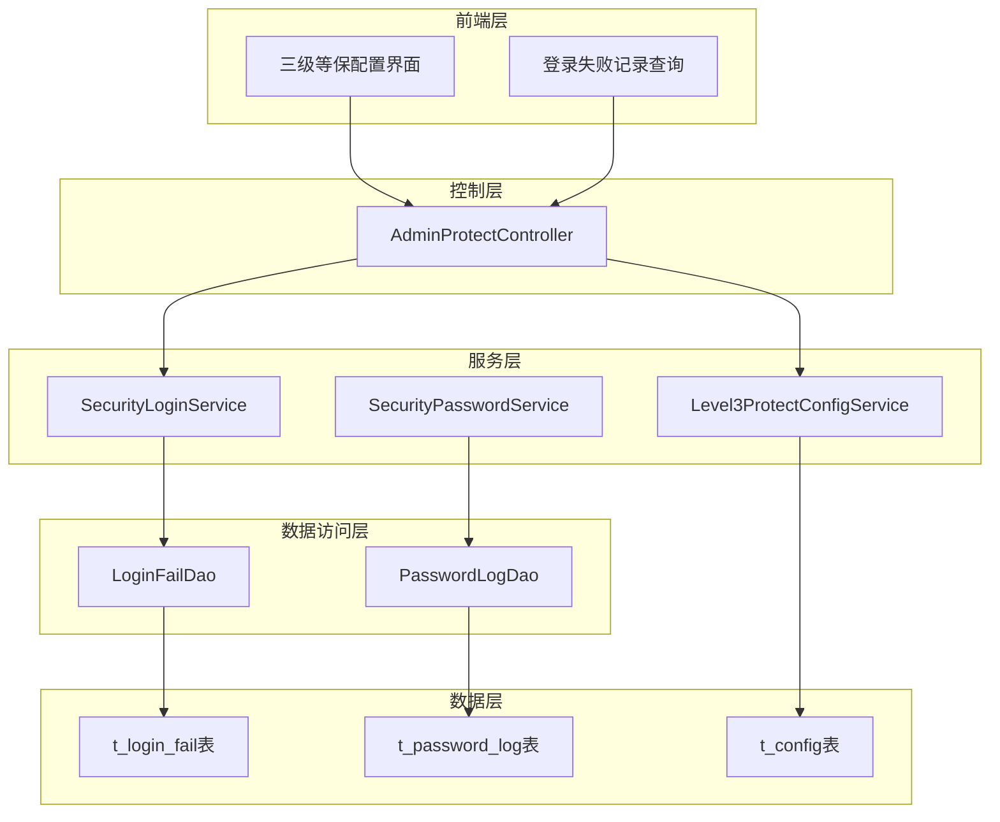
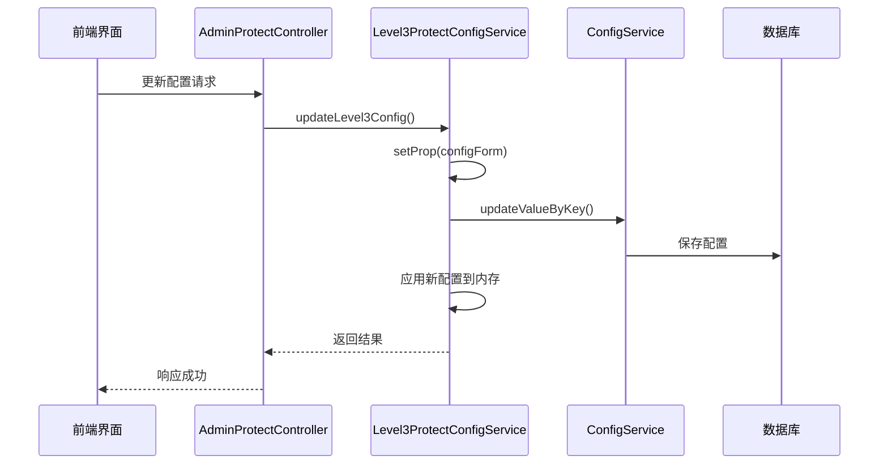
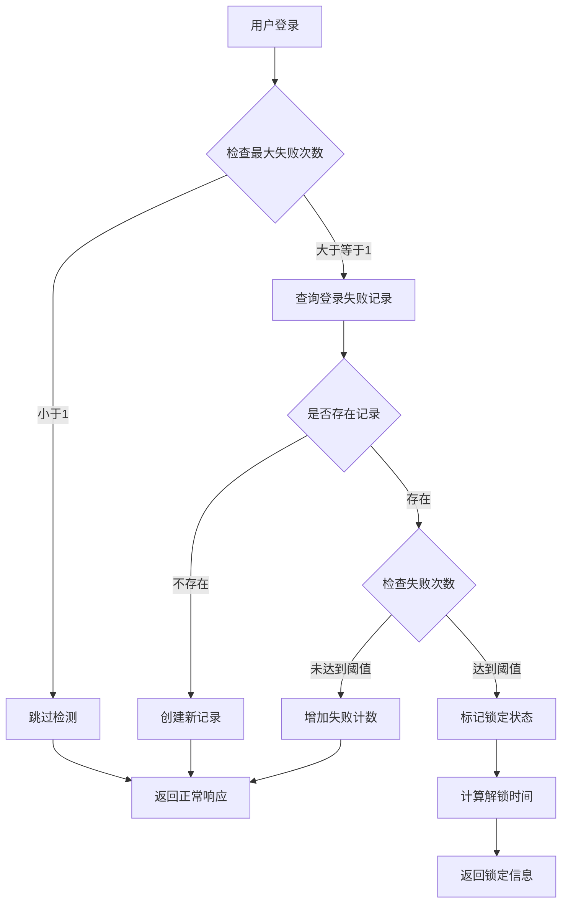
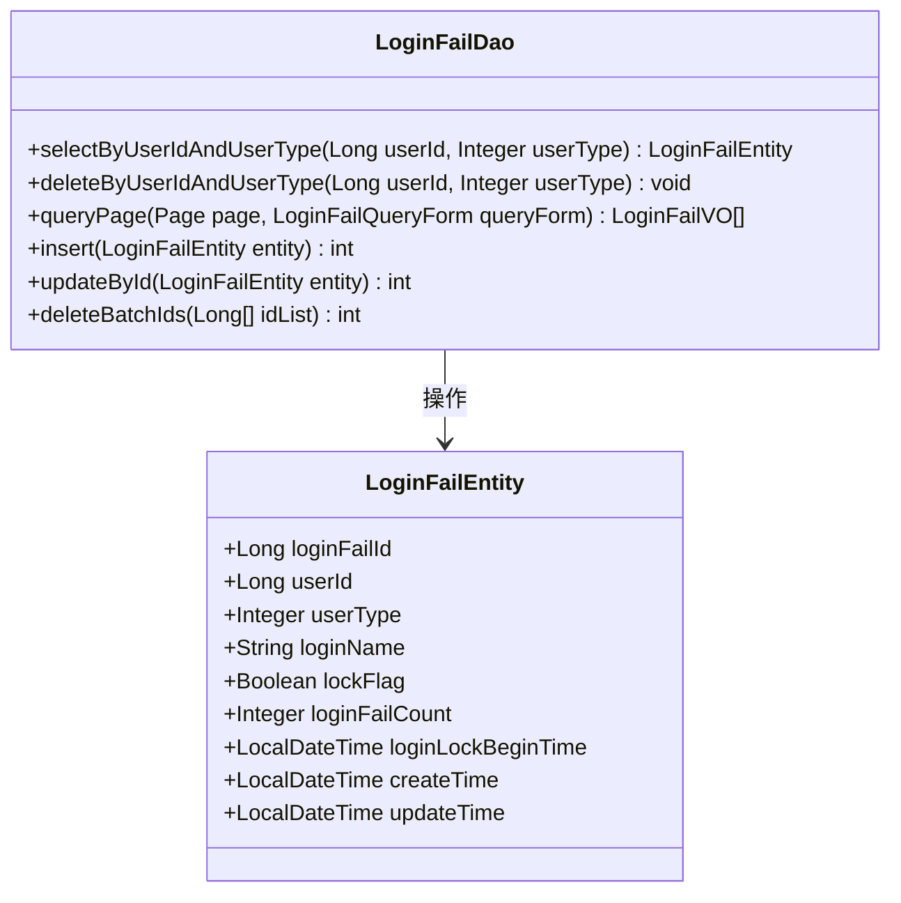
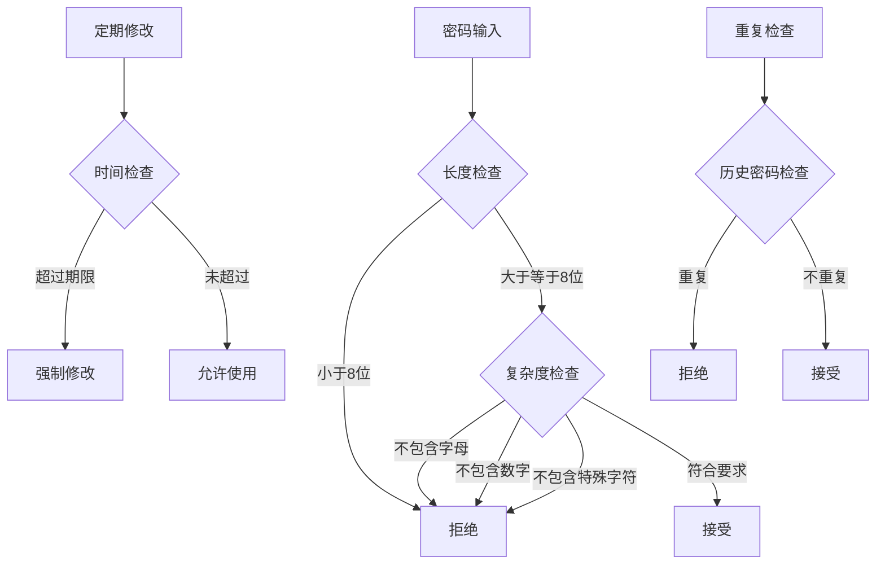
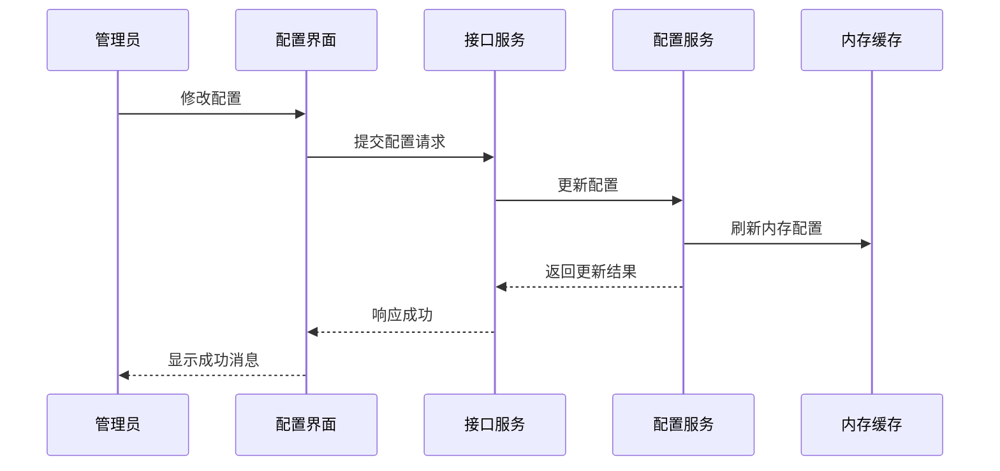
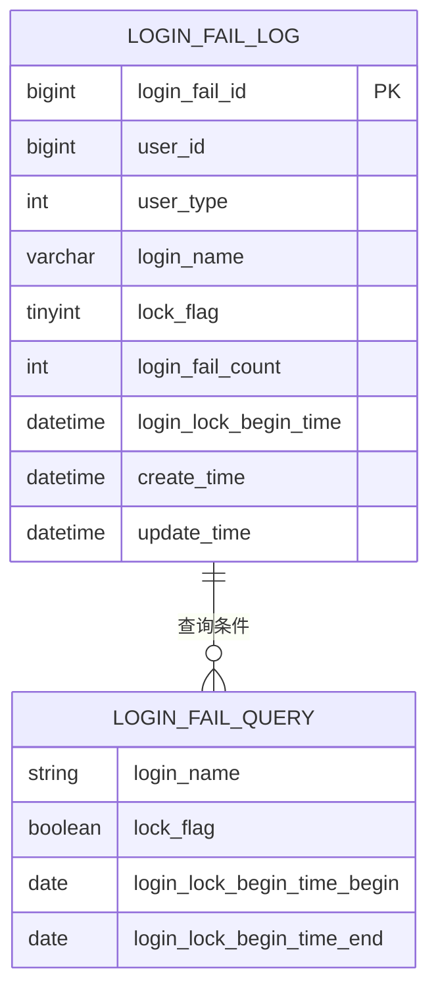

# 三级安全防护体系实现

<cite>
**本文档引用的文件**
- [Level3ProtectConfigService.java](file://smart-admin-api-java17-springboot3\sa-base\src\main\java\net\lab1024\sa\base\module\support\securityprotect\service\Level3ProtectConfigService.java)
- [SecurityLoginService.java](file://smart-admin-api-java17-springboot3\sa-base\src\main\java\net\lab1024\sa\base\module\support\securityprotect\service\SecurityLoginService.java)
- [LoginFailEntity.java](file://smart-admin-api-java17-springboot3\sa-base\src\main\java\net\lab1024\sa\base\module\support\securityprotect\domain\LoginFailEntity.java)
- [LoginFailDao.java](file://smart-admin-api-java17-springboot3\sa-base\src\main\java\net\lab1024\sa\base\module\support\securityprotect\dao\LoginFailDao.java)
- [AdminProtectController.java](file://smart-admin-api-java17-springboot3\sa-admin\src\main\java\net\lab1024\sa\admin\module\system\support\AdminProtectController.java)
- [Level3ProtectConfigForm.java](file://smart-admin-api-java17-springboot3\sa-base\src\main\java\net\lab1024\sa\base\module\support\securityprotect\domain\Level3ProtectConfigForm.java)
- [LoginFailMapper.xml](file://smart-admin-api-java17-springboot3\sa-base\src\main\resources\mapper\support\LoginFailMapper.xml)
- [level3-protect-config-index.vue](file://smart-admin-web-javascript\src\views\support\level3protect\level3-protect-config-index.vue)
</cite>

## 目录
1. [概述](#概述)
2. [系统架构](#系统架构)
3. [核心组件分析](#核心组件分析)
4. [登录失败记录机制](#登录失败记录机制)
5. [安全防护策略](#安全防护策略)
6. [配置管理系统](#配置管理系统)
7. [防护日志功能](#防护日志功能)
8. [最佳实践建议](#最佳实践建议)
9. [总结](#总结)

## 概述

三级安全防护体系是中国国家等级保护认证中的最高级别认证，该认证包含了五个等级保护安全技术要求和五个安全管理要求，共涉及测评分类73类，要求非常严格。本系统实现了完整的三级等保安全防护机制，涵盖登录失败检测、暴力破解防护、账号锁定、密码复杂度控制等多个维度的安全保障。

## 系统架构

**图表来源**
- [AdminProtectController.java](file://smart-admin-api-java17-springboot3\sa-admin\src\main\java\net\lab1024\sa\admin\module\system\support\AdminProtectController.java#L23-L73)
- [Level3ProtectConfigService.java](file://smart-admin-api-java17-springboot3\sa-base\src\main\java\net\lab1024\sa\base\module\support\securityprotect\service\Level3ProtectConfigService.java#L26-L189)

## 核心组件分析

### Level3ProtectConfigService - 三级等保配置服务

Level3ProtectConfigService是整个安全防护体系的核心配置管理组件，负责管理所有安全防护参数的配置和动态调整。

#### 主要配置项

| 配置项 | 类型 | 默认值 | 描述 |
|--------|------|--------|------|
| loginFailMaxTimes | Integer | 5 | 连续登录失败次数则锁定 |
| loginFailLockSeconds | Integer | 1800 | 连续登录失败锁定时间（秒） |
| loginActiveTimeoutSeconds | Integer | -1 | 最低活跃时间（秒） |
| passwordComplexityEnabled | Boolean | true | 密码复杂度是否开启 |
| twoFactorLoginEnabled | Boolean | false | 双因子登录是否开启 |
| regularChangePasswordDays | Integer | 2730 | 定期修改密码时间间隔（天） |

#### 动态配置调整机制

系统支持运行时动态调整安全防护策略，通过以下方式实现：

**图表来源**
- [Level3ProtectConfigService.java](file://smart-admin-api-java17-springboot3\sa-base\src\main\java\net\lab1024\sa\base\module\support\securityprotect\service\Level3ProtectConfigService.java#L178-L189)
- [AdminProtectController.java](file://smart-admin-api-java17-springboot3\sa-admin\src\main\java\net\lab1024\sa\admin\module\system\support\AdminProtectController.java#L62-L72)

**章节来源**
- [Level3ProtectConfigService.java](file://smart-admin-api-java17-springboot3\sa-base\src\main\java\net\lab1024\sa\base\module\support\securityprotect\service\Level3ProtectConfigService.java#L26-L189)

### SecurityLoginService - 登录安全服务

SecurityLoginService负责处理登录过程中的安全检查和防护逻辑，是防止暴力破解攻击的第一道防线。

#### 异常登录行为检测流程

**图表来源**
- [SecurityLoginService.java](file://smart-admin-api-java17-springboot3\sa-base\src\main\java\net\lab1024\sa\base\module\support\securityprotect\service\SecurityLoginService.java#L52-L82)

#### 防护策略执行

系统根据配置的防护策略执行相应的安全措施：

1. **登录失败次数控制**：当连续登录失败次数超过设定阈值时，自动锁定账号
2. **锁定时间管理**：根据配置的锁定时间自动解锁
3. **实时状态检查**：每次登录前检查账号锁定状态
4. **动态提示信息**：向用户提供清晰的错误提示和解锁时间信息

**章节来源**
- [SecurityLoginService.java](file://smart-admin-api-java17-springboot3\sa-base\src\main\java\net\lab1024\sa\base\module\support\securityprotect\service\SecurityLoginService.java#L28-L175)

## 登录失败记录机制

### LoginFailEntity 数据结构

LoginFailEntity是登录失败记录的核心数据模型，采用关系型数据库存储登录失败相关信息。

#### 实体字段设计

| 字段名 | 类型 | 描述 | 约束 |
|--------|------|------|------|
| loginFailId | Long | 主键ID | 自增 |
| userId | Long | 用户ID | 非空 |
| userType | Integer | 用户类型 | 非空 |
| loginName | String | 登录名 | 非空 |
| lockFlag | Boolean | 锁定状态 | 默认false |
| loginFailCount | Integer | 登录失败次数 | 默认1 |
| loginLockBeginTime | LocalDateTime | 锁定开始时间 | 可空 |
| createTime | LocalDateTime | 创建时间 | 自动生成 |
| updateTime | LocalDateTime | 更新时间 | 自动生成 |

### LoginFailDao 持久化操作

LoginFailDao提供了完整的CRUD操作接口，支持登录失败记录的增删改查。

#### 核心操作方法

**图表来源**
- [LoginFailDao.java](file://smart-admin-api-java17-springboot3\sa-base\src\main\java\net\lab1024\sa\base\module\support\securityprotect\dao\LoginFailDao.java#L24-L52)
- [LoginFailEntity.java](file://smart-admin-api-java17-springboot3\sa-base\src\main\java\net\lab1024\sa\base\module\support\securityprotect\domain\LoginFailEntity.java#L24-L66)

#### SQL查询优化

系统使用MyBatis实现高效的数据库查询，支持多种查询条件组合：

- **按用户ID和类型查询**：快速定位特定用户的登录失败记录
- **分页查询**：支持大量数据的高效分页展示
- **多条件过滤**：支持登录名、锁定状态、时间范围等多维度查询

**章节来源**
- [LoginFailEntity.java](file://smart-admin-api-java17-springboot3\sa-base\src\main\java\net\lab1024\sa\base\module\support\securityprotect\domain\LoginFailEntity.java#L1-L67)
- [LoginFailDao.java](file://smart-admin-api-java17-springboot3\sa-base\src\main\java\net\lab1024\sa\base\module\support\securityprotect\dao\LoginFailDao.java#L1-L53)
- [LoginFailMapper.xml](file://smart-admin-api-java17-springboot3\sa-base\src\main\resources\mapper\support\LoginFailMapper.xml#L1-L47)

## 安全防护策略

### 防暴力破解机制

系统实现了多层次的暴力破解防护机制：

#### 1. 登录频率限制
- **失败次数阈值**：可配置的最大连续登录失败次数（默认5次）
- **锁定时间控制**：可配置的锁定持续时间（默认30分钟）
- **动态解锁**：自动计算解锁时间，无需人工干预

#### 2. 双因子认证
- **启用开关**：可选择性开启双因子登录模式
- **验证方式**：支持短信验证码、邮箱验证等多种方式
- **用户体验**：在保证安全的前提下优化用户体验

#### 3. 密码安全策略

**图表来源**
- [SecurityPasswordService.java](file://smart-admin-api-java17-springboot3\sa-base\src\main\java\net\lab1024\sa\base\module\support\securityprotect\service\SecurityPasswordService.java#L34-L102)

### 账号锁定机制

#### 锁定触发条件
1. 连续登录失败次数达到配置阈值
2. 系统管理员手动锁定
3. 异常检测系统识别到可疑行为

#### 锁定状态管理
- **自动解锁**：到达指定时间后自动解锁
- **状态查询**：实时查询账号锁定状态
- **解锁通知**：解锁后发送通知提醒

### 验证码触发规则

系统支持多种验证码触发场景：
- **首次失败**：登录失败后立即触发验证码
- **连续失败**：达到一定失败次数后触发
- **异常检测**：检测到异常行为时触发
- **定时触发**：定期随机触发验证码验证

**章节来源**
- [Level3ProtectConfigService.java](file://smart-admin-api-java17-springboot3\sa-base\src\main\java\net\lab1024\sa\base\module\support\securityprotect\service\Level3ProtectConfigService.java#L36-L105)

## 配置管理系统

### Level3ProtectConfigForm 配置表单

Level3ProtectConfigForm定义了完整的安全防护配置参数结构，确保配置的完整性和有效性。

#### 配置参数详解

| 参数名称 | 验证规则 | 默认值 | 业务意义 |
|----------|----------|--------|----------|
| loginFailMaxTimes | 非空，>=0 | 5 | 控制暴力破解强度 |
| loginFailLockMinutes | 非空，>=0 | 30 | 平衡安全性和可用性 |
| loginActiveTimeoutMinutes | 非空，>=-1 | 30 | 防止会话劫持 |
| twoFactorLoginEnabled | 非空 | false | 双因子认证开关 |
| passwordComplexityEnabled | 非空 | true | 密码强度要求 |
| regularChangePasswordMonths | 非空，>=0 | 3 | 密码定期更换周期 |

### 动态配置应用

系统支持配置的热更新，无需重启服务即可生效：

**图表来源**
- [level3-protect-config-index.vue](file://smart-admin-web-javascript\src\views\support\level3protect\level3-protect-config-index.vue#L181-L254)

**章节来源**
- [Level3ProtectConfigForm.java](file://smart-admin-api-java17-springboot3\sa-base\src\main\java\net\lab1024\sa\base\module\support\securityprotect\domain\Level3ProtectConfigForm.java#L1-L37)
- [level3-protect-config-index.vue](file://smart-admin-web-javascript\src\views\support\level3protect\level3-protect-config-index.vue#L1-L255)

## 防护日志功能

### 日志记录机制

系统提供完整的防护日志记录功能，支持审计追踪和安全分析：

#### 登录失败日志
- **记录内容**：用户ID、登录名、失败原因、时间戳
- **存储格式**：结构化JSON格式，便于分析
- **保留期限**：可配置的日志保留策略

#### 防护事件日志
- **锁定事件**：账号锁定的触发条件和时间
- **解锁事件**：自动解锁或手动解锁的操作记录
- **配置变更**：安全策略配置的变更历史

### 查询和分析功能

#### 分页查询接口
系统提供强大的分页查询功能，支持多维度筛选：

**图表来源**
- [LoginFailMapper.xml](file://smart-admin-api-java17-springboot3\sa-base\src\main\resources\mapper\support\LoginFailMapper.xml#L6-L31)

#### 查询条件支持
- **登录名模糊匹配**：支持部分登录名的查询
- **锁定状态筛选**：区分锁定和未锁定的记录
- **时间范围查询**：支持精确到天的时间范围查询
- **排序规则**：按更新时间降序排列

### 异常监控告警

系统集成异常监控功能，当检测到异常情况时自动触发告警：

#### 监控指标
- **登录失败率**：统计时间段内的登录失败比例
- **异常IP检测**：识别来自异常地理位置的登录尝试
- **批量攻击检测**：检测短时间内大量登录失败的情况
- **账号锁定频率**：监控账号被锁定的频率

#### 告警机制
- **实时告警**：异常情况发生时立即通知管理员
- **邮件通知**：发送详细的告警邮件
- **日志记录**：完整记录告警信息用于后续分析

**章节来源**
- [AdminProtectController.java](file://smart-admin-api-java17-springboot3\sa-admin\src\main\java\net\lab1024\sa\admin\module\system\support\AdminProtectController.java#L48-L72)

## 最佳实践建议

### 防护阈值设置建议

#### 登录失败防护
- **最大失败次数**：建议设置为3-5次，既能有效防护暴力破解，又不会影响正常用户
- **锁定时间**：建议设置为15-30分钟，平衡安全性和用户体验
- **锁定策略**：建议采用递增锁定时间策略，首次失败不锁定，多次失败才锁定

#### 密码安全策略
- **密码复杂度**：建议始终开启，确保密码包含大小写字母、数字和特殊字符
- **定期更换**：建议设置为3-6个月更换一次密码
- **重复检查**：建议至少检查最近3次密码，避免简单重复

### 异常监控告警配置

#### 监控指标设置
- **登录失败率**：建议设置为10%以上的阈值
- **异常IP检测**：建议监控来自高风险地区的登录尝试
- **批量攻击检测**：建议监控每分钟超过10次的登录失败

#### 告警响应流程
1. **实时监控**：全天候监控系统安全状态
2. **分级告警**：根据严重程度设置不同级别的告警
3. **自动响应**：对于严重威胁自动采取防护措施
4. **人工确认**：对于误报及时进行人工确认

### 性能优化建议

#### 数据库优化
- **索引优化**：为user_id和user_type字段建立复合索引
- **分区策略**：对登录失败记录表进行时间分区
- **定期清理**：定期清理过期的登录失败记录

#### 缓存策略
- **配置缓存**：将安全配置缓存在内存中，减少数据库访问
- **热点数据**：缓存频繁查询的用户登录状态
- **过期策略**：设置合理的缓存过期时间

#### 系统资源优化
- **连接池配置**：合理配置数据库连接池大小
- **线程池管理**：优化异步处理线程池配置
- **内存使用**：监控内存使用情况，避免内存泄漏

### 安全加固建议

#### 网络安全
- **HTTPS强制**：确保所有通信都使用HTTPS加密
- **防火墙配置**：配置适当的防火墙规则
- **DDoS防护**：部署DDoS防护措施

#### 应用安全
- **输入验证**：对所有用户输入进行严格验证
- **输出编码**：对输出内容进行适当编码
- **权限控制**：实施最小权限原则

#### 数据安全
- **数据加密**：敏感数据进行加密存储
- **备份策略**：制定完善的数据备份和恢复策略
- **审计跟踪**：建立完整的审计跟踪机制

## 总结

三级安全防护体系是一个完整的、多层次的安全防护解决方案，通过LoginFailEntity的数据结构设计、LoginFailDao的持久化操作、SecurityLoginService的异常检测和Level3ProtectConfigService的动态配置管理，构建了一个强大的安全防护网络。

### 系统优势

1. **全面覆盖**：涵盖登录防护、密码安全、文件安全等多个维度
2. **灵活配置**：支持运行时动态调整安全策略
3. **高效性能**：采用数据库索引和缓存优化，确保高性能
4. **易于维护**：清晰的代码结构和完善的日志记录
5. **扩展性强**：模块化设计便于功能扩展

### 应用价值

该系统能够有效防范各种安全威胁，包括但不限于：
- 暴力破解攻击
- 账号盗用
- 密码猜测攻击
- 异常登录行为
- 文件安全威胁

通过合理的配置和使用，可以显著提升系统的整体安全性，满足三级等保的要求，为企业和组织提供可靠的安全保障。