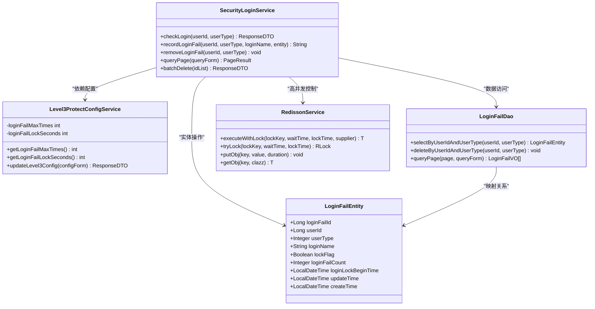
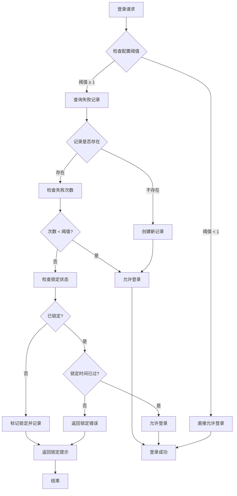
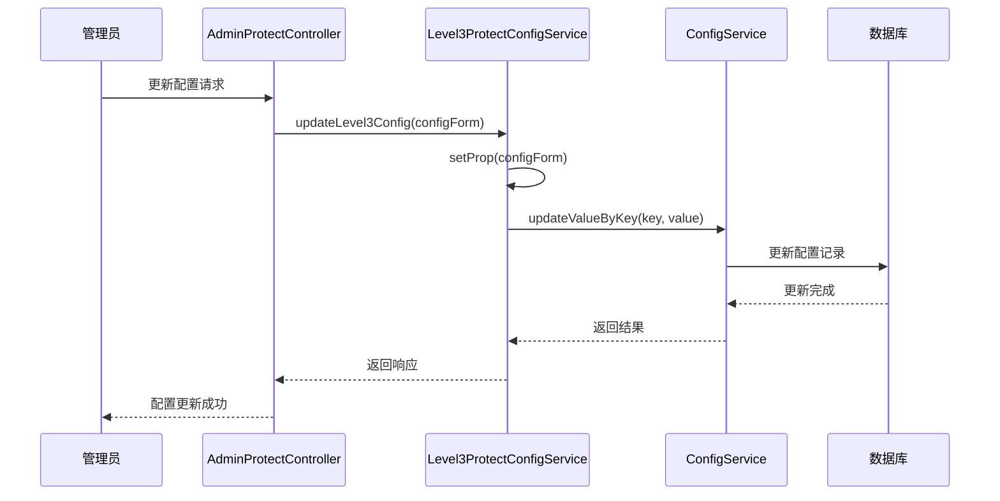
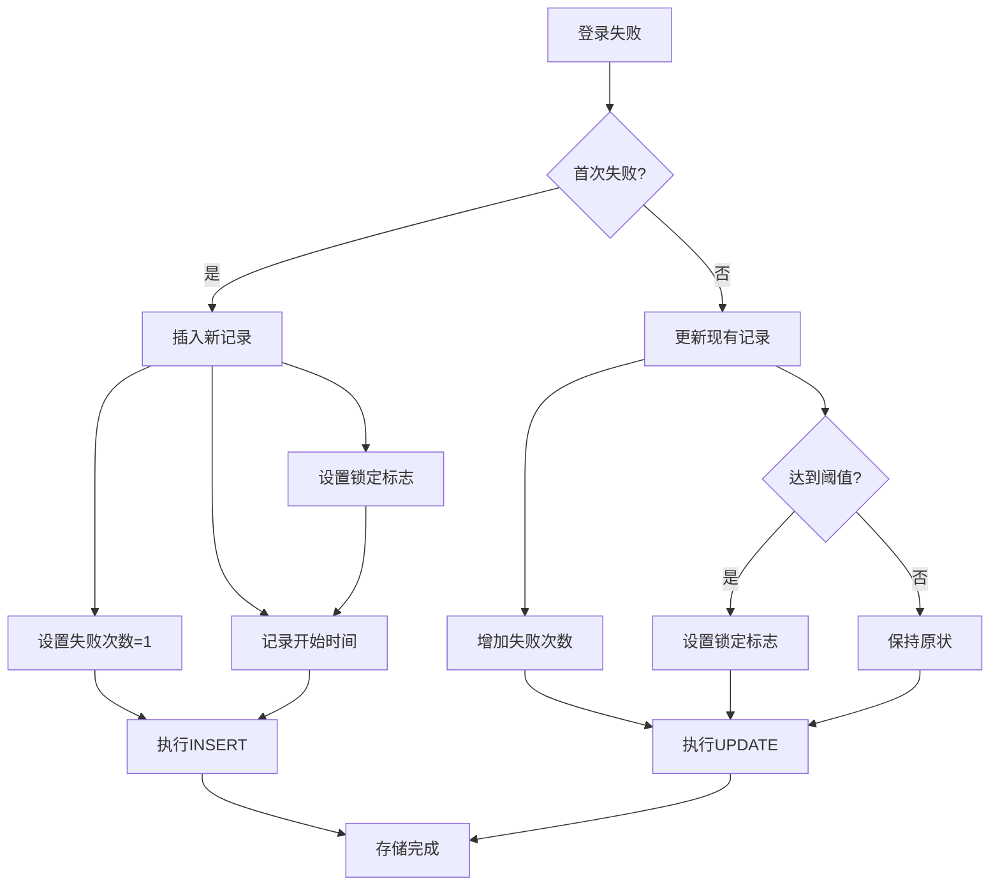
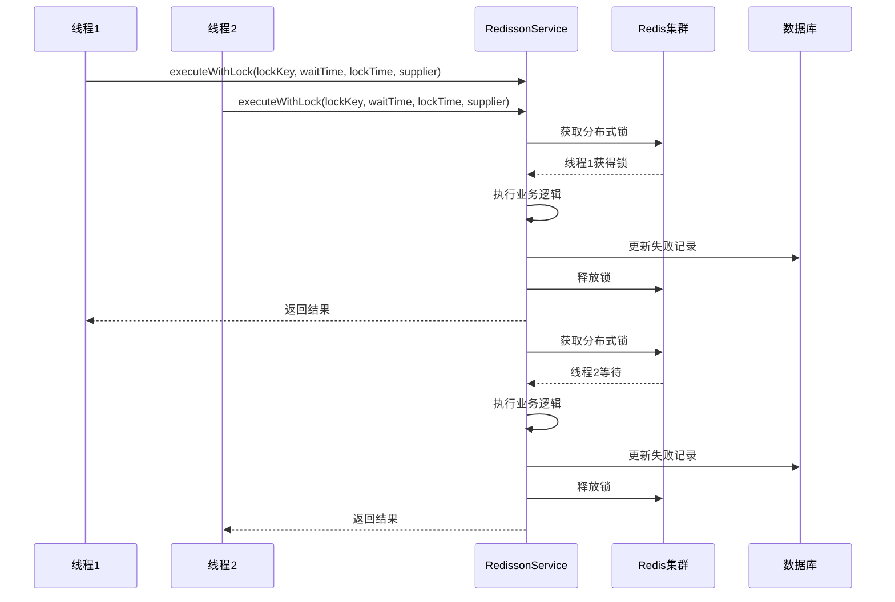
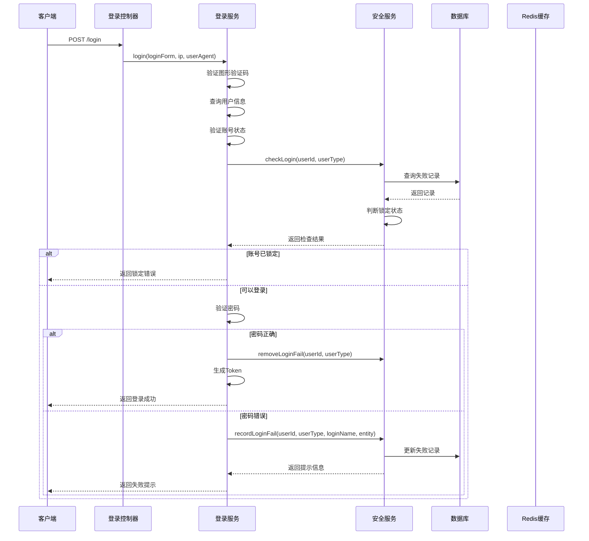
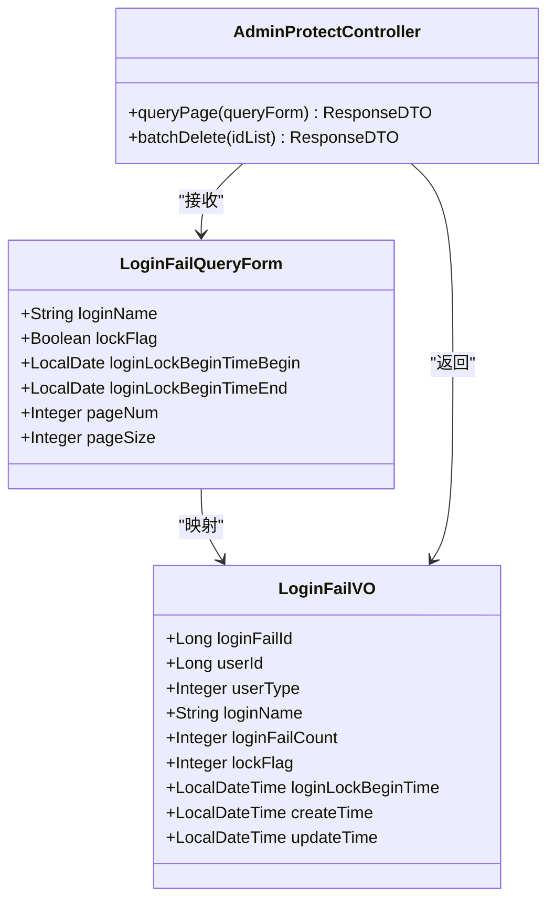
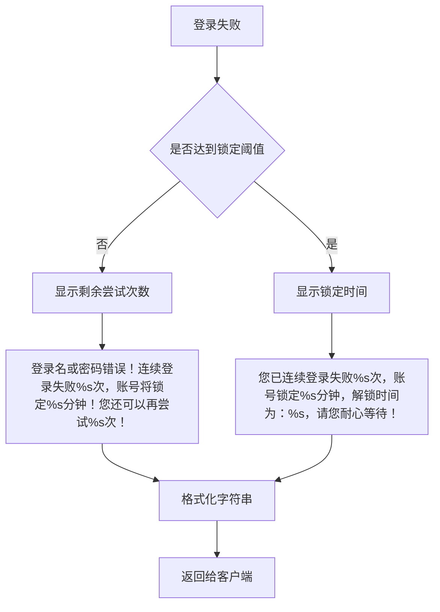

# 账号锁定机制技术实现文档

<cite>
**本文档引用的文件**
- [SecurityLoginService.java](file://smart-admin-api-java17-springboot3/sa-base/src/main/java/net/lab1024/sa/base/module/support/securityprotect/service/SecurityLoginService.java)
- [LoginFailEntity.java](file://smart-admin-api-java17-springboot3/sa-base/src/main/java/net/lab1024/sa/base/module/support/securityprotect/domain/LoginFailEntity.java)
- [Level3ProtectConfigService.java](file://smart-admin-api-java17-springboot3/sa-base/src/main/java/net/lab1024/sa/base/module/support/securityprotect/service/Level3ProtectConfigService.java)
- [LoginFailDao.java](file://smart-admin-api-java17-springboot3/sa-base/src/main/java/net/lab1024/sa/base/module/support/securityprotect/dao/LoginFailDao.java)
- [LoginService.java](file://smart-admin-api-java17-springboot3/sa-admin/src/main/java/net/lab1024/sa/admin/module/system/login/service/LoginService.java)
- [RedissonService.java](file://smart-admin-api-java17-springboot3/sa-base/src/main/java/net/lab1024/sa/base/module/support/redis/RedissonService.java)
- [RedisService.java](file://smart-admin-api-java17-springboot3/sa-base/src/main/java/net/lab1024/sa/base/module/support/redis/RedisService.java)
- [LoginFailMapper.xml](file://smart-admin-api-java17-springboot3/sa-base/src/main/resources/mapper/support/LoginFailMapper.xml)
- [UserErrorCode.java](file://smart-admin-api-java17-springboot3/sa-base/src/main/java/net/lab1024/sa/base/common/code/UserErrorCode.java)
</cite>

## 目录
1. [概述](#概述)
2. [核心组件架构](#核心组件架构)
3. [账号锁定机制原理](#账号锁定机制原理)
4. [配置管理](#配置管理)
5. [存储机制](#存储机制)
6. [高并发处理](#高并发处理)
7. [登录请求处理流程](#登录请求处理流程)
8. [状态查询与管理](#状态查询与管理)
9. [安全提示策略](#安全提示策略)
10. [故障排除指南](#故障排除指南)

## 概述

账号锁定机制是三级等保安全防护体系的重要组成部分，通过智能识别异常登录行为来防止暴力破解攻击。该机制结合失败计数、时间窗口和自动解锁功能，为系统提供强大的安全保护。

### 主要特性

- **智能失败计数**：实时跟踪用户登录失败次数
- **动态锁定阈值**：可配置的失败次数阈值和锁定时长
- **自动解锁机制**：基于时间窗口的自动解锁功能
- **多种存储方式**：支持内存、Redis和数据库存储
- **高并发支持**：完善的锁竞争处理机制
- **灵活配置管理**：Web界面化的配置管理

## 核心组件架构

**图表来源**
- [SecurityLoginService.java](file://smart-admin-api-java17-springboot3/sa-base/src/main/java/net/lab1024/sa/base/module/support/securityprotect/service/SecurityLoginService.java#L30-L173)
- [Level3ProtectConfigService.java](file://smart-admin-api-java17-springboot3/sa-base/src/main/java/net/lab1024/sa/base/module/support/securityprotect/service/Level3ProtectConfigService.java#L26-L187)
- [LoginFailEntity.java](file://smart-admin-api-java17-springboot3/sa-base/src/main/java/net/lab1024/sa/base/module/support/securityprotect/domain/LoginFailEntity.java#L20-L65)

## 账号锁定机制原理

### 失败计数与阈值判断

账号锁定机制的核心逻辑基于以下判断流程：

**图表来源**
- [SecurityLoginService.java](file://smart-admin-api-java17-springboot3/sa-base/src/main/java/net/lab1024/sa/base/module/support/securityprotect/service/SecurityLoginService.java#L51-L82)

### 锁定状态判定逻辑

系统通过以下步骤精确判定账号锁定状态：

1. **基础检查**：验证配置的失败次数阈值是否大于0
2. **记录查询**：从数据库获取用户的失败记录
3. **次数比较**：判断当前失败次数是否达到锁定阈值
4. **时间验证**：检查锁定时间是否已过期
5. **状态返回**：根据以上结果返回相应的响应

**章节来源**
- [SecurityLoginService.java](file://smart-admin-api-java17-springboot3/sa-base/src/main/java/net/lab1024/sa/base/module/support/securityprotect/service/SecurityLoginService.java#L51-L82)

## 配置管理

### Level3ProtectConfigService配置服务

Level3ProtectConfigService负责管理账号锁定相关的所有配置参数：

| 配置项 | 类型 | 默认值 | 描述 |
|--------|------|--------|------|
| loginFailMaxTimes | int | -1 | 连续登录失败次数阈值，-1表示不受限制 |
| loginFailLockSeconds | int | 1800 | 锁定时间（秒），-1表示不锁定 |
| twoFactorLoginEnabled | boolean | false | 是否启用双因子登录 |
| passwordComplexityEnabled | boolean | true | 密码复杂度检查开关 |

### 配置更新机制

系统支持动态配置更新，通过以下流程实现：

**图表来源**
- [Level3ProtectConfigService.java](file://smart-admin-api-java17-springboot3/sa-base/src/main/java/net/lab1024/sa/base/module/support/securityprotect/service/Level3ProtectConfigService.java#L178-L187)

**章节来源**
- [Level3ProtectConfigService.java](file://smart-admin-api-java17-springboot3/sa-base/src/main/java/net/lab1024/sa/base/module/support/securityprotect/service/Level3ProtectConfigService.java#L15-L187)

## 存储机制

### 数据库存储

LoginFailEntity采用MySQL数据库存储，表结构设计如下：

| 字段名 | 类型 | 约束 | 描述 |
|--------|------|------|------|
| login_fail_id | BIGINT | PRIMARY KEY, AUTO_INCREMENT | 主键ID |
| user_id | BIGINT | NOT NULL | 用户ID |
| user_type | INT | NOT NULL | 用户类型 |
| login_name | VARCHAR(50) | NOT NULL | 登录名 |
| lock_flag | BOOLEAN | DEFAULT FALSE | 锁定状态 |
| login_fail_count | INT | DEFAULT 0 | 失败次数 |
| login_lock_begin_time | DATETIME | NULLABLE | 锁定开始时间 |
| create_time | DATETIME | NOT NULL | 创建时间 |
| update_time | DATETIME | NOT NULL | 更新时间 |

### 存储操作流程

**图表来源**
- [SecurityLoginService.java](file://smart-admin-api-java17-springboot3/sa-base/src/main/java/net/lab1024/sa/base/module/support/securityprotect/service/SecurityLoginService.java#L91-L118)
- [LoginFailMapper.xml](file://smart-admin-api-java17-springboot3/sa-base/src/main/resources/mapper/support/LoginFailMapper.xml#L31-L46)

**章节来源**
- [LoginFailEntity.java](file://smart-admin-api-java17-springboot3/sa-base/src/main/java/net/lab1024/sa/base/module/support/securityprotect/domain/LoginFailEntity.java#L20-L65)
- [LoginFailDao.java](file://smart-admin-api-java17-springboot3/sa-base/src/main/java/net/lab1024/sa/base/module/support/securityprotect/dao/LoginFailDao.java#L23-L51)

## 高并发处理

### Redis分布式锁

系统采用Redisson分布式锁来处理高并发场景下的锁竞争：

**图表来源**
- [RedissonService.java](file://smart-admin-api-java17-springboot3/sa-base/src/main/java/net/lab1024/sa/base/module/support/redis/RedissonService.java#L40-L96)

### 锁竞争处理策略

1. **超时机制**：设置合理的等待时间和锁持有时间
2. **异常处理**：捕获锁获取异常并提供友好提示
3. **资源释放**：确保锁的正确释放，避免死锁
4. **性能优化**：最小化锁的持有时间

**章节来源**
- [RedissonService.java](file://smart-admin-api-java17-springboot3/sa-base/src/main/java/net/lab1024/sa/base/module/support/redis/RedissonService.java#L1-L139)

## 登录请求处理流程

### 完整登录流程

**图表来源**
- [LoginService.java](file://smart-admin-api-java17-springboot3/sa-admin/src/main/java/net/lab1024/sa/admin/module/system/login/service/LoginService.java#L128-L224)

### 错误码设计

系统定义了专门的错误码来处理账号锁定相关的情况：

| 错误码 | 常量 | 描述 |
|--------|------|------|
| 30010 | LOGIN_FAIL_LOCK | 登录连续失败已经被锁定，无法登录 |
| 30011 | LOGIN_FAIL_WILL_LOCK | 登录连续失败将会锁定提醒 |

**章节来源**
- [LoginService.java](file://smart-admin-api-java17-springboot3/sa-admin/src/main/java/net/lab1024/sa/admin/module/system/login/service/LoginService.java#L128-L224)
- [UserErrorCode.java](file://smart-admin-api-java17-springboot3/sa-base/src/main/java/net/lab1024/sa/base/common/code/UserErrorCode.java#L42-L43)

## 状态查询与管理

### 账号锁定状态查询

系统提供了完整的账号锁定状态查询功能：

**图表来源**
- [LoginFailQueryForm.java](file://smart-admin-api-java17-springboot3/sa-base/src/main/java/net/lab1024/sa/base/module/support/securityprotect/domain/LoginFailQueryForm.java#L15-L32)
- [LoginFailVO.java](file://smart-admin-api-java17-springboot3/sa-base/src/main/java/net/lab1024/sa/base/module/support/securityprotect/domain/LoginFailVO.java#L15-L46)

### 手动解锁功能

管理员可以通过Web界面手动解锁异常锁定的账户：

1. **批量查询**：支持按条件筛选锁定状态的账户
2. **批量解锁**：选择多个账户进行批量解锁操作
3. **确认机制**：提供二次确认防止误操作
4. **操作记录**：记录每次解锁操作的详细信息

**章节来源**
- [SecurityLoginService.java](file://smart-admin-api-java17-springboot3/sa-base/src/main/java/net/lab1024/sa/base/module/support/securityprotect/service/SecurityLoginService.java#L146-L173)

## 安全提示策略

### 动态提示信息

系统根据不同的场景生成相应的安全提示信息：

**图表来源**
- [SecurityLoginService.java](file://smart-admin-api-java17-springboot3/sa-base/src/main/java/net/lab1024/sa/base/module/support/securityprotect/service/SecurityLoginService.java#L33-L34)

### 提示信息模板

| 场景 | 模板 | 示例 |
|------|------|------|
| 即将锁定 | `登录名或密码错误！连续登录失败%s次，账号将锁定%s分钟！您还可以再尝试%s次！` | "登录名或密码错误！连续登录失败3次，账号将锁定30分钟！您还可以再尝试2次！" |
| 已锁定 | `您已连续登录失败%s次，账号锁定%s分钟，解锁时间为：%s，请您耐心等待！` | "您已连续登录失败5次，账号锁定30分钟，解锁时间为：2024-01-15 14:30，请您耐心等待！" |

**章节来源**
- [SecurityLoginService.java](file://smart-admin-api-java17-springboot3/sa-base/src/main/java/net/lab1024/sa/base/module/support/securityprotect/service/SecurityLoginService.java#L33-L34)
- [SecurityLoginService.java](file://smart-admin-api-java17-springboot3/sa-base/src/main/java/net/lab1024/sa/base/module/support/securityprotect/service/SecurityLoginService.java#L122-L127)

## 故障排除指南

### 常见问题及解决方案

#### 1. 账号锁定不生效

**可能原因**：
- 配置的失败次数阈值为-1（无限制）
- 数据库连接异常
- Redis连接问题

**解决步骤**：
1. 检查Level3ProtectConfigService的配置参数
2. 验证数据库表t_login_fail是否存在且正常
3. 确认Redis服务运行状态

#### 2. 高并发场景下锁竞争

**可能原因**：
- 锁等待时间设置过短
- 锁持有时间过长
- 网络延迟导致锁超时

**解决步骤**：
1. 调整RedissonService的锁等待时间
2. 优化业务逻辑减少锁持有时间
3. 检查网络连接稳定性

#### 3. 自动解锁不及时

**可能原因**：
- 数据库时间与系统时间不同步
- 定时任务配置错误
- 锁定时间计算错误

**解决步骤**：
1. 同步数据库和系统时间
2. 检查定时任务配置
3. 验证锁定时间计算逻辑

### 监控指标

建议监控以下关键指标来评估账号锁定机制的效果：

| 指标名称 | 监控维度 | 告警阈值 |
|----------|----------|----------|
| 登录失败率 | 每小时/每天 | >10% |
| 账号锁定数量 | 实时 | >10个/小时 |
| 锁定解除成功率 | 每天 | <95% |
| 锁竞争次数 | 每分钟 | >100次 |

### 性能优化建议

1. **索引优化**：为t_login_fail表的(user_id, user_type)字段添加复合索引
2. **缓存策略**：对频繁查询的失败记录进行缓存
3. **异步处理**：将失败记录的写入操作改为异步处理
4. **分库分表**：对于大型系统考虑对登录失败记录进行分库分表

**章节来源**
- [SecurityLoginService.java](file://smart-admin-api-java17-springboot3/sa-base/src/main/java/net/lab1024/sa/base/module/support/securityprotect/service/SecurityLoginService.java#L1-L173)