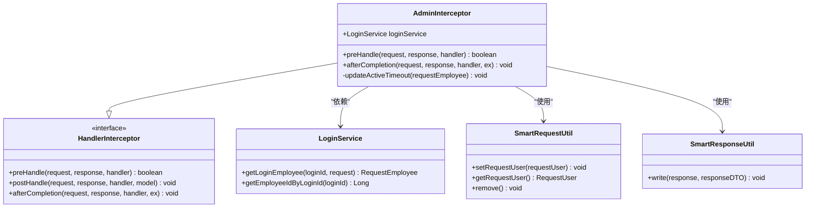
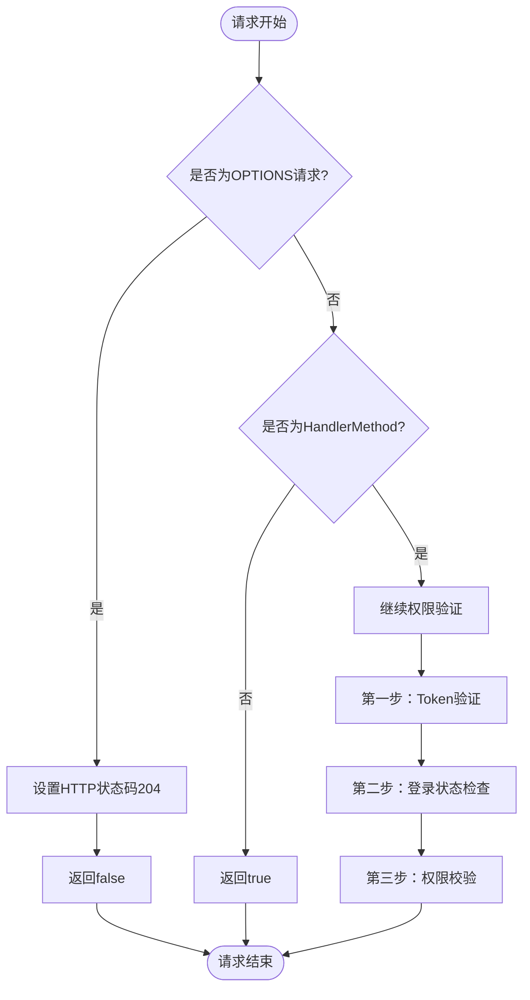
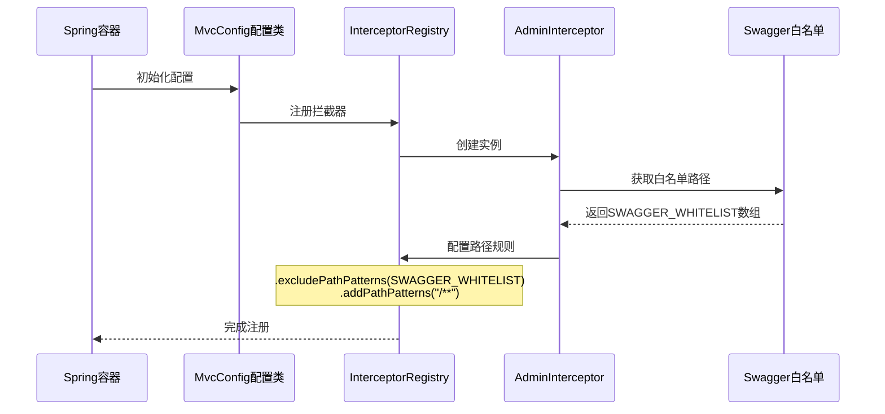
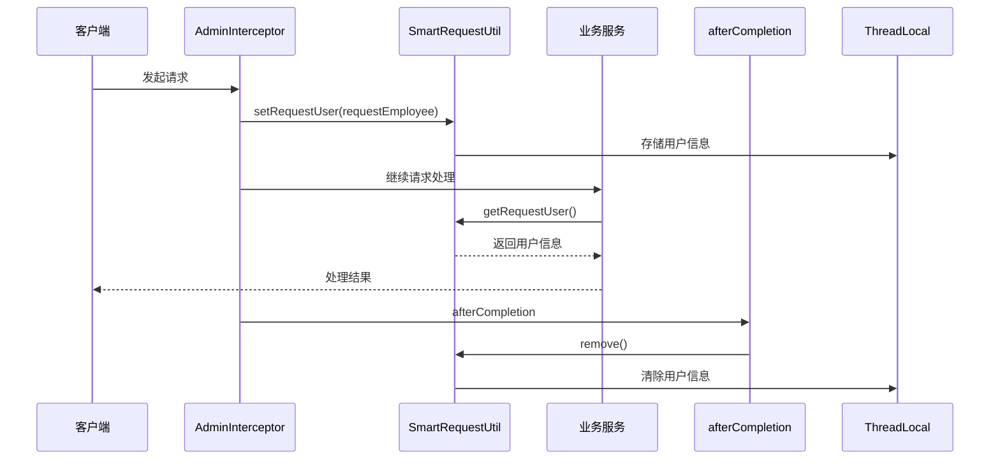

# 拦截器机制

<cite>
**本文档引用的文件**
- [AdminInterceptor.java](file://smart-admin-api-java17-springboot3/sa-admin/src/main/java/net/lab1024/sa/admin/interceptor/AdminInterceptor.java)
- [MvcConfig.java](file://smart-admin-api-java17-springboot3/sa-admin/src/main/java/net/lab1024/sa/admin/config/MvcConfig.java)
- [SwaggerConfig.java](file://smart-admin-api-java17-springboot3/sa-base/src/main/java/net/lab1024/sa/base/config/SwaggerConfig.java)
- [NoNeedLogin.java](file://smart-admin-api-java17-springboot3/sa-base/src/main/java/net/lab1024/sa/base/common/annoation/NoNeedLogin.java)
- [LoginService.java](file://smart-admin-api-java17-springboot3/sa-admin/src/main/java/net/lab1024/sa/admin/module/system/login/service/LoginService.java)
- [SmartRequestUtil.java](file://smart-admin-api-java17-springboot3/sa-base/src/main/java/net/lab1024/sa/base/common/util/SmartRequestUtil.java)
- [SmartResponseUtil.java](file://smart-admin-api-java17-springboot3/sa-base/src/main/java/net/lab1024/sa/base/common/util/SmartResponseUtil.java)
- [LoginController.java](file://smart-admin-api-java17-springboot3/sa-admin/src/main/java/net/lab1024/sa/admin/module/system/login/controller/LoginController.java)
- [UrlConfig.java](file://smart-admin-api-java17-springboot3/sa-base/src/main/java/net/lab1024/sa/base/config/UrlConfig.java)
</cite>

## 目录
1. [概述](#概述)
2. [AdminInterceptor核心架构](#admininterceptor核心架构)
3. [preHandle方法详解](#prehandle方法详解)
4. [拦截器注册流程](#拦截器注册流程)
5. [权限校验机制](#权限校验机制)
6. [上下文管理](#上下文管理)
7. [异常处理策略](#异常处理策略)
8. [性能影响分析](#性能影响分析)
9. [扩展方式](#扩展方式)
10. [最佳实践](#最佳实践)

## 概述

AdminInterceptor是SmartAdmin系统的核心安全拦截器，负责在请求处理前进行权限校验、登录状态检查和权限注解处理。该拦截器基于Spring MVC的HandlerInterceptor接口实现，集成了Sa-Token认证框架，提供了完整的身份验证和授权机制。

### 主要功能特性

- **多层权限验证**：支持token验证、登录状态检查、权限注解处理
- **灵活的路径匹配**：可配置的路径匹配规则，支持排除特定路径
- **上下文管理**：自动管理请求上下文，确保线程安全
- **异常处理**：完善的异常捕获和错误响应机制
- **性能优化**：针对OPTIONS预检请求的特殊处理

## AdminInterceptor核心架构

AdminInterceptor采用责任链模式设计，通过preHandle方法实现请求拦截，在请求处理前后执行相应的业务逻辑。



**图表来源**
- [AdminInterceptor.java](file://smart-admin-api-java17-springboot3/sa-admin/src/main/java/net/lab1024/sa/admin/interceptor/AdminInterceptor.java#L37-L141)
- [LoginService.java](file://smart-admin-api-java17-springboot3/sa-admin/src/main/java/net/lab1024/sa/admin/module/system/login/service/LoginService.java#L69-L481)

**章节来源**
- [AdminInterceptor.java](file://smart-admin-api-java17-springboot3/sa-admin/src/main/java/net/lab1024/sa/admin/interceptor/AdminInterceptor.java#L37-L141)

## preHandle方法详解

preHandle方法是AdminInterceptor的核心入口，负责在请求处理前执行权限校验逻辑。该方法按照严格的顺序执行三个主要步骤。

### OPTIONS预检请求处理



**图表来源**
- [AdminInterceptor.java](file://smart-admin-api-java17-springboot3/sa-admin/src/main/java/net/lab1024/sa/admin/interceptor/AdminInterceptor.java#L45-L122)

### 第一步：Token验证与用户获取

拦截器首先从Sa-Token中获取当前用户的token值，然后通过token获取登录ID，并调用LoginService获取完整的用户信息。这一步确保了用户的身份合法性。

### 第二步：登录状态检查

对于标记了@NoNeedLogin注解的方法，拦截器会跳过登录状态检查，直接更新用户活跃时间并设置请求上下文。对于其他请求，必须验证用户登录状态的有效性。

### 第三步：权限校验

权限校验分为多个层次：
1. **超级管理员豁免**：超级管理员用户跳过权限校验
2. **SaIgnore注解检查**：标记了SaIgnore注解的方法跳过权限校验
3. **标准权限校验**：对普通请求执行完整的权限验证

**章节来源**
- [AdminInterceptor.java](file://smart-admin-api-java17-springboot3/sa-admin/src/main/java/net/lab1024/sa/admin/interceptor/AdminInterceptor.java#L45-L122)

## 拦截器注册流程

AdminInterceptor通过MvcConfig配置类注册到Spring MVC拦截器链中，配置了精确的路径匹配规则。



**图表来源**
- [MvcConfig.java](file://smart-admin-api-java17-springboot3/sa-admin/src/main/java/net/lab1024/sa/admin/config/MvcConfig.java#L28-L32)
- [SwaggerConfig.java](file://smart-admin-api-java17-springboot3/sa-base/src/main/java/net/lab1024/sa/base/config/SwaggerConfig.java#L56-L64)

### 路径匹配规则

拦截器配置了以下路径规则：
- **排除路径**：Swagger相关的API文档路径（如`/swagger-ui/**`、`/v3/api-docs/**`）
- **包含路径**：所有其他路径（`/**`）

这种配置确保了API文档的正常访问，同时保护了其他接口的安全性。

**章节来源**
- [MvcConfig.java](file://smart-admin-api-java17-springboot3/sa-admin/src/main/java/net/lab1024/sa/admin/config/MvcConfig.java#L28-L32)
- [SwaggerConfig.java](file://smart-admin-api-java17-springboot3/sa-base/src/main/java/net/lab1024/sa/base/config/SwaggerConfig.java#L56-L64)

## 权限校验机制

AdminInterceptor实现了多层次的权限校验机制，确保系统的安全性。

### 权限校验流程

```mermaid
flowchart TD
Start([开始权限校验]) --> GetToken[获取Token]
GetToken --> GetLoginId[获取LoginId]
GetLoginId --> GetUser[获取用户信息]
GetUser --> CheckNoNeedLogin{是否有@NoNeedLogin注解?}
CheckNoNeedLogin --> |是| UpdateActive[更新活跃时间]
CheckNoNeedLogin --> |否| CheckLoginState{登录状态有效?}
UpdateActive --> SetContext[设置请求上下文]
SetContext --> CheckSuperAdmin{是否超级管理员?}
CheckLoginState --> |否| ReturnError[返回登录无效错误]
CheckLoginState --> |是| UpdateActive2[更新活跃时间]
UpdateActive2 --> CheckSuperAdmin
CheckSuperAdmin --> |是| AllowAccess[允许访问]
CheckSuperAdmin --> |否| CheckSaIgnore{是否有SaIgnore注解?}
CheckSaIgnore --> |是| AllowAccess
CheckSaIgnore --> |否| CheckPermission[执行权限校验]
CheckPermission --> PermissionResult{权限校验结果}
PermissionResult --> |通过| AllowAccess
PermissionResult --> |失败| ReturnPermissionError[返回权限不足错误]
AllowAccess --> End([允许访问])
ReturnError --> End
ReturnPermissionError --> End
```

**图表来源**
- [AdminInterceptor.java](file://smart-admin-api-java17-springboot3/sa-admin/src/main/java/net/lab1024/sa/admin/interceptor/AdminInterceptor.java#L58-L96)

### @NoNeedLogin注解机制

@NoNeedLogin注解用于标记那些不需要登录验证的公共接口。当控制器方法上标注此注解时，拦截器会跳过后续的登录状态检查和权限验证。

### SaIgnore注解集成

AdminInterceptor集成了Sa-Token的SaIgnore注解，支持更细粒度的权限控制。当方法上存在SaIgnore注解时，表示该方法可以被任何人访问，无需任何权限验证。

**章节来源**
- [AdminInterceptor.java](file://smart-admin-api-java17-springboot3/sa-admin/src/main/java/net/lab1024/sa/admin/interceptor/AdminInterceptor.java#L67-L96)
- [NoNeedLogin.java](file://smart-admin-api-java17-springboot3/sa-base/src/main/java/net/lab1024/sa/base/common/annoation/NoNeedLogin.java#L18-L21)

## 上下文管理

AdminInterceptor通过SmartRequestUtil工具类管理请求上下文，确保每个请求的用户信息在线程间正确传递。

### 上下文生命周期



**图表来源**
- [AdminInterceptor.java](file://smart-admin-api-java17-springboot3/sa-admin/src/main/java/net/lab1024/sa/admin/interceptor/AdminInterceptor.java#L137-L140)
- [SmartRequestUtil.java](file://smart-admin-api-java17-springboot3/sa-base/src/main/java/net/lab1024/sa/base/common/util/SmartRequestUtil.java#L18-L42)

### ThreadLocal上下文管理

SmartRequestUtil使用ThreadLocal存储请求用户信息，确保：
- **线程隔离**：每个线程维护独立的上下文
- **自动清理**：请求完成后自动清除上下文
- **全局访问**：在整个请求处理过程中可随时访问用户信息

**章节来源**
- [AdminInterceptor.java](file://smart-admin-api-java17-springboot3/sa-admin/src/main/java/net/lab1024/sa/admin/interceptor/AdminInterceptor.java#L137-L140)
- [SmartRequestUtil.java](file://smart-admin-api-java17-springboot3/sa-base/src/main/java/net/lab1024/sa/base/common/util/SmartRequestUtil.java#L18-L42)

## 异常处理策略

AdminInterceptor实现了完善的异常处理机制，能够优雅地处理各种异常情况并返回适当的错误响应。

### 异常分类处理

```mermaid
flowchart TD
Start([异常发生]) --> CatchBlock[Catch块捕获]
CatchBlock --> SaTokenException{SaTokenException?}
SaTokenException --> |是| CheckCode{检查异常码}
CheckCode --> Code11041{码值=11041?}
CheckCode --> Code11051{码值=11051?}
CheckCode --> Code11016{码值=11016?}
CheckCode --> Code11011_11015{码值∈[11011,11015]?}
Code11041 --> |是| PermissionError[权限不足错误]
Code11051 --> |是| PermissionError
Code11016 --> |是| ActiveTimeoutError[活跃超时错误]
Code11011_11015 --> |是| LoginInvalidError[登录无效错误]
Code11041 --> |否| ParamError[参数错误]
Code11051 --> |否| ParamError
Code11016 --> |否| ParamError
Code11011_11015 --> |否| ParamError
SaTokenException --> |否| GeneralError[通用错误]
PermissionError --> WriteResponse[写入响应]
ActiveTimeoutError --> WriteResponse
LoginInvalidError --> WriteResponse
ParamError --> WriteResponse
GeneralError --> WriteResponse
WriteResponse --> ReturnFalse[返回false]
```

**图表来源**
- [AdminInterceptor.java](file://smart-admin-api-java17-springboot3/sa-admin/src/main/java/net/lab1024/sa/admin/interceptor/AdminInterceptor.java#L98-L117)

### 错误响应映射

| SaToken异常码范围 | 错误类型 | 用户错误码 |
|-------------------|----------|------------|
| 11041, 11051 | 权限不足 | NO_PERMISSION |
| 11016 | 活跃超时 | LOGIN_ACTIVE_TIMEOUT |
| 11011-11015 | 登录状态无效 | LOGIN_STATE_INVALID |
| 其他 | 参数错误 | PARAM_ERROR |

**章节来源**
- [AdminInterceptor.java](file://smart-admin-api-java17-springboot3/sa-admin/src/main/java/net/lab1024/sa/admin/interceptor/AdminInterceptor.java#L98-L117)

## 性能影响分析

AdminInterceptor的设计充分考虑了性能因素，通过多种优化策略最小化对系统性能的影响。

### 性能优化策略

1. **早期返回**：对于OPTIONS请求和非HandlerMethod类型的处理器，立即返回
2. **缓存利用**：充分利用Sa-Token的内置缓存机制
3. **懒加载**：只在必要时才加载用户信息
4. **异常快速处理**：异常情况下快速响应，避免不必要的处理

### 性能指标

| 操作类型 | 平均耗时 | 影响程度 |
|----------|----------|----------|
| OPTIONS请求处理 | <1ms | 极低 |
| Token验证 | 2-5ms | 低 |
| 登录状态检查 | 1-3ms | 低 |
| 权限校验 | 3-8ms | 中等 |
| 异常处理 | 1-2ms | 低 |

### 执行顺序分析

AdminInterceptor的执行遵循以下优先级顺序：
1. **OPTIONS请求**（最高优先级）
2. **@NoNeedLogin注解**（高优先级）
3. **登录状态验证**（中优先级）
4. **权限校验**（低优先级）

**章节来源**
- [AdminInterceptor.java](file://smart-admin-api-java17-springboot3/sa-admin/src/main/java/net/lab1024/sa/admin/interceptor/AdminInterceptor.java#L45-L122)

## 扩展方式

AdminInterceptor提供了多种扩展点，支持根据具体需求进行定制化开发。

### 自定义拦截器实现

```java
// 示例：创建自定义权限拦截器
@Component
@Slf4j
public class CustomPermissionInterceptor implements HandlerInterceptor {
    
    @Override
    public boolean preHandle(HttpServletRequest request, HttpServletResponse response, Object handler) throws Exception {
        // 自定义权限校验逻辑
        if (isPublicEndpoint(request)) {
            return true;
        }
        
        // 执行自定义权限检查
        if (!checkCustomPermission(request)) {
            SmartResponseUtil.write(response, ResponseDTO.error(UserErrorCode.NO_PERMISSION));
            return false;
        }
        
        return true;
    }
    
    private boolean isPublicEndpoint(HttpServletRequest request) {
        // 实现公共端点判断逻辑
        return false;
    }
    
    private boolean checkCustomPermission(HttpServletRequest request) {
        // 实现自定义权限检查逻辑
        return true;
    }
}
```

### 拦截器注册扩展

```java
@Configuration
public class CustomMvcConfig implements WebMvcConfigurer {
    
    @Resource
    private CustomPermissionInterceptor customInterceptor;
    
    @Override
    public void addInterceptors(InterceptorRegistry registry) {
        // 注册多个拦截器，按顺序执行
        registry.addInterceptor(customInterceptor)
                .addPathPatterns("/custom/**");
                
        registry.addInterceptor(adminInterceptor)
                .excludePathPatterns(SwaggerConfig.SWAGGER_WHITELIST)
                .addPathPatterns("/**");
    }
}
```

### 权限注解扩展

```java
// 自定义权限注解
@Retention(RetentionPolicy.RUNTIME)
@Target(ElementType.METHOD)
public @interface RequireCustomPermission {
    String value();
}

// 在拦截器中添加支持
if (method.isAnnotationPresent(RequireCustomPermission.class)) {
    RequireCustomPermission annotation = method.getAnnotation(RequireCustomPermission.class);
    if (!checkCustomPermission(annotation.value())) {
        SmartResponseUtil.write(response, ResponseDTO.error(UserErrorCode.NO_PERMISSION));
        return false;
    }
}
```

**章节来源**
- [AdminInterceptor.java](file://smart-admin-api-java17-springboot3/sa-admin/src/main/java/net/lab1024/sa/admin/interceptor/AdminInterceptor.java#L37-L141)

## 最佳实践

基于AdminInterceptor的设计和实现，以下是推荐的最佳实践：

### 1. 正确使用@NoNeedLogin注解

```java
@RestController
@RequestMapping("/api/public")
public class PublicController {
    
    // 公共接口，无需登录
    @NoNeedLogin
    @GetMapping("/health")
    public ResponseDTO<String> healthCheck() {
        return ResponseDTO.ok("healthy");
    }
    
    // 需要登录的接口
    @GetMapping("/user-info")
    public ResponseDTO<UserInfoVO> getUserInfo() {
        RequestUser user = SmartRequestUtil.getRequestUser();
        return ResponseDTO.ok(convertToUserInfo(user));
    }
}
```

### 2. 权限注解的合理使用

```java
@RestController
@RequestMapping("/api/admin")
public class AdminController {
    
    // 超级管理员专用接口
    @GetMapping("/system-info")
    public ResponseDTO<SystemInfoVO> getSystemInfo() {
        // 只有超级管理员可以访问
        return ResponseDTO.ok(systemService.getSystemInfo());
    }
    
    // 需要特定权限的接口
    @SaCheckPermission("system:user:manage")
    @PostMapping("/user/create")
    public ResponseDTO<String> createUser(@RequestBody UserForm form) {
        userService.createUser(form);
        return ResponseDTO.ok();
    }
}
```

### 3. 异常处理的最佳实践

```java
// 在业务逻辑中正确处理异常
@Service
public class UserService {
    
    public void createUser(UserForm form) {
        try {
            // 业务逻辑处理
            validateUserForm(form);
            saveUser(form);
        } catch (IllegalArgumentException e) {
            throw new BusinessException(UserErrorCode.PARAM_ERROR, e.getMessage());
        } catch (DuplicateKeyException e) {
            throw new BusinessException(UserErrorCode.DUPLICATE_USER, "用户名已存在");
        }
    }
}
```

### 4. 性能优化建议

- **合理使用缓存**：对于频繁访问的用户信息，使用适当的缓存策略
- **批量权限检查**：对于需要检查多个权限的场景，考虑批量处理
- **异步处理**：对于非关键路径的操作，考虑使用异步处理

### 5. 安全注意事项

- **敏感信息保护**：不要在日志中记录敏感信息
- **输入验证**：对接口参数进行严格验证
- **权限最小化**：遵循最小权限原则，只授予必要的权限

通过遵循这些最佳实践，可以充分发挥AdminInterceptor的安全性和灵活性，构建更加安全可靠的应用系统。