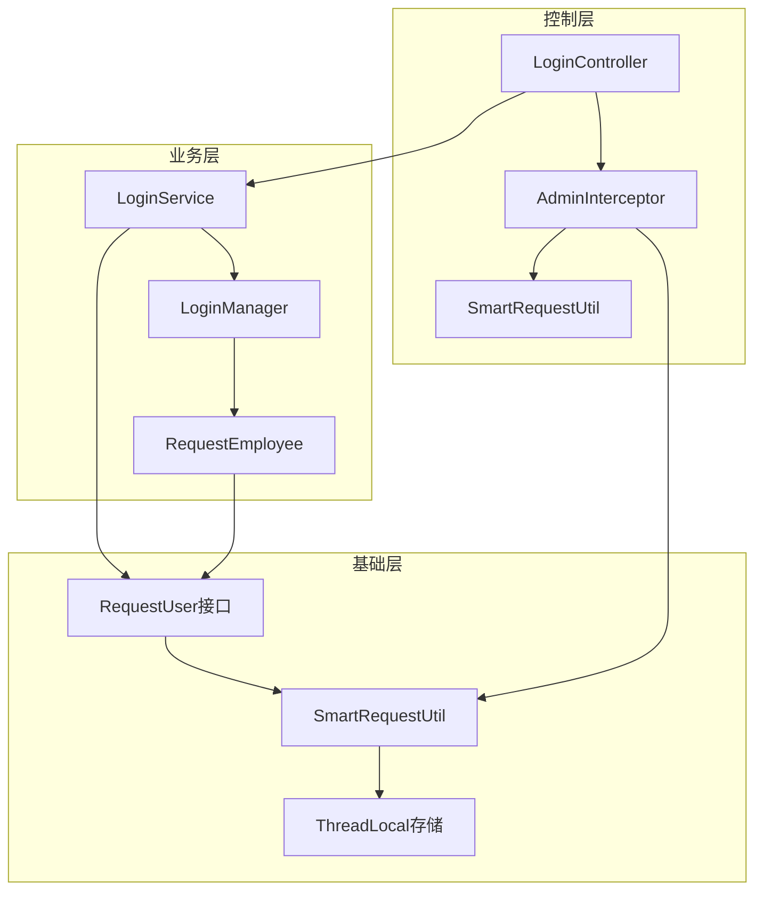
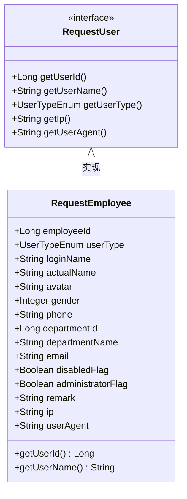
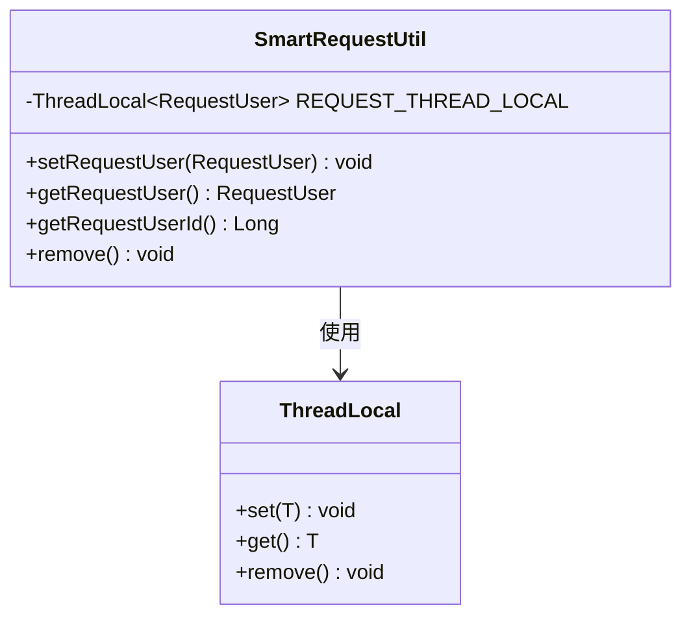
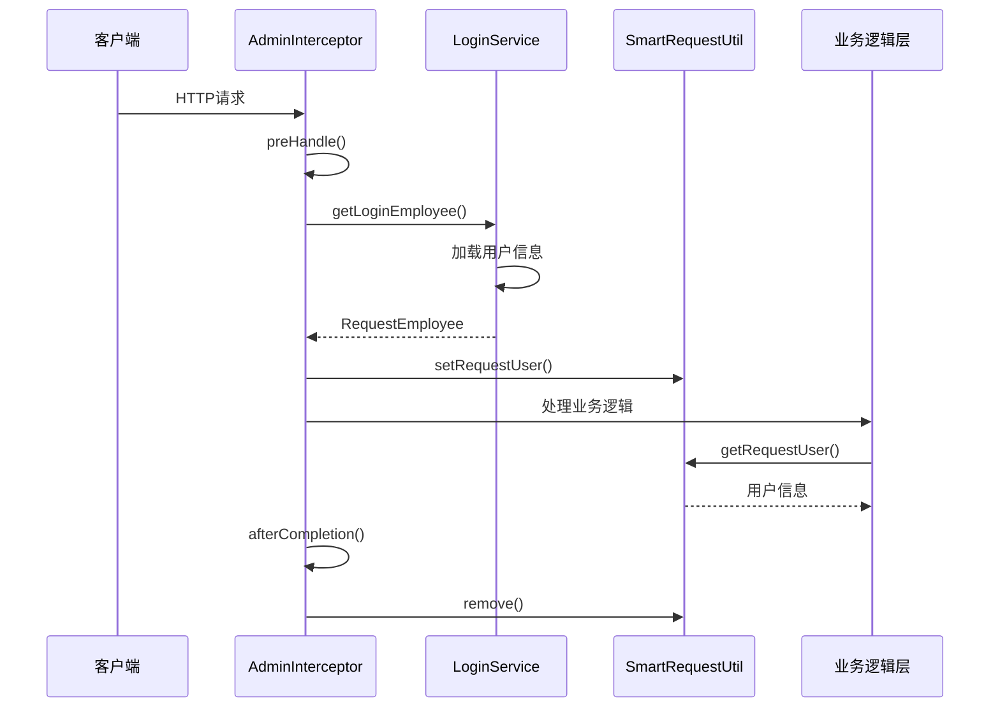
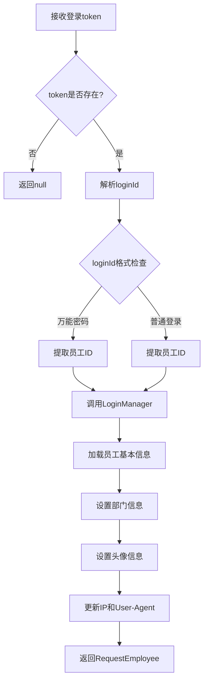
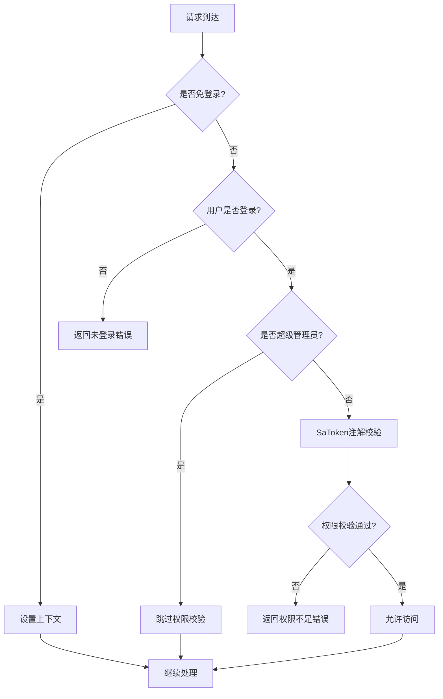
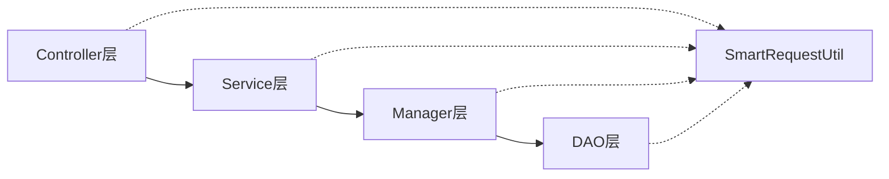

# 用户上下文管理

<cite>
**本文档引用的文件**
- [RequestUser.java](file://smart-admin-api-java17-springboot3\sa-base\src\main\java\net\lab1024\sa\base\common\domain\RequestUser.java)
- [RequestEmployee.java](file://smart-admin-api-java17-springboot3\sa-admin\src\main\java\net\lab1024\sa\admin\module\system\login\domain\RequestEmployee.java)
- [SmartRequestUtil.java](file://smart-admin-api-java17-springboot3\sa-base\src\main\java\net\lab1024\sa\base\common\util\SmartRequestUtil.java)
- [AdminInterceptor.java](file://smart-admin-api-java17-springboot3\sa-admin\src\main\java\net\lab1024\sa\admin\interceptor\AdminInterceptor.java)
- [LoginService.java](file://smart-admin-api-java17-springboot3\sa-admin\src\main\java\net\lab1024\sa\admin\module\system\login\service\LoginService.java)
- [LoginManager.java](file://smart-admin-api-java17-springboot3\sa-admin\src\main\java\net\lab1024\sa\admin\module\system\login\manager\LoginManager.java)
- [AdminRequestUtil.java](file://smart-admin-api-java17-springboot3\sa-admin\src\main\java\net\lab1024\sa\admin\util\AdminRequestUtil.java)
- [UserTypeEnum.java](file://smart-admin-api-java17-springboot3\sa-base\src\main\java\net\lab1024\sa\base\common\enumeration\UserTypeEnum.java)
</cite>

## 目录
1. [引言](#引言)
2. [项目架构概述](#项目架构概述)
3. [核心接口设计](#核心接口设计)
4. [用户上下文管理机制](#用户上下文管理机制)
5. [权限校验流程](#权限校验流程)
6. [最佳实践与故障排除](#最佳实践与故障排除)
7. [总结](#总结)

## 引言

在现代Web应用中，用户上下文管理是确保系统安全性和可维护性的关键组件。本文档深入分析了基于Spring Boot 3和Java 17的企业级权限管理系统中的用户上下文管理机制，详细阐述了从用户认证到权限校验的完整流程，以及如何通过ThreadLocal技术实现高效的用户信息传递和管理。

该系统采用了分层架构设计，通过清晰的接口定义和工具类封装，实现了用户信息的统一管理和跨层级访问。整个机制不仅保证了系统的安全性，还提供了良好的性能表现和可扩展性。

## 项目架构概述

系统采用典型的三层架构模式，包含基础层、业务层和控制层，通过精心设计的组件协作实现完整的用户上下文管理功能。



**图表来源**
- [LoginController.java](file://smart-admin-api-java17-springboot3\sa-admin\src\main\java\net\lab1024\sa\admin\module\system\login\controller\LoginController.java#L1-L89)
- [AdminInterceptor.java](file://smart-admin-api-java17-springboot3\sa-admin\src\main\java\net\lab1024\sa\admin\interceptor\AdminInterceptor.java#L1-L141)

**章节来源**
- [LoginController.java](file://smart-admin-api-java17-springboot3\sa-admin\src\main\java\net\lab1024\sa\admin\module\system\login\controller\LoginController.java#L1-L89)
- [AdminInterceptor.java](file://smart-admin-api-java17-springboot3\sa-admin\src\main\java\net\lab1024\sa\admin\interceptor\AdminInterceptor.java#L1-L141)

## 核心接口设计

### RequestUser接口定义

RequestUser接口作为用户上下文管理的核心抽象，定义了用户基本信息的标准结构，确保了系统中用户信息的一致性和可扩展性。



**图表来源**
- [RequestUser.java](file://smart-admin-api-java17-springboot3\sa-base\src\main\java\net\lab1024\sa\base\common\domain\RequestUser.java#L14-L48)
- [RequestEmployee.java](file://smart-admin-api-java17-springboot3\sa-admin\src\main\java\net\lab1024\sa\admin\module\system\login\domain\RequestEmployee.java#L1-L81)

#### 接口方法详解

| 方法 | 返回类型 | 描述 | 用途 |
|------|----------|------|------|
| `getUserId()` | Long | 用户唯一标识符 | 用于识别具体用户身份 |
| `getUserName()` | String | 用户显示名称 | 提供友好的用户界面标识 |
| `getUserType()` | UserTypeEnum | 用户类型枚举 | 区分不同类型的用户角色 |
| `getIp()` | String | 请求IP地址 | 用于安全审计和地理位置分析 |
| `getUserAgent()` | String | 浏览器标识信息 | 用于兼容性检查和安全分析 |

### RequestEmployee实体结构

RequestEmployee类实现了RequestUser接口，包含了完整的用户信息结构，支持企业级应用的各种需求。

#### 关键属性说明

| 属性 | 类型 | 描述 | 业务价值 |
|------|------|------|----------|
| `employeeId` | Long | 员工唯一标识 | 系统内部用户识别 |
| `loginName` | String | 登录账号 | 用户登录凭证 |
| `actualName` | String | 员工姓名 | 用户界面显示 |
| `departmentId` | Long | 部门标识 | 组织架构关联 |
| `departmentName` | String | 部门名称 | 部门信息展示 |
| `administratorFlag` | Boolean | 超级管理员标识 | 权限控制判断 |
| `ip` | String | 请求IP地址 | 安全审计记录 |
| `userAgent` | String | 浏览器标识 | 兼容性分析 |

**章节来源**
- [RequestUser.java](file://smart-admin-api-java17-springboot3\sa-base\src\main\java\net\lab1024\sa\base\common\domain\RequestUser.java#L1-L50)
- [RequestEmployee.java](file://smart-admin-api-java17-springboot3\sa-admin\src\main\java\net\lab1024\sa\admin\module\system\login\domain\RequestEmployee.java#L1-L81)

## 用户上下文管理机制

### SmartRequestUtil工具类设计

SmartRequestUtil是用户上下文管理的核心工具类，基于ThreadLocal技术实现线程级别的用户信息存储和传递。



**图表来源**
- [SmartRequestUtil.java](file://smart-admin-api-java17-springboot3\sa-base\src\main\java\net\lab1024\sa\base\common\util\SmartRequestUtil.java#L16-L42)

#### 核心方法实现

| 方法 | 功能 | 安全特性 | 性能考虑 |
|------|------|----------|----------|
| `setRequestUser()` | 设置当前线程用户信息 | 参数空值检查 | 避免无效数据存储 |
| `getRequestUser()` | 获取当前线程用户信息 | 线程隔离保证 | 快速访问 |
| `getRequestUserId()` | 获取用户ID快捷方法 | 空值安全处理 | 减少不必要的对象创建 |
| `remove()` | 清理线程本地变量 | 防止内存泄漏 | 确保资源及时释放 |

### 请求拦截器中的上下文绑定

AdminInterceptor在请求处理的不同阶段负责用户上下文的管理和清理工作。



**图表来源**
- [AdminInterceptor.java](file://smart-admin-api-java17-springboot3\sa-admin\src\main\java\net\lab1024\sa\admin\interceptor\AdminInterceptor.java#L45-L141)

#### 拦截器执行流程

1. **预处理阶段(preHandle)**：
   - 验证HTTP方法和处理器类型
   - 从Sa-Token获取token和loginId
   - 调用LoginService获取完整的用户信息
   - 将用户信息绑定到当前线程上下文

2. **业务处理阶段**：
   - 权限校验和业务逻辑执行
   - 通过SmartRequestUtil随时获取用户信息

3. **后处理阶段(afterCompletion)**：
   - 清理ThreadLocal中的用户信息
   - 防止内存泄漏和上下文污染

**章节来源**
- [SmartRequestUtil.java](file://smart-admin-api-java17-springboot3\sa-base\src\main\java\net\lab1024\sa\base\common\util\SmartRequestUtil.java#L1-L43)
- [AdminInterceptor.java](file://smart-admin-api-java17-springboot3\sa-admin\src\main\java\net\lab1024\sa\admin\interceptor\AdminInterceptor.java#L1-L141)

## 权限校验流程

### 登录服务中的用户信息获取

LoginService负责根据token获取完整的用户信息，并将其绑定到请求上下文中。



**图表来源**
- [LoginService.java](file://smart-admin-api-java17-springboot3\sa-admin\src\main\java\net\lab1024\sa\admin\module\system\login\service\LoginService.java#L264-L299)

#### 用户信息加载步骤

1. **Token解析**：从Sa-Token中提取token值和对应的loginId
2. **ID提取**：根据登录方式（普通登录或万能密码）解析出员工ID
3. **信息加载**：调用LoginManager从缓存或数据库中加载用户详细信息
4. **上下文更新**：更新IP地址和User-Agent信息以反映当前请求环境

### 权限校验机制

系统实现了多层次的权限校验机制，确保只有授权用户才能访问特定资源。



**图表来源**
- [AdminInterceptor.java](file://smart-admin-api-java17-springboot3\sa-admin\src\main\java\net\lab1024\sa\admin\interceptor\AdminInterceptor.java#L67-L96)

#### 权限校验层次

| 校验层次 | 检查内容 | 失败处理 | 性能影响 |
|----------|----------|----------|----------|
| 免登录检查 | NoNeedLogin注解 | 直接设置上下文 | 最低 |
| 登录状态检查 | 用户是否已登录 | 返回未登录错误 | 低 |
| 超级管理员检查 | administratorFlag标志 | 跳过后续校验 | 中等 |
| SaToken注解校验 | 方法级别的权限注解 | 返回权限错误 | 较高 |

**章节来源**
- [LoginService.java](file://smart-admin-api-java17-springboot3\sa-admin\src\main\java\net\lab1024\sa\admin\module\system\login\service\LoginService.java#L264-L299)
- [AdminInterceptor.java](file://smart-admin-api-java17-springboot3\sa-admin\src\main\java\net\lab1024\sa\admin\interceptor\AdminInterceptor.java#L67-L96)

## 最佳实践与故障排除

### 上下文清理机制的重要性

正确的上下文清理是防止内存泄漏的关键措施。系统在请求处理完成后自动清理ThreadLocal中的用户信息。

#### 清理时机和策略

| 清理场景 | 触发条件 | 清理内容 | 预防效果 |
|----------|----------|----------|----------|
| 正常请求完成 | afterCompletion方法 | ThreadLocal变量 | 防止内存累积 |
| 异常请求中断 | 异常捕获处理 | ThreadLocal变量 | 避免异常传播 |
| 系统关闭 | 应用程序停止 | 所有ThreadLocal | 确保优雅退出 |

### 常见问题解决方案

#### 1. 内存泄漏问题

**问题现象**：系统运行一段时间后内存持续增长，最终导致OOM异常。

**根本原因**：ThreadLocal中的用户信息未能及时清理，特别是在异常情况下。

**解决方案**：
- 确保在afterCompletion方法中调用SmartRequestUtil.remove()
- 在异常处理中添加清理逻辑
- 使用弱引用避免强引用循环

#### 2. 上下文丢失问题

**问题现象**：某些业务逻辑中无法获取到用户信息。

**可能原因**：
- 用户信息在异步处理中丢失
- 缓存失效导致信息重新加载
- 多线程环境下上下文污染

**解决方案**：
- 在异步任务中显式传递用户信息
- 优化缓存策略，减少频繁的数据库查询
- 使用上下文传播机制

#### 3. 性能优化建议

| 优化方向 | 具体措施 | 性能提升 | 实施难度 |
|----------|----------|----------|----------|
| 缓存策略 | 合理设置缓存过期时间 | 显著 | 中等 |
| 数据库查询 | 批量加载用户信息 | 中等 | 高 |
| 线程池管理 | 使用有界队列和拒绝策略 | 中等 | 中等 |
| GC优化 | 调整JVM参数 | 轻微 | 高 |

### 上下文传递最佳实践

#### 1. 跨层级访问模式



**图表来源**
- [AdminRequestUtil.java](file://smart-admin-api-java17-springboot3\sa-admin\src\main\java\net\lab1024\sa\admin\util\AdminRequestUtil.java#L1-L29)

#### 2. 异步处理中的上下文保持

对于异步操作，推荐使用以下模式：

```java
// 推荐：显式传递用户信息
public void asyncOperation(RequestUser currentUser, Runnable task) {
    // 在异步任务中重新设置上下文
    SmartRequestUtil.setRequestUser(currentUser);
    try {
        task.run();
    } finally {
        SmartRequestUtil.remove();
    }
}
```

#### 3. 缓存管理策略

LoginManager实现了智能的缓存管理机制：

| 缓存类型 | 缓存键 | 过期策略 | 更新触发 |
|----------|--------|----------|----------|
| 用户信息缓存 | employeeId | 30分钟 | 用户信息变更 |
| 权限信息缓存 | employeeId | 15分钟 | 角色权限变更 |
| 登录状态缓存 | token | 2小时 | 用户主动登出 |

**章节来源**
- [AdminInterceptor.java](file://smart-admin-api-java17-springboot3\sa-admin\src\main\java\net\lab1024\sa\admin\interceptor\AdminInterceptor.java#L135-L141)
- [LoginManager.java](file://smart-admin-api-java17-springboot3\sa-admin\src\main\java\net\lab1024\sa\admin\module\system\login\manager\LoginManager.java#L155-L171)

## 总结

本文档全面分析了基于Spring Boot 3的企业级权限管理系统中的用户上下文管理机制。通过RequestUser接口的标准化设计、SmartRequestUtil工具类的ThreadLocal实现、AdminInterceptor拦截器的生命周期管理，以及LoginService的用户信息加载机制，构建了一个高效、安全、可扩展的用户上下文管理体系。

### 核心优势

1. **安全性**：通过多层权限校验和严格的上下文管理，确保系统安全
2. **性能**：合理的缓存策略和ThreadLocal技术保证了高性能
3. **可维护性**：清晰的分层架构和标准化接口便于维护和扩展
4. **可靠性**：完善的上下文清理机制防止内存泄漏

### 技术亮点

- **接口抽象**：RequestUser接口提供了统一的用户信息标准
- **线程安全**：ThreadLocal技术确保了线程级别的上下文隔离
- **生命周期管理**：拦截器自动管理上下文的创建和销毁
- **缓存优化**：智能缓存策略减少了数据库访问压力

该用户上下文管理机制为企业级应用提供了坚实的基础，能够满足复杂的业务需求和安全要求，是现代Web应用权限管理的最佳实践之一。