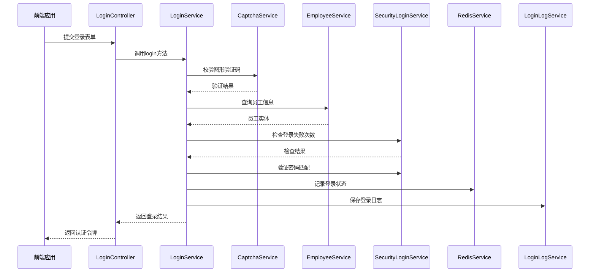
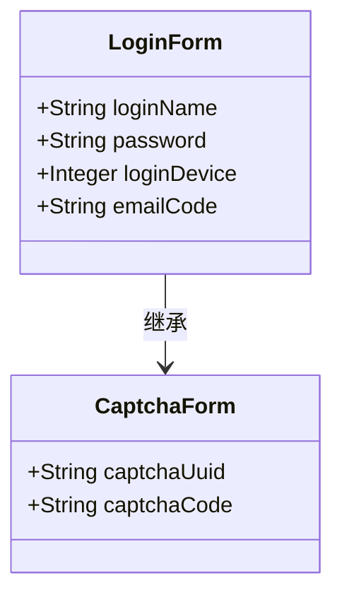
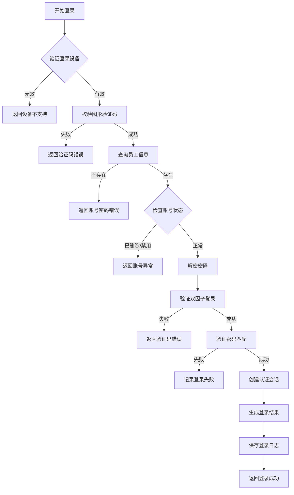
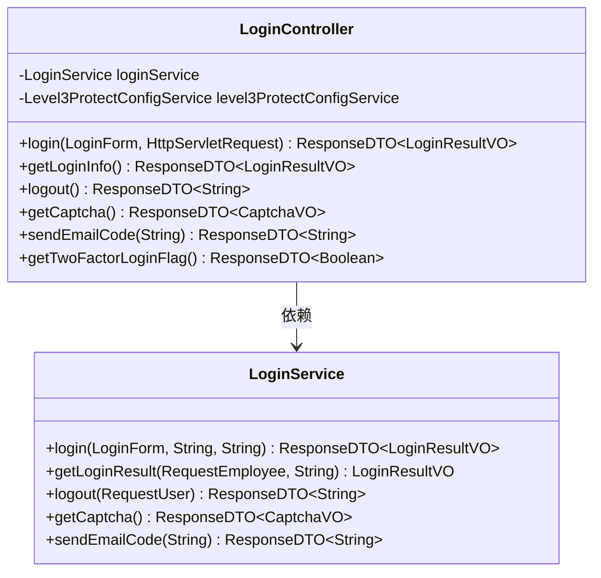
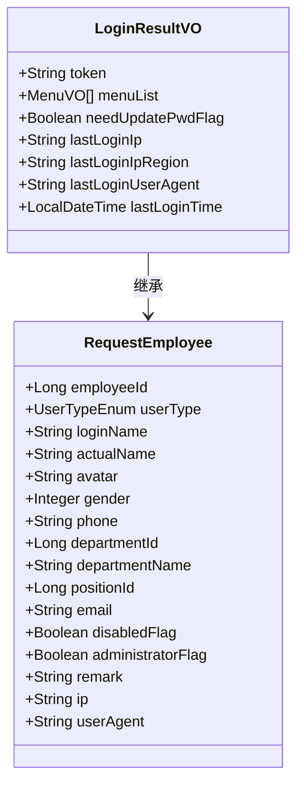
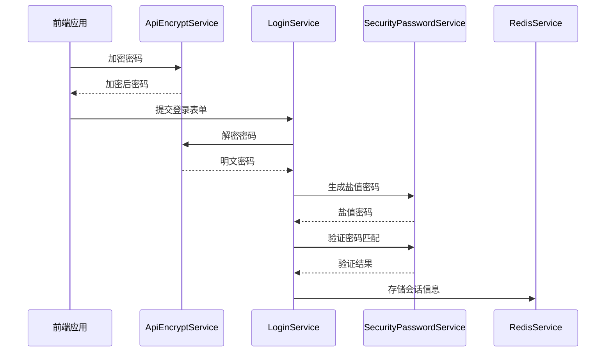
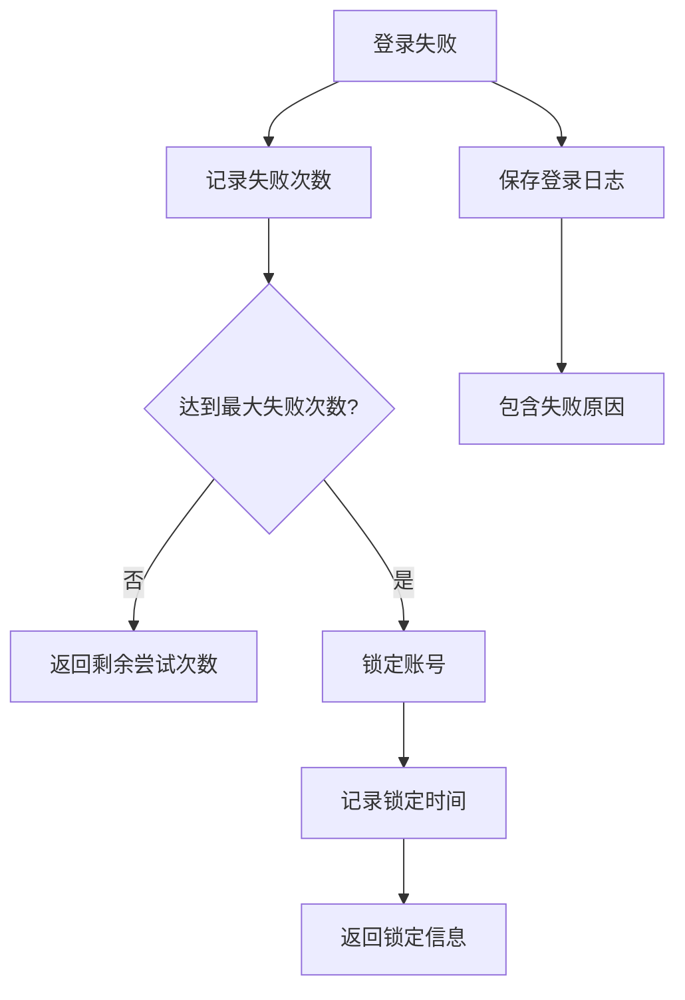

# 登录流程

<cite>
**本文档引用的文件**  
- [LoginController.java](file://smart-admin-api-java17-springboot3\sa-admin\src\main\java\net\lab1024\sa\admin\module\system\login\controller\LoginController.java)
- [LoginService.java](file://smart-admin-api-java17-springboot3\sa-admin\src\main\java\net\lab1024\sa\admin\module\system\login\service\LoginService.java)
- [LoginForm.java](file://smart-admin-api-java17-springboot3\sa-admin\src\main\java\net\lab1024\sa\admin\module\system\login\domain\LoginForm.java)
- [LoginResultVO.java](file://smart-admin-api-java17-springboot3\sa-admin\src\main\java\net\lab1024\sa\admin\module\system\login\domain\LoginResultVO.java)
- [LoginManager.java](file://smart-admin-api-java17-springboot3\sa-admin\src\main\java\net\lab1024\sa\admin\module\system\login\manager\LoginManager.java)
- [CaptchaService.java](file://smart-admin-api-java17-springboot3\sa-base\src\main\java\net\lab1024\sa\base\module\support\captcha\CaptchaService.java)
- [SecurityLoginService.java](file://smart-admin-api-java17-springboot3\sa-base\src\main\java\net\lab1024\sa\base\module\support\securityprotect\service\SecurityLoginService.java)
- [SecurityPasswordService.java](file://smart-admin-api-java17-springboot3\sa-base\src\main\java\net\lab1024\sa\base\module\support\securityprotect\service\SecurityPasswordService.java)
- [ApiEncryptService.java](file://smart-admin-api-java17-springboot3\sa-base\src\main\java\net\lab1024\sa\base\module\support\apiencrypt\service\ApiEncryptService.java)
</cite>

## 目录
1. [登录流程概述](#登录流程概述)
2. [登录表单验证](#登录表单验证)
3. [登录服务处理逻辑](#登录服务处理逻辑)
4. [登录控制器协调机制](#登录控制器协调机制)
5. [登录结果构建](#登录结果构建)
6. [密码加密与安全验证](#密码加密与安全验证)
7. [登录接口调用示例](#登录接口调用示例)
8. [登录失败处理](#登录失败处理)

## 登录流程概述

系统登录流程从用户提交登录表单开始，经过多层验证和处理，最终返回认证令牌。整个流程涉及多个核心组件：`LoginForm`负责接收和验证用户输入，`LoginService`处理核心认证逻辑，`LoginController`协调各组件完成登录操作。该流程实现了完整的身份验证、安全保护和会话管理机制。



**图示来源**
- [LoginController.java](file://smart-admin-api-java17-springboot3\sa-admin\src\main\java\net\lab1024\sa\admin\module\system\login\controller\LoginController.java#L42-L49)
- [LoginService.java](file://smart-admin-api-java17-springboot3\sa-admin\src\main\java\net\lab1024\sa\admin\module\system\login\service\LoginService.java#L128-L225)

## 登录表单验证

`LoginForm`类定义了用户登录所需的输入字段和验证规则。该表单继承自`CaptchaForm`，包含了图形验证码的验证功能。主要字段包括登录账号、密码、登录设备和邮箱验证码。

表单验证采用Java Bean Validation注解实现，确保输入数据的完整性和正确性：
- `loginName`：登录账号，不能为空，长度不超过30字符
- `password`：密码，不能为空
- `loginDevice`：登录设备，必须是系统支持的设备类型
- `emailCode`：邮箱验证码，用于双因子认证



**图示来源**
- [LoginForm.java](file://smart-admin-api-java17-springboot3\sa-admin\src\main\java\net\lab1024\sa\admin\module\system\login\domain\LoginForm.java#L21-L40)

**本节来源**
- [LoginForm.java](file://smart-admin-api-java17-springboot3\sa-admin\src\main\java\net\lab1024\sa\admin\module\system\login\domain\LoginForm.java#L21-L40)

## 登录服务处理逻辑

`LoginService`是登录流程的核心处理组件，负责协调各个服务完成认证过程。其主要职责包括：
1. 验证登录设备类型
2. 校验图形验证码
3. 查询员工信息
4. 验证账号状态
5. 解密前端密码
6. 验证双因子登录
7. 创建认证会话
8. 生成登录结果

登录服务通过依赖注入的方式整合了多个辅助服务，包括验证码服务、配置服务、登录日志服务、角色服务等，实现了模块化的设计。



**图示来源**
- [LoginService.java](file://smart-admin-api-java17-springboot3\sa-admin\src\main\java\net\lab1024\sa\admin\module\system\login\service\LoginService.java#L128-L225)

**本节来源**
- [LoginService.java](file://smart-admin-api-java17-springboot3\sa-admin\src\main\java\net\lab1024\sa\admin\module\system\login\service\LoginService.java#L128-L225)

## 登录控制器协调机制

`LoginController`作为登录流程的入口点，负责接收HTTP请求并协调`LoginService`完成登录操作。该控制器使用Spring MVC注解配置RESTful接口，支持JSON格式的数据交换。

控制器的主要方法包括：
- `login`：处理登录请求
- `getLoginInfo`：获取当前登录信息
- `logout`：处理登出请求
- `getCaptcha`：获取图形验证码
- `sendEmailCode`：发送邮箱验证码

控制器通过`@NoNeedLogin`注解标识无需登录即可访问的接口，确保登录流程的可用性。



**图示来源**
- [LoginController.java](file://smart-admin-api-java17-springboot3\sa-admin\src\main\java\net\lab1024\sa\admin\module\system\login\controller\LoginController.java#L32-L89)

**本节来源**
- [LoginController.java](file://smart-admin-api-java17-springboot3\sa-admin\src\main\java\net\lab1024\sa\admin\module\system\login\controller\LoginController.java#L32-L89)

## 登录结果构建

登录成功后，系统通过`LoginResultVO`对象封装认证结果，包含令牌、用户信息和权限数据。`LoginManager`负责加载用户权限信息，确保返回完整的登录结果。

`LoginResultVO`继承自`RequestEmployee`，包含了以下信息：
- 基础用户信息（员工ID、姓名、头像等）
- 令牌信息
- 菜单权限列表
- 密码更新提示
- 上次登录信息



**图示来源**
- [LoginResultVO.java](file://smart-admin-api-java17-springboot3\sa-admin\src\main\java\net\lab1024\sa\admin\module\system\login\domain\LoginResultVO.java#L20-L45)
- [RequestEmployee.java](file://smart-admin-api-java17-springboot3\sa-admin\src\main\java\net\lab1024\sa\admin\module\system\login\domain\RequestEmployee.java#L21-L82)

**本节来源**
- [LoginResultVO.java](file://smart-admin-api-java17-springboot3\sa-admin\src\main\java\net\lab1024\sa\admin\module\system\login\domain\LoginResultVO.java#L20-L45)
- [LoginManager.java](file://smart-admin-api-java17-springboot3\sa-admin\src\main\java\net\lab1024\sa\admin\module\system\login\manager\LoginManager.java#L66-L174)

## 密码加密与安全验证

系统采用多层次的安全机制保护用户密码和登录过程。密码处理采用Argon2算法进行加密存储，前端传输的密码经过API加密服务处理，确保传输安全。

安全验证机制包括：
- 图形验证码验证
- 双因子认证（邮箱验证码）
- 登录失败次数限制
- 账号锁定机制
- 密码复杂度要求



**图示来源**
- [LoginService.java](file://smart-admin-api-java17-springboot3\sa-admin\src\main\java\net\lab1024\sa\admin\module\system\login\service\LoginService.java#L158-L194)
- [SecurityPasswordService.java](file://smart-admin-api-java17-springboot3\sa-base\src\main\java\net\lab1024\sa\base\module\support\securityprotect\service\SecurityPasswordService.java#L142-L157)
- [ApiEncryptService.java](file://smart-admin-api-java17-springboot3\sa-base\src\main\java\net\lab1024\sa\base\module\support\apiencrypt\service\ApiEncryptService.java)

**本节来源**
- [LoginService.java](file://smart-admin-api-java17-springboot3\sa-admin\src\main\java\net\lab1024\sa\admin\module\system\login\service\LoginService.java#L158-L194)
- [SecurityPasswordService.java](file://smart-admin-api-java17-springboot3\sa-base\src\main\java\net\lab1024\sa\base\module\support\securityprotect\service\SecurityPasswordService.java#L142-L157)
- [ApiEncryptService.java](file://smart-admin-api-java17-springboot3\sa-base\src\main\java\net\lab1024\sa\base\module\support\apiencrypt\service\ApiEncryptService.java)

## 登录接口调用示例

### 请求示例
```json
POST /login
Content-Type: application/json

{
  "loginName": "admin",
  "password": "encrypted_password",
  "loginDevice": 1,
  "captchaUuid": "uuid_value",
  "captchaCode": "1234"
}
```

### 成功响应
```json
{
  "code": 0,
  "ok": true,
  "data": {
    "token": "sa_token_value",
    "employeeId": 1,
    "loginName": "admin",
    "actualName": "管理员",
    "avatar": "http://example.com/avatar.jpg",
    "departmentName": "系统管理部",
    "menuList": [
      {
        "menuId": 1,
        "menuName": "系统管理",
        "perms": "system:manage",
        "children": []
      }
    ],
    "needUpdatePwdFlag": false,
    "lastLoginIp": "192.168.1.1",
    "lastLoginIpRegion": "中国",
    "lastLoginTime": "2025-05-03T22:56:34"
  }
}
```

### 响应格式说明
- `code`：响应码，0表示成功
- `ok`：布尔值，表示请求是否成功
- `data`：包含登录结果信息
  - `token`：认证令牌，用于后续请求的身份验证
  - 用户基本信息
  - `menuList`：用户可访问的菜单列表
  - `needUpdatePwdFlag`：是否需要修改密码
  - 上次登录相关信息

**本节来源**
- [LoginController.java](file://smart-admin-api-java17-springboot3\sa-admin\src\main\java\net\lab1024\sa\admin\module\system\login\controller\LoginController.java#L42-L49)
- [LoginService.java](file://smart-admin-api-java17-springboot3\sa-admin\src\main\java\net\lab1024\sa\admin\module\system\login\service\LoginService.java#L128-L225)

## 登录失败处理

系统实现了完善的登录失败处理机制，包括错误码返回和安全保护措施。当登录失败时，系统会根据失败原因返回相应的错误信息。

### 错误码处理
- `PARAM_ERROR`：参数错误，如验证码错误
- `LOGIN_FAIL_WILL_LOCK`：登录失败，即将锁定账号
- `LOGIN_FAIL_LOCK`：账号已锁定

### 安全保护机制
1. **登录失败计数**：记录连续登录失败次数
2. **账号锁定**：达到最大失败次数后锁定账号
3. **解锁时间**：显示账号解锁时间
4. **日志记录**：记录所有登录尝试



**图示来源**
- [SecurityLoginService.java](file://smart-admin-api-java17-springboot3\sa-base\src\main\java\net\lab1024\sa\base\module\support\securityprotect\service\SecurityLoginService.java#L52-L83)
- [LoginService.java](file://smart-admin-api-java17-springboot3\sa-admin\src\main\java\net\lab1024\sa\admin\module\system\login\service\LoginService.java#L182-L194)

**本节来源**
- [SecurityLoginService.java](file://smart-admin-api-java17-springboot3\sa-base\src\main\java\net\lab1024\sa\base\module\support\securityprotect\service\SecurityLoginService.java#L52-L83)
- [LoginService.java](file://smart-admin-api-java17-springboot3\sa-admin\src\main\java\net\lab1024\sa\admin\module\system\login\service\LoginService.java#L182-L194)