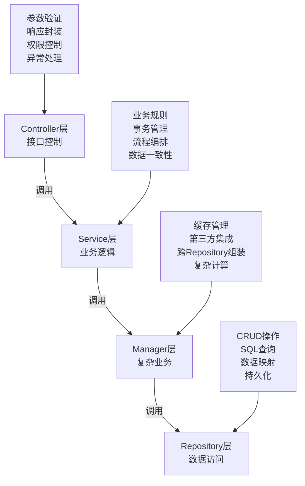
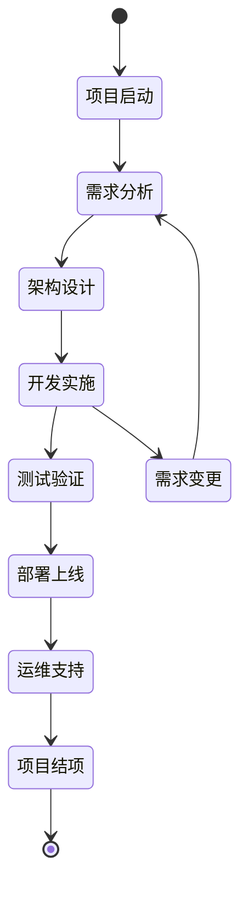
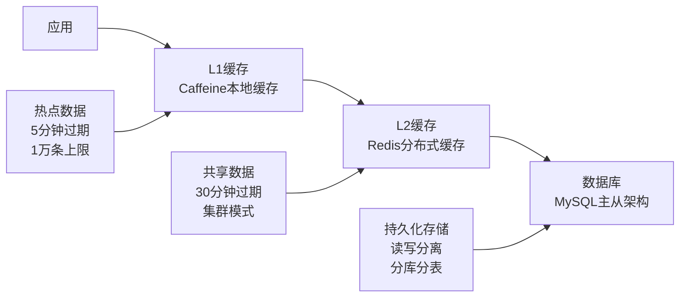

# 架构设计规范

> **版本**: v1.0
> **更新时间**: 2025-11-13
> **分类**: 开发规范体系 > 核心规范
> **标签**: ["架构", "四层架构", "微服务", "数据库设计", "缓存架构"]
> **作者**: SmartAdmin规范治理委员会
> **描述**: IOE-DREAM智慧园区一卡通管理平台的权威架构规范文档，整合了SmartAdmin v1-v4版本精华内容

## 📋 文档概述

本文档是IOE-DREAM智慧园区一卡通管理平台项目的唯一架构规范权威来源，整合了SmartAdmin v1项目管理精华、v2实践经验和v3架构优势。为所有开发团队提供统一、权威、专业的架构设计指导。

**🔗 引用关系**: 本文档被AI开发指令集、测试实施指南、安全规范等文档引用。

## ⚠️ 必须遵守的铁律

### 🏗️ 架构约束（不可违反）

```markdown
✅ 1. 四层架构 - 严格遵循 Controller → Service → Manager → Repository
✅ 2. 依赖方向 - 上层依赖下层，禁止反向依赖
✅ 3. 微服务边界 - 按业务领域拆分，禁止跨服务数据库访问
✅ 4. 技术栈统一 - 严禁使用未批准的技术组件
✅ 5. 项目管理 - 遵循完整的项目生命周期管理流程
❌ 禁止跨层直接访问（如Controller直接访问Repository）
❌ 禁止Service层直接访问数据库
❌ 禁止违反依赖倒置原则
❌ 禁止跳过项目管理流程直接开发
```

### 🎯 四层架构详细规范



### 📋 各层职责规范

#### 🔹 Controller层职责
```markdown
✅ 接收HTTP请求，参数验证
✅ 调用Service层业务逻辑
✅ 封装统一响应格式
✅ 权限控制和异常处理
✅ 接口文档和API版本管理
❌ 禁止包含复杂业务逻辑
❌ 禁止直接访问数据库
❌ 禁止包含事务管理
❌ 禁止直接调用第三方服务
```

#### 🔹 Service层职责
```markdown
✅ 核心业务逻辑处理
✅ 事务管理和数据一致性
✅ 调用Manager层处理复杂业务
✅ 业务规则验证和流程编排
✅ 业务事件发布和监听
❌ 禁止直接访问Repository层
❌ 禁止包含缓存管理逻辑
❌ 禁止直接处理HTTP请求
❌ 禁止包含数据转换逻辑
```

#### 🔹 Manager层职责
```markdown
✅ 复杂业务逻辑处理
✅ 缓存管理和一致性保证
✅ 第三方服务集成
✅ 跨Repository数据组装
✅ 复杂计算和业务规则
❌ 禁止直接处理HTTP请求
❌ 禁止包含事务管理逻辑
❌ 禁止直接操作数据库
❌ 禁止包含业务流程编排
```

#### 🔹 Repository层职责
```markdown
✅ 数据库CRUD操作
✅ SQL查询和映射
✅ 数据持久化操作
✅ 数据访问封装
✅ 数据库连接管理
❌ 禁止包含业务逻辑
❌ 禁止直接调用其他Repository
❌ 禁止包含事务管理
❌ 禁止包含缓存逻辑
```

## 🏗️ 项目管理架构规范

### 🔄 项目生命周期管理

#### 项目阶段划分


#### 各阶段架构活动
```markdown
🚀 项目启动阶段 (1-2周)
├── 技术可行性评估
├── 架构团队组建
├── 技术栈选型和确认
├── 架构原则制定
└── 技术风险评估

🏗️ 架构设计阶段 (1-3周)
├── 系统架构设计
├── 微服务拆分设计
├── 数据库架构设计
├── 接口架构设计
├── 部署架构设计
└── 架构评审和确认

💻 开发实施阶段 (根据项目规模)
├── 架构实现和验证
├── 技术难点解决
├── 架构优化调整
├── 代码架构审查
└── 架构文档更新

🚀 部署上线阶段 (1-2周)
├── 部署架构验证
├── 性能架构调优
├── 监控架构建立
├── 运维架构交接
└── 架构总结和优化
```

### 👥 架构团队组织

#### 架构角色定义
```markdown
🏗️ 架构师 (1名)
├── 系统架构设计和决策
├── 技术栈选型和标准制定
├── 架构原则和规范制定
├── 技术难点解决指导
└── 架构质量把控

💻 技术负责人 (1名)
├── 架构方案实现
├── 技术团队指导
├── 代码架构审查
├── 架构问题解决
└── 架构优化建议

🔧 开发工程师 (3-8名)
├── 按架构规范开发
├── 架构实现和反馈
├── 技术问题收集
├── 架构优化建议
└── 代码质量保证
```

## 🗄️ 数据库架构规范

### 数据库设计规范
```markdown
✅ 表命名：t_{business}_{entity}（示例：t_user_info）
✅ 字段命名：下划线分隔（示例：user_name, create_time）
✅ 主键设计：统一使用 bigint 自增主键 {entity}Id（示例：userId）
✅ 审计字段：必须包含 create_time, update_time, deleted_flag
✅ 软删除：使用 deleted_flag 字段（0-正常，1-删除），禁止物理删除
✅ 字符集：统一使用 utf8mb4，支持表情符号
✅ 存储引擎：统一使用 InnoDB，支持事务和外键
❌ 禁止使用拼音或不规范命名
❌ 禁止缺少必要审计字段
❌ 禁止使用物理删除
❌ 禁止使用不同存储引擎
```

### 标准表结构模板
```sql
CREATE TABLE `t_{business}_{entity}` (
  `{entity}Id` bigint(20) NOT NULL AUTO_INCREMENT COMMENT '{实体}ID',
  `{field_name}` {field_type} COMMENT '{字段描述}',
  `create_time` datetime NOT NULL DEFAULT CURRENT_TIMESTAMP COMMENT '创建时间',
  `update_time` datetime NOT NULL DEFAULT CURRENT_TIMESTAMP ON UPDATE CURRENT_TIMESTAMP COMMENT '更新时间',
  `deleted_flag` tinyint(1) NOT NULL DEFAULT '0' COMMENT '删除标记 0-正常 1-删除',
  `create_user_id` bigint(20) DEFAULT NULL COMMENT '创建人ID',
  `update_user_id` bigint(20) DEFAULT NULL COMMENT '更新人ID',
  `version` int(11) NOT NULL DEFAULT '0' COMMENT '版本号（乐观锁）',
  PRIMARY KEY (`{entity}Id`),
  KEY `idx_create_time` (`create_time`),
  KEY `idx_update_time` (`update_time`),
  KEY `idx_create_user_id` (`create_user_id`),
  KEY `idx_{business}_{field_name}` (`{field_name}`)
) ENGINE=InnoDB DEFAULT CHARSET=utf8mb4 COLLATE=utf8mb4_unicode_ci COMMENT='{实体表}';
```

### 数据库性能规范
```markdown
✅ 单表数据量不超过1000万行（超过则分表）
✅ 索引数量不超过5个（主键和必要索引除外）
✅ 单行数据大小不超过64KB
✅ 查询响应时间不超过100ms
✅ 索引选择性不低于0.8
✅ 避免大事务，单个事务不超过30秒
✅ 批量操作每批不超过1000条记录
❌ 禁止全表扫描查询
❌ 禁止缺少必要索引
❌ 禁止SELECT * 查询
❌ 禁止在WHERE子句中使用函数
```

## 🔄 事务管理规范

### 事务边界规范
```markdown
✅ 事务边界在Service层，使用@Transactional注解
✅ Manager层不管理事务，由Service层统一控制
✅ Repository层不包含事务逻辑
✅ 只读操作使用@Transactional(readOnly = true)
✅ 长时间操作使用异步事务
✅ 分布式事务使用最终一致性方案
❌ 禁止在Controller层管理事务
❌ 禁止在Manager层使用事务注解
❌ 禁止在Repository层使用事务
❌ 禁止嵌套事务使用
```

### 事务使用模板
```java
@Service
@Slf4j
public class UserService {

    /**
     * 标准事务处理模式 - 添加操作
     */
    @Transactional(rollbackFor = Exception.class)
    public ResponseDTO<String> addUser(UserAddForm addForm) {
        try {
            // 1. 参数验证
            this.validateAddForm(addForm);

            // 2. 业务逻辑处理
            UserEntity entity = this.buildUserEntity(addForm);
            userDao.insert(entity);

            // 3. 发布业务事件（事务内）
            eventPublisher.publishEvent(new UserCreatedEvent(entity));

            return ResponseDTO.ok(entity.getUserId());

        } catch (Exception e) {
            // 事务自动回滚
            log.error("添加用户失败, param: {}", addForm, e);
            throw new BusinessException("USER_ADD_ERROR", "添加用户失败");
        }
    }

    /**
     * 标准事务处理模式 - 更新操作
     */
    @Transactional(rollbackFor = Exception.class)
    public ResponseDTO<String> updateUser(UserUpdateForm updateForm) {
        try {
            // 1. 业务逻辑处理
            this.updateUserLogic(updateForm);

            // 2. 发布业务事件（事务内）
            eventPublisher.publishEvent(new UserUpdatedEvent(updateForm.getUserId()));

            return ResponseDTO.ok();

        } catch (Exception e) {
            // 事务自动回滚
            log.error("更新用户失败, param: {}", updateForm, e);
            throw new BusinessException("USER_UPDATE_ERROR", "更新用户失败");
        }
    }

    /**
     * 复杂业务操作 - 事务 + 缓存管理
     */
    @Transactional(rollbackFor = Exception.class)
    public ResponseDTO<String> complexBusinessOperation(BusinessForm form) {
        try {
            // 1. 核心业务逻辑（事务内）
            this.processCoreBusiness(form);

            // 2. 业务事件发布（事务内）
            eventPublisher.publishEvent(new BusinessCompletedEvent(form));

            return ResponseDTO.ok();

        } catch (Exception e) {
            log.error("复杂业务操作失败, param: {}", form, e);
            throw new BusinessException("BUSINESS_ERROR", "业务操作失败");
        }
        // 注意：缓存清理在事件监听器中异步执行
    }

    /**
     * 只读事务
     */
    @Transactional(readOnly = true)
    public UserVO getUserDetail(Long userId) {
        UserEntity entity = userDao.selectById(userId);
        if (entity == null) {
            throw new BusinessException("USER_NOT_FOUND", "用户不存在", userId);
        }
        return UserConverter.toVO(entity);
    }
}

/**
 * 业务事件监听器 - 异步处理缓存清理等操作
 */
@Component
@Slf4j
public class UserEventHandler {

    @EventListener
    @Async("cacheExecutor")
    public void handleUserCreated(UserCreatedEvent event) {
        try {
            // 异步清理相关缓存
            userManager.clearUserCache(event.getUserId());
            log.info("用户创建事件处理完成, userId: {}", event.getUserId());
        } catch (Exception e) {
            log.error("用户创建事件处理失败", e);
            // 缓存清理失败不影响主业务
        }
    }
}
```

## 🎯 缓存架构规范

### 多级缓存架构设计



### 缓存使用规范
```markdown
✅ L1缓存：使用Caffeine，存储热点数据，5分钟过期
✅ L2缓存：使用Redis，存储共享数据，30分钟过期
✅ 缓存更新：使用Cache Aside模式，先更新数据库，再删除缓存
✅ 缓存一致性：通过双删策略和版本号保证一致性
✅ 缓存预热：系统启动时预热热点数据
✅ 缓存监控：监控缓存命中率和响应时间
❌ 禁止缓存雪崩和穿透
❌ 禁止缓存数据不一致
❌ 禁止大对象缓存（超过1MB）
❌ 禁止缓存时间设置过长
```

### Manager层缓存管理模板
```java
@Component
@Slf4j
public class UserManager {

    @Resource
    private RedisTemplate<String, Object> redisTemplate;

    @Resource
    private UserDao userDao;

    // L1本地缓存配置
    private final Cache<String, Object> localCache = Caffeine.newBuilder()
        .maximumSize(10_000)
        .expireAfterWrite(5, TimeUnit.MINUTES)
        .recordStats()
        .build();

    // 缓存键常量
    private static final String CACHE_PREFIX = "user:";
    private static final String INFO_SUFFIX = ":info";
    private static final String LIST_SUFFIX = ":list";

    /**
     * 获取用户信息（多级缓存）
     */
    public UserVO getUser(Long userId) {
        if (userId == null) {
            return null;
        }

        String cacheKey = buildCacheKey(userId, INFO_SUFFIX);

        // 1. 先查L1本地缓存
        UserVO user = (UserVO) localCache.getIfPresent(cacheKey);
        if (user != null) {
            log.debug("L1缓存命中, userId: {}", userId);
            return user;
        }

        // 2. 查L2 Redis缓存
        try {
            user = (UserVO) redisTemplate.opsForValue().get(cacheKey);
            if (user != null) {
                // 回写L1缓存
                localCache.put(cacheKey, user);
                log.debug("L2缓存命中, userId: {}", userId);
                return user;
            }
        } catch (Exception e) {
            log.warn("Redis访问异常, userId: {}", userId, e);
        }

        // 3. 查数据库
        UserEntity entity = userDao.selectById(userId);
        if (entity != null) {
            user = SmartBeanUtil.copy(entity, UserVO.class);

            // 4. 写入缓存（异步）
            this.setCacheAsync(cacheKey, user);
        }

        return user;
    }

    /**
     * 清除用户缓存（双删策略）
     */
    @Async("cacheExecutor")
    public void removeUserCache(Long userId) {
        String cacheKey = buildCacheKey(userId, INFO_SUFFIX);

        try {
            // 第一次删除缓存
            localCache.invalidate(cacheKey);
            redisTemplate.delete(cacheKey);

            // 延迟500ms后再次删除（防止双写问题）
            Thread.sleep(500);
            localCache.invalidate(cacheKey);
            redisTemplate.delete(cacheKey);

            log.info("用户缓存清除完成, userId: {}", userId);
        } catch (Exception e) {
            log.error("清除用户缓存失败, userId: {}", userId, e);
        }
    }

    // 私有方法
    private String buildCacheKey(Long userId, String suffix) {
        return CACHE_PREFIX + userId + suffix;
    }

    @Async("cacheExecutor")
    private void setCacheAsync(String key, Object value) {
        try {
            localCache.put(key, value);
            redisTemplate.opsForValue().set(key, value, 30, TimeUnit.MINUTES);
        } catch (Exception e) {
            log.warn("缓存设置失败, key: {}", key, e);
        }
    }
}
```

## 🚀 微服务架构规范

### 微服务拆分原则
```markdown
✅ 按业务领域拆分（DDD原则）
✅ 服务高内聚低耦合
✅ 数据库独立，禁止跨服务数据库访问
✅ 服务间通信通过REST API或消息队列
✅ 支持独立部署和扩缩容
✅ 服务自治，独立开发和运维
❌ 禁止服务间循环依赖
❌ 禁止共享数据库
❌ 禁止分布式事务（最终一致性）
❌ 禁止服务间紧耦合
```

### 微服务技术栈（必须使用）
```markdown
✅ 服务注册发现：Nacos 2.3+
✅ 配置管理：Nacos Config
✅ 服务网关：Spring Cloud Gateway
✅ 负载均衡：Spring Cloud LoadBalancer
✅ 熔断降级：Sentinel
✅ 链路追踪：Micrometer Tracing + Zipkin
✅ 消息队列：RocketMQ 5.0+
✅ 分布式缓存：Redis Cluster
```

### 服务间通信规范
```markdown
✅ 同步调用：使用OpenFeign + REST API
✅ 异步通信：使用RocketMQ消息队列
✅ 数据一致性：使用最终一致性方案
✅ 超时控制：设置合理的超时时间（连接5s，读取30s）
✅ 重试机制：实现幂等性设计，最多重试3次
✅ 熔断降级：失败率超过50%时熔断
✅ 服务限流：单服务QPS限制在1000以内
❌ 禁止同步调用中的长事务
❌ 禁止消息丢失和重复消费
❌ 禁止服务间紧耦合
```

## 🔧 技术选型规范

### 后端技术栈（必须使用）
```markdown
✅ 框架：Spring Boot 3.2.5
✅ 微服务：Spring Cloud 2023.0.1
✅ ORM框架：MyBatis Plus 3.5.5
✅ 安全框架：Sa-Token 1.37.0
✅ 缓存：Redis 7.0+
✅ 数据库：MySQL 8.0+
✅ 消息队列：RocketMQ 5.0+
✅ 服务治理：Nacos 2.3+
✅ 容器化：Docker + Kubernetes
✅ 监控：Prometheus + Grafana
```

### 开发工具（推荐使用）
```markdown
✅ IDE：IntelliJ IDEA 2024.1+
✅ 构建工具：Maven 3.9+
✅ 代码质量：SonarQube
✅ API文档：Swagger 3.0 / OpenAPI
✅ 版本控制：Git + GitLab
✅ CI/CD：GitLab CI + Docker
✅ 日志收集：ELK Stack
✅ 链路追踪：Zipkin / Jaeger
```

## 📊 质量标准（权威指标）

### 性能指标
```markdown
✅ 接口响应时间：P95 ≤ 200ms，P99 ≤ 500ms
✅ 数据库查询时间：单次 ≤ 100ms，批量 ≤ 500ms
✅ 缓存命中率：L1缓存 ≥ 80%，L2缓存 ≥ 90%
✅ 系统可用性：≥ 99.9%（年停机时间 ≤ 8.76小时）
✅ 并发处理能力：支持1000+ QPS
✅ CPU使用率：平均 ≤ 70%，峰值 ≤ 85%
✅ 内存使用率：平均 ≤ 70%，峰值 ≤ 85%
❌ 禁止性能不达标的代码上线
```

### 扩展性要求
```markdown
✅ 服务扩展：支持水平扩容，无状态设计
✅ 数据库扩展：支持读写分离和分表分库
✅ 缓存扩展：支持Redis集群和分布式缓存
✅ 存储扩展：支持对象存储和文件分离
✅ 监控扩展：支持自定义指标和告警
✅ 功能扩展：支持插件化和模块化架构
```

### 可靠性标准
```markdown
✅ 错误率：≤ 0.1%（1000次请求最多1次失败）
✅ 故障恢复时间：MTTR ≤ 30分钟
✅ 数据备份：每日全量备份，实时增量备份
✅ 灾难恢复：RTO ≤ 4小时，RPO ≤ 1小时
✅ 安全漏洞：高危漏洞24小时内修复
✅ 监控告警：故障发现时间 ≤ 5分钟
```

## 🚫 禁止模式（严格禁止）

### 架构反模式
```markdown
❌ 循环依赖：A→B→C→A的依赖关系
❌ 跨层访问：Controller直接访问Repository
❌ 紧耦合：模块间高度依赖，难以独立测试
❌ 单体滥用：简单业务使用微服务架构
❌ 技术栈混乱：同一项目使用多种冲突技术
❌ 数据库混乱：多个服务共享数据库
❌ 事务滥用：分布式事务使用不当
```

### 数据反模式
```markdown
❌ 大表设计：单表超过1000万行不进行分表
❌ 缺乏索引：高频查询字段缺少索引
❌ N+1查询：循环查询导致性能问题
❌ 缓存穿透：查询不存在数据绕过缓存
❌ 大事务：单个事务包含过多操作
❌ 数据不一致：缓存和数据库数据不一致
❌ SQL注入：不使用参数化查询
```

### 代码反模式
```markdown
❌ 上帝类：单个类职责过多，代码行数过多
❌ 深度嵌套：if-else嵌套层级过深
❌ 重复代码：相同逻辑在多处重复实现
❌ 硬编码：配置和常量直接写在代码中
❌ 异常忽略：捕获异常但不处理
❌ 资源泄露：数据库连接、文件句柄未正确关闭
❌ 线程不安全：多线程环境下数据竞争
```

## 📋 架构审查检查清单

### 设计阶段检查
```markdown
□ 架构图是否清晰完整？
□ 服务边界是否合理？
□ 数据模型是否规范？
□ 接口设计是否RESTful？
□ 安全设计是否充分？
□ 性能设计是否达标？
□ 扩展性是否考虑？
□ 技术选型是否合理？
□ 架构原则是否遵循？
□ 项目管理流程是否明确？
```

### 实现阶段检查
```markdown
□ 是否遵循四层架构？
□ 依赖方向是否正确？
□ 事务边界是否合理？
□ 缓存使用是否规范？
□ 异常处理是否完善？
□ 日志记录是否规范？
□ 代码质量是否达标？
□ 测试覆盖是否充分？
□ 性能指标是否达标？
□ 架构决策是否记录？
```

### 部署阶段检查
```markdown
□ 技术栈是否符合规范？
□ 组件版本是否兼容？
□ 配置管理是否规范？
□ 监控告警是否完善？
□ 性能指标是否达标？
□ 安全配置是否正确？
□ 运维支持是否到位？
□ 架构文档是否更新？
□ 部署流程是否自动化？
□ 应急预案是否完备？
```

## 🔗 相关文档

### 权威规范文档
- [Java编码标准](./Java编码规范.md) - 编码标准规范
- [RESTfulAPI设计规范](./RESTfulAPI设计规范.md) - API接口设计规范
- [系统安全规范](./系统安全规范.md) - 安全相关规范
- [数据库设计规范](./数据库设计规范.md) - 数据存储和处理规范

### 实施指南文档
- [开发环境配置](../实施指南/开发环境配置.md) - 环境搭建和配置
- [代码模板库](../实施指南/代码模板库/) - 标准代码模板
- [测试实施指南](../实施指南/测试实施指南.md) - 测试规范和流程

### AI开发支持
- [AI开发指令集](../AI开发支持/AI开发指令集.md) - AI辅助开发指导
- [AI约束检查清单](../AI开发支持/AI约束检查清单.md) - AI代码审查标准

---

## 🎯 核心原则

1. **架构一致性** - 所有模块必须遵循统一架构
2. **技术统一性** - 严格按规范选择技术栈
3. **性能优先** - 性能不达标禁止上线
4. **可扩展性** - 支持业务增长和技术演进
5. **项目管理** - 遵循完整的项目生命周期

## 📋 版本信息

- 本文档整合自SmartAdmin v1、v2、v3、v4版本精华内容
- 整合负责人：SmartAdmin规范治理委员会
- 整合日期：2025-11-13
- 下次评审：2026-02-13

---

**🎯 IOE-DREAM架构设计规范 - 统一、权威、专业的企业级架构指导**