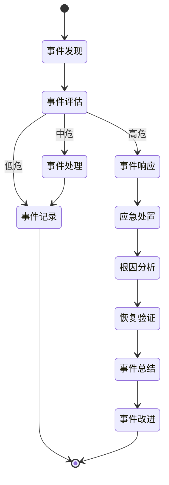

# 系统安全规范

> **版本**: v1.0
> **更新时间**: 2025-11-13
> **分类**: 开发规范体系 > 核心规范
> **标签**: ["安全规范", "Sa-Token", "认证授权", "数据加密", "安全审计", "三级等保"]
> **作者**: SmartAdmin规范治理委员会
> **描述**: IOE-DREAM智慧园区一卡通管理平台的安全规范，基于Sa-Token 1.44.0，满足三级等保要求

## 📋 文档概述

本文档是IOE-DREAM智慧园区一卡通管理平台项目的唯一安全规范权威来源，基于Sa-Token 1.44.0，满足网络安全等级保护三级（等保三级）要求，为所有开发团队提供统一、权威、专业的安全指导。

## ⚠️ 安全铁律（不可违反）

### 🚫 绝对禁止
```markdown
❌ 禁止硬编码密码、密钥等敏感信息
❌ 禁止在日志中输出敏感信息
❌ 禁止明文传输敏感数据
❌ 禁止SQL注入漏洞
❌ 禁止XSS跨站脚本攻击
❌ 禁止CSRF跨站请求伪造
❌ 禁止未经授权的访问
❌ 禁止使用已知漏洞的依赖库
❌ 禁止绕过Sa-Token权限检查
❌ 禁止在Controller中直接操作权限逻辑
```

### ✅ 必须执行
```markdown
✅ 所有用户输入必须验证和过滤
✅ 所有敏感数据必须加密存储
✅ 所有API必须有权限控制
✅ 所有操作必须有审计日志
✅ 所有密码必须使用强加密算法
✅ 所有通信必须使用HTTPS
✅ 定期进行安全漏洞扫描
✅ 建立安全事件响应机制
✅ 必须使用Sa-Token进行认证授权
✅ 必须使用Sa-Token注解进行权限控制
```

## 🔐 Sa-Token认证授权规范

### 身份认证
```markdown
✅ 使用Sa-Token进行身份认证
✅ 密码使用BCrypt加密存储
✅ 实现登录失败锁定机制
✅ 支持强制用户修改初始密码
✅ 实现会话超时控制
✅ 支持用户注销和会话失效
✅ 支持多端登录控制
✅ 实现记住登录状态功能
```

### 权限控制
```markdown
✅ 使用Sa-Token的@SaCheckPermission注解
✅ 实现RBAC（基于角色的访问控制）
✅ 支持细粒度权限控制
✅ 实现数据权限控制
✅ 支持权限动态刷新
✅ 实现临时权限授权
✅ 支持权限继承机制
✅ 实现权限缓存优化
```

## 🛠️ Sa-Token实现模板

### 认证实现
```java
// Sa-Token配置类
@Configuration
public class SaTokenConfig {

    @Bean
    public SaTokenConfig saTokenConfig() {
        return new SaTokenConfig()
                // token名称（同时也是cookie名称）
                .setTokenName("satoken")
                // token有效期，单位s 默认30天, -1代表永不过期
                .setTimeout(30 * 24 * 60 * 60)
                // token临时有效期 (指定时间内无操作就视为token过期) 单位: 秒
                .setActiveTimeout(-1)
                // 是否允许同一账号并发登录 (为true时允许一起登录, 为false时新登录挤掉旧登录)
                .setIsConcurrent(true)
                // 在多人登录同一账号时，是否共用一个token (为true时所有登录共用一个token, 为false时每次登录新建一个token)
                .setIsShare(true)
                // token风格
                .setTokenStyle(TokenStyle.UUID)
                // 是否输出操作日志
                .setIsLog(true);
    }
}

// 登录服务实现
@Service
public class AuthServiceImpl implements AuthService {

    @Resource
    private UserDao userDao;

    @Override
    public String login(LoginForm loginForm) {
        // 1. 参数验证
        SmartValidatorUtil.validate(loginForm);

        // 2. 查询用户
        UserEntity user = userDao.selectByUserName(loginForm.getUserName());
        if (user == null || user.getDeletedFlag()) {
            throw new BusinessException("USER_NOT_FOUND", "用户不存在");
        }

        // 3. 密码验证
        if (!BCrypt.checkpw(loginForm.getPassword(), user.getPassword())) {
            throw new BusinessException("PASSWORD_ERROR", "密码错误");
        }

        // 4. 用户状态检查
        if (user.getStatus() != 1) {
            throw new BusinessException("USER_DISABLED", "用户已被禁用");
        }

        // 5. 登录并获取token
        SaLoginModel loginModel = new SaLoginModel()
                .setUser(user.getUserId())
                .setDevice(loginForm.getDevice())
                .setIsLastingCookie(true);

        String token = StpUtil.login(loginModel);

        // 6. 更新登录信息
        user.setLastLoginTime(LocalDateTime.now());
        user.setLastLoginIp(loginForm.getLoginIp());
        userDao.updateById(user);

        return token;
    }

    @Override
    public void logout() {
        StpUtil.logout();
    }

    @Override
    public void kickout(Long userId) {
        StpUtil.kickout(userId);
    }
}

// 登录Controller
@RestController
@RequestMapping("/api/auth")
@Tag(name = "认证管理")
public class AuthController {

    @Resource
    private authService authService;

    @PostMapping("/login")
    @SaIgnore // 登录接口忽略鉴权
    public ResponseDTO<String> login(@RequestBody @Valid LoginForm loginForm) {
        String token = authService.login(loginForm);
        return ResponseDTO.ok(token);
    }

    @PostMapping("/logout")
    @SaCheckLogin
    public ResponseDTO<String> logout() {
        authService.logout();
        return ResponseDTO.ok();
    }

    @GetMapping("/info")
    @SaCheckLogin
    public ResponseDTO<UserVO> getUserInfo() {
        Long userId = StpUtil.getLoginIdAsLong();
        UserVO userVO = userService.getUserInfo(userId);
        return ResponseDTO.ok(userVO);
    }
}
```

### 权限控制实现
```java
// 权限服务实现
@Service
public class PermissionServiceImpl implements PermissionService {

    @Resource
    private RolePermissionDao rolePermissionDao;

    @Override
    public List<String> getPermissionList(Long userId) {
        // 1. 获取用户角色
        List<Long> roleIds = userRoleDao.selectRoleIdsByUserId(userId);

        // 2. 获取角色权限
        List<String> permissionList = new ArrayList<>();
        for (Long roleId : roleIds) {
            List<String> permissions = rolePermissionDao.selectPermissionCodesByRoleId(roleId);
            permissionList.addAll(permissions);
        }

        // 3. 去重并返回
        return permissionList.stream().distinct().collect(Collectors.toList());
    }

    @Override
    public boolean hasPermission(Long userId, String permission) {
        return getPermissionList(userId).contains(permission);
    }
}

// 权限控制器示例
@RestController
@RequestMapping("/api/user")
@Tag(name = "用户管理")
public class UserController {

    @PostMapping("/add")
    @Operation(summary = "新增用户")
    @SaCheckPermission("user:add")  // 检查具体权限
    @SaCheckRole("admin")           // 检查角色
    @SaCheckSafe                    // 二次认证
    public ResponseDTO<String> add(@RequestBody @Valid UserAddForm addForm) {
        return ResponseDTO.ok(userService.add(addForm));
    }

    @GetMapping("/list")
    @Operation(summary = "查询用户列表")
    @SaCheckLogin                   // 仅检查登录
    public ResponseDTO<List<UserVO>> list() {
        return ResponseDTO.ok(userService.list());
    }
}
```

## 🔒 数据安全规范

### 密码安全
```markdown
✅ 使用BCrypt哈希算法加密密码
✅ 密码长度至少8位，包含大小写字母、数字和特殊字符
✅ 实现密码强度检查
✅ 定期要求用户修改密码
✅ 禁止使用常见弱密码
✅ 实现密码历史记录，禁止重复使用最近N次密码
```

### 敏感数据加密
```java
// 敏感数据加密工具类
@Component
public class DataEncryptUtil {

    @Value("${app.encrypt.key}")
    private String encryptKey;

    /**
     * AES加密敏感数据
     */
    public String encrypt(String plainText) {
        try {
            Cipher cipher = Cipher.getInstance("AES/GCM/NoPadding");
            SecretKeySpec keySpec = new SecretKeySpec(encryptKey.getBytes(), "AES");
            GCMParameterSpec gcmSpec = new GCMParameterSpec(128, encryptKey.getBytes());

            cipher.init(Cipher.ENCRYPT_MODE, keySpec, gcmSpec);
            byte[] encrypted = cipher.doFinal(plainText.getBytes());

            return Base64.getEncoder().encodeToString(encrypted);
        } catch (Exception e) {
            throw new BusinessException("ENCRYPT_ERROR", "数据加密失败");
        }
    }

    /**
     * AES解密敏感数据
     */
    public String decrypt(String encryptedText) {
        try {
            Cipher cipher = Cipher.getInstance("AES/GCM/NoPadding");
            SecretKeySpec keySpec = new SecretKeySpec(encryptKey.getBytes(), "AES");
            GCMParameterSpec gcmSpec = new GCMParameterSpec(128, encryptKey.getBytes());

            cipher.init(Cipher.DECRYPT_MODE, keySpec, gcmSpec);
            byte[] decrypted = cipher.doFinal(Base64.getDecoder().decode(encryptedText));

            return new String(decrypted);
        } catch (Exception e) {
            throw new BusinessException("DECRYPT_ERROR", "数据解密失败");
        }
    }
}

// 敏感数据实体示例
@Data
@TableName("t_user_info")
public class UserEntity extends BaseEntity {

    @TableId(value = "user_id", type = IdType.AUTO)
    private Long userId;

    @TableField("user_name")
    private String userName;

    @TableField("real_name")
    private String realName;

    @TableField("id_card")  // 身份证号加密存储
    @TableField(typeHandler = EncryptTypeHandler.class)
    private String idCard;

    @TableField("phone")    // 手机号加密存储
    @TableField(typeHandler = EncryptTypeHandler.class)
    private String phone;

    @TableField("email")
    private String email;
}
```

## 🛡️ 网络安全规范

### HTTPS配置
```yaml
# application.yml
server:
  port: 443
  ssl:
    enabled: true
    key-store: classpath:keystore.p12
    key-store-password: ${SSL_KEYSTORE_PASSWORD}
    key-store-type: PKCS12
    key-alias: ${SSL_KEY_ALIAS}
  http2:
    enabled: true

# 强制HTTPS重定向
server:
  port: 80
  servlet:
    context-path: /
  tomcat:
    remote-ip-header: X-Forwarded-For
    protocol-header: X-Forwarded-Proto
    port-header: X-Forwarded-Port
    use-relative-redirects: true

# HTTP跳转HTTPS
@Configuration
public class HttpsConfig {

    @Bean
    public ServletWebServerFactory servletContainer() {
        TomcatServletWebServerFactory tomcat = new TomcatServletWebServerFactory() {
            @Override
            protected void postProcessContext(Context context) {
                SecurityConstraint securityConstraint = new SecurityConstraint();
                securityConstraint.setUserConstraint("CONFIDENTIAL");
                SecurityCollection collection = new SecurityCollection();
                collection.addPattern("/*");
                securityConstraint.addCollection(collection);
                context.addConstraint(securityConstraint);
            }
        };
        tomcat.addAdditionalTomcatConnectors(redirectConnector());
        return tomcat;
    }

    private Connector redirectConnector() {
        Connector connector = new Connector("org.apache.coyote.http11.Http11NioProtocol");
        connector.setScheme("http");
        connector.setPort(80);
        connector.setSecure(false);
        connector.setRedirectPort(443);
        return connector;
    }
}
```

### 安全头配置
```java
@Configuration
public class SecurityHeaderConfig implements WebMvcConfigurer {

    @Override
    public void addInterceptors(InterceptorRegistry registry) {
        registry.addInterceptor(new SecurityHeaderInterceptor());
    }

    public static class SecurityHeaderInterceptor implements HandlerInterceptor {

        @Override
        public boolean preHandle(HttpServletRequest request, HttpServletResponse response, Object handler) {
            // 防止点击劫持
            response.setHeader("X-Frame-Options", "DENY");

            // 防止MIME类型嗅探
            response.setHeader("X-Content-Type-Options", "nosniff");

            // XSS保护
            response.setHeader("X-XSS-Protection", "1; mode=block");

            // 严格传输安全
            response.setHeader("Strict-Transport-Security", "max-age=31536000; includeSubDomains");

            // 内容安全策略
            response.setHeader("Content-Security-Policy", "default-src 'self'; script-src 'self' 'unsafe-inline'; style-src 'self' 'unsafe-inline'");

            // 引用者策略
            response.setHeader("Referrer-Policy", "strict-origin-when-cross-origin");

            return true;
        }
    }
}
```

## 🔍 安全审计规范

### 操作日志记录
```java
// 操作日志实体
@Data
@TableName("t_operation_log")
public class OperationLogEntity extends BaseEntity {

    @TableId(value = "log_id", type = IdType.AUTO)
    private Long logId;

    @TableField("user_id")
    private Long userId;

    @TableField("user_name")
    private String userName;

    @TableField("operation_type")
    private String operationType;

    @TableField("operation_desc")
    private String operationDesc;

    @TableField("request_method")
    private String requestMethod;

    @TableField("request_url")
    private String requestUrl;

    @TableField("request_params")
    @TableField(typeHandler = JsonTypeHandler.class)
    private Map<String, Object> requestParams;

    @TableField("ip_address")
    private String ipAddress;

    @TableField("user_agent")
    private String userAgent;

    @TableField("execution_time")
    private Long executionTime;

    @TableField("status")
    private Integer status;

    @TableField("error_message")
    private String errorMessage;
}

// 操作日志切面
@Aspect
@Component
@Slf4j
public class OperationLogAspect {

    @Resource
    private OperationLogService operationLogService;

    @Around("@annotation(operationLog)")
    public Object around(ProceedingJoinPoint joinPoint, OperationLog operationLog) throws Throwable {
        long startTime = System.currentTimeMillis();

        // 获取请求信息
        HttpServletRequest request = ((ServletRequestAttributes) RequestContextHolder.getRequestAttributes()).getRequest();

        OperationLogEntity logEntity = new OperationLogEntity();
        logEntity.setUserId(StpUtil.getLoginIdAsLong());
        logEntity.setUserName(StpUtil.getLoginIdDefaultNull().toString());
        logEntity.setOperationType(operationLog.operationType());
        logEntity.setOperationDesc(operationLog.operationDesc());
        logEntity.setRequestMethod(request.getMethod());
        logEntity.setRequestUrl(request.getRequestURI());
        logEntity.setIpAddress(SmartIpUtil.getIpAddress(request));
        logEntity.setUserAgent(request.getHeader("User-Agent"));

        try {
            // 记录请求参数
            Object[] args = joinPoint.getArgs();
            Map<String, Object> requestParams = new HashMap<>();
            for (int i = 0; i < args.length; i++) {
                requestParams.put("param" + i, args[i]);
            }
            logEntity.setRequestParams(requestParams);

            // 执行方法
            Object result = joinPoint.proceed();

            // 记录成功状态
            logEntity.setStatus(1);

            return result;

        } catch (Exception e) {
            // 记录失败状态
            logEntity.setStatus(0);
            logEntity.setErrorMessage(e.getMessage());

            log.error("操作异常: {}", e.getMessage(), e);
            throw e;

        } finally {
            // 记录执行时间
            logEntity.setExecutionTime(System.currentTimeMillis() - startTime);

            // 异步保存日志
            CompletableFuture.runAsync(() -> {
                try {
                    operationLogService.save(logEntity);
                } catch (Exception e) {
                    log.error("保存操作日志失败", e);
                }
            });
        }
    }
}

// 操作日志注解
@Target(ElementType.METHOD)
@Retention(RetentionPolicy.RUNTIME)
@Documented
public @interface OperationLog {

    /**
     * 操作类型
     */
    String operationType() default "";

    /**
     * 操作描述
     */
    String operationDesc() default "";
}
```

## 🔐 等保三级安全要求

### 访问控制
```markdown
✅ 实现身份鉴别：用户名/密码、动态口令、数字证书等多种方式
✅ 实现角色管理：支持角色分配、权限继承、动态授权
✅ 实现最小权限原则：用户只能访问必要的资源
✅ 实现权限分离：关键操作需要多级审批
✅ 实现访问控制列表：精细化的资源访问控制
```

### 安全审计
```markdown
✅ 记录用户登录日志：登录时间、IP地址、设备信息
✅ 记录操作行为日志：增删改查操作、文件访问、系统配置
✅ 记录安全事件日志：登录失败、权限违规、异常操作
✅ 实现日志完整性保护：防篡改、防删除
✅ 实现日志长期保存：至少保存6个月
```

### 数据保护
```markdown
✅ 数据传输加密：使用SSL/TLS加密
✅ 数据存储加密：敏感数据加密存储
✅ 数据备份加密：备份数据加密保护
✅ 数据销毁安全：彻底删除敏感数据
✅ 数据完整性保护：防篡改、防损坏
```

### 入侵防范
```markdown
✅ 边界防护：防火墙、入侵检测系统
✅ 恶意代码防范：防病毒、反恶意软件
✅ 安全漏洞管理：定期扫描、及时修复
✅ 安全监控：实时监控、异常告警
✅ 应急响应：快速响应、恢复机制
```

## 🚨 安全事件响应

### 安全事件分类
```markdown
🔴 高危事件：
- 系统被入侵、数据泄露
- 权限提升、未授权访问
- 恶意代码传播、拒绝服务攻击

🟡 中危事件：
- 异常登录、密码泄露
- 配置错误、漏洞利用
- 数据篡改、异常操作

🟢 低危事件：
- 扫描探测、尝试攻击
- 策略违规、操作异常
- 性能异常、资源占用
```

### 响应流程


## 🔗 相关文档

### 权威规范文档
- [架构设计规范](./架构设计规范.md) - 架构设计标准
- [Java编码规范](./Java编码规范.md) - 代码编写规范
- [RESTfulAPI设计规范](./RESTfulAPI设计规范.md) - API接口设计规范
- [数据库设计规范](./数据库设计规范.md) - 数据存储和处理规范

### 实施指南文档
- [开发环境配置](../实施指南/开发环境配置.md) - 环境搭建和配置
- [代码模板库](../实施指南/代码模板库/) - 标准代码模板
- [单元测试指南](../实施指南/单元测试指南.md) - 测试规范和流程

### AI开发支持
- [AI开发指令集](../AI开发支持/AI开发指令集.md) - AI辅助开发指导
- [AI约束检查清单](../AI开发支持/AI约束检查清单.md) - AI代码审查标准

---

## 🎯 核心原则

1. **安全第一** - 安全性是最高优先级
2. **最小权限** - 用户只获得必要的最小权限
3. **深度防御** - 多层次的安全防护措施
4. **持续监控** - 实时监控和及时响应
5. **合规要求** - 严格遵循网络安全等级保护要求

## 📋 版本信息

- 本文档基于SmartAdmin v1-v4版本安全规范精华内容
- 适配Sa-Token 1.44.0和最新安全标准
- 符合网络安全等级保护三级（等保三级）要求
- 整合负责人：SmartAdmin规范治理委员会
- 整合日期：2025-11-13
- 下次评审：2026-02-13

---

**🎯 IOE-DREAM系统安全规范 - 统一、权威、专业的企业级安全标准**